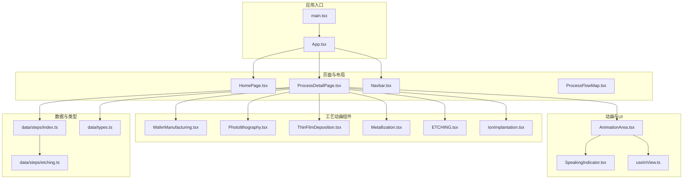
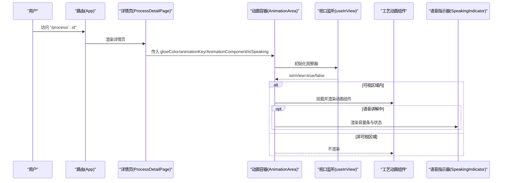
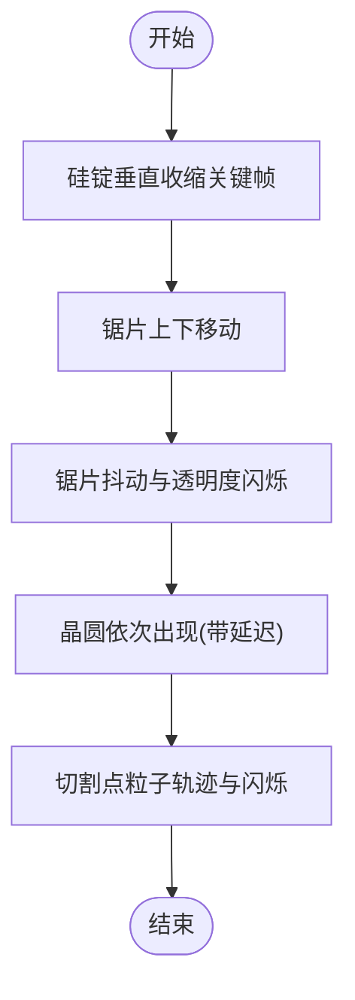
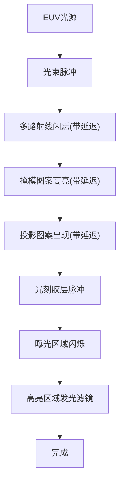
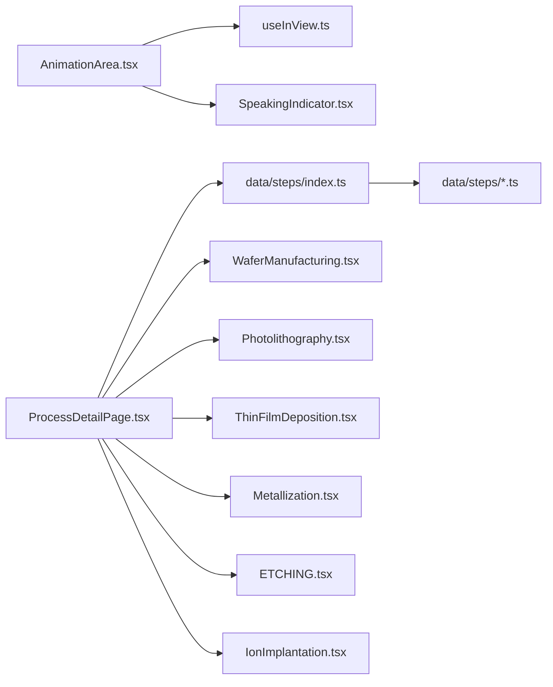

# SVG动画实现

<cite>
**本文引用的文件**
- [src/components/ui/AnimationArea.tsx](file://src/components/ui/AnimationArea.tsx)
- [src/hooks/useInView.ts](file://src/hooks/useInView.ts)
- [src/components/ui/SpeakingIndicator.tsx](file://src/components/ui/SpeakingIndicator.tsx)
- [src/components/process/WaferManufacturing.tsx](file://src/components/process/WaferManufacturing.tsx)
- [src/components/process/Photolithography.tsx](file://src/components/process/Photolithography.tsx)
- [src/components/process/ThinFilmDeposition.tsx](file://src/components/process/ThinFilmDeposition.tsx)
- [src/components/process/Metallization.tsx](file://src/components/process/Metallization.tsx)
- [src/components/process/ETCHING.tsx](file://src/components/process/ETCHING.tsx)
- [src/components/process/IonImplantation.tsx](file://src/components/process/IonImplantation.tsx)
- [src/data/steps/index.ts](file://src/data/steps/index.ts)
- [src/data/steps/etching.ts](file://src/data/steps/etching.ts)
- [src/data/types.ts](file://src/data/types.ts)
- [src/App.tsx](file://src/App.tsx)
- [src/main.tsx](file://src/main.tsx)
</cite>

## 目录
1. [引言](#引言)
2. [项目结构](#项目结构)
3. [核心组件](#核心组件)
4. [架构总览](#架构总览)
5. [详细组件分析](#详细组件分析)
6. [依赖关系分析](#依赖关系分析)
7. [性能考虑](#性能考虑)
8. [故障排除指南](#故障排除指南)
9. [结论](#结论)
10. [附录](#附录)

## 引言
本项目通过SVG在React中实现芯片制造关键工艺步骤的可视化动画，涵盖晶圆制造、光刻、薄膜沉积、刻蚀、离子注入与互连等环节。动画以CSS关键帧驱动，结合渐变、滤镜与动态样式变量，营造真实而富有科技感的制造流程演示。同时，通过视口可见性监听与语音指示器，实现动画的按需播放与用户交互反馈。

## 项目结构
项目采用按功能分层的组织方式：
- 组件层：页面布局、导航、动画区域与UI提示组件
- 工艺组件：每个工艺步骤对应一个独立的SVG动画组件
- 数据层：步骤元数据与异步加载模块索引
- 路由层：基于React Router的页面路由

图表来源
- [src/main.tsx:1-11](file://src/main.tsx#L1-L11)
- [src/App.tsx:1-23](file://src/App.tsx#L1-L23)
- [src/components/ui/AnimationArea.tsx:1-29](file://src/components/ui/AnimationArea.tsx#L1-L29)
- [src/hooks/useInView.ts:1-32](file://src/hooks/useInView.ts#L1-L32)
- [src/components/ui/SpeakingIndicator.tsx:1-28](file://src/components/ui/SpeakingIndicator.tsx#L1-L28)
- [src/components/process/WaferManufacturing.tsx:1-122](file://src/components/process/WaferManufacturing.tsx#L1-L122)
- [src/components/process/Photolithography.tsx:1-136](file://src/components/process/Photolithography.tsx#L1-L136)
- [src/components/process/ThinFilmDeposition.tsx:1-124](file://src/components/process/ThinFilmDeposition.tsx#L1-L124)
- [src/components/process/Metallization.tsx:1-120](file://src/components/process/Metallization.tsx#L1-L120)
- [src/components/process/ETCHING.tsx:1-139](file://src/components/process/ETCHING.tsx#L1-L139)
- [src/components/process/IonImplantation.tsx:1-116](file://src/components/process/IonImplantation.tsx#L1-L116)
- [src/data/steps/index.ts:1-34](file://src/data/steps/index.ts#L1-L34)
- [src/data/steps/etching.ts:1-142](file://src/data/steps/etching.ts#L1-L142)
- [src/data/types.ts:1-33](file://src/data/types.ts#L1-L33)

章节来源
- [src/main.tsx:1-11](file://src/main.tsx#L1-L11)
- [src/App.tsx:1-23](file://src/App.tsx#L1-L23)

## 核心组件
- 动画容器与可见性控制：AnimationArea负责根据视口可见性渲染具体工艺动画组件，并叠加语音指示器；useInView提供阈值与根边距配置，确保滚动到可视区域才触发动画。
- 语音指示器：在讲解模式下显示动态音量条与状态文本，使用CSS动画实现脉冲效果。
- 工艺动画组件：每个步骤以独立SVG组件实现，内部通过CSS关键帧、渐变与滤镜构建层次丰富的动画效果。

章节来源
- [src/components/ui/AnimationArea.tsx:1-29](file://src/components/ui/AnimationArea.tsx#L1-L29)
- [src/hooks/useInView.ts:1-32](file://src/hooks/useInView.ts#L1-L32)
- [src/components/ui/SpeakingIndicator.tsx:1-28](file://src/components/ui/SpeakingIndicator.tsx#L1-L28)

## 架构总览
动画系统围绕“页面详情页 -> 动画容器 -> 视口监听 -> 工艺动画组件”的链路工作。页面详情页根据URL参数加载对应步骤元数据与动画组件，动画容器仅在元素进入视口时挂载组件，避免不必要的渲染开销。语音指示器作为UI提示层，与动画播放状态解耦。

图表来源
- [src/App.tsx:1-23](file://src/App.tsx#L1-L23)
- [src/components/ui/AnimationArea.tsx:1-29](file://src/components/ui/AnimationArea.tsx#L1-L29)
- [src/hooks/useInView.ts:1-32](file://src/hooks/useInView.ts#L1-L32)
- [src/components/ui/SpeakingIndicator.tsx:1-28](file://src/components/ui/SpeakingIndicator.tsx#L1-L28)

## 详细组件分析

### 动画容器与可见性控制
- 关键点
  - 使用IntersectionObserver监听容器元素是否进入视口，阈值可调，根边距支持微调触发时机。
  - 仅当元素可视时渲染动画组件，避免首屏与非可视区域的资源浪费。
  - 支持根据步骤颜色生成背景光晕，提升视觉聚焦。
- 适用场景
  - 长页面中按需播放动画，降低初始渲染压力。
  - 与语音讲解联动，仅在讲解时显示音量指示器。

章节来源
- [src/components/ui/AnimationArea.tsx:1-29](file://src/components/ui/AnimationArea.tsx#L1-L29)
- [src/hooks/useInView.ts:1-32](file://src/hooks/useInView.ts#L1-L32)

### 语音指示器
- 关键点
  - 使用随机高度与延迟序列生成脉冲音量条，模拟真实音频可视化。
  - 通过CSS动画属性实现逐段延迟的闪烁效果，增强节奏感。
- 适用场景
  - 与讲解内容同步显示，提供听觉反馈的视觉化提示。

章节来源
- [src/components/ui/SpeakingIndicator.tsx:1-28](file://src/components/ui/SpeakingIndicator.tsx#L1-L28)

### 晶圆制造（CZ法）
- 动画要点
  - 通过垂直缩放关键帧实现硅锭逐步收缩，模拟拉晶过程。
  - 多组虚线描边动画模拟旋转指示与锯片运动，叠加轻微抖动与透明度闪烁增强真实感。
  - 晶圆堆叠按延迟序列出现，体现连续生产节奏。
  - 切割点粒子轨迹与淡入淡出组合，营造火花效果。
- 技术细节
  - CSS自定义属性用于延迟与持续时间的动态传递，实现多对象错峰播放。
  - 径向渐变与线性渐变结合，塑造材质质感与光泽。

图表来源
- [src/components/process/WaferManufacturing.tsx:1-122](file://src/components/process/WaferManufacturing.tsx#L1-L122)

章节来源
- [src/components/process/WaferManufacturing.tsx:1-122](file://src/components/process/WaferManufacturing.tsx#L1-L122)

### 光刻（EUV极紫外）
- 动画要点
  - 锥形UV光束脉冲闪烁，模拟EUV光源强度变化。
  - 多条射线按不同延迟闪烁，营造阵列曝光效果。
  - 掩模图案与投影图案交替出现，强调图形转移过程。
  - 曝光区域高亮与发光滤镜，突出关键工艺区。
- 技术细节
  - 多动画属性叠加在同一元素上，实现复杂时序组合。
  - 自定义滤镜用于柔化高光，提升视觉层次。

图表来源
- [src/components/process/Photolithography.tsx:1-136](file://src/components/process/Photolithography.tsx#L1-L136)

章节来源
- [src/components/process/Photolithography.tsx:1-136](file://src/components/process/Photolithography.tsx#L1-L136)

### 化学气相沉积（CVD）
- 动画要点
  - 气流管线以虚线与透明度变化模拟气体流动。
  - 分子从上方飘落并沿轨迹下降，结合透明度衰减模拟沉降过程。
  - 多层薄膜按顺序增长，体现逐层构建的工艺节奏。
- 技术细节
  - 使用CSS自定义属性控制每分子的下降时长与起始延迟，形成自然的随机感。
  - 通过transform-origin与scaleY实现从无到有的垂直生长。

章节来源
- [src/components/process/ThinFilmDeposition.tsx:1-124](file://src/components/process/ThinFilmDeposition.tsx#L1-L124)

### 刻蚀（RIE等离子体）
- 动画要点
  - 等离子体区域脉冲闪烁，模拟高能等离子体状态。
  - 粒子在网格中上下浮动，体现等离子体中的活跃状态。
  - 离子束与离子头按序列闪烁，强调定向轰击。
  - 沟槽随时间增长，体现图形转移的完成度。
  - 刻蚀残留颗粒上升消散，表现副产物移除。
- 技术细节
  - 多个关键帧在同一元素上叠加，形成复杂的时序组合。
  - transform-origin与scaleY配合，实现从零到一的几何变化。

章节来源
- [src/components/process/ETCHING.tsx:1-139](file://src/components/process/ETCHING.tsx#L1-L139)

### 离子注入
- 动画要点
  - 加速环阵列按序列闪烁，模拟电场脉冲。
  - 离子束整体脉冲，突出束流强度变化。
  - 束内粒子左右移动并闪烁，体现粒子运动与聚焦状态。
  - 离子聚焦区域高亮，强调能量控制。
  - 硅晶格点阵与注入离子按序列下沉，表现掺杂过程。
- 技术细节
  - 通过CSS自定义属性实现多对象的错峰播放，避免视觉拥挤。
  - 滤镜与透明度组合，增强高能束流的视觉冲击。

章节来源
- [src/components/process/IonImplantation.tsx:1-116](file://src/components/process/IonImplantation.tsx#L1-L116)

### 互连（铜大马士革）
- 动画要点
  - 多层介电层与沟槽结构按层次呈现，体现三维结构。
  - 铜填充与通孔连接按阶段出现，展示工艺步骤。
  - 铜表面扫光效果，模拟抛光后的光泽。
- 技术细节
  - 使用循环生成大量矩形与栅格，通过CSS延迟实现流水线式播放。
  - 渐变填充与透明度控制，突出层次与材质。

章节来源
- [src/components/process/Metallization.tsx:1-120](file://src/components/process/Metallization.tsx#L1-L120)

### 步骤数据与异步加载
- 关键点
  - 通过模块映射与动态import实现按需加载，减少首屏体积。
  - 提供加载全部步骤与单个步骤详情的接口，便于导航与预览。
  - 步骤元数据包含名称、描述、子步骤、讲解文案、颜色与关键指标等，支撑动画容器的外观与语义信息。
- 适用场景
  - 页面详情页根据URL参数动态加载对应步骤的数据与动画组件。

章节来源
- [src/data/steps/index.ts:1-34](file://src/data/steps/index.ts#L1-L34)
- [src/data/steps/etching.ts:1-142](file://src/data/steps/etching.ts#L1-L142)
- [src/data/types.ts:1-33](file://src/data/types.ts#L1-L33)

## 依赖关系分析
- 组件耦合
  - AnimationArea依赖useInView进行可见性判断，依赖SpeakingIndicator进行UI提示。
  - 各工艺动画组件相互独立，仅依赖React与浏览器CSS动画能力。
- 数据耦合
  - 步骤详情页通过steps/index.ts按id动态加载对应步骤模块，模块内部导出ProcessStep类型。
- 外部依赖
  - React Router用于页面路由，React与DOM API用于动画容器与可见性监听。

图表来源
- [src/components/ui/AnimationArea.tsx:1-29](file://src/components/ui/AnimationArea.tsx#L1-L29)
- [src/hooks/useInView.ts:1-32](file://src/hooks/useInView.ts#L1-L32)
- [src/components/ui/SpeakingIndicator.tsx:1-28](file://src/components/ui/SpeakingIndicator.tsx#L1-L28)
- [src/data/steps/index.ts:1-34](file://src/data/steps/index.ts#L1-L34)
- [src/components/process/WaferManufacturing.tsx:1-122](file://src/components/process/WaferManufacturing.tsx#L1-L122)
- [src/components/process/Photolithography.tsx:1-136](file://src/components/process/Photolithography.tsx#L1-L136)
- [src/components/process/ThinFilmDeposition.tsx:1-124](file://src/components/process/ThinFilmDeposition.tsx#L1-L124)
- [src/components/process/Metallization.tsx:1-120](file://src/components/process/Metallization.tsx#L1-L120)
- [src/components/process/ETCHING.tsx:1-139](file://src/components/process/ETCHING.tsx#L1-L139)
- [src/components/process/IonImplantation.tsx:1-116](file://src/components/process/IonImplantation.tsx#L1-L116)

章节来源
- [src/data/steps/index.ts:1-34](file://src/data/steps/index.ts#L1-L34)
- [src/data/types.ts:1-33](file://src/data/types.ts#L1-L33)

## 性能考虑
- 按需渲染
  - 使用IntersectionObserver仅在元素进入视口时渲染动画组件，减少首屏与后台标签页的资源消耗。
- 动画优化
  - 优先使用transform与opacity等可合成属性，避免触发布局与重绘。
  - 合理设置动画时长与缓动函数，避免高频重复动画造成掉帧。
- 结构简化
  - 将多个动画属性叠加在同一元素上时，注意避免过度重叠导致的视觉与性能负担。
- 资源加载
  - 通过动态import按需加载步骤模块，降低初始包体大小。
- 建议
  - 对于密集粒子或复杂滤镜，建议在低性能设备上提供关闭动画的选项或降级方案。

## 故障排除指南
- 动画不播放
  - 检查AnimationArea是否正确传入AnimationComponent与animationKey，确认useInView返回的isInView为true。
  - 确认容器元素可见性阈值与根边距设置合理，避免误判。
- 动画卡顿
  - 检查是否存在过多同时运行的动画，适当延长延迟或减少元素数量。
  - 避免在关键帧中频繁修改布局相关属性（如width、height），尽量使用transform与opacity。
- 语音指示器异常
  - 确认isSpeaking状态正确传递至AnimationArea，检查CSS动画属性是否被其他样式覆盖。
- 路由与数据加载
  - 确认URL中的id与steps/index.ts中的映射一致，检查动态import是否成功解析模块。

章节来源
- [src/components/ui/AnimationArea.tsx:1-29](file://src/components/ui/AnimationArea.tsx#L1-L29)
- [src/hooks/useInView.ts:1-32](file://src/hooks/useInView.ts#L1-L32)
- [src/components/ui/SpeakingIndicator.tsx:1-28](file://src/components/ui/SpeakingIndicator.tsx#L1-L28)
- [src/data/steps/index.ts:1-34](file://src/data/steps/index.ts#L1-L34)

## 结论
本项目以轻量、可维护的方式在React中实现了芯片制造关键工艺的SVG动画演示。通过CSS关键帧与渐变滤镜构建真实感与层次感，结合视口监听与按需加载，兼顾了用户体验与性能表现。未来可在设备能力检测与动画开关控制方面进一步增强，以适配更广泛的终端环境。

## 附录
- 开发技巧
  - 使用CSS自定义属性传递延迟与持续时间，统一管理多对象时序。
  - 将复杂动画拆分为多个关键帧，便于调试与复用。
  - 在动画容器外层添加背景光晕与渐变，提升视觉聚焦。
- 调试工具
  - 浏览器开发者工具的时间轴面板可用于观察关键帧执行情况。
  - 使用性能面板监控动画期间的帧率与重排重绘情况。
- 最佳实践
  - 控制动画数量与频率，避免同时播放过多元素。
  - 为重要元素提供替代静态图层，保证在禁用动画时仍具可读性。
  - 保持颜色与主题一致性，确保动画与整体设计风格协调。