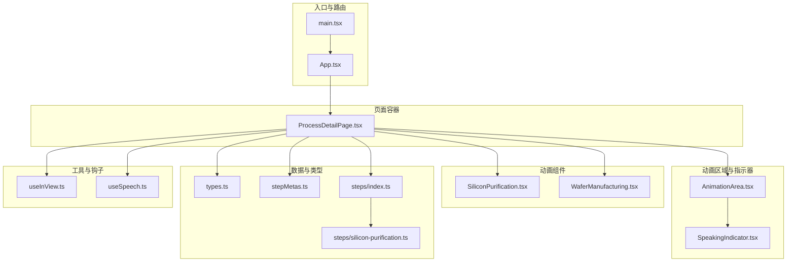
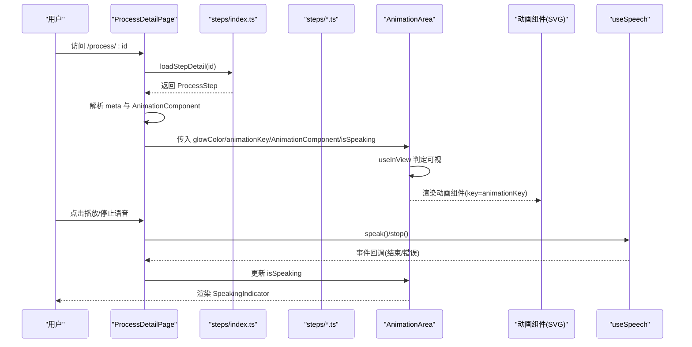
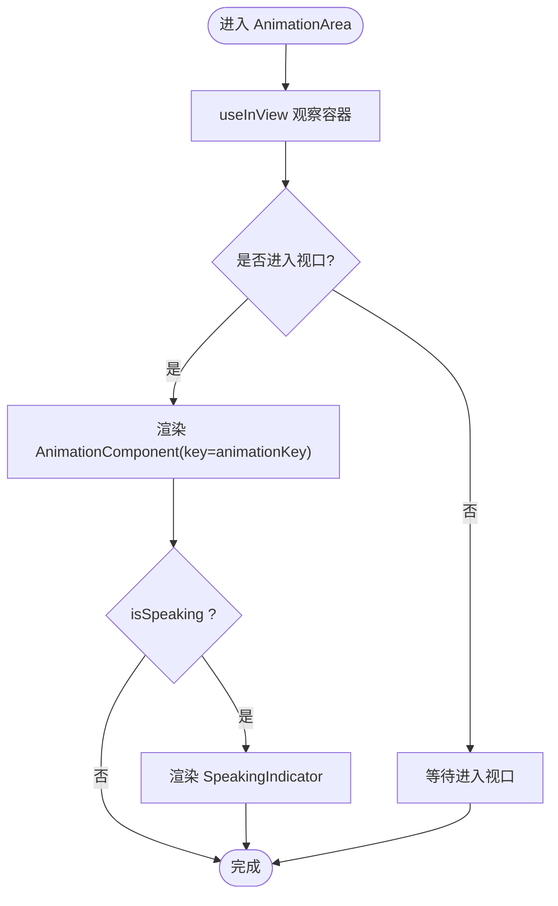
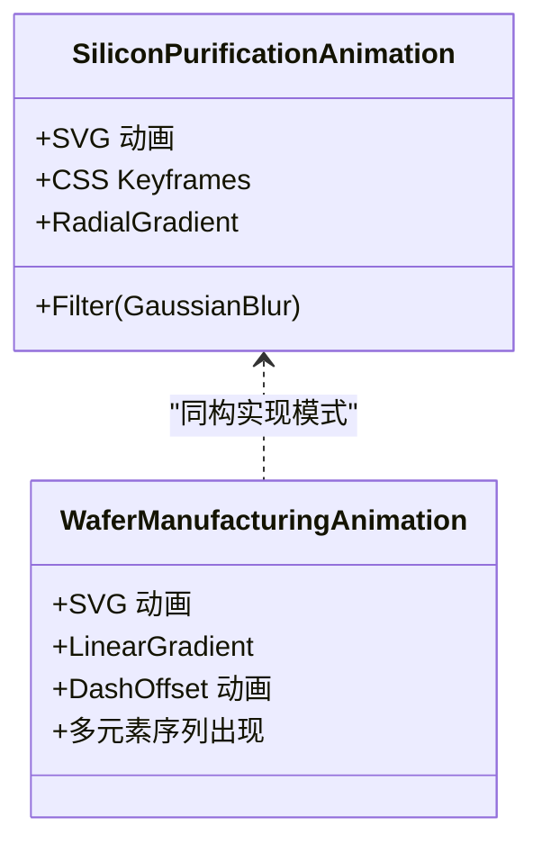
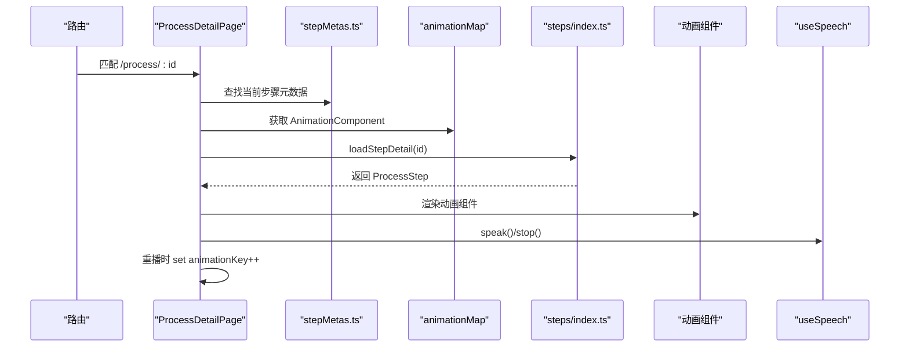
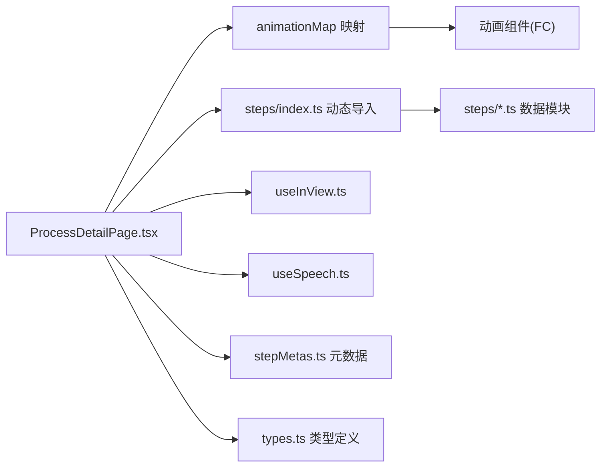

# 动画定制与扩展

<cite>
**本文引用的文件**
- [src/components/ui/AnimationArea.tsx](file://src/components/ui/AnimationArea.tsx)
- [src/components/ui/SpeakingIndicator.tsx](file://src/components/ui/SpeakingIndicator.tsx)
- [src/components/layout/ProcessDetailPage.tsx](file://src/components/layout/ProcessDetailPage.tsx)
- [src/hooks/useInView.ts](file://src/hooks/useInView.ts)
- [src/hooks/useSpeech.ts](file://src/hooks/useSpeech.ts)
- [src/components/process/SiliconPurification.tsx](file://src/components/process/SiliconPurification.tsx)
- [src/components/process/WaferManufacturing.tsx](file://src/components/process/WaferManufacturing.tsx)
- [src/data/types.ts](file://src/data/types.ts)
- [src/data/stepMetas.ts](file://src/data/stepMetas.ts)
- [src/data/steps/index.ts](file://src/data/steps/index.ts)
- [src/data/steps/silicon-purification.ts](file://src/data/steps/silicon-purification.ts)
- [src/App.tsx](file://src/App.tsx)
- [src/main.tsx](file://src/main.tsx)
- [package.json](file://package.json)
</cite>

## 目录
1. [简介](#简介)
2. [项目结构](#项目结构)
3. [核心组件](#核心组件)
4. [架构总览](#架构总览)
5. [详细组件分析](#详细组件分析)
6. [依赖分析](#依赖分析)
7. [性能考虑](#性能考虑)
8. [故障排查指南](#故障排查指南)
9. [结论](#结论)
10. [附录](#附录)

## 简介
本指南面向希望为芯片制造演示项目添加新工艺步骤动画、定制动画参数与主题、扩展动画组件与插件机制的开发者。文档覆盖以下要点：
- 如何为新工艺步骤添加自定义动画效果
- 动画参数配置与主题定制方法
- 动画组件的扩展接口与插件机制
- 动画样式定制与颜色主题配置
- 数据驱动的动画实现方式
- 动画与业务逻辑的集成方法
- 动画扩展的测试策略与验证方法
- 完整开发流程与最佳实践

## 项目结构
项目采用按功能域组织的结构，动画系统由“页面容器 + 动画区域 + 动画组件 + 数据模型 + 语音与可见性钩子”构成。

图表来源
- [src/App.tsx:1-23](file://src/App.tsx#L1-L23)
- [src/main.tsx:1-11](file://src/main.tsx#L1-L11)
- [src/components/layout/ProcessDetailPage.tsx:1-397](file://src/components/layout/ProcessDetailPage.tsx#L1-L397)
- [src/components/ui/AnimationArea.tsx:1-29](file://src/components/ui/AnimationArea.tsx#L1-L29)
- [src/components/ui/SpeakingIndicator.tsx:1-28](file://src/components/ui/SpeakingIndicator.tsx#L1-L28)
- [src/components/process/SiliconPurification.tsx:1-114](file://src/components/process/SiliconPurification.tsx#L1-L114)
- [src/components/process/WaferManufacturing.tsx:1-122](file://src/components/process/WaferManufacturing.tsx#L1-L122)
- [src/data/types.ts:1-33](file://src/data/types.ts#L1-L33)
- [src/data/stepMetas.ts:1-103](file://src/data/stepMetas.ts#L1-L103)
- [src/data/steps/index.ts:1-34](file://src/data/steps/index.ts#L1-L34)
- [src/data/steps/silicon-purification.ts:1-121](file://src/data/steps/silicon-purification.ts#L1-L121)
- [src/hooks/useInView.ts:1-32](file://src/hooks/useInView.ts#L1-L32)
- [src/hooks/useSpeech.ts:1-135](file://src/hooks/useSpeech.ts#L1-L135)

章节来源
- [src/App.tsx:1-23](file://src/App.tsx#L1-L23)
- [src/main.tsx:1-11](file://src/main.tsx#L1-L11)

## 核心组件
- 动画区域容器：负责根据视口可见性渲染动画组件，并叠加“语音讲解中”指示器；通过渐变背景实现“辉光”主题效果。
- 动画组件：以 SVG 为基础，使用 CSS 动画与滤镜实现逐帧或连续动画。
- 页面容器：负责加载步骤详情、管理语音状态、控制动画重播键、维护导航与进度条。
- 可见性钩子：基于 IntersectionObserver 的轻量封装，用于判定动画区域是否进入视口。
- 语音钩子：封装 Web Speech API，自动选择中文自然音色并缓存偏好。

章节来源
- [src/components/ui/AnimationArea.tsx:1-29](file://src/components/ui/AnimationArea.tsx#L1-L29)
- [src/components/ui/SpeakingIndicator.tsx:1-28](file://src/components/ui/SpeakingIndicator.tsx#L1-L28)
- [src/components/layout/ProcessDetailPage.tsx:1-397](file://src/components/layout/ProcessDetailPage.tsx#L1-L397)
- [src/hooks/useInView.ts:1-32](file://src/hooks/useInView.ts#L1-L32)
- [src/hooks/useSpeech.ts:1-135](file://src/hooks/useSpeech.ts#L1-L135)

## 架构总览
动画系统围绕“数据驱动 + 组件化 + 主题化”的设计展开。页面容器根据当前步骤 ID 加载对应动画组件与数据；动画区域根据可见性决定是否渲染；语音模块与动画状态联动。

图表来源
- [src/components/layout/ProcessDetailPage.tsx:36-116](file://src/components/layout/ProcessDetailPage.tsx#L36-L116)
- [src/data/steps/index.ts:16-21](file://src/data/steps/index.ts#L16-L21)
- [src/data/steps/silicon-purification.ts:1-121](file://src/data/steps/silicon-purification.ts#L1-L121)
- [src/components/ui/AnimationArea.tsx:11-28](file://src/components/ui/AnimationArea.tsx#L11-L28)
- [src/hooks/useSpeech.ts:74-112](file://src/hooks/useSpeech.ts#L74-L112)

## 详细组件分析

### 动画区域容器 AnimationArea
- 职责：根据视口可见性渲染动画组件；叠加“语音讲解中”指示器；使用径向渐变实现辉光背景。
- 关键参数：
  - glowColor：辉光背景色，来自步骤元数据。
  - animationKey：用于强制重新挂载动画组件，实现重播。
  - AnimationComponent：当前步骤的动画组件。
  - isSpeaking：控制语音指示器显示。
- 性能注意：useInView 使用阈值与 rootMargin 控制触发时机，避免不必要的渲染。

图表来源
- [src/components/ui/AnimationArea.tsx:11-28](file://src/components/ui/AnimationArea.tsx#L11-L28)
- [src/hooks/useInView.ts:8-31](file://src/hooks/useInView.ts#L8-L31)

章节来源
- [src/components/ui/AnimationArea.tsx:1-29](file://src/components/ui/AnimationArea.tsx#L1-L29)
- [src/hooks/useInView.ts:1-32](file://src/hooks/useInView.ts#L1-L32)

### 动画组件（以 SiliconPurification 为例）
- 实现模式：SVG + CSS 动画 + 滤镜 + 渐变。
- 参数化：通过 CSS 变量与内联样式传递时序与延迟，便于复用与微调。
- 复杂度：O(n) 动画元素，n 为同时参与动画的 SVG 元素数量；渲染开销主要来自动画属性变更与滤镜。
- 扩展建议：将动画时序与参数抽取为配置对象，便于外部注入与主题化。

图表来源
- [src/components/process/SiliconPurification.tsx:1-114](file://src/components/process/SiliconPurification.tsx#L1-L114)
- [src/components/process/WaferManufacturing.tsx:1-122](file://src/components/process/WaferManufacturing.tsx#L1-L122)

章节来源
- [src/components/process/SiliconPurification.tsx:1-114](file://src/components/process/SiliconPurification.tsx#L1-L114)
- [src/components/process/WaferManufacturing.tsx:1-122](file://src/components/process/WaferManufacturing.tsx#L1-L122)

### 页面容器 ProcessDetailPage
- 数据加载：通过 steps/index.ts 的动态导入加载步骤详情与全量步骤，计算企业参与次数。
- 动画映射：根据步骤 ID 在 animationMap 中查找对应动画组件。
- 语音控制：调用 useSpeech 管理播放/停止；监听语音结束事件更新状态；重播时重置 animationKey 并停止语音。
- 主题联动：从步骤元数据读取 color/glowColor，用于边框、阴影与辉光背景。

图表来源
- [src/components/layout/ProcessDetailPage.tsx:36-116](file://src/components/layout/ProcessDetailPage.tsx#L36-L116)
- [src/data/stepMetas.ts:11-103](file://src/data/stepMetas.ts#L11-L103)
- [src/data/steps/index.ts:3-33](file://src/data/steps/index.ts#L3-L33)

章节来源
- [src/components/layout/ProcessDetailPage.tsx:1-397](file://src/components/layout/ProcessDetailPage.tsx#L1-L397)
- [src/data/stepMetas.ts:1-103](file://src/data/stepMetas.ts#L1-L103)
- [src/data/steps/index.ts:1-34](file://src/data/steps/index.ts#L1-L34)

### 语音与可见性钩子
- useSpeech：自动评分并选择中文自然音色，缓存偏好；提供 speak/stop/getAvailableVoices/setPreferredVoice。
- useInView：基于 IntersectionObserver 的通用钩子，支持阈值与根边距配置。

章节来源
- [src/hooks/useSpeech.ts:1-135](file://src/hooks/useSpeech.ts#L1-L135)
- [src/hooks/useInView.ts:1-32](file://src/hooks/useInView.ts#L1-L32)

### 数据模型与主题
- ProcessStep：包含 id/name/icon/color/glowColor/narration/keyMetrics/companies/subSteps 等字段。
- stepMetas：提供步骤元信息（含颜色与辉光色），作为主题与导航的基础。
- 数据驱动：页面容器通过动态导入加载步骤详情，实现“数据即配置”的动画与文案联动。

章节来源
- [src/data/types.ts:19-32](file://src/data/types.ts#L19-L32)
- [src/data/stepMetas.ts:1-103](file://src/data/stepMetas.ts#L1-L103)
- [src/data/steps/silicon-purification.ts:3-25](file://src/data/steps/silicon-purification.ts#L3-L25)

## 依赖分析
- 组件耦合：页面容器对动画组件采用字符串映射与动态导入，降低直接耦合；动画区域对动画组件采用函数式组件传入，保持松耦合。
- 外部依赖：React 生态、Tailwind CSS、Lucide 图标、Web Speech API、IntersectionObserver。
- 插件机制：通过 steps/index.ts 的模块映射与 ProcessDetailPage 的 animationMap，新增步骤只需在两处注册即可启用。

图表来源
- [src/components/layout/ProcessDetailPage.tsx:23-34](file://src/components/layout/ProcessDetailPage.tsx#L23-L34)
- [src/data/steps/index.ts:3-14](file://src/data/steps/index.ts#L3-L14)
- [src/data/stepMetas.ts:1-103](file://src/data/stepMetas.ts#L1-L103)
- [src/data/types.ts:19-32](file://src/data/types.ts#L19-L32)

章节来源
- [src/components/layout/ProcessDetailPage.tsx:23-34](file://src/components/layout/ProcessDetailPage.tsx#L23-L34)
- [src/data/steps/index.ts:1-34](file://src/data/steps/index.ts#L1-L34)
- [src/data/stepMetas.ts:1-103](file://src/data/stepMetas.ts#L1-L103)
- [src/data/types.ts:1-33](file://src/data/types.ts#L1-L33)

## 性能考虑
- 可见性渲染：通过 useInView 控制动画组件渲染时机，减少非可视区域的动画开销。
- 动画重播：通过 animationKey 强制重新挂载，确保状态归零；同时停止语音避免资源竞争。
- 动画复杂度：SVG 动画与滤镜会带来一定 GPU/CPU 压力，建议：
  - 合理设置动画时长与缓动，避免过多元素同时动画；
  - 对高频属性（如 transform/opacity）优先使用 GPU 加速；
  - 在移动端适当简化粒子或滤镜效果。
- 语音与动画同步：避免在语音播放期间进行大规模 DOM 变更，必要时暂停动画或降低帧率。

[本节为通用指导，无需列出章节来源]

## 故障排查指南
- 动画不显示
  - 检查 AnimationArea 是否处于可视范围；调整 useInView 的阈值或 rootMargin。
  - 确认 animationKey 是否变化导致组件卸载后重新挂载。
- 动画重播无效
  - 确保点击重播按钮后 animationKey 自增；同时调用 stop() 并重置 isSpeaking。
- 语音无法播放
  - 浏览器环境需支持 Web Speech API；检查浏览器权限与音色可用性。
  - 若首次加载无音色，等待 onvoiceschanged 事件后再尝试 speak。
- 主题色不生效
  - 确认步骤元数据中的 color/glowColor 字段正确；检查 CSS 变量与内联样式的拼接。
- 新增步骤动画未显示
  - 确认在 animationMap 与 steps/index.ts 中均已注册；检查步骤 ID 与文件名一致。

章节来源
- [src/components/ui/AnimationArea.tsx:11-28](file://src/components/ui/AnimationArea.tsx#L11-L28)
- [src/components/layout/ProcessDetailPage.tsx:93-116](file://src/components/layout/ProcessDetailPage.tsx#L93-L116)
- [src/hooks/useSpeech.ts:74-112](file://src/hooks/useSpeech.ts#L74-L112)
- [src/data/stepMetas.ts:11-103](file://src/data/stepMetas.ts#L11-L103)
- [src/data/steps/index.ts:3-14](file://src/data/steps/index.ts#L3-L14)

## 结论
本项目以“数据驱动 + 组件化 + 主题化”为核心，实现了可扩展的动画系统。通过清晰的映射与钩子抽象，开发者可以低成本地为新工艺步骤添加动画，并以统一的主题与语音体验增强展示效果。建议在扩展时遵循“参数化配置 + 最小耦合 + 可观测性”的原则，确保动画在不同设备与浏览器上的稳定性与一致性。

[本节为总结性内容，无需列出章节来源]

## 附录

### 开发流程（新增工艺步骤动画）
- 准备数据
  - 在 data/steps 下新增步骤数据模块，定义 ProcessStep 字段（含 id/name/icon/color/glowColor/narration/keyMetrics/companies/subSteps）。
  - 在 data/stepMetas.ts 中补充步骤元信息（含颜色与辉光色）。
- 编写动画组件
  - 在 components/process 下新增动画组件（建议以步骤 id 命名），使用 SVG + CSS 动画实现。
  - 将动画参数（如时长、延迟、颜色）尽量以 CSS 变量或内联样式暴露，便于主题化。
- 注册映射
  - 在 ProcessDetailPage 的 animationMap 中添加 id 到组件的映射。
  - 在 steps/index.ts 的 stepModules 中添加动态导入映射。
- 集成页面
  - 页面容器会自动根据 id 加载数据与组件；确保 color/glowColor 正确传入 AnimationArea。
- 语音联动
  - 使用 useSpeech 控制播放/停止；在重播时重置 animationKey 并停止语音。
- 主题与样式
  - 使用步骤元数据的颜色值控制边框、阴影与辉光背景；必要时在组件内部使用 CSS 变量实现局部主题化。
- 测试与验证
  - 可视性测试：在不同屏幕尺寸下验证 useInView 的触发时机。
  - 动画重播：验证 animationKey 变化后组件完全重置。
  - 语音测试：验证音色选择、播放/停止与结束事件回调。
  - 跨浏览器：在支持 Web Speech API 的浏览器中验证音色可用性与播放流畅度。
  - 性能测试：在低端设备上评估动画帧率与内存占用，必要时简化滤镜与粒子数量。

章节来源
- [src/data/steps/silicon-purification.ts:3-25](file://src/data/steps/silicon-purification.ts#L3-L25)
- [src/data/stepMetas.ts:11-103](file://src/data/stepMetas.ts#L11-L103)
- [src/components/process/SiliconPurification.tsx:1-114](file://src/components/process/SiliconPurification.tsx#L1-L114)
- [src/components/layout/ProcessDetailPage.tsx:23-34](file://src/components/layout/ProcessDetailPage.tsx#L23-L34)
- [src/data/steps/index.ts:3-14](file://src/data/steps/index.ts#L3-L14)
- [src/hooks/useSpeech.ts:74-112](file://src/hooks/useSpeech.ts#L74-L112)

### 动画参数配置与主题定制清单
- 步骤元数据
  - id/name/nameEn/description/icon/color/glowColor
- 动画组件
  - CSS 变量：如 --dur/--delay，便于外部注入
  - 内联样式：如 transform/opacity/filter，便于主题化
- 动画区域
  - glowColor：辉光背景色
  - animationKey：重播控制
  - isSpeaking：语音指示器开关
- 语音模块
  - 语言：zh-CN
  - 速率/音高/音量：可调参数
  - 音色偏好：本地存储缓存

章节来源
- [src/data/types.ts:19-32](file://src/data/types.ts#L19-L32)
- [src/data/stepMetas.ts:11-103](file://src/data/stepMetas.ts#L11-L103)
- [src/components/ui/AnimationArea.tsx:11-28](file://src/components/ui/AnimationArea.tsx#L11-L28)
- [src/hooks/useSpeech.ts:84-87](file://src/hooks/useSpeech.ts#L84-L87)

### 动画组件扩展接口与插件机制
- 接口约定
  - 动画组件为无状态函数式组件，接收空 props 或以 CSS 变量/内联样式为输入。
- 插件机制
  - 通过 steps/index.ts 的动态导入与 ProcessDetailPage 的 animationMap 实现“声明式插件注册”。
- 扩展建议
  - 将动画时序与参数抽取为配置对象，便于外部注入与主题化。
  - 提供统一的动画生命周期回调（开始/结束/暂停），便于与语音与导航联动。

章节来源
- [src/data/steps/index.ts:3-14](file://src/data/steps/index.ts#L3-L14)
- [src/components/layout/ProcessDetailPage.tsx:23-34](file://src/components/layout/ProcessDetailPage.tsx#L23-L34)

### 动画样式定制与颜色主题配置
- 步骤级主题
  - color：主色调，用于边框、标签、数值强调
  - glowColor：辉光背景色，用于 AnimationArea 的径向渐变
- 组件级主题
  - 使用 CSS 变量或内联样式引用步骤颜色，实现局部主题化
- 语音指示器
  - 使用 primary 色系与模糊背景，保证在不同辉光背景下可读性

章节来源
- [src/data/types.ts:28-31](file://src/data/types.ts#L28-L31)
- [src/components/ui/AnimationArea.tsx:18-20](file://src/components/ui/AnimationArea.tsx#L18-L20)
- [src/components/ui/SpeakingIndicator.tsx:10-26](file://src/components/ui/SpeakingIndicator.tsx#L10-L26)

### 数据驱动的动画实现方式
- 数据来源
  - 步骤详情：动态导入 steps/*.ts
  - 步骤元数据：stepMetas.ts
- 实现要点
  - 页面容器根据 id 选择动画组件与数据
  - 动画组件内部通过 CSS 变量与内联样式消费主题与参数
  - 语音讲解文本与动画同步，通过 isSpeaking 控制指示器

章节来源
- [src/data/steps/index.ts:16-33](file://src/data/steps/index.ts#L16-L33)
- [src/data/stepMetas.ts:11-103](file://src/data/stepMetas.ts#L11-L103)
- [src/components/layout/ProcessDetailPage.tsx:57-67](file://src/components/layout/ProcessDetailPage.tsx#L57-L67)

### 动画与业务逻辑的集成方法
- 导航与进度
  - 使用 ProcessNavigation 与 ProgressBar 展示步骤导航与进度
- 企业与指标
  - 通过 CompanySection 与 keyMetrics 展示相关企业与关键指标
- 语音与动画
  - 通过 useSpeech 与 AnimationArea 的 isSpeaking 协同，实现讲解与动画的视觉反馈

章节来源
- [src/components/layout/ProcessDetailPage.tsx:1-397](file://src/components/layout/ProcessDetailPage.tsx#L1-L397)
- [src/hooks/useSpeech.ts:1-135](file://src/hooks/useSpeech.ts#L1-L135)

### 动画扩展的测试策略与验证方法
- 单元级
  - 动画组件：验证关键帧是否按预期执行，参数化输入是否正确生效
  - 钩子：useInView 的阈值与 rootMargin 行为；useSpeech 的音色选择与播放/停止
- 集成级
  - 页面容器：验证动态导入、animationMap 与 animationKey 的联动
  - 主题：验证 color/glowColor 在不同组件中的传播
- 端到端
  - 用户操作：进入步骤 → 触发可见性 → 渲染动画 → 点击语音 → 重播动画 → 验证状态归零
  - 跨浏览器：在支持 Web Speech API 的浏览器中验证音色可用性与播放流畅度

章节来源
- [src/components/ui/AnimationArea.tsx:11-28](file://src/components/ui/AnimationArea.tsx#L11-L28)
- [src/components/layout/ProcessDetailPage.tsx:93-116](file://src/components/layout/ProcessDetailPage.tsx#L93-L116)
- [src/hooks/useSpeech.ts:74-112](file://src/hooks/useSpeech.ts#L74-L112)