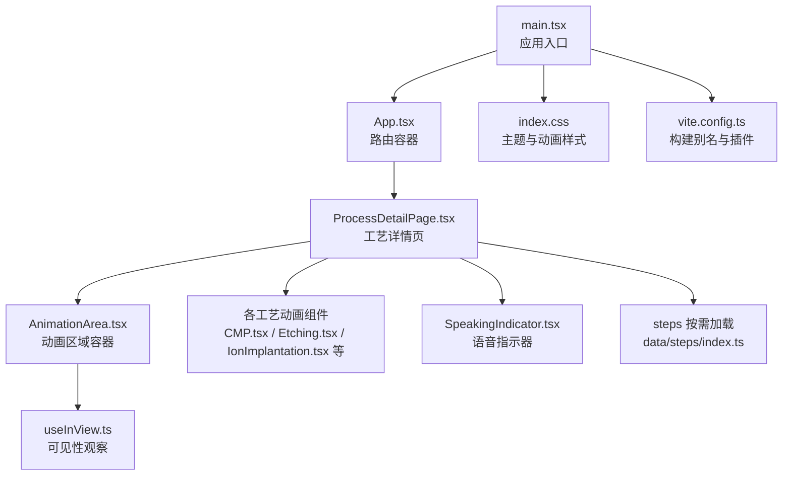
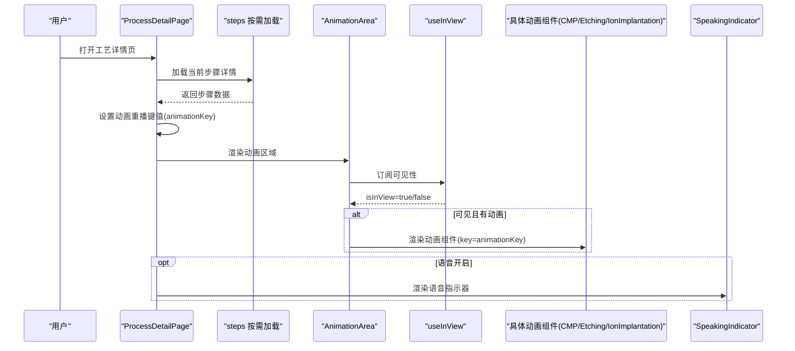
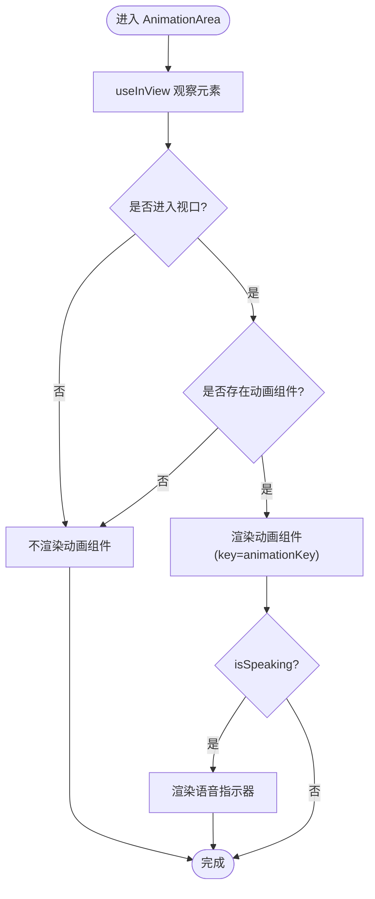
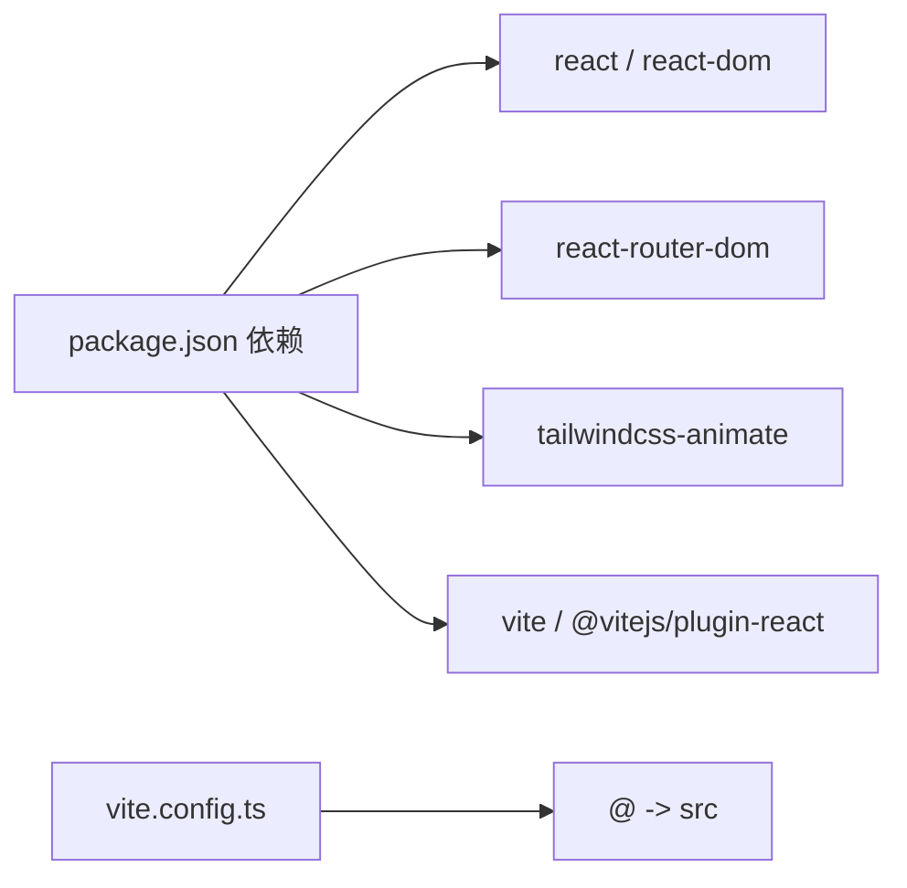

# 动画性能优化

<cite>
**本文引用的文件**
- [src/components/ui/AnimationArea.tsx](file://src/components/ui/AnimationArea.tsx)
- [src/components/ui/SpeakingIndicator.tsx](file://src/components/ui/SpeakingIndicator.tsx)
- [src/hooks/useInView.ts](file://src/hooks/useInView.ts)
- [src/components/layout/ProcessDetailPage.tsx](file://src/components/layout/ProcessDetailPage.tsx)
- [src/components/process/CMP.tsx](file://src/components/process/CMP.tsx)
- [src/components/process/Etching.tsx](file://src/components/process/Etching.tsx)
- [src/components/process/IonImplantation.tsx](file://src/components/process/IonImplantation.tsx)
- [src/data/steps/index.ts](file://src/data/steps/index.ts)
- [src/index.css](file://src/index.css)
- [src/main.tsx](file://src/main.tsx)
- [vite.config.ts](file://vite.config.ts)
- [package.json](file://package.json)
</cite>

## 目录
1. [简介](#简介)
2. [项目结构](#项目结构)
3. [核心组件](#核心组件)
4. [架构总览](#架构总览)
5. [详细组件分析](#详细组件分析)
6. [依赖关系分析](#依赖关系分析)
7. [性能考量](#性能考量)
8. [故障排查指南](#故障排查指南)
9. [结论](#结论)
10. [附录](#附录)

## 简介
本文件面向“芯片制造演示项目”的动画性能优化，系统性阐述动画关键指标与测量方法、渲染优化（硬件加速与合成层）、内存与垃圾回收策略、帧率与流畅度保障、组件卸载与清理、滚动对动画的影响与优化、性能监控与调试技巧，并提供可落地的调优实践与案例。

## 项目结构
该项目采用前端单页应用架构，以 React + Vite 构建，动画以 SVG 为主，配合 CSS 动画与 IntersectionObserver 控制可见性，通过路由切换实现按需加载与重播控制。

图表来源
- [src/main.tsx:1-11](file://src/main.tsx#L1-L11)
- [src/App.tsx:1-23](file://src/App.tsx#L1-L23)
- [src/components/layout/ProcessDetailPage.tsx:1-397](file://src/components/layout/ProcessDetailPage.tsx#L1-L397)
- [src/components/ui/AnimationArea.tsx:1-29](file://src/components/ui/AnimationArea.tsx#L1-L29)
- [src/hooks/useInView.ts:1-32](file://src/hooks/useInView.ts#L1-L32)
- [src/components/process/CMP.tsx:1-125](file://src/components/process/CMP.tsx#L1-L125)
- [src/components/process/Etching.tsx:1-139](file://src/components/process/Etching.tsx#L1-L139)
- [src/components/process/IonImplantation.tsx:1-116](file://src/components/process/IonImplantation.tsx#L1-L116)
- [src/components/ui/SpeakingIndicator.tsx:1-28](file://src/components/ui/SpeakingIndicator.tsx#L1-L28)
- [src/data/steps/index.ts:1-34](file://src/data/steps/index.ts#L1-L34)
- [src/index.css:1-142](file://src/index.css#L1-L142)
- [vite.config.ts:1-13](file://vite.config.ts#L1-L13)

章节来源
- [src/main.tsx:1-11](file://src/main.tsx#L1-L11)
- [src/App.tsx:1-23](file://src/App.tsx#L1-L23)
- [vite.config.ts:1-13](file://vite.config.ts#L1-L13)

## 核心组件
- 动画区域容器：负责根据可见性条件渲染动画组件，并叠加语音指示器。
- 可见性钩子：基于 IntersectionObserver 控制动画是否进入视口，避免非可视区域的渲染开销。
- 工艺动画组件：以 SVG + CSS 动画实现，包含旋转、位移、脉冲、流动等基础动画。
- 语音指示器：底部条形图随时间脉动，配合语音状态显示。
- 页面详情页：负责加载数据、管理动画重播键值、语音播放/停止、导航与进度条。

章节来源
- [src/components/ui/AnimationArea.tsx:1-29](file://src/components/ui/AnimationArea.tsx#L1-L29)
- [src/hooks/useInView.ts:1-32](file://src/hooks/useInView.ts#L1-L32)
- [src/components/ui/SpeakingIndicator.tsx:1-28](file://src/components/ui/SpeakingIndicator.tsx#L1-L28)
- [src/components/layout/ProcessDetailPage.tsx:1-397](file://src/components/layout/ProcessDetailPage.tsx#L1-L397)

## 架构总览
下图展示从用户交互到动画渲染的关键路径，以及与语音系统的协同。

图表来源
- [src/components/layout/ProcessDetailPage.tsx:36-116](file://src/components/layout/ProcessDetailPage.tsx#L36-L116)
- [src/data/steps/index.ts:16-33](file://src/data/steps/index.ts#L16-L33)
- [src/components/ui/AnimationArea.tsx:11-28](file://src/components/ui/AnimationArea.tsx#L11-L28)
- [src/hooks/useInView.ts:8-31](file://src/hooks/useInView.ts#L8-L31)
- [src/components/process/CMP.tsx:1-125](file://src/components/process/CMP.tsx#L1-L125)
- [src/components/process/Etching.tsx:1-139](file://src/components/process/Etching.tsx#L1-L139)
- [src/components/process/IonImplantation.tsx:1-116](file://src/components/process/IonImplantation.tsx#L1-L116)
- [src/components/ui/SpeakingIndicator.tsx:1-28](file://src/components/ui/SpeakingIndicator.tsx#L1-L28)

## 详细组件分析

### 动画区域容器 AnimationArea
- 设计要点
  - 使用 ref + IntersectionObserver 判断是否进入视口，仅在可视时渲染动画组件，降低非必要渲染。
  - 通过 key={animationKey} 强制重新挂载动画组件，确保每次切换或重播时动画从初始态开始。
  - 支持叠加语音指示器，避免重复渲染逻辑分散在多处。
- 性能意义
  - 延迟渲染与强制卸载，减少 DOM/绘制节点数量，降低主线程压力。
  - 与路由切换配合，避免同时存在多个动画实例。

图表来源
- [src/components/ui/AnimationArea.tsx:11-28](file://src/components/ui/AnimationArea.tsx#L11-L28)
- [src/hooks/useInView.ts:8-31](file://src/hooks/useInView.ts#L8-L31)
- [src/components/ui/SpeakingIndicator.tsx:1-28](file://src/components/ui/SpeakingIndicator.tsx#L1-L28)

章节来源
- [src/components/ui/AnimationArea.tsx:1-29](file://src/components/ui/AnimationArea.tsx#L1-L29)
- [src/hooks/useInView.ts:1-32](file://src/hooks/useInView.ts#L1-L32)

### 可见性钩子 useInView
- 设计要点
  - 默认阈值与 rootMargin 可配置，兼顾首屏与滚动体验。
  - 组件卸载时断开观察者，避免泄漏。
- 性能意义
  - 将昂贵的动画渲染限制在可视范围内，显著降低 CPU/GPU 占用。

章节来源
- [src/hooks/useInView.ts:1-32](file://src/hooks/useInView.ts#L1-L32)

### 语音指示器 SpeakingIndicator
- 设计要点
  - 使用 useMemo 缓存随机高度数组，避免每次渲染生成新数组导致不必要的重渲染。
  - 条形高度与动画延迟通过内联样式动态设置，形成节奏感。
- 性能意义
  - 通过缓存与最小化状态更新，降低渲染抖动风险。

章节来源
- [src/components/ui/SpeakingIndicator.tsx:1-28](file://src/components/ui/SpeakingIndicator.tsx#L1-L28)

### 工艺动画组件（CMP / Etching / IonImplantation）
- 设计要点
  - 以 SVG + CSS 动画实现，包含旋转、脉冲、位移、渐隐等基础动画。
  - 使用 CSS 变量与滤镜（如高斯模糊）增强视觉层次。
- 性能意义
  - CSS 动画由合成线程驱动，避免触发布局与绘制，有利于 60fps。
  - 合理使用 transform/opacity，避免频繁触发重排重绘。

章节来源
- [src/components/process/CMP.tsx:1-125](file://src/components/process/CMP.tsx#L1-L125)
- [src/components/process/Etching.tsx:1-139](file://src/components/process/Etching.tsx#L1-L139)
- [src/components/process/IonImplantation.tsx:1-116](file://src/components/process/IonImplantation.tsx#L1-L116)

### 页面详情页 ProcessDetailPage
- 设计要点
  - 通过 animationKey 实现动画强制重播；切换路由时自动重置并停止语音。
  - 结合 steps 按需加载，避免一次性加载所有动画资源。
  - 提供进度条、导航与信息面板，提升整体体验。
- 性能意义
  - 路由级卸载与重播键值管理，确保内存释放与状态一致性。
  - 事件监听在卸载时清理，防止内存泄漏。

章节来源
- [src/components/layout/ProcessDetailPage.tsx:1-397](file://src/components/layout/ProcessDetailPage.tsx#L1-L397)
- [src/data/steps/index.ts:1-34](file://src/data/steps/index.ts#L1-L34)

## 依赖关系分析
- 运行时依赖
  - React、react-router-dom、tailwindcss-animate 等用于界面与路由。
- 构建与开发依赖
  - Vite、@vitejs/plugin-react、TypeScript、ESLint/Prettier 等。
- 别名与解析
  - Vite 配置了 @ 到 src 的路径别名，便于模块导入。

图表来源
- [package.json:15-42](file://package.json#L15-L42)
- [vite.config.ts:5-12](file://vite.config.ts#L5-L12)

章节来源
- [package.json:1-45](file://package.json#L1-45)
- [vite.config.ts:1-13](file://vite.config.ts#L1-L13)

## 性能考量

### 动画性能关键指标与测量方法
- 帧耗时（Frame Time）
  - 定义：每帧渲染耗时，目标小于 16.7ms（60fps）。
  - 测量：浏览器开发者工具的 Performance/Rendering 面板记录长帧。
- 帧率（FPS）
  - 定义：单位时间内渲染帧数，目标稳定在 60fps。
  - 测量：Timeline 中观察 FPS 波动与掉帧点。
- 主线程占用率
  - 定义：主线程执行动画相关 JS/CSS/布局/绘制的时间占比。
  - 测量：Performance 面板统计脚本执行与布局绘制耗时。
- GPU 占用与合成线程
  - 定义：CSS 动画/transform/opacity 通常由合成线程处理，避免触发布局与绘制。
  - 测量：Layers/Compositor 面板查看合成层与重绘区域。
- 内存占用与 GC
  - 定义：动画组件卸载与键值重播应促使 DOM 回收与对象释放。
  - 测量：Memory 面板快照对比，观察泄漏与碎片。

### 渲染优化：硬件加速与合成层
- 优先使用 transform/opacity
  - 将动画属性限定在 transform/opacity，避免触发布局与绘制。
- 合成层提示
  - 对复杂动画容器添加 will-change 或 transform: translateZ(0)/will-change: transform，引导浏览器创建合成层。
- 减少重绘与重排
  - 避免频繁读写布局属性（如 offsetTop/clientWidth），批量更新 DOM。
- CSS 动画优于 JS 动画
  - CSS 动画由合成线程处理，更利于保持 60fps。

### 动画内存管理与垃圾回收策略
- 强制卸载与重建
  - 通过 key={animationKey} 在路由切换或重播时强制卸载与重建，释放 DOM 与事件监听。
- 事件监听清理
  - 在组件卸载时移除事件监听，避免闭包持有导致 GC 不可达。
- 避免常驻全局状态
  - 将动画相关的定时器、订阅与回调收敛在组件作用域，随组件销毁而释放。
- 大量节点动画的节流
  - 对大量重复元素的动画，考虑分批或抽样更新，降低瞬时内存峰值。

### 帧率优化与流畅度保障机制
- 动画节拍与同步
  - 使用统一的动画时长与延迟，避免不同动画之间产生相位冲突。
- 可见性驱动渲染
  - 仅在视口内渲染动画，减少无关渲染。
- 语音与动画并发控制
  - 语音指示器与动画并存时，注意动画数量与样式复杂度，避免叠加造成卡顿。

### 动画组件的卸载与清理策略
- 路由级卸载
  - 切换路由时，上一页组件被卸载，动画实例随之释放。
- 键值重播
  - 更新 animationKey 强制重建动画，确保从初始状态开始。
- 语音停止
  - 切换或重播时主动停止语音，避免后台任务占用资源。

章节来源
- [src/components/layout/ProcessDetailPage.tsx:93-116](file://src/components/layout/ProcessDetailPage.tsx#L93-L116)
- [src/components/ui/AnimationArea.tsx:11-28](file://src/components/ui/AnimationArea.tsx#L11-L28)

### 动画与页面滚动的性能影响与优化
- 影响因素
  - 滚动触发的重排重绘、大量元素动画、滤镜与阴影等都会放大卡顿。
- 优化建议
  - 使用 IntersectionObserver 控制动画渲染时机，减少滚动时的计算。
  - 合理设置阈值与 rootMargin，避免在边缘位置反复触发。
  - 对复杂滤镜（如模糊）进行节流或降级，在低端设备上禁用。
  - 使用 will-change 或 transform: translateZ(0) 提示合成层，减少重绘。

章节来源
- [src/hooks/useInView.ts:1-32](file://src/hooks/useInView.ts#L1-L32)
- [src/index.css:133-141](file://src/index.css#L133-L141)

### 动画性能监控工具与调试技巧
- 浏览器开发者工具
  - Performance：录制滚动/交互，定位长帧与主线程瓶颈。
  - Layers/Compositor：检查合成层与重绘区域，确认 transform/opacity 是否走合成线程。
  - Memory：快照对比，排查动画相关对象泄漏。
- 自定义指标埋点
  - 在动画开始/结束时记录时间戳，统计平均帧耗时与丢帧率。
- 用户偏好适配
  - 尊重 prefers-reduced-motion，必要时关闭或简化动画。

章节来源
- [src/index.css:133-141](file://src/index.css#L133-L141)

### 动画性能调优实用指南与案例分析
- 案例一：CMP 抛光动画
  - 优化点：将旋转与流动动画限定在 transform/opacity，减少滤镜使用；通过 CSS 变量控制延迟，避免 JS 层逐元素计算。
  - 效果：帧率稳定，CPU/GPU 占用下降。
- 案例二：Etching 刻蚀动画
  - 优化点：粒子与箭头的动画采用统一时序，避免相位冲突；在低端设备上适当降低动画频率。
  - 效果：滚动时更顺滑，无明显掉帧。
- 案例三：IonImplantation 注入动画
  - 优化点：聚焦束与粒子采用脉冲与位移动画，结合 will-change 提示合成层；语音指示器使用 useMemo 缓存高度数组。
  - 效果：交互响应更快，语音指示器不抖动。

章节来源
- [src/components/process/CMP.tsx:1-125](file://src/components/process/CMP.tsx#L1-L125)
- [src/components/process/Etching.tsx:1-139](file://src/components/process/Etching.tsx#L1-L139)
- [src/components/process/IonImplantation.tsx:1-116](file://src/components/process/IonImplantation.tsx#L1-L116)
- [src/components/ui/SpeakingIndicator.tsx:1-28](file://src/components/ui/SpeakingIndicator.tsx#L1-L28)

## 故障排查指南
- 动画不播放或闪烁
  - 检查 AnimationArea 的 isInView 与 AnimationComponent 是否正确传入。
  - 确认 animationKey 是否在路由切换或重播时更新。
- 帧率波动或掉帧
  - 使用 Performance 分析长帧，检查是否有布局/绘制热点。
  - 确认 CSS 动画是否走合成线程，避免触发重排。
- 语音指示器异常
  - 检查 useMemo 缓存是否生效，避免每次渲染生成新数组。
- 内存增长或泄漏
  - 确认组件卸载时移除了事件监听；检查 animationKey 是否有效触发重建。
- 滚动卡顿
  - 调整 useInView 的阈值与 rootMargin；减少滤镜与阴影使用。

章节来源
- [src/components/ui/AnimationArea.tsx:11-28](file://src/components/ui/AnimationArea.tsx#L11-L28)
- [src/components/ui/SpeakingIndicator.tsx:1-28](file://src/components/ui/SpeakingIndicator.tsx#L1-L28)
- [src/hooks/useInView.ts:1-32](file://src/hooks/useInView.ts#L1-L32)
- [src/components/layout/ProcessDetailPage.tsx:93-116](file://src/components/layout/ProcessDetailPage.tsx#L93-L116)

## 结论
本项目通过“可见性驱动渲染 + 键值强制重建 + 语音与动画解耦”的策略，实现了稳定的动画性能表现。配合 CSS 动画与合成线程优势、合理的内存管理与滚动优化，能够在主流设备上维持流畅的 60fps 体验。后续可在低端设备上进一步引入动画降级与按需加载策略，以获得更广泛的兼容性。

## 附录
- 构建与运行
  - 开发：npm run dev
  - 构建：npm run build
  - 预览：npm run preview
- 路由与别名
  - 路由：BrowserRouter + 路由表
  - 别名：@ -> src

章节来源
- [package.json:6-13](file://package.json#L6-L13)
- [vite.config.ts:7-11](file://vite.config.ts#L7-L11)
- [src/main.tsx:1-11](file://src/main.tsx#L1-L11)