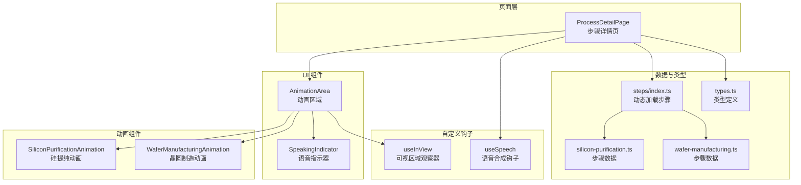
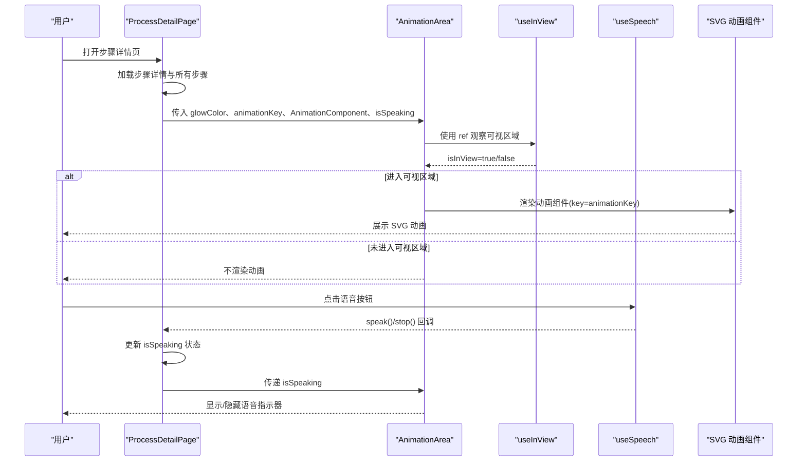
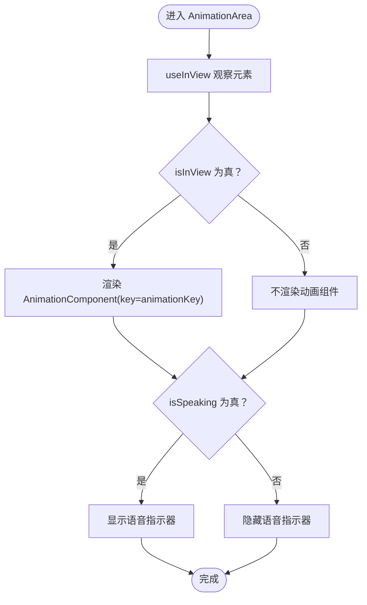
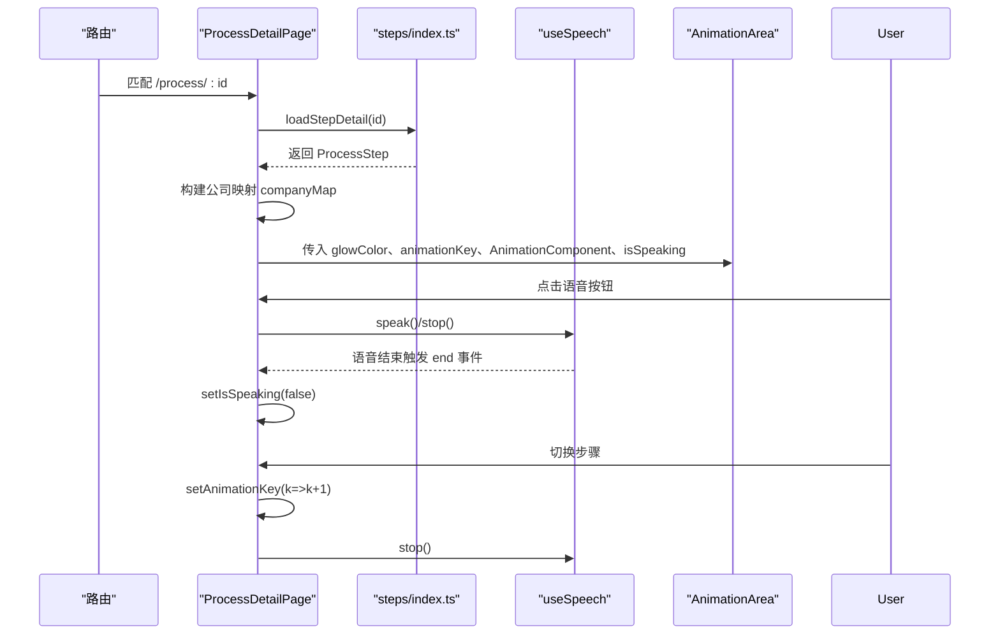
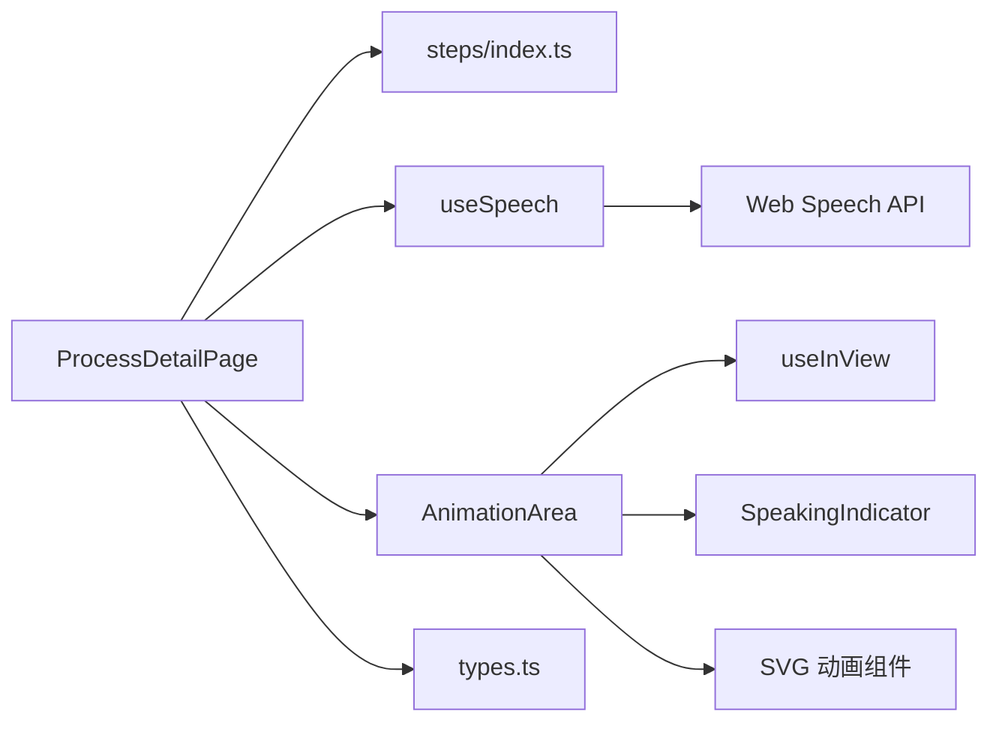

# 动画系统

<cite>
**本文引用的文件**
- [src/components/ui/AnimationArea.tsx](file://src/components/ui/AnimationArea.tsx)
- [src/hooks/useInView.ts](file://src/hooks/useInView.ts)
- [src/components/ui/SpeakingIndicator.tsx](file://src/components/ui/SpeakingIndicator.tsx)
- [src/components/layout/ProcessDetailPage.tsx](file://src/components/layout/ProcessDetailPage.tsx)
- [src/hooks/useSpeech.ts](file://src/hooks/useSpeech.ts)
- [src/components/process/SiliconPurification.tsx](file://src/components/process/SiliconPurification.tsx)
- [src/components/process/WaferManufacturing.tsx](file://src/components/process/WaferManufacturing.tsx)
- [src/data/steps/index.ts](file://src/data/steps/index.ts)
- [src/data/steps/silicon-purification.ts](file://src/data/steps/silicon-purification.ts)
- [src/data/steps/wafer-manufacturing.ts](file://src/data/steps/wafer-manufacturing.ts)
- [src/data/types.ts](file://src/data/types.ts)
- [src/lib/utils.ts](file://src/lib/utils.ts)
- [index.html](file://index.html)
- [src/App.tsx](file://src/App.tsx)
</cite>

## 目录
1. [简介](#简介)
2. [项目结构](#项目结构)
3. [核心组件](#核心组件)
4. [架构总览](#架构总览)
5. [详细组件分析](#详细组件分析)
6. [依赖关系分析](#依赖关系分析)
7. [性能考量](#性能考量)
8. [故障排查指南](#故障排查指南)
9. [结论](#结论)
10. [附录](#附录)

## 简介
本项目为“芯片制造全流程动画演示”提供一套基于 SVG 的可视化动画系统，结合 Intersection Observer 实现的懒加载与按需渲染，配合语音讲解与状态同步，形成完整的交互体验。系统围绕“动画区域”“观察器钩子”“语音合成钩子”“具体动画组件”展开，强调可维护性、可扩展性与性能优化。

## 项目结构
动画系统由页面容器、动画区域、观察器钩子、语音指示器、语音钩子以及多个 SVG 动画组件构成。页面容器负责加载步骤详情、管理动画 key 与语音状态；动画区域负责懒加载与渲染；观察器钩子负责可视区域判定；语音钩子负责中文语音合成与偏好记忆；SVG 动画组件定义具体的视觉动效。

图表来源
- [src/components/layout/ProcessDetailPage.tsx:36-116](file://src/components/layout/ProcessDetailPage.tsx#L36-L116)
- [src/components/ui/AnimationArea.tsx:11-28](file://src/components/ui/AnimationArea.tsx#L11-L28)
- [src/hooks/useInView.ts:8-31](file://src/hooks/useInView.ts#L8-L31)
- [src/components/ui/SpeakingIndicator.tsx:3-27](file://src/components/ui/SpeakingIndicator.tsx#L3-L27)
- [src/hooks/useSpeech.ts:64-134](file://src/hooks/useSpeech.ts#L64-L134)
- [src/data/steps/index.ts:3-33](file://src/data/steps/index.ts#L3-L33)
- [src/data/steps/silicon-purification.ts:3-25](file://src/data/steps/silicon-purification.ts#L3-L25)
- [src/data/steps/wafer-manufacturing.ts:3-27](file://src/data/steps/wafer-manufacturing.ts#L3-L27)
- [src/components/process/SiliconPurification.tsx:1-114](file://src/components/process/SiliconPurification.tsx#L1-L114)
- [src/components/process/WaferManufacturing.tsx:1-122](file://src/components/process/WaferManufacturing.tsx#L1-L122)
- [src/data/types.ts:19-32](file://src/data/types.ts#L19-L32)

章节来源
- [src/components/layout/ProcessDetailPage.tsx:36-116](file://src/components/layout/ProcessDetailPage.tsx#L36-L116)
- [src/components/ui/AnimationArea.tsx:11-28](file://src/components/ui/AnimationArea.tsx#L11-L28)
- [src/hooks/useInView.ts:8-31](file://src/hooks/useInView.ts#L8-L31)
- [src/components/ui/SpeakingIndicator.tsx:3-27](file://src/components/ui/SpeakingIndicator.tsx#L3-L27)
- [src/hooks/useSpeech.ts:64-134](file://src/hooks/useSpeech.ts#L64-L134)
- [src/data/steps/index.ts:3-33](file://src/data/steps/index.ts#L3-L33)
- [src/data/steps/silicon-purification.ts:3-25](file://src/data/steps/silicon-purification.ts#L3-L25)
- [src/data/steps/wafer-manufacturing.ts:3-27](file://src/data/steps/wafer-manufacturing.ts#L3-L27)
- [src/components/process/SiliconPurification.tsx:1-114](file://src/components/process/SiliconPurification.tsx#L1-L114)
- [src/components/process/WaferManufacturing.tsx:1-122](file://src/components/process/WaferManufacturing.tsx#L1-L122)
- [src/data/types.ts:19-32](file://src/data/types.ts#L19-L32)

## 核心组件
- 动画区域 AnimationArea：包裹 SVG 动画，提供径向渐变背景与“语音中”指示器；通过 useInView 判定可视性，仅在进入视口时渲染动画组件；接收 glowColor、animationKey、AnimationComponent、isSpeaking 等 props。
- 可视区域观察器 useInView：封装 IntersectionObserver，暴露 ref 与 isInView；支持 threshold 与 rootMargin；在组件卸载时断开观察。
- 语音指示器 SpeakingIndicator：底部显示“语音讲解中”条，包含随机高度的脉冲柱，使用 CSS 动画实现呼吸/脉冲效果。
- 步骤详情页 ProcessDetailPage：负责加载步骤详情、构建公司映射、管理语音状态与动画 key；根据路由 id 映射到具体动画组件；提供重播与语音开关按钮。
- 语音合成钩子 useSpeech：封装 Web Speech API，自动选择更自然的中文语音，缓存用户偏好；提供 speak、stop、查询可用语音、设置首选语音等方法。
- 具体动画组件：SiliconPurificationAnimation、WaferManufacturingAnimation 等，均以 SVG 定义形状、渐变、滤镜与 CSS 动画，实现流程化动效。

章节来源
- [src/components/ui/AnimationArea.tsx:11-28](file://src/components/ui/AnimationArea.tsx#L11-L28)
- [src/hooks/useInView.ts:8-31](file://src/hooks/useInView.ts#L8-L31)
- [src/components/ui/SpeakingIndicator.tsx:3-27](file://src/components/ui/SpeakingIndicator.tsx#L3-L27)
- [src/components/layout/ProcessDetailPage.tsx:36-116](file://src/components/layout/ProcessDetailPage.tsx#L36-L116)
- [src/hooks/useSpeech.ts:64-134](file://src/hooks/useSpeech.ts#L64-L134)
- [src/components/process/SiliconPurification.tsx:1-114](file://src/components/process/SiliconPurification.tsx#L1-L114)
- [src/components/process/WaferManufacturing.tsx:1-122](file://src/components/process/WaferManufacturing.tsx#L1-L122)

## 架构总览
系统采用“页面容器 + 懒加载 + 语音同步”的架构模式。页面容器负责数据与状态管理，观察器钩子负责渲染时机，语音钩子负责声音与 UI 同步，动画组件负责视觉表达。

图表来源
- [src/components/layout/ProcessDetailPage.tsx:36-116](file://src/components/layout/ProcessDetailPage.tsx#L36-L116)
- [src/components/ui/AnimationArea.tsx:11-28](file://src/components/ui/AnimationArea.tsx#L11-L28)
- [src/hooks/useInView.ts:8-31](file://src/hooks/useInView.ts#L8-L31)
- [src/hooks/useSpeech.ts:74-112](file://src/hooks/useSpeech.ts#L74-L112)
- [src/components/process/SiliconPurification.tsx:1-114](file://src/components/process/SiliconPurification.tsx#L1-L114)

## 详细组件分析

### 动画区域 AnimationArea
- 职责：提供动画容器背景（径向渐变 + 卡片渐变）、条件渲染动画组件、展示语音指示器。
- 关键点：通过 useInView 的 isInView 控制是否渲染；animationKey 作为强制更新 key，确保切换步骤时重新初始化动画；glowColor 与 isSpeaking 用于样式与指示器联动。
- 设计理念：将“懒加载”与“动画生命周期”解耦，避免不必要的渲染与资源占用。

图表来源
- [src/components/ui/AnimationArea.tsx:11-28](file://src/components/ui/AnimationArea.tsx#L11-L28)
- [src/hooks/useInView.ts:8-31](file://src/hooks/useInView.ts#L8-L31)
- [src/components/ui/SpeakingIndicator.tsx:3-27](file://src/components/ui/SpeakingIndicator.tsx#L3-L27)

章节来源
- [src/components/ui/AnimationArea.tsx:11-28](file://src/components/ui/AnimationArea.tsx#L11-L28)

### 可视区域观察器 useInView
- 职责：封装 IntersectionObserver，暴露 ref 与 isInView；支持阈值与边距配置；在卸载时断开观察。
- 性能：仅在组件挂载时创建观察器，避免重复实例化；阈值默认 0.1，兼顾首屏与滚动体验。
- 注意：初始 isInView 设为 true，避免首次渲染闪烁；实际行为由观察器回调更新。

章节来源
- [src/hooks/useInView.ts:8-31](file://src/hooks/useInView.ts#L8-L31)

### 语音指示器 SpeakingIndicator
- 职责：底部显示“语音讲解中”，包含若干随机高度的脉冲柱，使用 CSS 动画实现不同延迟的呼吸/脉冲效果。
- 设计：使用 useMemo 缓存柱高度数组，减少每次渲染计算；通过样式属性设置动画延迟，营造自然节奏感。

章节来源
- [src/components/ui/SpeakingIndicator.tsx:3-27](file://src/components/ui/SpeakingIndicator.tsx#L3-L27)

### 步骤详情页 ProcessDetailPage
- 数据加载：通过 steps/index.ts 的动态导入加载当前步骤详情与全部步骤；构建公司名称到公司对象的映射，用于子步骤 companyRefs 解析。
- 语音控制：useSpeech 提供 speak/stop；监听 speechSynthesis 的 end 事件自动关闭 isSpeaking；提供重播按钮，重置 animationKey 并停止语音。
- 动画切换：根据路由 id 映射到具体动画组件；每次 id 变化时递增 animationKey，强制 SVG 动画重新初始化。
- 响应式布局：左侧动画面板包含标题、进度条、重播与语音按钮、语音讲解文稿、步骤导航；右侧信息面板展示描述、详解、关键指标与子步骤列表。

图表来源
- [src/components/layout/ProcessDetailPage.tsx:36-116](file://src/components/layout/ProcessDetailPage.tsx#L36-L116)
- [src/data/steps/index.ts:16-33](file://src/data/steps/index.ts#L16-L33)
- [src/hooks/useSpeech.ts:74-112](file://src/hooks/useSpeech.ts#L74-L112)

章节来源
- [src/components/layout/ProcessDetailPage.tsx:36-116](file://src/components/layout/ProcessDetailPage.tsx#L36-L116)
- [src/data/steps/index.ts:16-33](file://src/data/steps/index.ts#L16-L33)

### 语音合成钩子 useSpeech
- 语音选择：根据神经音色、本地服务、语言区域等打分，优先选择更自然的中文语音；支持持久化用户偏好。
- 参数优化：语速略慢、音调略高，提升清晰度与亲和力；自动等待语音列表加载完成后再发声。
- 生命周期：提供 stop 方法取消当前语音；提供 getAvailableVoices 与 setPreferredVoice 便于扩展 UI。

章节来源
- [src/hooks/useSpeech.ts:64-134](file://src/hooks/useSpeech.ts#L64-L134)

### 具体动画组件（示例）
- 硅提纯动画 SiliconPurificationAnimation：定义径向热辐射渐变、熔融硅形状、上升粒子、硅棒与温度指示器等元素，使用 CSS 动画实现“呼吸”“脉冲”“上升”等效果。
- 晶圆制造动画 WaferManufacturingAnimation：定义硅锭、种子晶体、旋转指示、线锯、切割堆叠的晶圆、火花粒子等，使用多段动画实现“收缩”“移动”“抖动/闪烁”“出现”等效果。

章节来源
- [src/components/process/SiliconPurification.tsx:1-114](file://src/components/process/SiliconPurification.tsx#L1-L114)
- [src/components/process/WaferManufacturing.tsx:1-122](file://src/components/process/WaferManufacturing.tsx#L1-L122)

### 数据与类型
- 类型定义：ProcessStep、ProcessSubStep、Company 等，统一了步骤元数据、子步骤、企业信息的数据结构。
- 步骤数据：silicon-purification.ts、wafer-manufacturing.ts 等，提供步骤描述、图标、颜色、发光色、关键指标、企业列表等。

章节来源
- [src/data/types.ts:19-32](file://src/data/types.ts#L19-L32)
- [src/data/steps/silicon-purification.ts:3-25](file://src/data/steps/silicon-purification.ts#L3-L25)
- [src/data/steps/wafer-manufacturing.ts:3-27](file://src/data/steps/wafer-manufacturing.ts#L3-L27)

## 依赖关系分析
- 页面容器依赖：步骤数据加载模块、动画组件映射、语音钩子、工具函数。
- 动画区域依赖：观察器钩子、语音指示器。
- 动画组件依赖：SVG 语法与 CSS 动画，无外部依赖，便于独立维护。
- 语音钩子依赖：浏览器 Web Speech API，具备降级提示与偏好持久化。

图表来源
- [src/components/layout/ProcessDetailPage.tsx:36-116](file://src/components/layout/ProcessDetailPage.tsx#L36-L116)
- [src/data/steps/index.ts:3-33](file://src/data/steps/index.ts#L3-L33)
- [src/hooks/useSpeech.ts:74-112](file://src/hooks/useSpeech.ts#L74-L112)
- [src/components/ui/AnimationArea.tsx:11-28](file://src/components/ui/AnimationArea.tsx#L11-L28)
- [src/hooks/useInView.ts:8-31](file://src/hooks/useInView.ts#L8-L31)
- [src/components/ui/SpeakingIndicator.tsx:3-27](file://src/components/ui/SpeakingIndicator.tsx#L3-L27)
- [src/data/types.ts:19-32](file://src/data/types.ts#L19-L32)

章节来源
- [src/components/layout/ProcessDetailPage.tsx:36-116](file://src/components/layout/ProcessDetailPage.tsx#L36-L116)
- [src/data/steps/index.ts:3-33](file://src/data/steps/index.ts#L3-L33)
- [src/hooks/useSpeech.ts:74-112](file://src/hooks/useSpeech.ts#L74-L112)
- [src/components/ui/AnimationArea.tsx:11-28](file://src/components/ui/AnimationArea.tsx#L11-L28)
- [src/hooks/useInView.ts:8-31](file://src/hooks/useInView.ts#L8-L31)
- [src/components/ui/SpeakingIndicator.tsx:3-27](file://src/components/ui/SpeakingIndicator.tsx#L3-L27)
- [src/data/types.ts:19-32](file://src/data/types.ts#L19-L32)

## 性能考量
- 懒加载与按需渲染
  - 使用 Intersection Observer 在进入视口时才渲染动画组件，减少初始渲染压力。
  - 通过 animationKey 强制更新，确保切换步骤时动画完全重置，避免残留状态。
- 动画优化
  - SVG 动画使用 CSS 动画而非 JS 动画，利用 GPU 加速；合理设置动画时长与延迟，避免密集并发。
  - 使用滤镜与渐变时注意层级与透明度，避免过度叠加导致绘制成本上升。
- 语音性能
  - 语音合成前等待语音列表加载完成，避免阻塞；停止语音时清理事件监听，防止内存泄漏。
  - 语音偏好持久化，减少重复评分与选择开销。
- 代码分割
  - 步骤详情按需动态导入，降低首屏体积；动画组件保持轻量，便于独立维护与替换。
- 工具类
  - 使用工具函数合并类名，避免重复样式计算。

章节来源
- [src/hooks/useInView.ts:8-31](file://src/hooks/useInView.ts#L8-L31)
- [src/components/ui/AnimationArea.tsx:11-28](file://src/components/ui/AnimationArea.tsx#L11-L28)
- [src/hooks/useSpeech.ts:74-112](file://src/hooks/useSpeech.ts#L74-L112)
- [src/data/steps/index.ts:16-33](file://src/data/steps/index.ts#L16-L33)
- [src/lib/utils.ts:4-6](file://src/lib/utils.ts#L4-L6)

## 故障排查指南
- 动画不显示
  - 检查 isInView 是否为 true；确认容器可见且阈值设置合理；检查 animationKey 是否变化导致组件被卸载/重挂载。
  - 参考：[src/components/ui/AnimationArea.tsx:11-28](file://src/components/ui/AnimationArea.tsx#L11-L28)，[src/hooks/useInView.ts:8-31](file://src/hooks/useInView.ts#L8-L31)
- 动画卡顿或掉帧
  - 减少同时运行的动画数量；避免在动画中频繁读取布局；使用 transform/opacity 动画；缩短动画时长或降低频率。
  - 参考：SVG 动画组件中的 CSS 动画定义
- 语音无法播放
  - 确认浏览器支持 Web Speech API；检查网络环境与语音列表加载；查看控制台是否有警告；尝试手动设置首选语音。
  - 参考：[src/hooks/useSpeech.ts:74-112](file://src/hooks/useSpeech.ts#L74-L112)
- 语音结束后 UI 未恢复
  - 确认已监听 speechSynthesis 的 end 事件并更新状态；必要时显式调用 stop。
  - 参考：[src/components/layout/ProcessDetailPage.tsx:100-108](file://src/components/layout/ProcessDetailPage.tsx#L100-L108)
- 切换步骤后动画未重播
  - 确认 animationKey 是否递增；确保在切换时调用 stop 并重置 isSpeaking。
  - 参考：[src/components/layout/ProcessDetailPage.tsx:93-98](file://src/components/layout/ProcessDetailPage.tsx#L93-L98)

章节来源
- [src/components/ui/AnimationArea.tsx:11-28](file://src/components/ui/AnimationArea.tsx#L11-L28)
- [src/hooks/useInView.ts:8-31](file://src/hooks/useInView.ts#L8-L31)
- [src/hooks/useSpeech.ts:74-112](file://src/hooks/useSpeech.ts#L74-L112)
- [src/components/layout/ProcessDetailPage.tsx:93-108](file://src/components/layout/ProcessDetailPage.tsx#L93-L108)

## 结论
本动画系统通过“懒加载 + 语音同步 + 独立动画组件”的设计，实现了高性能、易维护、可扩展的可视化演示方案。Intersection Observer 保证了渲染时机的合理性，useSpeech 提升了用户体验，而 SVG 动画则提供了丰富的表现力。建议在后续迭代中进一步完善动画组件的参数化与主题化能力，增强可定制性与一致性。

## 附录

### 动画触发机制与懒加载策略
- Intersection Observer：在组件挂载时创建观察器，根据阈值与根边距判断元素是否进入视口；进入视口后设置 isInView 为 true，从而渲染动画组件。
- 动画重播：通过递增 animationKey 强制组件卸载与重新挂载，确保动画从初始状态开始播放。
- 语音联动：isSpeaking 为真时显示语音指示器，语音结束事件自动清空状态。

章节来源
- [src/hooks/useInView.ts:8-31](file://src/hooks/useInView.ts#L8-L31)
- [src/components/ui/AnimationArea.tsx:11-28](file://src/components/ui/AnimationArea.tsx#L11-L28)
- [src/components/layout/ProcessDetailPage.tsx:93-108](file://src/components/layout/ProcessDetailPage.tsx#L93-L108)

### 动画效果设计理念与用户体验
- 视觉引导：通过发光色与渐变背景强化主题色；动画节奏与内容匹配，避免过快或过慢。
- 交互反馈：语音指示器提供即时反馈；重播按钮与语音开关按钮位置明确，操作直观。
- 可访问性：提供语音讲解与文字说明互补；动画不遮挡关键信息。

章节来源
- [src/components/ui/AnimationArea.tsx:11-28](file://src/components/ui/AnimationArea.tsx#L11-L28)
- [src/components/ui/SpeakingIndicator.tsx:3-27](file://src/components/ui/SpeakingIndicator.tsx#L3-L27)
- [src/components/layout/ProcessDetailPage.tsx:160-234](file://src/components/layout/ProcessDetailPage.tsx#L160-L234)

### 动画性能优化技术与最佳实践
- 使用 CSS 动画替代 JS 动画，减少主线程压力。
- 合理设置动画时长与延迟，避免大量元素同时执行复杂动画。
- 将动画组件拆分为独立模块，按需加载，降低首屏体积。
- 对高频 DOM 操作进行节流/去抖处理，避免布局抖动。

章节来源
- [src/components/process/SiliconPurification.tsx:1-114](file://src/components/process/SiliconPurification.tsx#L1-L114)
- [src/components/process/WaferManufacturing.tsx:1-122](file://src/components/process/WaferManufacturing.tsx#L1-L122)
- [src/data/steps/index.ts:16-33](file://src/data/steps/index.ts#L16-L33)

### 动画定制与扩展方法
- 新增步骤动画：在 components/process 下新增动画组件，导出为 React.FC；在 steps/index.ts 中注册动态导入；在 ProcessDetailPage 的映射中添加对应路由 id。
- 主题定制：通过 glowColor、color 等属性统一风格；在 AnimationArea 与动画组件中使用一致的颜色变量。
- 动画参数化：将动画时长、延迟、路径等参数抽取为可配置项，便于复用与调整。

章节来源
- [src/components/layout/ProcessDetailPage.tsx:23-34](file://src/components/layout/ProcessDetailPage.tsx#L23-L34)
- [src/data/steps/index.ts:3-14](file://src/data/steps/index.ts#L3-L14)
- [src/components/process/SiliconPurification.tsx:1-114](file://src/components/process/SiliconPurification.tsx#L1-L114)
- [src/components/process/WaferManufacturing.tsx:1-122](file://src/components/process/WaferManufacturing.tsx#L1-L122)

### 动画与组件状态同步机制
- 状态来源：ProcessDetailPage 管理 isSpeaking、animationKey、step、loading 等状态。
- 同步方式：AnimationArea 接收 isSpeaking 与 animationKey；useInView 决定是否渲染；useSpeech 控制语音生命周期。
- 事件绑定：监听 speechSynthesis 的 end 事件，确保 UI 与语音状态一致。

章节来源
- [src/components/layout/ProcessDetailPage.tsx:36-116](file://src/components/layout/ProcessDetailPage.tsx#L36-L116)
- [src/components/ui/AnimationArea.tsx:11-28](file://src/components/ui/AnimationArea.tsx#L11-L28)
- [src/hooks/useSpeech.ts:74-112](file://src/hooks/useSpeech.ts#L74-L112)

### 动画调试与测试指导
- 调试技巧
  - 使用浏览器开发者工具的“Rendering”选项启用“Paint flashing”与“Layer borders”，观察重绘与层边界。
  - 在 AnimationArea 上临时移除懒加载条件，验证动画本身是否正常。
  - 使用 React DevTools 检查 animationKey 与 isInView 的变化轨迹。
- 测试建议
  - 单元测试：对 useSpeech 的语音选择逻辑进行断言；对 useInView 的回调行为进行模拟。
  - 端到端测试：模拟滚动到可视区域、点击语音按钮、切换步骤等场景，验证 UI 与状态同步。

章节来源
- [src/hooks/useInView.ts:8-31](file://src/hooks/useInView.ts#L8-L31)
- [src/hooks/useSpeech.ts:64-134](file://src/hooks/useSpeech.ts#L64-L134)
- [src/components/ui/AnimationArea.tsx:11-28](file://src/components/ui/AnimationArea.tsx#L11-L28)

### 开发者工具与技巧
- 构建与运行
  - 项目入口与路由配置位于 App 与 index.html；确保暗色主题与国际化元信息正确。
- 样式与工具
  - 使用工具函数合并类名，减少样式冲突；Tailwind 配置与主题色变量配合使用。
- 可扩展性
  - 将动画组件抽象为可复用的 SVG 组件库；为步骤数据增加校验与默认值，提升健壮性。

章节来源
- [src/App.tsx:7-20](file://src/App.tsx#L7-L20)
- [index.html:2-8](file://index.html#L2-L8)
- [src/lib/utils.ts:4-6](file://src/lib/utils.ts#L4-L6)