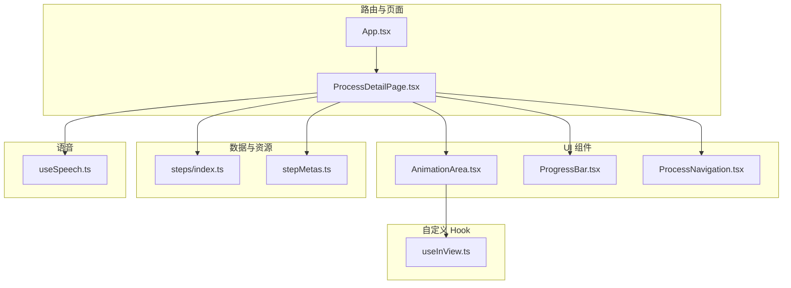
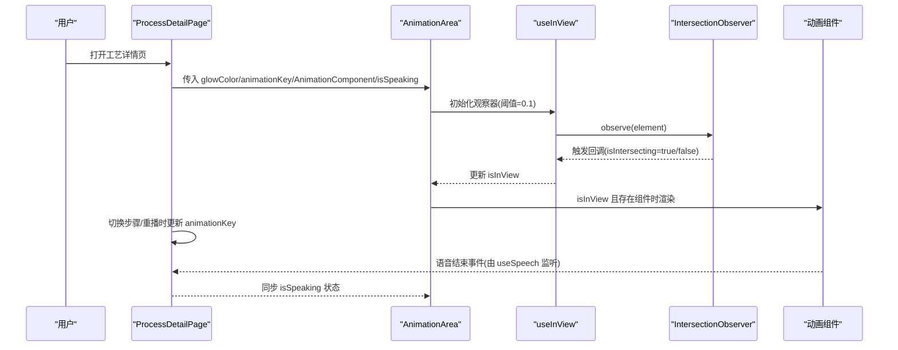
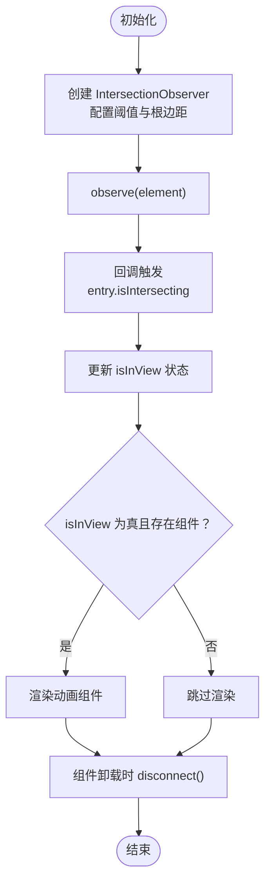
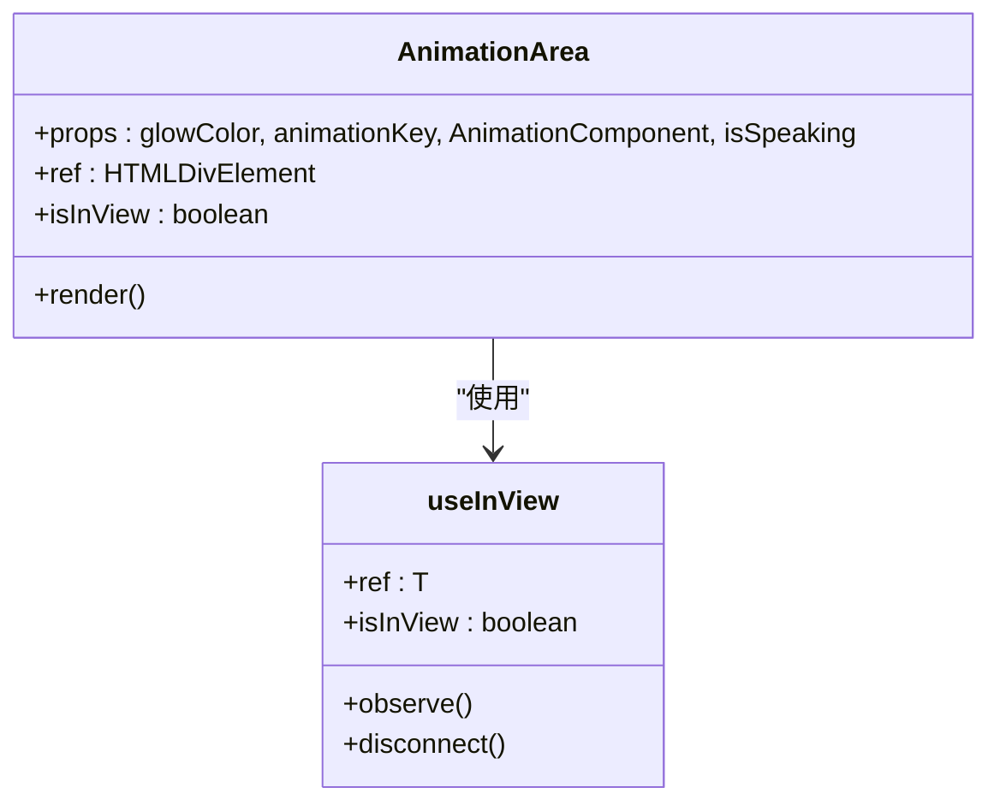
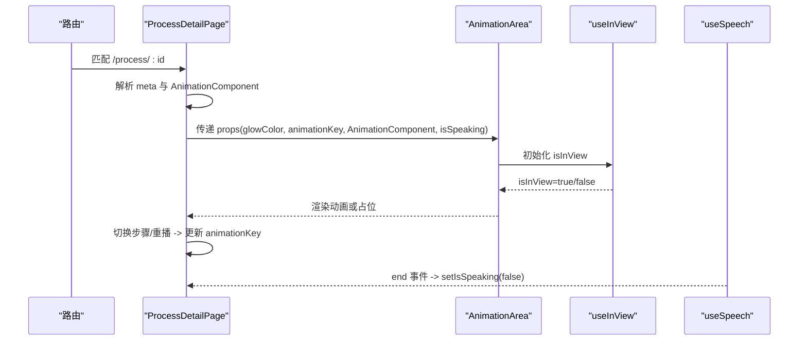
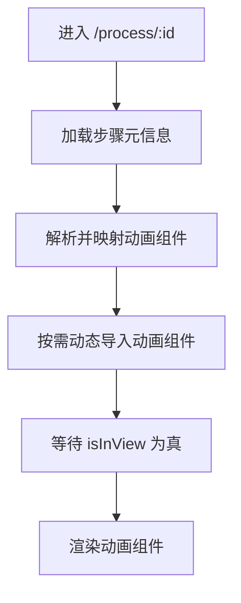
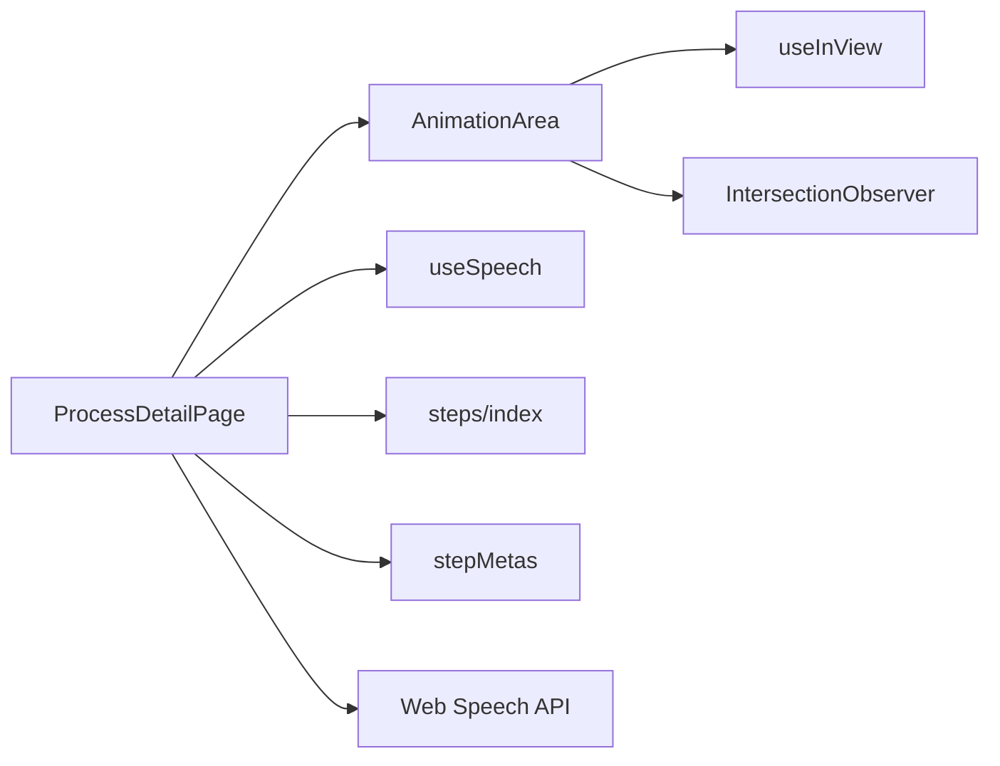

# 懒加载机制

<cite>
**本文引用的文件**
- [useInView.ts](file://src/hooks/useInView.ts)
- [AnimationArea.tsx](file://src/components/ui/AnimationArea.tsx)
- [ProcessDetailPage.tsx](file://src/components/layout/ProcessDetailPage.tsx)
- [steps/index.ts](file://src/data/steps/index.ts)
- [useSpeech.ts](file://src/hooks/useSpeech.ts)
- [App.tsx](file://src/App.tsx)
- [stepMetas.ts](file://src/data/stepMetas.ts)
- [ProgressBar.tsx](file://src/components/ui/ProgressBar.tsx)
- [ProcessNavigation.tsx](file://src/components/ui/ProcessNavigation.tsx)
</cite>

## 目录
1. [简介](#简介)
2. [项目结构](#项目结构)
3. [核心组件](#核心组件)
4. [架构总览](#架构总览)
5. [详细组件分析](#详细组件分析)
6. [依赖关系分析](#依赖关系分析)
7. [性能考量](#性能考量)
8. [故障排查指南](#故障排查指南)
9. [结论](#结论)
10. [附录：最佳实践与注意事项](#附录最佳实践与注意事项)

## 简介
本文件围绕芯片制造演示项目的“懒加载机制”进行系统性说明，重点覆盖以下方面：
- Intersection Observer API 的使用与配置
- 动画组件的懒加载触发条件与阈值设置
- 懒加载对性能的影响与优化策略
- 懒加载状态管理与组件生命周期处理
- 懒加载失败的回退机制与错误处理
- 懒加载与动画播放的协调机制
- 性能监控与调试方法
- 开发者最佳实践与注意事项

## 项目结构
该项目采用按功能分层的组织方式，懒加载主要涉及以下模块：
- 自定义 Hook：useInView（基于 Intersection Observer 实现）
- UI 组件：AnimationArea（动画区域容器，负责根据可见性渲染动画）
- 页面组件：ProcessDetailPage（页面级状态管理、语音控制、动画重播）
- 数据加载：steps/index.ts（按需动态导入步骤详情与动画组件）
- 语音能力：useSpeech（与动画播放的同步与解耦）

**图表来源**
- [App.tsx](file://src/App.tsx)
- [ProcessDetailPage.tsx](file://src/components/layout/ProcessDetailPage.tsx)
- [AnimationArea.tsx](file://src/components/ui/AnimationArea.tsx)
- [useInView.ts](file://src/hooks/useInView.ts)
- [steps/index.ts](file://src/data/steps/index.ts)
- [stepMetas.ts](file://src/data/stepMetas.ts)
- [ProgressBar.tsx](file://src/components/ui/ProgressBar.tsx)
- [ProcessNavigation.tsx](file://src/components/ui/ProcessNavigation.tsx)
- [useSpeech.ts](file://src/hooks/useSpeech.ts)

**章节来源**
- [App.tsx](file://src/App.tsx)
- [ProcessDetailPage.tsx](file://src/components/layout/ProcessDetailPage.tsx)
- [AnimationArea.tsx](file://src/components/ui/AnimationArea.tsx)
- [useInView.ts](file://src/hooks/useInView.ts)
- [steps/index.ts](file://src/data/steps/index.ts)
- [stepMetas.ts](file://src/data/stepMetas.ts)
- [ProgressBar.tsx](file://src/components/ui/ProgressBar.tsx)
- [ProcessNavigation.tsx](file://src/components/ui/ProcessNavigation.tsx)
- [useSpeech.ts](file://src/hooks/useSpeech.ts)

## 核心组件
- useInView：封装 Intersection Observer，暴露 ref 与 isInView 状态，支持阈值与根边距配置，默认阈值 0.1，便于提前触发懒加载。
- AnimationArea：接收 glowColor、animationKey、AnimationComponent、isSpeaking 等属性；在 isInView 为真且存在动画组件时才渲染对应动画。
- ProcessDetailPage：负责页面级状态（是否正在播放语音、动画 key、当前步骤数据），并在步骤切换或重播时重置动画 key，确保重新渲染动画。
- steps/index.ts：提供按需动态导入步骤详情与动画组件的能力，结合路由与页面逻辑实现“进入页面再加载动画”的策略。
- useSpeech：提供中文语音合成能力，与动画播放解耦，通过事件监听在语音结束后更新状态。

**章节来源**
- [useInView.ts](file://src/hooks/useInView.ts)
- [AnimationArea.tsx](file://src/components/ui/AnimationArea.tsx)
- [ProcessDetailPage.tsx](file://src/components/layout/ProcessDetailPage.tsx)
- [steps/index.ts](file://src/data/steps/index.ts)
- [useSpeech.ts](file://src/hooks/useSpeech.ts)

## 架构总览
懒加载的整体流程如下：
- 用户进入页面后，AnimationArea 使用 useInView 订阅 Intersection Observer
- 当动画区域进入视口（满足阈值）时，isInView 变为 true
- 在 isInView 为真且存在动画组件时，渲染对应动画组件
- 页面切换或重播时，通过改变 animationKey 强制重新挂载动画，确保播放一致性
- 语音播放与动画播放相互独立，通过状态与事件进行协调

**图表来源**
- [AnimationArea.tsx](file://src/components/ui/AnimationArea.tsx)
- [useInView.ts](file://src/hooks/useInView.ts)
- [ProcessDetailPage.tsx](file://src/components/layout/ProcessDetailPage.tsx)
- [useSpeech.ts](file://src/hooks/useSpeech.ts)

## 详细组件分析

### useInView Hook 分析
- 设计要点
  - 接收阈值 threshold 与根边距 rootMargin，提供灵活的触发条件
  - 默认阈值 0.1，可在动画即将进入可视区时提前开始渲染，减少白屏感
  - 在组件卸载时自动断开观察器，避免内存泄漏
- 状态与副作用
  - 使用 useState 维护 isInView
  - useEffect 内部创建并销毁 IntersectionObserver
- 复杂度与性能
  - 观察器创建与销毁为 O(1)，回调触发频率取决于滚动行为，整体开销低
  - 阈值越小，触发越早，但可能增加不必要的渲染；阈值越大，触发越晚，可能增加等待时间

**图表来源**
- [useInView.ts](file://src/hooks/useInView.ts)

**章节来源**
- [useInView.ts](file://src/hooks/useInView.ts)

### AnimationArea 组件分析
- 设计要点
  - 通过 useInView 获取 ref 与 isInView，并在 isInView 为真时渲染传入的动画组件
  - 使用 animationKey 控制组件重渲染，确保每次切换步骤或重播时动画重新开始
  - 支持在语音播放期间显示“说话指示器”
- 生命周期与状态
  - isInView 作为渲染开关，避免未见即渲染造成性能浪费
  - animationKey 作为强制刷新信号，保证动画播放的一致性
- 与父组件的协作
  - 由 ProcessDetailPage 提供 AnimationComponent 与 isSpeaking 状态
  - 通过 glowColor 与样式联动，营造视觉高亮效果

**图表来源**
- [AnimationArea.tsx](file://src/components/ui/AnimationArea.tsx)
- [useInView.ts](file://src/hooks/useInView.ts)

**章节来源**
- [AnimationArea.tsx](file://src/components/ui/AnimationArea.tsx)

### ProcessDetailPage 页面分析
- 设计要点
  - 维护 isSpeaking、animationKey、step、isLoading 等状态
  - 通过路由参数解析当前步骤，映射到对应的动画组件
  - 在步骤切换或重播时更新 animationKey，强制动画重新挂载
  - 监听语音结束事件，及时更新 isSpeaking 状态
- 懒加载与渲染
  - 动画组件仅在 isInView 为真时渲染，结合 animationKey 确保播放一致性
  - 页面加载阶段显示进度条，提升感知速度
- 错误与边界
  - 未匹配到步骤元信息时，提供友好提示并允许返回首页
  - 语音 API 不可用时进行告警，不影响页面其他功能

**图表来源**
- [ProcessDetailPage.tsx](file://src/components/layout/ProcessDetailPage.tsx)
- [AnimationArea.tsx](file://src/components/ui/AnimationArea.tsx)
- [useInView.ts](file://src/hooks/useInView.ts)
- [useSpeech.ts](file://src/hooks/useSpeech.ts)

**章节来源**
- [ProcessDetailPage.tsx](file://src/components/layout/ProcessDetailPage.tsx)
- [useSpeech.ts](file://src/hooks/useSpeech.ts)

### 动态导入与懒加载策略
- steps/index.ts 提供按需动态导入步骤详情与动画组件的能力
- 结合路由与页面逻辑，实现“进入页面再加载动画”的策略，降低首屏压力
- 与 Intersection Observer 协同：先加载数据与组件骨架，再在可见时渲染动画

**图表来源**
- [steps/index.ts](file://src/data/steps/index.ts)
- [ProcessDetailPage.tsx](file://src/components/layout/ProcessDetailPage.tsx)

**章节来源**
- [steps/index.ts](file://src/data/steps/index.ts)
- [ProcessDetailPage.tsx](file://src/components/layout/ProcessDetailPage.tsx)

## 依赖关系分析
- 组件耦合
  - AnimationArea 依赖 useInView，形成“观察-渲染”的弱耦合
  - ProcessDetailPage 作为状态中心，协调动画、语音与导航
- 外部依赖
  - IntersectionObserver：浏览器原生 API，性能优异
  - Web Speech API：用于中文语音合成，与动画播放解耦
- 潜在循环依赖
  - 无直接循环依赖；数据与 UI 分层清晰

**图表来源**
- [ProcessDetailPage.tsx](file://src/components/layout/ProcessDetailPage.tsx)
- [AnimationArea.tsx](file://src/components/ui/AnimationArea.tsx)
- [useInView.ts](file://src/hooks/useInView.ts)
- [useSpeech.ts](file://src/hooks/useSpeech.ts)
- [steps/index.ts](file://src/data/steps/index.ts)
- [stepMetas.ts](file://src/data/stepMetas.ts)

**章节来源**
- [ProcessDetailPage.tsx](file://src/components/layout/ProcessDetailPage.tsx)
- [AnimationArea.tsx](file://src/components/ui/AnimationArea.tsx)
- [useInView.ts](file://src/hooks/useInView.ts)
- [useSpeech.ts](file://src/hooks/useSpeech.ts)
- [steps/index.ts](file://src/data/steps/index.ts)
- [stepMetas.ts](file://src/data/stepMetas.ts)

## 性能考量
- Intersection Observer 的优势
  - 基于浏览器主线程外的调度，回调触发稳定，避免频繁重排
  - 默认阈值 0.1 提前触发，缩短感知延迟
- 渲染控制
  - 仅在 isInView 为真时渲染动画组件，减少初始渲染负担
  - 通过 animationKey 强制刷新，避免重复实例导致的状态混乱
- 语音与动画解耦
  - 语音播放不阻塞动画渲染，二者通过状态与事件协调
- 进一步优化建议
  - 对高频滚动场景，可考虑节流回调或增大阈值
  - 对长列表页面，可限制同时观察的元素数量
  - 对动画组件，确保 SVG/Canvas 动画的帧率与内存占用可控

[本节为通用性能讨论，无需列出具体文件来源]

## 故障排查指南
- 动画未出现
  - 检查 isInView 是否为 true（可通过浏览器开发者工具查看元素是否进入视口）
  - 确认 AnimationComponent 是否存在且已正确映射
  - 检查 animationKey 是否被正确更新（切换步骤或重播时应递增）
- 语音无法播放
  - 确认浏览器支持 Web Speech API，且未被阻止
  - 检查语音结束事件监听是否生效，确保在组件卸载时清理
- 页面卡顿
  - 减少阈值或限制同时观察的元素数量
  - 优化动画组件的复杂度，避免过多 DOM/动画节点
- 回退与容错
  - 若动画组件加载失败，保持占位与进度提示，避免崩溃
  - 若语音不可用，提供禁音模式下的替代体验（如文本讲解）

**章节来源**
- [AnimationArea.tsx](file://src/components/ui/AnimationArea.tsx)
- [ProcessDetailPage.tsx](file://src/components/layout/ProcessDetailPage.tsx)
- [useSpeech.ts](file://src/hooks/useSpeech.ts)

## 结论
本项目通过 Intersection Observer 与自定义 Hook 将“可见即渲染”的懒加载策略与动画播放解耦，结合页面级状态管理与动态导入，实现了良好的性能与用户体验。默认阈值 0.1 有效降低了感知延迟；animationKey 的使用确保了动画播放的一致性；语音与动画的事件驱动协调提升了交互自然度。后续可在滚动性能、动画复杂度与错误回退方面进一步优化。

[本节为总结性内容，无需列出具体文件来源]

## 附录：最佳实践与注意事项
- 阈值与根边距
  - 默认阈值 0.1 适合大多数场景；对于需要更早触发的区域可适当调小
  - rootMargin 可用于提前触发或延迟触发，需结合布局与滚动容器调整
- 生命周期与资源释放
  - 在组件卸载时断开观察器，避免内存泄漏
  - 清理语音事件监听，防止残留回调影响新页面
- 状态与渲染
  - 仅在 isInView 为真时渲染重型动画组件
  - 使用 key 或 animationKey 强制刷新，避免旧实例状态干扰
- 错误处理与回退
  - 对动态导入失败与语音不可用提供降级提示
  - 保持页面骨架与进度反馈，提升感知速度
- 性能监控与调试
  - 使用浏览器性能面板观察滚动与动画帧率
  - 在开发环境打印 isInView 变化日志，辅助定位问题

[本节为通用指导，无需列出具体文件来源]