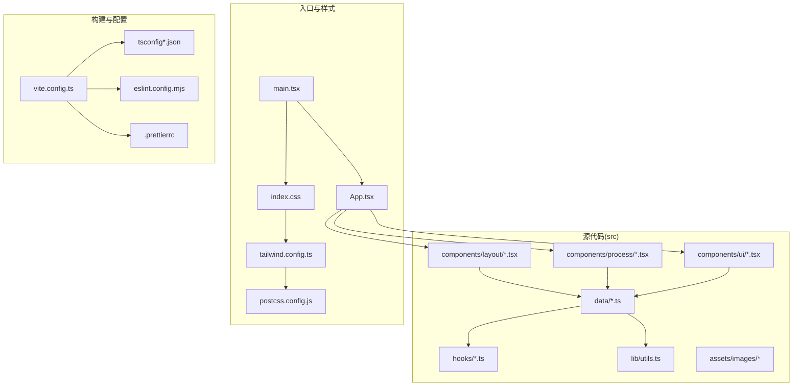
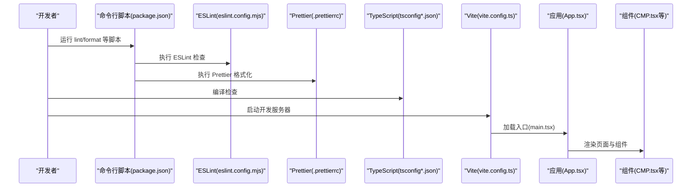
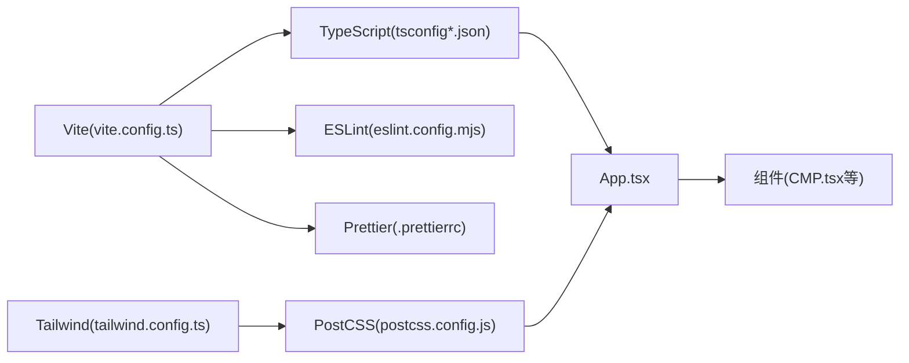

# 代码规范与质量

<cite>
**本文引用的文件**
- [eslint.config.mjs](file://eslint.config.mjs)
- [.prettierrc](file://.prettierrc)
- [package.json](file://package.json)
- [tsconfig.json](file://tsconfig.json)
- [tsconfig.app.json](file://tsconfig.app.json)
- [vite.config.ts](file://vite.config.ts)
- [tailwind.config.ts](file://tailwind.config.ts)
- [postcss.config.js](file://postcss.config.js)
- [src/App.tsx](file://src/App.tsx)
- [src/main.tsx](file://src/main.tsx)
- [src/data/types.ts](file://src/data/types.ts)
- [src/lib/utils.ts](file://src/lib/utils.ts)
- [src/hooks/useInView.ts](file://src/hooks/useInView.ts)
- [src/components/process/CMP.tsx](file://src/components/process/CMP.tsx)
</cite>

## 目录
1. [简介](#简介)
2. [项目结构](#项目结构)
3. [核心组件](#核心组件)
4. [架构总览](#架构总览)
5. [详细组件分析](#详细组件分析)
6. [依赖分析](#依赖分析)
7. [性能考虑](#性能考虑)
8. [故障排查指南](#故障排查指南)
9. [结论](#结论)
10. [附录](#附录)

## 简介
本指南面向芯片制造演示项目的开发者，系统性地定义并解释代码规范与质量保证流程，涵盖 ESLint 配置与 TypeScript 类型检查、Prettier 格式化、命名约定、文件组织与模块导入规范、代码审查清单与质量检查标准，并提供 IDE 配置建议与常见问题解决方案。目标是帮助新成员快速上手，统一团队开发体验，提升代码一致性与可维护性。

## 项目结构
该项目采用基于功能域的目录组织方式，结合 Vite + React + TypeScript 技术栈，配合 TailwindCSS 与 PostCSS 实现样式与动画体系。关键目录与职责如下：
- src：源代码根目录
  - assets/images：静态资源
  - components：UI 组件与页面
    - layout：布局与页面级组件（如导航、首页、流程详情页等）
    - process：具体工艺流程组件（如 CMP、Etching、Photolithography 等）
    - ui：通用 UI 小部件（如动画区域、进度条、指示器等）
  - data：数据模型与步骤元信息
  - hooks：自定义 Hook（如 useInView、useSpeech）
  - lib：工具函数（如 cn 合并类名）
  - 主入口：App.tsx、main.tsx、index.css
- 工程配置：Vite、TailwindCSS、PostCSS、TypeScript、ESLint、Prettier

图表来源
- [src/main.tsx:1-11](file://src/main.tsx#L1-L11)
- [src/App.tsx:1-23](file://src/App.tsx#L1-L23)
- [vite.config.ts:1-13](file://vite.config.ts#L1-L13)
- [tailwind.config.ts:1-143](file://tailwind.config.ts#L1-L143)
- [postcss.config.js:1-7](file://postcss.config.js#L1-L7)
- [tsconfig.app.json:1-26](file://tsconfig.app.json#L1-L26)
- [eslint.config.mjs:1-45](file://eslint.config.mjs#L1-L45)
- [.prettierrc:1-9](file://.prettierrc#L1-L9)

章节来源
- [src/main.tsx:1-11](file://src/main.tsx#L1-L11)
- [src/App.tsx:1-23](file://src/App.tsx#L1-L23)
- [vite.config.ts:1-13](file://vite.config.ts#L1-L13)
- [tailwind.config.ts:1-143](file://tailwind.config.ts#L1-L143)
- [postcss.config.js:1-7](file://postcss.config.js#L1-L7)
- [tsconfig.json:1-7](file://tsconfig.json#L1-L7)
- [tsconfig.app.json:1-26](file://tsconfig.app.json#L1-L26)

## 核心组件
本节聚焦于与代码规范直接相关的工程配置与关键实现，确保团队在开发过程中遵循统一的风格与质量标准。

- ESLint 配置与规则
  - 使用推荐配置组合，启用 React 与 React Hooks 插件，关闭 React JSX 中显式引入 React 的校验，关闭 prop-types 校验，对未使用变量进行警告但允许以下划线开头的参数忽略，允许 warn/error 级别 console 调用。
  - 集成 Prettier 推荐插件，确保格式化与 ESLint 规则协同工作。
  - 忽略 dist 与 node_modules 目录。
  - 参考路径：[eslint.config.mjs:1-45](file://eslint.config.mjs#L1-L45)

- Prettier 格式化标准
  - 使用分号、单引号、2 空格缩进、按 ES5 约定添加尾随逗号、每行最大宽度 100、箭头函数括号始终保留。
  - 参考路径：[.prettierrc:1-9](file://.prettierrc#L1-L9)

- TypeScript 编译选项
  - 严格模式开启，禁止未使用局部变量与参数，禁止 switch 中的贯穿，禁止未检查副作用的模块导入。
  - JSX 使用 react-jsx，路径映射 @/* 指向 ./src/*，模块解析使用 bundler。
  - 参考路径：[tsconfig.app.json:1-26](file://tsconfig.app.json#L1-L26)

- Vite 别名与脚本
  - 别名 @ 指向 src，便于统一导入路径。
  - 提供 lint、lint:fix、format、format:check 等脚本，便于本地与 CI 执行。
  - 参考路径：[vite.config.ts:1-13](file://vite.config.ts#L1-L13)、[package.json:1-45](file://package.json#L1-L45)

- TailwindCSS 与 PostCSS
  - Tailwind 配置启用暗色模式、内容扫描范围、自定义颜色与动画键值，集成 tailwindcss-animate 插件。
  - PostCSS 配置启用 tailwindcss 与 autoprefixer。
  - 参考路径：[tailwind.config.ts:1-143](file://tailwind.config.ts#L1-L143)、[postcss.config.js:1-7](file://postcss.config.js#L1-L7)

章节来源
- [eslint.config.mjs:1-45](file://eslint.config.mjs#L1-L45)
- [.prettierrc:1-9](file://.prettierrc#L1-L9)
- [tsconfig.app.json:1-26](file://tsconfig.app.json#L1-L26)
- [vite.config.ts:1-13](file://vite.config.ts#L1-L13)
- [package.json:1-45](file://package.json#L1-L45)
- [tailwind.config.ts:1-143](file://tailwind.config.ts#L1-L143)
- [postcss.config.js:1-7](file://postcss.config.js#L1-L7)

## 架构总览
下图展示从入口到组件渲染的关键流程，以及与规范相关的工具链协作关系。

图表来源
- [package.json:1-45](file://package.json#L1-L45)
- [eslint.config.mjs:1-45](file://eslint.config.mjs#L1-L45)
- [.prettierrc:1-9](file://.prettierrc#L1-L9)
- [tsconfig.app.json:1-26](file://tsconfig.app.json#L1-L26)
- [vite.config.ts:1-13](file://vite.config.ts#L1-L13)
- [src/main.tsx:1-11](file://src/main.tsx#L1-L11)
- [src/App.tsx:1-23](file://src/App.tsx#L1-L23)
- [src/components/process/CMP.tsx:1-125](file://src/components/process/CMP.tsx#L1-L125)

## 详细组件分析

### ESLint 配置与规则
- 推荐配置组合
  - 基于 @eslint/js 与 typescript-eslint 的推荐配置，确保基础语法与 TS 语义检查一致。
  - 参考路径：[eslint.config.mjs:8-10](file://eslint.config.mjs#L8-L10)

- React 与 Hooks 插件
  - 启用 React 插件与 Hooks 插件的推荐规则，自动检测潜在问题。
  - 关闭 react/react-in-jsx-scope 与 react/prop-types，避免与现代 React JSX 与 TS 类型不兼容。
  - 参考路径：[eslint.config.mjs:22-38](file://eslint.config.mjs#L22-L38)

- 自定义规则
  - 未使用变量：对以下划线开头的参数进行忽略，减少噪音。
  - 控制台输出：允许 warn 与 error，便于调试与错误提示。
  - 参考路径：[eslint.config.mjs:26-33](file://eslint.config.mjs#L26-L33)

- 忽略与集成
  - 忽略 dist 与 node_modules。
  - 集成 Prettier 推荐插件，确保格式化与 ESLint 协同。
  - 参考路径：[eslint.config.mjs:40-44](file://eslint.config.mjs#L40-L44)

章节来源
- [eslint.config.mjs:1-45](file://eslint.config.mjs#L1-L45)

### Prettier 格式化标准
- 格式化策略
  - 分号：启用；单引号：启用；缩进：2 空格；尾随逗号：按 ES5；行长：100；箭头函数括号：始终保留。
  - 参考路径：[.prettierrc:1-9](file://.prettierrc#L1-L9)

- 与 ESLint 的协同
  - 通过 eslint-plugin-prettier 与 eslint-config-prettier，避免格式化冲突，优先由 Prettier 决定格式，ESLint 负责逻辑与风格规则。
  - 参考路径：[package.json:25-43](file://package.json#L25-L43)、[eslint.config.mjs](file://eslint.config.mjs#L6)

章节来源
- [.prettierrc:1-9](file://.prettierrc#L1-L9)
- [package.json:25-43](file://package.json#L25-L43)
- [eslint.config.mjs](file://eslint.config.mjs#L6)

### TypeScript 类型检查设置
- 严格模式与编译选项
  - 严格模式开启，禁止未使用局部变量与参数，switch 不允许贯穿，禁止未检查副作用的模块导入。
  - JSX 使用 react-jsx，路径映射 @/* 指向 ./src/*，模块解析使用 bundler。
  - 参考路径：[tsconfig.app.json:14-22](file://tsconfig.app.json#L14-L22)

- 多项目引用
  - 根 tsconfig.json 通过 references 引用 app 配置，便于多项目或复合构建场景。
  - 参考路径：[tsconfig.json:1-7](file://tsconfig.json#L1-L7)

章节来源
- [tsconfig.json:1-7](file://tsconfig.json#L1-L7)
- [tsconfig.app.json:1-26](file://tsconfig.app.json#L1-L26)

### 命名约定
- 文件与组件
  - 组件文件使用帕斯卡命名（如 CMP.tsx），导出函数组件时与文件同名。
  - 参考路径：[src/components/process/CMP.tsx:1-125](file://src/components/process/CMP.tsx#L1-L125)

- 变量与常量
  - 变量使用小驼峰命名；常量使用大写下划线或全大写；枚举使用帕斯卡命名。
  - 参考路径：[src/data/types.ts:1-33](file://src/data/types.ts#L1-L33)

- 导入别名
  - 使用 @/* 作为 src 的别名，保持导入路径简洁且统一。
  - 参考路径：[vite.config.ts:7-11](file://vite.config.ts#L7-L11)、[tsconfig.app.json:20-22](file://tsconfig.app.json#L20-L22)、[src/App.tsx:1-6](file://src/App.tsx#L1-L6)

- Hook 命名
  - 自定义 Hook 以 use 开头，返回对象时使用大写首字母。
  - 参考路径：[src/hooks/useInView.ts:8-31](file://src/hooks/useInView.ts#L8-L31)

章节来源
- [src/components/process/CMP.tsx:1-125](file://src/components/process/CMP.tsx#L1-L125)
- [src/data/types.ts:1-33](file://src/data/types.ts#L1-L33)
- [vite.config.ts:7-11](file://vite.config.ts#L7-L11)
- [tsconfig.app.json:20-22](file://tsconfig.app.json#L20-L22)
- [src/App.tsx:1-6](file://src/App.tsx#L1-L6)
- [src/hooks/useInView.ts:8-31](file://src/hooks/useInView.ts#L8-L31)

### 文件组织与模块导入规范
- 功能域划分
  - components/layout：页面级布局与路由页面
  - components/process：具体工艺流程组件
  - components/ui：通用 UI 小部件
  - data：数据模型与步骤元信息
  - hooks：自定义 Hook
  - lib：工具函数
  - 参考路径：[src/App.tsx:1-6](file://src/App.tsx#L1-L6)

- 导入路径
  - 统一使用 @/* 别名导入，避免相对路径过深导致维护困难。
  - 参考路径：[src/App.tsx:1-6](file://src/App.tsx#L1-L6)、[vite.config.ts:7-11](file://vite.config.ts#L7-L11)

- 数据模型
  - 使用接口定义数据结构，明确字段类型与可选性，便于类型检查与文档化。
  - 参考路径：[src/data/types.ts:1-33](file://src/data/types.ts#L1-L33)

章节来源
- [src/App.tsx:1-6](file://src/App.tsx#L1-L6)
- [vite.config.ts:7-11](file://vite.config.ts#L7-L11)
- [src/data/types.ts:1-33](file://src/data/types.ts#L1-L33)

### 代码审查清单与质量检查标准
- 代码风格
  - 使用 Prettier 格式化，确保一致性；执行 npm run format 或 npm run format:check。
  - 参考路径：[package.json:10-13](file://package.json#L10-L13)、[.prettierrc:1-9](file://.prettierrc#L1-L9)

- 类型安全
  - 严格模式下无未使用变量与参数；switch 不允许贯穿；禁止未检查副作用的模块导入。
  - 参考路径：[tsconfig.app.json:14-18](file://tsconfig.app.json#L14-L18)

- 规则合规
  - 无未使用的变量（以下划线开头的参数除外）；控制台仅允许 warn/error。
  - 参考路径：[eslint.config.mjs:26-33](file://eslint.config.mjs#L26-L33)

- 导入与别名
  - 使用 @/* 别名导入；避免深层相对路径。
  - 参考路径：[vite.config.ts:7-11](file://vite.config.ts#L7-L11)、[tsconfig.app.json:20-22](file://tsconfig.app.json#L20-L22)

- 组件与 Hook
  - 组件函数与文件同名；Hook 以 use 开头；返回对象时使用大写首字母。
  - 参考路径：[src/components/process/CMP.tsx:1-125](file://src/components/process/CMP.tsx#L1-L125)、[src/hooks/useInView.ts:8-31](file://src/hooks/useInView.ts#L8-L31)

章节来源
- [package.json:10-13](file://package.json#L10-L13)
- [.prettierrc:1-9](file://.prettierrc#L1-L9)
- [tsconfig.app.json:14-18](file://tsconfig.app.json#L14-L18)
- [eslint.config.mjs:26-33](file://eslint.config.mjs#L26-L33)
- [vite.config.ts:7-11](file://vite.config.ts#L7-L11)
- [tsconfig.app.json:20-22](file://tsconfig.app.json#L20-L22)
- [src/components/process/CMP.tsx:1-125](file://src/components/process/CMP.tsx#L1-L125)
- [src/hooks/useInView.ts:8-31](file://src/hooks/useInView.ts#L8-L31)

### IDE 配置建议
- VS Code
  - 安装 ESLint 与 Prettier 插件，启用保存时格式化与 ESLint 自动修复。
  - 在工作区设置中配置默认 formatter 为 Prettier，editor.codeActionsOnSave 包含 "source.fixAll.eslint"。
  - 参考路径：[package.json:10-13](file://package.json#L10-L13)、[eslint.config.mjs](file://eslint.config.mjs#L6)

- WebStorm/IntelliJ
  - 启用 ESLint 与 Prettier 集成，配置保存时自动格式化。
  - 参考路径：[eslint.config.mjs](file://eslint.config.mjs#L6)

- Vite 别名感知
  - 确保 IDE 支持 tsconfig 的路径映射，以便智能补全与跳转。
  - 参考路径：[tsconfig.app.json:20-22](file://tsconfig.app.json#L20-L22)

章节来源
- [package.json:10-13](file://package.json#L10-L13)
- [eslint.config.mjs](file://eslint.config.mjs#L6)
- [tsconfig.app.json:20-22](file://tsconfig.app.json#L20-L22)

### 常见问题与最佳实践
- 未使用变量告警
  - 对以下划线开头的参数使用忽略策略，减少噪音。
  - 参考路径：[eslint.config.mjs](file://eslint.config.mjs#L31)

- 控制台输出
  - 仅使用 warn 与 error 级别，避免生产环境出现 debug 日志。
  - 参考路径：[eslint.config.mjs](file://eslint.config.mjs#L32)

- React JSX 与 Hooks
  - 现代 React 下无需显式引入 React；Hooks 规则已启用，避免错误使用。
  - 参考路径：[eslint.config.mjs:29-30](file://eslint.config.mjs#L29-L30)

- 组件动画与 SVG
  - 在组件内部使用内联样式与动画键值，保持组件自包含；必要时通过 props 注入动画参数。
  - 参考路径：[src/components/process/CMP.tsx:1-125](file://src/components/process/CMP.tsx#L1-L125)

- 工具函数与类名合并
  - 使用 cn 合并类名，确保 TailwindCSS 类顺序正确。
  - 参考路径：[src/lib/utils.ts:1-7](file://src/lib/utils.ts#L1-L7)

章节来源
- [eslint.config.mjs:29-33](file://eslint.config.mjs#L29-L33)
- [src/components/process/CMP.tsx:1-125](file://src/components/process/CMP.tsx#L1-L125)
- [src/lib/utils.ts:1-7](file://src/lib/utils.ts#L1-L7)

## 依赖分析
- 工具链耦合
  - Vite 通过别名与 TypeScript 配置，统一模块解析与路径映射。
  - ESLint 与 Prettier 协同，避免格式化冲突。
  - TailwindCSS 与 PostCSS 提供样式与动画能力。
- 外部依赖
  - React 生态与 TailwindCSS 生态紧密配合，提供丰富的 UI 能力与动画效果。
  

图表来源
- [vite.config.ts:1-13](file://vite.config.ts#L1-L13)
- [tsconfig.app.json:1-26](file://tsconfig.app.json#L1-L26)
- [eslint.config.mjs:1-45](file://eslint.config.mjs#L1-L45)
- [.prettierrc:1-9](file://.prettierrc#L1-L9)
- [src/App.tsx:1-23](file://src/App.tsx#L1-L23)
- [src/components/process/CMP.tsx:1-125](file://src/components/process/CMP.tsx#L1-L125)
- [tailwind.config.ts:1-143](file://tailwind.config.ts#L1-L143)
- [postcss.config.js:1-7](file://postcss.config.js#L1-L7)

章节来源
- [vite.config.ts:1-13](file://vite.config.ts#L1-L13)
- [tsconfig.app.json:1-26](file://tsconfig.app.json#L1-L26)
- [eslint.config.mjs:1-45](file://eslint.config.mjs#L1-L45)
- [.prettierrc:1-9](file://.prettierrc#L1-L9)
- [src/App.tsx:1-23](file://src/App.tsx#L1-L23)
- [src/components/process/CMP.tsx:1-125](file://src/components/process/CMP.tsx#L1-L125)
- [tailwind.config.ts:1-143](file://tailwind.config.ts#L1-L143)
- [postcss.config.js:1-7](file://postcss.config.js#L1-L7)

## 性能考虑
- 构建与运行
  - 使用 Vite 的快速冷启动与热更新，提升开发体验。
  - TypeScript 严格模式有助于早期发现潜在性能与内存问题。
- 样式与动画
  - TailwindCSS 动画键值与 PostCSS 优化，减少冗余样式与重排。
- 代码体积
  - 合理拆分组件与数据模型，避免重复渲染与不必要的依赖注入。

## 故障排查指南
- ESLint 报错
  - 未使用变量：以下划线开头的参数会被忽略；若确需使用，请调整命名或规则。
  - 控制台输出：仅允许 warn 与 error；避免使用 console.log。
  - React JSX：现代 React 下无需显式引入 React；确认 JSX 配置正确。
  - 参考路径：[eslint.config.mjs:26-33](file://eslint.config.mjs#L26-L33)

- Prettier 格式化冲突
  - 确保已安装 eslint-config-prettier 并启用 Prettier 推荐插件。
  - 参考路径：[package.json:34-35](file://package.json#L34-L35)、[eslint.config.mjs](file://eslint.config.mjs#L6)

- TypeScript 编译错误
  - 严格模式下检查未使用变量与参数、switch 贯穿、未检查副作用的模块导入。
  - 参考路径：[tsconfig.app.json:14-18](file://tsconfig.app.json#L14-L18)

- Vite 别名无效
  - 确认 vite.config.ts 中 @ 别名指向 src，且 tsconfig.json 的路径映射一致。
  - 参考路径：[vite.config.ts:7-11](file://vite.config.ts#L7-L11)、[tsconfig.app.json:20-22](file://tsconfig.app.json#L20-L22)

章节来源
- [eslint.config.mjs:26-33](file://eslint.config.mjs#L26-L33)
- [package.json:34-35](file://package.json#L34-L35)
- [tsconfig.app.json:14-18](file://tsconfig.app.json#L14-L18)
- [vite.config.ts:7-11](file://vite.config.ts#L7-L11)
- [tsconfig.app.json:20-22](file://tsconfig.app.json#L20-L22)

## 结论
本指南明确了芯片制造演示项目的代码规范与质量保证流程，包括 ESLint 与 TypeScript 的配置要点、Prettier 格式化标准、命名约定、文件组织与模块导入规范、代码审查清单与 IDE 配置建议。遵循上述规范与最佳实践，可显著提升代码一致性、可读性与可维护性，降低技术债，帮助新成员快速融入团队。

## 附录
- 新人入门建议
  - 安装并启用 VS Code 插件：ESLint、Prettier。
  - 在 IDE 中设置保存时自动格式化与 ESLint 修复。
  - 使用 npm run format 与 npm run lint:fix 进行批量修复。
  - 遵循 @/* 别名导入，避免深层相对路径。
  - 组件与 Hook 命名遵循既定约定，保持一致性。
- 参考路径
  - [package.json:10-13](file://package.json#L10-L13)
  - [eslint.config.mjs](file://eslint.config.mjs#L6)
  - [tsconfig.app.json:20-22](file://tsconfig.app.json#L20-L22)
  - [vite.config.ts:7-11](file://vite.config.ts#L7-L11)