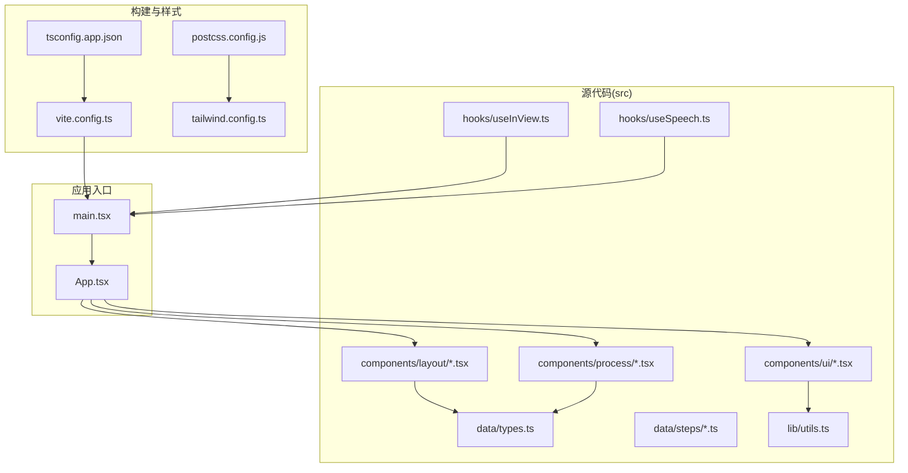
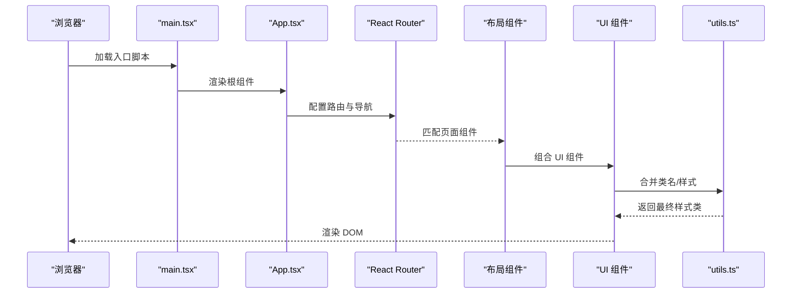
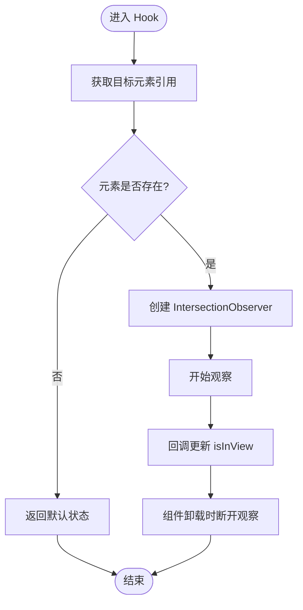
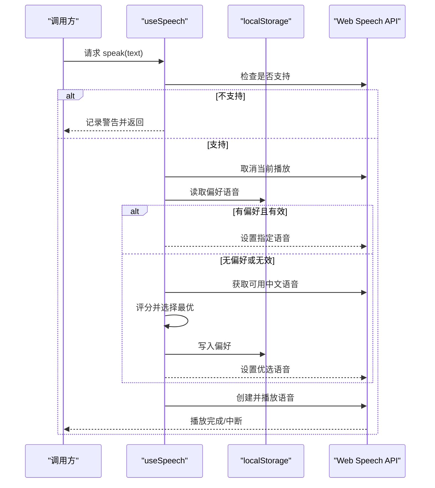
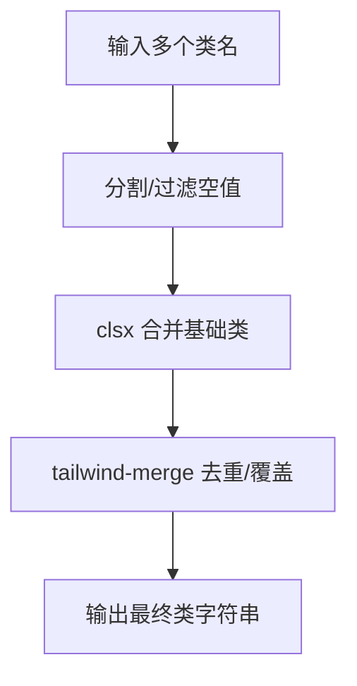
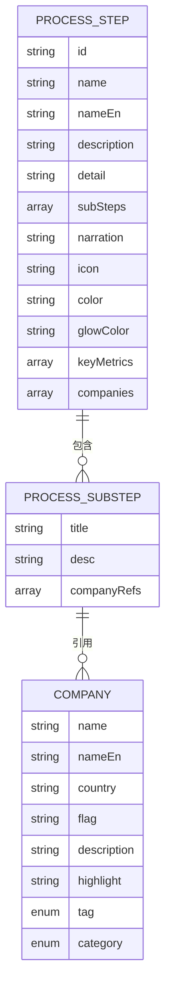
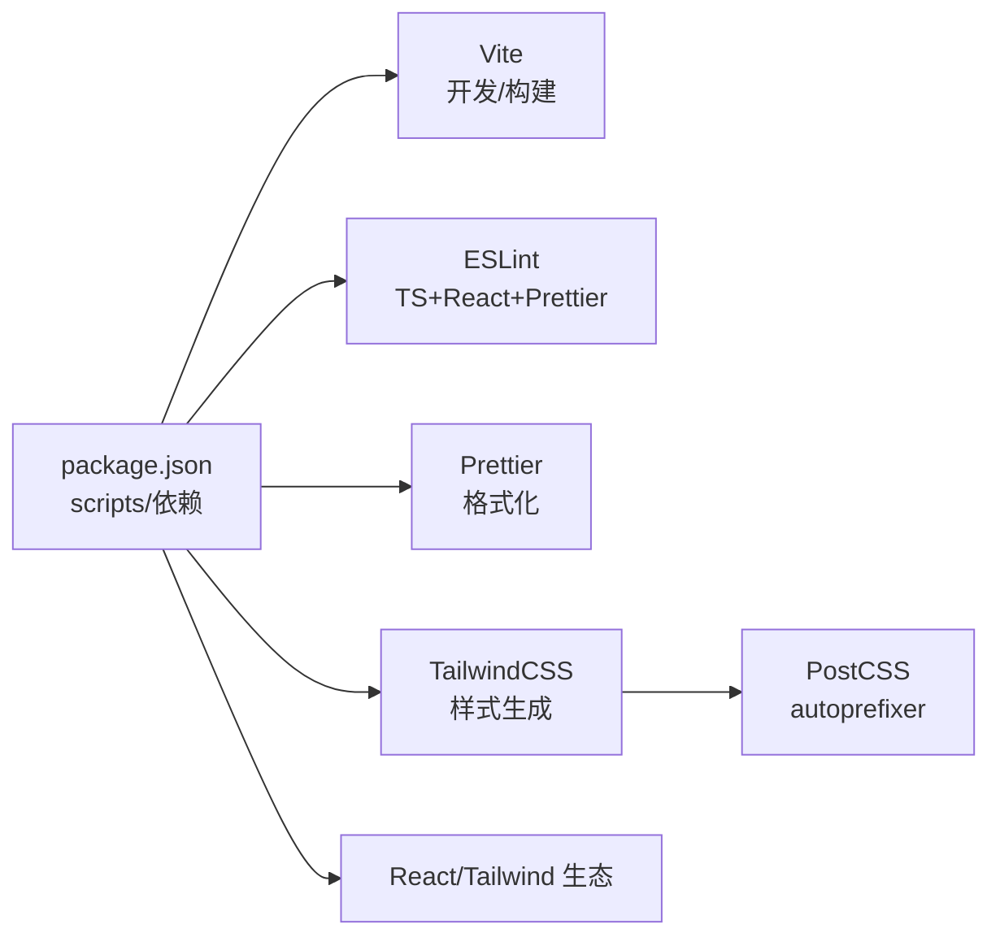

# 开发指南

<cite>
**本文引用的文件**
- [package.json](file://package.json)
- [eslint.config.mjs](file://eslint.config.mjs)
- [.prettierrc](file://.prettierrc)
- [tsconfig.json](file://tsconfig.json)
- [tsconfig.app.json](file://tsconfig.app.json)
- [vite.config.ts](file://vite.config.ts)
- [postcss.config.js](file://postcss.config.js)
- [tailwind.config.ts](file://tailwind.config.ts)
- [src/main.tsx](file://src/main.tsx)
- [src/App.tsx](file://src/App.tsx)
- [src/lib/utils.ts](file://src/lib/utils.ts)
- [src/hooks/useInView.ts](file://src/hooks/useInView.ts)
- [src/hooks/useSpeech.ts](file://src/hooks/useSpeech.ts)
- [src/data/types.ts](file://src/data/types.ts)
- [src/data/processes.ts](file://src/data/processes.ts)
</cite>

## 目录
1. [简介](#简介)
2. [项目结构](#项目结构)
3. [核心组件](#核心组件)
4. [架构总览](#架构总览)
5. [详细组件分析](#详细组件分析)
6. [依赖分析](#依赖分析)
7. [性能考虑](#性能考虑)
8. [故障排查指南](#故障排查指南)
9. [结论](#结论)
10. [附录](#附录)

## 简介
本开发指南面向“芯片制造演示项目”的团队协作与工程化实践，目标是建立统一的开发标准、代码规范与质量保障流程，覆盖从开发环境配置、代码风格与静态检查、构建与预览、到调试与性能分析、测试策略与覆盖率、版本控制与协作规范、以及部署前检查清单的全链路工作流。  
本项目采用 React + TypeScript + Vite + TailwindCSS 技术栈，结合 ESLint、Prettier、TypeScript 编译器与 PostCSS 生态，确保类型安全、一致的代码风格与高效的构建体验。

## 项目结构
项目采用按功能域分层的组织方式：  
- 源码位于 src/ 下，按领域拆分：components（布局、业务组件、UI 组件）、data（类型定义与数据加载入口）、hooks（自定义 Hook）、lib（工具函数）、路由与入口在根级文件中组织。  
- 构建与样式由 Vite、TailwindCSS、PostCSS 驱动；TypeScript 使用双层 tsconfig 结构进行严格编译与路径别名支持。

**图表来源**
- [src/main.tsx:1-11](file://src/main.tsx#L1-L11)
- [src/App.tsx:1-23](file://src/App.tsx#L1-L23)
- [vite.config.ts:1-13](file://vite.config.ts#L1-L13)
- [tsconfig.app.json:1-26](file://tsconfig.app.json#L1-L26)
- [postcss.config.js:1-7](file://postcss.config.js#L1-L7)
- [tailwind.config.ts:1-143](file://tailwind.config.ts#L1-L143)

**章节来源**
- [src/main.tsx:1-11](file://src/main.tsx#L1-L11)
- [src/App.tsx:1-23](file://src/App.tsx#L1-L23)
- [vite.config.ts:1-13](file://vite.config.ts#L1-L13)
- [tsconfig.app.json:1-26](file://tsconfig.app.json#L1-L26)
- [postcss.config.js:1-7](file://postcss.config.js#L1-L7)
- [tailwind.config.ts:1-143](file://tailwind.config.ts#L1-L143)

## 核心组件
- 应用入口与路由：通过 main.tsx 渲染根节点，App.tsx 配置 BrowserRouter 与路由表，实现首页、工艺详情页与 404 页面的切换。  
- 工具函数：utils.ts 提供类名合并工具，简化 TailwindCSS 类拼接。  
- 自定义 Hook：  
  - useInView：基于 IntersectionObserver 的视口可见性检测，支持阈值与边距配置。  
  - useSpeech：封装 Web Speech API，自动选择中文自然语音、缓存偏好、处理异步语音资源加载与播放控制。  
- 数据模型：types.ts 定义公司、子步骤与工艺步骤的数据结构，作为前端数据契约。  
- 路径别名：Vite 与 TypeScript 均配置 @/* 到 src/*，提升导入可读性与一致性。

**章节来源**
- [src/main.tsx:1-11](file://src/main.tsx#L1-L11)
- [src/App.tsx:1-23](file://src/App.tsx#L1-L23)
- [src/lib/utils.ts:1-7](file://src/lib/utils.ts#L1-L7)
- [src/hooks/useInView.ts:1-32](file://src/hooks/useInView.ts#L1-L32)
- [src/hooks/useSpeech.ts:1-135](file://src/hooks/useSpeech.ts#L1-L135)
- [src/data/types.ts:1-33](file://src/data/types.ts#L1-L33)
- [vite.config.ts:7-11](file://vite.config.ts#L7-L11)
- [tsconfig.app.json:19-22](file://tsconfig.app.json#L19-L22)

## 架构总览
下图展示从浏览器到组件渲染、数据与样式的端到端路径，体现模块化与职责分离：

**图表来源**
- [src/main.tsx:1-11](file://src/main.tsx#L1-L11)
- [src/App.tsx:1-23](file://src/App.tsx#L1-L23)
- [src/lib/utils.ts:1-7](file://src/lib/utils.ts#L1-L7)

## 详细组件分析

### 组件一：useInView Hook（视口可见性检测）
- 设计要点：使用 IntersectionObserver 实现轻量、高性能的可见性监听；支持阈值与根容器边距配置；在组件卸载时自动清理观察者。  
- 复杂度：O(1) 观察与回调触发；内存占用低。  
- 错误处理：元素为空时直接返回，避免异常；观察者生命周期管理完善。  
- 性能影响：单实例观察者，适合滚动场景；建议合理设置阈值与边距以减少频繁触发。

**图表来源**
- [src/hooks/useInView.ts:15-28](file://src/hooks/useInView.ts#L15-L28)

**章节来源**
- [src/hooks/useInView.ts:1-32](file://src/hooks/useInView.ts#L1-L32)

### 组件二：useSpeech Hook（中文语音合成）
- 设计要点：  
  - 语音评分与偏好持久化：根据神经音色、本地服务、语言区域等维度打分，优先选择更自然的中文语音，并缓存用户偏好。  
  - 异步语音资源处理：等待浏览器 onvoiceschanged 事件，确保可用语音列表加载完成后再播放。  
  - 安全降级：不支持 Web Speech API 时记录警告并中止。  
- 复杂度：语音筛选排序 O(n log n)，后续调用 O(1)。  
- 错误处理：网络或存储异常时静默容错；取消播放时重置事件监听。  
- 性能影响：语音加载完成后复用实例；避免重复创建 Utterance。

**图表来源**
- [src/hooks/useSpeech.ts:42-104](file://src/hooks/useSpeech.ts#L42-L104)

**章节来源**
- [src/hooks/useSpeech.ts:1-135](file://src/hooks/useSpeech.ts#L1-L135)

### 组件三：工具函数 cn（类名合并）
- 设计要点：基于 clsx 与 tailwind-merge 合并类名，避免冲突与重复，输出简洁的最终类字符串。  
- 复杂度：线性扫描输入类名，去重合并。  
- 适用场景：UI 组件根据状态动态组合样式类。

**图表来源**
- [src/lib/utils.ts:4-6](file://src/lib/utils.ts#L4-L6)

**章节来源**
- [src/lib/utils.ts:1-7](file://src/lib/utils.ts#L1-L7)

### 组件四：数据模型与类型契约
- 设计要点：  
  - Company：企业信息与标签分类。  
  - ProcessSubStep：工艺子步骤描述与企业引用。  
  - ProcessStep：完整工艺步骤的元数据、关键指标、企业列表等。  
- 作用：为页面组件与数据加载提供强类型约束，降低运行期错误风险。

**图表来源**
- [src/data/types.ts:1-33](file://src/data/types.ts#L1-L33)

**章节来源**
- [src/data/types.ts:1-33](file://src/data/types.ts#L1-L33)

## 依赖分析
- 构建与打包：Vite 提供快速开发服务器与生产构建；TypeScript 与 bundler 模块解析配合，确保路径别名与严格类型检查。  
- 样式管线：TailwindCSS + PostCSS（autoprefixer）生成最小化样式；Tailwind 动画扩展提供丰富的视觉反馈。  
- 代码质量：ESLint + TypeScript ESLint 插件 + Prettier 插件形成统一规则集；Prettier 单独配置保证格式一致性。  
- 运行时依赖：React 生态、路由、图标库、Tailwind 扩展等。

**图表来源**
- [package.json:6-14](file://package.json#L6-L14)
- [postcss.config.js:1-7](file://postcss.config.js#L1-L7)
- [tailwind.config.ts:1-143](file://tailwind.config.ts#L1-L143)

**章节来源**
- [package.json:1-45](file://package.json#L1-L45)
- [postcss.config.js:1-7](file://postcss.config.js#L1-L7)
- [tailwind.config.ts:1-143](file://tailwind.config.ts#L1-L143)

## 性能考虑
- 构建与打包
  - 使用 Vite 的原生 ES 模块与按需编译，缩短冷启动时间；生产构建开启压缩与资源内联策略。  
  - TypeScript 使用 bundler 模式与 noEmit，避免重复转译，提升增量构建速度。  
- 样式与动画
  - Tailwind 动画与关键帧仅在使用时生成，避免全局膨胀；建议按需引入动画类，减少不必要的 CSS。  
- 运行时性能
  - useInView 使用单个观察者实例，合理设置阈值与 rootMargin，避免高频触发导致的重排。  
  - useSpeech 复用语音实例与偏好缓存，减少重复初始化成本。  
- 资源加载
  - 图片与媒体资源建议使用现代格式与懒加载策略；组件内部可结合 useInView 实现视口懒加载。

[本节为通用指导，无需特定文件来源]

## 故障排查指南
- ESLint 报错
  - 症状：编辑器或命令行提示规则违规。  
  - 排查：确认规则配置与文件忽略范围；优先执行格式化与修复脚本，再运行 ESLint 检查。  
  - 参考：规则与忽略配置见 ESLint 配置文件。  
- Prettier 格式差异
  - 症状：不同编辑器显示缩进/引号不一致。  
  - 排查：统一使用 Prettier 写入与检查脚本；确保编辑器启用保存时格式化。  
- TypeScript 类型错误
  - 症状：编译失败或智能提示异常。  
  - 排查：检查 tsconfig 的 strict、paths 与 moduleResolution；确保路径别名与实际目录一致。  
- Vite 启动/热更新问题
  - 症状：无法启动或热更新失效。  
  - 排查：清理 node_modules/.vite 缓存；检查插件与别名配置；确认端口未被占用。  
- Tailwind 样式未生效
  - 症状：自定义颜色/动画类无效。  
  - 排查：确认 content 路径包含目标文件；重新运行构建；检查 PostCSS 插件顺序。  
- Web Speech API 不可用
  - 症状：语音无法播放或报错。  
  - 排查：确认浏览器支持与 HTTPS 环境；等待 onvoiceschanged 事件；检查 localStorage 权限。

**章节来源**
- [eslint.config.mjs:26-33](file://eslint.config.mjs#L26-L33)
- [.prettierrc:1-9](file://.prettierrc#L1-L9)
- [tsconfig.app.json:14-22](file://tsconfig.app.json#L14-L22)
- [vite.config.ts:5-12](file://vite.config.ts#L5-L12)
- [tailwind.config.ts:5-8](file://tailwind.config.ts#L5-L8)
- [src/hooks/useSpeech.ts:74-104](file://src/hooks/useSpeech.ts#L74-L104)

## 结论
本指南围绕“芯片制造演示项目”建立了从开发环境到构建部署的完整工程化标准：  
- 以 ESLint + Prettier + TypeScript 保障代码质量与一致性；  
- 以 Vite + TailwindCSS + PostCSS 优化开发体验与样式产出；  
- 以自定义 Hook 与类型契约提升可维护性与可测试性；  
- 以明确的脚本与检查清单固化质量门禁。  
建议团队在日常协作中严格执行脚本与规范，持续优化性能与用户体验。

[本节为总结，无需特定文件来源]

## 附录

### A. 代码规范与最佳实践
- ESLint 配置要点
  - 推荐规则：关闭 JSX 需显式引入 React 的规则；关闭 prop-types；对未使用变量允许忽略前缀；允许 warn/error 级控制台输出。  
  - 插件集成：React 与 React Hooks 推荐规则；与 Prettier 插件协同，避免格式冲突。  
- Prettier 配置要点
  - 统一语句结尾、单引号、缩进宽度、尾随逗号、行长与箭头函数括号策略。  
- TypeScript 设置要点
  - 严格模式与未使用项检查；bundler 模式与 noEmit；路径别名与 JSX 运行时；包含 src 目录。  
- Vite 配置要点
  - React 插件与路径别名；开发服务器与预览命令；生产构建与产物优化。  
- Tailwind 配置要点
  - 深色模式、内容扫描路径、自定义颜色与动画；PostCSS 插件顺序与 autoprefixer。

**章节来源**
- [eslint.config.mjs:8-44](file://eslint.config.mjs#L8-L44)
- [.prettierrc:1-9](file://.prettierrc#L1-L9)
- [tsconfig.json:1-7](file://tsconfig.json#L1-L7)
- [tsconfig.app.json:2-25](file://tsconfig.app.json#L2-L25)
- [vite.config.ts:1-13](file://vite.config.ts#L1-L13)
- [tailwind.config.ts:1-143](file://tailwind.config.ts#L1-L143)
- [postcss.config.js:1-7](file://postcss.config.js#L1-L7)

### B. 开发环境配置与优化策略
- 本地开发
  - 使用 npm 脚本启动 dev；在编辑器中启用 ESLint 与 Prettier 插件；保存时自动格式化。  
  - 通过别名 @/* 快速导入，避免相对路径混乱。  
- 构建与预览
  - 使用 build 脚本进行类型检查与打包；preview 预览生产包效果。  
- 样式优化
  - 仅引入使用到的动画类；保持 content 路径准确；避免过度嵌套与重复类名。

**章节来源**
- [package.json:6-14](file://package.json#L6-L14)
- [vite.config.ts:7-11](file://vite.config.ts#L7-L11)
- [tailwind.config.ts:5-8](file://tailwind.config.ts#L5-L8)

### C. 调试技巧与性能分析
- 调试技巧
  - 在 useSpeech 中利用日志与条件断点定位语音加载时机；在 useInView 中打印 isInView 变化频率以评估阈值设置。  
  - 使用 React DevTools Profiler 分析组件渲染热点；在 Tailwind 中临时添加背景色辅助定位布局问题。  
- 性能分析
  - 使用浏览器性能面板观察主线程阻塞；关注 IntersectionObserver 回调频率与 Web Speech API 播放延迟。  
  - 对长列表与复杂动画场景，建议拆分渲染批次与降低动画复杂度。

**章节来源**
- [src/hooks/useSpeech.ts:74-104](file://src/hooks/useSpeech.ts#L74-L104)
- [src/hooks/useInView.ts:15-28](file://src/hooks/useInView.ts#L15-L28)

### D. 测试策略与覆盖率要求
- 单元测试
  - 对纯函数与 Hook（如 useInView、useSpeech 的核心逻辑）编写单元测试，覆盖边界条件与异步分支。  
- 集成测试
  - 使用 React Testing Library 或类似方案，验证路由切换、组件渲染与交互行为。  
- 覆盖率要求
  - 建议：函数级与语句级覆盖率不低于 80%，关键路径不低于 90%。  
- 质量门禁
  - 将测试纳入 CI，失败即阻断合并；结合 ESLint 与 Prettier 检查作为前置条件。

[本节为通用指导，无需特定文件来源]

### E. 版本控制与协作开发最佳实践
- 分支策略
  - 主分支保护与提交审核；特性分支命名规范；提交信息遵循约定式提交。  
- 代码审查
  - 关注可读性、性能与安全性；优先解决 ESLint/Prettier 警告；确保类型安全。  
- 冲突与回滚
  - 避免在大文件上直接修改；必要时拆分提交；使用 rebase 保持历史整洁。

[本节为通用指导，无需特定文件来源]

### F. 构建优化与部署前检查清单
- 构建优化
  - 启用 Tree Shaking 与按需导入；压缩与分包策略；静态资源指纹化。  
- 部署前检查
  - 本地预览生产包；检查关键页面与交互；验证字体与图片加载；确认无障碍与可访问性。  
- 回归验证
  - 在多浏览器与设备上验证；关注动画与语音在不同系统上的表现。

[本节为通用指导，无需特定文件来源]