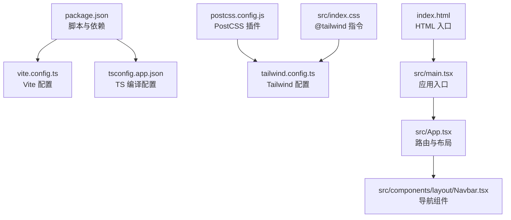
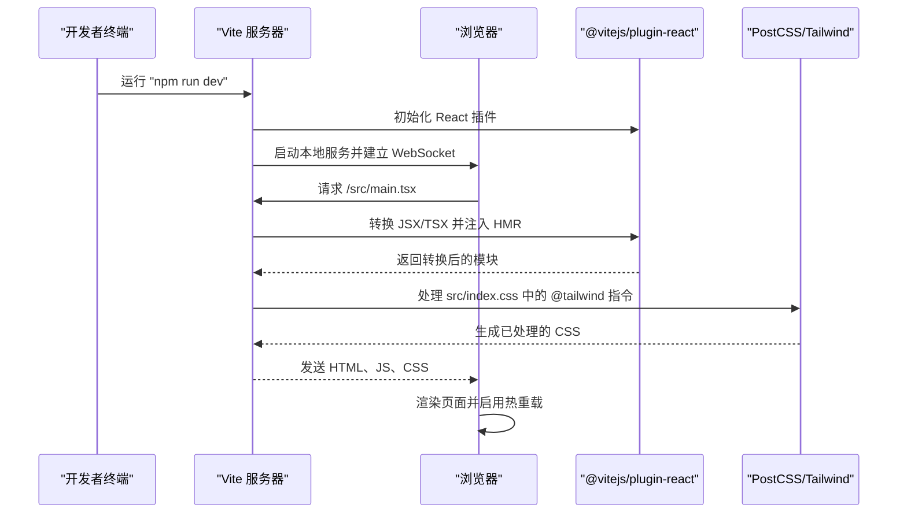
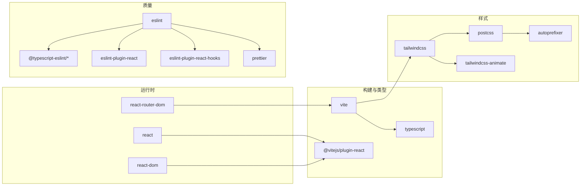

# 开发环境配置

<cite>
**本文引用的文件**
- [package.json](file://package.json)
- [vite.config.ts](file://vite.config.ts)
- [tailwind.config.ts](file://tailwind.config.ts)
- [postcss.config.js](file://postcss.config.js)
- [tsconfig.json](file://tsconfig.json)
- [tsconfig.app.json](file://tsconfig.app.json)
- [eslint.config.mjs](file://eslint.config.mjs)
- [.prettierrc](file://.prettierrc)
- [.npmrc](file://.npmrc)
- [index.html](file://index.html)
- [src/main.tsx](file://src/main.tsx)
- [src/App.tsx](file://src/App.tsx)
- [src/index.css](file://src/index.css)
- [.gitignore](file://.gitignore)
- [src/components/layout/Navbar.tsx](file://src/components/layout/Navbar.tsx)
</cite>

## 目录
1. [简介](#简介)
2. [项目结构](#项目结构)
3. [核心组件](#核心组件)
4. [架构总览](#架构总览)
5. [详细组件分析](#详细组件分析)
6. [依赖分析](#依赖分析)
7. [性能考量](#性能考量)
8. [故障排查指南](#故障排查指南)
9. [结论](#结论)
10. [附录](#附录)

## 简介
本指南面向“芯片制造演示项目”的前端开发团队与个人开发者，提供从零到一的完整开发环境配置方案。内容覆盖 Node.js 版本与包管理器选择、Vite 构建工具的配置与优化、Tailwind CSS 与 PostCSS 的集成、本地开发服务器与热重载、浏览器兼容性与 polyfill、开发工具与插件、环境变量与安全注意事项，以及跨操作系统的安装与配置步骤。目标是帮助你在不同环境下快速搭建一致且高效的开发体验。

## 项目结构
该项目采用基于功能模块的组织方式，核心入口位于 src 目录，使用 Vite 作为构建工具，TypeScript 提供类型系统，Tailwind CSS 负责样式层，并通过 PostCSS 自动前缀与按需生成样式。

图表来源
- [package.json:1-45](file://package.json#L1-L45)
- [vite.config.ts:1-13](file://vite.config.ts#L1-L13)
- [tsconfig.app.json:1-26](file://tsconfig.app.json#L1-L26)
- [postcss.config.js:1-7](file://postcss.config.js#L1-L7)
- [tailwind.config.ts:1-143](file://tailwind.config.ts#L1-L143)
- [src/index.css:1-142](file://src/index.css#L1-L142)
- [src/main.tsx:1-11](file://src/main.tsx#L1-L11)
- [src/App.tsx:1-23](file://src/App.tsx#L1-L23)
- [src/components/layout/Navbar.tsx:1-82](file://src/components/layout/Navbar.tsx#L1-L82)
- [index.html:1-15](file://index.html#L1-L15)

章节来源
- [package.json:1-45](file://package.json#L1-L45)
- [vite.config.ts:1-13](file://vite.config.ts#L1-L13)
- [tsconfig.app.json:1-26](file://tsconfig.app.json#L1-L26)
- [postcss.config.js:1-7](file://postcss.config.js#L1-L7)
- [tailwind.config.ts:1-143](file://tailwind.config.ts#L1-L143)
- [src/index.css:1-142](file://src/index.css#L1-L142)
- [src/main.tsx:1-11](file://src/main.tsx#L1-L11)
- [src/App.tsx:1-23](file://src/App.tsx#L1-L23)
- [src/components/layout/Navbar.tsx:1-82](file://src/components/layout/Navbar.tsx#L1-L82)
- [index.html:1-15](file://index.html#L1-L15)

## 核心组件
- 包管理与脚本：通过 package.json 定义开发与构建脚本，包括 dev、build、preview、lint、format 等。
- 构建工具：Vite 提供快速的开发服务器与生产构建，配合 @vitejs/plugin-react 实现 React 快速刷新。
- 类型系统：TypeScript 使用严格模式与路径别名，确保类型安全与可维护性。
- 样式系统：Tailwind CSS 与 PostCSS 结合，实现原子化样式与自动前缀；@tailwind 指令在全局样式中启用基础、组件与工具类。
- 代码质量：ESLint 与 Prettier 集成，统一风格与规则；.prettierrc 提供格式化偏好。
- 路由与入口：React Router DOM 管理页面路由；index.html 与 src/main.tsx 组成应用入口。

章节来源
- [package.json:6-14](file://package.json#L6-L14)
- [vite.config.ts:5-12](file://vite.config.ts#L5-L12)
- [tsconfig.app.json:2-22](file://tsconfig.app.json#L2-L22)
- [postcss.config.js:1-7](file://postcss.config.js#L1-L7)
- [tailwind.config.ts:3-140](file://tailwind.config.ts#L3-L140)
- [eslint.config.mjs:8-44](file://eslint.config.mjs#L8-L44)
- [.prettierrc:1-9](file://.prettierrc#L1-L9)
- [index.html:1-15](file://index.html#L1-L15)
- [src/main.tsx:1-11](file://src/main.tsx#L1-L11)

## 架构总览
下图展示从浏览器请求到页面渲染的关键流程，包括开发服务器启动、模块解析、样式注入与热更新机制。

图表来源
- [vite.config.ts:5-12](file://vite.config.ts#L5-L12)
- [postcss.config.js:1-7](file://postcss.config.js#L1-L7)
- [src/index.css:1-3](file://src/index.css#L1-L3)
- [src/main.tsx:1-11](file://src/main.tsx#L1-L11)

章节来源
- [vite.config.ts:5-12](file://vite.config.ts#L5-L12)
- [postcss.config.js:1-7](file://postcss.config.js#L1-L7)
- [src/index.css:1-3](file://src/index.css#L1-L3)
- [src/main.tsx:1-11](file://src/main.tsx#L1-L11)

## 详细组件分析

### Node.js 与包管理器
- Node.js 版本建议：项目使用 ES2020 目标与 ESNext 模块解析，建议使用 Node.js 18+（长期支持版本）以获得最佳兼容性与性能。
- 包管理器选择：推荐使用 npm（项目已提供 .npmrc）。若团队偏好，也可使用 pnpm 或 Yarn，但需注意 peer dependencies 与解析策略差异。
- 依赖安装：执行 npm ci 或 npm install 安装依赖后，运行 npm run dev 启动开发服务器。

章节来源
- [tsconfig.app.json:3-8](file://tsconfig.app.json#L3-L8)
- [.npmrc:1-2](file://.npmrc#L1-L2)
- [package.json:15-43](file://package.json#L15-L43)

### Vite 配置与优化
- 基础配置：启用 @vitejs/plugin-react，开启 React 快速刷新；配置路径别名 @ 指向 src，便于导入。
- 性能优化建议：
  - 预构建依赖：对稳定第三方库启用预构建以加速冷启动与 HMR。
  - 动态导入：对路由或重型组件使用动态导入，减少首屏体积。
  - 构建产物分析：使用 rollup-plugin-visualizer 生成包体分析报告。
  - 环境变量：区分开发与生产环境变量，避免将敏感信息提交到仓库。
- HMR 行为：React 插件默认启用 HMR，修改组件会触发局部热更新，保持状态与滚动位置。

章节来源
- [vite.config.ts:5-12](file://vite.config.ts#L5-L12)
- [package.json:6-14](file://package.json#L6-L14)

### Tailwind CSS 与 PostCSS 集成
- Tailwind 配置：启用暗色模式、内容扫描路径、自定义颜色与动画；通过 tailwindcss-animate 插件扩展动画能力。
- PostCSS 配置：启用 tailwindcss 与 autoprefixer，自动添加浏览器前缀并按需生成样式。
- 全局样式：在 src/index.css 中引入 @tailwind base、components、utilities，并在 @layer base 中定义主题变量与渐变、阴影等通用样式。
- 组件样式：组件通过原子类组合样式，如 Navbar 使用 Tailwind 类实现响应式布局与高斯模糊背景。

章节来源
- [tailwind.config.ts:3-140](file://tailwind.config.ts#L3-L140)
- [postcss.config.js:1-7](file://postcss.config.js#L1-L7)
- [src/index.css:1-142](file://src/index.css#L1-L142)
- [src/components/layout/Navbar.tsx:1-82](file://src/components/layout/Navbar.tsx#L1-L82)

### TypeScript 配置
- 目标与模块：ES2020 目标与 ESNext 模块解析，bundler 解析策略，确保与 Vite 协同工作。
- 路径别名：通过 baseUrl 与 paths 配置 @/* 映射至 src，提升导入可读性。
- 严格模式：启用严格检查、未使用变量/参数检测、无检查边效导入等规则，提升代码质量。

章节来源
- [tsconfig.app.json:2-22](file://tsconfig.app.json#L2-L22)
- [tsconfig.json:1-7](file://tsconfig.json#L1-L7)

### ESLint 与 Prettier
- ESLint：基于 typescript-eslint 与 react-hooks 规则集，关闭 react/react-in-jsx-scope，允许 console.warn/error，集成 Prettier 推荐规则。
- Prettier：统一分号、单引号、缩进宽度、尾随逗号与行长等格式化偏好。
- 工作流：通过 npm run lint 与 npm run format 执行静态检查与格式化；CI 可复用相同规则保障一致性。

章节来源
- [eslint.config.mjs:8-44](file://eslint.config.mjs#L8-L44)
- [.prettierrc:1-9](file://.prettierrc#L1-L9)
- [package.json:10-13](file://package.json#L10-L13)

### 本地开发服务器与热重载
- 启动命令：npm run dev 启动 Vite 开发服务器，默认监听端口可在 vite.config.ts 中调整。
- 热重载：React 插件提供 HMR，修改组件或样式会触发热更新；PostCSS 与 Tailwind 在开发时即时编译。
- 路由与入口：index.html 作为 HTML 入口，src/main.tsx 作为 JS 入口，React Router DOM 管理页面路由。

章节来源
- [package.json:7](file://package.json#L7)
- [vite.config.ts:5-12](file://vite.config.ts#L5-L12)
- [index.html:1-15](file://index.html#L1-L15)
- [src/main.tsx:1-11](file://src/main.tsx#L1-L11)
- [src/App.tsx:1-23](file://src/App.tsx#L1-L23)

### 浏览器兼容性与 Polyfill
- 目标环境：ES2020 目标与现代浏览器特性，建议在 CI 与部署前使用浏览器测试矩阵验证兼容性。
- Polyfill 策略：若需支持较老浏览器，可在入口处按需引入 core-js 与 regenerator-runtime；或通过 Babel preset env 与 browserslist 控制转译范围。
- CSS 兼容：autoprefixer 已在 PostCSS 中启用，自动添加必要前缀；Tailwind 默认不包含实验性特性，避免引入不必要 polyfill。

章节来源
- [tsconfig.app.json:3-5](file://tsconfig.app.json#L3-L5)
- [postcss.config.js:1-7](file://postcss.config.js#L1-L7)

### 开发工具与插件推荐
- VS Code 插件：ESLint、Prettier、Tailwind CSS IntelliSense、TypeScript Importer、Bracket Pair Colorizer。
- 浏览器扩展：React Developer Tools、Redux DevTools（如使用 Redux）。
- 命令行工具：nvm（管理 Node.js 版本）、direnv（隔离环境变量）。

[本节为通用实践建议，无需特定文件引用]

### 环境变量与安全性
- 变量命名：区分开发与生产变量，使用 .env.development 与 .env.production；避免在代码中硬编码敏感信息。
- 忽略清单：.gitignore 已忽略 .env* 文件，防止误提交；同时忽略 node_modules、dist 等目录。
- 安全建议：仅导出前端可见的最小必要变量；后端接口地址与密钥应通过代理或后端服务暴露。

章节来源
- [.gitignore:8](file://.gitignore#L8)

### 不同操作系统安装与配置步骤
- macOS/Linux
  1) 安装 nvm 并使用 Node.js 18+。
  2) 克隆仓库并安装依赖：npm install。
  3) 启动开发服务器：npm run dev。
  4) 如需格式化与检查：npm run format 与 npm run lint。
- Windows
  1) 使用 nvm-windows 或直接下载 Node.js 18+。
  2) 在 Git Bash 或 WSL 中执行上述 npm 命令，或在 PowerShell 中使用兼容模式。
  3) 若遇到权限问题，使用管理员权限打开终端或调整 npm 缓存目录。

[本节为通用安装步骤，无需特定文件引用]

## 依赖分析
项目依赖围绕 React 生态与现代化构建链路展开，核心包括：
- 运行时：react、react-dom、react-router-dom。
- 构建与类型：vite、@vitejs/plugin-react、typescript。
- 样式：tailwindcss、postcss、autoprefixer、tailwindcss-animate。
- 质量：eslint、@typescript-eslint/*、eslint-plugin-react、eslint-plugin-react-hooks、prettier。

图表来源
- [package.json:15-43](file://package.json#L15-L43)

章节来源
- [package.json:15-43](file://package.json#L15-L43)

## 性能考量
- 构建优化
  - 启用预构建与动态导入，减少首屏体积。
  - 使用外部化策略排除不常变更的依赖。
  - 启用压缩与资源内联策略，平衡加载速度与缓存命中。
- 运行时优化
  - 合理拆分组件，避免不必要的重渲染。
  - 使用 React.lazy 与 Suspense 对重型组件进行懒加载。
  - Tailwind 建议在生产构建时启用 purge 以移除未使用样式。
- 开发体验
  - 保持 HMR 精准更新，减少全量刷新。
  - 使用严格的 ESLint 规则与 Prettier 格式化，降低调试成本。

[本节为通用性能建议，无需特定文件引用]

## 故障排查指南
- 依赖安装失败
  - 清理缓存并重试：npm cache clean --force；删除 node_modules 与 package-lock.json 后重新安装。
  - 检查 .npmrc 中 legacy-peer-deps=true 是否导致冲突。
- 热重载无效
  - 确认 @vitejs/plugin-react 已正确启用；检查浏览器控制台是否有 HMR 错误。
  - 确保修改的文件在 Vite 内容扫描范围内（默认包含 src 与 index.html）。
- 样式未生效
  - 确认 src/index.css 中 @tailwind 指令存在且 PostCSS 已启用。
  - 检查 tailwind.config.ts 的 content 路径是否包含当前组件文件。
- TypeScript 报错
  - 检查 tsconfig.app.json 的 target、moduleResolution 与 paths 设置。
  - 使用 npm run lint:fix 修复常见问题。
- Lint/Prettier 冲突
  - 确保编辑器启用 ESLint 与 Prettier 插件；统一 .prettierrc 配置。

章节来源
- [.npmrc:1-2](file://.npmrc#L1-L2)
- [vite.config.ts:5-12](file://vite.config.ts#L5-L12)
- [postcss.config.js:1-7](file://postcss.config.js#L1-L7)
- [tailwind.config.ts:5-8](file://tailwind.config.ts#L5-L8)
- [tsconfig.app.json:2-22](file://tsconfig.app.json#L2-L22)
- [eslint.config.mjs:8-44](file://eslint.config.mjs#L8-L44)
- [.prettierrc:1-9](file://.prettierrc#L1-L9)

## 结论
本指南提供了从 Node.js、包管理器、Vite、Tailwind CSS 到 ESLint/Prettier 的完整开发环境配置路径。通过遵循本文档的步骤与最佳实践，你可以在不同操作系统上快速搭建一致的开发体验，并在保证代码质量的同时提升构建与运行效率。建议在团队内统一工具链与配置，结合 CI/CD 确保交付质量。

## 附录
- 常用命令速查
  - 启动开发：npm run dev
  - 构建生产：npm run build
  - 预览生产：npm run preview
  - 代码检查：npm run lint
  - 自动修复：npm run lint:fix
  - 格式化：npm run format
  - 校验格式：npm run format:check

章节来源
- [package.json:6-14](file://package.json#L6-L14)