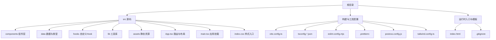
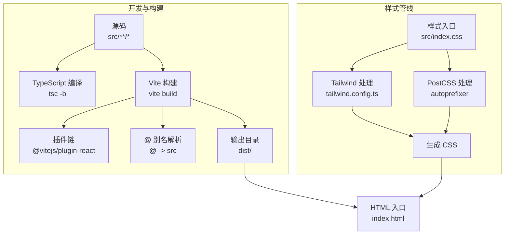
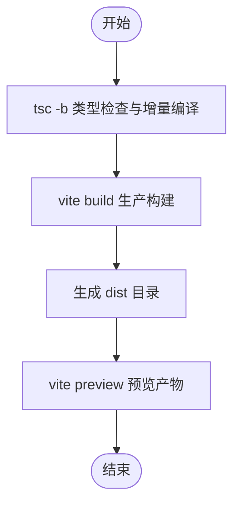
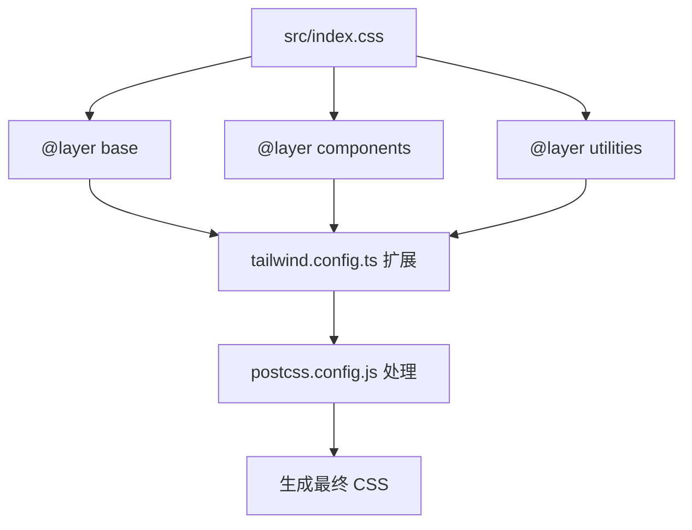
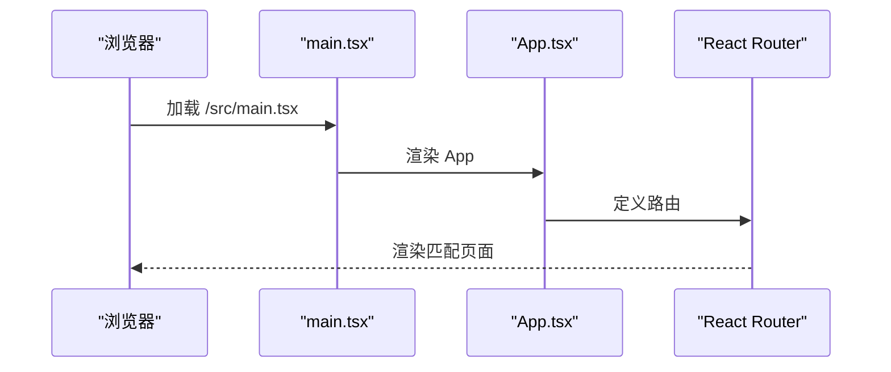
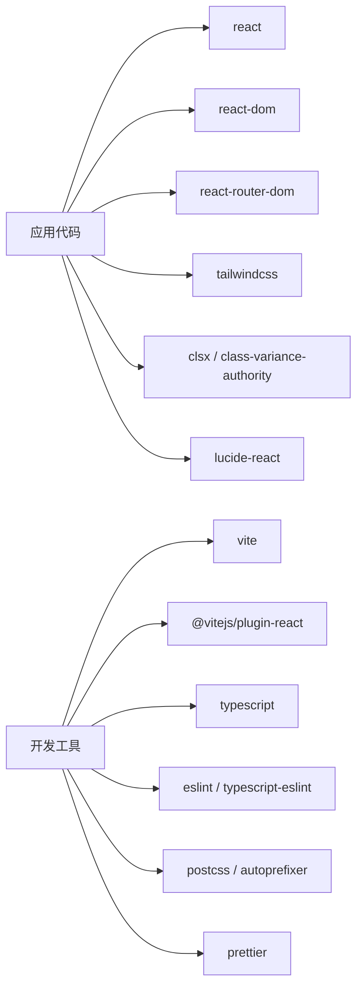

# 构建与部署

<cite>
**本文引用的文件**
- [package.json](file://package.json)
- [vite.config.ts](file://vite.config.ts)
- [tailwind.config.ts](file://tailwind.config.ts)
- [postcss.config.js](file://postcss.config.js)
- [index.html](file://index.html)
- [tsconfig.json](file://tsconfig.json)
- [tsconfig.app.json](file://tsconfig.app.json)
- [eslint.config.mjs](file://eslint.config.mjs)
- [.prettierrc](file://.prettierrc)
- [.gitignore](file://.gitignore)
- [src/App.tsx](file://src/App.tsx)
- [src/main.tsx](file://src/main.tsx)
- [src/index.css](file://src/index.css)
</cite>

## 目录
1. [简介](#简介)
2. [项目结构](#项目结构)
3. [核心组件](#核心组件)
4. [架构总览](#架构总览)
5. [详细组件分析](#详细组件分析)
6. [依赖分析](#依赖分析)
7. [性能考虑](#性能考虑)
8. [故障排除指南](#故障排除指南)
9. [结论](#结论)
10. [附录](#附录)

## 简介
本指南面向“芯片制造演示项目”的构建与部署，覆盖生产环境构建流程、优化策略、静态资源打包与CDN集成、Tailwind CSS在生产中的优化与CSS提取、GitHub Pages等静态托管平台部署步骤、环境变量管理与构建产物验证方法、性能监控与错误追踪的集成思路，以及自动化部署流水线的最佳实践与故障排除建议。  
项目采用 Vite + React + TypeScript + Tailwind CSS 技术栈，使用 PostCSS 自动前缀与 Tailwind 处理器，构建产物默认输出至 dist 目录。

## 项目结构
项目采用按功能分层的组织方式：  
- 源码位于 src 目录，包含页面、组件、UI工具、数据模型、自定义Hook与样式入口
- 根目录提供构建与开发脚本、类型检查配置、ESLint规则、Prettier格式化配置、PostCSS与Tailwind配置、HTML入口模板、TS编译配置与忽略规则

图示来源
- [vite.config.ts:1-13](file://vite.config.ts#L1-L13)
- [tsconfig.json:1-7](file://tsconfig.json#L1-L7)
- [tsconfig.app.json:1-26](file://tsconfig.app.json#L1-L26)
- [eslint.config.mjs:1-45](file://eslint.config.mjs#L1-L45)
- [.prettierrc:1-9](file://.prettierrc#L1-L9)
- [postcss.config.js:1-7](file://postcss.config.js#L1-L7)
- [tailwind.config.ts:1-143](file://tailwind.config.ts#L1-L143)
- [index.html:1-15](file://index.html#L1-L15)
- [.gitignore:1-11](file://.gitignore#L1-L11)
- [src/App.tsx:1-23](file://src/App.tsx#L1-L23)
- [src/main.tsx:1-11](file://src/main.tsx#L1-L11)
- [src/index.css:1-142](file://src/index.css#L1-L142)

章节来源
- [package.json:1-46](file://package.json#L1-L46)
- [vite.config.ts:1-13](file://vite.config.ts#L1-L13)
- [tsconfig.json:1-7](file://tsconfig.json#L1-L7)
- [tsconfig.app.json:1-26](file://tsconfig.app.json#L1-L26)
- [eslint.config.mjs:1-45](file://eslint.config.mjs#L1-L45)
- [.prettierrc:1-9](file://.prettierrc#L1-L9)
- [postcss.config.js:1-7](file://postcss.config.js#L1-L7)
- [tailwind.config.ts:1-143](file://tailwind.config.ts#L1-L143)
- [index.html:1-15](file://index.html#L1-L15)
- [.gitignore:1-11](file://.gitignore#L1-L11)
- [src/App.tsx:1-23](file://src/App.tsx#L1-L23)
- [src/main.tsx:1-11](file://src/main.tsx#L1-L11)
- [src/index.css:1-142](file://src/index.css#L1-L142)

## 核心组件
- 构建与打包：Vite 提供开发服务器与生产构建，TypeScript 编译通过 tsc -b 与 Vite 协同完成
- 样式系统：Tailwind CSS + PostCSS（tailwindcss + autoprefixer），通过 @tailwind 指令生成基础、组件与实用工具类
- 路由与应用入口：React Router DOM 管理路由，main.tsx 将 App 渲染到 DOM
- 类型与质量：TypeScript 严格模式、ESLint 规则、Prettier 统一风格
- 环境与别名：Vite 别名 @ 指向 src；无额外环境变量文件

章节来源
- [package.json:6-14](file://package.json#L6-L14)
- [vite.config.ts:5-12](file://vite.config.ts#L5-L12)
- [src/main.tsx:1-11](file://src/main.tsx#L1-L11)
- [src/App.tsx:1-23](file://src/App.tsx#L1-L23)
- [src/index.css:1-3](file://src/index.css#L1-L3)
- [postcss.config.js:1-7](file://postcss.config.js#L1-L7)
- [tailwind.config.ts:1-143](file://tailwind.config.ts#L1-L143)
- [tsconfig.app.json:14-22](file://tsconfig.app.json#L14-L22)

## 架构总览
下图展示从源码到构建产物的关键路径与处理阶段：

图示来源
- [vite.config.ts:5-12](file://vite.config.ts#L5-L12)
- [src/index.css:1-3](file://src/index.css#L1-L3)
- [postcss.config.js:1-7](file://postcss.config.js#L1-L7)
- [tailwind.config.ts:1-143](file://tailwind.config.ts#L1-L143)
- [index.html:1-15](file://index.html#L1-L15)

## 详细组件分析

### 构建与打包流程
- 开发：vite dev 启动本地服务
- 生产：先执行 tsc -b 进行类型检查与增量编译，再执行 vite build 产出 dist
- 输出：默认 dist 目录，包含 HTML、JS、CSS 与静态资源

图示来源
- [package.json:8](file://package.json#L8)
- [vite.config.ts:5-12](file://vite.config.ts#L5-L12)

章节来源
- [package.json:6-14](file://package.json#L6-L14)
- [vite.config.ts:5-12](file://vite.config.ts#L5-L12)

### 样式与Tailwind优化
- Tailwind 内容扫描：扫描 index.html 与 src 下所有 ts/tsx 文件，确保仅生成使用到的类
- 主题扩展：自定义颜色、圆角、keyframes 与动画，统一芯片主题风格
- PostCSS：启用 tailwindcss 与 autoprefixer，自动添加浏览器前缀
- 样式入口：通过 @tailwind 指令引入 base/components/utilities 三层，配合 @layer 增强可维护性

图示来源
- [src/index.css:1-142](file://src/index.css#L1-L142)
- [tailwind.config.ts:1-143](file://tailwind.config.ts#L1-L143)
- [postcss.config.js:1-7](file://postcss.config.js#L1-L7)

章节来源
- [src/index.css:1-142](file://src/index.css#L1-L142)
- [tailwind.config.ts:1-143](file://tailwind.config.ts#L1-L143)
- [postcss.config.js:1-7](file://postcss.config.js#L1-L7)

### 路由与应用入口
- 应用入口：main.tsx 创建根节点并渲染 App
- 路由：App 中使用 React Router DOM 定义首页、流程详情页与 404 页面

图示来源
- [src/main.tsx:1-11](file://src/main.tsx#L1-L11)
- [src/App.tsx:1-23](file://src/App.tsx#L1-L23)

章节来源
- [src/main.tsx:1-11](file://src/main.tsx#L1-L11)
- [src/App.tsx:1-23](file://src/App.tsx#L1-L23)

### 代码质量与格式化
- ESLint：基于 typescript-eslint 与 React 插件，关闭 JSX 需要显式导入 React 的规则，允许 console 警告与错误
- Prettier：统一缩进、单引号、尾逗号与行长等风格

章节来源
- [eslint.config.mjs:1-45](file://eslint.config.mjs#L1-L45)
- [.prettierrc:1-9](file://.prettierrc#L1-L9)

## 依赖分析
- 运行时依赖：React、React DOM、React Router DOM、Tailwind 相关工具与图标库
- 开发依赖：Vite、React 插件、Tailwind CSS、PostCSS、TypeScript、ESLint、Prettier、Puppeteer（用于端到端测试）

图示来源
- [package.json:15-44](file://package.json#L15-L44)

章节来源
- [package.json:15-44](file://package.json#L15-L44)

## 性能考虑
- 构建优化
  - 使用 Vite 的原生 ESM 与按需加载，减少首屏体积
  - 合理拆分路由组件，结合 React.lazy 与 Suspense 实现代码分割
  - 在 tailwind.config.ts 中保持内容扫描范围最小化，避免生成冗余 CSS
- 样式优化
  - 仅使用实际使用的 Tailwind 类，利用内容扫描机制
  - 将公共样式放入 @layer utilities，减少重复定义
- 资源优化
  - 图片与媒体资源建议压缩后放入 public 或通过 CDN 引入
  - 对于第三方字体与图标，优先使用子集化与异步加载
- 浏览器缓存
  - 为静态资源启用长期缓存策略（如带哈希的文件名）
  - 使用 Service Worker 或 CDN 缓存策略提升二次访问速度

## 故障排除指南
- 构建失败
  - 确认已安装依赖并执行 npm install
  - 检查 tsconfig 与 vite 配置是否正确
- 样式未生效
  - 确认 src/index.css 已被引入
  - 检查 tailwind.config.ts 的 content 路径是否包含新增文件
- 路由异常
  - 确认 index.html 中的 base 与路由配置一致
  - 检查 App.tsx 中的路由路径与组件映射
- 预览问题
  - 使用 vite preview 在本地验证 dist 产物

章节来源
- [package.json:6-14](file://package.json#L6-L14)
- [src/index.css:1-3](file://src/index.css#L1-L3)
- [tailwind.config.ts:5-8](file://tailwind.config.ts#L5-L8)
- [index.html:1-15](file://index.html#L1-L15)
- [src/App.tsx:1-23](file://src/App.tsx#L1-L23)

## 结论
本项目以 Vite 为核心构建工具，结合 Tailwind CSS 与 PostCSS，形成简洁高效的前端工程化体系。通过合理的配置与优化策略，可在保证开发体验的同时获得良好的生产性能。建议在 CI/CD 中加入构建、测试与预览环节，并在静态托管平台启用缓存与压缩，进一步提升用户体验。

## 附录

### 生产环境构建与优化步骤
- 安装依赖并执行构建脚本
- 产物位于 dist 目录，可直接部署到静态托管平台
- 如需进一步优化，可在 tailwind.config.ts 中裁剪未使用类，或在 Vite 中配置 rollup 插件进行代码分割与压缩

章节来源
- [package.json:6-14](file://package.json#L6-L14)
- [vite.config.ts:5-12](file://vite.config.ts#L5-L12)

### 静态资源打包与CDN集成
- 将图片、字体等静态资源放置于 public 目录，Vite 会将其原样复制到 dist
- 对大文件建议使用 CDN，通过相对路径或绝对路径引入
- 为 dist 中的 JS/CSS 添加长缓存头，文件名带哈希以实现更新控制

章节来源
- [index.html:1-15](file://index.html#L1-L15)

### Tailwind CSS 生产优化与CSS提取
- 保持 content 范围精确，避免扫描无关目录
- 使用 @layer 分层组织样式，便于提取与复用
- PostCSS 自动前缀与 Tailwind 处理在生产中合并为单一 CSS 文件

章节来源
- [tailwind.config.ts:5-8](file://tailwind.config.ts#L5-L8)
- [src/index.css:1-142](file://src/index.css#L1-L142)
- [postcss.config.js:1-7](file://postcss.config.js#L1-L7)

### GitHub Pages 部署步骤
- 在仓库设置中开启 Pages，选择分支与根目录
- 将构建产物 dist 作为发布目录
- 若项目需要子路径部署，可在 Vite 配置中设置 base 并调整路由

章节来源
- [vite.config.ts:5-12](file://vite.config.ts#L5-L12)
- [index.html:1-15](file://index.html#L1-L15)

### 环境变量管理与构建产物验证
- 环境变量：当前仓库未包含 .env* 文件，建议在 CI 中注入必要变量
- 构建产物验证：使用 vite preview 在本地验证 dist；可编写简单脚本检查关键文件是否存在

章节来源
- [.gitignore:8](file://.gitignore#L8)
- [package.json:6-14](file://package.json#L6-L14)

### 性能监控与错误追踪集成
- 性能监控：可在应用初始化处接入 Web Vitals 或自定义指标上报
- 错误追踪：接入错误上报 SDK，在开发与生产分别配置不同的采样率与过滤规则

[本节为通用实践建议，不直接分析具体文件]

### 自动化部署流水线设置
- 触发条件：push 到主分支或创建标签
- 步骤建议：安装依赖 → 类型检查 → ESLint/Prettier 校验 → 测试（含 Puppeteer） → 构建 → 预览 → 部署到目标平台
- 缓存策略：缓存 node_modules 与构建缓存以加速流水线

章节来源
- [package.json:6-14](file://package.json#L6-L14)
- [eslint.config.mjs:1-45](file://eslint.config.mjs#L1-L45)
- [.prettierrc:1-9](file://.prettierrc#L1-L9)

### 不同部署场景最佳实践
- 子路径部署：设置 Vite base，确保静态资源与路由均适配子路径
- CDN 加速：对 JS/CSS/图片启用压缩与缓存，合理设置过期时间
- 安全加固：启用 HTTPS、安全响应头、CSP 策略

章节来源
- [vite.config.ts:5-12](file://vite.config.ts#L5-L12)
- [index.html:1-15](file://index.html#L1-L15)