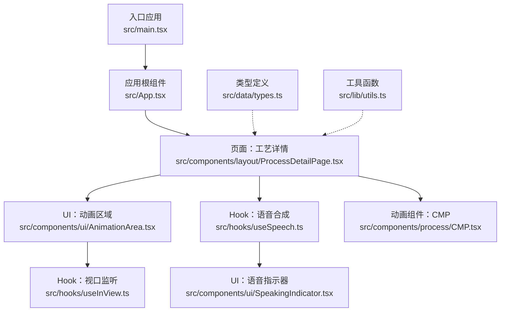
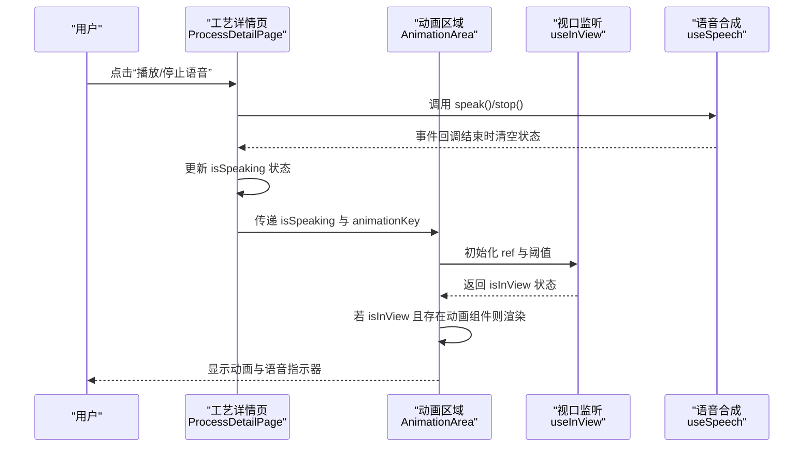
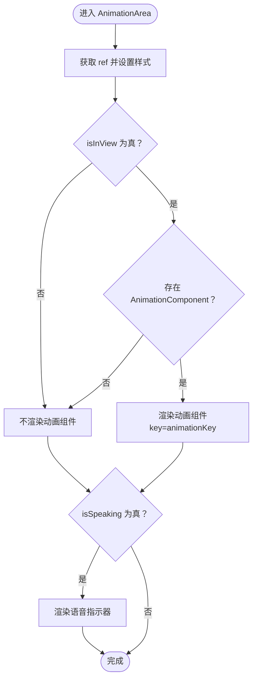
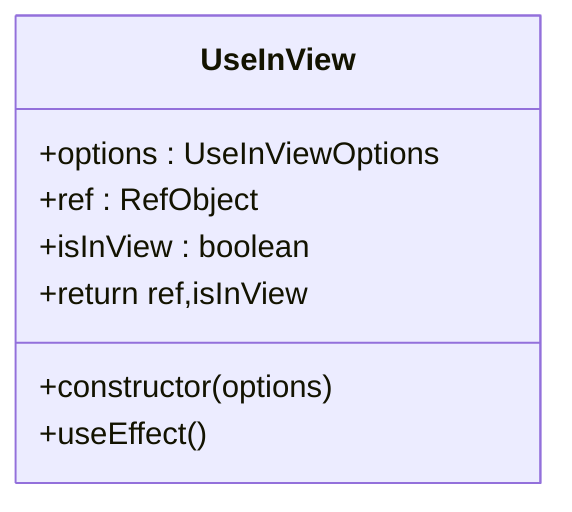
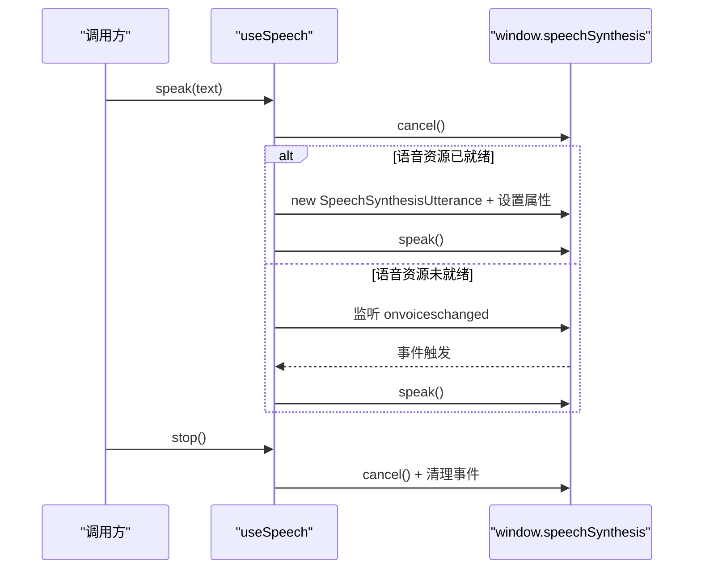
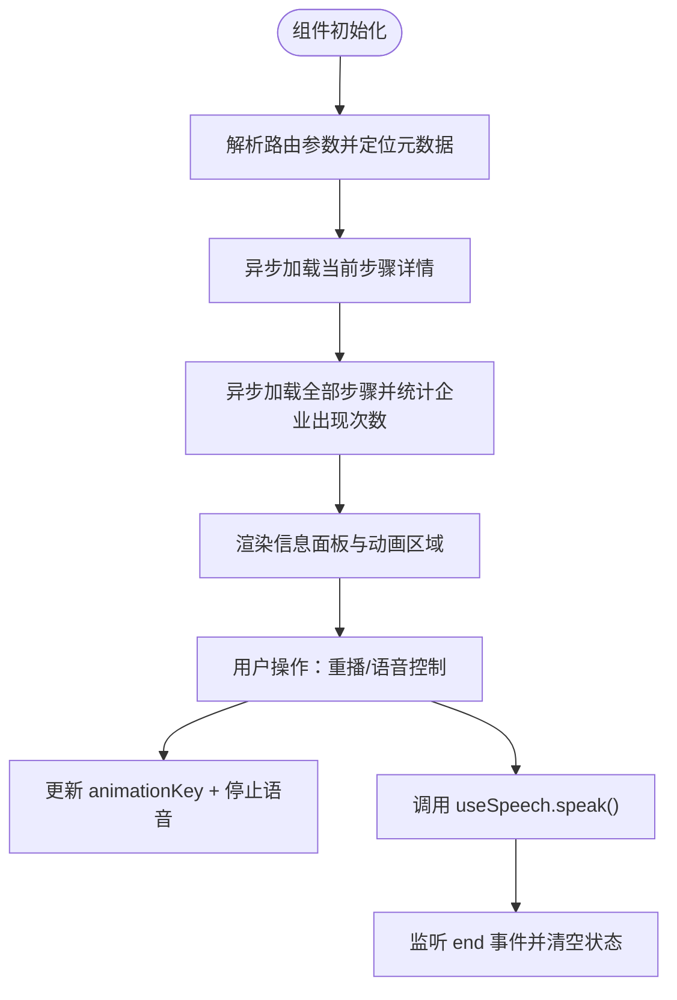
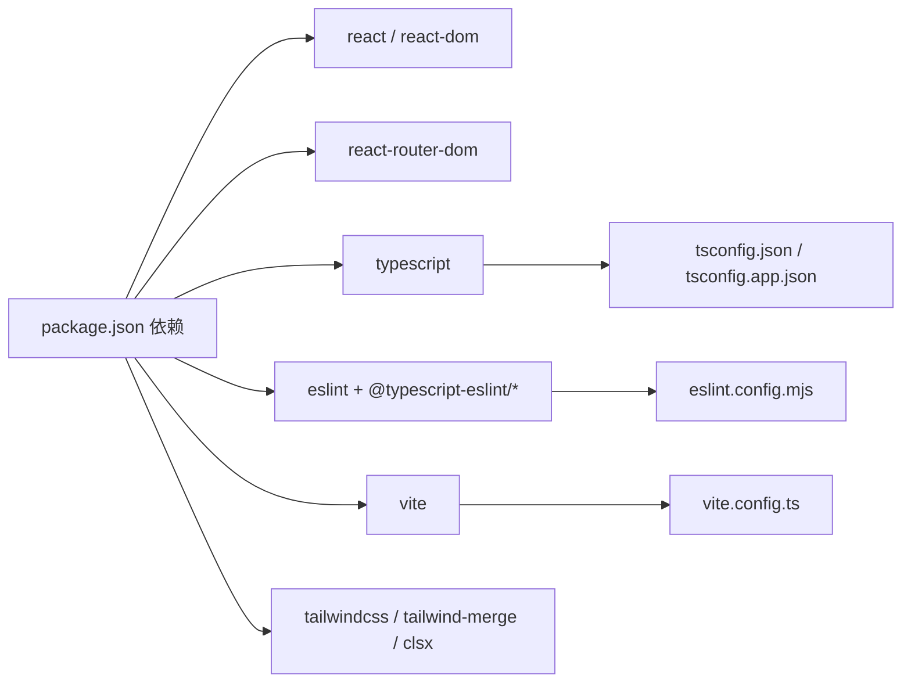

# 调试与测试

<cite>
**本文引用的文件**
- [package.json](file://package.json)
- [vite.config.ts](file://vite.config.ts)
- [tsconfig.json](file://tsconfig.json)
- [tsconfig.app.json](file://tsconfig.app.json)
- [eslint.config.mjs](file://eslint.config.mjs)
- [src/main.tsx](file://src/main.tsx)
- [src/App.tsx](file://src/App.tsx)
- [src/components/layout/ProcessDetailPage.tsx](file://src/components/layout/ProcessDetailPage.tsx)
- [src/components/ui/AnimationArea.tsx](file://src/components/ui/AnimationArea.tsx)
- [src/hooks/useInView.ts](file://src/hooks/useInView.ts)
- [src/hooks/useSpeech.ts](file://src/hooks/useSpeech.ts)
- [src/components/ui/SpeakingIndicator.tsx](file://src/components/ui/SpeakingIndicator.tsx)
- [src/components/process/CMP.tsx](file://src/components/process/CMP.tsx)
- [src/data/types.ts](file://src/data/types.ts)
- [src/lib/utils.ts](file://src/lib/utils.ts)
</cite>

## 目录
1. [引言](#引言)
2. [项目结构](#项目结构)
3. [核心组件](#核心组件)
4. [架构总览](#架构总览)
5. [详细组件分析](#详细组件分析)
6. [依赖分析](#依赖分析)
7. [性能考虑](#性能考虑)
8. [故障排查指南](#故障排查指南)
9. [结论](#结论)
10. [附录](#附录)

## 引言
本指南面向“芯片制造演示项目”的开发者与测试工程师，提供从本地调试到生产问题诊断的全流程方法论。内容覆盖：
- React DevTools 使用与组件状态调试
- TypeScript 类型检查与编译错误排查
- 性能分析与内存泄漏检测
- 单元测试与集成测试编写建议
- 动画组件与 Intersection Observer 的专项测试
- 跨浏览器兼容性测试方法
- 生产环境问题诊断与修复流程
- 常见问题的快速解决方案与预防措施

## 项目结构
该项目采用 Vite + React + TypeScript 技术栈，使用 TailwindCSS 进行样式管理，并通过 ESLint + Prettier 统一代码风格与质量控制。路由基于 react-router-dom，组件按功能域分层组织。

图表来源
- [src/main.tsx](file://src/main.tsx)
- [src/App.tsx](file://src/App.tsx)
- [src/components/layout/ProcessDetailPage.tsx](file://src/components/layout/ProcessDetailPage.tsx)
- [src/components/ui/AnimationArea.tsx](file://src/components/ui/AnimationArea.tsx)
- [src/hooks/useInView.ts](file://src/hooks/useInView.ts)
- [src/hooks/useSpeech.ts](file://src/hooks/useSpeech.ts)
- [src/components/ui/SpeakingIndicator.tsx](file://src/components/ui/SpeakingIndicator.tsx)
- [src/components/process/CMP.tsx](file://src/components/process/CMP.tsx)
- [src/data/types.ts](file://src/data/types.ts)
- [src/lib/utils.ts](file://src/lib/utils.ts)

章节来源
- [package.json:1-45](file://package.json#L1-L45)
- [vite.config.ts:1-13](file://vite.config.ts#L1-L13)
- [tsconfig.json:1-7](file://tsconfig.json#L1-L7)
- [eslint.config.mjs:1-45](file://eslint.config.mjs#L1-L45)

## 核心组件
- 应用根组件负责路由与全局布局，承载导航与页面切换。
- 工艺详情页是交互与动画的核心容器，负责加载数据、控制动画与语音、渲染信息面板。
- 动画区域组件封装视口可见性判断与动画挂载逻辑，支持按需渲染与复位。
- 视口监听 Hook 提供 IntersectionObserver 封装，便于组件级懒加载与节流。
- 语音合成 Hook 提供中文语音选择、评分与偏好持久化，以及安全的 speak/stop 流程。
- CMP 等动画组件以 SVG 与 CSS 动画实现复杂视觉效果，需关注性能与可访问性。
- 类型定义集中于 types.ts，确保数据结构一致性；工具函数 cn 用于类名合并。

章节来源
- [src/App.tsx:1-23](file://src/App.tsx#L1-L23)
- [src/components/layout/ProcessDetailPage.tsx:1-397](file://src/components/layout/ProcessDetailPage.tsx#L1-L397)
- [src/components/ui/AnimationArea.tsx:1-29](file://src/components/ui/AnimationArea.tsx#L1-L29)
- [src/hooks/useInView.ts:1-32](file://src/hooks/useInView.ts#L1-L32)
- [src/hooks/useSpeech.ts:1-135](file://src/hooks/useSpeech.ts#L1-L135)
- [src/components/process/CMP.tsx:1-125](file://src/components/process/CMP.tsx#L1-L125)
- [src/data/types.ts:1-33](file://src/data/types.ts#L1-L33)
- [src/lib/utils.ts:1-7](file://src/lib/utils.ts#L1-L7)

## 架构总览
下图展示从用户交互到数据与动画渲染的关键调用链路，包括语音控制与视口可见性对动画的影响。

图表来源
- [src/components/layout/ProcessDetailPage.tsx:82-108](file://src/components/layout/ProcessDetailPage.tsx#L82-L108)
- [src/components/ui/AnimationArea.tsx:11-28](file://src/components/ui/AnimationArea.tsx#L11-L28)
- [src/hooks/useInView.ts:8-31](file://src/hooks/useInView.ts#L8-L31)
- [src/hooks/useSpeech.ts:74-112](file://src/hooks/useSpeech.ts#L74-L112)

## 详细组件分析

### 组件 A：动画区域（AnimationArea）
- 职责：根据视口可见性与传入参数决定是否渲染动画组件；在语音播放时叠加语音指示器。
- 关键点：
  - 使用 useInView 获取 isInView 与 ref，支持自定义阈值与 rootMargin。
  - 通过 animationKey 控制动画组件的重新挂载，确保每次切换步骤时重置动画状态。
  - 在 isSpeaking 为真时渲染 SpeakingIndicator。

图表来源
- [src/components/ui/AnimationArea.tsx:11-28](file://src/components/ui/AnimationArea.tsx#L11-L28)
- [src/hooks/useInView.ts:8-31](file://src/hooks/useInView.ts#L8-L31)
- [src/components/ui/SpeakingIndicator.tsx:1-28](file://src/components/ui/SpeakingIndicator.tsx#L1-L28)

章节来源
- [src/components/ui/AnimationArea.tsx:1-29](file://src/components/ui/AnimationArea.tsx#L1-L29)
- [src/hooks/useInView.ts:1-32](file://src/hooks/useInView.ts#L1-L32)
- [src/components/ui/SpeakingIndicator.tsx:1-28](file://src/components/ui/SpeakingIndicator.tsx#L1-L28)

### 组件 B：视口监听 Hook（useInView）
- 职责：封装 IntersectionObserver，返回 ref 与 isInView 状态。
- 关键点：
  - 默认阈值与 rootMargin 可配置。
  - 组件卸载时自动断开观察器，避免内存泄漏。
  - 初次渲染即建立观察，后续仅依赖依赖变更触发。

图表来源
- [src/hooks/useInView.ts:3-31](file://src/hooks/useInView.ts#L3-L31)

章节来源
- [src/hooks/useInView.ts:1-32](file://src/hooks/useInView.ts#L1-L32)

### 组件 C：语音合成 Hook（useSpeech）
- 职责：选择最佳中文语音、缓存偏好、安全地 speak/stop，并提供可用语音列表与手动设置接口。
- 关键点：
  - 语音评分规则综合神经音色、厂商、语言区域与本地服务倾向。
  - speak 流程等待 onvoiceschanged 事件，确保语音资源就绪后再播报。
  - stop 清理事件监听，防止残留回调导致的内存泄漏。

图表来源
- [src/hooks/useSpeech.ts:74-112](file://src/hooks/useSpeech.ts#L74-L112)
- [src/hooks/useSpeech.ts:42-62](file://src/hooks/useSpeech.ts#L42-L62)

章节来源
- [src/hooks/useSpeech.ts:1-135](file://src/hooks/useSpeech.ts#L1-L135)

### 组件 D：工艺详情页（ProcessDetailPage）
- 职责：加载步骤详情与全量数据、计算企业出现频次、控制动画与语音、渲染信息面板与导航。
- 关键点：
  - 通过 params 获取当前步骤 id，映射到对应动画组件。
  - 使用 animationKey 重置动画；在语音结束时清理状态。
  - 通过 useMemo 构建公司名称到对象的映射，提升渲染性能。

图表来源
- [src/components/layout/ProcessDetailPage.tsx:36-108](file://src/components/layout/ProcessDetailPage.tsx#L36-L108)

章节来源
- [src/components/layout/ProcessDetailPage.tsx:1-397](file://src/components/layout/ProcessDetailPage.tsx#L1-L397)

### 组件 E：动画组件（以 CMP 为例）
- 职责：通过 SVG 与 CSS 动画展示 CMP 工艺流程。
- 关键点：
  - 使用多个动画类与变量驱动的延迟，形成协调的视觉节奏。
  - 注意动画数量与复杂度对性能的影响，必要时在低性能设备上降级。

章节来源
- [src/components/process/CMP.tsx:1-125](file://src/components/process/CMP.tsx#L1-L125)

## 依赖分析
- 构建与运行：Vite 提供开发服务器与打包能力；React 与 react-router-dom 实现前端框架与路由。
- 类型与校验：TypeScript 提供强类型保障；ESLint + TypeScript ESLint 插件进行规则校验与自动修复。
- 样式与工具：TailwindCSS 与工具函数 cn 用于样式合并与响应式布局。

图表来源
- [package.json:15-42](file://package.json#L15-L42)
- [vite.config.ts:1-13](file://vite.config.ts#L1-L13)
- [eslint.config.mjs:1-45](file://eslint.config.mjs#L1-L45)
- [tsconfig.json:1-7](file://tsconfig.json#L1-L7)

章节来源
- [package.json:1-45](file://package.json#L1-L45)
- [vite.config.ts:1-13](file://vite.config.ts#L1-L13)
- [tsconfig.json:1-7](file://tsconfig.json#L1-L7)
- [eslint.config.mjs:1-45](file://eslint.config.mjs#L1-L45)

## 性能考虑
- 动画与渲染
  - 合理使用 animationKey 重置动画，避免重复实例累积。
  - 对高频动画使用 transform/opacity 等 GPU 加速属性，减少回流。
  - 控制动画数量与复杂度，必要时在低端设备降级。
- 观察者与事件
  - useInView 在卸载时断开观察器，避免内存泄漏。
  - 语音合成 stop 时清理事件监听，防止残留回调。
- 资源加载
  - 按需渲染动画组件，结合 isInView 条件渲染。
  - 使用 useMemo 缓存计算结果，减少不必要的重渲染。
- 打包与体积
  - 保持依赖精简，避免引入不必要的 polyfill。
  - 使用 Tailwind 的 purge 功能在构建时移除未使用样式。

[本节为通用指导，无需列出章节来源]

## 故障排查指南

### React DevTools 使用与组件状态调试
- 安装与启用
  - 在浏览器扩展商店安装 React DevTools，并在开发模式下启用。
- 组件树与状态
  - 在“Components”面板查看组件树，定位 AnimationArea、ProcessDetailPage、useInView、useSpeech 等关键节点。
  - 在“Profiler”面板记录渲染时间线，识别长任务与重复渲染。
- Props 与 Hooks
  - 检查 AnimationArea 的 props（glowColor、animationKey、AnimationComponent、isSpeaking）是否正确传递。
  - 查看 useInView 的 isInView 状态变化，确认阈值与 rootMargin 是否合理。
  - 在 useSpeech 中验证 speak/stop 的调用序列与 onvoiceschanged 事件处理。

章节来源
- [src/components/ui/AnimationArea.tsx:11-28](file://src/components/ui/AnimationArea.tsx#L11-L28)
- [src/hooks/useInView.ts:8-31](file://src/hooks/useInView.ts#L8-L31)
- [src/hooks/useSpeech.ts:74-112](file://src/hooks/useSpeech.ts#L74-L112)

### TypeScript 类型检查与编译错误排查
- 常见问题
  - 未声明的 props 或类型不匹配：检查 types.ts 中的接口定义与组件实际使用是否一致。
  - 泛型约束错误：确认泛型参数与默认值（如 useInView 的泛型）满足调用处需求。
  - 路由参数类型：确保 useParams 返回的 id 类型与数据加载函数期望一致。
- 排查步骤
  - 运行类型检查命令，定位具体文件与行号。
  - 使用编辑器的 TypeScript 诊断功能，逐条修正。
  - 对复杂类型使用类型断言前先重构为更清晰的类型设计。

章节来源
- [src/data/types.ts:1-33](file://src/data/types.ts#L1-L33)
- [src/components/layout/ProcessDetailPage.tsx:36-67](file://src/components/layout/ProcessDetailPage.tsx#L36-L67)
- [src/hooks/useInView.ts:8-13](file://src/hooks/useInView.ts#L8-L13)

### 性能分析与内存泄漏检测
- 性能分析
  - 使用浏览器性能面板记录交互（如切换步骤、播放语音），观察主线程占用与帧率。
  - 在 DevTools 的 Performance 面板录制，查找长任务与密集渲染区域。
- 内存泄漏检测
  - 在 Memory 面板定期快照，对比不同阶段的堆内存增长。
  - 关注未断开的事件监听（如 speechSynthesis 的 onvoiceschanged）、未清理的定时器或观察器。
- 优化建议
  - 减少不必要的重渲染，使用 memo 化与稳定引用。
  - 降低动画复杂度，或在低端设备禁用部分动画。

章节来源
- [src/hooks/useSpeech.ts:109-112](file://src/hooks/useSpeech.ts#L109-L112)
- [src/hooks/useInView.ts:26-28](file://src/hooks/useInView.ts#L26-L28)

### 单元测试与集成测试编写指南
- 单元测试
  - 测试目标：useInView 的 isInView 状态、useSpeech 的 speak/stop 行为、AnimationArea 的条件渲染逻辑。
  - 工具建议：Jest + React Testing Library；对动画组件使用轻量模拟（如将动画组件替换为静态占位）。
- 集成测试
  - 测试目标：ProcessDetailPage 的数据加载、动画重置、语音控制与导航跳转。
  - 场景建议：切换不同步骤、点击重播按钮、播放语音并监听结束事件。
- 数据与类型
  - 使用真实的数据结构（来自 types.ts）构造测试用例，确保类型安全。

[本节为通用指导，无需列出章节来源]

### 动画组件与 Intersection Observer 测试
- 动画组件测试
  - 重点：动画组件的 SVG 结构与 CSS 动画类是否正确挂载；动画 key 变化是否触发重置。
  - 方法：通过 DOM 查询动画元素是否存在，断言关键样式或类名。
- Intersection Observer 测试
  - 重点：useInView 在不同阈值与 rootMargin 下的行为；组件卸载时是否断开观察器。
  - 方法：使用虚拟容器与自定义阈值，断言 isInView 的变化时机与次数。

章节来源
- [src/components/ui/AnimationArea.tsx:11-28](file://src/components/ui/AnimationArea.tsx#L11-L28)
- [src/hooks/useInView.ts:8-31](file://src/hooks/useInView.ts#L8-L31)

### 跨浏览器兼容性测试
- 语音合成
  - 不同浏览器的语音资源与可用性差异较大，优先测试主流桌面端浏览器。
  - 对不支持 Web Speech API 的场景进行降级提示与功能禁用。
- Intersection Observer
  - 确认在旧版浏览器中的 polyfill 行为，或提供降级方案（如固定渲染）。
- 样式与动画
  - 使用 Autoprefixer 与 TailwindCSS 的兼容性配置，确保动画与过渡在目标浏览器正常工作。

[本节为通用指导，无需列出章节来源]

### 生产环境问题诊断与修复流程
- 快速定位
  - 收集错误日志与用户反馈，结合浏览器控制台与网络面板。
  - 使用性能面板识别卡顿与异常渲染。
- 修复策略
  - 对类型错误进行静态修复；对运行时错误增加边界检查与容错。
  - 对动画与事件监听进行健壮性增强（如空值检查、清理逻辑）。
- 回归验证
  - 在多浏览器与多设备上回归测试，确保修复无副作用。

[本节为通用指导，无需列出章节来源]

### 常见开发问题与预防措施
- 问题：动画不重播或状态未重置
  - 预防：在步骤切换时更新 animationKey，并在播放前取消之前的语音。
- 问题：语音无法播放或报错
  - 预防：等待 onvoiceschanged 事件后再 speak；在 stop 时清理事件监听。
- 问题：视口监听无效或内存泄漏
  - 预防：确保观察器在组件卸载时断开；合理设置阈值与 rootMargin。
- 问题：类型不匹配导致编译失败
  - 预防：严格遵循 types.ts 的接口定义；对动态数据进行类型守卫。

章节来源
- [src/components/layout/ProcessDetailPage.tsx:94-98](file://src/components/layout/ProcessDetailPage.tsx#L94-L98)
- [src/hooks/useSpeech.ts:95-104](file://src/hooks/useSpeech.ts#L95-L104)
- [src/hooks/useSpeech.ts:109-112](file://src/hooks/useSpeech.ts#L109-L112)
- [src/hooks/useInView.ts:26-28](file://src/hooks/useInView.ts#L26-L28)
- [src/data/types.ts:1-33](file://src/data/types.ts#L1-L33)

## 结论
本指南围绕 React 开发、TypeScript 类型系统、性能与内存管理、测试策略以及跨浏览器兼容性，提供了系统化的调试与测试方法。建议在日常开发中：
- 将 React DevTools 作为首选调试工具，配合 Profiler 分析渲染性能；
- 严格执行 ESLint 与 TypeScript 规则，从源头避免类型与语法错误；
- 对动画与事件进行专项测试，确保在不同设备与浏览器上的稳定性；
- 建立完善的回归测试流程，保障生产环境的可靠性。

[本节为总结性内容，无需列出章节来源]

## 附录

### TypeScript 配置要点
- 多项目引用：通过 references 将主配置指向 app 配置，提升大型项目的类型检查效率。
- 编译脚本：构建命令同时执行 tsc 与 vite build，确保类型与打包同步。

章节来源
- [tsconfig.json:1-7](file://tsconfig.json#L1-L7)
- [package.json:8](file://package.json#L8)

### ESLint 与格式化
- 规则建议：关闭 React 在 JSX 中显式导入的规则；开启未使用变量警告；允许 console 的 warn/error。
- 格式化：使用 Prettier 统一代码风格，配合编辑器保存时自动格式化。

章节来源
- [eslint.config.mjs:26-33](file://eslint.config.mjs#L26-L33)
- [package.json:12-13](file://package.json#L12-L13)