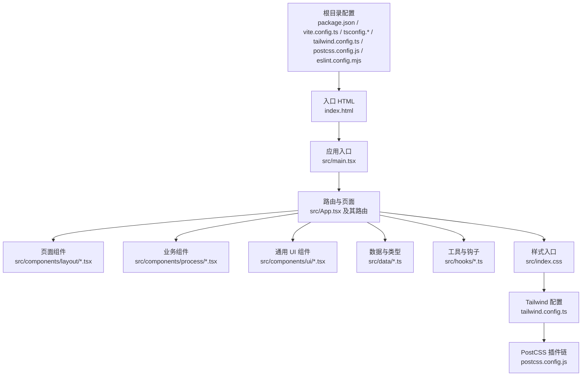
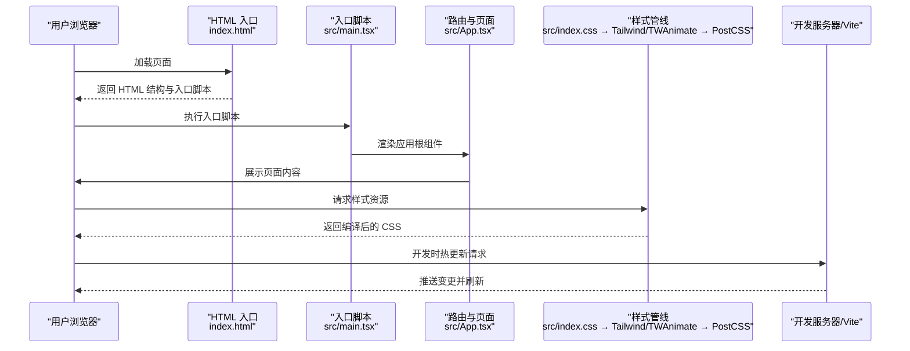
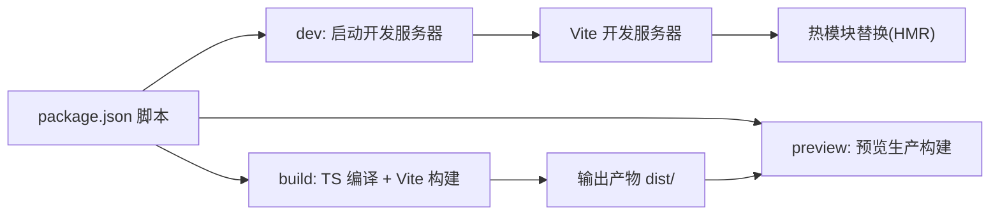

# 快速开始

<cite>
**本文引用的文件**
- [package.json](file://package.json)
- [vite.config.ts](file://vite.config.ts)
- [tsconfig.json](file://tsconfig.json)
- [tsconfig.app.json](file://tsconfig.app.json)
- [tailwind.config.ts](file://tailwind.config.ts)
- [postcss.config.js](file://postcss.config.js)
- [eslint.config.mjs](file://eslint.config.mjs)
- [index.html](file://index.html)
- [src/main.tsx](file://src/main.tsx)
- [src/App.tsx](file://src/App.tsx)
- [src/index.css](file://src/index.css)
- [src/components/layout/HomePage.tsx](file://src/components/layout/HomePage.tsx)
</cite>

## 目录
1. [简介](#简介)
2. [项目结构](#项目结构)
3. [核心组件](#核心组件)
4. [架构总览](#架构总览)
5. [详细组件分析](#详细组件分析)
6. [依赖关系分析](#依赖关系分析)
7. [性能与开发体验](#性能与开发体验)
8. [故障排查指南](#故障排查指南)
9. [结论](#结论)
10. [附录：安装与操作步骤](#附录安装与操作步骤)

## 简介
本指南面向首次接触“芯片制造演示”项目的开发者，帮助你在最短时间内完成环境准备、安装依赖、启动开发服务器、构建与预览，并掌握常见问题的排查方法。项目基于 React 18、TypeScript、Vite 6、Tailwind CSS 以及 React Router 7 构建，采用模块别名与路径映射提升开发效率。

## 项目结构
该项目采用以功能域为中心的组织方式，源码位于 src 目录下，包含页面布局组件、具体工艺流程组件、UI 基础组件、数据模型与类型定义、工具函数、样式入口等。关键配置文件集中在根目录，用于定义构建行为、样式管线、类型检查与代码规范。

图表来源
- [index.html](file://index.html)
- [src/main.tsx](file://src/main.tsx)
- [src/App.tsx](file://src/App.tsx)
- [tailwind.config.ts](file://tailwind.config.ts)
- [postcss.config.js](file://postcss.config.js)

章节来源
- [package.json](file://package.json)
- [vite.config.ts](file://vite.config.ts)
- [tsconfig.json](file://tsconfig.json)
- [tsconfig.app.json](file://tsconfig.app.json)
- [tailwind.config.ts](file://tailwind.config.ts)
- [postcss.config.js](file://postcss.config.js)
- [eslint.config.mjs](file://eslint.config.mjs)
- [index.html](file://index.html)
- [src/main.tsx](file://src/main.tsx)
- [src/App.tsx](file://src/App.tsx)
- [src/index.css](file://src/index.css)

## 核心组件
- 应用入口与渲染
  - 入口脚本在 HTML 中挂载到 #root，使用 ReactDOM 渲染 App。
  - App 使用 React Router 进行路由管理，包含首页、流程详情页与兜底页面。
- 路由与页面
  - 首页展示流程概览与统计信息，提供进入首个流程的入口。
  - 流程详情页根据路由参数加载对应工艺的详细内容。
- 样式系统
  - 通过 Tailwind CSS 提供原子化样式，配合自定义主题变量与动画。
  - PostCSS 自动添加浏览器前缀并集成 Tailwind。
- 类型与配置
  - TypeScript 严格模式开启，使用路径映射与模块别名简化导入。
  - ESLint 与 Prettier 配置统一代码风格与质量基线。

章节来源
- [src/main.tsx](file://src/main.tsx)
- [src/App.tsx](file://src/App.tsx)
- [src/components/layout/HomePage.tsx](file://src/components/layout/HomePage.tsx)
- [src/index.css](file://src/index.css)
- [tsconfig.app.json](file://tsconfig.app.json)
- [eslint.config.mjs](file://eslint.config.mjs)

## 架构总览
下图展示了从浏览器请求到页面渲染的关键路径，以及样式与构建管线的协作关系：

图表来源
- [index.html](file://index.html)
- [src/main.tsx](file://src/main.tsx)
- [src/App.tsx](file://src/App.tsx)
- [src/index.css](file://src/index.css)
- [tailwind.config.ts](file://tailwind.config.ts)
- [postcss.config.js](file://postcss.config.js)
- [vite.config.ts](file://vite.config.ts)

## 详细组件分析

### 页面与路由（App）
- 责任边界清晰：负责顶层路由与页面容器，不直接承载业务细节。
- 路由设计：根路径展示首页；流程详情页通过动态路由参数加载对应内容；兜底页面处理未匹配路径。
- 样式容器：外层包裹最小高度与背景色，便于全局样式生效。

章节来源
- [src/App.tsx](file://src/App.tsx)

### 首页（HomePage）
- 内容组织：头部引导语、统计卡片、流程图与页脚。
- 交互入口：提供“开始探索”按钮跳转至首个流程；“浏览流程”锚点定位到流程图区域。
- 样式与动画：大量使用 Tailwind 工具类与自定义动画类，营造科技感与沉浸感。

章节来源
- [src/components/layout/HomePage.tsx](file://src/components/layout/HomePage.tsx)

### 样式与主题（Tailwind + PostCSS）
- 主题变量：通过 CSS 变量定义背景、前景、卡片、强调色与芯片主题色系，支持明暗模式。
- 动画系统：内置多种动画 keyframes 与 animation 别名，覆盖流程演示所需的动态效果。
- 构建链路：PostCSS 在构建时自动注入 Tailwind 指令与浏览器前缀，保证跨浏览器兼容性。

章节来源
- [src/index.css](file://src/index.css)
- [tailwind.config.ts](file://tailwind.config.ts)
- [postcss.config.js](file://postcss.config.js)

### 路径别名与类型配置
- 路径别名：通过 Vite 与 TypeScript 的路径映射，统一使用 @/* 导入 src 下资源，降低层级复杂度。
- 类型严格性：启用严格模式与未使用变量/参数检测，提升代码质量与可维护性。

章节来源
- [vite.config.ts](file://vite.config.ts)
- [tsconfig.app.json](file://tsconfig.app.json)

## 依赖关系分析
- 运行时依赖
  - React 生态：React、React DOM、React Router DOM。
  - UI 与样式：Lucide React 图标、Tailwind Merge、Tailwindcss-animate。
  - 实用工具：class-variance-authority、clsx。
- 开发依赖
  - 构建：Vite、TypeScript、@vitejs/plugin-react。
  - 样式：Tailwind CSS、Autoprefixer。
  - 规范：ESLint、TypeScript ESLint、Prettier、相关插件。
- 脚本命令
  - dev：启动 Vite 开发服务器。
  - build：先执行 TS 编译，再进行 Vite 构建。
  - preview：本地预览生产构建产物。
  - lint/format：代码质量与格式化工具。

图表来源
- [package.json](file://package.json)
- [vite.config.ts](file://vite.config.ts)

章节来源
- [package.json](file://package.json)
- [vite.config.ts](file://vite.config.ts)

## 性能与开发体验
- 开发服务器
  - Vite 提供极快的冷启动与热更新能力，结合 React Fast Refresh，修改组件后可即时看到效果。
  - 路径别名与模块解析优化，减少查找成本。
- 构建优化
  - TypeScript 严格模式与无副作用导入策略有助于 Tree Shaking。
  - Tailwind 仅按需扫描内容文件，避免生成冗余样式。
- 代码质量
  - ESLint 与 Prettier 配置统一风格，减少团队分歧。
  - 路由与组件职责清晰，利于长期演进。

## 故障排查指南
- 启动失败或端口占用
  - 现象：开发服务器无法启动或提示端口被占用。
  - 处理：更换端口或结束占用进程；确认 Vite 配置中未硬编码冲突端口。
  - 参考：[vite.config.ts](file://vite.config.ts)
- 路由跳转无效或 404
  - 现象：点击链接后页面无变化或出现 404。
  - 处理：确认路由路径与参数是否正确；检查 React Router 的 BrowserRouter 使用与 Route 定义。
  - 参考：[src/App.tsx](file://src/App.tsx)
- 样式未生效或主题异常
  - 现象：颜色、动画或 Tailwind 工具类不生效。
  - 处理：确认 index.html 引入了正确的入口脚本；检查 Tailwind 配置的 content 路径与 PostCSS 插件链。
  - 参考：[index.html](file://index.html)、[tailwind.config.ts](file://tailwind.config.ts)、[postcss.config.js](file://postcss.config.js)
- 类型错误或导入路径问题
  - 现象：编辑器报错或构建时报类型/路径错误。
  - 处理：检查 tsconfig 的 paths 映射与 baseUrl；确保模块别名 @/* 正确指向 src。
  - 参考：[tsconfig.app.json](file://tsconfig.app.json)、[vite.config.ts](file://vite.config.ts)
- ESLint/Prettier 报错
  - 现象：保存或执行命令时报风格或规则错误。
  - 处理：按提示修复或使用格式化命令自动修正；必要时调整规则配置。
  - 参考：[eslint.config.mjs](file://eslint.config.mjs)

章节来源
- [vite.config.ts](file://vite.config.ts)
- [src/App.tsx](file://src/App.tsx)
- [index.html](file://index.html)
- [tailwind.config.ts](file://tailwind.config.ts)
- [postcss.config.js](file://postcss.config.js)
- [tsconfig.app.json](file://tsconfig.app.json)
- [eslint.config.mjs](file://eslint.config.mjs)

## 结论
本项目提供了清晰的前端工程化实践：以 Vite 为基建、React 与 TypeScript 为核心、Tailwind 与 PostCSS 统一样式体系、ESLint/Prettier 保障质量。遵循本文的安装与启动步骤，你可以在几分钟内完成本地运行，并基于现有组件与数据模型快速扩展新的工艺流程演示。

## 附录：安装与操作步骤
- 环境准备
  - Node.js：建议使用 LTS 版本（如 18.x 或 20.x），确保 npm/yarn/pnpm 可用。
  - 包管理器：推荐使用 npm（与 package.json 脚本一致）；也可使用 yarn 或 pnpm。
- 克隆仓库与安装依赖
  - 在终端执行安装命令以下载所有依赖。
  - 参考：[package.json](file://package.json)
- 启动开发服务器
  - 执行开发脚本启动本地服务，浏览器自动打开或访问默认地址。
  - 热重载：修改源码后，页面自动刷新，无需手动重启。
  - 参考：[package.json](file://package.json)、[vite.config.ts](file://vite.config.ts)
- 构建与预览
  - 构建：生成生产环境产物至 dist/。
  - 预览：本地预览构建结果，验证打包与运行效果。
  - 参考：[package.json](file://package.json)
- 常见初始化问题与解决
  - 依赖安装失败：清理缓存并重试；确保网络稳定；必要时切换镜像源。
  - 权限问题：避免使用 sudo；检查用户对项目目录的读写权限。
  - Node 版本不兼容：升级到推荐版本；若使用 nvm，请确保当前版本正确。
  - Windows 用户：建议使用 WSL2 或 PowerShell；避免在受限账户下操作。
  - macOS/Linux 用户：若遇到权限或路径问题，检查 umask 与 PATH；确认 Homebrew 或系统包管理器未污染全局环境。
- 不同操作系统建议
  - Windows：优先使用 WSL2 以获得更接近 Linux 的开发体验；确保 Git Bash/WSL 终端可用。
  - macOS：使用 Homebrew 安装 Node.js；注意 Apple Silicon 与 Intel 芯片的二进制兼容性。
  - Linux：使用发行版自带包管理器或 nvm 安装 Node.js；确保系统字体与图形库完整。

章节来源
- [package.json](file://package.json)
- [vite.config.ts](file://vite.config.ts)