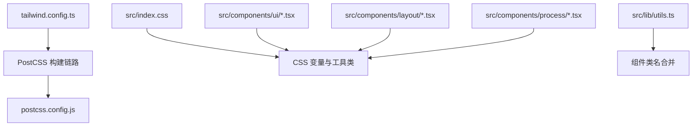
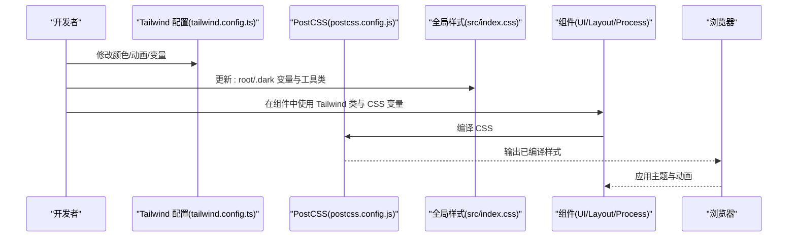
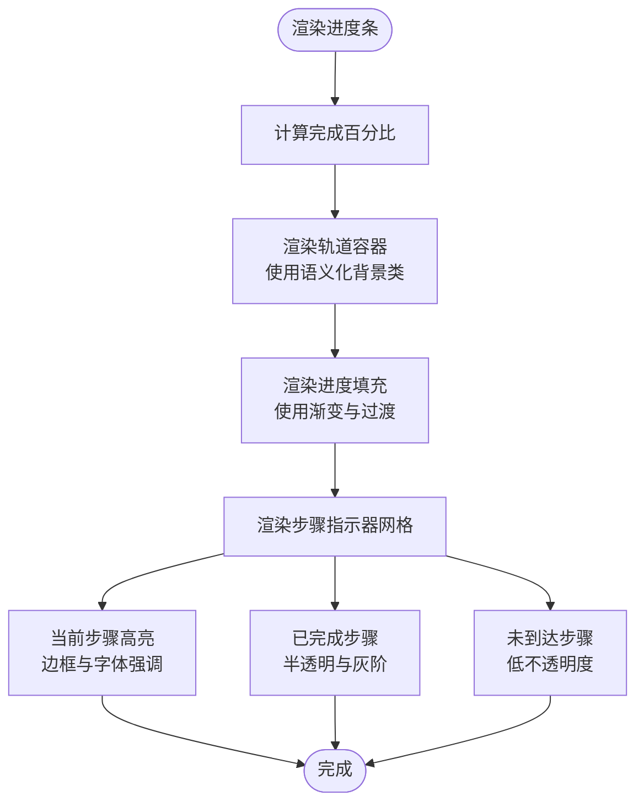
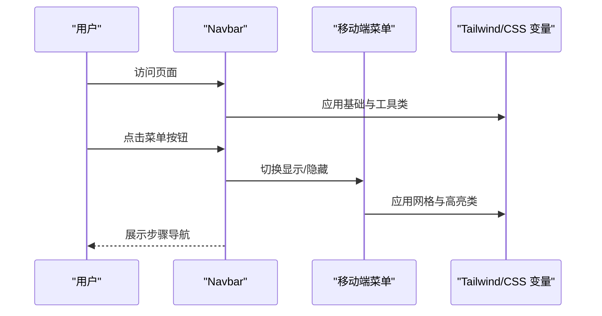
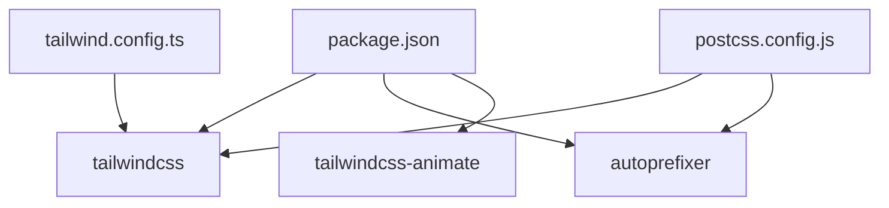

# 主题定制与样式扩展

<cite>
**本文引用的文件**
- [tailwind.config.ts](file://tailwind.config.ts)
- [postcss.config.js](file://postcss.config.js)
- [index.css](file://src/index.css)
- [package.json](file://package.json)
- [utils.ts](file://src/lib/utils.ts)
- [ProgressBar.tsx](file://src/components/ui/ProgressBar.tsx)
- [Navbar.tsx](file://src/components/layout/Navbar.tsx)
- [ProcessNavigation.tsx](file://src/components/ui/ProcessNavigation.tsx)
- [CompanyCard.tsx](file://src/components/ui/CompanyCard.tsx)
- [AnimationArea.tsx](file://src/components/ui/AnimationArea.tsx)
- [stepMetas.ts](file://src/data/stepMetas.ts)
- [CMP.tsx](file://src/components/process/CMP.tsx)
- [Testing.tsx](file://src/components/process/Testing.tsx)
- [Photolithography.tsx](file://src/components/process/Photolithography.tsx)
- [WaferManufacturing.tsx](file://src/components/process/WaferManufacturing.tsx)
</cite>

## 目录
1. [简介](#简介)
2. [项目结构](#项目结构)
3. [核心组件](#核心组件)
4. [架构总览](#架构总览)
5. [详细组件分析](#详细组件分析)
6. [依赖关系分析](#依赖关系分析)
7. [性能考量](#性能考量)
8. [故障排查指南](#故障排查指南)
9. [结论](#结论)
10. [附录](#附录)

## 简介
本指南面向“芯片制造演示项目”的主题定制与样式扩展需求，围绕 Tailwind CSS 配置、CSS 变量与设计系统、自定义样式类与动画、响应式与移动端适配、以及现有 UI 组件（如进度条、导航栏）的主题化改造进行系统性说明。目标是在保持视觉一致性的前提下，提供灵活且可维护的主题扩展方案。

## 项目结构
该项目采用以功能域划分的组件组织方式，样式通过 Tailwind CSS 与原生 CSS 变量结合的方式实现主题化与动画效果。关键样式入口与配置如下：
- Tailwind 配置：集中于 tailwind.config.ts，定义颜色系统、圆角、动画等扩展项，并启用 tailwindcss-animate 插件。
- PostCSS 配置：在 postcss.config.js 中启用 tailwindcss 与 autoprefixer。
- 全局样式：在 src/index.css 中定义 CSS 变量、分层样式（base/utilities）与自定义工具类。
- 工具函数：utils.ts 提供 cn 合并工具，用于安全合并 Tailwind 类名。
- 组件样式：各 UI 组件通过 Tailwind 类与 CSS 变量实现主题化；部分动画通过内联 SVG 动画或 CSS keyframes 实现。

图表来源
- [tailwind.config.ts:1-143](file://tailwind.config.ts#L1-L143)
- [postcss.config.js:1-7](file://postcss.config.js#L1-L7)
- [index.css:1-142](file://src/index.css#L1-L142)
- [utils.ts:1-7](file://src/lib/utils.ts#L1-L7)

章节来源
- [tailwind.config.ts:1-143](file://tailwind.config.ts#L1-L143)
- [postcss.config.js:1-7](file://postcss.config.js#L1-L7)
- [index.css:1-142](file://src/index.css#L1-L142)
- [utils.ts:1-7](file://src/lib/utils.ts#L1-L7)

## 核心组件
本节聚焦主题定制的关键构件及其职责：
- Tailwind 颜色系统与变量映射：通过 hsl(var(--xxx)) 将 CSS 变量注入到 Tailwind 的 colors 扩展中，使组件可直接使用语义化颜色类。
- 圆角与容器：统一的圆角半径与容器尺寸，保证组件边界与留白的一致性。
- 动画系统：内置多种与芯片制造流程相关的动画 keyframes 与预设，便于在组件中复用。
- 全局 CSS 变量与工具类：在 :root 与 .dark 中定义背景、前景、渐变、阴影、过渡等变量，并提供 text-gradient、bg-gradient、shadow-glow、border-glow 等工具类。
- 类名合并工具：cn 函数用于安全合并多个类名，避免冲突与重复。

章节来源
- [tailwind.config.ts:18-66](file://tailwind.config.ts#L18-L66)
- [tailwind.config.ts:122-136](file://tailwind.config.ts#L122-L136)
- [index.css:5-56](file://src/index.css#L5-L56)
- [index.css:69-141](file://src/index.css#L69-L141)
- [utils.ts:4-6](file://src/lib/utils.ts#L4-L6)

## 架构总览
下图展示主题系统在构建与运行时的交互路径：Tailwind 读取配置与 CSS 变量，PostCSS 负责编译与前缀处理，组件通过 Tailwind 类与 CSS 变量实现主题化与动画。

图表来源
- [tailwind.config.ts:1-143](file://tailwind.config.ts#L1-L143)
- [postcss.config.js:1-7](file://postcss.config.js#L1-L7)
- [index.css:1-142](file://src/index.css#L1-L142)

## 详细组件分析

### 进度条组件（ProgressBar）
该组件展示了如何将语义化颜色类与 CSS 变量结合，实现进度指示与步骤导航的主题化：
- 使用语义化颜色类设置轨道与进度条颜色，并通过内联样式动态设置宽度。
- 步骤指示器根据当前索引状态应用不同的边框、背景与透明度，体现层级关系。
- 渐变色从 primary 到 chip 蓝色，突出流程推进感。

图表来源
- [ProgressBar.tsx:8-59](file://src/components/ui/ProgressBar.tsx#L8-L59)

章节来源
- [ProgressBar.tsx:8-59](file://src/components/ui/ProgressBar.tsx#L8-L59)

### 导航栏组件（Navbar）
导航栏在桌面端与移动端分别采用不同的布局策略，并通过语义化颜色类与 CSS 变量实现高亮与发光效果：
- 桌面端使用水平链接组，激活态使用带发光阴影的背景与文本高亮。
- 移动端使用网格布局展示步骤列表，支持展开/收起。
- 使用 CSS 变量与工具类实现模糊背景与发光边框，提升科技感。

图表来源
- [Navbar.tsx:6-81](file://src/components/layout/Navbar.tsx#L6-L81)

章节来源
- [Navbar.tsx:6-81](file://src/components/layout/Navbar.tsx#L6-L81)

### 流程导航组件（ProcessNavigation）
该组件提供“上一步/下一步”导航，使用语义化颜色类与对比色实现视觉层次：
- 上一步使用边框与悬停高亮，强调谨慎回退。
- 下一步使用主色背景与前景色文字，突出前进方向。
- 通过条件渲染处理首页与完成态的不同文案与跳转。

章节来源
- [ProcessNavigation.tsx:14-66](file://src/components/ui/ProcessNavigation.tsx#L14-L66)

### 公司卡片组件（CompanyCard）
公司卡片展示了如何在组件内部通过内联样式使用 CSS 变量与过程色彩，实现动态高亮与分组标签的主题化：
- 使用 tagColorMap 与 tagGlowMap 将标签类型映射到对应颜色与发光效果。
- 内联样式根据过程色彩生成渐变背景与高光区域，增强视觉焦点。
- 通过语义化颜色类控制文本与边框的层级关系。

章节来源
- [CompanyCard.tsx:9-91](file://src/components/ui/CompanyCard.tsx#L9-L91)
- [CompanyCard.tsx:99-158](file://src/components/ui/CompanyCard.tsx#L99-L158)

### 动画区域组件（AnimationArea）
动画区域通过 CSS 变量与工具类实现背景渐变与发光效果，并在视口进入时挂载对应的动画组件：
- 使用内联样式将过程色彩转换为径向渐变背景。
- 结合工具类与 CSS 变量实现发光阴影与卡片边框。
- 通过钩子判断视口可见性，按需渲染动画组件。

章节来源
- [AnimationArea.tsx:11-28](file://src/components/ui/AnimationArea.tsx#L11-L28)

### 工艺动画组件（CMP/Testing/Photolithography/WaferManufacturing）
这些组件通过内联 SVG 与 CSS keyframes 实现与工艺流程高度匹配的动画效果：
- CMP：轮盘旋转、浆液波动、划痕流动与反光滑块等动画。
- Testing：探针流动、信号脉冲、LED 闪烁与进度增长。
- Photolithography：掩模发光、曝光闪现、光阻脉动与发光区域。
- WaferManufacturing：晶圆出现、连线移动、震动闪烁与火花轨迹。

章节来源
- [CMP.tsx:1-42](file://src/components/process/CMP.tsx#L1-L42)
- [Testing.tsx:33-74](file://src/components/process/Testing.tsx#L33-L74)
- [Photolithography.tsx:33-70](file://src/components/process/Photolithography.tsx#L33-L70)
- [WaferManufacturing.tsx:28-66](file://src/components/process/WaferManufacturing.tsx#L28-L66)

## 依赖关系分析
Tailwind 与 PostCSS 的集成关系如下：
- tailwind.config.ts 定义主题扩展与插件。
- postcss.config.js 启用 tailwindcss 与 autoprefixer。
- package.json 声明 tailwindcss、tailwindcss-animate、autoprefixer 等依赖。

图表来源
- [package.json:15-44](file://package.json#L15-L44)
- [tailwind.config.ts:139-140](file://tailwind.config.ts#L139-L140)
- [postcss.config.js:1-7](file://postcss.config.js#L1-L7)

章节来源
- [package.json:15-44](file://package.json#L15-L44)
- [tailwind.config.ts:139-140](file://tailwind.config.ts#L139-L140)
- [postcss.config.js:1-7](file://postcss.config.js#L1-L7)

## 性能考量
- 动画与过渡：项目已尊重用户的“减少动态效果”偏好设置，在媒体查询中降低动画与过渡时长，避免对性能造成负担。
- 类名合并：使用 cn 工具函数合并类名，减少不必要的 DOM 操作与样式冲突。
- CSS 变量：通过 CSS 变量集中管理主题参数，避免重复定义与构建体积膨胀。
- 动画复用：在 tailwind.config.ts 中集中定义动画 keyframes 与预设，减少组件内重复定义。

章节来源
- [index.css:133-140](file://src/index.css#L133-L140)
- [utils.ts:4-6](file://src/lib/utils.ts#L4-L6)
- [tailwind.config.ts:67-136](file://tailwind.config.ts#L67-L136)

## 故障排查指南
- 样式未生效
  - 检查 tailwind.config.ts 的 content 路径是否包含组件文件。
  - 确认 postcss.config.js 是否正确加载 tailwindcss 与 autoprefixer。
  - 确保 src/index.css 已被入口文件引入。
- 颜色不随主题切换
  - 检查 :root 与 .dark 中的 CSS 变量是否完整。
  - 确认组件是否使用了语义化颜色类（如 text-primary、bg-secondary）而非硬编码值。
- 动画不播放
  - 检查 tailwind.config.ts 中的 keyframes 与 animation 是否正确注册。
  - 确认组件是否应用了对应的动画类名。
- 移动端布局异常
  - 检查断点与工具类组合，确保在小屏设备上的 grid/visibility 行为符合预期。
  - 关注 .dark 与模糊背景在移动端的渲染表现。

章节来源
- [tailwind.config.ts:5-8](file://tailwind.config.ts#L5-L8)
- [postcss.config.js:1-7](file://postcss.config.js#L1-L7)
- [index.css:5-56](file://src/index.css#L5-L56)
- [index.css:133-140](file://src/index.css#L133-L140)

## 结论
本项目通过 Tailwind CSS 配置与 CSS 变量的结合，实现了统一的设计系统与灵活的主题扩展能力。组件广泛使用语义化颜色类与工具类，辅以丰富的动画与渐变效果，既满足了“芯片制造”主题的科技感表达，也保证了跨设备与跨主题的一致体验。后续扩展建议继续遵循“变量集中、类名语义化、动画复用”的原则，逐步完善主题变量与组件样式库。

## 附录

### Tailwind 配置定制方法
- 颜色系统扩展
  - 在 tailwind.config.ts 的 theme.extend.colors 中新增语义化颜色与品牌色族（如 chip 系列），并通过 hsl(var(--xxx)) 与 CSS 变量绑定。
  - 示例参考：[tailwind.config.ts:18-61](file://tailwind.config.ts#L18-L61)
- 圆角与容器
  - 在 theme.extend.borderRadius 与 container.screens 中统一圆角与容器最大宽度，确保组件边界与留白一致。
  - 示例参考：[tailwind.config.ts:62-17](file://tailwind.config.ts#L62-L17)
- 动画扩展
  - 在 theme.extend.keyframes 与 theme.extend.animation 中添加与业务相关的动画，如 etch-progress、ion-implant、deposition-fall、polish-sweep、test-scan 等。
  - 示例参考：[tailwind.config.ts:99-136](file://tailwind.config.ts#L99-L136)
- 插件启用
  - 启用 tailwindcss-animate 插件以支持动画类的便捷使用。
  - 示例参考：[tailwind.config.ts:139](file://tailwind.config.ts#L139)

章节来源
- [tailwind.config.ts:18-61](file://tailwind.config.ts#L18-L61)
- [tailwind.config.ts:62-17](file://tailwind.config.ts#L62-L17)
- [tailwind.config.ts:99-136](file://tailwind.config.ts#L99-L136)
- [tailwind.config.ts:139](file://tailwind.config.ts#L139)

### 颜色系统扩展策略
- 设计变量
  - 在 :root 中定义基础色、前景色、背景色、渐变与阴影等变量；在 .dark 中覆盖夜间模式下的变量值。
  - 示例参考：[index.css:5-56](file://src/index.css#L5-L56)
- 组件映射
  - 在组件中优先使用语义化颜色类（如 text-primary、bg-secondary、border-primary），必要时通过内联样式使用过程色彩变量。
  - 示例参考：[ProgressBar.tsx:21-26](file://src/components/ui/ProgressBar.tsx#L21-L26)，[CompanyCard.tsx:23-35](file://src/components/ui/CompanyCard.tsx#L23-L35)
- 品牌色族
  - 通过 chip 系列颜色（cyan、blue、purple、green、gold、glow）在不同组件中形成统一的品牌识别。
  - 示例参考：[tailwind.config.ts:53-60](file://tailwind.config.ts#L53-L60)，[stepMetas.ts:18-20](file://src/data/stepMetas.ts#L18-L20)

章节来源
- [index.css:5-56](file://src/index.css#L5-L56)
- [ProgressBar.tsx:21-26](file://src/components/ui/ProgressBar.tsx#L21-L26)
- [CompanyCard.tsx:23-35](file://src/components/ui/CompanyCard.tsx#L23-L35)
- [tailwind.config.ts:53-60](file://tailwind.config.ts#L53-L60)
- [stepMetas.ts:18-20](file://src/data/stepMetas.ts#L18-L20)

### 自定义样式类与主题变量
- 工具类
  - 在 @layer utilities 中定义文本渐变、背景渐变、发光阴影、发光边框、网格与电路图案等工具类，便于组件快速复用。
  - 示例参考：[index.css:69-116](file://src/index.css#L69-L116)
- 过渡与动效
  - 定义平滑与弹簧型过渡变量，统一组件交互体验。
  - 示例参考：[index.css:48-50](file://src/index.css#L48-L50)
- 滚动条与无障碍
  - 定义滚动条样式与减少动态效果的媒体查询，提升可用性。
  - 示例参考：[index.css:118-140](file://src/index.css#L118-L140)

章节来源
- [index.css:69-116](file://src/index.css#L69-L116)
- [index.css:48-50](file://src/index.css#L48-L50)
- [index.css:118-140](file://src/index.css#L118-L140)

### CSS-in-JS 使用场景与最佳实践
- 使用场景
  - 当需要根据 props 或上下文动态生成样式（如高光区域、渐变背景、边框颜色）时，可在组件内部使用内联样式。
  - 示例参考：[CompanyCard.tsx:23-35](file://src/components/ui/CompanyCard.tsx#L23-L35)，[AnimationArea.tsx:18-20](file://src/components/ui/AnimationArea.tsx#L18-L20)
- 最佳实践
  - 优先使用 CSS 变量与语义化类，减少内联样式的数量。
  - 对频繁变化的颜色值，尽量通过 props 传入并在组件内拼接 CSS 变量。
  - 控制内联样式的复杂度，避免影响渲染性能。

章节来源
- [CompanyCard.tsx:23-35](file://src/components/ui/CompanyCard.tsx#L23-L35)
- [AnimationArea.tsx:18-20](file://src/components/ui/AnimationArea.tsx#L18-L20)

### 响应式设计与移动端适配
- 断点与布局
  - 使用 Tailwind 断点（如 lg）在桌面端使用水平布局，在移动端使用网格或折叠菜单。
  - 示例参考：[Navbar.tsx:21-40](file://src/components/layout/Navbar.tsx#L21-L40)，[Navbar.tsx:54-78](file://src/components/layout/Navbar.tsx#L54-L78)
- 触摸与交互
  - 为移动端按钮与链接提供合适的触控尺寸与间距，避免误触。
- 性能与体验
  - 在移动端启用模糊背景与发光效果时，注意渲染开销，必要时在 .dark 或媒体查询中简化样式。

章节来源
- [Navbar.tsx:21-40](file://src/components/layout/Navbar.tsx#L21-L40)
- [Navbar.tsx:54-78](file://src/components/layout/Navbar.tsx#L54-L78)

### 现有 UI 组件的主题化改造建议
- 进度条
  - 保持轨道与进度条的颜色一致性，通过语义化类与渐变实现层次感。
  - 示例参考：[ProgressBar.tsx:21-26](file://src/components/ui/ProgressBar.tsx#L21-L26)
- 导航栏
  - 激活态使用发光阴影与高亮文本，未激活态使用半透明白色系，确保在深浅主题下均清晰可辨。
  - 示例参考：[Navbar.tsx:30-33](file://src/components/layout/Navbar.tsx#L30-L33)，[Navbar.tsx:65-69](file://src/components/layout/Navbar.tsx#L65-L69)
- 流程导航
  - 上一步强调谨慎，下一步强调前进，通过对比色与悬停反馈强化操作意图。
  - 示例参考：[ProcessNavigation.tsx:16-64](file://src/components/ui/ProcessNavigation.tsx#L16-L64)
- 公司卡片
  - 使用标签映射表与发光效果，突出不同企业标签的视觉权重。
  - 示例参考：[CompanyCard.tsx:10-20](file://src/components/ui/CompanyCard.tsx#L10-L20)

章节来源
- [ProgressBar.tsx:21-26](file://src/components/ui/ProgressBar.tsx#L21-L26)
- [Navbar.tsx:30-33](file://src/components/layout/Navbar.tsx#L30-L33)
- [Navbar.tsx:65-69](file://src/components/layout/Navbar.tsx#L65-L69)
- [ProcessNavigation.tsx:16-64](file://src/components/ui/ProcessNavigation.tsx#L16-L64)
- [CompanyCard.tsx:10-20](file://src/components/ui/CompanyCard.tsx#L10-L20)