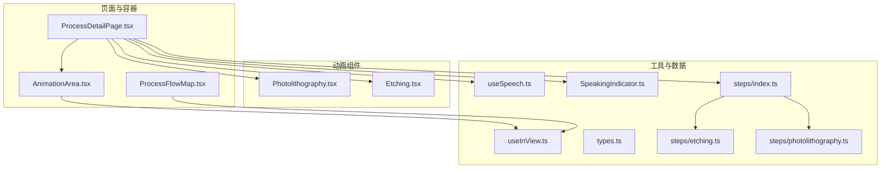
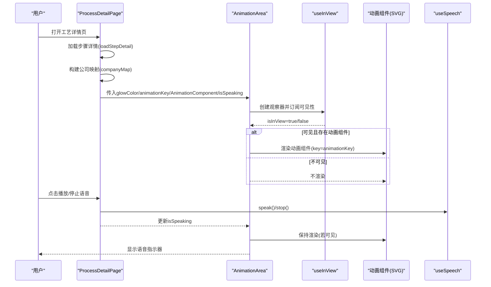
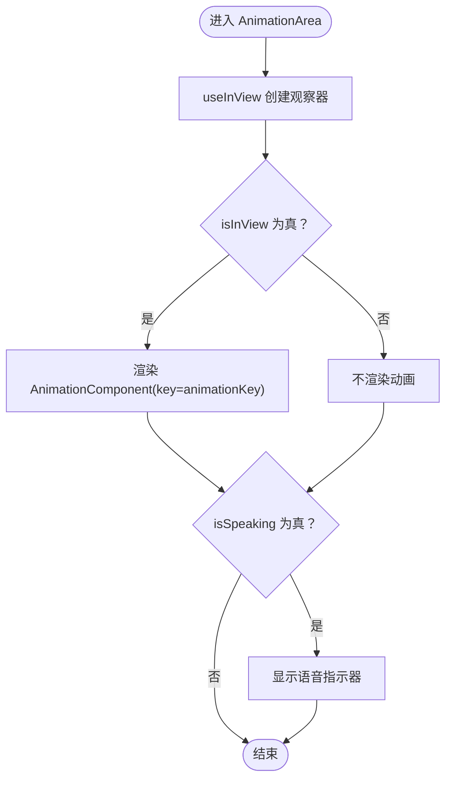
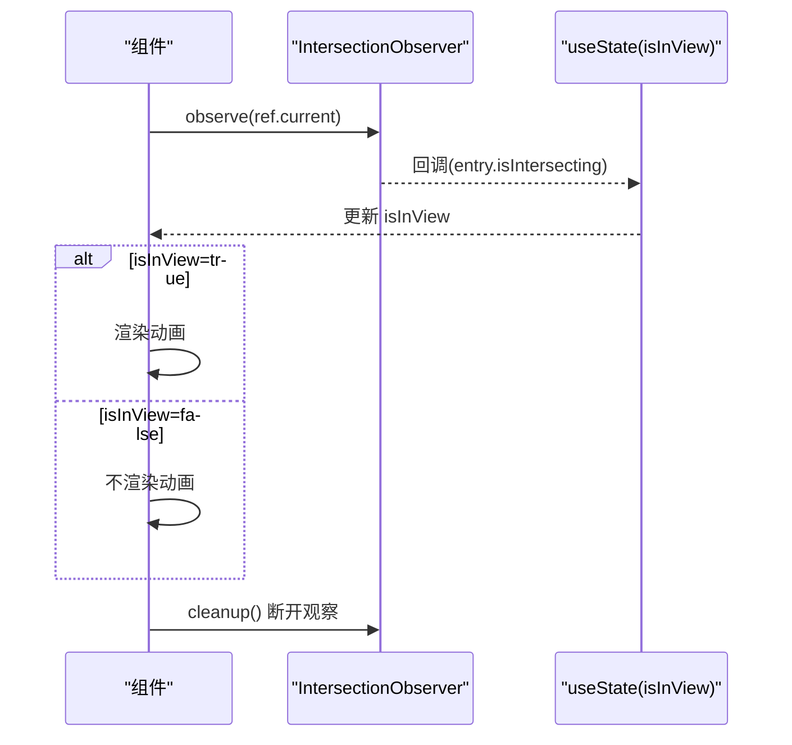
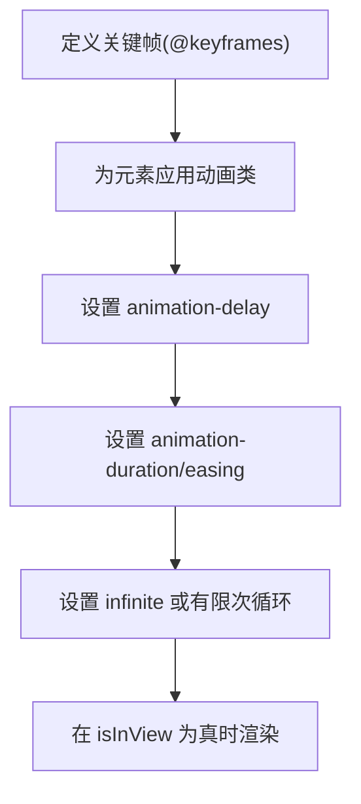
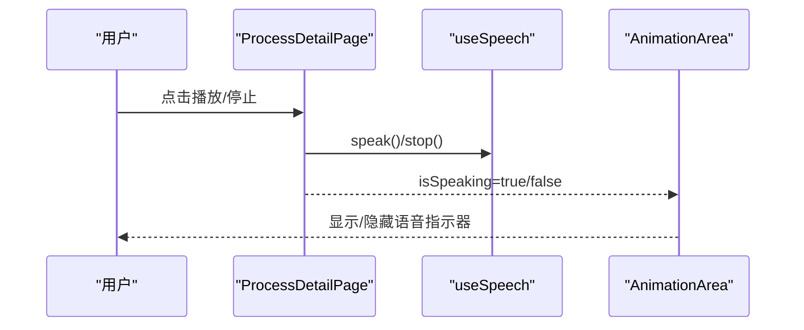
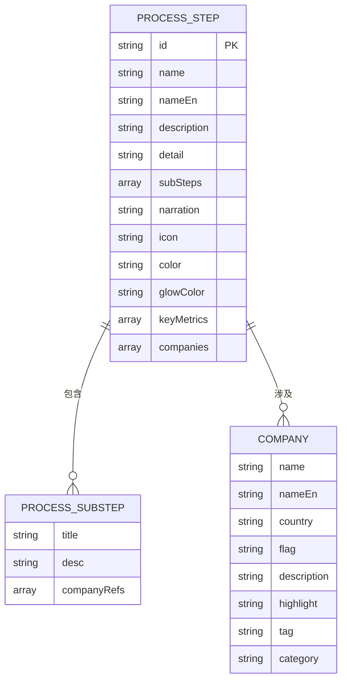
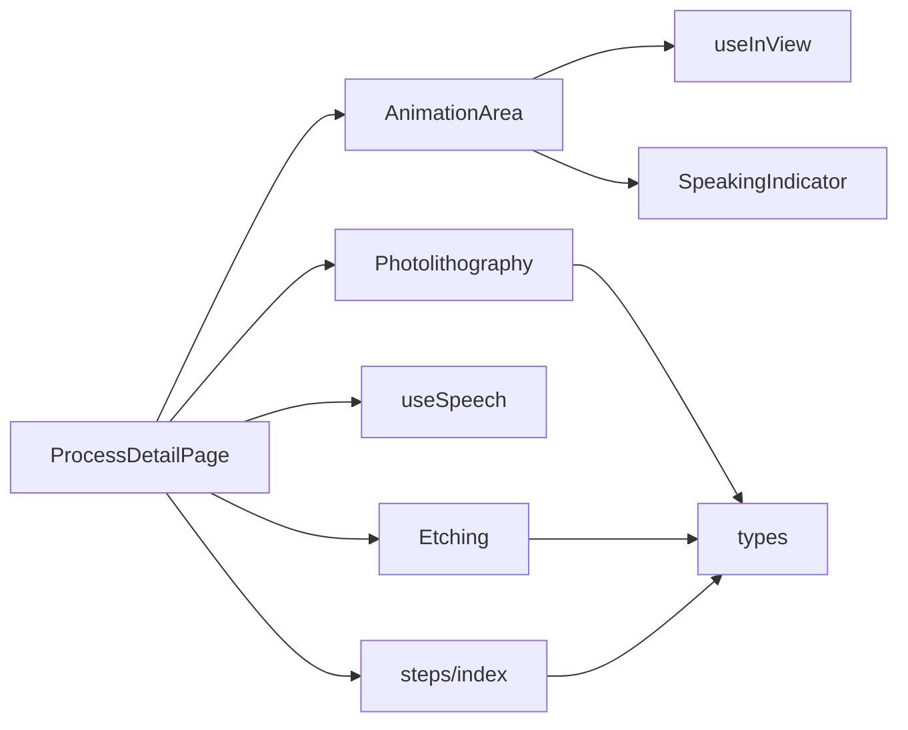

# 动画效果集成

<cite>
**本文引用的文件**
- [src/components/ui/AnimationArea.tsx](file://src/components/ui/AnimationArea.tsx)
- [src/hooks/useInView.ts](file://src/hooks/useInView.ts)
- [src/components/layout/ProcessDetailPage.tsx](file://src/components/layout/ProcessDetailPage.tsx)
- [src/components/layout/ProcessFlowMap.tsx](file://src/components/layout/ProcessFlowMap.tsx)
- [src/components/process/Photolithography.tsx](file://src/components/process/Photolithography.tsx)
- [src/components/process/Etching.tsx](file://src/components/process/Etching.tsx)
- [src/hooks/useSpeech.ts](file://src/hooks/useSpeech.ts)
- [src/components/ui/SpeakingIndicator.tsx](file://src/components/ui/SpeakingIndicator.tsx)
- [src/data/types.ts](file://src/data/types.ts)
- [src/data/steps/index.ts](file://src/data/steps/index.ts)
- [src/data/steps/etching.ts](file://src/data/steps/etching.ts)
- [src/data/steps/photolithography.ts](file://src/data/steps/photolithography.ts)
- [src/components/ui/ProgressBar.tsx](file://src/components/ui/ProgressBar.tsx)
- [src/components/ui/ProcessNavigation.tsx](file://src/components/ui/ProcessNavigation.tsx)
- [src/components/ui/CompanyCard.tsx](file://src/components/ui/CompanyCard.tsx)
- [src/lib/utils.ts](file://src/lib/utils.ts)
</cite>

## 目录
1. [简介](#简介)
2. [项目结构](#项目结构)
3. [核心组件](#核心组件)
4. [架构总览](#架构总览)
5. [详细组件分析](#详细组件分析)
6. [依赖关系分析](#依赖关系分析)
7. [性能考量](#性能考量)
8. [故障排查指南](#故障排查指南)
9. [结论](#结论)
10. [附录](#附录)

## 简介
本指南面向“芯片制造演示项目”的动画集成与可视化呈现，围绕以下目标展开：
- 基于 SVG 的动画开发方法与动画库（CSS 动画）使用技巧
- 动画序列控制与时间轴管理
- Intersection Observer API 在懒加载动画中的应用与性能优化
- AnimationArea 组件的使用方法与自定义动画开发流程
- 将动画与数据驱动展示结合，确保动画与工艺步骤准确对应
- 提供调试技巧与最佳实践，帮助开发者创建流畅且富有表现力的视觉效果

## 项目结构
该项目采用按功能域划分的组织方式，动画相关能力集中在以下模块：
- 动画容器与懒加载：AnimationArea、useInView
- 工艺步骤页面：ProcessDetailPage，负责根据路由动态加载步骤数据与动画组件
- 流程地图与懒加载：ProcessFlowMap，展示完整工艺流程并使用 Intersection Observer 实现入场动画
- 具体工艺动画：Photolithography、Etching 等 SVG 动画组件
- 语音讲解与指示器：useSpeech、SpeakingIndicator
- 数据模型与步骤加载：types、steps/index、具体步骤数据

图表来源
- [src/components/layout/ProcessDetailPage.tsx:36-397](file://src/components/layout/ProcessDetailPage.tsx#L36-L397)
- [src/components/ui/AnimationArea.tsx:11-28](file://src/components/ui/AnimationArea.tsx#L11-L28)
- [src/hooks/useInView.ts:8-32](file://src/hooks/useInView.ts#L8-L32)
- [src/components/process/Photolithography.tsx:1-136](file://src/components/process/Photolithography.tsx#L1-L136)
- [src/components/process/Etching.tsx:1-139](file://src/components/process/Etching.tsx#L1-L139)
- [src/hooks/useSpeech.ts:64-135](file://src/hooks/useSpeech.ts#L64-L135)
- [src/components/ui/SpeakingIndicator.tsx:3-28](file://src/components/ui/SpeakingIndicator.tsx#L3-L28)
- [src/data/types.ts:1-33](file://src/data/types.ts#L1-L33)
- [src/data/steps/index.ts:1-34](file://src/data/steps/index.ts#L1-L34)
- [src/data/steps/etching.ts:1-142](file://src/data/steps/etching.ts#L1-L142)
- [src/data/steps/photolithography.ts:1-152](file://src/data/steps/photolithography.ts#L1-L152)

章节来源
- [src/components/layout/ProcessDetailPage.tsx:36-397](file://src/components/layout/ProcessDetailPage.tsx#L36-L397)
- [src/components/ui/AnimationArea.tsx:11-28](file://src/components/ui/AnimationArea.tsx#L11-L28)
- [src/hooks/useInView.ts:8-32](file://src/hooks/useInView.ts#L8-L32)
- [src/components/layout/ProcessFlowMap.tsx:200-255](file://src/components/layout/ProcessFlowMap.tsx#L200-L255)
- [src/components/process/Photolithography.tsx:1-136](file://src/components/process/Photolithography.tsx#L1-L136)
- [src/components/process/Etching.tsx:1-139](file://src/components/process/Etching.tsx#L1-L139)
- [src/hooks/useSpeech.ts:64-135](file://src/hooks/useSpeech.ts#L64-L135)
- [src/components/ui/SpeakingIndicator.tsx:3-28](file://src/components/ui/SpeakingIndicator.tsx#L3-L28)
- [src/data/types.ts:1-33](file://src/data/types.ts#L1-L33)
- [src/data/steps/index.ts:1-34](file://src/data/steps/index.ts#L1-L34)
- [src/data/steps/etching.ts:1-142](file://src/data/steps/etching.ts#L1-L142)
- [src/data/steps/photolithography.ts:1-152](file://src/data/steps/photolithography.ts#L1-L152)

## 核心组件
- AnimationArea：封装动画容器与懒加载，基于 useInView 判定可视状态，按需渲染动画组件，并叠加语音讲解指示器。
- useInView：封装 Intersection Observer，提供阈值与根边距配置，返回 ref 与 isInView 状态。
- ProcessDetailPage：页面级控制器，负责加载步骤详情、构建公司映射、控制动画重播键、协调语音播放与停止。
- PhotolithographyAnimation / EtchingAnimation：具体 SVG 动画组件，使用 CSS 动画与样式表定义时间轴与序列。
- useSpeech / SpeakingIndicator：语音合成与播放状态指示，与页面交互联动。

章节来源
- [src/components/ui/AnimationArea.tsx:11-28](file://src/components/ui/AnimationArea.tsx#L11-L28)
- [src/hooks/useInView.ts:8-32](file://src/hooks/useInView.ts#L8-L32)
- [src/components/layout/ProcessDetailPage.tsx:36-397](file://src/components/layout/ProcessDetailPage.tsx#L36-L397)
- [src/components/process/Photolithography.tsx:1-136](file://src/components/process/Photolithography.tsx#L1-L136)
- [src/components/process/Etching.tsx:1-139](file://src/components/process/Etching.tsx#L1-L139)
- [src/hooks/useSpeech.ts:64-135](file://src/hooks/useSpeech.ts#L64-L135)
- [src/components/ui/SpeakingIndicator.tsx:3-28](file://src/components/ui/SpeakingIndicator.tsx#L3-L28)

## 架构总览
动画系统以“页面驱动 + 懒加载 + 数据驱动”为核心：
- 页面根据路由参数加载步骤详情与动画组件映射
- AnimationArea 使用 Intersection Observer 判断可视性，仅在可见时渲染动画
- 动画组件内部通过 CSS 动画定义时间轴与序列，配合延迟与循环控制
- 语音讲解与动画播放解耦，通过状态切换控制播放/停止与 UI 指示

图表来源
- [src/components/layout/ProcessDetailPage.tsx:36-397](file://src/components/layout/ProcessDetailPage.tsx#L36-L397)
- [src/components/ui/AnimationArea.tsx:11-28](file://src/components/ui/AnimationArea.tsx#L11-L28)
- [src/hooks/useInView.ts:8-32](file://src/hooks/useInView.ts#L8-L32)
- [src/hooks/useSpeech.ts:64-135](file://src/hooks/useSpeech.ts#L64-L135)

## 详细组件分析

### AnimationArea 组件
- 职责：提供动画容器，设置径向渐变背景，基于 isInView 决定是否渲染动画组件，叠加语音指示器。
- 关键点：
  - 使用 useInView 获取 ref 与 isInView，阈值可调
  - 通过 props.glowColor 与 props.animationKey 控制外观与重播
  - 当 isSpeaking 为真时显示 SpeakingIndicator

图表来源
- [src/components/ui/AnimationArea.tsx:11-28](file://src/components/ui/AnimationArea.tsx#L11-L28)
- [src/hooks/useInView.ts:8-32](file://src/hooks/useInView.ts#L8-L32)
- [src/components/ui/SpeakingIndicator.tsx:3-28](file://src/components/ui/SpeakingIndicator.tsx#L3-L28)

章节来源
- [src/components/ui/AnimationArea.tsx:11-28](file://src/components/ui/AnimationArea.tsx#L11-L28)

### Intersection Observer 懒加载与动画触发
- useInView：默认阈值 0.1，支持 rootMargin；在组件卸载时断开观察器，避免内存泄漏。
- ProcessFlowMap：在节点可见时设置透明度与位移，配合过渡与延迟，实现逐项入场动画。
- AnimationArea：仅在 isInView 为真时渲染动画组件，减少不必要的重绘与资源占用。

图表来源
- [src/hooks/useInView.ts:8-32](file://src/hooks/useInView.ts#L8-L32)
- [src/components/layout/ProcessFlowMap.tsx:65-81](file://src/components/layout/ProcessFlowMap.tsx#L65-L81)

章节来源
- [src/hooks/useInView.ts:8-32](file://src/hooks/useInView.ts#L8-L32)
- [src/components/layout/ProcessFlowMap.tsx:65-81](file://src/components/layout/ProcessFlowMap.tsx#L65-L81)

### 动画序列控制与时间轴管理（SVG + CSS）
- 时间轴策略：
  - 使用 CSS @keyframes 定义动画序列（如脉冲、闪烁、上升、缩放等）
  - 通过 animation-delay 对不同元素设置错峰，营造层次感
  - 通过 animation-duration 与 easing 控制节奏
- 示例组件：
  - PhotolithographyAnimation：定义 UV 光束、掩模、投影、曝光等动画序列
  - EtchingAnimation：定义等离子体脉冲、离子轰击、刻蚀槽增长、碎屑飞升等序列
- 复杂度与性能：
  - 动画数量与复杂度与元素数量呈线性关系，建议在可见时才渲染
  - 合理使用滤镜与透明度，避免过度重绘

图表来源
- [src/components/process/Photolithography.tsx:17-69](file://src/components/process/Photolithography.tsx#L17-L69)
- [src/components/process/Etching.tsx:12-62](file://src/components/process/Etching.tsx#L12-L62)

章节来源
- [src/components/process/Photolithography.tsx:1-136](file://src/components/process/Photolithography.tsx#L1-L136)
- [src/components/process/Etching.tsx:1-139](file://src/components/process/Etching.tsx#L1-L139)

### 语音讲解与动画同步
- useSpeech：自动选择更自然的中文语音，缓存偏好；提供 speak/stop/getAvailableVoices/setPreferredVoice。
- ProcessDetailPage：根据 isSpeaking 控制动画区域的语音指示器显示；点击按钮切换播放/停止。
- SpeakingIndicator：随机高度的柱状条配合脉冲动画，营造“语音中”的氛围。

图表来源
- [src/components/layout/ProcessDetailPage.tsx:82-116](file://src/components/layout/ProcessDetailPage.tsx#L82-L116)
- [src/hooks/useSpeech.ts:64-135](file://src/hooks/useSpeech.ts#L64-L135)
- [src/components/ui/SpeakingIndicator.tsx:3-28](file://src/components/ui/SpeakingIndicator.tsx#L3-L28)

章节来源
- [src/components/layout/ProcessDetailPage.tsx:82-116](file://src/components/layout/ProcessDetailPage.tsx#L82-L116)
- [src/hooks/useSpeech.ts:64-135](file://src/hooks/useSpeech.ts#L64-L135)
- [src/components/ui/SpeakingIndicator.tsx:3-28](file://src/components/ui/SpeakingIndicator.tsx#L3-L28)

### 数据驱动的展示与动画对应
- 数据模型：ProcessStep、ProcessSubStep、Company，包含颜色、渐变色、关键指标、子步骤描述等。
- 步骤加载：steps/index 提供按 id 动态导入步骤详情，保证首屏快速渲染与按需加载。
- 页面联动：ProcessDetailPage 根据路由 id 加载步骤详情，解析子步骤与公司信息，构建公司映射，确保动画与讲解内容一致。

图表来源
- [src/data/types.ts:12-32](file://src/data/types.ts#L12-L32)
- [src/data/steps/index.ts:16-33](file://src/data/steps/index.ts#L16-L33)
- [src/data/steps/etching.ts:3-142](file://src/data/steps/etching.ts#L3-L142)
- [src/data/steps/photolithography.ts:3-152](file://src/data/steps/photolithography.ts#L3-L152)

章节来源
- [src/data/types.ts:12-32](file://src/data/types.ts#L12-L32)
- [src/data/steps/index.ts:16-33](file://src/data/steps/index.ts#L16-L33)
- [src/data/steps/etching.ts:3-142](file://src/data/steps/etching.ts#L3-L142)
- [src/data/steps/photolithography.ts:3-152](file://src/data/steps/photolithography.ts#L3-L152)

### 自定义动画开发流程
- 步骤一：确定动画目标与时间轴
  - 明确要表现的物理过程（如曝光、刻蚀、溅射等）
  - 设计关键帧序列与元素层次
- 步骤二：编写 SVG 结构与样式
  - 在组件中定义 SVG 与 <defs>，声明渐变、滤镜与动画样式
  - 使用 CSS 类名统一管理动画
- 步骤三：控制动画时序
  - 通过 animation-delay 为不同元素设置错峰
  - 通过 animation-duration 与 easing 控制节奏
- 步骤四：接入懒加载与重播
  - 将组件作为 AnimationComponent 传入 AnimationArea
  - 通过 animationKey 改变强制重渲染，实现重播
- 步骤五：与数据对接
  - 读取步骤数据中的颜色、渐变色、关键指标，动态应用到动画外观
  - 将讲解文案与动画步骤对齐，确保语义一致

章节来源
- [src/components/ui/AnimationArea.tsx:11-28](file://src/components/ui/AnimationArea.tsx#L11-L28)
- [src/components/layout/ProcessDetailPage.tsx:93-116](file://src/components/layout/ProcessDetailPage.tsx#L93-L116)
- [src/components/process/Photolithography.tsx:1-136](file://src/components/process/Photolithography.tsx#L1-L136)
- [src/components/process/Etching.tsx:1-139](file://src/components/process/Etching.tsx#L1-L139)

## 依赖关系分析
- 组件耦合
  - ProcessDetailPage 依赖 steps/index 与 types，负责数据加载与动画组件映射
  - AnimationArea 依赖 useInView，与 useSpeech 通过 props 协作
  - 具体动画组件依赖自身样式与数据（颜色、渐变色）
- 外部依赖
  - Web Speech API：useSpeech 依赖浏览器语音合成能力
  - Intersection Observer：useInView 依赖浏览器原生 API
- 潜在环路
  - 无直接循环依赖；数据加载与动画渲染通过 props 传递，解耦良好

图表来源
- [src/components/layout/ProcessDetailPage.tsx:36-397](file://src/components/layout/ProcessDetailPage.tsx#L36-L397)
- [src/components/ui/AnimationArea.tsx:11-28](file://src/components/ui/AnimationArea.tsx#L11-L28)
- [src/hooks/useInView.ts:8-32](file://src/hooks/useInView.ts#L8-L32)
- [src/hooks/useSpeech.ts:64-135](file://src/hooks/useSpeech.ts#L64-L135)
- [src/components/ui/SpeakingIndicator.tsx:3-28](file://src/components/ui/SpeakingIndicator.tsx#L3-L28)
- [src/components/process/Photolithography.tsx:1-136](file://src/components/process/Photolithography.tsx#L1-L136)
- [src/components/process/Etching.tsx:1-139](file://src/components/process/Etching.tsx#L1-L139)
- [src/data/types.ts:1-33](file://src/data/types.ts#L1-L33)
- [src/data/steps/index.ts:1-34](file://src/data/steps/index.ts#L1-L34)

章节来源
- [src/components/layout/ProcessDetailPage.tsx:36-397](file://src/components/layout/ProcessDetailPage.tsx#L36-L397)
- [src/components/ui/AnimationArea.tsx:11-28](file://src/components/ui/AnimationArea.tsx#L11-L28)
- [src/hooks/useInView.ts:8-32](file://src/hooks/useInView.ts#L8-L32)
- [src/hooks/useSpeech.ts:64-135](file://src/hooks/useSpeech.ts#L64-L135)
- [src/components/ui/SpeakingIndicator.tsx:3-28](file://src/components/ui/SpeakingIndicator.tsx#L3-L28)
- [src/components/process/Photolithography.tsx:1-136](file://src/components/process/Photolithography.tsx#L1-L136)
- [src/components/process/Etching.tsx:1-139](file://src/components/process/Etching.tsx#L1-L139)
- [src/data/types.ts:1-33](file://src/data/types.ts#L1-L33)
- [src/data/steps/index.ts:1-34](file://src/data/steps/index.ts#L1-L34)

## 性能考量
- 懒加载与可见性控制
  - 使用 useInView 仅在元素进入视口时渲染动画，降低初始渲染压力
  - ProcessFlowMap 通过 isInView 记录“已出现”，避免重复动画
- 动画优化
  - 优先使用 transform 与 opacity 动画，减少重排重绘
  - 合理设置 animation-duration 与 easing，避免高频更新
  - 使用 CSS 动画而非 JS 动画，提升性能与一致性
- 资源与网络
  - 动态导入步骤详情，按需加载，减少首屏体积
  - 语音合成依赖浏览器能力，避免在网络不佳时阻塞
- UI 与交互
  - 通过 animationKey 强制重渲染，避免旧状态残留
  - 进度条与导航组件使用轻量级样式，不影响动画性能

## 故障排查指南
- 动画不出现
  - 检查 isInView 是否为 true（调整阈值或 rootMargin）
  - 确认 AnimationComponent 存在且 key 发生变化
  - 参考：[src/components/ui/AnimationArea.tsx:11-28](file://src/components/ui/AnimationArea.tsx#L11-L28)、[src/hooks/useInView.ts:8-32](file://src/hooks/useInView.ts#L8-L32)
- 动画卡顿或掉帧
  - 减少动画元素数量或简化关键帧
  - 避免在动画中频繁修改布局属性
  - 使用 transform/opacity 替代 top/left 等布局属性
- 语音无法播放
  - 确认浏览器支持 Web Speech API，检查 onvoiceschanged 事件是否触发
  - 若首选语音无效，尝试手动设置或清除本地偏好
  - 参考：[src/hooks/useSpeech.ts:74-107](file://src/hooks/useSpeech.ts#L74-L107)
- 步骤数据未加载
  - 检查 steps/index 的 id 映射与动态导入路径
  - 确认 ProcessDetailPage 的路由参数与数据加载逻辑
  - 参考：[src/data/steps/index.ts:16-33](file://src/data/steps/index.ts#L16-L33)、[src/components/layout/ProcessDetailPage.tsx:59-67](file://src/components/layout/ProcessDetailPage.tsx#L59-L67)

章节来源
- [src/components/ui/AnimationArea.tsx:11-28](file://src/components/ui/AnimationArea.tsx#L11-L28)
- [src/hooks/useInView.ts:8-32](file://src/hooks/useInView.ts#L8-L32)
- [src/hooks/useSpeech.ts:74-107](file://src/hooks/useSpeech.ts#L74-L107)
- [src/data/steps/index.ts:16-33](file://src/data/steps/index.ts#L16-L33)
- [src/components/layout/ProcessDetailPage.tsx:59-67](file://src/components/layout/ProcessDetailPage.tsx#L59-L67)

## 结论
本项目通过“页面驱动 + 懒加载 + 数据驱动”的架构，实现了流畅且可扩展的动画系统：
- 使用 Intersection Observer 保障动画的按需渲染与性能
- 以 CSS 动画定义清晰的时间轴与序列，配合延迟与循环控制层次感
- 通过 AnimationArea 与 useInView 解耦容器与懒加载逻辑
- 将语音讲解与动画播放解耦，提升用户体验与可维护性
- 数据模型与动态导入确保动画与工艺步骤精准对应

## 附录
- 相关 UI 组件参考
  - 进度条：[src/components/ui/ProgressBar.tsx:8-59](file://src/components/ui/ProgressBar.tsx#L8-L59)
  - 导航：[src/components/ui/ProcessNavigation.tsx:14-66](file://src/components/ui/ProcessNavigation.tsx#L14-L66)
  - 公司卡片：[src/components/ui/CompanyCard.tsx:99-159](file://src/components/ui/CompanyCard.tsx#L99-L159)
  - 工具函数：[src/lib/utils.ts:4-7](file://src/lib/utils.ts#L4-L7)