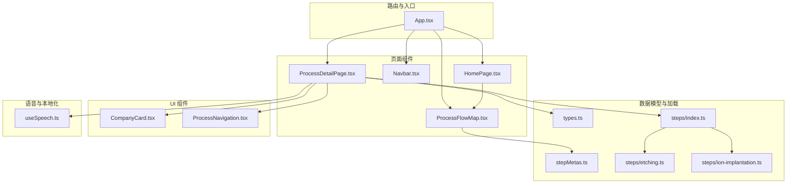
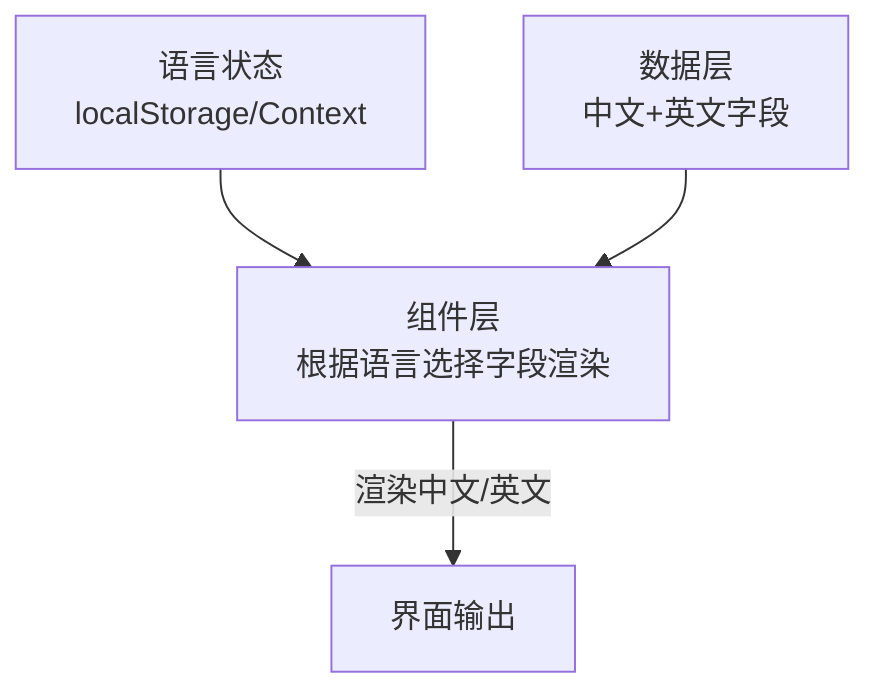
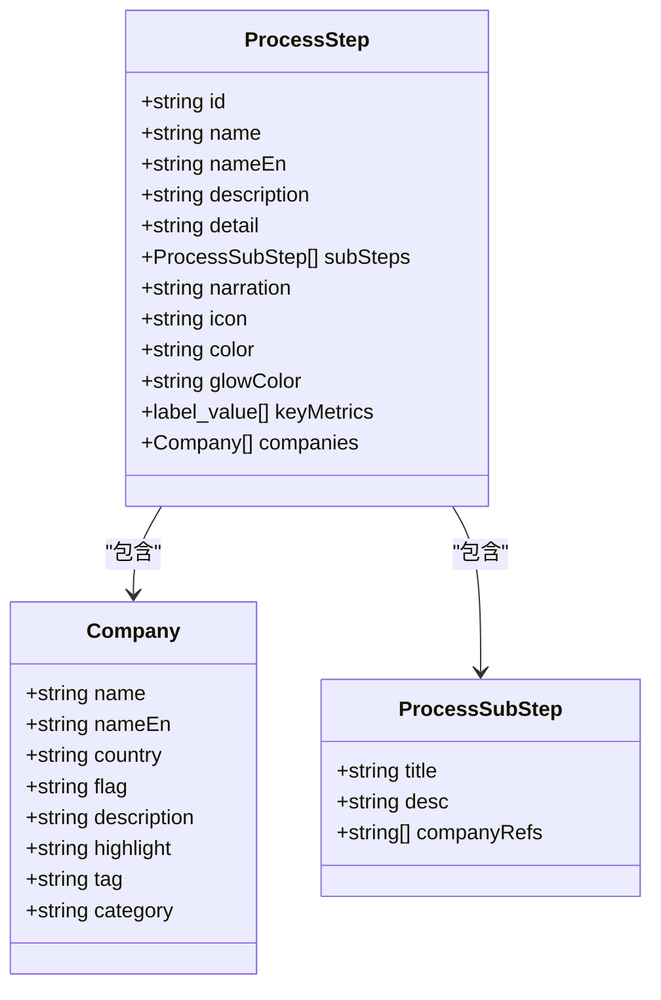
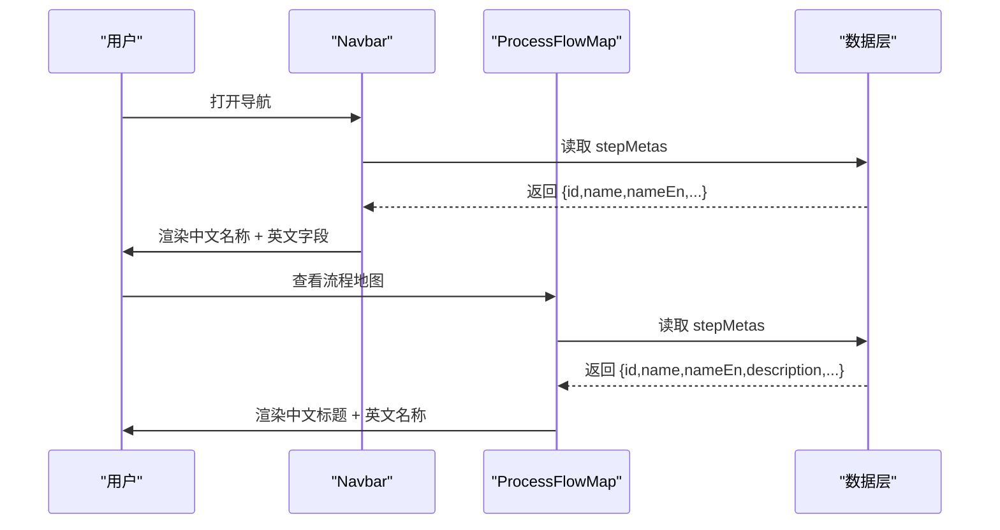
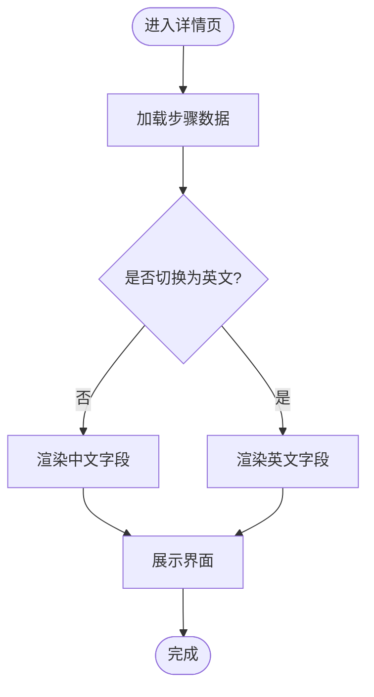
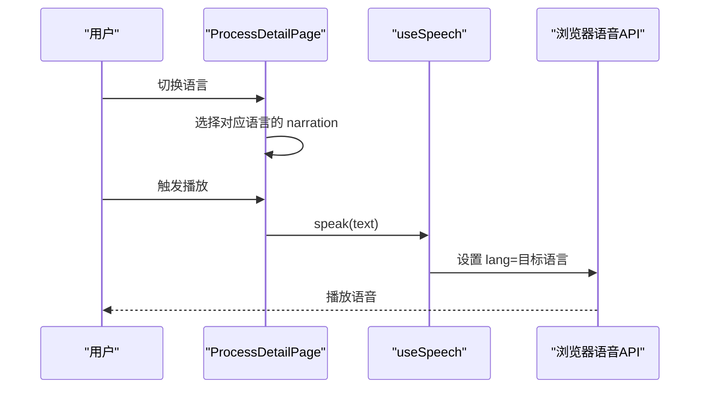
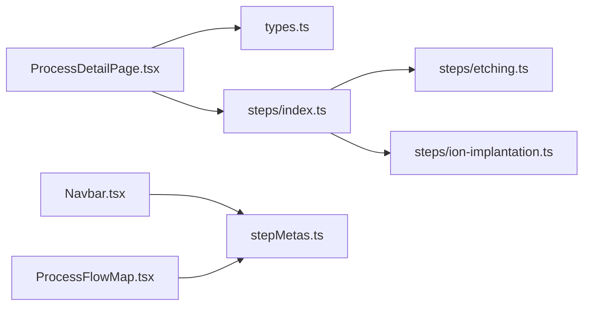

# 国际化支持

<cite>
**本文引用的文件**
- [src/data/types.ts](file://src/data/types.ts)
- [src/data/stepMetas.ts](file://src/data/stepMetas.ts)
- [src/data/steps/index.ts](file://src/data/steps/index.ts)
- [src/data/steps/etching.ts](file://src/data/steps/etching.ts)
- [src/data/steps/ion-implantation.ts](file://src/data/steps/ion-implantation.ts)
- [src/components/layout/Navbar.tsx](file://src/components/layout/Navbar.tsx)
- [src/components/layout/HomePage.tsx](file://src/components/layout/HomePage.tsx)
- [src/components/layout/ProcessDetailPage.tsx](file://src/components/layout/ProcessDetailPage.tsx)
- [src/components/layout/ProcessFlowMap.tsx](file://src/components/layout/ProcessFlowMap.tsx)
- [src/components/ui/CompanyCard.tsx](file://src/components/ui/CompanyCard.tsx)
- [src/components/ui/ProcessNavigation.tsx](file://src/components/ui/ProcessNavigation.tsx)
- [src/hooks/useSpeech.ts](file://src/hooks/useSpeech.ts)
- [src/App.tsx](file://src/App.tsx)
- [package.json](file://package.json)
</cite>

## 目录
1. [简介](#简介)
2. [项目结构](#项目结构)
3. [核心组件](#核心组件)
4. [架构总览](#架构总览)
5. [详细组件分析](#详细组件分析)
6. [依赖分析](#依赖分析)
7. [性能考虑](#性能考虑)
8. [故障排查指南](#故障排查指南)
9. [结论](#结论)
10. [附录](#附录)

## 简介
本指南面向“芯片制造演示项目”的国际化扩展，目标是在现有数据模型与组件基础上，系统性地引入多语言支持，重点围绕英文字段的维护与翻译策略、nameEn 字段的使用规范与翻译流程、组件级文本提取与动态语言切换、以及不同语言的排版差异与字符集兼容性问题。文档同时提供可落地的实现建议、代码片段路径与本地化测试方法，确保应用能在多语言环境下稳定运行。

## 项目结构
项目采用前端单页应用架构，核心由路由、页面组件、数据模型与数据加载模块组成。国际化相关的关键位置包括：
- 数据模型层：包含英文字段的数据接口与静态元数据
- 页面与组件层：展示与交互逻辑，承载文本渲染与语言切换入口
- 语音讲解：中文语音合成，未来可扩展为多语种语音

图表来源
- [src/App.tsx:1-23](file://src/App.tsx#L1-L23)
- [src/components/layout/HomePage.tsx:1-85](file://src/components/layout/HomePage.tsx#L1-L85)
- [src/components/layout/Navbar.tsx:1-82](file://src/components/layout/Navbar.tsx#L1-L82)
- [src/components/layout/ProcessDetailPage.tsx:1-397](file://src/components/layout/ProcessDetailPage.tsx#L1-L397)
- [src/components/layout/ProcessFlowMap.tsx:114-141](file://src/components/layout/ProcessFlowMap.tsx#L114-L141)
- [src/data/types.ts:1-33](file://src/data/types.ts#L1-L33)
- [src/data/stepMetas.ts:1-103](file://src/data/stepMetas.ts#L1-L103)
- [src/data/steps/index.ts:1-34](file://src/data/steps/index.ts#L1-L34)
- [src/data/steps/etching.ts:1-142](file://src/data/steps/etching.ts#L1-L142)
- [src/data/steps/ion-implantation.ts:1-132](file://src/data/steps/ion-implantation.ts#L1-L132)
- [src/components/ui/CompanyCard.tsx:1-159](file://src/components/ui/CompanyCard.tsx#L1-L159)
- [src/components/ui/ProcessNavigation.tsx:1-67](file://src/components/ui/ProcessNavigation.tsx#L1-L67)
- [src/hooks/useSpeech.ts:1-134](file://src/hooks/useSpeech.ts#L1-L134)

章节来源
- [src/App.tsx:1-23](file://src/App.tsx#L1-L23)
- [src/components/layout/Navbar.tsx:1-82](file://src/components/layout/Navbar.tsx#L1-L82)
- [src/components/layout/HomePage.tsx:1-85](file://src/components/layout/HomePage.tsx#L1-L85)
- [src/components/layout/ProcessDetailPage.tsx:1-397](file://src/components/layout/ProcessDetailPage.tsx#L1-L397)
- [src/components/layout/ProcessFlowMap.tsx:114-141](file://src/components/layout/ProcessFlowMap.tsx#L114-L141)
- [src/data/types.ts:1-33](file://src/data/types.ts#L1-L33)
- [src/data/stepMetas.ts:1-103](file://src/data/stepMetas.ts#L1-L103)
- [src/data/steps/index.ts:1-34](file://src/data/steps/index.ts#L1-L34)
- [src/data/steps/etching.ts:1-142](file://src/data/steps/etching.ts#L1-L142)
- [src/data/steps/ion-implantation.ts:1-132](file://src/data/steps/ion-implantation.ts#L1-L132)
- [src/components/ui/CompanyCard.tsx:1-159](file://src/components/ui/CompanyCard.tsx#L1-L159)
- [src/components/ui/ProcessNavigation.tsx:1-67](file://src/components/ui/ProcessNavigation.tsx#L1-L67)
- [src/hooks/useSpeech.ts:1-134](file://src/hooks/useSpeech.ts#L1-L134)

## 核心组件
- 数据模型与英文字段
  - 公司与工艺步骤均包含中文与英文字段，英文字段用于国际化展示与检索。参考：
    - [src/data/types.ts:1-33](file://src/data/types.ts#L1-L33)
    - [src/data/stepMetas.ts:1-103](file://src/data/stepMetas.ts#L1-L103)
- 动态语言切换与组件渲染
  - 导航栏与详情页均直接使用中文字段进行渲染，英文字段作为补充信息展示。参考：
    - [src/components/layout/Navbar.tsx:22-39](file://src/components/layout/Navbar.tsx#L22-L39)
    - [src/components/layout/ProcessDetailPage.tsx:168-176](file://src/components/layout/ProcessDetailPage.tsx#L168-L176)
- 文本提取与翻译策略
  - 建议在数据加载阶段统一抽取所有需要翻译的文本，形成键值映射，便于后续翻译与替换。参考：
    - [src/data/steps/index.ts:16-33](file://src/data/steps/index.ts#L16-L33)
    - [src/data/steps/etching.ts:3-142](file://src/data/steps/etching.ts#L3-L142)
    - [src/data/steps/ion-implantation.ts:3-132](file://src/data/steps/ion-implantation.ts#L3-L132)
- 语音讲解（中文）
  - 当前语音讲解为中文，未来可扩展为多语种语音。参考：
    - [src/hooks/useSpeech.ts:74-107](file://src/hooks/useSpeech.ts#L74-L107)

章节来源
- [src/data/types.ts:1-33](file://src/data/types.ts#L1-L33)
- [src/data/stepMetas.ts:1-103](file://src/data/stepMetas.ts#L1-L103)
- [src/components/layout/Navbar.tsx:22-39](file://src/components/layout/Navbar.tsx#L22-L39)
- [src/components/layout/ProcessDetailPage.tsx:168-176](file://src/components/layout/ProcessDetailPage.tsx#L168-L176)
- [src/data/steps/index.ts:16-33](file://src/data/steps/index.ts#L16-L33)
- [src/data/steps/etching.ts:3-142](file://src/data/steps/etching.ts#L3-L142)
- [src/data/steps/ion-implantation.ts:3-132](file://src/data/steps/ion-implantation.ts#L3-L132)
- [src/hooks/useSpeech.ts:74-107](file://src/hooks/useSpeech.ts#L74-L107)

## 架构总览
国际化扩展建议采用“数据层 + 组件层 + 语言切换层”的三层架构：
- 数据层：保留现有中文字段与新增英文字段，保证默认显示中文；英文字段用于国际化展示与检索
- 组件层：在渲染时根据当前语言选择中文或英文字段；英文字段作为后备显示
- 语言切换层：提供语言切换入口与状态管理，结合本地存储持久化用户偏好

## 详细组件分析

### 数据模型与 nameEn 字段使用规范
- 字段设计
  - 公司与工艺步骤均包含 name 与 nameEn 字段，英文字段用于国际化展示与跨语言检索
  - 参考：[src/data/types.ts:1-33](file://src/data/types.ts#L1-L33)
- 使用规范
  - 展示优先级：默认使用中文字段；当语言切换为英文时，优先使用英文字段
  - 检索与匹配：英文字段可用于跨语言引用与匹配（如 subSteps 的 companyRefs 与 companies 的 nameEn 对应）
  - 参考：[src/components/layout/ProcessDetailPage.tsx:45-49](file://src/components/layout/ProcessDetailPage.tsx#L45-L49)
- 翻译流程建议
  - 在数据加载阶段，统一抽取 name、description、detail、title、subSteps.desc 等文本键值
  - 将英文字段作为默认英文翻译源，中文字段作为默认中文翻译源
  - 通过翻译键映射表实现动态替换，避免硬编码字符串

图表来源
- [src/data/types.ts:1-33](file://src/data/types.ts#L1-L33)

章节来源
- [src/data/types.ts:1-33](file://src/data/types.ts#L1-L33)
- [src/components/layout/ProcessDetailPage.tsx:45-49](file://src/components/layout/ProcessDetailPage.tsx#L45-L49)

### 导航栏与流程地图中的国际化展示
- 导航栏
  - 默认使用中文名称渲染；英文字段作为辅助展示
  - 参考：[src/components/layout/Navbar.tsx:22-39](file://src/components/layout/Navbar.tsx#L22-L39)
- 流程地图
  - 同样采用中文为主，英文字段作为补充
  - 参考：[src/components/layout/ProcessFlowMap.tsx:114-141](file://src/components/layout/ProcessFlowMap.tsx#L114-L141)

图表来源
- [src/components/layout/Navbar.tsx:22-39](file://src/components/layout/Navbar.tsx#L22-L39)
- [src/components/layout/ProcessFlowMap.tsx:114-141](file://src/components/layout/ProcessFlowMap.tsx#L114-L141)
- [src/data/stepMetas.ts:1-103](file://src/data/stepMetas.ts#L1-L103)

章节来源
- [src/components/layout/Navbar.tsx:22-39](file://src/components/layout/Navbar.tsx#L22-L39)
- [src/components/layout/ProcessFlowMap.tsx:114-141](file://src/components/layout/ProcessFlowMap.tsx#L114-L141)
- [src/data/stepMetas.ts:1-103](file://src/data/stepMetas.ts#L1-L103)

### 工艺详情页的国际化渲染与动态语言切换
- 字段选择逻辑
  - 标题与描述：默认使用中文；英文字段作为后备
  - 子步骤标题与描述：默认使用中文；英文字段作为后备
  - 参考：[src/components/layout/ProcessDetailPage.tsx:168-176](file://src/components/layout/ProcessDetailPage.tsx#L168-L176)
- 动态语言切换
  - 建议在组件内部维护语言状态，并根据状态决定渲染中文或英文字段
  - 英文字段用于英文模式下的完整展示
  - 参考：[src/components/layout/ProcessDetailPage.tsx:314-374](file://src/components/layout/ProcessDetailPage.tsx#L314-L374)

图表来源
- [src/components/layout/ProcessDetailPage.tsx:168-176](file://src/components/layout/ProcessDetailPage.tsx#L168-L176)
- [src/components/layout/ProcessDetailPage.tsx:314-374](file://src/components/layout/ProcessDetailPage.tsx#L314-L374)

章节来源
- [src/components/layout/ProcessDetailPage.tsx:168-176](file://src/components/layout/ProcessDetailPage.tsx#L168-L176)
- [src/components/layout/ProcessDetailPage.tsx:314-374](file://src/components/layout/ProcessDetailPage.tsx#L314-L374)

### 企业卡片与导航组件的国际化适配
- 企业卡片
  - 中文名称与英文名称并列展示，英文字段作为补充标识
  - 参考：[src/components/ui/CompanyCard.tsx:44-46](file://src/components/ui/CompanyCard.tsx#L44-L46)
- 进一步建议
  - 在语言切换时，优先使用英文字段；若无英文字段，则回退到中文字段
  - 参考：[src/components/ui/CompanyCard.tsx:115-158](file://src/components/ui/CompanyCard.tsx#L115-L158)

章节来源
- [src/components/ui/CompanyCard.tsx:44-46](file://src/components/ui/CompanyCard.tsx#L44-L46)
- [src/components/ui/CompanyCard.tsx:115-158](file://src/components/ui/CompanyCard.tsx#L115-L158)

### 语音讲解（中文）与多语种扩展
- 现状
  - 语音讲解使用中文语音合成，语言固定为 zh-CN
  - 参考：[src/hooks/useSpeech.ts:84](file://src/hooks/useSpeech.ts#L84)
- 多语种扩展建议
  - 为每个语言维护独立的 narration 文本键值映射
  - 在语言切换时，动态选择对应语言的 narration 并调用语音合成
  - 参考：[src/components/layout/ProcessDetailPage.tsx:82-91](file://src/components/layout/ProcessDetailPage.tsx#L82-L91)

图表来源
- [src/components/layout/ProcessDetailPage.tsx:82-91](file://src/components/layout/ProcessDetailPage.tsx#L82-L91)
- [src/hooks/useSpeech.ts:74-107](file://src/hooks/useSpeech.ts#L74-L107)

章节来源
- [src/hooks/useSpeech.ts:74-107](file://src/hooks/useSpeech.ts#L74-L107)
- [src/components/layout/ProcessDetailPage.tsx:82-91](file://src/components/layout/ProcessDetailPage.tsx#L82-L91)

## 依赖分析
- 组件与数据的耦合关系
  - ProcessDetailPage 依赖 types.ts 定义的数据结构，并通过 steps/index.ts 动态加载具体步骤数据
  - Navbar 与 ProcessFlowMap 依赖 stepMetas.ts 提供的静态元数据
- 依赖关系可视化

图表来源
- [src/components/layout/ProcessDetailPage.tsx:1-397](file://src/components/layout/ProcessDetailPage.tsx#L1-L397)
- [src/data/types.ts:1-33](file://src/data/types.ts#L1-L33)
- [src/data/steps/index.ts:1-34](file://src/data/steps/index.ts#L1-L34)
- [src/data/steps/etching.ts:1-142](file://src/data/steps/etching.ts#L1-L142)
- [src/data/steps/ion-implantation.ts:1-132](file://src/data/steps/ion-implantation.ts#L1-L132)
- [src/components/layout/Navbar.tsx:1-82](file://src/components/layout/Navbar.tsx#L1-L82)
- [src/components/layout/ProcessFlowMap.tsx:114-141](file://src/components/layout/ProcessFlowMap.tsx#L114-L141)
- [src/data/stepMetas.ts:1-103](file://src/data/stepMetas.ts#L1-L103)

章节来源
- [src/components/layout/ProcessDetailPage.tsx:1-397](file://src/components/layout/ProcessDetailPage.tsx#L1-L397)
- [src/data/steps/index.ts:1-34](file://src/data/steps/index.ts#L1-L34)
- [src/data/stepMetas.ts:1-103](file://src/data/stepMetas.ts#L1-L103)

## 性能考虑
- 动态导入与懒加载
  - 步骤数据通过动态导入按需加载，减少初始包体积
  - 参考：[src/data/steps/index.ts:16-21](file://src/data/steps/index.ts#L16-L21)
- 语言切换的最小化重渲染
  - 建议将语言状态提升至顶层路由组件，避免重复渲染
  - 参考：[src/App.tsx:7-20](file://src/App.tsx#L7-L20)
- 语音合成的缓存与预加载
  - 语音资源可能延迟加载，建议在页面初始化时预加载可用语音列表
  - 参考：[src/hooks/useSpeech.ts:95-104](file://src/hooks/useSpeech.ts#L95-L104)

## 故障排查指南
- 语音无法播放
  - 检查浏览器是否支持 Web Speech API，确认语言设置为 zh-CN
  - 参考：[src/hooks/useSpeech.ts:76-79](file://src/hooks/useSpeech.ts#L76-L79)
- 英文字段缺失导致显示异常
  - 确保数据层包含完整的 nameEn 字段，组件层在渲染时进行回退处理
  - 参考：[src/data/types.ts:21-22](file://src/data/types.ts#L21-L22)
- 语言切换不生效
  - 检查语言状态是否正确传递到子组件，确认组件内部根据语言状态选择字段
  - 参考：[src/components/layout/ProcessDetailPage.tsx:168-176](file://src/components/layout/ProcessDetailPage.tsx#L168-L176)

章节来源
- [src/hooks/useSpeech.ts:76-79](file://src/hooks/useSpeech.ts#L76-L79)
- [src/data/types.ts:21-22](file://src/data/types.ts#L21-L22)
- [src/components/layout/ProcessDetailPage.tsx:168-176](file://src/components/layout/ProcessDetailPage.tsx#L168-L176)

## 结论
本项目已具备良好的国际化基础：数据层包含英文字段，组件层可直接展示英文内容。建议在此基础上引入语言状态管理与翻译键映射机制，实现中文与英文的无缝切换；同时扩展语音讲解为多语种支持。通过合理的数据抽取、组件渲染策略与本地化测试，可确保应用在多语言环境下提供一致、准确的用户体验。

## 附录
- 本地化测试方法
  - 文本核对：逐项核对中文与英文字段的对应关系，确保无遗漏
  - 组件渲染：在英文模式下检查标题、描述、子步骤等是否正确显示英文
  - 语音测试：在英文模式下触发语音播放，确认语言设置与发音效果
  - 参考：[src/hooks/useSpeech.ts:84](file://src/hooks/useSpeech.ts#L84)