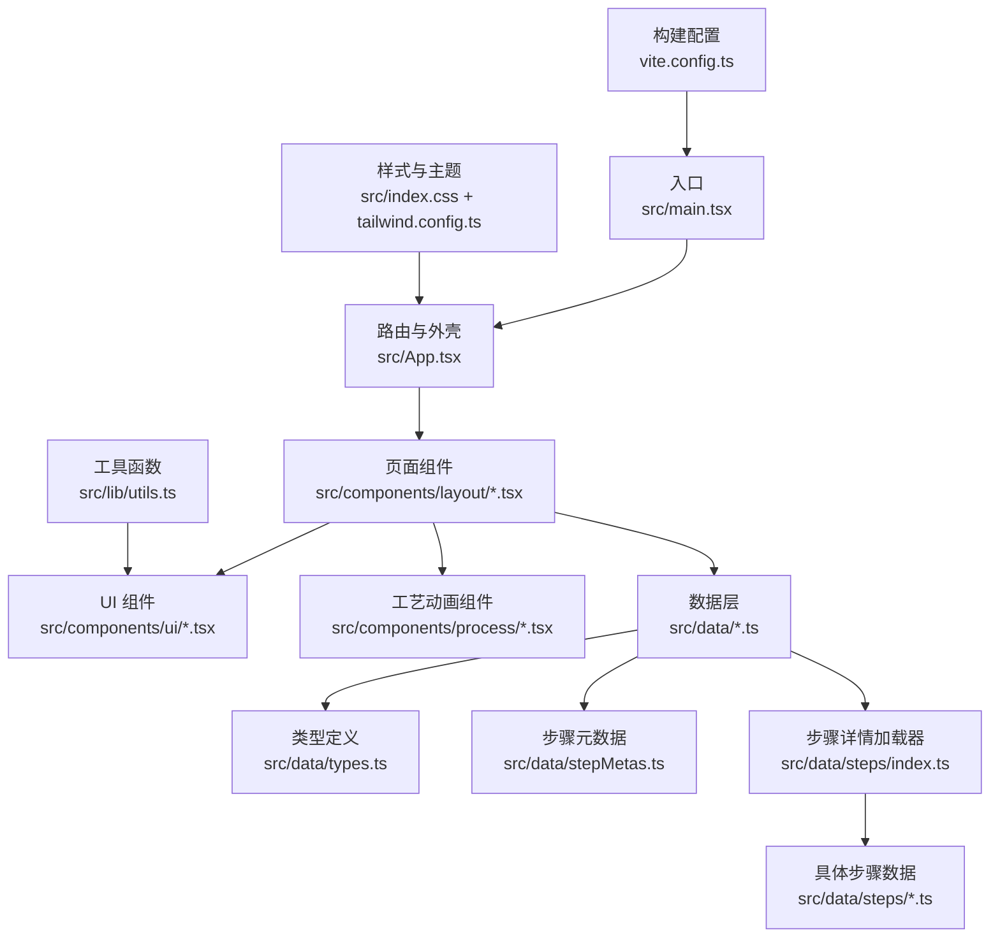
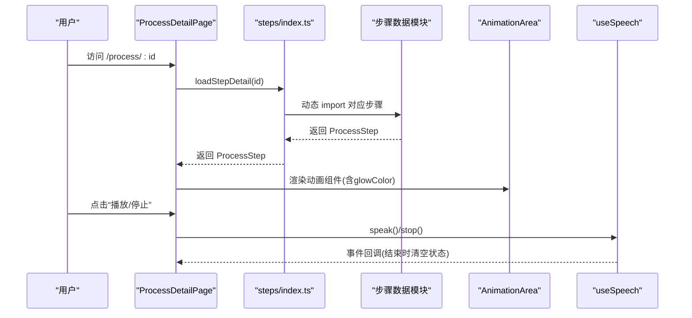
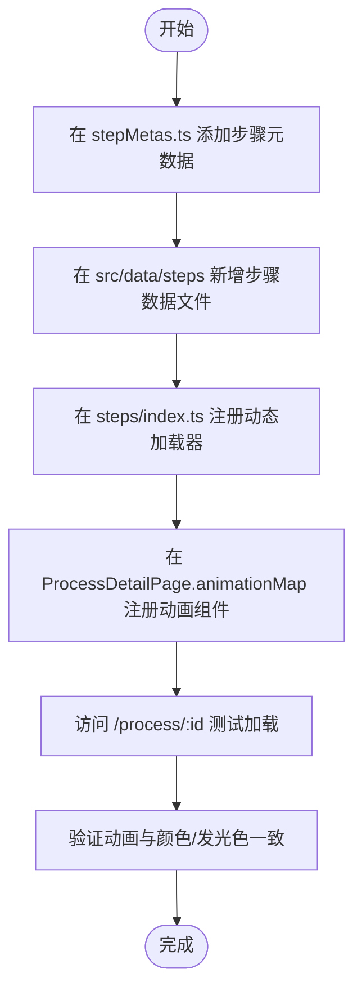
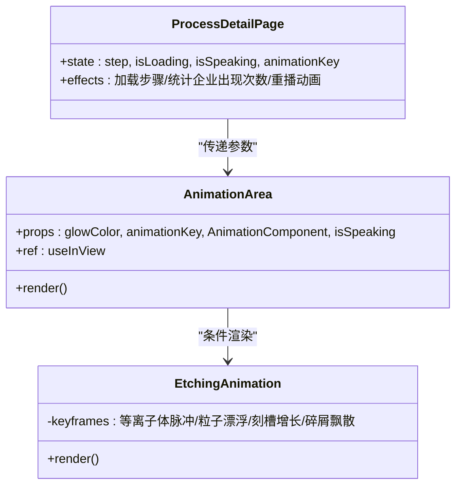
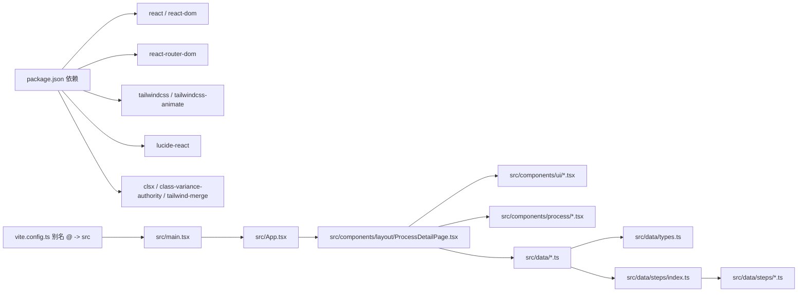

# 扩展开发

<cite>
**本文引用的文件**
- [package.json](file://package.json)
- [vite.config.ts](file://vite.config.ts)
- [tailwind.config.ts](file://tailwind.config.ts)
- [src/index.css](file://src/index.css)
- [src/main.tsx](file://src/main.tsx)
- [src/App.tsx](file://src/App.tsx)
- [src/data/types.ts](file://src/data/types.ts)
- [src/data/processes.ts](file://src/data/processes.ts)
- [src/data/stepMetas.ts](file://src/data/stepMetas.ts)
- [src/data/steps/index.ts](file://src/data/steps/index.ts)
- [src/data/steps/etching.ts](file://src/data/steps/etching.ts)
- [src/data/steps/ion-implantation.ts](file://src/data/steps/ion-implantation.ts)
- [src/components/layout/ProcessDetailPage.tsx](file://src/components/layout/ProcessDetailPage.tsx)
- [src/components/ui/AnimationArea.tsx](file://src/components/ui/AnimationArea.tsx)
- [src/components/ui/ProgressBar.tsx](file://src/components/ui/ProgressBar.tsx)
- [src/components/process/Etching.tsx](file://src/components/process/Etching.tsx)
- [src/hooks/useSpeech.ts](file://src/hooks/useSpeech.ts)
- [src/lib/utils.ts](file://src/lib/utils.ts)
</cite>

## 目录
1. [简介](#简介)
2. [项目结构](#项目结构)
3. [核心组件](#核心组件)
4. [架构总览](#架构总览)
5. [详细组件分析](#详细组件分析)
6. [依赖关系分析](#依赖关系分析)
7. [性能考量](#性能考量)
8. [故障排查指南](#故障排查指南)
9. [结论](#结论)
10. [附录](#附录)

## 简介
本指南面向希望为“芯片制造演示”项目进行扩展开发的工程师，涵盖以下主题：
- 新增工艺步骤与扩展数据模型的标准流程
- 组件开发的标准化流程与最佳实践
- 动画效果的集成方法与SVG动画开发技巧
- 主题定制与样式扩展的指导
- 国际化支持的实现与多语言配置思路
- API扩展与第三方集成的方法
- 插件系统的开发与使用建议
- 功能扩展的完整开发流程与质量保证措施

## 项目结构
该项目采用基于功能域的组织方式，前端由 Vite + React + TypeScript 构建，样式使用 TailwindCSS，并通过别名简化路径引用。

图表来源
- [src/main.tsx:1-11](file://src/main.tsx#L1-L11)
- [src/App.tsx:1-23](file://src/App.tsx#L1-L23)
- [src/components/layout/ProcessDetailPage.tsx:1-397](file://src/components/layout/ProcessDetailPage.tsx#L1-L397)
- [src/data/steps/index.ts:1-34](file://src/data/steps/index.ts#L1-L34)
- [src/data/types.ts:1-33](file://src/data/types.ts#L1-L33)
- [src/data/stepMetas.ts:1-103](file://src/data/stepMetas.ts#L1-L103)
- [src/index.css:1-142](file://src/index.css#L1-L142)
- [tailwind.config.ts:1-143](file://tailwind.config.ts#L1-L143)
- [vite.config.ts:1-13](file://vite.config.ts#L1-L13)

章节来源
- [package.json:1-45](file://package.json#L1-L45)
- [vite.config.ts:1-13](file://vite.config.ts#L1-L13)
- [tailwind.config.ts:1-143](file://tailwind.config.ts#L1-L143)
- [src/index.css:1-142](file://src/index.css#L1-L142)
- [src/main.tsx:1-11](file://src/main.tsx#L1-L11)
- [src/App.tsx:1-23](file://src/App.tsx#L1-L23)

## 核心组件
- 数据模型与加载
  - 类型定义：Company、ProcessSubStep、ProcessStep
  - 步骤元数据：processStepMetas 提供步骤图标、颜色、描述等静态信息
  - 动态加载：steps/index.ts 使用动态 import 按需加载各步骤详情
- 页面与导航
  - ProcessDetailPage 负责加载步骤详情、进度条、动画区域、企业卡片、前后步导航
  - ProgressBar 基于步骤元数据渲染进度与步骤指示器
- 动画与交互
  - AnimationArea 将动画组件与“正在朗读”状态结合，支持渐变背景与入场检测
  - EtchingAnimation 等 SVG 动画组件展示刻蚀过程的关键要素
  - useSpeech 提供中文语音合成与偏好记忆
- 样式与主题
  - Tailwind 主题扩展了 chip.* 颜色与一组 keyframes/animation
  - CSS 变量集中定义在 :root，支持暗色模式与渐变、阴影等

章节来源
- [src/data/types.ts:1-33](file://src/data/types.ts#L1-L33)
- [src/data/stepMetas.ts:1-103](file://src/data/stepMetas.ts#L1-L103)
- [src/data/steps/index.ts:1-34](file://src/data/steps/index.ts#L1-L34)
- [src/components/layout/ProcessDetailPage.tsx:1-397](file://src/components/layout/ProcessDetailPage.tsx#L1-L397)
- [src/components/ui/ProgressBar.tsx:1-60](file://src/components/ui/ProgressBar.tsx#L1-L60)
- [src/components/ui/AnimationArea.tsx:1-29](file://src/components/ui/AnimationArea.tsx#L1-L29)
- [src/components/process/Etching.tsx:1-139](file://src/components/process/Etching.tsx#L1-L139)
- [src/hooks/useSpeech.ts:1-135](file://src/hooks/useSpeech.ts#L1-L135)
- [tailwind.config.ts:18-136](file://tailwind.config.ts#L18-L136)
- [src/index.css:5-57](file://src/index.css#L5-L57)

## 架构总览
系统采用“数据驱动 + 组件解耦”的架构：
- 数据层：types.ts 定义结构，stepMetas.ts 提供静态元信息，steps/index.ts 提供异步加载
- 视图层：页面组件负责组合 UI 组件与动画组件，根据路由参数动态渲染
- 动画层：每个工艺步骤对应独立的 SVG 动画组件，通过 AnimationArea 控制显示与重播
- 交互层：useSpeech 提供语音朗读，ProgressBar 支持步骤导航

图表来源
- [src/components/layout/ProcessDetailPage.tsx:36-117](file://src/components/layout/ProcessDetailPage.tsx#L36-L117)
- [src/data/steps/index.ts:16-21](file://src/data/steps/index.ts#L16-L21)
- [src/components/ui/AnimationArea.tsx:11-28](file://src/components/ui/AnimationArea.tsx#L11-L28)
- [src/hooks/useSpeech.ts:74-112](file://src/hooks/useSpeech.ts#L74-L112)

## 详细组件分析

### 新增工艺步骤与扩展数据模型
- 步骤元数据扩展
  - 在 stepMetas.ts 中新增一条 ProcessStepMeta，设置 id、名称、图标、颜色与发光色
- 步骤详情扩展
  - 在 src/data/steps 下新增步骤文件，导出符合 ProcessStep 的对象
  - 在 steps/index.ts 的映射表中注册该步骤的动态加载器
- 页面与动画联动
  - 在 ProcessDetailPage 的 animationMap 中加入该步骤对应的动画组件
  - 若无专用动画，可传入 null，AnimationArea 会安全处理
- 数据加载与回放
  - ProcessDetailPage 会在路由变化时重置动画 key，确保每次进入都重新渲染动画

图表来源
- [src/data/stepMetas.ts:11-102](file://src/data/stepMetas.ts#L11-L102)
- [src/data/steps/index.ts:3-14](file://src/data/steps/index.ts#L3-L14)
- [src/components/layout/ProcessDetailPage.tsx:23-34](file://src/components/layout/ProcessDetailPage.tsx#L23-L34)

章节来源
- [src/data/stepMetas.ts:1-103](file://src/data/stepMetas.ts#L1-L103)
- [src/data/steps/index.ts:1-34](file://src/data/steps/index.ts#L1-L34)
- [src/components/layout/ProcessDetailPage.tsx:1-397](file://src/components/layout/ProcessDetailPage.tsx#L1-L397)

### 组件开发标准化流程与最佳实践
- 文件命名与目录规范
  - 步骤动画组件统一放置于 src/components/process/，文件名与步骤 id 对齐
  - UI 组件放置于 src/components/ui/，遵循单一职责
- 组件接口设计
  - 动画组件接收父组件传递的 glowColor、animationKey、isSpeaking 等参数
  - 使用 useMemo 缓存派生数据（如 companyMap）
- 性能优化
  - 使用动态 import 按需加载步骤详情与动画组件
  - 通过重置 animationKey 触发动画重播，避免状态残留
  - 使用 useInView 控制动画区域可见性，减少不必要的渲染
- 错误处理
  - 当找不到步骤元数据时，页面返回“未找到该工艺步骤”的提示
  - 加载中显示骨架与加载动画，提升用户体验

章节来源
- [src/components/ui/AnimationArea.tsx:1-29](file://src/components/ui/AnimationArea.tsx#L1-L29)
- [src/components/layout/ProcessDetailPage.tsx:46-49](file://src/components/layout/ProcessDetailPage.tsx#L46-L49)
- [src/components/layout/ProcessDetailPage.tsx:94-98](file://src/components/layout/ProcessDetailPage.tsx#L94-L98)
- [src/components/layout/ProcessDetailPage.tsx:118-127](file://src/components/layout/ProcessDetailPage.tsx#L118-L127)

### 动画效果集成方法与SVG动画开发技巧
- 动画容器与触发
  - AnimationArea 通过 useInView 判定可视区域，仅在进入视口时渲染动画组件
  - 通过 glowColor 设置径向渐变背景，营造“发光”氛围
- SVG 动画要点
  - 使用 <style> 内联 keyframes，定义粒子浮动、离子轰击、刻槽增长、碎屑飘散等动画
  - 使用 CSS 变量与动画延迟实现“波浪式”同步效果
  - 使用 clipPath、transform-origin 实现刻槽逐步加深等视觉反馈
- 重播与控制
  - 通过 animationKey 变更强制重新挂载动画组件，确保从初始状态开始
  - 结合 useSpeech 的结束事件自动清理“正在朗读”状态

图表来源
- [src/components/ui/AnimationArea.tsx:11-28](file://src/components/ui/AnimationArea.tsx#L11-L28)
- [src/components/process/Etching.tsx:1-139](file://src/components/process/Etching.tsx#L1-L139)
- [src/components/layout/ProcessDetailPage.tsx:36-117](file://src/components/layout/ProcessDetailPage.tsx#L36-L117)

章节来源
- [src/components/ui/AnimationArea.tsx:1-29](file://src/components/ui/AnimationArea.tsx#L1-L29)
- [src/components/process/Etching.tsx:1-139](file://src/components/process/Etching.tsx#L1-L139)
- [src/components/layout/ProcessDetailPage.tsx:170-206](file://src/components/layout/ProcessDetailPage.tsx#L170-L206)

### 主题定制与样式扩展
- CSS 变量与暗色模式
  - 在 :root 中集中定义背景、前景、卡片、输入、环形、边框等变量
  - 通过 .dark 类切换明暗主题
- Tailwind 扩展
  - colors.chip.* 定义芯片相关配色（青、蓝、紫、绿、金、辉光）
  - keyframes 与 animation 定义了多种动效（脉冲、滑入、浮动、波纹、粒子上升等）
- 样式复用
  - 使用 cn(...) 合并类名，确保样式覆盖顺序正确
  - 通过 CSS 变量与内联 style 将步骤色系注入到组件中

章节来源
- [src/index.css:5-57](file://src/index.css#L5-L57)
- [tailwind.config.ts:18-136](file://tailwind.config.ts#L18-L136)
- [src/lib/utils.ts:1-7](file://src/lib/utils.ts#L1-L7)
- [src/components/layout/ProcessDetailPage.tsx:163-170](file://src/components/layout/ProcessDetailPage.tsx#L163-L170)

### 国际化支持与多语言配置
- 现状
  - 步骤标题与描述包含中英文字段（name、nameEn、description、detail、narration）
  - 进度条与步骤指示器使用中文名称
- 建议
  - 在数据层保留 nameEn、descriptionEn 等字段，便于后续切换语言
  - 在 UI 层增加语言切换开关，根据当前语言决定显示 name 或 nameEn
  - 语音合成默认使用 zh-CN，若需要其他语言，可在 useSpeech 中扩展

章节来源
- [src/data/types.ts:19-32](file://src/data/types.ts#L19-L32)
- [src/data/steps/etching.ts:4-8](file://src/data/steps/etching.ts#L4-L8)
- [src/data/steps/ion-implantation.ts:4-8](file://src/data/steps/ion-implantation.ts#L4-L8)
- [src/hooks/useSpeech.ts:84](file://src/hooks/useSpeech.ts#L84)

### API 扩展与第三方集成
- Web Speech API
  - useSpeech 封装了语音合成、偏好记忆、可用语音排序等功能
  - 支持在组件中直接调用 speak/stop，并监听结束事件
- 外部资源
  - 项目依赖 lucide-react 提供图标，可按需引入
  - 可通过插件机制接入其他第三方库（见“插件系统”）

章节来源
- [src/hooks/useSpeech.ts:64-135](file://src/hooks/useSpeech.ts#L64-L135)
- [package.json:15-24](file://package.json#L15-L24)

### 插件系统开发与使用
- 动态加载与模块化
  - steps/index.ts 使用动态 import 实现按需加载，天然具备“插件化”能力
  - 新增步骤只需在映射表中注册，无需修改主流程
- 动画插件
  - AnimationArea 作为通用容器，接收任意动画组件，便于扩展新的工艺动画
- 建议
  - 将“步骤元数据 + 详情 + 动画组件 + 企业卡片”视为一个“插件包”，统一管理
  - 为每个插件包提供测试入口，确保集成稳定

章节来源
- [src/data/steps/index.ts:16-33](file://src/data/steps/index.ts#L16-L33)
- [src/components/ui/AnimationArea.tsx:11-28](file://src/components/ui/AnimationArea.tsx#L11-L28)

## 依赖关系分析

图表来源
- [package.json:15-42](file://package.json#L15-L42)
- [vite.config.ts:7-11](file://vite.config.ts#L7-L11)
- [src/main.tsx:1-11](file://src/main.tsx#L1-L11)
- [src/App.tsx:1-23](file://src/App.tsx#L1-L23)
- [src/components/layout/ProcessDetailPage.tsx:1-397](file://src/components/layout/ProcessDetailPage.tsx#L1-L397)
- [src/data/steps/index.ts:1-34](file://src/data/steps/index.ts#L1-L34)

章节来源
- [package.json:1-45](file://package.json#L1-L45)
- [vite.config.ts:1-13](file://vite.config.ts#L1-L13)

## 性能考量
- 懒加载与分块
  - 动态 import 将步骤详情与动画组件拆分为独立模块，降低首屏体积
- 渲染优化
  - useInView 仅在可见时渲染动画，减少不必要的 SVG 渲染
  - 通过 animationKey 重置强制重新挂载，避免动画状态污染
- 语音性能
  - 优先选择本地服务、神经音色的语音，减少网络抖动影响
  - 在语音未就绪时等待 onvoiceschanged 事件，避免失败重试

章节来源
- [src/data/steps/index.ts:16-21](file://src/data/steps/index.ts#L16-L21)
- [src/components/ui/AnimationArea.tsx:11-12](file://src/components/ui/AnimationArea.tsx#L11-L12)
- [src/components/layout/ProcessDetailPage.tsx:94-98](file://src/components/layout/ProcessDetailPage.tsx#L94-L98)
- [src/hooks/useSpeech.ts:95-104](file://src/hooks/useSpeech.ts#L95-L104)

## 故障排查指南
- 无法加载步骤详情
  - 检查 steps/index.ts 是否注册了对应 id 的动态加载器
  - 确认步骤数据文件是否导出标准 ProcessStep 对象
- 动画不显示
  - 确认 AnimationArea 的 isInView 为 true（阈值为 0.1）
  - 检查 animationKey 是否被重置，确保组件重新挂载
- 语音无法播放
  - 浏览器是否支持 Web Speech API
  - 确认 zh-CN 语音可用，必要时手动设置首选语音
- 样式异常
  - 检查 :root 变量是否生效，Tailwind 主题扩展是否正确
  - 确认 cn(...) 合并顺序，避免被覆盖

章节来源
- [src/data/steps/index.ts:3-14](file://src/data/steps/index.ts#L3-L14)
- [src/components/ui/AnimationArea.tsx:11-28](file://src/components/ui/AnimationArea.tsx#L11-L28)
- [src/hooks/useSpeech.ts:74-112](file://src/hooks/useSpeech.ts#L74-L112)
- [src/index.css:5-57](file://src/index.css#L5-L57)
- [tailwind.config.ts:18-136](file://tailwind.config.ts#L18-L136)

## 结论
本项目通过清晰的数据模型、模块化的组件与可扩展的动画系统，提供了良好的扩展基础。新增工艺步骤只需在数据层与映射层注册，即可无缝接入页面与动画系统。借助 Tailwind 主题与 CSS 变量，样式扩展与主题定制变得简单直观。未来可在国际化、第三方集成与插件化方面进一步完善，以满足更复杂的业务场景。

## 附录
- 开发流程清单
  - 在 stepMetas.ts 添加步骤元数据
  - 在 src/data/steps 新增步骤数据文件
  - 在 steps/index.ts 注册动态加载器
  - 在 ProcessDetailPage.animationMap 注册动画组件
  - 在 ProcessDetailPage 中处理加载状态与错误提示
  - 使用 AnimationArea 集成动画与“正在朗读”状态
  - 通过 cn(...) 与 CSS 变量注入步骤色系
  - 使用 useSpeech 提供语音朗读与偏好记忆
- 质量保证
  - 单元测试：为数据加载器与 UI 组合逻辑编写测试
  - 端到端测试：模拟用户操作（切换步骤、播放/停止语音、重播动画）
  - 性能测试：监控首屏体积、动画帧率与语音加载耗时
  - 兼容性测试：不同浏览器与系统语音的可用性