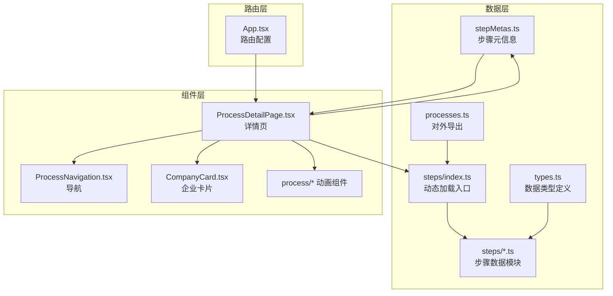
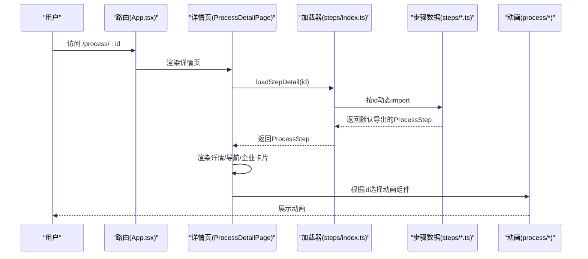
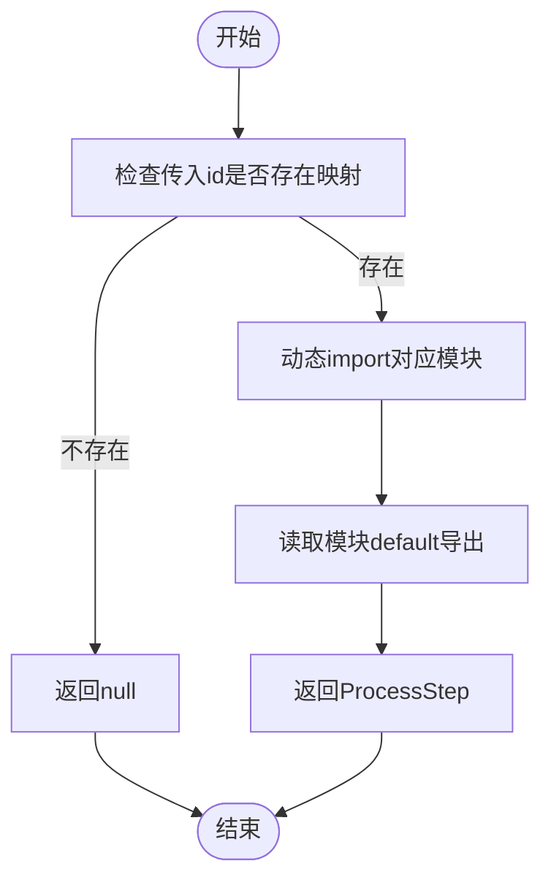
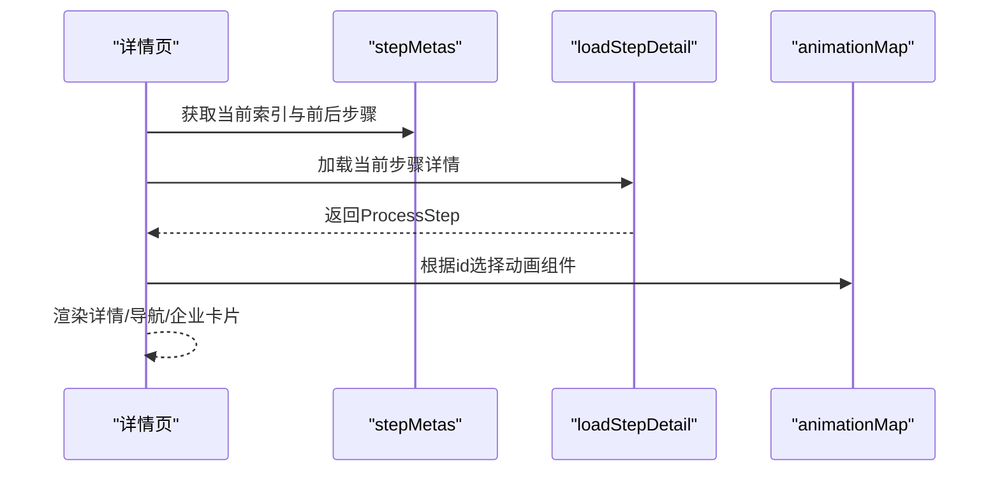
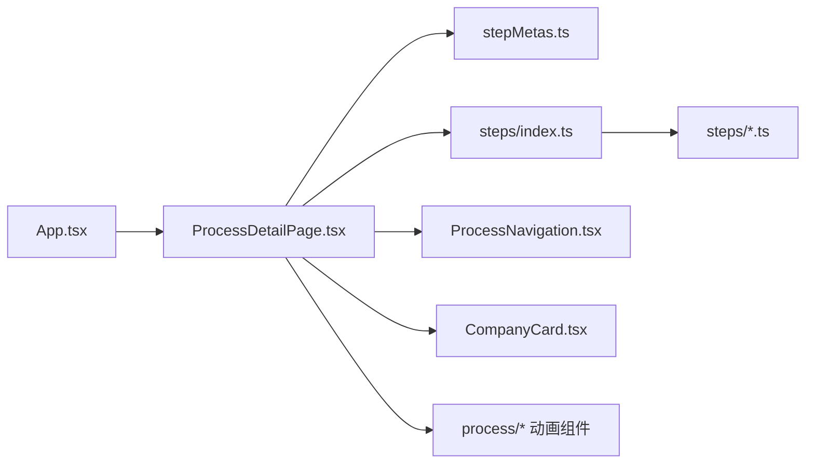

# 新增工艺步骤

<cite>
**本文引用的文件**
- [src/data/types.ts](file://src/data/types.ts)
- [src/data/stepMetas.ts](file://src/data/stepMetas.ts)
- [src/data/steps/index.ts](file://src/data/steps/index.ts)
- [src/data/processes.ts](file://src/data/processes.ts)
- [src/data/steps/silicon-purification.ts](file://src/data/steps/silicon-purification.ts)
- [src/data/steps/etching.ts](file://src/data/steps/etching.ts)
- [src/data/steps/metallization.ts](file://src/data/steps/metallization.ts)
- [src/data/steps/photolithography.ts](file://src/data/steps/photolithography.ts)
- [src/components/layout/ProcessDetailPage.tsx](file://src/components/layout/ProcessDetailPage.tsx)
- [src/components/ui/CompanyCard.tsx](file://src/components/ui/CompanyCard.tsx)
- [src/components/ui/ProcessNavigation.tsx](file://src/components/ui/ProcessNavigation.tsx)
- [src/components/process/SiliconPurification.tsx](file://src/components/process/SiliconPurification.tsx)
- [src/components/process/WaferManufacturing.tsx](file://src/components/process/WaferManufacturing.tsx)
- [src/App.tsx](file://src/App.tsx)
</cite>

## 目录
1. [简介](#简介)
2. [项目结构](#项目结构)
3. [核心组件](#核心组件)
4. [架构总览](#架构总览)
5. [详细组件分析](#详细组件分析)
6. [依赖关系分析](#依赖关系分析)
7. [性能考量](#性能考量)
8. [故障排查指南](#故障排查指南)
9. [结论](#结论)
10. [附录：新增步骤完整流程](#附录新增步骤完整流程)

## 简介
本指南面向希望在芯片制造演示项目中新增一个“工艺步骤”的开发者，提供从数据模型定义、步骤元信息配置、动态加载机制，到UI组件实现与导航集成的完整流程。文档基于现有代码库的结构与实现模式，给出可复用的最佳实践，确保新增步骤能无缝融入主流程并保持一致的用户体验。

## 项目结构
项目采用按功能域划分的目录组织方式：
- 数据层：类型定义、步骤元信息、步骤数据模块与动态加载入口
- 组件层：页面组件、通用UI组件、具体工艺动画组件
- 路由层：应用路由配置

图表来源
- [src/App.tsx:1-23](file://src/App.tsx#L1-L23)
- [src/components/layout/ProcessDetailPage.tsx:1-397](file://src/components/layout/ProcessDetailPage.tsx#L1-L397)
- [src/data/stepMetas.ts:1-103](file://src/data/stepMetas.ts#L1-L103)
- [src/data/steps/index.ts:1-34](file://src/data/steps/index.ts#L1-L34)
- [src/data/types.ts:1-33](file://src/data/types.ts#L1-L33)
- [src/data/processes.ts:1-3](file://src/data/processes.ts#L1-L3)

章节来源
- [src/App.tsx:1-23](file://src/App.tsx#L1-L23)
- [src/components/layout/ProcessDetailPage.tsx:1-397](file://src/components/layout/ProcessDetailPage.tsx#L1-L397)
- [src/data/stepMetas.ts:1-103](file://src/data/stepMetas.ts#L1-L103)
- [src/data/steps/index.ts:1-34](file://src/data/steps/index.ts#L1-L34)
- [src/data/types.ts:1-33](file://src/data/types.ts#L1-L33)
- [src/data/processes.ts:1-3](file://src/data/processes.ts#L1-L3)

## 核心组件
- 数据模型与类型
  - ProcessStep：描述一个工艺步骤的完整数据模型，包含标识、名称、描述、细节、子步骤、讲解文案、图标、颜色、关键指标、涉及企业等字段。
  - ProcessSubStep：子步骤条目，包含标题、描述与企业引用。
  - Company：参与该步骤的相关企业信息。
- 步骤元信息
  - ProcessStepMeta：用于导航与进度展示的轻量元信息，包含步骤标识、中英文名、描述、图标与颜色。
- 动态加载模块
  - steps/index.ts：维护步骤ID到异步模块加载函数的映射，并提供按ID加载单个步骤与批量加载所有步骤的方法。
- 页面与UI
  - ProcessDetailPage：负责根据URL参数加载步骤详情、渲染动画、导航、企业卡片等。
  - ProcessNavigation：前后步骤导航。
  - CompanyCard：企业卡片展示与分组。

章节来源
- [src/data/types.ts:19-32](file://src/data/types.ts#L19-L32)
- [src/data/stepMetas.ts:1-103](file://src/data/stepMetas.ts#L1-L103)
- [src/data/steps/index.ts:1-34](file://src/data/steps/index.ts#L1-L34)
- [src/components/layout/ProcessDetailPage.tsx:1-397](file://src/components/layout/ProcessDetailPage.tsx#L1-L397)
- [src/components/ui/ProcessNavigation.tsx:1-67](file://src/components/ui/ProcessNavigation.tsx#L1-L67)
- [src/components/ui/CompanyCard.tsx:1-159](file://src/components/ui/CompanyCard.tsx#L1-L159)

## 架构总览
新增步骤的端到端流程如下：
- 在数据层定义步骤数据模块，并将其加入动态加载映射。
- 在步骤元信息中注册该步骤，以便导航与进度显示。
- 在详情页中根据URL参数动态加载步骤详情并渲染。
- 可选地添加对应动画组件并在详情页中按步骤ID映射显示。

图表来源
- [src/App.tsx:1-23](file://src/App.tsx#L1-L23)
- [src/components/layout/ProcessDetailPage.tsx:1-397](file://src/components/layout/ProcessDetailPage.tsx#L1-L397)
- [src/data/steps/index.ts:16-33](file://src/data/steps/index.ts#L16-L33)
- [src/components/process/SiliconPurification.tsx:1-114](file://src/components/process/SiliconPurification.tsx#L1-L114)

## 详细组件分析

### 数据模型与字段说明（ProcessStep）
- 字段含义
  - id：步骤唯一标识，与步骤元信息中的id一致，用于路由与动态加载。
  - name/nameEn：中文与英文名称，用于标题与导航。
  - description：步骤概要描述。
  - detail：详细工艺说明。
  - subSteps：子步骤数组，每个元素含标题、描述与企业引用。
  - narration：语音讲解文本。
  - icon：步骤图标。
  - color/glowColor：主题色与发光色，用于UI高亮。
  - keyMetrics：关键指标集合，用于展示核心参数。
  - companies：参与该步骤的相关企业列表。
- 复杂度与性能
  - 数据结构扁平，查询与渲染均为O(n)遍历，适合前端静态数据。
  - 建议保持字段数量稳定，避免过度嵌套导致渲染开销增加。

章节来源
- [src/data/types.ts:19-32](file://src/data/types.ts#L19-L32)

### 步骤元信息（stepMetas）
- 结构
  - ProcessStepMeta：包含id、name、nameEn、description、icon、color、glowColor。
- 作用
  - 作为导航与进度条的数据源，驱动步骤顺序与高亮。
- 扩展建议
  - 新增步骤时，务必在元信息中添加对应条目，确保导航与进度正常显示。

章节来源
- [src/data/stepMetas.ts:1-103](file://src/data/stepMetas.ts#L1-L103)

### 步骤数据模块（steps/index.ts 与 steps/*.ts）
- 动态加载机制
  - 通过映射表将步骤ID映射到异步模块加载函数，实现按需加载。
  - 提供loadStepDetail(id)与loadAllSteps()两个入口。
- 文件组织
  - 每个步骤对应一个独立TS模块，导出默认的ProcessStep对象。
  - 通过processes.ts统一对外导出加载函数，便于上层组件调用。

图表来源
- [src/data/steps/index.ts:16-33](file://src/data/steps/index.ts#L16-L33)

章节来源
- [src/data/steps/index.ts:1-34](file://src/data/steps/index.ts#L1-L34)
- [src/data/processes.ts:1-3](file://src/data/processes.ts#L1-L3)

### 详情页（ProcessDetailPage）
- 加载与渲染
  - 通过URL参数获取id，调用loadStepDetail(id)加载步骤详情。
  - 同时调用loadAllSteps()统计企业出现次数，用于企业卡片的“出现次数”徽章。
  - 使用animationMap按id选择对应的动画组件。
- 导航与进度
  - 基于stepMetas计算当前索引，生成上一步/下一步链接。
- 语音与动画
  - 支持语音讲解开关与动画重播，切换步骤时重置动画key。

图表来源
- [src/components/layout/ProcessDetailPage.tsx:36-397](file://src/components/layout/ProcessDetailPage.tsx#L36-L397)
- [src/data/stepMetas.ts:1-103](file://src/data/stepMetas.ts#L1-L103)
- [src/data/steps/index.ts:16-33](file://src/data/steps/index.ts#L16-L33)

章节来源
- [src/components/layout/ProcessDetailPage.tsx:1-397](file://src/components/layout/ProcessDetailPage.tsx#L1-L397)

### 企业卡片（CompanyCard）
- 分组展示
  - 按“国际龙头/中国力量/新兴势力”三类分组展示，支持按步骤计数徽章显示。
- 主题适配
  - 使用步骤主题色进行高亮与阴影效果，保证视觉一致性。

章节来源
- [src/components/ui/CompanyCard.tsx:1-159](file://src/components/ui/CompanyCard.tsx#L1-L159)

### 导航组件（ProcessNavigation）
- 上一步/下一步跳转
  - 若存在前后步骤则跳转，否则回首页或显示完成状态。

章节来源
- [src/components/ui/ProcessNavigation.tsx:1-67](file://src/components/ui/ProcessNavigation.tsx#L1-L67)

### 动画组件（process/*）
- 每个步骤可选配一个SVG动画组件，通过animationMap在详情页中按id映射显示。
- 示例：硅提纯、晶圆制造等动画组件均已实现。

章节来源
- [src/components/process/SiliconPurification.tsx:1-114](file://src/components/process/SiliconPurification.tsx#L1-L114)
- [src/components/process/WaferManufacturing.tsx:1-122](file://src/components/process/WaferManufacturing.tsx#L1-L122)

## 依赖关系分析
- 组件耦合
  - ProcessDetailPage依赖stepMetas、steps动态加载器、动画组件映射、导航与企业卡片组件。
  - steps/index.ts与各步骤数据模块之间为弱耦合（通过ID映射），便于扩展。
- 外部依赖
  - 路由：React Router（App.tsx）
  - 图标：Lucide（ProcessNavigation）
  - 语音：浏览器SpeechSynthesis（ProcessDetailPage）

图表来源
- [src/App.tsx:1-23](file://src/App.tsx#L1-L23)
- [src/components/layout/ProcessDetailPage.tsx:1-397](file://src/components/layout/ProcessDetailPage.tsx#L1-L397)
- [src/data/steps/index.ts:1-34](file://src/data/steps/index.ts#L1-L34)
- [src/data/stepMetas.ts:1-103](file://src/data/stepMetas.ts#L1-L103)
- [src/components/ui/ProcessNavigation.tsx:1-67](file://src/components/ui/ProcessNavigation.tsx#L1-L67)
- [src/components/ui/CompanyCard.tsx:1-159](file://src/components/ui/CompanyCard.tsx#L1-L159)

章节来源
- [src/App.tsx:1-23](file://src/App.tsx#L1-L23)
- [src/components/layout/ProcessDetailPage.tsx:1-397](file://src/components/layout/ProcessDetailPage.tsx#L1-L397)
- [src/data/steps/index.ts:1-34](file://src/data/steps/index.ts#L1-L34)
- [src/data/stepMetas.ts:1-103](file://src/data/stepMetas.ts#L1-L103)
- [src/components/ui/ProcessNavigation.tsx:1-67](file://src/components/ui/ProcessNavigation.tsx#L1-L67)
- [src/components/ui/CompanyCard.tsx:1-159](file://src/components/ui/CompanyCard.tsx#L1-L159)

## 性能考量
- 动态加载
  - 通过异步import实现按需加载，减少首屏体积与初次渲染压力。
- 并发加载
  - loadAllSteps使用Promise.all并发加载所有步骤，提高统计与渲染效率。
- 渲染优化
  - 详情页在步骤切换时重置动画key与停止语音，避免资源泄漏与状态错乱。
- 数据规模
  - 当前数据为静态JSON结构，适合前端直接缓存；若未来数据体量增大，可考虑分片或服务端渲染。

章节来源
- [src/data/steps/index.ts:23-33](file://src/data/steps/index.ts#L23-L33)
- [src/components/layout/ProcessDetailPage.tsx:69-108](file://src/components/layout/ProcessDetailPage.tsx#L69-L108)

## 故障排查指南
- 新增步骤后无法显示
  - 检查是否在steps/index.ts中添加了ID到模块的映射。
  - 检查是否在stepMetas.ts中添加了对应元信息。
  - 检查步骤数据模块是否导出默认的ProcessStep对象。
- 动画不显示
  - 检查animationMap中是否映射了该步骤ID。
  - 确认动画组件文件命名与ID一致。
- 语音不工作
  - 确认浏览器允许语音合成权限。
  - 检查narration字段是否为空。
- 导航异常
  - 确认URL参数id与stepMetas中的id一致。

章节来源
- [src/data/steps/index.ts:1-34](file://src/data/steps/index.ts#L1-L34)
- [src/data/stepMetas.ts:1-103](file://src/data/stepMetas.ts#L1-L103)
- [src/components/layout/ProcessDetailPage.tsx:1-397](file://src/components/layout/ProcessDetailPage.tsx#L1-L397)

## 结论
通过遵循本文提供的流程与最佳实践，新增一个工艺步骤可以在不破坏现有架构的前提下快速集成。关键在于：
- 在数据层定义符合ProcessStep规范的模块；
- 在steps/index.ts中注册动态加载映射；
- 在stepMetas.ts中补充元信息；
- 在详情页中按ID映射动画组件；
- 使用统一的UI组件保证体验一致性。

## 附录：新增步骤完整流程
- 第一步：定义数据模型
  - 在src/data/steps目录新增步骤数据模块，导出默认的ProcessStep对象。
  - 参考现有模块结构：[src/data/steps/silicon-purification.ts:1-121](file://src/data/steps/silicon-purification.ts#L1-L121)、[src/data/steps/etching.ts:1-142](file://src/data/steps/etching.ts#L1-L142)、[src/data/steps/metallization.ts:1-142](file://src/data/steps/metallization.ts#L1-L142)、[src/data/steps/photolithography.ts:1-152](file://src/data/steps/photolithography.ts#L1-L152)
- 第二步：注册动态加载
  - 在src/data/steps/index.ts中添加ID到模块的映射项。
  - 确保导出loadStepDetail与loadAllSteps可用。
- 第三步：补充步骤元信息
  - 在src/data/stepMetas.ts中添加对应的ProcessStepMeta条目。
- 第四步：可选：添加动画组件
  - 在src/components/process目录新增对应SVG动画组件。
  - 在src/components/layout/ProcessDetailPage.tsx的animationMap中添加ID到组件的映射。
- 第五步：验证与测试
  - 访问 /process/:id，确认详情、导航、动画、企业卡片均正常显示。
  - 切换步骤，验证语音与动画重播行为。

章节来源
- [src/data/steps/index.ts:1-34](file://src/data/steps/index.ts#L1-L34)
- [src/data/stepMetas.ts:1-103](file://src/data/stepMetas.ts#L1-L103)
- [src/components/layout/ProcessDetailPage.tsx:23-34](file://src/components/layout/ProcessDetailPage.tsx#L23-L34)
- [src/data/steps/silicon-purification.ts:1-121](file://src/data/steps/silicon-purification.ts#L1-L121)
- [src/data/steps/etching.ts:1-142](file://src/data/steps/etching.ts#L1-L142)
- [src/data/steps/metallization.ts:1-142](file://src/data/steps/metallization.ts#L1-L142)
- [src/data/steps/photolithography.ts:1-152](file://src/data/steps/photolithography.ts#L1-L152)