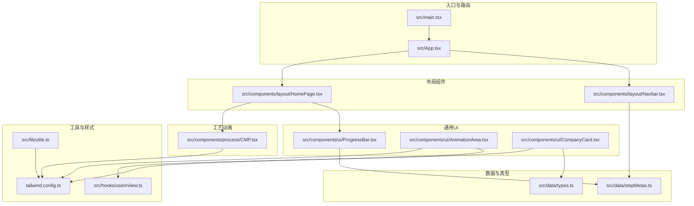
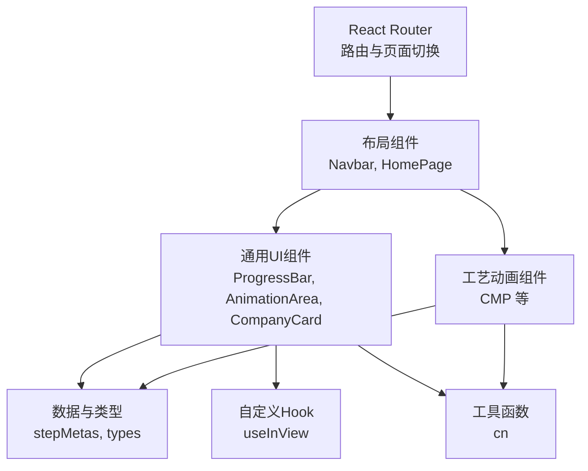
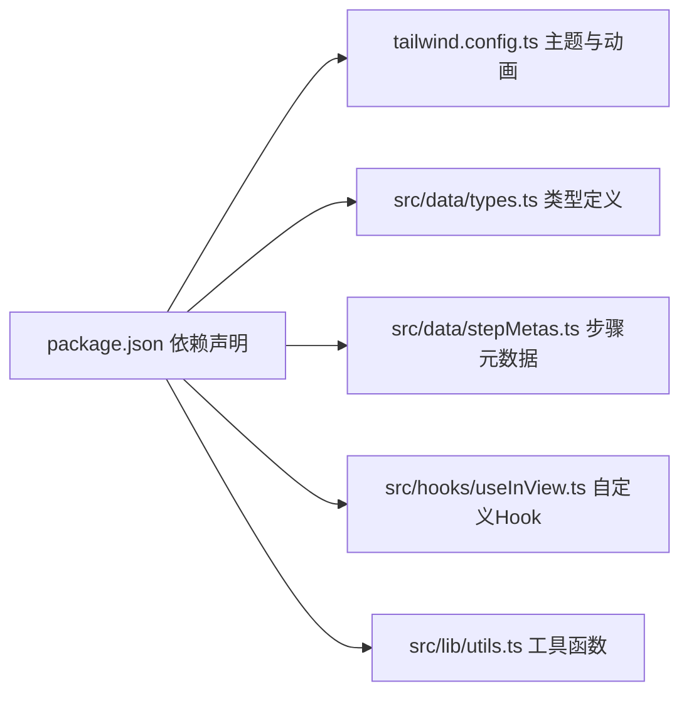

# 组件开发规范

<cite>
**本文引用的文件**
- [src/App.tsx](file://src/App.tsx)
- [src/main.tsx](file://src/main.tsx)
- [tailwind.config.ts](file://tailwind.config.ts)
- [package.json](file://package.json)
- [eslint.config.mjs](file://eslint.config.mjs)
- [src/components/layout/Navbar.tsx](file://src/components/layout/Navbar.tsx)
- [src/components/ui/ProgressBar.tsx](file://src/components/ui/ProgressBar.tsx)
- [src/components/ui/AnimationArea.tsx](file://src/components/ui/AnimationArea.tsx)
- [src/components/ui/CompanyCard.tsx](file://src/components/ui/CompanyCard.tsx)
- [src/components/process/CMP.tsx](file://src/components/process/CMP.tsx)
- [src/components/layout/HomePage.tsx](file://src/components/layout/HomePage.tsx)
- [src/hooks/useInView.ts](file://src/hooks/useInView.ts)
- [src/data/stepMetas.ts](file://src/data/stepMetas.ts)
- [src/data/types.ts](file://src/data/types.ts)
- [src/lib/utils.ts](file://src/lib/utils.ts)
</cite>

## 目录
1. [简介](#简介)
2. [项目结构](#项目结构)
3. [核心组件](#核心组件)
4. [架构总览](#架构总览)
5. [组件详细分析](#组件详细分析)
6. [依赖关系分析](#依赖关系分析)
7. [性能考量](#性能考量)
8. [故障排查指南](#故障排查指南)
9. [结论](#结论)
10. [附录](#附录)

## 简介
本指南面向芯片制造演示项目的前端组件开发，目标是建立统一的设计原则、架构模式与实现规范，确保新增组件在视觉风格、交互体验、可维护性与可扩展性方面与现有系统保持一致。内容涵盖：
- 函数组件编写规范与 Hooks 使用最佳实践
- 组件间通信与数据流策略（props 传递与状态管理）
- UI 组件开发模板与样式规范（Tailwind CSS 与响应式设计）
- 可复用性与模块化组织方式
- 测试策略与质量保障（基于 ESLint、Prettier、TypeScript 的工具链）

## 项目结构
项目采用按功能域分层的目录组织方式：页面布局、具体工艺流程、通用 UI 组件、数据模型与自定义 Hook，以及样式与工具函数。入口应用负责路由与顶层容器，Tailwind 配置提供主题色板、圆角与动画扩展。

图表来源
- [src/main.tsx:1-11](file://src/main.tsx#L1-L11)
- [src/App.tsx:1-23](file://src/App.tsx#L1-L23)
- [src/components/layout/Navbar.tsx:1-82](file://src/components/layout/Navbar.tsx#L1-L82)
- [src/components/layout/HomePage.tsx:1-85](file://src/components/layout/HomePage.tsx#L1-L85)
- [src/components/ui/ProgressBar.tsx:1-60](file://src/components/ui/ProgressBar.tsx#L1-L60)
- [src/components/ui/AnimationArea.tsx:1-29](file://src/components/ui/AnimationArea.tsx#L1-L29)
- [src/components/ui/CompanyCard.tsx:1-159](file://src/components/ui/CompanyCard.tsx#L1-L159)
- [src/components/process/CMP.tsx:1-125](file://src/components/process/CMP.tsx#L1-L125)
- [src/data/stepMetas.ts:1-103](file://src/data/stepMetas.ts#L1-L103)
- [src/data/types.ts:1-33](file://src/data/types.ts#L1-L33)
- [src/hooks/useInView.ts:1-32](file://src/hooks/useInView.ts#L1-L32)
- [src/lib/utils.ts:1-7](file://src/lib/utils.ts#L1-L7)
- [tailwind.config.ts:1-143](file://tailwind.config.ts#L1-L143)

章节来源
- [src/main.tsx:1-11](file://src/main.tsx#L1-L11)
- [src/App.tsx:1-23](file://src/App.tsx#L1-L23)
- [tailwind.config.ts:1-143](file://tailwind.config.ts#L1-L143)

## 核心组件
本节聚焦于关键组件的职责、接口与实现要点，帮助开发者快速理解并遵循统一规范。

- 导航栏组件（Navbar）
  - 职责：提供桌面与移动端导航、高亮当前步骤、跳转至对应工艺页
  - 关键点：使用路由位置判断激活态；移动端抽屉式菜单；图标与渐变高亮
  - 依赖：步骤元数据用于生成导航项
  - 章节来源
    - [src/components/layout/Navbar.tsx:1-82](file://src/components/layout/Navbar.tsx#L1-L82)
    - [src/data/stepMetas.ts:1-103](file://src/data/stepMetas.ts#L1-L103)

- 进度条组件（ProgressBar）
  - 职责：展示当前步骤索引、完成百分比与步骤指示器
  - 关键点：根据当前索引计算进度；步骤指示器支持跳转；图标与文字状态区分
  - 依赖：步骤元数据用于渲染指示器
  - 章节来源
    - [src/components/ui/ProgressBar.tsx:1-60](file://src/components/ui/ProgressBar.tsx#L1-L60)
    - [src/data/stepMetas.ts:1-103](file://src/data/stepMetas.ts#L1-L103)

- 动画区域组件（AnimationArea）
  - 职责：在视口可见时渲染动画组件，并显示语音讲解指示器
  - 关键点：基于自定义 Hook 判断视口可见性；通过 key 触发重新挂载以重置动画
  - 依赖：自定义 Hook 与 Tailwind 主题色
  - 章节来源
    - [src/components/ui/AnimationArea.tsx:1-29](file://src/components/ui/AnimationArea.tsx#L1-L29)
    - [src/hooks/useInView.ts:1-32](file://src/hooks/useInView.ts#L1-L32)

- 企业卡片组件（CompanyCard）
  - 职责：展示企业信息、标签、分类与高亮描述
  - 关键点：按标签映射不同配色与发光效果；支持“多环节”徽标；响应式网格布局
  - 依赖：类型定义与颜色映射
  - 章节来源
    - [src/components/ui/CompanyCard.tsx:1-159](file://src/components/ui/CompanyCard.tsx#L1-L159)
    - [src/data/types.ts:1-33](file://src/data/types.ts#L1-L33)

- CMP 工艺动画（CMP）
  - 职责：以 SVG 展示 CMP 工序的动态效果（抛光垫旋转、抛光液滴落、表面平坦化对比）
  - 关键点：内联样式与动画 keyframes；响应式尺寸；前后对比示意
  - 章节来源
    - [src/components/process/CMP.tsx:1-125](file://src/components/process/CMP.tsx#L1-L125)

- 首页（HomePage）
  - 职责：引导用户进入首个工艺步骤、展示流程图与统计信息
  - 关键点：渐变背景与发光效果；锚点跳转至流程图；统计区块响应式网格
  - 章节来源
    - [src/components/layout/HomePage.tsx:1-85](file://src/components/layout/HomePage.tsx#L1-L85)

- 自定义 Hook（useInView）
  - 职责：监听元素是否进入视口，返回 isInView 与 ref
  - 关键点：支持阈值与根边距配置；清理观察器避免内存泄漏
  - 章节来源
    - [src/hooks/useInView.ts:1-32](file://src/hooks/useInView.ts#L1-L32)

- 工具函数（cn）
  - 职责：合并类名并进行 Tailwind 合并优化
  - 章节来源
    - [src/lib/utils.ts:1-7](file://src/lib/utils.ts#L1-L7)

## 架构总览
应用采用函数组件 + React Router 的前端架构，数据通过 props 在组件树中向下传递，状态集中在需要共享的场景（如导航激活态、视口可见性）。Tailwind 提供原子化样式与主题扩展，配合自定义 Hook 实现可复用的交互逻辑。

图表来源
- [src/App.tsx:1-23](file://src/App.tsx#L1-L23)
- [src/components/layout/Navbar.tsx:1-82](file://src/components/layout/Navbar.tsx#L1-L82)
- [src/components/layout/HomePage.tsx:1-85](file://src/components/layout/HomePage.tsx#L1-L85)
- [src/components/ui/ProgressBar.tsx:1-60](file://src/components/ui/ProgressBar.tsx#L1-L60)
- [src/components/ui/AnimationArea.tsx:1-29](file://src/components/ui/AnimationArea.tsx#L1-L29)
- [src/components/ui/CompanyCard.tsx:1-159](file://src/components/ui/CompanyCard.tsx#L1-L159)
- [src/components/process/CMP.tsx:1-125](file://src/components/process/CMP.tsx#L1-L125)
- [src/data/stepMetas.ts:1-103](file://src/data/stepMetas.ts#L1-L103)
- [src/data/types.ts:1-33](file://src/data/types.ts#L1-L33)
- [src/hooks/useInView.ts:1-32](file://src/hooks/useInView.ts#L1-L32)
- [src/lib/utils.ts:1-7](file://src/lib/utils.ts#L1-L7)

## 组件详细分析

### 设计原则与架构模式
- 函数组件优先：所有组件均采用函数组件，结合 Hooks 管理状态与副作用
- 单向数据流：父组件通过 props 下发数据与回调，子组件不直接修改父状态
- 可复用性：将通用交互逻辑抽象为自定义 Hook（如视口监听），将通用样式抽象为工具函数（类名合并）
- 响应式与无障碍：使用 Tailwind 原子类实现响应式布局；为交互元素提供语义化标签与 ARIA 属性
- 主题一致性：通过 Tailwind 主题变量与扩展动画，保证视觉风格统一

### 函数组件编写规范
- 接口与类型
  - 所有 props 使用 TypeScript 接口定义，明确字段类型与可选性
  - 示例参考：进度条 props、动画区域 props、企业卡片 props
- 渲染结构
  - 使用语义化标签与清晰的层级结构；避免深层嵌套
  - 对外暴露最小必要接口，内部实现细节通过局部状态或私有函数封装
- 性能优化
  - 合理使用 memo 化（如稳定 props）与 key 控制重渲染
  - 将昂贵计算放入 useMemo 或 useCallback，避免重复计算
- 可访问性
  - 为按钮、链接、菜单等提供 aria-* 属性与键盘可达性
  - 图标与图片提供替代文本（aria-label 或 alt）

### Hooks 使用最佳实践
- useInView
  - 适用场景：延迟加载动画、懒渲染、滚动触发动画
  - 注意事项：在组件卸载时自动清理观察器；合理设置阈值与根边距
  - 章节来源
    - [src/hooks/useInView.ts:1-32](file://src/hooks/useInView.ts#L1-L32)

- 自定义 Hook 设计
  - 单一职责：每个 Hook 解决一个问题（如视口监听）
  - 易测试：输入输出明确，便于单元测试
  - 文档化：在注释中说明参数、返回值与使用约束

### 组件间通信与数据流
- 路由驱动的数据流
  - 应用通过路由控制页面切换，页面组件根据路径参数加载对应数据
  - 章节来源
    - [src/App.tsx:1-23](file://src/App.tsx#L1-L23)
- props 传递策略
  - 从布局到 UI：布局组件向通用 UI 传递主题色、当前索引、激活态等
  - 从 UI 到数据：通用 UI 通过 props 消费数据模型（步骤元数据、企业信息）
  - 章节来源
    - [src/components/ui/ProgressBar.tsx:1-60](file://src/components/ui/ProgressBar.tsx#L1-L60)
    - [src/components/ui/AnimationArea.tsx:1-29](file://src/components/ui/AnimationArea.tsx#L1-L29)
    - [src/components/ui/CompanyCard.tsx:1-159](file://src/components/ui/CompanyCard.tsx#L1-L159)
    - [src/data/stepMetas.ts:1-103](file://src/data/stepMetas.ts#L1-L103)
    - [src/data/types.ts:1-33](file://src/data/types.ts#L1-L33)

### UI 组件开发模板与样式规范
- 模板结构
  - 头部/主体/尾部三段式结构，便于扩展与复用
  - 使用容器与间距类实现对齐与留白
- Tailwind 使用方法
  - 使用主题变量与扩展动画，避免硬编码颜色与动画
  - 类名合并使用工具函数，减少冲突与冗余
  - 章节来源
    - [tailwind.config.ts:1-143](file://tailwind.config.ts#L1-L143)
    - [src/lib/utils.ts:1-7](file://src/lib/utils.ts#L1-L7)
- 响应式设计原则
  - 移动优先：先写基础样式，再用断点增强
  - 网格与弹性：使用栅格与 flex 实现自适应布局
  - 交互反馈：hover、focus、active 状态保持一致的过渡与阴影

### 可复用性设计与模块化组织
- 组件拆分
  - 将通用交互（视口监听）抽象为 Hook
  - 将通用样式抽象为工具函数与主题配置
- 文件组织
  - 按功能域划分目录（layout、ui、process），便于查找与维护
- 接口契约
  - 明确 props 与事件回调，保持组件边界清晰

### 代码示例与测试策略
- 示例参考
  - 进度条组件的 props 与渲染逻辑
  - 动画区域组件的视口监听与动画重置
  - 企业卡片组件的标签映射与响应式网格
  - 章节来源
    - [src/components/ui/ProgressBar.tsx:1-60](file://src/components/ui/ProgressBar.tsx#L1-L60)
    - [src/components/ui/AnimationArea.tsx:1-29](file://src/components/ui/AnimationArea.tsx#L1-L29)
    - [src/components/ui/CompanyCard.tsx:1-159](file://src/components/ui/CompanyCard.tsx#L1-L159)

- 测试策略
  - 单元测试：针对纯函数与 Hook 的行为进行断言（如 useInView 的返回值）
  - 集成测试：验证组件在路由与数据上下文中的表现
  - 可访问性测试：使用自动化工具检查 ARIA 属性与键盘可达性
  - 质量工具：基于 ESLint、Prettier、TypeScript 的规则集，统一代码风格与错误预防
  - 章节来源
    - [eslint.config.mjs:1-45](file://eslint.config.mjs#L1-L45)
    - [package.json:1-45](file://package.json#L1-L45)

## 依赖关系分析
- 外部依赖
  - React 生态：React、React Router、Lucide Icons
  - 样式与工具：Tailwind CSS、Tailwind Merge、clsx、tailwindcss-animate
  - 构建与开发：Vite、TypeScript、ESLint、Prettier
- 内部依赖
  - 数据模型与类型：步骤元数据、企业与工艺类型
  - 自定义 Hook：视口监听
  - 工具函数：类名合并
- 章节来源
  - [package.json:1-45](file://package.json#L1-L45)
  - [src/data/stepMetas.ts:1-103](file://src/data/stepMetas.ts#L1-L103)
  - [src/data/types.ts:1-33](file://src/data/types.ts#L1-L33)
  - [src/hooks/useInView.ts:1-32](file://src/hooks/useInView.ts#L1-L32)
  - [src/lib/utils.ts:1-7](file://src/lib/utils.ts#L1-L7)

图表来源
- [package.json:1-45](file://package.json#L1-L45)
- [tailwind.config.ts:1-143](file://tailwind.config.ts#L1-L143)
- [src/data/types.ts:1-33](file://src/data/types.ts#L1-L33)
- [src/data/stepMetas.ts:1-103](file://src/data/stepMetas.ts#L1-L103)
- [src/hooks/useInView.ts:1-32](file://src/hooks/useInView.ts#L1-L32)
- [src/lib/utils.ts:1-7](file://src/lib/utils.ts#L1-L7)

## 性能考量
- 渲染优化
  - 使用稳定的 key 与合理的组件拆分，避免不必要的重渲染
  - 将昂贵的计算放入 useMemo/useCallback，减少重复开销
- 资源加载
  - 动画组件仅在视口可见时渲染，降低初始负载
  - 章节来源
    - [src/components/ui/AnimationArea.tsx:1-29](file://src/components/ui/AnimationArea.tsx#L1-L29)
    - [src/hooks/useInView.ts:1-32](file://src/hooks/useInView.ts#L1-L32)
- 样式体积
  - Tailwind 通过内容扫描按需生成样式，避免引入未使用的类
  - 章节来源
    - [tailwind.config.ts:1-143](file://tailwind.config.ts#L1-L143)

## 故障排查指南
- ESLint 规则
  - 已禁用 JSX 中显式引入 React 的规则，启用 React Hooks 规则，允许 console.warn/error
  - 章节来源
    - [eslint.config.mjs:1-45](file://eslint.config.mjs#L1-L45)
- Prettier 格式化
  - 提供格式化脚本与检查脚本，建议在提交前执行格式化与检查
  - 章节来源
    - [package.json:1-45](file://package.json#L1-L45)
- 常见问题
  - 类名冲突：使用工具函数合并类名，避免重复覆盖
  - 动画不触发：确认元素已进入视口或手动触发重渲染
  - 路由跳转无效：检查路由配置与路径参数是否匹配

## 结论
本规范总结了函数组件的编写原则、数据流与状态管理策略、UI 开发模板与样式规范、可复用性与模块化组织方式，并提供了测试策略与质量保障方案。遵循这些规范有助于新组件与现有系统无缝集成，保持一致的开发标准与用户体验。

## 附录
- 快速检查清单
  - 是否使用 TypeScript 接口定义 props
  - 是否使用自定义 Hook 抽象通用逻辑
  - 是否使用 Tailwind 原子类与主题变量
  - 是否具备无障碍属性与键盘可达性
  - 是否通过 ESLint 与 Prettier 校验
  - 是否在路由与数据上下文中正确工作