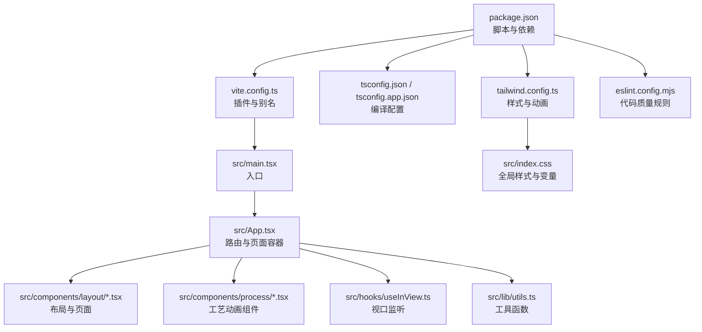
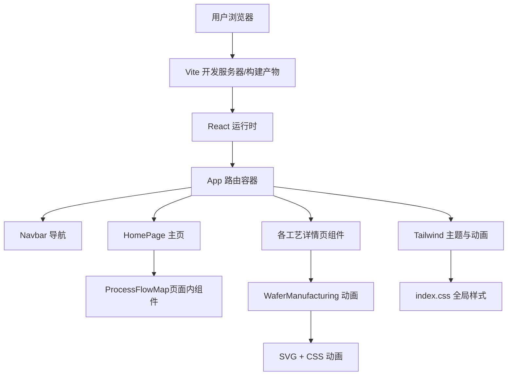
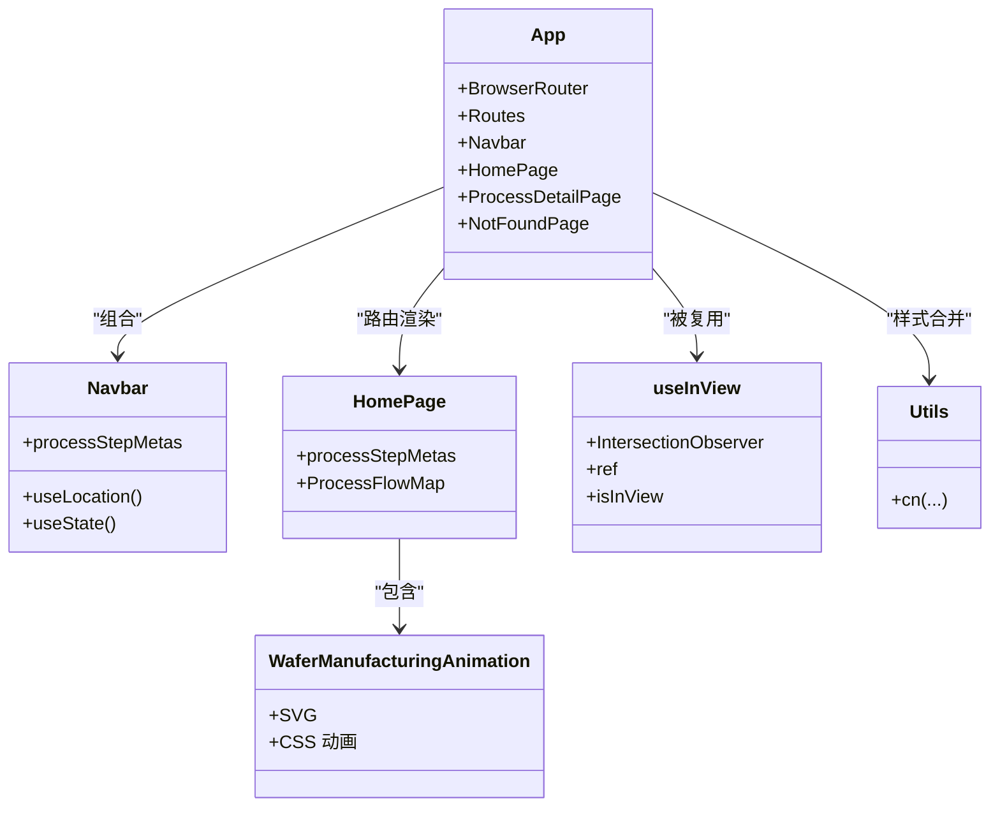
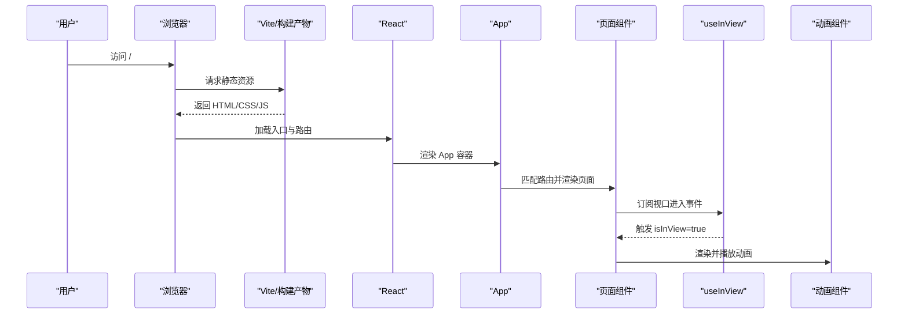
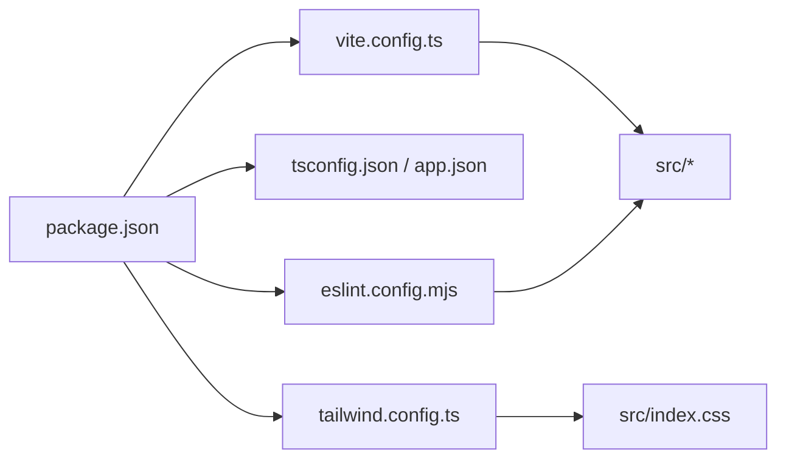
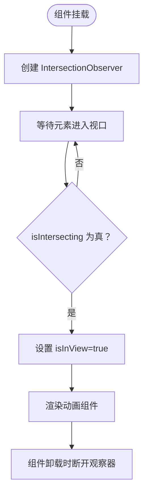
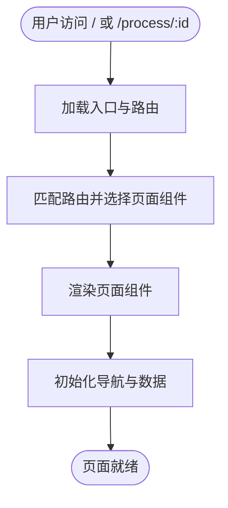

# 故障排除

<cite>
**本文引用的文件**
- [package.json](file://package.json)
- [vite.config.ts](file://vite.config.ts)
- [tsconfig.json](file://tsconfig.json)
- [tsconfig.app.json](file://tsconfig.app.json)
- [tailwind.config.ts](file://tailwind.config.ts)
- [eslint.config.mjs](file://eslint.config.mjs)
- [src/main.tsx](file://src/main.tsx)
- [src/App.tsx](file://src/App.tsx)
- [src/index.css](file://src/index.css)
- [src/lib/utils.ts](file://src/lib/utils.ts)
- [src/hooks/useInView.ts](file://src/hooks/useInView.ts)
- [src/components/layout/Navbar.tsx](file://src/components/layout/Navbar.tsx)
- [src/components/layout/HomePage.tsx](file://src/components/layout/HomePage.tsx)
- [src/components/process/WaferManufacturing.tsx](file://src/components/process/WaferManufacturing.tsx)
- [src/data/types.ts](file://src/data/types.ts)
- [src/data/processes.ts](file://src/data/processes.ts)
</cite>

## 目录
1. [简介](#简介)
2. [项目结构](#项目结构)
3. [核心组件](#核心组件)
4. [架构总览](#架构总览)
5. [详细组件分析](#详细组件分析)
6. [依赖关系分析](#依赖关系分析)
7. [性能考虑](#性能考虑)
8. [故障排除指南](#故障排除指南)
9. [结论](#结论)
10. [附录](#附录)

## 简介
本指南面向芯片制造演示项目的开发者与维护者，聚焦于构建、运行、性能与网络相关问题的系统化排查与修复。内容涵盖：
- 构建错误（TypeScript 编译、Vite 打包、样式生成）
- 运行时错误（路由、组件渲染、动画与交互动画）
- 性能问题（首屏、动画帧率、内存占用）
- 版本兼容性与依赖冲突
- 日志分析与错误追踪策略
- 网络问题与资源加载失败排查
- 预防性措施与快速恢复建议

## 项目结构
该项目采用 Vite + React + TypeScript + TailwindCSS 的现代前端栈，使用路径别名与多配置文件组织工程。关键目录与职责如下：
- src：源代码根目录，按功能分层（components、hooks、lib、data、assets 等）
- vite.config.ts：Vite 插件与路径别名配置
- tsconfig.*：TypeScript 多项目引用配置
- tailwind.config.ts：Tailwind 内容扫描、主题扩展与动画定义
- eslint.config.mjs：ESLint 规则与 Prettier 集成
- package.json：脚本、依赖与版本管理

图表来源
- [package.json:1-45](file://package.json#L1-L45)
- [vite.config.ts:1-13](file://vite.config.ts#L1-L13)
- [tsconfig.json:1-7](file://tsconfig.json#L1-L7)
- [tsconfig.app.json](file://tsconfig.app.json)
- [tailwind.config.ts:1-143](file://tailwind.config.ts#L1-L143)
- [eslint.config.mjs:1-45](file://eslint.config.mjs#L1-L45)
- [src/main.tsx:1-11](file://src/main.tsx#L1-L11)
- [src/App.tsx:1-23](file://src/App.tsx#L1-L23)
- [src/index.css:1-142](file://src/index.css#L1-L142)
- [src/hooks/useInView.ts:1-32](file://src/hooks/useInView.ts#L1-L32)
- [src/lib/utils.ts:1-7](file://src/lib/utils.ts#L1-L7)

章节来源
- [package.json:1-45](file://package.json#L1-L45)
- [vite.config.ts:1-13](file://vite.config.ts#L1-L13)
- [tsconfig.json:1-7](file://tsconfig.json#L1-L7)
- [tailwind.config.ts:1-143](file://tailwind.config.ts#L1-L143)
- [eslint.config.mjs:1-45](file://eslint.config.mjs#L1-L45)
- [src/main.tsx:1-11](file://src/main.tsx#L1-L11)
- [src/App.tsx:1-23](file://src/App.tsx#L1-L23)
- [src/index.css:1-142](file://src/index.css#L1-L142)

## 核心组件
- 应用入口与路由
  - 入口文件负责挂载应用与 StrictMode 包裹
  - App 组件使用 BrowserRouter 提供路由能力，并在根节点注入基础样式
- 布局与页面
  - Navbar 提供桌面/移动端导航，基于路由状态高亮当前步骤
  - HomePage 展示主视觉与流程概览，包含统计信息与跳转
- 动画与交互动画
  - WaferManufacturing.tsx 使用 SVG 与 CSS 动画实现晶圆制造过程的可视化
  - useInView.ts 基于 IntersectionObserver 实现视口进入检测，用于触发动画
- 工具与样式
  - utils.ts 提供类名合并工具
  - index.css 定义主题变量与全局样式；tailwind.config.ts 定义内容扫描范围、颜色与动画

章节来源
- [src/main.tsx:1-11](file://src/main.tsx#L1-L11)
- [src/App.tsx:1-23](file://src/App.tsx#L1-L23)
- [src/components/layout/Navbar.tsx:1-82](file://src/components/layout/Navbar.tsx#L1-L82)
- [src/components/layout/HomePage.tsx:1-85](file://src/components/layout/HomePage.tsx#L1-L85)
- [src/components/process/WaferManufacturing.tsx:1-122](file://src/components/process/WaferManufacturing.tsx#L1-L122)
- [src/hooks/useInView.ts:1-32](file://src/hooks/useInView.ts#L1-L32)
- [src/lib/utils.ts:1-7](file://src/lib/utils.ts#L1-L7)
- [src/index.css:1-142](file://src/index.css#L1-L142)

## 架构总览
下图展示从浏览器到组件渲染的关键路径，以及样式与动画的生成链路。

图表来源
- [src/App.tsx:1-23](file://src/App.tsx#L1-L23)
- [src/components/layout/Navbar.tsx:1-82](file://src/components/layout/Navbar.tsx#L1-L82)
- [src/components/layout/HomePage.tsx:1-85](file://src/components/layout/HomePage.tsx#L1-L85)
- [src/components/process/WaferManufacturing.tsx:1-122](file://src/components/process/WaferManufacturing.tsx#L1-L122)
- [src/index.css:1-142](file://src/index.css#L1-L142)
- [tailwind.config.ts:1-143](file://tailwind.config.ts#L1-L143)

## 详细组件分析

### 组件类图（代码级）

图表来源
- [src/App.tsx:1-23](file://src/App.tsx#L1-L23)
- [src/components/layout/Navbar.tsx:1-82](file://src/components/layout/Navbar.tsx#L1-L82)
- [src/components/layout/HomePage.tsx:1-85](file://src/components/layout/HomePage.tsx#L1-L85)
- [src/components/process/WaferManufacturing.tsx:1-122](file://src/components/process/WaferManufacturing.tsx#L1-L122)
- [src/hooks/useInView.ts:1-32](file://src/hooks/useInView.ts#L1-L32)
- [src/lib/utils.ts:1-7](file://src/lib/utils.ts#L1-L7)

### API/服务组件调用序列（概念性）
以下序列图展示路由到页面渲染与动画触发的典型流程（概念性，不绑定具体文件）：

## 依赖关系分析
- 构建与打包
  - Vite 作为开发服务器与打包器，配合 React 插件与路径别名
  - TypeScript 通过多项目引用进行编译
- 样式与主题
  - Tailwind 通过内容扫描与主题扩展生成所需样式
  - CSS 变量与渐变定义集中在全局样式中
- 代码质量
  - ESLint 与 Prettier 配置统一风格与规则，关闭部分 React/TS 规则以适配项目

图表来源
- [package.json:1-45](file://package.json#L1-L45)
- [vite.config.ts:1-13](file://vite.config.ts#L1-L13)
- [tsconfig.json:1-7](file://tsconfig.json#L1-L7)
- [tailwind.config.ts:1-143](file://tailwind.config.ts#L1-L143)
- [eslint.config.mjs:1-45](file://eslint.config.mjs#L1-L45)

章节来源
- [package.json:1-45](file://package.json#L1-L45)
- [vite.config.ts:1-13](file://vite.config.ts#L1-L13)
- [tsconfig.json:1-7](file://tsconfig.json#L1-L7)
- [tailwind.config.ts:1-143](file://tailwind.config.ts#L1-L143)
- [eslint.config.mjs:1-45](file://eslint.config.mjs#L1-L45)

## 性能考虑
- 首屏与资源加载
  - 合理拆分路由组件，避免一次性加载过多动画资源
  - 利用 useInView 按需触发动画，减少初始渲染压力
- 动画与帧率
  - 将高频动画属性限制在 transform/opacity 等合成层友好的属性上
  - 控制动画数量与频率，避免同时大量元素动画
- 样式体积
  - Tailwind 内容扫描仅包含实际使用的组件路径，避免生成冗余样式
  - CSS 变量集中管理，减少重复定义
- TypeScript 编译
  - 多项目引用提升增量编译效率
- 代码质量
  - ESLint 规则减少潜在性能陷阱（如未使用的变量、console 调用）

## 故障排除指南

### 一、构建错误
- 症状
  - 编译失败、类型检查报错、打包阶段报错
- 排查步骤
  - 检查 TypeScript 配置是否正确引用子项目配置
  - 确认 Vite 配置中的路径别名与导入路径一致
  - 核对 Tailwind 内容扫描路径，确保新增组件被纳入扫描
  - 运行 lint 脚本定位潜在问题
- 常见原因与修复
  - 类型不匹配：根据类型定义修正接口字段或可选属性
  - 路径别名解析失败：确认 vite.config.ts 中别名与实际目录一致
  - Tailwind 未生成样式：检查 tailwind.config.ts 的 content 路径与文件命名
  - ESLint 规则冲突：调整 eslint.config.mjs 中的规则或忽略特定文件

章节来源
- [tsconfig.json:1-7](file://tsconfig.json#L1-L7)
- [vite.config.ts:1-13](file://vite.config.ts#L1-L13)
- [tailwind.config.ts:1-143](file://tailwind.config.ts#L1-L143)
- [eslint.config.mjs:1-45](file://eslint.config.mjs#L1-L45)

### 二、运行时错误
- 路由与页面空白
  - 症状：访问 / 或 /process/:id 显示空白
  - 排查：确认 App 中路由配置与页面组件导出是否正确
  - 修复：确保页面组件在对应路径注册，且无未捕获异常
- 导航高亮异常
  - 症状：导航项不随路由变化而高亮
  - 排查：检查 useLocation 与路径比较逻辑，确认 processStepMetas 数据存在
  - 修复：确保路径字符串与 meta.id 一致，避免大小写或前缀差异
- 动画不触发
  - 症状：页面滚动后动画未播放
  - 排查：检查 useInView 的阈值与 rootMargin 设置，确认目标元素可见
  - 修复：适当降低阈值或调整 rootMargin，确保在进入视口时触发
- 交互动画卡顿
  - 症状：动画抖动或掉帧
  - 排查：检查动画属性是否在合成层上，避免频繁重排
  - 修复：优先使用 transform/opacity，减少对布局敏感属性的动画

章节来源
- [src/App.tsx:1-23](file://src/App.tsx#L1-L23)
- [src/components/layout/Navbar.tsx:1-82](file://src/components/layout/Navbar.tsx#L1-L82)
- [src/hooks/useInView.ts:1-32](file://src/hooks/useInView.ts#L1-L32)
- [src/components/process/WaferManufacturing.tsx:1-122](file://src/components/process/WaferManufacturing.tsx#L1-L122)

### 三、性能问题
- 首屏慢
  - 检查路由懒加载与代码分割
  - 减少初始动画数量，延迟非关键动画
- 帧率低
  - 合理设置动画频率与数量
  - 避免在动画过程中执行昂贵计算
- 内存占用高
  - 检查是否存在未清理的观察者或定时器
  - 在组件卸载时断开 IntersectionObserver

章节来源
- [src/hooks/useInView.ts:1-32](file://src/hooks/useInView.ts#L1-L32)

### 四、版本兼容性与依赖冲突
- 症状：构建失败、运行时报错、样式异常
- 排查
  - 对照 package.json 中的依赖版本，确认与 Vite/React/TS/Tailwind 的兼容矩阵
  - 清理 node_modules 并重新安装，确保 lockfile 一致
- 修复
  - 升级/降级到已知兼容版本
  - 若存在多个版本的相同包，使用 npm/yarn/pnpm 的去重或强制锁定策略

章节来源
- [package.json:1-45](file://package.json#L1-L45)

### 五、日志分析与错误追踪
- 浏览器控制台
  - 查看路由与组件渲染错误、资源加载失败、动画异常
- 构建日志
  - 关注 TypeScript 编译错误、ESLint 报错、Tailwind 未生成样式警告
- 调试技巧
  - 使用 React DevTools 检查组件树与 props
  - 在关键路径添加轻量日志，定位渲染与动画触发时机

### 六、网络问题与资源加载失败
- 症状：图片/字体/样式未加载、构建产物 404
- 排查
  - 检查静态资源路径与 public 目录配置
  - 确认 Vite 别名与导入路径一致
  - 预览模式与生产构建差异验证
- 修复
  - 使用相对路径或别名导入
  - 在预览前先完成完整构建

章节来源
- [vite.config.ts:1-13](file://vite.config.ts#L1-L13)

### 七、预防与快速恢复
- 预防
  - 严格遵循 ESLint/Prettier 规范，减少潜在问题
  - 对新增组件进行内容扫描路径校验
  - 对动画与交互动画进行性能基线测试
- 快速恢复
  - 回滚最近一次变更，对比构建与运行日志
  - 使用最小化重现步骤定位问题范围
  - 分模块禁用/启用功能，缩小问题影响面

## 结论
本指南提供了从构建、运行到性能与网络问题的系统化排查方法。建议在日常开发中：
- 建立规范的提交前检查清单（类型检查、ESLint、格式化）
- 对关键动画与交互动画进行基准测试
- 保持依赖版本稳定与更新节奏可控
- 借助日志与 DevTools 快速定位问题根因

## 附录

### A. 关键流程图：useInView 动画触发

图表来源
- [src/hooks/useInView.ts:1-32](file://src/hooks/useInView.ts#L1-L32)

### B. 关键流程图：路由到页面渲染

图表来源
- [src/App.tsx:1-23](file://src/App.tsx#L1-L23)