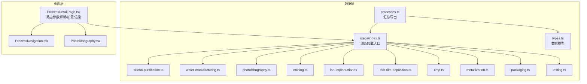
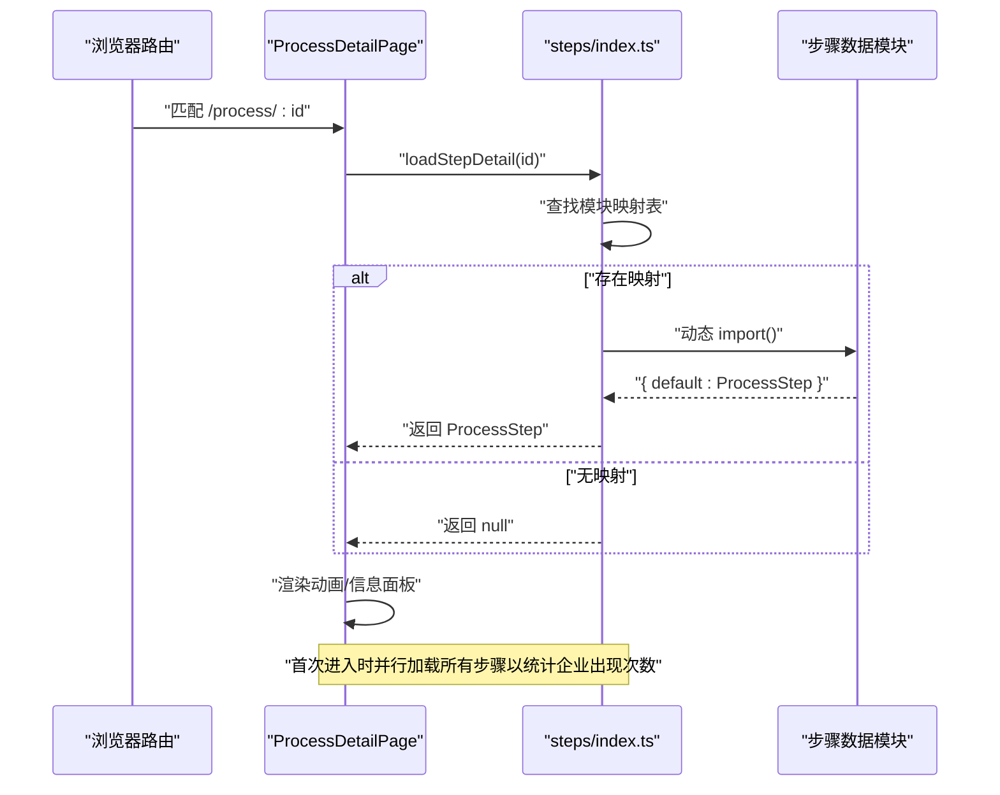
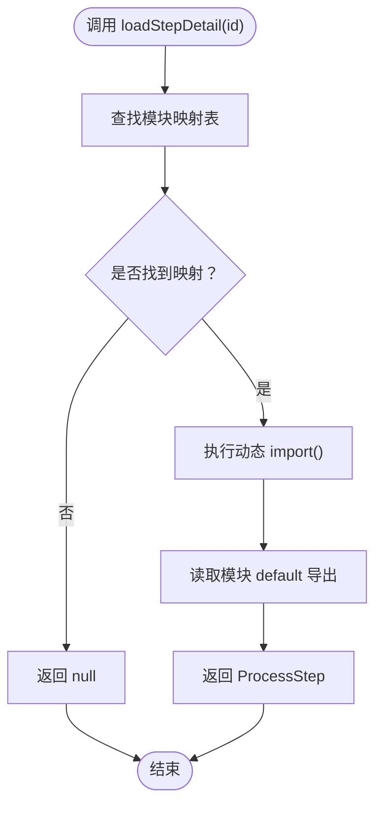
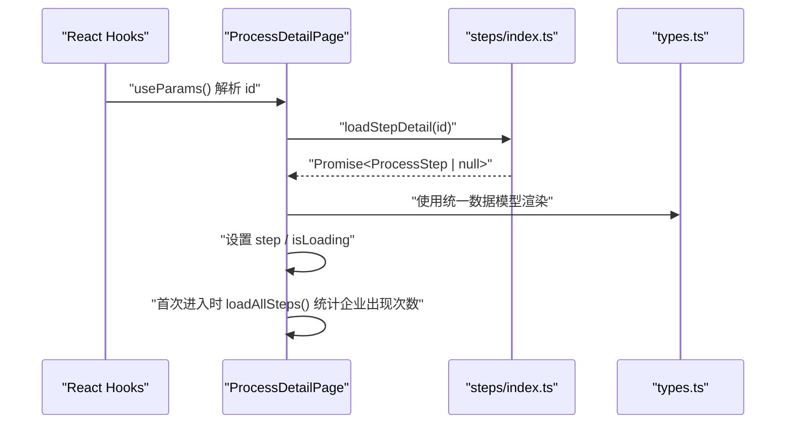
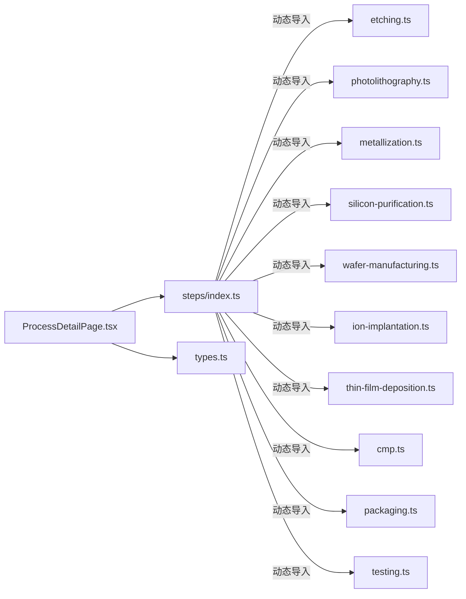

# 动态数据加载

<cite>
**本文引用的文件**
- [src/data/steps/index.ts](file://src/data/steps/index.ts)
- [src/data/steps/etching.ts](file://src/data/steps/etching.ts)
- [src/data/steps/photolithography.ts](file://src/data/steps/photolithography.ts)
- [src/data/steps/metallization.ts](file://src/data/steps/metallization.ts)
- [src/data/steps/silicon-purification.ts](file://src/data/steps/silicon-purification.ts)
- [src/data/steps/wafer-manufacturing.ts](file://src/data/steps/wafer-manufacturing.ts)
- [src/data/steps/ion-implantation.ts](file://src/data/steps/ion-implantation.ts)
- [src/data/steps/thin-film-deposition.ts](file://src/data/steps/thin-film-deposition.ts)
- [src/data/steps/cmp.ts](file://src/data/steps/cmp.ts)
- [src/data/steps/packaging.ts](file://src/data/steps/packaging.ts)
- [src/data/steps/testing.ts](file://src/data/steps/testing.ts)
- [src/data/types.ts](file://src/data/types.ts)
- [src/data/processes.ts](file://src/data/processes.ts)
- [src/components/layout/ProcessDetailPage.tsx](file://src/components/layout/ProcessDetailPage.tsx)
- [src/components/process/Photolithography.tsx](file://src/components/process/Photolithography.tsx)
- [src/components/ui/ProcessNavigation.tsx](file://src/components/ui/ProcessNavigation.tsx)
</cite>

## 目录
1. [简介](#简介)
2. [项目结构](#项目结构)
3. [核心组件](#核心组件)
4. [架构总览](#架构总览)
5. [详细组件分析](#详细组件分析)
6. [依赖关系分析](#依赖关系分析)
7. [性能考量](#性能考量)
8. [故障排查指南](#故障排查指南)
9. [结论](#结论)
10. [附录](#附录)

## 简介
本文件围绕芯片制造演示项目的“动态数据加载”机制展开，重点解析 src/data/steps/index.ts 的实现与模块加载策略，解释按需加载的工作原理与性能优化效果，阐述各工艺步骤数据文件的结构与内容组织，说明数据缓存与内存管理策略，给出错误处理与异常恢复机制，并提供动态导入的最佳实践与性能调优建议，最后解释数据加载与组件渲染的协调机制以及数据预加载与懒加载的平衡策略。

## 项目结构
该项目采用“按功能域划分”的目录组织方式，数据与页面组件清晰分离。与动态数据加载直接相关的核心目录与文件如下：
- 数据层：src/data/steps 下存放各工艺步骤的数据模块，src/data/types.ts 定义统一的数据模型，src/data/processes.ts 汇总导出类型与加载函数。
- 页面层：src/components/layout/ProcessDetailPage.tsx 负责路由参数解析、数据加载与页面渲染协调。
- 动画与导航：各工艺对应的动画组件位于 src/components/process/，导航组件位于 src/components/ui/。

图表来源
- [src/data/steps/index.ts:1-34](file://src/data/steps/index.ts#L1-L34)
- [src/data/types.ts:1-33](file://src/data/types.ts#L1-L33)
- [src/data/processes.ts:1-3](file://src/data/processes.ts#L1-L3)
- [src/components/layout/ProcessDetailPage.tsx:1-397](file://src/components/layout/ProcessDetailPage.tsx#L1-L397)
- [src/components/ui/ProcessNavigation.tsx:1-67](file://src/components/ui/ProcessNavigation.tsx#L1-L67)
- [src/components/process/Photolithography.tsx:1-136](file://src/components/process/Photolithography.tsx#L1-L136)

章节来源
- [src/data/steps/index.ts:1-34](file://src/data/steps/index.ts#L1-L34)
- [src/data/types.ts:1-33](file://src/data/types.ts#L1-L33)
- [src/data/processes.ts:1-3](file://src/data/processes.ts#L1-L3)
- [src/components/layout/ProcessDetailPage.tsx:1-397](file://src/components/layout/ProcessDetailPage.tsx#L1-L397)

## 核心组件
- 动态加载入口：steps/index.ts 提供 loadStepDetail(id) 与 loadAllSteps() 两个异步加载函数，基于模块映射表实现按需动态导入。
- 数据模型：types.ts 定义 ProcessStep、ProcessSubStep、Company 等统一接口，保证各步骤数据结构一致。
- 页面协调：ProcessDetailPage.tsx 在路由变化时触发按需加载，渲染动画与信息面板，并在首次访问时预加载全部步骤以统计企业出现次数。

章节来源
- [src/data/steps/index.ts:16-33](file://src/data/steps/index.ts#L16-L33)
- [src/data/types.ts:19-32](file://src/data/types.ts#L19-L32)
- [src/components/layout/ProcessDetailPage.tsx:59-80](file://src/components/layout/ProcessDetailPage.tsx#L59-L80)

## 架构总览
动态数据加载的整体流程如下：
- 组件根据路由参数 id 获取当前步骤标识。
- 通过 loadStepDetail(id) 从模块映射表中查找对应加载器，执行动态 import() 返回模块默认导出的 ProcessStep。
- 若 id 不存在，返回空值，页面显示“未找到该工艺步骤”。
- 首次进入页面时，loadAllSteps() 并行加载所有步骤，用于统计企业出现次数，优化后续渲染体验。

图表来源
- [src/components/layout/ProcessDetailPage.tsx:59-80](file://src/components/layout/ProcessDetailPage.tsx#L59-L80)
- [src/data/steps/index.ts:16-33](file://src/data/steps/index.ts#L16-L33)

## 详细组件分析

### steps/index.ts：动态加载与模块映射
- 模块映射表：以步骤 id 为键，值为动态 import() 函数，实现按需加载。
- 加载策略：
  - 单步加载：loadStepDetail(id) 根据 id 查找映射，若不存在返回空值，避免无效请求。
  - 全量加载：loadAllSteps() 使用 Promise.all 并行加载所有步骤，保持顺序与映射表一致。
- 性能特点：
  - 按需加载减少初始包体积，提升首屏加载速度。
  - 并行加载在首次访问时快速补齐企业统计等全局信息。
- 错误处理：
  - 未命中 id 返回 null，调用方可据此降级显示。
  - 动态 import 失败会抛出异常，应在调用处捕获并回退。

图表来源
- [src/data/steps/index.ts:16-21](file://src/data/steps/index.ts#L16-L21)

章节来源
- [src/data/steps/index.ts:3-14](file://src/data/steps/index.ts#L3-L14)
- [src/data/steps/index.ts:16-33](file://src/data/steps/index.ts#L16-L33)

### 各工艺步骤数据文件：结构与内容组织
- 统一结构：每个步骤文件导出一个 ProcessStep 对象，包含 id、name、nameEn、description、detail、subSteps、narration、icon、color、glowColor、keyMetrics、companies 等字段。
- 子步骤：subSteps 数组描述具体工艺步骤，支持 companyRefs 引用 companies 中的企业 nameEn。
- 企业列表：companies 数组包含企业信息，含名称、国家、标签、分类等，用于页面展示与统计。
- 示例文件：
  - 光刻：包含 EUV/ArF 流程、对准、曝光、显影等关键步骤与企业。
  - 刻蚀：涵盖 CCP/ICP/ALE 等技术路线与关键指标。
  - 金属化：双大马士革、低 k 介电、铜互连等。
  - 硅提纯：CZ 法、三氯氢硅、多级精馏、CVD 沉积等。
  - 晶圆制造：单晶生长、切片、研磨、抛光、清洗等。
  - 离子注入：电离、质量分析、加速聚焦、扫描均匀注入、退火激活等。
  - 薄膜沉积：LPCVD/PECVD/ALD/PVD、外延、表征与检测等。
  - CMP：抛光液配制、工艺参数、终点检测、修整与清洗检测等。
  - 封装：FC、WLP、CoWoS、3D、混合键合、Chiplet 等。
  - 测试：在线检测、WAT/CP、FT、老化、SLT 等。

章节来源
- [src/data/steps/etching.ts:3-139](file://src/data/steps/etching.ts#L3-L139)
- [src/data/steps/photolithography.ts:3-149](file://src/data/steps/photolithography.ts#L3-L149)
- [src/data/steps/metallization.ts:3-139](file://src/data/steps/metallization.ts#L3-L139)
- [src/data/steps/silicon-purification.ts:3-118](file://src/data/steps/silicon-purification.ts#L3-L118)
- [src/data/steps/wafer-manufacturing.ts:3-149](file://src/data/steps/wafer-manufacturing.ts#L3-L149)
- [src/data/steps/ion-implantation.ts:3-129](file://src/data/steps/ion-implantation.ts#L3-L129)
- [src/data/steps/thin-film-deposition.ts:3-149](file://src/data/steps/thin-film-deposition.ts#L3-L149)
- [src/data/steps/cmp.ts:3-139](file://src/data/steps/cmp.ts#L3-L139)
- [src/data/steps/packaging.ts:3-158](file://src/data/steps/packaging.ts#L3-L158)
- [src/data/steps/testing.ts:3-168](file://src/data/steps/testing.ts#L3-L168)

### 数据模型：types.ts
- ProcessStep：统一的步骤数据模型，包含国际化名称、图标、颜色、关键指标、子步骤与企业列表。
- ProcessSubStep：子步骤模型，支持 companyRefs 引用企业。
- Company：企业模型，含国家、旗帜、标签、分类等。

章节来源
- [src/data/types.ts:19-32](file://src/data/types.ts#L19-L32)

### 页面协调：ProcessDetailPage.tsx
- 路由参数解析：从 useParams 获取 id，用于动态加载当前步骤。
- 动态加载：
  - 单步加载：useEffect 监听 id 变化，调用 loadStepDetail(id) 获取 ProcessStep。
  - 全量加载：首次进入时调用 loadAllSteps() 计算企业出现次数，用于企业卡片统计。
- 渲染协调：
  - 动画组件根据 meta.id 映射到对应动画组件，每次切换 id 时重置动画 key，确保重新播放。
  - 语音讲解通过 useSpeech 控制，播放/停止状态与按钮联动。
- 降级与提示：
  - 未找到步骤时显示“未找到该工艺步骤”，并提供返回首页链接。
  - 加载中显示进度条与加载指示器。

图表来源
- [src/components/layout/ProcessDetailPage.tsx:36-98](file://src/components/layout/ProcessDetailPage.tsx#L36-L98)
- [src/data/steps/index.ts:16-33](file://src/data/steps/index.ts#L16-L33)
- [src/data/types.ts:19-32](file://src/data/types.ts#L19-L32)

章节来源
- [src/components/layout/ProcessDetailPage.tsx:36-98](file://src/components/layout/ProcessDetailPage.tsx#L36-L98)
- [src/components/layout/ProcessDetailPage.tsx:118-141](file://src/components/layout/ProcessDetailPage.tsx#L118-L141)

### 动画与导航：组件渲染协调
- 动画组件：各工艺动画组件独立导出，ProcessDetailPage 根据 meta.id 进行动画组件映射与重播控制。
- 导航组件：ProcessNavigation.tsx 基于当前索引提供上一步/下一步跳转，增强浏览体验。

章节来源
- [src/components/layout/ProcessDetailPage.tsx:23-34](file://src/components/layout/ProcessDetailPage.tsx#L23-L34)
- [src/components/process/Photolithography.tsx:1-136](file://src/components/process/Photolithography.tsx#L1-L136)
- [src/components/ui/ProcessNavigation.tsx:14-66](file://src/components/ui/ProcessNavigation.tsx#L14-L66)

## 依赖关系分析
- 模块依赖：
  - steps/index.ts 依赖各步骤数据模块，但不直接导入，而是通过动态 import() 按需加载。
  - pages/index.ts 仅导出类型与加载函数，避免循环依赖。
- 组件依赖：
  - ProcessDetailPage.tsx 依赖 steps/index.ts 的加载函数与 types.ts 的数据模型。
  - 动画组件彼此独立，通过页面层统一调度。
- 类型依赖：
  - 所有步骤数据模块与页面层共享 types.ts 中的接口定义，确保类型安全。

图表来源
- [src/data/steps/index.ts:3-14](file://src/data/steps/index.ts#L3-L14)
- [src/components/layout/ProcessDetailPage.tsx:1-22](file://src/components/layout/ProcessDetailPage.tsx#L1-L22)
- [src/data/types.ts:1-33](file://src/data/types.ts#L1-L33)

章节来源
- [src/data/steps/index.ts:1-34](file://src/data/steps/index.ts#L1-L34)
- [src/components/layout/ProcessDetailPage.tsx:1-22](file://src/components/layout/ProcessDetailPage.tsx#L1-L22)

## 性能考量
- 按需加载（懒加载）：
  - 通过动态 import() 将各步骤数据拆分为独立代码块，仅在访问时加载，显著降低首屏包体积与加载时间。
- 并行加载（预加载）：
  - 首次进入页面时并行加载所有步骤，用于统计企业出现次数，避免后续重复请求，提升交互流畅度。
- 并发控制：
  - Promise.all 并行加载多个模块，充分利用网络带宽；若步骤数量增长，可考虑分批加载或优先级队列。
- 缓存与内存管理：
  - 当前实现未显式缓存模块实例；可在应用层维护一个简单 Map 缓存已加载模块，避免重复动态导入。
  - 动画组件重播通过 key 变更触发重新挂载，有助于释放旧动画资源；注意避免在组件内持有长生命周期的静态引用。
- 错误与降级：
  - 动态 import 失败时应捕获异常并回退到默认数据或错误提示。
  - 未命中 id 返回 null，页面应优雅降级显示“未找到该工艺步骤”。

[本节为通用性能讨论，无需列出章节来源]

## 故障排查指南
- 动态导入失败：
  - 现象：页面长时间处于加载状态或报错。
  - 排查：检查步骤 id 是否存在于映射表；确认对应模块路径正确；查看网络面板是否存在 404。
- 未找到步骤：
  - 现象：显示“未找到该工艺步骤”。
  - 排查：确认路由参数 id 与映射表键一致；检查步骤数据模块是否导出默认对象。
- 企业统计异常：
  - 现象：相关企业卡片统计不准确。
  - 排查：确认 loadAllSteps() 是否成功返回；检查 companies 字段是否包含 nameEn；确保 ProcessDetailPage 首次加载逻辑正常执行。
- 动画不重播：
  - 现象：切换步骤后动画未重新播放。
  - 排查：确认 animationKey 是否随 id 变化而递增；检查动画组件是否接收 animationKey 并在 key 变化时重新渲染。

章节来源
- [src/data/steps/index.ts:16-21](file://src/data/steps/index.ts#L16-L21)
- [src/components/layout/ProcessDetailPage.tsx:59-98](file://src/components/layout/ProcessDetailPage.tsx#L59-L98)

## 结论
本项目通过 steps/index.ts 的模块映射与动态 import() 实现了高效的按需加载，结合 ProcessDetailPage.tsx 的并行预加载策略，既降低了首屏开销，又提升了交互体验。数据模型统一、组件职责清晰，为后续扩展更多工艺步骤提供了良好基础。建议在应用层增加模块缓存与错误兜底，进一步提升稳定性与性能。

[本节为总结性内容，无需列出章节来源]

## 附录
- 最佳实践与性能调优建议：
  - 模块缓存：在应用层维护 Map 缓存已加载模块，默认缓存 5~10 分钟，避免重复动态导入。
  - 分批加载：当步骤数量较多时，采用分批加载策略，优先加载当前页与相邻页数据。
  - 错误边界：在页面层包裹错误边界组件，捕获动态导入异常并提供重试按钮。
  - 预加载策略：根据用户行为预测（如鼠标悬停/即将跳转）提前触发 loadStepDetail(id)，缩短感知延迟。
  - 资源分片：将大型数据模块进一步拆分（如 detail 与 companies 分离），按需加载更细粒度内容。
  - 内存回收：动画组件重播时确保清理定时器与事件监听，避免内存泄漏。

[本节为通用建议，无需列出章节来源]