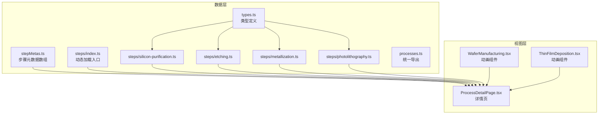
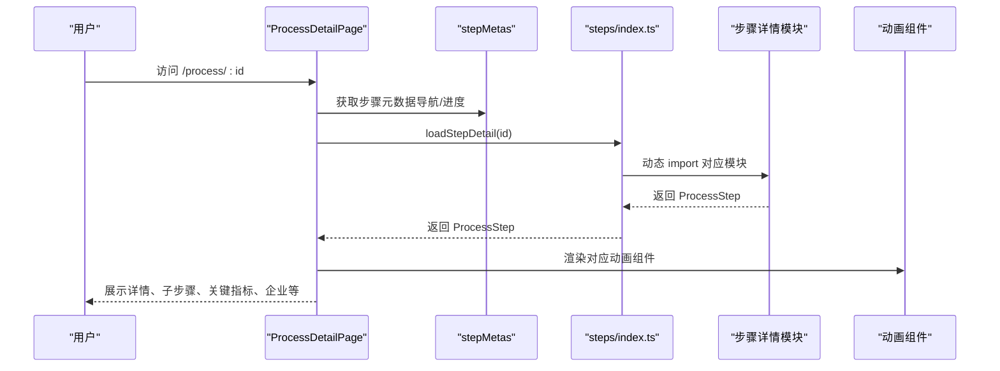

# 工艺数据配置

<cite>
**本文引用的文件**
- [src/data/stepMetas.ts](file://src/data/stepMetas.ts)
- [src/data/processes.ts](file://src/data/processes.ts)
- [src/data/types.ts](file://src/data/types.ts)
- [src/data/steps/index.ts](file://src/data/steps/index.ts)
- [src/data/steps/silicon-purification.ts](file://src/data/steps/silicon-purification.ts)
- [src/data/steps/etching.ts](file://src/data/steps/etching.ts)
- [src/data/steps/metallization.ts](file://src/data/steps/metallization.ts)
- [src/data/steps/photolithography.ts](file://src/data/steps/photolithography.ts)
- [src/components/layout/ProcessDetailPage.tsx](file://src/components/layout/ProcessDetailPage.tsx)
- [src/components/process/WaferManufacturing.tsx](file://src/components/process/WaferManufacturing.tsx)
- [src/components/process/ThinFilmDeposition.tsx](file://src/components/process/ThinFilmDeposition.tsx)
- [package.json](file://package.json)
</cite>

## 目录
1. [简介](#简介)
2. [项目结构](#项目结构)
3. [核心组件](#核心组件)
4. [架构总览](#架构总览)
5. [详细组件分析](#详细组件分析)
6. [依赖分析](#依赖分析)
7. [性能考量](#性能考量)
8. [故障排查指南](#故障排查指南)
9. [结论](#结论)
10. [附录](#附录)

## 简介
本文件面向“芯片制造演示项目”的工艺数据配置，围绕以下主题展开：
- stepMetas 配置文件的作用与结构：定义每个工艺步骤的元信息（名称、图标、颜色、描述等），并与具体步骤数据模块建立一一映射。
- processes 数据模块的功能与数据结构：统一导出类型与加载函数，负责按需动态加载各步骤的详细数据。
- 配置数据与实际工艺流程的映射关系：通过 stepMetas 的 id 与步骤数据模块的 id 对齐，实现页面导航、动画与内容的一致联动。
- 配置项的添加、修改与删除操作指南：提供可操作的步骤与注意事项。
- 配置数据的验证规则与约束条件：基于接口定义与使用场景给出约束建议。
- 版本管理与向后兼容性：提出版本演进建议与兼容策略。
- 配置扩展的最佳实践与性能优化建议：包括模块拆分、懒加载、缓存与渲染优化等。

## 项目结构
该项目采用“数据与视图分离”的组织方式：
- 数据层：位于 src/data，包含类型定义、步骤元数据、步骤详情模块与加载入口。
- 视图层：位于 src/components，包含页面组件与动画组件，负责消费数据层并渲染。

图表来源
- [src/data/stepMetas.ts:1-103](file://src/data/stepMetas.ts#L1-L103)
- [src/data/types.ts:1-33](file://src/data/types.ts#L1-L33)
- [src/data/steps/index.ts:1-34](file://src/data/steps/index.ts#L1-L34)
- [src/data/steps/silicon-purification.ts:1-121](file://src/data/steps/silicon-purification.ts#L1-L121)
- [src/data/steps/etching.ts:1-142](file://src/data/steps/etching.ts#L1-L142)
- [src/data/steps/metallization.ts:1-142](file://src/data/steps/metallization.ts#L1-L142)
- [src/data/steps/photolithography.ts:1-152](file://src/data/steps/photolithography.ts#L1-L152)
- [src/data/processes.ts:1-3](file://src/data/processes.ts#L1-L3)
- [src/components/layout/ProcessDetailPage.tsx:1-397](file://src/components/layout/ProcessDetailPage.tsx#L1-L397)
- [src/components/process/WaferManufacturing.tsx:1-122](file://src/components/process/WaferManufacturing.tsx#L1-L122)
- [src/components/process/ThinFilmDeposition.tsx:1-124](file://src/components/process/ThinFilmDeposition.tsx#L1-L124)

章节来源
- [src/data/stepMetas.ts:1-103](file://src/data/stepMetas.ts#L1-L103)
- [src/data/processes.ts:1-3](file://src/data/processes.ts#L1-L3)
- [src/data/types.ts:1-33](file://src/data/types.ts#L1-L33)
- [src/data/steps/index.ts:1-34](file://src/data/steps/index.ts#L1-L34)
- [src/components/layout/ProcessDetailPage.tsx:1-397](file://src/components/layout/ProcessDetailPage.tsx#L1-L397)

## 核心组件
- 步骤元数据（stepMetas）
  - 定义了每个工艺步骤的标识、中英文名称、描述、图标、颜色与发光色等基础属性。
  - 作为导航与页面标题栏等 UI 组件的元数据来源。
- 步骤详情模块（steps）
  - 每个步骤对应一个独立模块，包含详细描述、子步骤、关键指标、企业列表等。
  - 通过动态 import 实现按需加载，减少首屏体积。
- 加载入口（steps/index.ts）
  - 提供按 id 加载单个步骤详情与加载全部步骤的函数，维护模块映射表。
- 类型定义（types.ts）
  - 明确 Company、ProcessSubStep、ProcessStep 等接口字段，保证数据一致性。
- 页面消费（ProcessDetailPage.tsx）
  - 使用 stepMetas 进行导航与进度条定位；使用 loadStepDetail 动态获取步骤详情；使用动画组件展示可视化流程。

章节来源
- [src/data/stepMetas.ts:1-103](file://src/data/stepMetas.ts#L1-L103)
- [src/data/steps/index.ts:1-34](file://src/data/steps/index.ts#L1-L34)
- [src/data/types.ts:1-33](file://src/data/types.ts#L1-L33)
- [src/components/layout/ProcessDetailPage.tsx:1-397](file://src/components/layout/ProcessDetailPage.tsx#L1-L397)

## 架构总览
下面的序列图展示了“步骤详情页”从加载到渲染的关键流程，体现配置数据与实际流程的映射关系。

图表来源
- [src/components/layout/ProcessDetailPage.tsx:36-141](file://src/components/layout/ProcessDetailPage.tsx#L36-L141)
- [src/data/steps/index.ts:16-33](file://src/data/steps/index.ts#L16-L33)
- [src/data/stepMetas.ts:11-102](file://src/data/stepMetas.ts#L11-L102)

## 详细组件分析

### 步骤元数据（stepMetas.ts）
- 结构要点
  - 元数据接口包含 id、name、nameEn、description、icon、color、glowColor 字段。
  - 元数据数组按顺序定义了完整的工艺流程，用于导航与进度条。
- 作用
  - 作为路由与页面导航的依据，确保页面标题、颜色、图标与流程顺序一致。
  - 与步骤详情模块的 id 严格一一对应，缺失或不匹配会导致页面无法正确加载。
- 建议
  - 新增步骤时，务必同步更新 stepMetas 与 steps 目录下的模块文件，并在 steps/index.ts 中注册动态加载映射。

章节来源
- [src/data/stepMetas.ts:1-103](file://src/data/stepMetas.ts#L1-L103)

### 步骤详情模块（steps/*.ts）
- 结构要点
  - 每个模块导出一个 ProcessStep 对象，包含 id、name、nameEn、description、detail、subSteps、narration、icon、color、glowColor、keyMetrics、companies 等字段。
  - subSteps 描述子步骤标题、描述与涉及企业的引用（companyRefs）。
  - companies 列举与该步骤相关的代表性企业及其标签与分类。
- 作用
  - 提供详细的工艺知识、关键指标与企业背景，支撑页面的信息面板与企业卡片展示。
- 建议
  - 保持 subSteps 与 companies 的引用一致性，避免 companyRefs 指向不存在的企业 nameEn。

章节来源
- [src/data/steps/silicon-purification.ts:1-121](file://src/data/steps/silicon-purification.ts#L1-L121)
- [src/data/steps/etching.ts:1-142](file://src/data/steps/etching.ts#L1-L142)
- [src/data/steps/metallization.ts:1-142](file://src/data/steps/metallization.ts#L1-L142)
- [src/data/steps/photolithography.ts:1-152](file://src/data/steps/photolithography.ts#L1-L152)

### 动态加载入口（steps/index.ts）
- 结构要点
  - 通过映射表将步骤 id 与模块路径关联，提供 loadStepDetail 与 loadAllSteps 两个异步加载函数。
  - loadAllSteps 会按映射表顺序并行加载所有模块，保证结果顺序与 stepMetas 一致。
- 作用
  - 将“步骤元数据”与“步骤详情模块”解耦，实现按需加载与更好的首屏性能。
- 建议
  - 新增步骤时，必须在映射表中注册；否则 loadStepDetail 将返回空值。

章节来源
- [src/data/steps/index.ts:1-34](file://src/data/steps/index.ts#L1-L34)

### 页面消费（ProcessDetailPage.tsx）
- 结构要点
  - 通过 useParams 获取当前步骤 id，结合 stepMetas 计算当前位置与前后步骤。
  - 使用 loadStepDetail 动态加载当前步骤详情；使用 loadAllSteps 计算企业出现次数。
  - 通过 animationMap 将步骤 id 映射到对应的动画组件。
- 作用
  - 将元数据与详情数据整合，渲染导航、进度条、动画、讲解文本、子步骤与企业信息。
- 建议
  - 若新增动画组件，需在 animationMap 中注册；若新增步骤但未提供动画，可保留占位或提示。

章节来源
- [src/components/layout/ProcessDetailPage.tsx:1-397](file://src/components/layout/ProcessDetailPage.tsx#L1-L397)

### 动画组件（示例）
- WaferManufacturingAnimation 与 ThinFilmDepositionAnimation 展示了如何使用颜色与渐变实现视觉反馈，与 ProcessStep 的 color/glowColor 保持一致。
- 建议
  - 动画组件的颜色与文案应与 ProcessStep 的元数据保持一致，确保视觉一致性。

章节来源
- [src/components/process/WaferManufacturing.tsx:1-122](file://src/components/process/WaferManufacturing.tsx#L1-L122)
- [src/components/process/ThinFilmDeposition.tsx:1-124](file://src/components/process/ThinFilmDeposition.tsx#L1-L124)

## 依赖分析
- 类型依赖
  - 所有步骤模块均依赖 types.ts 中的 ProcessStep、ProcessSubStep、Company 接口，确保字段一致性。
- 运行时依赖
  - React 18、React Router DOM 7、TailwindCSS 生态与 Lucide 图标库用于界面与交互。
- 开发依赖
  - TypeScript、ESLint、Prettier、Vite 等工具链保障代码质量与构建效率。

章节来源
- [src/data/types.ts:1-33](file://src/data/types.ts#L1-L33)
- [package.json:15-44](file://package.json#L15-L44)

## 性能考量
- 模块懒加载
  - 通过动态 import 仅在访问步骤详情时加载对应模块，有效降低首屏体积。
- 并行加载
  - loadAllSteps 使用 Promise.all 并行加载所有模块，提高统计企业出现次数等场景的响应速度。
- 渲染优化
  - 使用 useMemo 缓存 companyMap，避免每次渲染都重建映射。
  - 动画组件通过 key 变更触发重播，减少不必要的重渲染。
- 资源与样式
  - TailwindCSS 提供原子类，减少自定义样式的开销；动画使用 SVG 与 CSS 动画，避免复杂 JS 动画带来的性能损耗。

章节来源
- [src/data/steps/index.ts:23-33](file://src/data/steps/index.ts#L23-L33)
- [src/components/layout/ProcessDetailPage.tsx:46-49](file://src/components/layout/ProcessDetailPage.tsx#L46-L49)
- [src/components/layout/ProcessDetailPage.tsx:94-98](file://src/components/layout/ProcessDetailPage.tsx#L94-L98)

## 故障排查指南
- 页面显示“未找到该工艺步骤”
  - 可能原因：URL 中的 id 与 stepMetas 或 steps/index.ts 的映射不一致。
  - 处理方法：检查 id 是否拼写错误、是否已在映射表中注册、是否在 stepMetas 中存在。
- 页面加载长时间处于“加载工艺详情...”
  - 可能原因：对应步骤模块尚未完成动态加载或模块内部异常。
  - 处理方法：确认模块文件存在且导出默认对象；检查浏览器控制台是否有错误。
- 企业标签与引用不显示
  - 可能原因：subSteps 的 companyRefs 引用的企业 nameEn 与 companies 中的 nameEn 不一致。
  - 处理方法：核对 companies 数组中的 nameEn 字段，确保与 companyRefs 一致。
- 动画不重播或颜色不一致
  - 可能原因：动画 key 未变更或 ProcessStep 的 color/glowColor 与动画组件不一致。
  - 处理方法：点击重播按钮触发 key 变更；确保颜色与 ProcessStep 一致。

章节来源
- [src/components/layout/ProcessDetailPage.tsx:118-127](file://src/components/layout/ProcessDetailPage.tsx#L118-L127)
- [src/data/steps/index.ts:16-21](file://src/data/steps/index.ts#L16-L21)
- [src/components/layout/ProcessDetailPage.tsx:36-34](file://src/components/layout/ProcessDetailPage.tsx#L36-L34)

## 结论
本项目通过 stepMetas 与步骤详情模块的清晰分工，实现了配置驱动的工艺流程展示。stepMetas 提供稳定的导航与元数据，步骤详情模块承载丰富的知识与企业背景，动态加载机制提升了性能与可维护性。遵循本文的操作指南与最佳实践，可以安全地扩展新的工艺步骤并保持向后兼容。

## 附录

### 配置项的添加、修改与删除操作指南
- 添加新步骤
  1) 在 src/data/steps 下新增模块文件，导出符合 ProcessStep 接口的对象。
  2) 在 src/data/steps/index.ts 的映射表中注册该模块的动态加载。
  3) 在 src/data/stepMetas.ts 中追加一条元数据记录，确保 id 与模块一致。
  4) 在 src/components/layout/ProcessDetailPage.tsx 的 animationMap 中注册对应的动画组件（如无动画可跳过）。
  5) 在 src/components/layout/ProcessDetailPage.tsx 的导航与进度条逻辑中确认顺序正确。
- 修改现有步骤
  - 修改元数据：在 stepMetas.ts 中调整名称、描述、图标或颜色。
  - 修改详情：在对应步骤模块中更新 detail、subSteps、keyMetrics、companies 等字段。
  - 修改动态加载：如需更改模块路径，需同步更新 steps/index.ts 的映射。
- 删除步骤
  - 从 steps/index.ts 移除映射。
  - 从 stepMetas.ts 移除对应元数据。
  - 如有动画组件，从 animationMap 中移除。
  - 更新导航与进度条逻辑，确保顺序正确。

章节来源
- [src/data/stepMetas.ts:11-102](file://src/data/stepMetas.ts#L11-L102)
- [src/data/steps/index.ts:3-14](file://src/data/steps/index.ts#L3-L14)
- [src/components/layout/ProcessDetailPage.tsx:23-34](file://src/components/layout/ProcessDetailPage.tsx#L23-L34)

### 配置数据的验证规则与约束条件
- 必填字段
  - ProcessStep：id、name、nameEn、description、detail、subSteps、narration、icon、color、glowColor、keyMetrics、companies。
  - ProcessSubStep：title、desc（可选 companyRefs）。
  - Company：name、nameEn、country、flag、description、highlight、tag、category。
- 约束条件
  - id 唯一且与 steps/index.ts 映射表一致。
  - companyRefs 必须引用 companies 中存在的 nameEn。
  - color/glowColor 应与动画组件使用的颜色风格一致。
  - subSteps 与 companies 的引用应语义一致，避免误导用户。
- 建议
  - 在 CI 中增加类型检查与字段校验脚本，确保新增或修改的数据满足上述规则。

章节来源
- [src/data/types.ts:1-33](file://src/data/types.ts#L1-L33)

### 版本管理与向后兼容性
- 版本演进建议
  - 为 stepMetas 与步骤模块建立版本号或注释，标注变更历史。
  - 对于破坏性变更（如字段删除、名称变更），提供迁移脚本与兼容层。
- 向后兼容
  - 新增字段时保持可选，避免强制要求旧数据补齐。
  - 保留旧 id 与映射一段时间，逐步引导页面与导航切换。
  - 在 pages 中增加兼容逻辑，对缺失模块返回友好提示而非崩溃。

章节来源
- [src/data/steps/index.ts:16-21](file://src/data/steps/index.ts#L16-L21)
- [src/components/layout/ProcessDetailPage.tsx:118-127](file://src/components/layout/ProcessDetailPage.tsx#L118-L127)

### 配置扩展的最佳实践与性能优化建议
- 最佳实践
  - 将步骤模块按功能域拆分，便于团队协作与维护。
  - 使用统一的类型定义与接口约束，减少运行时错误。
  - 为每个步骤提供简短的 narration 文稿，配合语音讲解提升体验。
- 性能优化
  - 保持动态加载的模块体积最小化，避免在模块中引入重型依赖。
  - 对高频访问的步骤（如光刻、刻蚀）优先保证加载速度。
  - 使用缓存策略（如内存缓存）复用已加载的步骤详情，减少重复请求。
  - 在动画组件中尽量使用 SVG 与 CSS 动画，避免复杂的 JavaScript 动画导致掉帧。

章节来源
- [src/data/steps/index.ts:23-33](file://src/data/steps/index.ts#L23-L33)
- [src/components/process/WaferManufacturing.tsx:1-122](file://src/components/process/WaferManufacturing.tsx#L1-L122)
- [src/components/process/ThinFilmDeposition.tsx:1-124](file://src/components/process/ThinFilmDeposition.tsx#L1-L124)