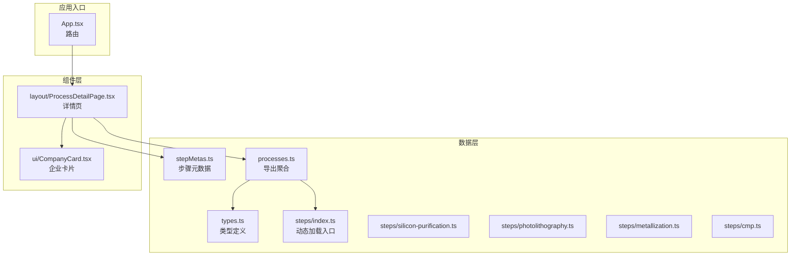
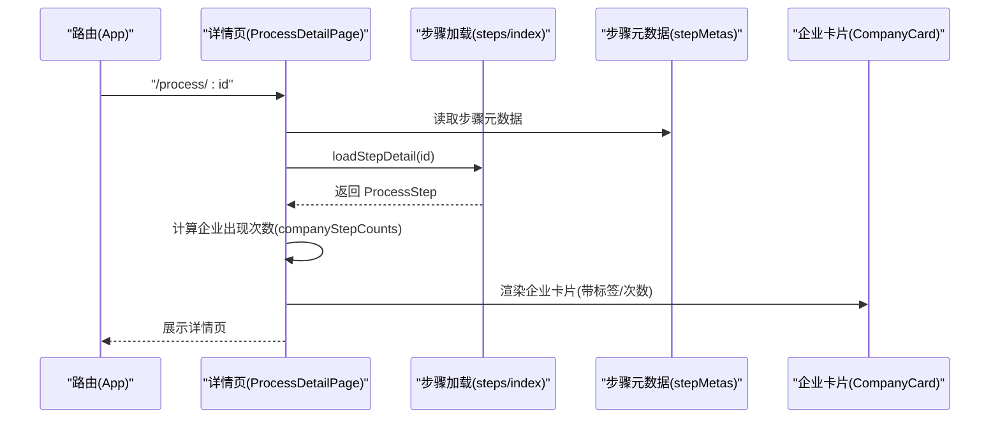
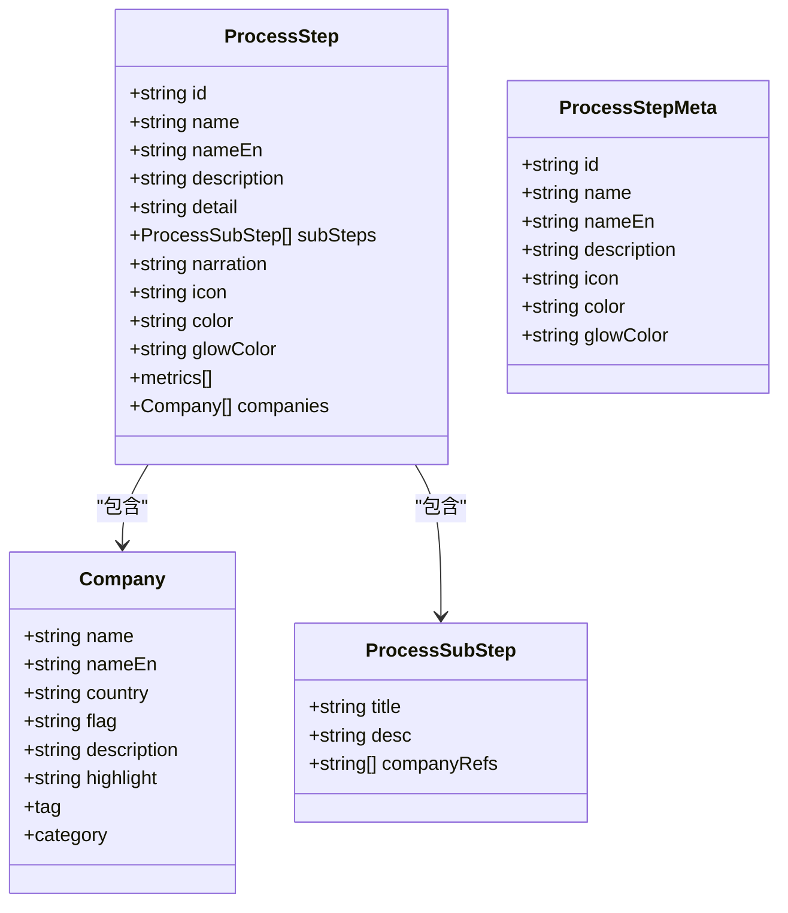
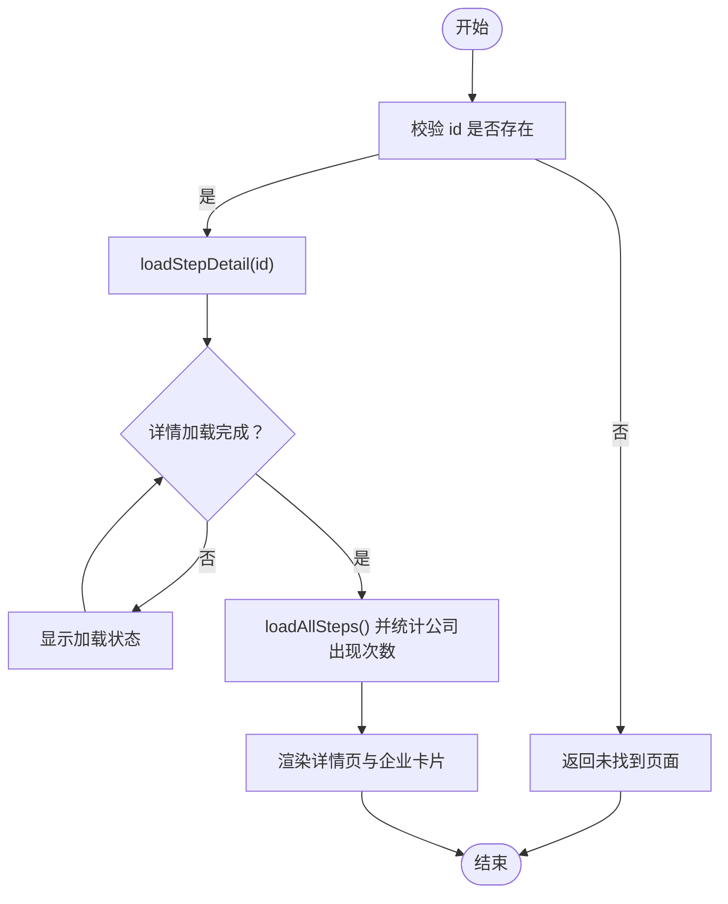
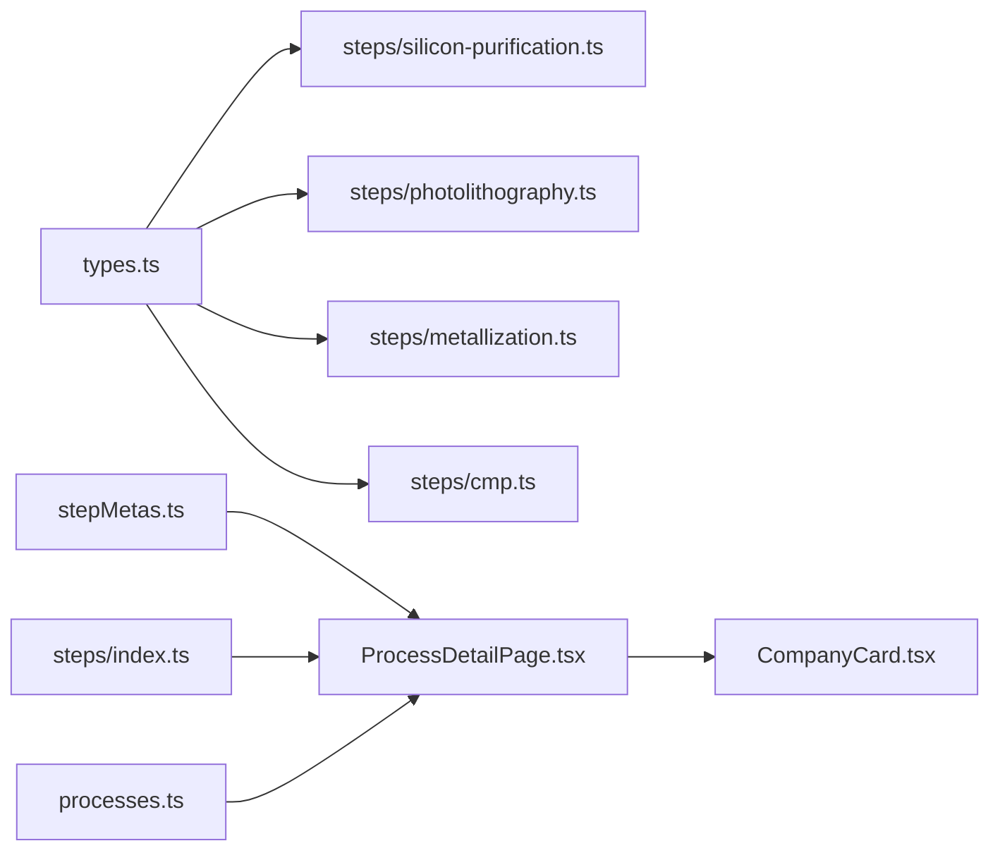

# 数据模型

<cite>
**本文引用的文件**
- [src/data/types.ts](file://src/data/types.ts)
- [src/data/stepMetas.ts](file://src/data/stepMetas.ts)
- [src/data/steps/index.ts](file://src/data/steps/index.ts)
- [src/data/steps/silicon-purification.ts](file://src/data/steps/silicon-purification.ts)
- [src/data/steps/photolithography.ts](file://src/data/steps/photolithography.ts)
- [src/data/steps/metallization.ts](file://src/data/steps/metallization.ts)
- [src/data/steps/cmp.ts](file://src/data/steps/cmp.ts)
- [src/data/processes.ts](file://src/data/processes.ts)
- [src/components/layout/ProcessDetailPage.tsx](file://src/components/layout/ProcessDetailPage.tsx)
- [src/components/ui/CompanyCard.tsx](file://src/components/ui/CompanyCard.tsx)
- [src/App.tsx](file://src/App.tsx)
- [package.json](file://package.json)
</cite>

## 目录
1. [简介](#简介)
2. [项目结构](#项目结构)
3. [核心数据类型](#核心数据类型)
4. [架构概览](#架构概览)
5. [详细组件分析](#详细组件分析)
6. [依赖关系分析](#依赖关系分析)
7. [性能考量](#性能考量)
8. [故障排查指南](#故障排查指南)
9. [结论](#结论)
10. [附录](#附录)

## 简介
本文件面向“芯片制造演示项目”的数据模型，系统性梳理并解释数据类型定义、设计原则、业务映射、组织结构与层级关系、验证规则与约束、数据加载与缓存机制、动态加载与性能优化策略，以及数据迁移与版本管理建议，并提供扩展与修改指导，帮助开发者高效维护与演进数据模型。

## 项目结构
该项目采用按功能域划分的目录组织方式：
- 数据层：位于 src/data，包含类型定义、步骤元数据、步骤详情模块与聚合入口
- 组件层：位于 src/components，包含页面组件、业务组件与UI组件
- 应用入口：位于 src/App.tsx，负责路由与页面挂载

图表来源
- [src/data/types.ts:1-33](file://src/data/types.ts#L1-L33)
- [src/data/stepMetas.ts:1-103](file://src/data/stepMetas.ts#L1-L103)
- [src/data/steps/index.ts:1-34](file://src/data/steps/index.ts#L1-L34)
- [src/data/steps/silicon-purification.ts:1-121](file://src/data/steps/silicon-purification.ts#L1-L121)
- [src/data/steps/photolithography.ts:1-152](file://src/data/steps/photolithography.ts#L1-L152)
- [src/data/steps/metallization.ts:1-142](file://src/data/steps/metallization.ts#L1-L142)
- [src/data/steps/cmp.ts:1-142](file://src/data/steps/cmp.ts#L1-L142)
- [src/data/processes.ts:1-3](file://src/data/processes.ts#L1-L3)
- [src/components/layout/ProcessDetailPage.tsx:1-397](file://src/components/layout/ProcessDetailPage.tsx#L1-L397)
- [src/components/ui/CompanyCard.tsx:1-159](file://src/components/ui/CompanyCard.tsx#L1-L159)
- [src/App.tsx:1-23](file://src/App.tsx#L1-L23)

章节来源
- [src/App.tsx:1-23](file://src/App.tsx#L1-L23)
- [src/data/processes.ts:1-3](file://src/data/processes.ts#L1-L3)

## 核心数据类型
本项目的数据模型围绕“公司”“工艺步骤”“子步骤”“步骤元信息”展开，采用TS接口与字面量联合类型确保类型安全与业务约束。

- Company（公司）
  - 字段要点：名称、英文名、国家、国旗、描述、亮点、标签、类别
  - 标签取值限定：国际龙头、中国力量、新兴势力
  - 类别取值限定：设备商、材料商、代工厂、IDM、EDA/IP、封测
  - 设计原则：统一国际化展示（name/nameEn/country/flag），强调企业角色与定位（highlight/tag/category）

- ProcessSubStep（工艺子步骤）
  - 字段要点：标题、描述、companyRefs（引用本步骤涉及的龙头企业nameEn）
  - 设计原则：通过nameEn建立与Company的弱耦合关联，便于跨步骤复用与动态解析

- ProcessStep（工艺步骤）
  - 字段要点：id、名称、英文名、描述、详情、子步骤数组、讲解文案、图标、颜色、发光色、关键指标、公司列表
  - 设计原则：统一的视觉与语义标识（icon/color/glowColor），关键指标用于量化展示，公司列表承载产业链生态

- ProcessStepMeta（步骤元信息）
  - 字段要点：id、名称、英文名、描述、图标、颜色、发光色
  - 设计原则：与具体步骤内容解耦，用于导航、进度条与页面面包屑等通用展示

章节来源
- [src/data/types.ts:1-33](file://src/data/types.ts#L1-L33)
- [src/data/stepMetas.ts:1-103](file://src/data/stepMetas.ts#L1-L103)

## 架构概览
数据模型与UI组件的交互遵循“类型驱动 + 动态加载 + 聚合导出”的架构模式：
- 类型定义集中于 types.ts，确保跨模块一致
- 步骤元数据 stepMetas.ts 提供导航与索引
- 步骤详情通过 steps/index.ts 的动态导入实现按需加载
- processes.ts 汇总导出类型与加载函数，供页面组件直接使用
- 页面组件 ProcessDetailPage.tsx 负责加载当前步骤详情与全量步骤统计，CompanyCard.tsx 负责渲染企业卡片

图表来源
- [src/App.tsx:1-23](file://src/App.tsx#L1-L23)
- [src/components/layout/ProcessDetailPage.tsx:1-397](file://src/components/layout/ProcessDetailPage.tsx#L1-L397)
- [src/data/steps/index.ts:1-34](file://src/data/steps/index.ts#L1-L34)
- [src/data/stepMetas.ts:1-103](file://src/data/stepMetas.ts#L1-L103)
- [src/components/ui/CompanyCard.tsx:1-159](file://src/components/ui/CompanyCard.tsx#L1-L159)

## 详细组件分析

### 类型与数据结构类图

图表来源
- [src/data/types.ts:1-33](file://src/data/types.ts#L1-L33)
- [src/data/stepMetas.ts:1-103](file://src/data/stepMetas.ts#L1-L103)

章节来源
- [src/data/types.ts:1-33](file://src/data/types.ts#L1-L33)
- [src/data/stepMetas.ts:1-103](file://src/data/stepMetas.ts#L1-L103)

### 动态数据加载与缓存机制
- 动态加载
  - steps/index.ts 通过模块映射表按需导入步骤详情模块，避免一次性加载全部数据
  - loadStepDetail(id) 根据 id 查找对应模块并异步加载
  - loadAllSteps() 并发加载所有步骤详情，保留定义顺序
- 缓存策略
  - 当前实现未内置持久化缓存；页面组件在首次加载后持有内存中的结果
  - 建议：可在应用层引入轻量LRU缓存（如基于 WeakMap 的组件实例缓存）或浏览器本地存储，以减少重复请求
- 公司计数统计
  - ProcessDetailPage 在加载全量步骤后，统计每个公司出现在多少个步骤中，用于企业卡片显示“参与环节数”

图表来源
- [src/data/steps/index.ts:16-33](file://src/data/steps/index.ts#L16-L33)
- [src/components/layout/ProcessDetailPage.tsx:59-80](file://src/components/layout/ProcessDetailPage.tsx#L59-L80)

章节来源
- [src/data/steps/index.ts:1-34](file://src/data/steps/index.ts#L1-L34)
- [src/components/layout/ProcessDetailPage.tsx:1-397](file://src/components/layout/ProcessDetailPage.tsx#L1-L397)

### 数据验证规则与约束
- 字段完整性
  - ProcessStep 必须包含 id、name、nameEn、description、detail、subSteps、narration、icon、color、glowColor、keyMetrics、companies
  - ProcessSubStep 必须包含 title、desc，companyRefs 可选
  - Company 必须包含 name、nameEn、country、flag、description、highlight、tag、category
- 取值约束
  - tag 限定为“国际龙头”“中国力量”“新兴势力”
  - category 限定为“设备商”“材料商”“代工厂”“IDM”“EDA/IP”“封测”
- 关联一致性
  - ProcessSubStep.companyRefs 应与 ProcessStep.companies 中的 Company.nameEn 一一对应
  - ProcessStepMeta.id 与步骤详情模块 id 对应，保证导航与详情一致

章节来源
- [src/data/types.ts:1-33](file://src/data/types.ts#L1-L33)
- [src/data/stepMetas.ts:1-103](file://src/data/stepMetas.ts#L1-L103)

### 数据组织结构与层级关系
- 顶层：ProcessStepMeta（导航与索引）
- 中层：ProcessStep（步骤详情）
  - 子步骤：ProcessSubStep（子步骤集合）
  - 企业：Company（企业列表）
- 关系映射
  - ProcessStepMeta.id ↔ 步骤详情模块 id
  - ProcessSubStep.companyRefs ↔ Company.nameEn
  - 企业卡片按 tag 分组展示

章节来源
- [src/data/stepMetas.ts:1-103](file://src/data/stepMetas.ts#L1-L103)
- [src/data/types.ts:1-33](file://src/data/types.ts#L1-L33)

### 动态数据加载的工作原理与性能优化
- 工作原理
  - 使用动态 import 实现按需加载，减少首屏体积
  - 并发加载全量步骤以计算企业计数，保证企业卡片统计准确性
- 性能优化建议
  - 预加载：在路由进入前触发 loadAllSteps，避免首屏闪烁
  - 缓存：为步骤详情与企业计数设置短期缓存，避免重复请求
  - 懒加载：动画组件与子步骤详情采用懒加载，仅在可见区域加载
  - 并发控制：限制并发请求数量，避免资源争用

章节来源
- [src/data/steps/index.ts:16-33](file://src/data/steps/index.ts#L16-L33)
- [src/components/layout/ProcessDetailPage.tsx:69-80](file://src/components/layout/ProcessDetailPage.tsx#L69-L80)

### 数据迁移与版本管理
- 版本化字段
  - 建议在 ProcessStep 中新增 version 或 lastModified 字段，用于追踪数据变更
- 迁移策略
  - 新增字段：默认值兼容旧数据；逐步替换旧字段
  - 字段重命名：提供映射函数，读取旧字段并写入新字段
  - 删除字段：保留只读读取，逐步清理
- 兼容性
  - 保持 id 与 nameEn 的稳定性，避免破坏跨模块引用
  - companyRefs 与 nameEn 的一致性检查可通过单元测试保障

章节来源
- [src/data/types.ts:1-33](file://src/data/types.ts#L1-L33)

### 扩展与修改指导
- 新增步骤
  - 在 src/data/steps 下新增模块文件，导出 ProcessStep
  - 在 steps/index.ts 的映射表中注册 id 到模块的映射
  - 在 stepMetas.ts 中添加对应的 ProcessStepMeta
- 新增企业
  - 在对应步骤模块的 companies 数组中新增 Company
  - 在相关子步骤的 companyRefs 中引用该企业的 nameEn
- 修改字段
  - 若新增字段，提供默认值并在页面组件中做空值保护
  - 若字段重命名，提供兼容读取逻辑
- 规范建议
  - 统一使用 nameEn 作为跨模块引用键
  - 保持 icon/color/glowColor 与步骤主题一致
  - 为关键指标提供单位与范围说明，便于展示与比较

章节来源
- [src/data/steps/index.ts:3-14](file://src/data/steps/index.ts#L3-L14)
- [src/data/stepMetas.ts:11-102](file://src/data/stepMetas.ts#L11-L102)
- [src/data/steps/silicon-purification.ts:3-118](file://src/data/steps/silicon-purification.ts#L3-L118)
- [src/data/steps/photolithography.ts:3-149](file://src/data/steps/photolithography.ts#L3-L149)
- [src/data/steps/metallization.ts:3-139](file://src/data/steps/metallization.ts#L3-L139)
- [src/data/steps/cmp.ts:3-139](file://src/data/steps/cmp.ts#L3-L139)

## 依赖关系分析
- 类型依赖
  - Company、ProcessSubStep、ProcessStep 由 types.ts 定义，被 steps/* 与 pages 复用
- 导航与加载
  - stepMetas.ts 为导航提供 id 与元信息
  - steps/index.ts 提供动态加载函数
  - processes.ts 聚合导出类型与加载函数
- 组件依赖
  - ProcessDetailPage 依赖 processes.ts 与 stepMetas.ts
  - CompanyCard 依赖 types.ts 的 Company 接口

图表来源
- [src/data/types.ts:1-33](file://src/data/types.ts#L1-L33)
- [src/data/stepMetas.ts:1-103](file://src/data/stepMetas.ts#L1-L103)
- [src/data/steps/index.ts:1-34](file://src/data/steps/index.ts#L1-L34)
- [src/data/steps/silicon-purification.ts:1-121](file://src/data/steps/silicon-purification.ts#L1-L121)
- [src/data/steps/photolithography.ts:1-152](file://src/data/steps/photolithography.ts#L1-L152)
- [src/data/steps/metallization.ts:1-142](file://src/data/steps/metallization.ts#L1-L142)
- [src/data/steps/cmp.ts:1-142](file://src/data/steps/cmp.ts#L1-L142)
- [src/data/processes.ts:1-3](file://src/data/processes.ts#L1-L3)
- [src/components/layout/ProcessDetailPage.tsx:1-397](file://src/components/layout/ProcessDetailPage.tsx#L1-L397)
- [src/components/ui/CompanyCard.tsx:1-159](file://src/components/ui/CompanyCard.tsx#L1-L159)

章节来源
- [src/data/processes.ts:1-3](file://src/data/processes.ts#L1-L3)
- [src/components/layout/ProcessDetailPage.tsx:1-397](file://src/components/layout/ProcessDetailPage.tsx#L1-L397)

## 性能考量
- 按需加载：动态 import 有效降低首屏体积
- 并发加载：Promise.all 并发获取全量步骤，缩短等待时间
- 内存占用：步骤详情与企业计数在组件内缓存，避免重复计算
- 建议优化
  - 引入轻量缓存（如 LRU）与失效策略
  - 对高频访问的步骤详情进行预热
  - 将企业计数结果持久化到本地存储，减少重复统计

[本节为通用性能讨论，不直接分析具体文件]

## 故障排查指南
- 步骤详情为空
  - 检查 steps/index.ts 中是否注册了对应 id 的模块映射
  - 确认步骤模块导出的是默认导出的 ProcessStep
- 企业卡片无数据
  - 检查 ProcessSubStep.companyRefs 是否正确引用 Company.nameEn
  - 确认企业计数统计逻辑是否覆盖到该企业
- 导航异常
  - 检查 stepMetas.ts 中 id 与步骤模块 id 是否一致
  - 确认路由路径与页面组件是否正确匹配

章节来源
- [src/data/steps/index.ts:3-14](file://src/data/steps/index.ts#L3-L14)
- [src/components/layout/ProcessDetailPage.tsx:46-49](file://src/components/layout/ProcessDetailPage.tsx#L46-L49)
- [src/data/stepMetas.ts:11-102](file://src/data/stepMetas.ts#L11-L102)

## 结论
本项目的数据模型以清晰的类型定义为基础，通过动态加载与聚合导出实现高效的数据组织与展示。类型约束与业务标签确保了数据的一致性与可读性。建议在现有基础上引入缓存与版本管理策略，以进一步提升性能与可维护性。

[本节为总结性内容，不直接分析具体文件]

## 附录
- 技术栈
  - React + TypeScript + Vite + TailwindCSS
- 依赖
  - react-router-dom、lucide-react、tailwind 系列工具库

章节来源
- [package.json:15-44](file://package.json#L15-L44)