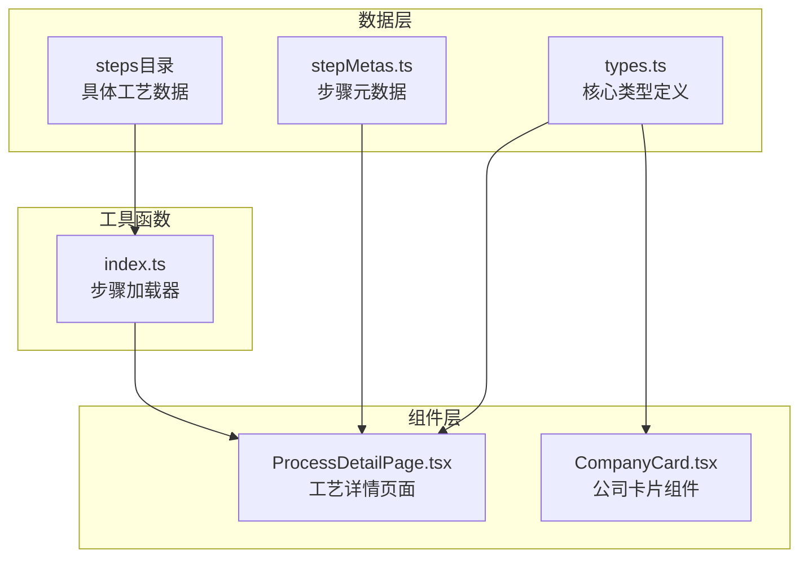
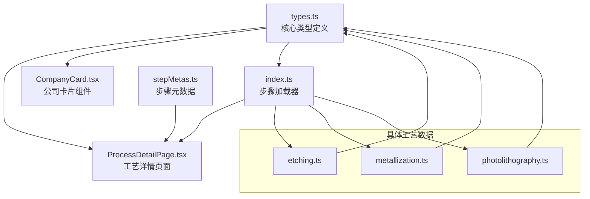

# 类型定义

<cite>
**本文档引用的文件**
- [types.ts](file://src/data/types.ts)
- [processes.ts](file://src/data/processes.ts)
- [stepMetas.ts](file://src/data/stepMetas.ts)
- [index.ts](file://src/data/steps/index.ts)
- [etching.ts](file://src/data/steps/etching.ts)
- [metallization.ts](file://src/data/steps/metallization.ts)
- [photolithography.ts](file://src/data/steps/photolithography.ts)
- [ProcessDetailPage.tsx](file://src/components/layout/ProcessDetailPage.tsx)
- [CompanyCard.tsx](file://src/components/ui/CompanyCard.tsx)
</cite>

## 目录
1. [简介](#简介)
2. [项目结构概览](#项目结构概览)
3. [核心类型定义](#核心类型定义)
4. [Company接口详细说明](#company接口详细说明)
5. [ProcessSubStep接口详细说明](#processsubstep接口详细说明)
6. [ProcessStep接口详细说明](#processstep接口详细说明)
7. [ProcessStepMeta接口详细说明](#processstepmeta接口详细说明)
8. [枚举类型使用说明](#枚举类型使用说明)
9. [类型安全使用示例](#类型安全使用示例)
10. [最佳实践和扩展建议](#最佳实践和扩展建议)
11. [常见错误处理](#常见错误处理)
12. [依赖关系分析](#依赖关系分析)

## 简介

本项目是一个芯片制造演示应用程序，通过类型安全的TypeScript定义来描述整个芯片制造工艺流程。本文档详细说明了所有接口和类型定义，包括公司信息、工艺步骤和子步骤的结构，以及它们之间的关系和约束条件。

## 项目结构概览

项目采用模块化架构，主要类型定义集中在`src/data/types.ts`文件中，配合具体的工艺步骤数据和UI组件使用这些类型。



**图表来源**
- [types.ts:1-33](file://src/data/types.ts#L1-L33)
- [stepMetas.ts:1-103](file://src/data/stepMetas.ts#L1-L103)
- [ProcessDetailPage.tsx:1-397](file://src/components/layout/ProcessDetailPage.tsx#L1-L397)

## 核心类型定义

项目的核心类型定义位于`src/data/types.ts`文件中，包含三个主要接口：

### Company接口
公司信息的完整定义，用于描述芯片制造产业链中的各类企业。

### ProcessSubStep接口  
工艺子步骤的结构定义，描述具体工艺流程中的各个阶段。

### ProcessStep接口
完整的工艺步骤定义，包含所有相关信息和关联数据。

**章节来源**
- [types.ts:1-33](file://src/data/types.ts#L1-L33)

## Company接口详细说明

Company接口定义了芯片制造相关企业的完整信息结构。

### 字段定义和约束

| 字段名 | 数据类型 | 必填性 | 描述 | 约束条件 |
|--------|----------|--------|------|----------|
| name | string | 必填 | 公司中文名称 | 非空字符串 |
| nameEn | string | 必填 | 公司英文名称 | 非空字符串，唯一标识符 |
| country | string | 必填 | 公司所在国家 | 非空字符串 |
| flag | string | 必填 | 国家旗帜表情符号 | 有效的emoji字符 |
| description | string | 必填 | 公司详细介绍 | 非空字符串，HTML格式支持 |
| highlight | string | 必填 | 公司亮点信息 | 非空字符串，简短描述 |
| tag | '国际龙头' \| '中国力量' \| '新兴势力' | 必填 | 公司分类标签 | 枚举值之一 |
| category | '设备商' \| '材料商' \| '代工厂' \| 'IDM' \| 'EDA/IP' \| '封测' | 可选 | 公司业务类别 | 枚举值之一 |

### 业务含义

- **name/nameEn**: 用于显示和标识公司的中英文名称
- **country/flag**: 显示公司地理位置信息
- **description**: 详细的公司业务介绍和技术实力说明
- **highlight**: 突出显示公司的核心优势和成就
- **tag**: 按影响力和地位进行分类（国际龙头、中国力量、新兴势力）
- **category**: 按业务领域进行分类（设备、材料、代工等）

**章节来源**
- [types.ts:1-10](file://src/data/types.ts#L1-L10)

## ProcessSubStep接口详细说明

ProcessSubStep接口定义了工艺流程中的子步骤结构。

### 字段定义和约束

| 字段名 | 数据类型 | 必填性 | 描述 | 约束条件 |
|--------|----------|--------|------|----------|
| title | string | 必填 | 子步骤标题 | 非空字符串 |
| desc | string | 必填 | 子步骤详细描述 | 非空字符串 |
| companyRefs | string[] | 可选 | 关联的企业名称数组 | 数组元素为Company.nameEn |

### 业务含义

- **title**: 简洁明了地描述该子步骤的核心内容
- **desc**: 详细说明该子步骤的技术要点和操作流程
- **companyRefs**: 引用本步骤涉及的相关企业，建立工艺步骤与企业的关联关系

### 使用场景

ProcessSubStep主要用于展示复杂的工艺流程，通过子步骤的形式分解每个工艺步骤的具体操作，便于用户理解和学习。

**章节来源**
- [types.ts:12-17](file://src/data/types.ts#L12-L17)

## ProcessStep接口详细说明

ProcessStep接口定义了完整的工艺步骤信息，是项目中最复杂的类型定义。

### 字段定义和约束

| 字段名 | 数据类型 | 必填性 | 描述 | 约束条件 |
|--------|----------|--------|------|----------|
| id | string | 必填 | 工艺步骤唯一标识符 | 非空字符串，URL友好 |
| name | string | 必填 | 工艺步骤中文名称 | 非空字符串 |
| nameEn | string | 必填 | 工艺步骤英文名称 | 非空字符串 |
| description | string | 必填 | 工艺步骤简要描述 | 非空字符串 |
| detail | string | 必填 | 工艺步骤详细说明 | 非空字符串，HTML格式支持 |
| subSteps | ProcessSubStep[] | 必填 | 子步骤数组 | 非空数组，至少包含一个元素 |
| narration | string | 必填 | 语音讲解文本 | 非空字符串 |
| icon | string | 必填 | 工艺步骤图标 | 有效的emoji字符 |
| color | string | 必填 | 主色调（CSS颜色值） | 有效的CSS颜色格式 |
| glowColor | string | 必填 | 发光效果颜色 | 有效的CSS颜色格式 |
| keyMetrics | {label: string, value: string}[] | 必填 | 关键工艺指标 | 非空数组 |
| companies | Company[] | 必填 | 涉及的企业列表 | 非空数组，至少包含一个元素 |

### 业务含义

- **基础信息**: id、name、nameEn、description提供基本识别信息
- **内容信息**: detail提供详细技术说明，narration提供语音讲解内容
- **视觉信息**: icon、color、glowColor用于界面展示和品牌识别
- **数据信息**: keyMetrics提供量化指标，companies建立企业关联
- **结构信息**: subSteps组织复杂的工艺流程

### 复杂度分析

ProcessStep接口包含多个嵌套结构，整体复杂度较高：
- 时间复杂度: O(n) - n为subSteps数量
- 空间复杂度: O(n*m) - m为平均每个subStep的companyRefs数量

**章节来源**
- [types.ts:19-32](file://src/data/types.ts#L19-L32)

## ProcessStepMeta接口详细说明

ProcessStepMeta接口定义了工艺步骤的元数据信息，用于导航和概览。

### 字段定义和约束

| 字段名 | 数据类型 | 必填性 | 描述 | 约束条件 |
|--------|----------|--------|------|----------|
| id | string | 必填 | 工艺步骤唯一标识符 | 非空字符串 |
| name | string | 必填 | 工艺步骤中文名称 | 非空字符串 |
| nameEn | string | 必填 | 工艺步骤英文名称 | 非空字符串 |
| description | string | 必填 | 工艺步骤简要描述 | 非空字符串 |
| icon | string | 必填 | 工艺步骤图标 | 有效的emoji字符 |
| color | string | 必填 | 主色调（CSS颜色值） | 有效的CSS颜色格式 |
| glowColor | string | 必填 | 发光效果颜色 | 有效的CSS颜色格式 |

### 使用场景

ProcessStepMeta主要用于：
- 页面导航和面包屑
- 进度条显示
- 工艺流程概览
- 路由匹配和跳转

**章节来源**
- [stepMetas.ts:1-9](file://src/data/stepMetas.ts#L1-L9)

## 枚举类型使用说明

项目中使用了两种枚举类型来确保数据的完整性和一致性。

### tag枚举类型

```typescript
tag: '国际龙头' | '中国力量' | '新兴势力'
```

**取值范围**: 
- 国际龙头: 全球领先的芯片制造企业
- 中国力量: 中国本土的强势企业
- 新兴势力: 新崛起的潜力企业

**使用场景**:
- CompanyCard组件的颜色映射
- CompanySection的分组显示
- UI样式的动态应用

### category枚举类型

```typescript
category: '设备商' | '材料商' | '代工厂' | 'IDM' | 'EDA/IP' | '封测'
```

**取值范围**:
- 设备商: 提供半导体制造设备的企业
- 材料商: 提供半导体制造材料的企业
- 代工厂: 代工生产芯片的企业
- IDM: 集成器件制造商
- EDA/IP: 电子设计自动化/知识产权
- 封测: 封装测试企业

**使用场景**:
- CompanyCard的分类标签显示
- 企业筛选和分组
- 行业分析和统计

**章节来源**
- [types.ts:8-9](file://src/data/types.ts#L8-L9)

## 类型安全使用示例

### 基础类型使用

```typescript
// 正确的Company实例创建
const company: Company = {
  name: "台积电",
  nameEn: "TSMC", 
  country: "中国台湾",
  flag: "🇨🇳",
  description: "全球最大的专业积体电路制造服务公司",
  highlight: "3nm量产",
  tag: "国际龙头",
  category: "代工厂"
};

// 正确的ProcessSubStep使用
const subStep: ProcessSubStep = {
  title: "光刻胶涂布",
  desc: "旋涂光刻胶形成均匀薄膜",
  companyRefs: ["ASML Holding", "NANO Chemical"]
};
```

### 组合类型使用

```typescript
// 完整的ProcessStep实例
const processStep: ProcessStep = {
  id: "photolithography",
  name: "光刻",
  nameEn: "Photolithography",
  description: "EUV光学投影将纳米级电路图形精确转印晶圆",
  detail: "详细的技术说明...",
  subSteps: [/* ProcessSubStep数组 */],
  narration: "语音讲解内容...",
  icon: "💡",
  color: "hsl(270 70% 60%)",
  glowColor: "hsl(270 70% 60% / 0.3)",
  keyMetrics: [
    { label: "EUV光源波长", value: "13.5nm" }
  ],
  companies: [/* Company数组 */]
};
```

### 错误处理模式

```typescript
// 类型检查和错误处理
function validateCompany(company: unknown): company is Company {
  return typeof company === 'object' && 
         company !== null &&
         typeof (company as Company).name === 'string' &&
         typeof (company as Company).nameEn === 'string' &&
         ['国际龙头', '中国力量', '新兴势力'].includes((company as Company).tag);
}

// 安全访问可选属性
function safeAccessCompany(company: Company) {
  return {
    name: company.name,
    nameEn: company.nameEn,
    country: company.country,
    category: company.category || '未知分类' // 提供默认值
  };
}
```

## 最佳实践和扩展建议

### 类型设计最佳实践

1. **使用字面量类型确保枚举值正确性**
   - 通过联合类型限制枚举值范围
   - 避免字符串拼写错误

2. **合理使用可选属性**
   - 对于可能为空的数据使用可选属性
   - 提供合理的默认值处理

3. **嵌套类型的一致性**
   - 确保Company.nameEn与ProcessSubStep.companyRefs的关联性
   - 维护数据完整性约束

### 扩展建议

1. **添加验证函数**
```typescript
// 添加类型验证函数
export function validateProcessStep(step: unknown): step is ProcessStep {
  // 实现验证逻辑
  return true;
}
```

2. **国际化支持**
```typescript
// 添加多语言支持
interface LocalizedContent {
  zh: string;
  en: string;
  ja?: string;
  ko?: string;
}
```

3. **版本控制**
```typescript
// 添加版本字段
interface VersionedProcessStep extends ProcessStep {
  version: string;
  lastUpdated: Date;
}
```

## 常见错误处理

### 类型不匹配错误

**问题**: 将错误类型的对象赋值给Company接口
**解决方案**: 使用类型守卫函数进行验证

```typescript
function isCompany(obj: unknown): obj is Company {
  return obj !== null && 
         typeof obj === 'object' &&
         'name' in obj && 
         'nameEn' in obj &&
         'tag' in obj &&
         ['国际龙头', '中国力量', '新兴势力'].includes(obj.tag);
}
```

### 缺失必需字段错误

**问题**: Company实例缺少必需字段
**解决方案**: 在创建实例时提供所有必需字段，或使用工厂函数

```typescript
function createCompany(data: Omit<Company, 'nameEn'>): Company {
  return {
    ...data,
    nameEn: data.name.replace(/[\u4e00-\u9fa5]/g, '') // 自动生成英文名称
  };
}
```

### 关联数据不一致错误

**问题**: ProcessSubStep.companyRefs引用不存在的Company.nameEn
**解决方案**: 在使用前验证引用关系

```typescript
function validateCompanyRefs(step: ProcessStep): boolean {
  const companyNames = step.companies.map(c => c.nameEn);
  return step.subSteps.every(sub => 
    !sub.companyRefs || 
    sub.companyRefs.every(ref => companyNames.includes(ref))
  );
}
```

## 依赖关系分析

项目中的类型定义具有清晰的依赖关系：



**图表来源**
- [types.ts:1-33](file://src/data/types.ts#L1-L33)
- [ProcessDetailPage.tsx:1-397](file://src/components/layout/ProcessDetailPage.tsx#L1-L397)
- [index.ts:1-34](file://src/data/steps/index.ts#L1-L34)

### 依赖特点

1. **单向依赖**: UI组件依赖类型定义，但类型定义不依赖UI组件
2. **松耦合**: 各组件通过类型接口通信，减少直接依赖
3. **可扩展性**: 新增工艺步骤只需遵循现有类型定义

**章节来源**
- [processes.ts:1-3](file://src/data/processes.ts#L1-L3)