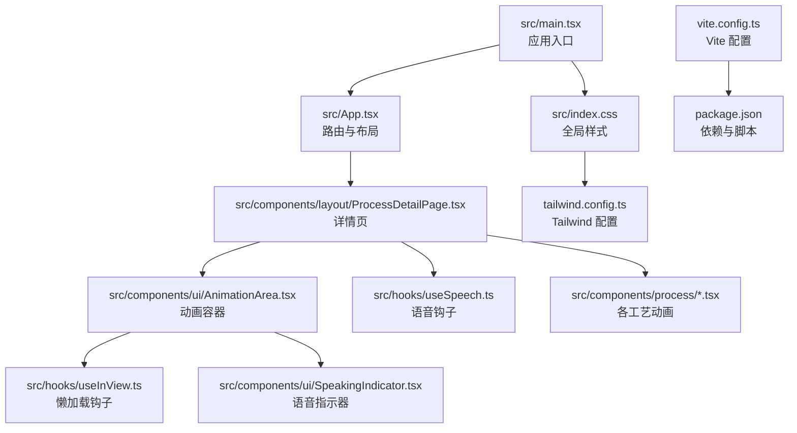
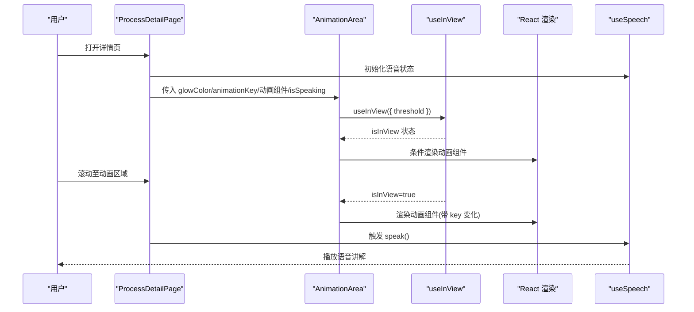
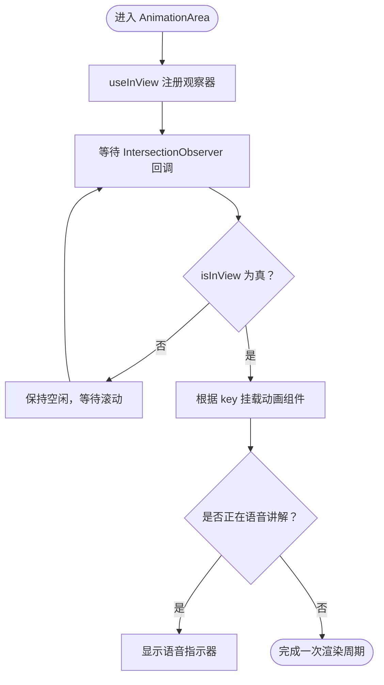
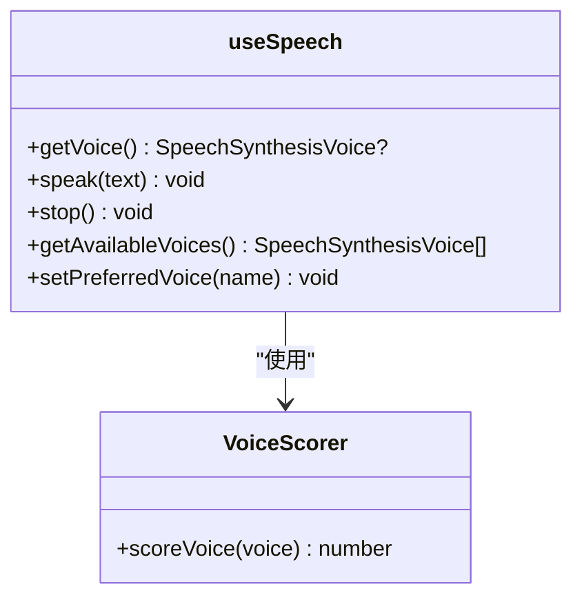
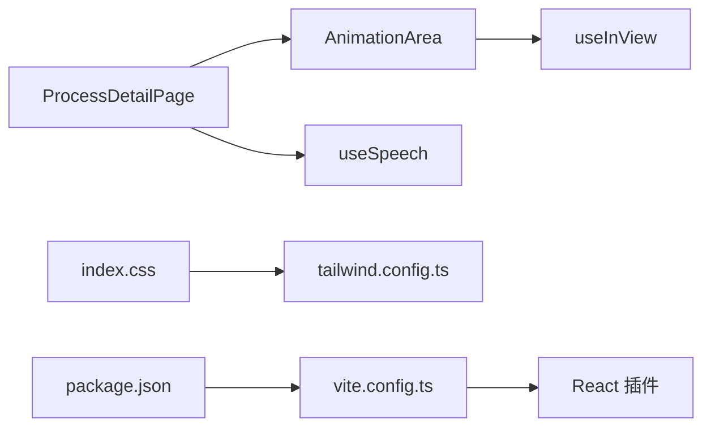

# 性能优化

<cite>
**本文引用的文件**
- [vite.config.ts](file://vite.config.ts)
- [package.json](file://package.json)
- [tailwind.config.ts](file://tailwind.config.ts)
- [postcss.config.js](file://postcss.config.js)
- [src/index.css](file://src/index.css)
- [src/lib/utils.ts](file://src/lib/utils.ts)
- [src/hooks/useInView.ts](file://src/hooks/useInView.ts)
- [src/hooks/useSpeech.ts](file://src/hooks/useSpeech.ts)
- [src/components/ui/AnimationArea.tsx](file://src/components/ui/AnimationArea.tsx)
- [src/components/ui/SpeakingIndicator.tsx](file://src/components/ui/SpeakingIndicator.tsx)
- [src/components/process/WaferManufacturing.tsx](file://src/components/process/WaferManufacturing.tsx)
- [src/components/layout/ProcessDetailPage.tsx](file://src/components/layout/ProcessDetailPage.tsx)
- [src/App.tsx](file://src/App.tsx)
- [src/main.tsx](file://src/main.tsx)
</cite>

## 目录
1. [引言](#引言)
2. [项目结构](#项目结构)
3. [核心组件](#核心组件)
4. [架构总览](#架构总览)
5. [详细组件分析](#详细组件分析)
6. [依赖关系分析](#依赖关系分析)
7. [性能考虑](#性能考虑)
8. [故障排查指南](#故障排查指南)
9. [结论](#结论)
10. [附录](#附录)

## 引言
本文件面向“芯片制造演示项目”的性能优化，聚焦以下主题：懒加载与可见性触发（Intersection Observer）、动画触发策略、Vite 构建与代码分割、Tailwind CSS 按需生成与样式优化、自定义 Hook 的性能考量与最佳实践、性能监控与分析方法、内存管理与渲染优化，以及在功能丰富性与性能之间的平衡策略。文档以仓库现有实现为基础，结合可视化图示帮助读者快速理解与落地。

## 项目结构
项目采用 React + Vite + Tailwind CSS 技术栈，采用按功能分层的目录组织方式，核心入口位于 src/main.tsx，路由与页面组件位于 src/components/layout，具体工艺流程动画组件位于 src/components/process，通用 UI 组件位于 src/components/ui，工具函数与自定义 Hook 位于 src/lib 与 src/hooks，样式通过 Tailwind 配置与 CSS 变量统一管理。

图表来源
- [src/main.tsx:1-11](file://src/main.tsx#L1-L11)
- [src/App.tsx:1-23](file://src/App.tsx#L1-L23)
- [src/components/layout/ProcessDetailPage.tsx:36-55](file://src/components/layout/ProcessDetailPage.tsx#L36-L55)
- [src/components/ui/AnimationArea.tsx:1-29](file://src/components/ui/AnimationArea.tsx#L1-L29)
- [src/hooks/useInView.ts:1-32](file://src/hooks/useInView.ts#L1-L32)
- [src/hooks/useSpeech.ts:1-135](file://src/hooks/useSpeech.ts#L1-L135)
- [src/components/ui/SpeakingIndicator.tsx:1-28](file://src/components/ui/SpeakingIndicator.tsx#L1-L28)
- [src/index.css:1-142](file://src/index.css#L1-L142)
- [tailwind.config.ts:1-143](file://tailwind.config.ts#L1-L143)
- [vite.config.ts:1-13](file://vite.config.ts#L1-L13)
- [package.json:1-45](file://package.json#L1-L45)

章节来源
- [src/main.tsx:1-11](file://src/main.tsx#L1-L11)
- [src/App.tsx:1-23](file://src/App.tsx#L1-L23)
- [vite.config.ts:1-13](file://vite.config.ts#L1-L13)
- [package.json:1-45](file://package.json#L1-L45)

## 核心组件
- 懒加载与可见性触发：useInView Hook 基于 Intersection Observer 实现元素进入视口时才渲染动画组件，减少初始渲染压力。
- 动画触发策略：AnimationArea 将 isInView 作为条件渲染依据，并通过 key 变化强制重新挂载动画组件，确保每次进入视口时重放动画。
- 语音讲解：useSpeech 提供中文语音选择、质量评分与偏好持久化，避免重复初始化与网络依赖。
- Tailwind 按需生成：tailwind.config.ts 定义内容扫描路径与动画 keyframes，配合 PostCSS 自动移除未使用样式。
- 构建与打包：Vite 默认启用 React 插件与路径别名，结合 TypeScript 编译与生产构建，形成基础的代码分割与产物优化。

章节来源
- [src/hooks/useInView.ts:1-32](file://src/hooks/useInView.ts#L1-L32)
- [src/components/ui/AnimationArea.tsx:1-29](file://src/components/ui/AnimationArea.tsx#L1-L29)
- [src/hooks/useSpeech.ts:1-135](file://src/hooks/useSpeech.ts#L1-L135)
- [tailwind.config.ts:1-143](file://tailwind.config.ts#L1-L143)
- [postcss.config.js:1-7](file://postcss.config.js#L1-L7)
- [vite.config.ts:1-13](file://vite.config.ts#L1-L13)

## 架构总览
下图展示从用户交互到动画渲染与语音播放的关键路径，体现懒加载与按需渲染的控制流。

图表来源
- [src/components/layout/ProcessDetailPage.tsx:36-55](file://src/components/layout/ProcessDetailPage.tsx#L36-L55)
- [src/components/ui/AnimationArea.tsx:1-29](file://src/components/ui/AnimationArea.tsx#L1-L29)
- [src/hooks/useInView.ts:1-32](file://src/hooks/useInView.ts#L1-L32)
- [src/hooks/useSpeech.ts:1-135](file://src/hooks/useSpeech.ts#L1-L135)

## 详细组件分析

### 懒加载与 Intersection Observer
- 实现要点
  - useInView 使用 IntersectionObserver 监听目标元素，回调中更新 isInView 状态。
  - 在依赖数组变化时重建观察器，确保阈值与边距配置生效。
  - 组件卸载时断开观察器，避免内存泄漏。
- 动画触发策略
  - AnimationArea 将 isInView 作为渲染条件；当元素进入视口后，再根据 animationKey 强制重新挂载动画组件，确保动画可重复播放。
- 复杂度与性能
  - 观察器注册/断开为 O(1)，状态更新为 O(1)；对大量动画区域，建议合理设置 threshold 与 rootMargin，降低频繁触发带来的重渲染成本。

图表来源
- [src/hooks/useInView.ts:1-32](file://src/hooks/useInView.ts#L1-L32)
- [src/components/ui/AnimationArea.tsx:1-29](file://src/components/ui/AnimationArea.tsx#L1-L29)
- [src/components/ui/SpeakingIndicator.tsx:1-28](file://src/components/ui/SpeakingIndicator.tsx#L1-L28)

章节来源
- [src/hooks/useInView.ts:1-32](file://src/hooks/useInView.ts#L1-L32)
- [src/components/ui/AnimationArea.tsx:1-29](file://src/components/ui/AnimationArea.tsx#L1-L29)

### 动画组件与 SVG 动画
- 设计模式
  - 各工艺动画组件以独立 SVG 文件导出，内部通过内联 <style> 定义动画 keyframes，避免外部样式污染。
  - 通过 CSS 动画与 transform 实现流畅过渡，减少 JS 驱动的高频重排。
- 性能考量
  - 使用 transform-origin、filter 与渐变等 GPU 友好属性，降低主线程压力。
  - 动画时长与缓动函数在 tailwind.config.ts 中集中管理，便于统一优化。

章节来源
- [src/components/process/WaferManufacturing.tsx:1-122](file://src/components/process/WaferManufacturing.tsx#L1-L122)
- [tailwind.config.ts:67-136](file://tailwind.config.ts#L67-L136)

### 语音讲解 Hook（useSpeech）
- 质量评分与偏好持久化
  - 通过 scoreVoice 对可用中文语音进行质量打分，优先本地服务与神经元语音；将首选语音名称持久化到 localStorage，避免每次加载重新选择。
- 语音事件处理
  - 在 voiceschanged 事件到来前延迟播放，保证语音列表已就绪；播放前取消队列，避免并发冲突。
- 性能与体验
  - 使用 useMemo 生成随机条形高度，避免不必要的重复计算；提供 stop 方法及时释放资源。

图表来源
- [src/hooks/useSpeech.ts:1-135](file://src/hooks/useSpeech.ts#L1-L135)

章节来源
- [src/hooks/useSpeech.ts:1-135](file://src/hooks/useSpeech.ts#L1-L135)
- [src/components/ui/SpeakingIndicator.tsx:1-28](file://src/components/ui/SpeakingIndicator.tsx#L1-L28)

### Tailwind CSS 按需生成与样式优化
- 内容扫描与动画
  - tailwind.config.ts 指定 content 路径，确保仅生成实际使用的类；内置 tailwindcss-animate 插件扩展动画能力。
- 全局样式与变量
  - src/index.css 定义 CSS 变量与图层，统一主题色、渐变、阴影与过渡；在 prefers-reduced-motion 下自动降级动画。
- 工具函数
  - src/lib/utils.ts 使用 clsx 与 tailwind-merge 合并类名，避免重复与冲突，减少运行时样式抖动。

章节来源
- [tailwind.config.ts:1-143](file://tailwind.config.ts#L1-L143)
- [src/index.css:1-142](file://src/index.css#L1-L142)
- [src/lib/utils.ts:1-7](file://src/lib/utils.ts#L1-L7)
- [postcss.config.js:1-7](file://postcss.config.js#L1-L7)

### Vite 构建优化与代码分割
- 配置要点
  - vite.config.ts 启用 @vitejs/plugin-react 并配置路径别名 @，提升开发体验与模块解析效率。
  - package.json 中 scripts 使用 tsc -b 与 vite build 串联，确保类型检查与构建顺序。
- 代码分割
  - Vite 默认基于动态导入进行代码分割；可在路由或动画组件层面进一步拆分，减少首屏包体。
- 生产优化建议
  - 开启压缩与预优化（如 esbuild），合理设置 rollupOptions 输出策略，关注体积分析与缓存策略。

章节来源
- [vite.config.ts:1-13](file://vite.config.ts#L1-L13)
- [package.json:1-45](file://package.json#L1-L45)

## 依赖关系分析
- 组件耦合
  - AnimationArea 依赖 useInView，耦合度低，便于复用。
  - ProcessDetailPage 通过 animationMap 映射动画组件，解耦具体实现。
- 外部依赖
  - React、React Router DOM、Tailwind CSS、tailwindcss-animate、PostCSS、Autoprefixer 等。
- 潜在循环依赖
  - 当前结构清晰，未见直接循环依赖；注意避免在 hooks 与组件之间引入双向依赖。

图表来源
- [src/components/ui/AnimationArea.tsx:1-29](file://src/components/ui/AnimationArea.tsx#L1-L29)
- [src/hooks/useInView.ts:1-32](file://src/hooks/useInView.ts#L1-L32)
- [src/components/layout/ProcessDetailPage.tsx:23-34](file://src/components/layout/ProcessDetailPage.tsx#L23-L34)
- [src/hooks/useSpeech.ts:1-135](file://src/hooks/useSpeech.ts#L1-L135)
- [src/index.css:1-142](file://src/index.css#L1-L142)
- [tailwind.config.ts:1-143](file://tailwind.config.ts#L1-L143)
- [vite.config.ts:1-13](file://vite.config.ts#L1-L13)
- [package.json:1-45](file://package.json#L1-L45)

章节来源
- [src/components/ui/AnimationArea.tsx:1-29](file://src/components/ui/AnimationArea.tsx#L1-L29)
- [src/components/layout/ProcessDetailPage.tsx:23-34](file://src/components/layout/ProcessDetailPage.tsx#L23-L34)
- [src/hooks/useSpeech.ts:1-135](file://src/hooks/useSpeech.ts#L1-L135)
- [tailwind.config.ts:1-143](file://tailwind.config.ts#L1-L143)
- [vite.config.ts:1-13](file://vite.config.ts#L1-L13)
- [package.json:1-45](file://package.json#L1-L45)

## 性能考虑
- 懒加载与渲染优化
  - 使用 useInView 控制动画组件渲染时机，减少首屏与非可视区域的计算与绘制。
  - 通过 key 变化强制重新挂载动画组件，确保动画可重复播放且避免状态残留。
- 动画与样式
  - 优先使用 transform、opacity、filter 等 GPU 加速属性；在 prefers-reduced-motion 下禁用复杂动画。
  - Tailwind 动画在配置中集中管理，避免运行时拼接字符串导致的样式抖动。
- 语音与资源
  - useSpeech 预取并缓存首选语音，避免重复网络请求；播放前取消队列，防止并发冲突。
- 构建与体积
  - 结合动态导入与路由拆分，减少初始包体；利用 PostCSS 与 Tailwind 按需生成，剔除未使用样式。
- 内存管理
  - 在组件卸载时断开 IntersectionObserver，清理定时器与事件监听；避免闭包持有大对象。
- 平衡功能与性能
  - 以“按需”为核心原则：只在可见时渲染动画，只在需要时播放语音；对高频交互组件进行节流/防抖与最小化状态更新。

## 故障排查指南
- 动画不触发
  - 检查 useInView 的 threshold 与 rootMargin 是否过严；确认 AnimationArea 的 isInView 条件与 key 变化逻辑。
- 语音无法播放
  - 确认浏览器支持 Web Speech API；检查 voiceschanged 事件是否触发；查看首选语音是否被持久化。
- 样式异常
  - 确认 tailwind.config.ts 的 content 路径包含当前文件；检查 PostCSS 插件链；验证 CSS 变量覆盖是否正确。
- 构建体积过大
  - 分析 Vite 产物体积，识别大依赖与未拆分模块；对动画组件与页面进行动态导入拆分。

章节来源
- [src/hooks/useInView.ts:1-32](file://src/hooks/useInView.ts#L1-L32)
- [src/components/ui/AnimationArea.tsx:1-29](file://src/components/ui/AnimationArea.tsx#L1-L29)
- [src/hooks/useSpeech.ts:1-135](file://src/hooks/useSpeech.ts#L1-L135)
- [tailwind.config.ts:1-143](file://tailwind.config.ts#L1-L143)
- [postcss.config.js:1-7](file://postcss.config.js#L1-L7)

## 结论
本项目通过 Intersection Observer 实现懒加载、以 key 变化驱动动画重放、以 useSpeech 优化语音体验、以 Tailwind 按需生成与 CSS 变量统一风格，并借助 Vite 的默认优化与路径别名提升开发与构建效率。建议在现有基础上进一步细化代码分割、引入体积分析与性能监控，持续平衡功能丰富性与性能表现。

## 附录
- 性能监控与分析方法
  - 浏览器开发者工具：Performance 面板记录帧率与长任务；Coverage 分析未使用 CSS；Network 分析资源加载与缓存命中。
  - Lighthouse：定期跑分，关注交互延迟、首屏时间与内存占用。
  - Web Vitals：在生产环境埋点，收集 INP、LCP、CLS 等指标。
- 最佳实践清单
  - 使用 transform/opacity 动画；避免在主线程执行高成本计算。
  - 合理拆分模块与路由，减少初始包体。
  - 使用 useMemo/useCallback 缓存计算结果与回调。
  - 在组件卸载时清理观察器、事件与定时器。
  - 为动画与过渡设置合理的阈值与缓动曲线，兼顾体验与性能。