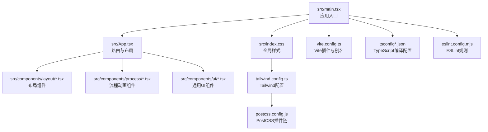
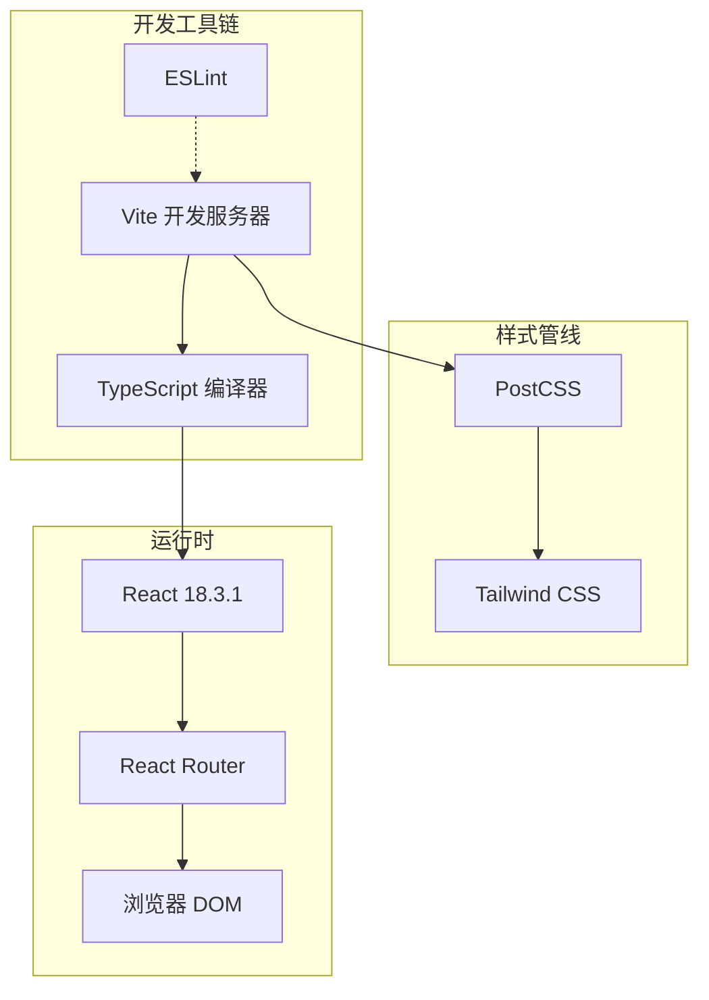
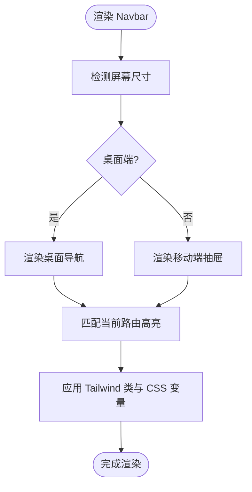
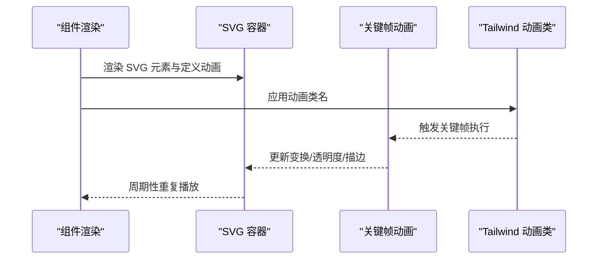
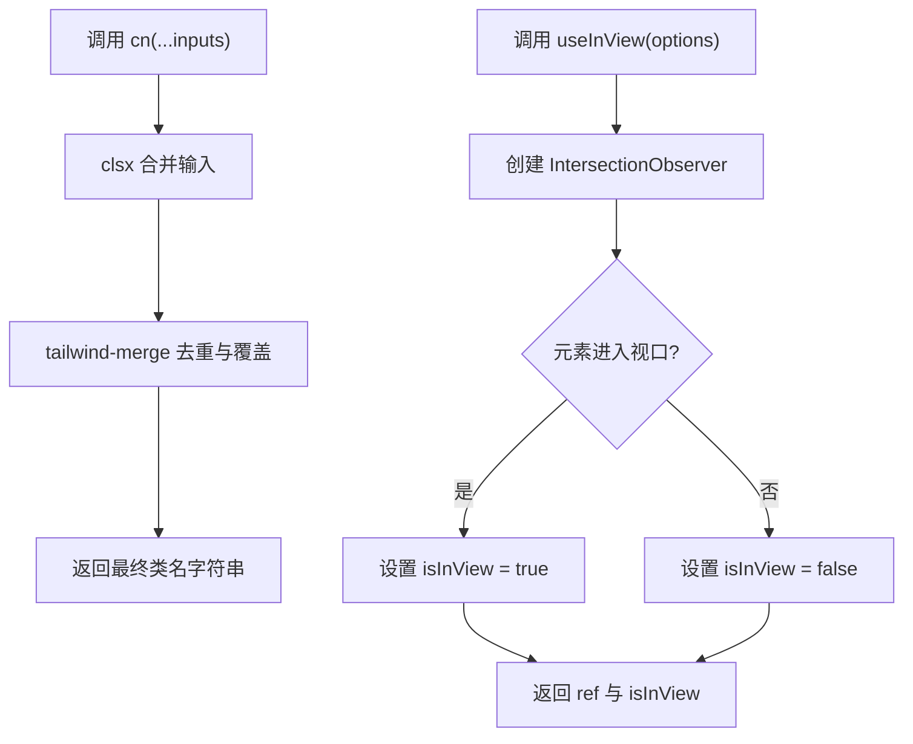
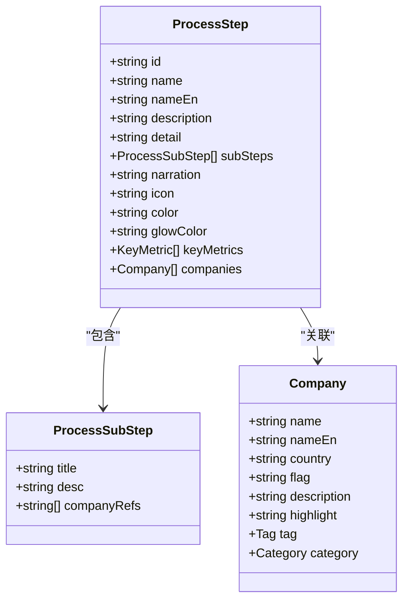
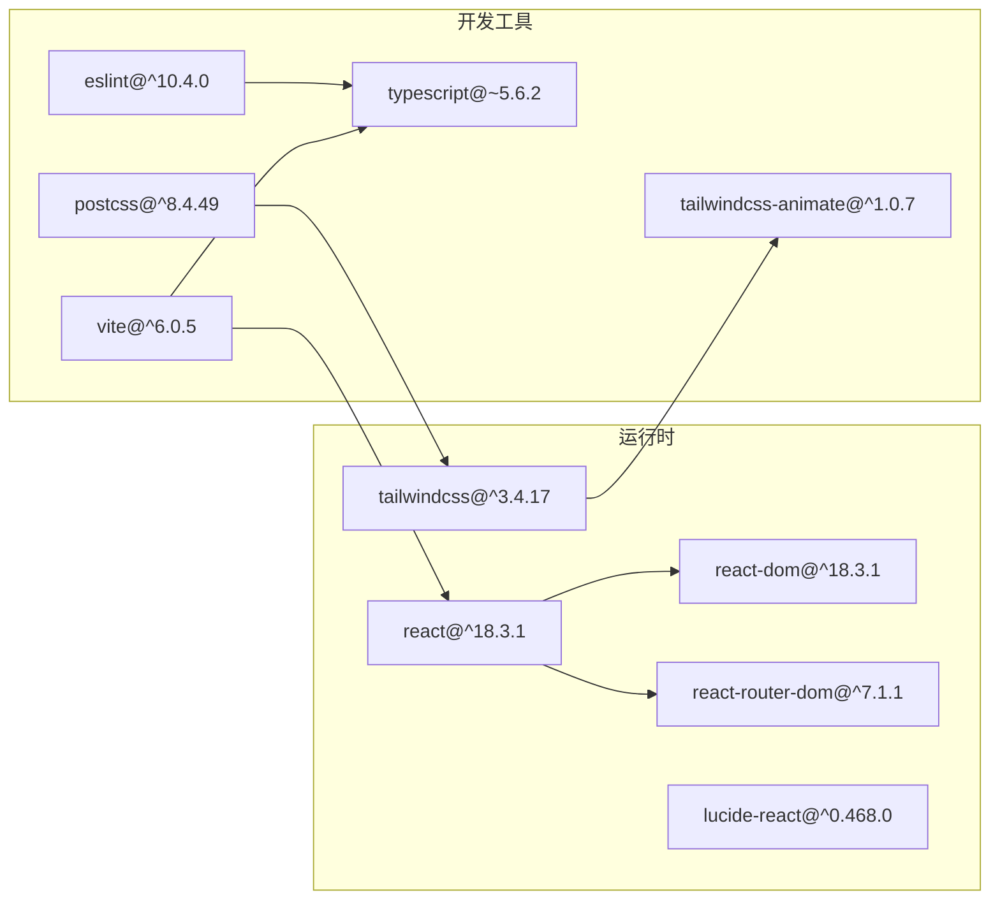
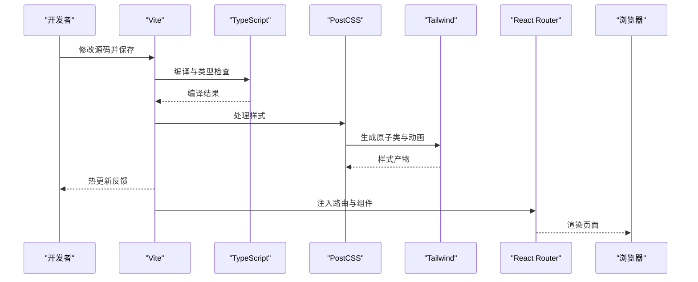

# 技术栈选择

<cite>
**本文引用的文件**
- [package.json](file://package.json)
- [vite.config.ts](file://vite.config.ts)
- [tailwind.config.ts](file://tailwind.config.ts)
- [tsconfig.json](file://tsconfig.json)
- [tsconfig.app.json](file://tsconfig.app.json)
- [postcss.config.js](file://postcss.config.js)
- [eslint.config.mjs](file://eslint.config.mjs)
- [src/main.tsx](file://src/main.tsx)
- [src/App.tsx](file://src/App.tsx)
- [src/index.css](file://src/index.css)
- [src/lib/utils.ts](file://src/lib/utils.ts)
- [src/hooks/useInView.ts](file://src/hooks/useInView.ts)
- [src/components/layout/Navbar.tsx](file://src/components/layout/Navbar.tsx)
- [src/components/process/WaferManufacturing.tsx](file://src/components/process/WaferManufacturing.tsx)
- [src/data/types.ts](file://src/data/types.ts)
</cite>

## 目录
1. [引言](#引言)
2. [项目结构](#项目结构)
3. [核心组件](#核心组件)
4. [架构总览](#架构总览)
5. [详细组件分析](#详细组件分析)
6. [依赖关系分析](#依赖关系分析)
7. [性能考量](#性能考量)
8. [故障排查指南](#故障排查指南)
9. [结论](#结论)
10. [附录](#附录)

## 引言
本技术栈选择文档面向“芯片制造演示项目”，系统阐述为何采用 React 18.3.1 + TypeScript + Vite + Tailwind CSS 的组合，并从优势、适用场景、协同机制、配置与最佳实践、升级路径与兼容性、以及对架构与开发体验的影响等维度进行深入解析。该组合在开发效率、类型安全、构建性能与样式一致性方面形成良好互补，适合教育类可视化演示应用。

## 项目结构
该项目采用以功能域为中心的组织方式：页面与组件分层清晰，数据模型与工具函数独立存放，构建与样式配置集中管理。核心入口通过 React 渲染器挂载到 DOM；路由由 React Router 管理；Tailwind CSS 提供原子化样式与主题变量；TypeScript 提供类型安全保障；Vite 负责开发服务器与打包。

图表来源
- [src/main.tsx:1-11](file://src/main.tsx#L1-L11)
- [src/App.tsx:1-23](file://src/App.tsx#L1-L23)
- [vite.config.ts:1-13](file://vite.config.ts#L1-L13)
- [tailwind.config.ts:1-143](file://tailwind.config.ts#L1-L143)
- [postcss.config.js:1-7](file://postcss.config.js#L1-L7)
- [tsconfig.json:1-7](file://tsconfig.json#L1-L7)
- [tsconfig.app.json:1-26](file://tsconfig.app.json#L1-L26)
- [eslint.config.mjs:1-45](file://eslint.config.mjs#L1-L45)

章节来源
- [src/main.tsx:1-11](file://src/main.tsx#L1-L11)
- [src/App.tsx:1-23](file://src/App.tsx#L1-L23)
- [vite.config.ts:1-13](file://vite.config.ts#L1-L13)
- [tailwind.config.ts:1-143](file://tailwind.config.ts#L1-L143)
- [postcss.config.js:1-7](file://postcss.config.js#L1-L7)
- [tsconfig.json:1-7](file://tsconfig.json#L1-L7)
- [tsconfig.app.json:1-26](file://tsconfig.app.json#L1-L26)
- [eslint.config.mjs:1-45](file://eslint.config.mjs#L1-L45)

## 核心组件
- 应用入口与渲染：使用 React 18 的严格模式与根节点渲染，确保并发特性的正确初始化。
- 路由与布局：基于 React Router 的 SPA 结构，支持导航与动态路由参数。
- 主题与样式：通过 Tailwind CSS 的变量系统与暗色模式支持，结合 PostCSS 自动前缀与构建优化。
- 类名合并：使用 clsx 与 tailwind-merge 实现可维护的条件类名拼接。
- 可视化动画：部分流程采用 SVG 动画，配合 Tailwind 关键帧与动画类实现科技感视觉效果。
- 数据模型：通过 TypeScript 接口定义公司、流程步骤与子步骤的数据结构，提升可读性与可维护性。

章节来源
- [src/main.tsx:1-11](file://src/main.tsx#L1-L11)
- [src/App.tsx:1-23](file://src/App.tsx#L1-L23)
- [src/index.css:1-142](file://src/index.css#L1-L142)
- [src/lib/utils.ts:1-7](file://src/lib/utils.ts#L1-L7)
- [src/components/process/WaferManufacturing.tsx:1-122](file://src/components/process/WaferManufacturing.tsx#L1-L122)
- [src/data/types.ts:1-33](file://src/data/types.ts#L1-L33)

## 架构总览
下图展示了前端技术栈在运行时的协作关系：Vite 在开发态提供热更新与按需编译；TypeScript 在构建前进行类型检查与模块解析；Tailwind CSS 通过 PostCSS 插件链生成最终样式；React 负责组件渲染与状态管理；路由负责页面级导航。

图表来源
- [vite.config.ts:1-13](file://vite.config.ts#L1-L13)
- [tsconfig.app.json:1-26](file://tsconfig.app.json#L1-L26)
- [postcss.config.js:1-7](file://postcss.config.js#L1-L7)
- [tailwind.config.ts:1-143](file://tailwind.config.ts#L1-L143)
- [eslint.config.mjs:1-45](file://eslint.config.mjs#L1-L45)
- [src/main.tsx:1-11](file://src/main.tsx#L1-L11)
- [src/App.tsx:1-23](file://src/App.tsx#L1-L23)

## 详细组件分析

### 组件一：导航栏（Navbar）
- 功能要点：响应式导航、移动端抽屉菜单、根据当前路由高亮激活项、图标与渐变样式。
- 技术要点：React Router 的 useLocation 获取路径；Lucide 图标库提供矢量图标；Tailwind 原子类与自定义变量实现主题化；移动端交互通过状态控制展开/收起。
- 协同机制：与路由组件联动，实现导航与内容区的解耦；样式通过全局 CSS 变量与 Tailwind 扩展统一风格。

图表来源
- [src/components/layout/Navbar.tsx:1-82](file://src/components/layout/Navbar.tsx#L1-L82)
- [src/index.css:1-142](file://src/index.css#L1-L142)
- [tailwind.config.ts:1-143](file://tailwind.config.ts#L1-L143)

章节来源
- [src/components/layout/Navbar.tsx:1-82](file://src/components/layout/Navbar.tsx#L1-L82)
- [src/index.css:1-142](file://src/index.css#L1-L142)
- [tailwind.config.ts:1-143](file://tailwind.config.ts#L1-L143)

### 组件二：晶圆制造动画（WaferManufacturing）
- 功能要点：SVG 动画展示 CZ 法提拉与线锯切割过程，包含旋转指示、震动线锯、粒子火花与多层晶圆堆叠。
- 技术要点：内联 CSS 动画与关键帧；使用 CSS 变量控制延迟；通过 React 属性传递动画参数；Tailwind 动画类与自定义 keyframes 协同。
- 协同机制：动画与主题色板一致，强调科技感与沉浸感；类名合并工具保证复杂类名的可维护性。

图表来源
- [src/components/process/WaferManufacturing.tsx:1-122](file://src/components/process/WaferManufacturing.tsx#L1-L122)
- [tailwind.config.ts:67-136](file://tailwind.config.ts#L67-L136)

章节来源
- [src/components/process/WaferManufacturing.tsx:1-122](file://src/components/process/WaferManufacturing.tsx#L1-L122)
- [tailwind.config.ts:67-136](file://tailwind.config.ts#L67-L136)

### 工具与钩子：类名合并与视口观察
- 类名合并（cn）：结合 clsx 与 tailwind-merge，避免冲突类名叠加，简化条件类拼接。
- 视口观察（useInView）：基于 IntersectionObserver 的自定义 Hook，支持阈值与外边距配置，便于懒加载与滚动触发动画。

图表来源
- [src/lib/utils.ts:1-7](file://src/lib/utils.ts#L1-L7)
- [src/hooks/useInView.ts:1-32](file://src/hooks/useInView.ts#L1-L32)

章节来源
- [src/lib/utils.ts:1-7](file://src/lib/utils.ts#L1-L7)
- [src/hooks/useInView.ts:1-32](file://src/hooks/useInView.ts#L1-L32)

### 数据模型：流程与企业信息
- 使用 TypeScript 接口定义流程步骤、子步骤与企业信息，明确字段语义与可选性，便于后续扩展与类型推断。

图表来源
- [src/data/types.ts:1-33](file://src/data/types.ts#L1-L33)

章节来源
- [src/data/types.ts:1-33](file://src/data/types.ts#L1-L33)

## 依赖关系分析
- 运行时依赖：React 18.3.1 与 React DOM 提供渲染与并发能力；react-router-dom 管理路由；Tailwind 生态包提供样式与动画；图标库 lucide-react 提供一致的矢量图标。
- 开发依赖：Vite 作为构建与开发工具；TypeScript 提供类型系统；Tailwind CSS 与 Autoprefixer 配合 PostCSS；ESLint 与 Prettier 保障代码质量与风格一致。
- 配置耦合：Vite 通过插件与路径别名集成 React；Tailwind 通过 PostCSS 插件链与配置文件生成样式；TypeScript 通过 tsconfig 控制模块解析与严格模式。

图表来源
- [package.json:15-44](file://package.json#L15-L44)
- [vite.config.ts:1-13](file://vite.config.ts#L1-L13)
- [postcss.config.js:1-7](file://postcss.config.js#L1-L7)
- [tailwind.config.ts:1-143](file://tailwind.config.ts#L1-L143)
- [eslint.config.mjs:1-45](file://eslint.config.mjs#L1-L45)

章节来源
- [package.json:15-44](file://package.json#L15-L44)
- [vite.config.ts:1-13](file://vite.config.ts#L1-L13)
- [postcss.config.js:1-7](file://postcss.config.js#L1-L7)
- [tailwind.config.ts:1-143](file://tailwind.config.ts#L1-L143)
- [eslint.config.mjs:1-45](file://eslint.config.mjs#L1-L45)

## 性能考量
- 构建性能：Vite 的原生 ESM 与按需编译显著缩短冷启动与热更新时间；TypeScript 与 Vite 并行处理，减少二次编译开销。
- 样式体积：Tailwind 通过内容扫描仅生成实际使用的类，结合 PostCSS 压缩与 Tree Shaking，降低产物体积。
- 运行时性能：React 18 的并发特性与 Suspense 支持有助于提升首屏与交互体验；SVG 动画在现代浏览器中具备良好性能表现。
- 代码质量：ESLint 与 Prettier 在开发阶段即约束风格与潜在问题，减少后期调试成本。

## 故障排查指南
- 开发服务器无法启动或热更新异常
  - 检查 Vite 插件与别名配置是否正确。
  - 章节来源
    - [vite.config.ts:1-13](file://vite.config.ts#L1-L13)
- 样式未生效或 Tailwind 类不识别
  - 确认 Tailwind 内容扫描路径与 PostCSS 插件链配置。
  - 章节来源
    - [tailwind.config.ts:5-8](file://tailwind.config.ts#L5-L8)
    - [postcss.config.js:1-7](file://postcss.config.js#L1-L7)
- TypeScript 类型错误
  - 对照 tsconfig 的严格选项与模块解析策略，逐项修正类型问题。
  - 章节来源
    - [tsconfig.app.json:2-22](file://tsconfig.app.json#L2-L22)
- ESLint 报错
  - 根据规则配置调整代码风格或忽略特定规则，保持团队一致性。
  - 章节来源
    - [eslint.config.mjs:26-38](file://eslint.config.mjs#L26-L38)

## 结论
该技术栈在本项目中实现了“快速迭代、类型安全、样式一致、构建高效”的目标。React 18 的并发能力与 Hooks 生态支撑复杂交互；TypeScript 明确数据契约，降低维护成本；Vite 提供卓越的开发体验；Tailwind CSS 则确保设计系统的一致性与可扩展性。整体方案适合教育类可视化演示应用，兼顾教学价值与工程实践。

## 附录

### 技术栈协同工作机制
- Vite 作为统一入口，串联开发与构建流程，自动注入 React 插件与路径别名。
- TypeScript 在构建前进行类型检查与模块解析，确保运行时稳定性。
- Tailwind 通过 PostCSS 插件链生成原子类，结合暗色模式与自定义动画，统一视觉语言。
- React Router 管理页面级导航，与布局组件解耦，便于扩展新页面。

图表来源
- [vite.config.ts:1-13](file://vite.config.ts#L1-L13)
- [tsconfig.app.json:1-26](file://tsconfig.app.json#L1-L26)
- [postcss.config.js:1-7](file://postcss.config.js#L1-L7)
- [tailwind.config.ts:1-143](file://tailwind.config.ts#L1-L143)
- [src/App.tsx:1-23](file://src/App.tsx#L1-L23)

### 配置与最佳实践
- Vite
  - 使用插件与路径别名，提升导入便捷性与可维护性。
  - 章节来源
    - [vite.config.ts:1-13](file://vite.config.ts#L1-L13)
- TypeScript
  - 严格模式与无副作用导入，结合路径映射，提升类型准确性。
  - 章节来源
    - [tsconfig.app.json:2-22](file://tsconfig.app.json#L2-L22)
- Tailwind CSS
  - 内容扫描范围覆盖源码与模板，启用暗色模式与动画插件，合理拆分主题变量。
  - 章节来源
    - [tailwind.config.ts:5-8](file://tailwind.config.ts#L5-L8)
    - [tailwind.config.ts:139](file://tailwind.config.ts#L139)
    - [src/index.css:5-57](file://src/index.css#L5-L57)
- ESLint/Prettier
  - 统一规则与忽略目录，结合 React/React-Hooks 规则，减少心智负担。
  - 章节来源
    - [eslint.config.mjs:26-44](file://eslint.config.mjs#L26-L44)

### 升级路径与兼容性
- React 18 → React 19
  - 关注并发特性与新 Hooks 的演进；逐步迁移 Suspense 边界与错误边界。
- TypeScript
  - 保持与 Vite 的模块解析策略一致；关注严格模式变更带来的类型修复。
- Vite
  - 关注插件生态与实验特性；优先升级稳定版本，保留向后兼容的别名与插件配置。
- Tailwind CSS
  - 关注新版本的语法变化与移除的旧特性；提前在测试环境验证动画与变量。