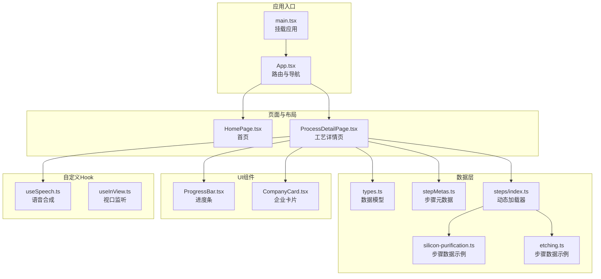
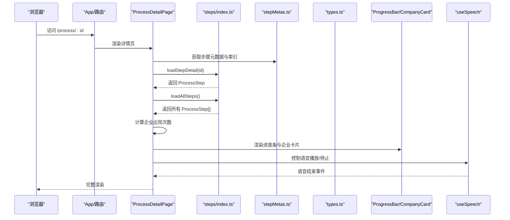
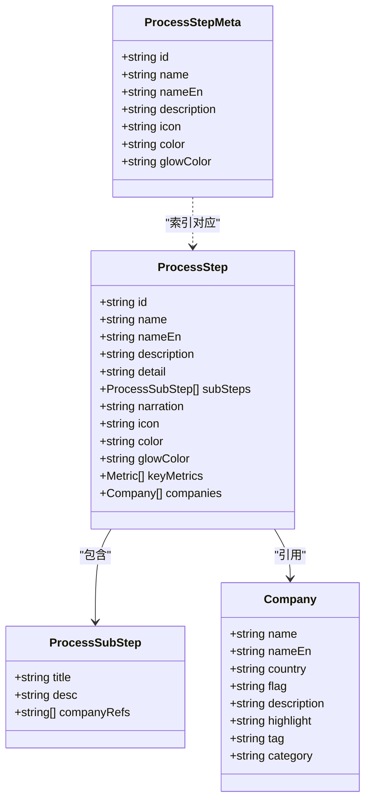
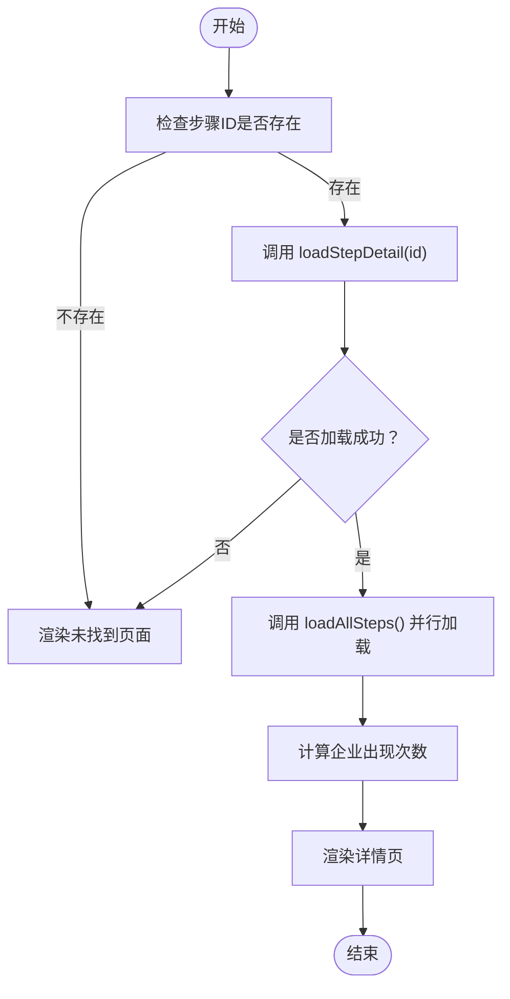
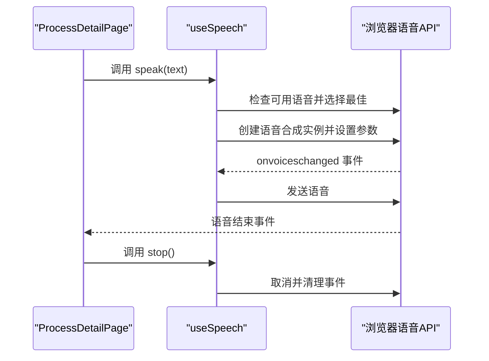
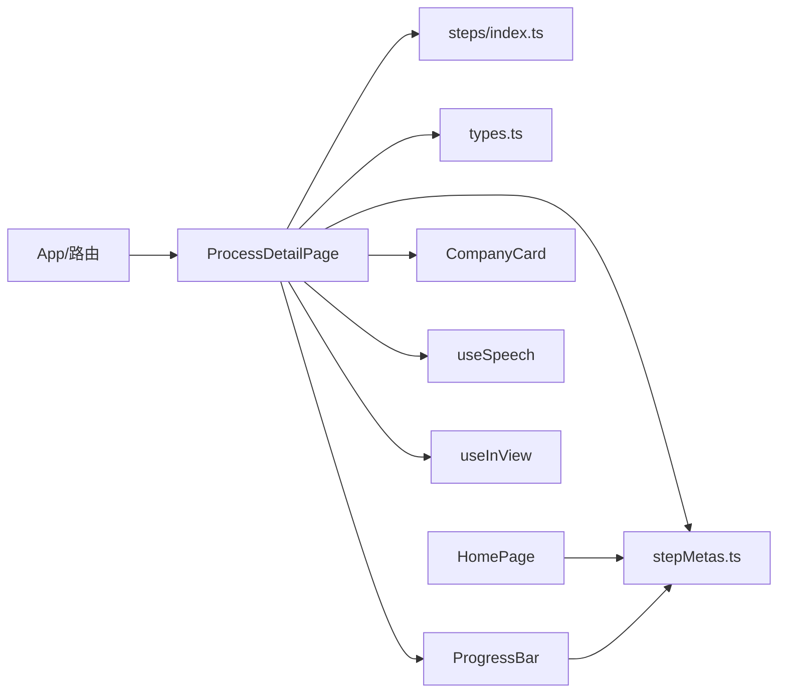

# 数据流设计

<cite>
**本文引用的文件**
- [src/App.tsx](file://src/App.tsx)
- [src/main.tsx](file://src/main.tsx)
- [src/data/types.ts](file://src/data/types.ts)
- [src/data/stepMetas.ts](file://src/data/stepMetas.ts)
- [src/data/processes.ts](file://src/data/processes.ts)
- [src/data/steps/index.ts](file://src/data/steps/index.ts)
- [src/data/steps/silicon-purification.ts](file://src/data/steps/silicon-purification.ts)
- [src/data/steps/etching.ts](file://src/data/steps/etching.ts)
- [src/components/layout/ProcessDetailPage.tsx](file://src/components/layout/ProcessDetailPage.tsx)
- [src/components/layout/HomePage.tsx](file://src/components/layout/HomePage.tsx)
- [src/components/ui/ProgressBar.tsx](file://src/components/ui/ProgressBar.tsx)
- [src/components/ui/CompanyCard.tsx](file://src/components/ui/CompanyCard.tsx)
- [src/hooks/useSpeech.ts](file://src/hooks/useSpeech.ts)
- [src/hooks/useInView.ts](file://src/hooks/useInView.ts)
- [src/lib/utils.ts](file://src/lib/utils.ts)
</cite>

## 目录
1. [简介](#简介)
2. [项目结构](#项目结构)
3. [核心组件](#核心组件)
4. [架构总览](#架构总览)
5. [详细组件分析](#详细组件分析)
6. [依赖分析](#依赖分析)
7. [性能考虑](#性能考虑)
8. [故障排查指南](#故障排查指南)
9. [结论](#结论)
10. [附录](#附录)

## 简介
本文件面向“芯片制造演示项目”的数据流设计，系统阐述从数据配置到UI渲染的完整流程，包括数据模型层次、数据加载与缓存策略、自定义Hook在数据流中的作用、数据验证与错误处理机制，以及如何扩展新的数据源与数据模型。文档以可视化图表呈现数据在系统中的流转过程，帮助开发者与非技术读者共同理解数据驱动渲染的实现机制。

## 项目结构
该项目采用按功能模块组织的前端架构，核心目录与职责如下：
- src/data：数据模型与数据加载入口，包含类型定义、步骤元数据、步骤详情加载器与具体步骤数据。
- src/components：页面与UI组件，包含布局组件（如主页、详情页、导航）、通用UI组件（进度条、企业卡片）与各工艺动画组件。
- src/hooks：自定义Hook，负责视口监听与语音合成。
- src/lib：工具函数（如类名合并）。
- src/App.tsx 与 src/main.tsx：应用入口与路由配置。

**图表来源**
- [src/main.tsx:1-11](file://src/main.tsx#L1-L11)
- [src/App.tsx:1-23](file://src/App.tsx#L1-L23)
- [src/components/layout/HomePage.tsx:1-85](file://src/components/layout/HomePage.tsx#L1-L85)
- [src/components/layout/ProcessDetailPage.tsx:1-397](file://src/components/layout/ProcessDetailPage.tsx#L1-L397)
- [src/data/stepMetas.ts:1-103](file://src/data/stepMetas.ts#L1-L103)
- [src/data/steps/index.ts:1-34](file://src/data/steps/index.ts#L1-L34)
- [src/data/steps/silicon-purification.ts:1-121](file://src/data/steps/silicon-purification.ts#L1-L121)
- [src/data/steps/etching.ts:1-142](file://src/data/steps/etching.ts#L1-L142)
- [src/components/ui/ProgressBar.tsx:1-60](file://src/components/ui/ProgressBar.tsx#L1-L60)
- [src/components/ui/CompanyCard.tsx:1-159](file://src/components/ui/CompanyCard.tsx#L1-L159)
- [src/hooks/useSpeech.ts:1-135](file://src/hooks/useSpeech.ts#L1-L135)
- [src/hooks/useInView.ts:1-32](file://src/hooks/useInView.ts#L1-L32)

**章节来源**
- [src/main.tsx:1-11](file://src/main.tsx#L1-L11)
- [src/App.tsx:1-23](file://src/App.tsx#L1-L23)

## 核心组件
- 数据模型与类型
  - Company：企业信息，包含名称、英文名、国家、旗帜、描述、亮点、标签与类别。
  - ProcessSubStep：子步骤，包含标题、描述与公司引用列表。
  - ProcessStep：工艺步骤，包含标识、名称、英文名、描述、详情、子步骤、讲解文本、图标、颜色、高亮色、关键指标、企业列表。
- 步骤元数据：processStepMetas 提供每个步骤的元信息（id、名称、英文名、描述、图标、颜色、高光色）。
- 动态加载器：steps/index.ts 提供按需加载单个步骤与批量加载所有步骤的能力，使用动态 import 实现代码分割。
- 页面与组件：
  - ProcessDetailPage：负责加载步骤详情、计算企业出现次数、控制语音与动画、渲染进度条与企业卡片。
  - ProgressBar：基于当前索引显示进度与步骤指示器。
  - CompanyCard：渲染企业卡片，支持按标签分组与高亮展示。
- 自定义Hook：
  - useSpeech：封装中文语音合成，自动选择最佳中文语音、缓存偏好、处理加载完成事件。
  - useInView：基于 IntersectionObserver 的视口监听Hook。

**章节来源**
- [src/data/types.ts:1-33](file://src/data/types.ts#L1-L33)
- [src/data/stepMetas.ts:1-103](file://src/data/stepMetas.ts#L1-L103)
- [src/data/steps/index.ts:1-34](file://src/data/steps/index.ts#L1-L34)
- [src/components/layout/ProcessDetailPage.tsx:1-397](file://src/components/layout/ProcessDetailPage.tsx#L1-L397)
- [src/components/ui/ProgressBar.tsx:1-60](file://src/components/ui/ProgressBar.tsx#L1-L60)
- [src/components/ui/CompanyCard.tsx:1-159](file://src/components/ui/CompanyCard.tsx#L1-L159)
- [src/hooks/useSpeech.ts:1-135](file://src/hooks/useSpeech.ts#L1-L135)
- [src/hooks/useInView.ts:1-32](file://src/hooks/useInView.ts#L1-L32)

## 架构总览
数据驱动渲染的总体流程：
- 路由层：App.tsx 声明路由，HomePage 提供入口，ProcessDetailPage 处理参数与数据加载。
- 数据层：ProcessDetailPage 通过 steps/index.ts 按需加载当前步骤详情；同时加载全部步骤以统计企业出现次数。
- 渲染层：根据 ProcessStep 数据渲染动画区、讲解文本、关键指标、子步骤与企业卡片；ProgressBar 展示进度；useSpeech 控制语音播放。
- Hook 层：useSpeech 管理语音偏好与播放；useInView 可用于动画区可见性控制（在组件中保留了相关状态与事件清理）。

**图表来源**
- [src/App.tsx:1-23](file://src/App.tsx#L1-L23)
- [src/components/layout/ProcessDetailPage.tsx:1-397](file://src/components/layout/ProcessDetailPage.tsx#L1-L397)
- [src/data/steps/index.ts:1-34](file://src/data/steps/index.ts#L1-L34)
- [src/data/stepMetas.ts:1-103](file://src/data/stepMetas.ts#L1-L103)
- [src/hooks/useSpeech.ts:1-135](file://src/hooks/useSpeech.ts#L1-L135)

## 详细组件分析

### 数据模型与关系
数据模型采用扁平化对象组合，层次清晰：
- ProcessStep 包含多个 ProcessSubStep，并引用 Company 列表。
- Company 作为独立实体，被多个步骤共享引用。
- 步骤元数据 ProcessStepMeta 仅包含展示所需字段，不包含详细内容，便于导航与进度条渲染。

**图表来源**
- [src/data/types.ts:1-33](file://src/data/types.ts#L1-L33)
- [src/data/stepMetas.ts:1-103](file://src/data/stepMetas.ts#L1-L103)

**章节来源**
- [src/data/types.ts:1-33](file://src/data/types.ts#L1-L33)
- [src/data/stepMetas.ts:1-103](file://src/data/stepMetas.ts#L1-L103)

### 数据加载与缓存策略
- 动态加载（按需加载）
  - steps/index.ts 使用映射表记录每个步骤的模块路径，loadStepDetail(id) 通过动态 import 加载对应模块并返回默认导出的 ProcessStep。
  - loadAllSteps() 并行加载所有步骤模块，保持与映射表一致的顺序。
- 缓存策略
  - 当前实现未在应用层设置持久缓存；动态 import 的模块由浏览器缓存机制与打包器处理，重复访问同一模块时可复用。
  - 企业出现次数 companyStepCounts 在组件内存中计算并缓存，避免重复遍历。
- 错误处理
  - loadStepDetail 对未知 id 返回空值；ProcessDetailPage 在无匹配元数据时渲染“未找到”提示。
  - useSpeech 对不支持 Web Speech API 的环境输出警告，不影响主流程。

**图表来源**
- [src/components/layout/ProcessDetailPage.tsx:1-397](file://src/components/layout/ProcessDetailPage.tsx#L1-L397)
- [src/data/steps/index.ts:1-34](file://src/data/steps/index.ts#L1-L34)

**章节来源**
- [src/data/steps/index.ts:1-34](file://src/data/steps/index.ts#L1-L34)
- [src/components/layout/ProcessDetailPage.tsx:1-397](file://src/components/layout/ProcessDetailPage.tsx#L1-L397)

### 自定义Hook在数据流中的作用
- useSpeech
  - 选择最佳中文语音：根据关键词、本地服务、语言区域与品牌偏好打分，优先神经音质与本地服务。
  - 缓存偏好：将用户选择的语音名称保存到 localStorage，下次直接恢复。
  - 语音事件：等待 onvoiceschanged 事件确保可用语音加载完成后再播放。
  - 在 ProcessDetailPage 中，点击语音按钮切换播放/停止，并监听结束事件更新状态。
- useInView
  - 通过 IntersectionObserver 监听元素进入视口，可用于动画区懒加载或节流触发。
  - 组件中保留了相关状态与事件清理，便于后续接入动画区的可见性控制。

**图表来源**
- [src/hooks/useSpeech.ts:1-135](file://src/hooks/useSpeech.ts#L1-L135)
- [src/components/layout/ProcessDetailPage.tsx:1-397](file://src/components/layout/ProcessDetailPage.tsx#L1-L397)

**章节来源**
- [src/hooks/useSpeech.ts:1-135](file://src/hooks/useSpeech.ts#L1-L135)
- [src/hooks/useInView.ts:1-32](file://src/hooks/useInView.ts#L1-L32)
- [src/components/layout/ProcessDetailPage.tsx:1-397](file://src/components/layout/ProcessDetailPage.tsx#L1-L397)

### 数据验证与错误处理机制
- 参数校验
  - ProcessDetailPage 读取路由参数 id，若为空则不发起加载。
  - loadStepDetail 对未知 id 返回空值；ProcessDetailPage 在无匹配元数据时渲染“未找到”页面。
- 运行时容错
  - useSpeech 在不支持 speechSynthesis 时输出警告并终止播放。
  - 语音事件监听在组件卸载时清理，避免内存泄漏。
- 数据一致性
  - 通过 useMemo 构建 companyMap，确保 subSteps 的 companyRefs 能正确解析到企业对象。
  - 通过 processStepMetas 的顺序保证进度条与导航项的稳定性。

**章节来源**
- [src/components/layout/ProcessDetailPage.tsx:1-397](file://src/components/layout/ProcessDetailPage.tsx#L1-L397)
- [src/hooks/useSpeech.ts:1-135](file://src/hooks/useSpeech.ts#L1-L135)

### 扩展新的数据源与数据模型
- 扩展步骤数据
  - 在 src/data/steps 下新增步骤文件（导出 ProcessStep），并在 steps/index.ts 的映射表中注册。
  - 在 src/data/stepMetas.ts 中添加对应的 ProcessStepMeta，确保导航与进度条正常显示。
- 扩展企业信息
  - 在步骤数据中为 Company 字段补充必要字段（名称、英文名、国家、旗帜、描述、亮点、标签、类别）。
  - 若需新增标签或类别，可在 types.ts 中扩展枚举或联合类型，并在渲染组件中适配样式与过滤逻辑。
- 扩展页面与组件
  - 在 ProcessDetailPage 中新增动画组件映射与依赖导入。
  - 如需新的交互行为，可在组件中新增状态与副作用，并结合 useSpeech/useInView 等Hook。

**章节来源**
- [src/data/steps/index.ts:1-34](file://src/data/steps/index.ts#L1-L34)
- [src/data/stepMetas.ts:1-103](file://src/data/stepMetas.ts#L1-L103)
- [src/data/types.ts:1-33](file://src/data/types.ts#L1-L33)
- [src/components/layout/ProcessDetailPage.tsx:1-397](file://src/components/layout/ProcessDetailPage.tsx#L1-L397)

## 依赖分析
- 组件间依赖
  - ProcessDetailPage 依赖 steps/index.ts、stepMetas.ts、types.ts、ProgressBar、CompanyCard、useSpeech。
  - HomePage 依赖 stepMetas.ts 与导航组件。
  - ProgressBar 依赖 stepMetas.ts。
  - CompanyCard 依赖 types.ts。
  - useSpeech 与 useInView 为独立Hook，被页面与组件复用。
- 数据流向
  - 路由参数 → ProcessDetailPage → 动态加载器 → 步骤数据 → 渲染组件。
  - 元数据 → 进度条与导航 → 页面布局。
  - 企业数据 → 企业卡片 → 分组展示。

**图表来源**
- [src/App.tsx:1-23](file://src/App.tsx#L1-L23)
- [src/components/layout/ProcessDetailPage.tsx:1-397](file://src/components/layout/ProcessDetailPage.tsx#L1-L397)
- [src/data/steps/index.ts:1-34](file://src/data/steps/index.ts#L1-L34)
- [src/data/stepMetas.ts:1-103](file://src/data/stepMetas.ts#L1-L103)
- [src/data/types.ts:1-33](file://src/data/types.ts#L1-L33)
- [src/components/ui/ProgressBar.tsx:1-60](file://src/components/ui/ProgressBar.tsx#L1-L60)
- [src/components/ui/CompanyCard.tsx:1-159](file://src/components/ui/CompanyCard.tsx#L1-L159)
- [src/hooks/useSpeech.ts:1-135](file://src/hooks/useSpeech.ts#L1-L135)
- [src/hooks/useInView.ts:1-32](file://src/hooks/useInView.ts#L1-L32)

**章节来源**
- [src/App.tsx:1-23](file://src/App.tsx#L1-L23)
- [src/components/layout/ProcessDetailPage.tsx:1-397](file://src/components/layout/ProcessDetailPage.tsx#L1-L397)

## 性能考虑
- 代码分割与按需加载
  - 通过动态 import 将每个步骤的数据拆分为独立模块，减少首屏体积，提升初始加载速度。
- 并行加载
  - loadAllSteps 使用 Promise.all 并行加载所有步骤，缩短统计企业出现次数的时间。
- 内存缓存
  - 企业出现次数在组件内缓存，避免重复计算。
- 视口监听
  - useInView 基于 IntersectionObserver，性能开销低，适合动画区懒加载场景。
- 语音性能
  - 语音偏好缓存到 localStorage，避免每次播放都重新评分与选择。

[本节为通用性能建议，无需特定文件引用]

## 故障排查指南
- 页面空白或未找到步骤
  - 检查步骤ID是否存在于 steps/index.ts 的映射表与 stepMetas.ts 的元数据中。
  - 确认步骤数据文件导出的是 ProcessStep 类型。
- 语音无法播放
  - 确认浏览器支持 Web Speech API；在不支持环境下会输出警告但不会阻塞页面。
  - 检查 onvoiceschanged 事件是否触发，确保语音资源加载完成。
- 企业标签或图标不显示
  - 确保 Company 的 tag 与 category 符合 types.ts 的定义，渲染组件中已提供映射样式。
- 动画不重播
  - 点击重播按钮会增加 animationKey，触发子组件重新挂载；确认按钮事件绑定与状态更新。

**章节来源**
- [src/components/layout/ProcessDetailPage.tsx:1-397](file://src/components/layout/ProcessDetailPage.tsx#L1-L397)
- [src/hooks/useSpeech.ts:1-135](file://src/hooks/useSpeech.ts#L1-L135)
- [src/data/steps/index.ts:1-34](file://src/data/steps/index.ts#L1-L34)

## 结论
本项目通过清晰的数据模型、按需加载与并行处理、以及自定义Hook的封装，实现了高效、可维护的数据驱动渲染。步骤元数据与详情数据分离，既保证了导航与进度条的轻量，又允许详情页按需加载丰富内容。未来可通过扩展步骤数据与元数据、完善缓存策略与错误回退，进一步提升用户体验与可扩展性。

## 附录
- 工具函数：cn 用于类名合并，简化样式拼接。
- 示例数据：silicon-purification.ts 与 etching.ts 提供了完整的 ProcessStep 示例，可作为新增步骤的模板。

**章节来源**
- [src/lib/utils.ts:1-7](file://src/lib/utils.ts#L1-L7)
- [src/data/steps/silicon-purification.ts:1-121](file://src/data/steps/silicon-purification.ts#L1-L121)
- [src/data/steps/etching.ts:1-142](file://src/data/steps/etching.ts#L1-L142)