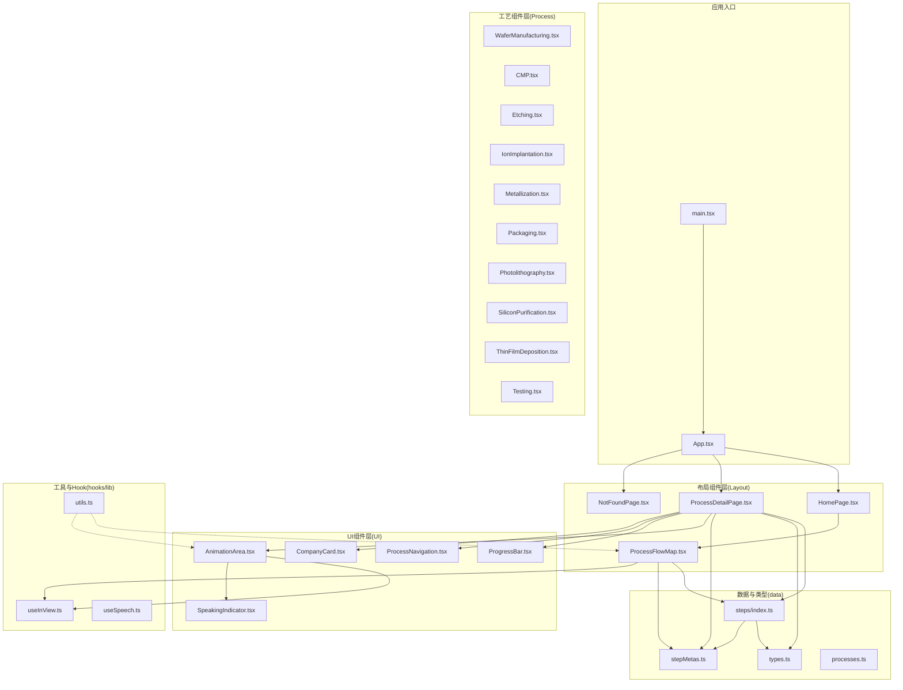
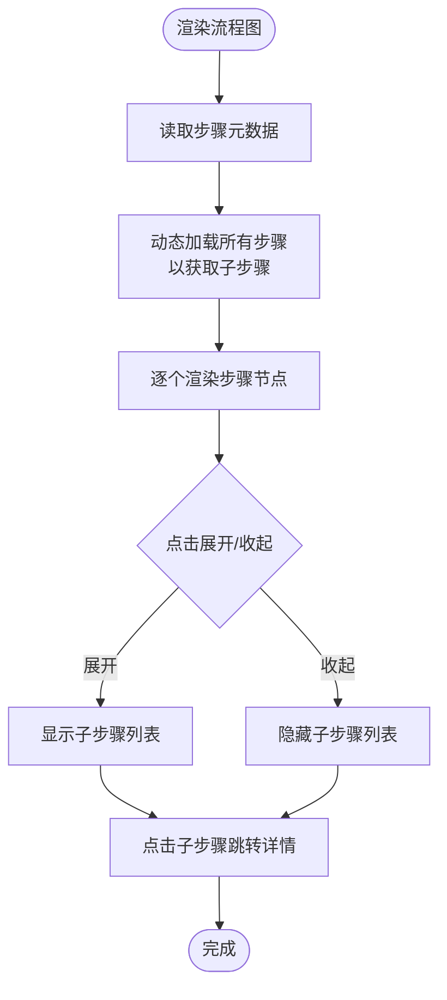
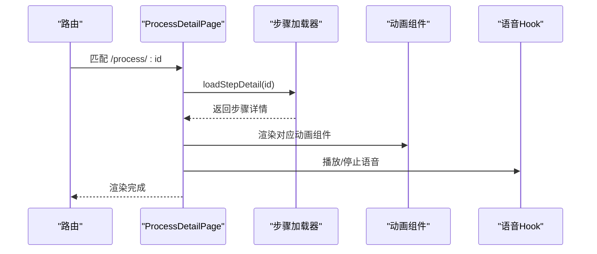
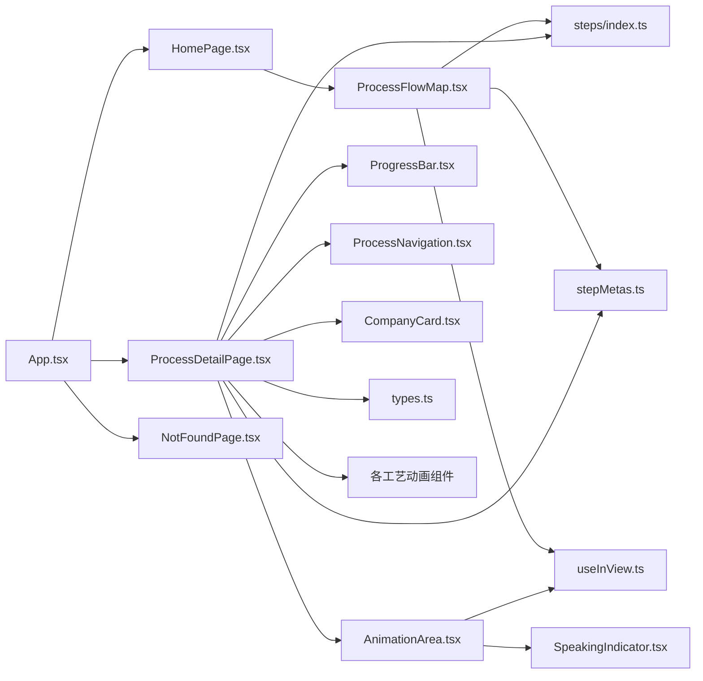

# 整体架构

<cite>
**本文引用的文件**
- [src/App.tsx](file://src/App.tsx)
- [src/main.tsx](file://src/main.tsx)
- [package.json](file://package.json)
- [src/components/layout/HomePage.tsx](file://src/components/layout/HomePage.tsx)
- [src/components/layout/ProcessFlowMap.tsx](file://src/components/layout/ProcessFlowMap.tsx)
- [src/components/layout/ProcessDetailPage.tsx](file://src/components/layout/ProcessDetailPage.tsx)
- [src/components/process/WaferManufacturing.tsx](file://src/components/process/WaferManufacturing.tsx)
- [src/components/ui/ProgressBar.tsx](file://src/components/ui/ProgressBar.tsx)
- [src/components/ui/AnimationArea.tsx](file://src/components/ui/AnimationArea.tsx)
- [src/data/types.ts](file://src/data/types.ts)
- [src/data/stepMetas.ts](file://src/data/stepMetas.ts)
- [src/data/processes.ts](file://src/data/processes.ts)
- [src/data/steps/index.ts](file://src/data/steps/index.ts)
- [src/hooks/useInView.ts](file://src/hooks/useInView.ts)
- [src/hooks/useSpeech.ts](file://src/hooks/useSpeech.ts)
- [src/lib/utils.ts](file://src/lib/utils.ts)
</cite>

## 目录
1. [简介](#简介)
2. [项目结构](#项目结构)
3. [核心组件](#核心组件)
4. [架构总览](#架构总览)
5. [详细组件分析](#详细组件分析)
6. [依赖分析](#依赖分析)
7. [性能考虑](#性能考虑)
8. [故障排查指南](#故障排查指南)
9. [结论](#结论)
10. [附录](#附录)

## 简介
本项目是一个面向芯片制造全流程的演示系统，采用三层架构设计：布局组件层（Layout）、工艺组件层（Process）与UI组件层（UI）。其目标是通过交互式动画、中文语音讲解与可视化流程图，帮助用户系统了解从沙子到芯片的制造过程。项目强调组件化架构的设计理念：可复用性、独立性与组合性；模块划分遵循按功能域分层与清晰的命名约定；整体采用路由驱动的页面组织方式，结合动态导入与状态管理，实现流畅的学习体验。

## 项目结构
项目采用基于功能域的目录组织方式，主要分为以下层次：
- 布局组件层（Layout）：负责页面级布局与导航，如首页、流程图、详情页、404等。
- 工艺组件层（Process）：负责具体工艺步骤的动画组件，如晶圆制造、光刻、刻蚀等。
- UI组件层（UI）：负责通用UI部件，如进度条、动画区域、公司卡片、导航等。
- 数据与类型（data）：定义领域模型、步骤元数据与异步加载逻辑。
- 工具与Hook（hooks、lib）：提供跨组件复用的工具函数与自定义Hook。
- 应用入口（main.tsx、App.tsx）：应用启动与路由配置。

**图表来源**
- [src/main.tsx:1-11](file://src/main.tsx#L1-L11)
- [src/App.tsx:1-23](file://src/App.tsx#L1-L23)
- [src/components/layout/HomePage.tsx:1-85](file://src/components/layout/HomePage.tsx#L1-L85)
- [src/components/layout/ProcessFlowMap.tsx:1-255](file://src/components/layout/ProcessFlowMap.tsx#L1-L255)
- [src/components/layout/ProcessDetailPage.tsx:1-397](file://src/components/layout/ProcessDetailPage.tsx#L1-L397)
- [src/components/process/WaferManufacturing.tsx:1-122](file://src/components/process/WaferManufacturing.tsx#L1-L122)
- [src/components/ui/ProgressBar.tsx:1-60](file://src/components/ui/ProgressBar.tsx#L1-L60)
- [src/components/ui/AnimationArea.tsx:1-29](file://src/components/ui/AnimationArea.tsx#L1-L29)
- [src/data/types.ts:1-33](file://src/data/types.ts#L1-L33)
- [src/data/stepMetas.ts:1-103](file://src/data/stepMetas.ts#L1-L103)
- [src/data/processes.ts:1-3](file://src/data/processes.ts#L1-L3)
- [src/data/steps/index.ts:1-34](file://src/data/steps/index.ts#L1-L34)
- [src/hooks/useInView.ts:1-32](file://src/hooks/useInView.ts#L1-L32)
- [src/hooks/useSpeech.ts](file://src/hooks/useSpeech.ts)
- [src/lib/utils.ts:1-7](file://src/lib/utils.ts#L1-L7)

**章节来源**
- [src/main.tsx:1-11](file://src/main.tsx#L1-L11)
- [src/App.tsx:1-23](file://src/App.tsx#L1-L23)
- [package.json:1-45](file://package.json#L1-L45)

## 核心组件
- 应用入口与路由
  - 入口文件负责挂载根组件与样式初始化。
  - 根组件使用路由配置首页、详情页与404页面，统一承载导航栏与页面内容。
- 布局组件层
  - 首页：包含引导语、统计信息与流程图入口。
  - 流程图页：以时间轴形式展示全部工艺步骤，支持展开/收起子步骤，具备进入详情页的链接。
  - 详情页：根据URL参数动态加载对应工艺的详细信息与动画，提供语音讲解、进度条、导航与相关企业展示。
- 工艺组件层
  - 每个工艺对应一个SVG动画组件，负责在画布上呈现该工艺的关键动作与视觉效果。
- UI组件层
  - 进度条：显示当前步骤与整体完成度，支持跳转到任一步骤。
  - 动画区域：负责在视口可见时渲染动画组件，并在语音播放时显示指示器。
  - 导航与卡片：提供前后步骤导航、企业卡片展示等通用UI。
- 数据与类型
  - 类型定义：公司、子步骤、步骤等核心领域模型。
  - 步骤元数据：包含每一步的标识、名称、图标、颜色与光晕色等元信息。
  - 步骤加载：通过动态导入机制按需加载各工艺的详细数据，保证首屏性能。
- 工具与Hook
  - 视口监听Hook：用于触发进入视口时的动画与渐显效果。
  - 合类名工具：合并Tailwind类，简化样式拼接。
  - 语音Hook：提供中文语音合成的播放/停止能力。

**章节来源**
- [src/App.tsx:1-23](file://src/App.tsx#L1-L23)
- [src/components/layout/HomePage.tsx:1-85](file://src/components/layout/HomePage.tsx#L1-L85)
- [src/components/layout/ProcessFlowMap.tsx:1-255](file://src/components/layout/ProcessFlowMap.tsx#L1-L255)
- [src/components/layout/ProcessDetailPage.tsx:1-397](file://src/components/layout/ProcessDetailPage.tsx#L1-L397)
- [src/components/process/WaferManufacturing.tsx:1-122](file://src/components/process/WaferManufacturing.tsx#L1-L122)
- [src/components/ui/ProgressBar.tsx:1-60](file://src/components/ui/ProgressBar.tsx#L1-L60)
- [src/components/ui/AnimationArea.tsx:1-29](file://src/components/ui/AnimationArea.tsx#L1-L29)
- [src/data/types.ts:1-33](file://src/data/types.ts#L1-L33)
- [src/data/stepMetas.ts:1-103](file://src/data/stepMetas.ts#L1-L103)
- [src/data/processes.ts:1-3](file://src/data/processes.ts#L1-L3)
- [src/data/steps/index.ts:1-34](file://src/data/steps/index.ts#L1-L34)
- [src/hooks/useInView.ts:1-32](file://src/hooks/useInView.ts#L1-L32)
- [src/lib/utils.ts:1-7](file://src/lib/utils.ts#L1-L7)

## 架构总览
本项目采用“三层架构 + 组件化”的设计模式：
- 布局组件层（Layout）
  - 职责：页面级布局、导航、路由承载与业务页面容器。
  - 特点：与数据解耦，仅依赖元数据与路由。
- 工艺组件层（Process）
  - 职责：呈现特定工艺的动画与视觉细节。
  - 特点：高度内聚，独立于其他工艺，便于维护与扩展。
- UI组件层（UI）
  - 职责：提供可复用的通用UI部件，如进度条、动画区域、导航等。
  - 特点：无业务逻辑，仅消费属性，利于跨页面复用。
- 数据与类型
  - 职责：定义领域模型与步骤元数据，提供异步加载接口。
  - 特点：集中管理，避免重复定义，便于统一演进。
- 工具与Hook
  - 职责：跨组件共享的通用能力，如视口监听、类名合并、语音合成等。
  - 特点：纯函数或无副作用Hook，易于测试与维护。

分层优势：
- 可复用性：UI组件与工具可在多个页面复用。
- 独立性：各层内部职责清晰，降低耦合。
- 组合性：通过路由与属性传递，灵活组合不同组件形成完整页面。

**章节来源**
- [src/components/layout/ProcessDetailPage.tsx:1-397](file://src/components/layout/ProcessDetailPage.tsx#L1-L397)
- [src/components/layout/ProcessFlowMap.tsx:1-255](file://src/components/layout/ProcessFlowMap.tsx#L1-L255)
- [src/components/ui/ProgressBar.tsx:1-60](file://src/components/ui/ProgressBar.tsx#L1-L60)
- [src/components/ui/AnimationArea.tsx:1-29](file://src/components/ui/AnimationArea.tsx#L1-L29)
- [src/data/steps/index.ts:1-34](file://src/data/steps/index.ts#L1-L34)

## 详细组件分析

### 布局组件层（Layout）

#### 首页（HomePage）
- 职责：展示引导语、统计信息与流程图入口，提供开始探索与浏览流程的按钮。
- 依赖：流程图组件、步骤元数据用于生成首个入口链接。
- 设计要点：使用渐变与光效背景营造科技感，统计区块直观展示行业关键指标。

**章节来源**
- [src/components/layout/HomePage.tsx:1-85](file://src/components/layout/HomePage.tsx#L1-L85)

#### 流程图（ProcessFlowMap）
- 职责：以垂直时间轴展示全部工艺步骤，支持展开/收起子步骤，点击进入详情页。
- 依赖：步骤元数据、动态加载所有步骤以获取子步骤列表、视口监听Hook实现渐显。
- 设计要点：每个步骤卡片包含图标、中英文名称、描述与展开按钮；展开面板按顺序列出子步骤。

**图表来源**
- [src/components/layout/ProcessFlowMap.tsx:200-255](file://src/components/layout/ProcessFlowMap.tsx#L200-L255)
- [src/data/steps/index.ts:23-33](file://src/data/steps/index.ts#L23-L33)
- [src/data/stepMetas.ts:1-103](file://src/data/stepMetas.ts#L1-L103)

**章节来源**
- [src/components/layout/ProcessFlowMap.tsx:1-255](file://src/components/layout/ProcessFlowMap.tsx#L1-L255)

#### 详情页（ProcessDetailPage）
- 职责：根据URL参数加载对应工艺的详细信息，渲染动画、语音讲解、进度条、导航与相关企业。
- 依赖：步骤元数据、动态加载单个步骤详情、动态导入各工艺动画组件、语音Hook、进度条与导航UI。
- 设计要点：支持重播动画、播放/停止语音讲解；根据当前步骤高亮进度条与步骤指示器；计算并展示相关企业分布。

**图表来源**
- [src/components/layout/ProcessDetailPage.tsx:36-141](file://src/components/layout/ProcessDetailPage.tsx#L36-L141)
- [src/data/steps/index.ts:16-21](file://src/data/steps/index.ts#L16-L21)
- [src/components/process/WaferManufacturing.tsx:1-122](file://src/components/process/WaferManufacturing.tsx#L1-L122)
- [src/hooks/useSpeech.ts](file://src/hooks/useSpeech.ts)

**章节来源**
- [src/components/layout/ProcessDetailPage.tsx:1-397](file://src/components/layout/ProcessDetailPage.tsx#L1-L397)

### 工艺组件层（Process）
- 职责：以SVG动画呈现特定工艺的关键流程，如单晶硅锭拉制、晶圆切割、光刻曝光、刻蚀、离子注入、薄膜沉积、CMP平坦化、金属化、封装与测试。
- 设计要点：每个组件独立维护自身动画与样式，通过属性接收颜色与光晕色以保持风格一致；组件内部使用CSS动画与关键帧实现流畅动效。

**章节来源**
- [src/components/process/WaferManufacturing.tsx:1-122](file://src/components/process/WaferManufacturing.tsx#L1-L122)

### UI组件层（UI）
- 进度条（ProgressBar）
  - 职责：显示当前步骤与整体完成度，支持跳转到任一步骤。
  - 设计要点：根据当前索引计算进度百分比，步骤指示器按颜色与灰度区分已过/当前/未来步骤。
- 动画区域（AnimationArea）
  - 职责：在视口可见时渲染动画组件，并在语音播放时显示指示器。
  - 设计要点：使用视口监听Hook控制渲染时机，避免不必要的重绘；通过key强制重新渲染以重置动画。

**章节来源**
- [src/components/ui/ProgressBar.tsx:1-60](file://src/components/ui/ProgressBar.tsx#L1-L60)
- [src/components/ui/AnimationArea.tsx:1-29](file://src/components/ui/AnimationArea.tsx#L1-L29)

### 数据与类型
- 类型定义（types）
  - 职责：定义公司、子步骤与步骤的领域模型，确保数据结构一致性。
- 步骤元数据（stepMetas）
  - 职责：提供每一步的标识、名称、图标、颜色与光晕色等元信息，供UI组件消费。
- 步骤加载（steps/index）
  - 职责：通过动态导入按需加载各工艺的详细数据，保证首屏性能与模块边界清晰。

**章节来源**
- [src/data/types.ts:1-33](file://src/data/types.ts#L1-L33)
- [src/data/stepMetas.ts:1-103](file://src/data/stepMetas.ts#L1-L103)
- [src/data/steps/index.ts:1-34](file://src/data/steps/index.ts#L1-L34)

### 工具与Hook
- 视口监听（useInView）
  - 职责：监听元素是否进入视口，返回状态以便触发渐显或动画。
- 合类名（utils/cn）
  - 职责：合并Tailwind类，避免重复与冲突。
- 语音（useSpeech）
  - 职责：提供中文语音合成的播放/停止能力，与详情页联动。

**章节来源**
- [src/hooks/useInView.ts:1-32](file://src/hooks/useInView.ts#L1-L32)
- [src/lib/utils.ts:1-7](file://src/lib/utils.ts#L1-L7)
- [src/hooks/useSpeech.ts](file://src/hooks/useSpeech.ts)

## 依赖分析
- 组件间依赖
  - App.tsx 依赖布局组件与路由，承载全局导航与页面切换。
  - HomePage 依赖流程图组件与步骤元数据。
  - ProcessFlowMap 依赖步骤元数据与动态加载器，内部使用视口监听Hook。
  - ProcessDetailPage 依赖步骤元数据、动态加载器、动画组件映射、语音Hook与UI组件。
  - AnimationArea 依赖视口监听Hook与语音指示器。
- 外部依赖
  - React 生态：React、React DOM、React Router。
  - UI 与样式：Lucide React、Tailwind CSS及其插件。
  - 开发工具：TypeScript、Vite、ESLint、Prettier。

**图表来源**
- [src/App.tsx:1-23](file://src/App.tsx#L1-L23)
- [src/components/layout/HomePage.tsx:1-85](file://src/components/layout/HomePage.tsx#L1-L85)
- [src/components/layout/ProcessFlowMap.tsx:1-255](file://src/components/layout/ProcessFlowMap.tsx#L1-L255)
- [src/components/layout/ProcessDetailPage.tsx:1-397](file://src/components/layout/ProcessDetailPage.tsx#L1-L397)
- [src/components/ui/AnimationArea.tsx:1-29](file://src/components/ui/AnimationArea.tsx#L1-L29)
- [src/data/steps/index.ts:1-34](file://src/data/steps/index.ts#L1-L34)
- [src/data/stepMetas.ts:1-103](file://src/data/stepMetas.ts#L1-L103)
- [src/hooks/useInView.ts:1-32](file://src/hooks/useInView.ts#L1-L32)
- [src/data/types.ts:1-33](file://src/data/types.ts#L1-L33)

**章节来源**
- [package.json:15-43](file://package.json#L15-L43)

## 性能考虑
- 按需加载：通过动态导入（dynamic import）按步骤加载详细数据与动画组件，减少首屏体积与初次渲染压力。
- 视口可见再渲染：动画区域仅在进入视口时渲染，避免不必要的动画开销。
- 状态最小化：进度条与导航等UI组件仅持有必要状态，避免深层重渲染。
- 样式合并：使用类名合并工具减少DOM类名冲突与冗余样式。
- 资源优化：动画组件内部使用CSS关键帧与有限的SVG元素，保证在低端设备上的流畅度。

[本节为通用性能建议，不直接分析具体文件]

## 故障排查指南
- 页面空白或路由不生效
  - 检查路由配置与入口挂载是否正确。
  - 确认路由路径与组件映射一致。
- 动画不显示
  - 检查动画区域是否处于视口范围内。
  - 确认动画组件映射表与步骤ID一致。
- 语音无法播放
  - 检查浏览器语音合成权限与可用性。
  - 确认语音Hook的播放/停止调用链路。
- 步骤详情加载失败
  - 检查动态导入模块是否存在且默认导出符合类型定义。
  - 确认步骤元数据中的ID与动态导入键一致。

**章节来源**
- [src/components/layout/ProcessDetailPage.tsx:118-141](file://src/components/layout/ProcessDetailPage.tsx#L118-L141)
- [src/components/ui/AnimationArea.tsx:11-28](file://src/components/ui/AnimationArea.tsx#L11-L28)
- [src/data/steps/index.ts:3-14](file://src/data/steps/index.ts#L3-L14)

## 结论
本项目通过三层架构与组件化设计，实现了清晰的职责分离与良好的可维护性。布局层负责页面与导航，工艺层专注动画细节，UI层提供可复用部件；数据层集中管理领域模型与加载策略；工具与Hook提供横切能力。该架构既满足了演示场景的交互需求，也为后续扩展新工艺与新功能提供了稳定基础。

[本节为总结性内容，不直接分析具体文件]

## 附录
- 模块划分原则
  - 按功能域分层：布局、工艺、UI、数据、工具与Hook。
  - 按职责单一：每个模块只做一件事，避免交叉耦合。
  - 按复用性抽象：通用能力下沉至工具与Hook层。
- 命名约定
  - 文件命名：采用帕斯卡命名法（如 HomePage.tsx），组件名与文件名一致。
  - 路由与ID：使用短横线分隔的小写标识（如 wafer-manufacturing）。
  - 样式与颜色：通过元数据中的颜色与光晕色统一风格，避免硬编码。

[本节为通用规范说明，不直接分析具体文件]