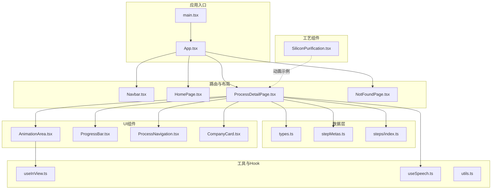
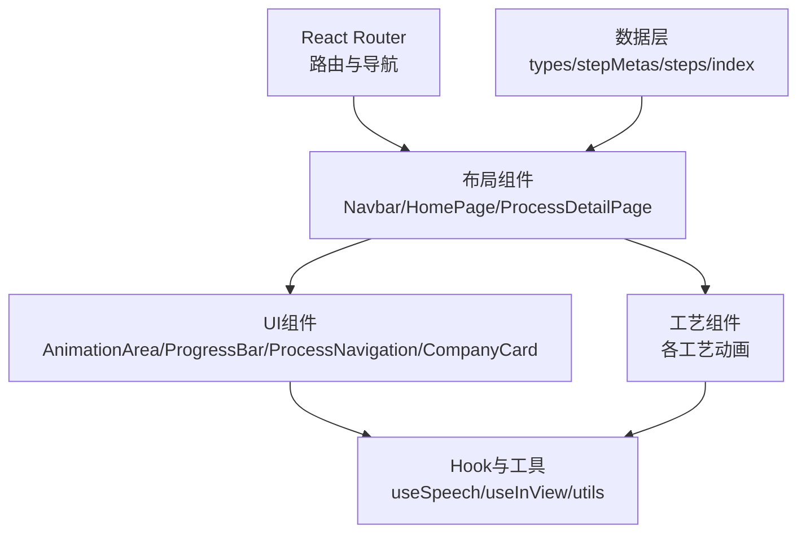
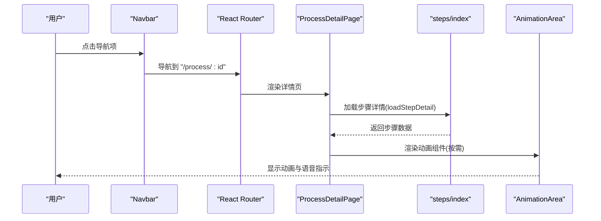
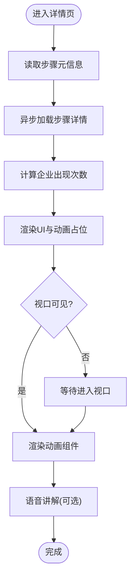
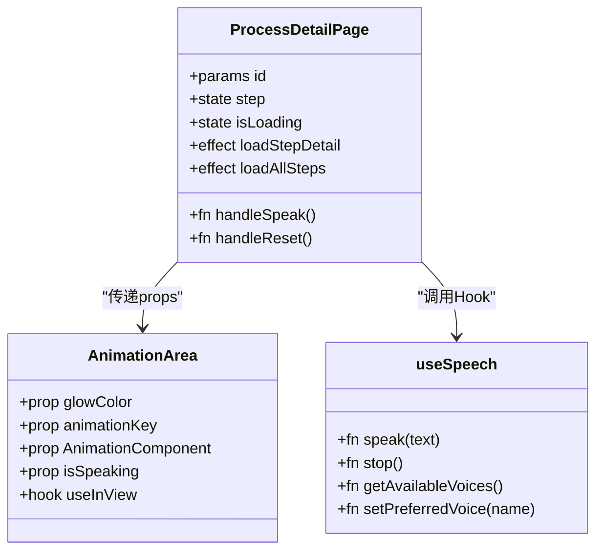
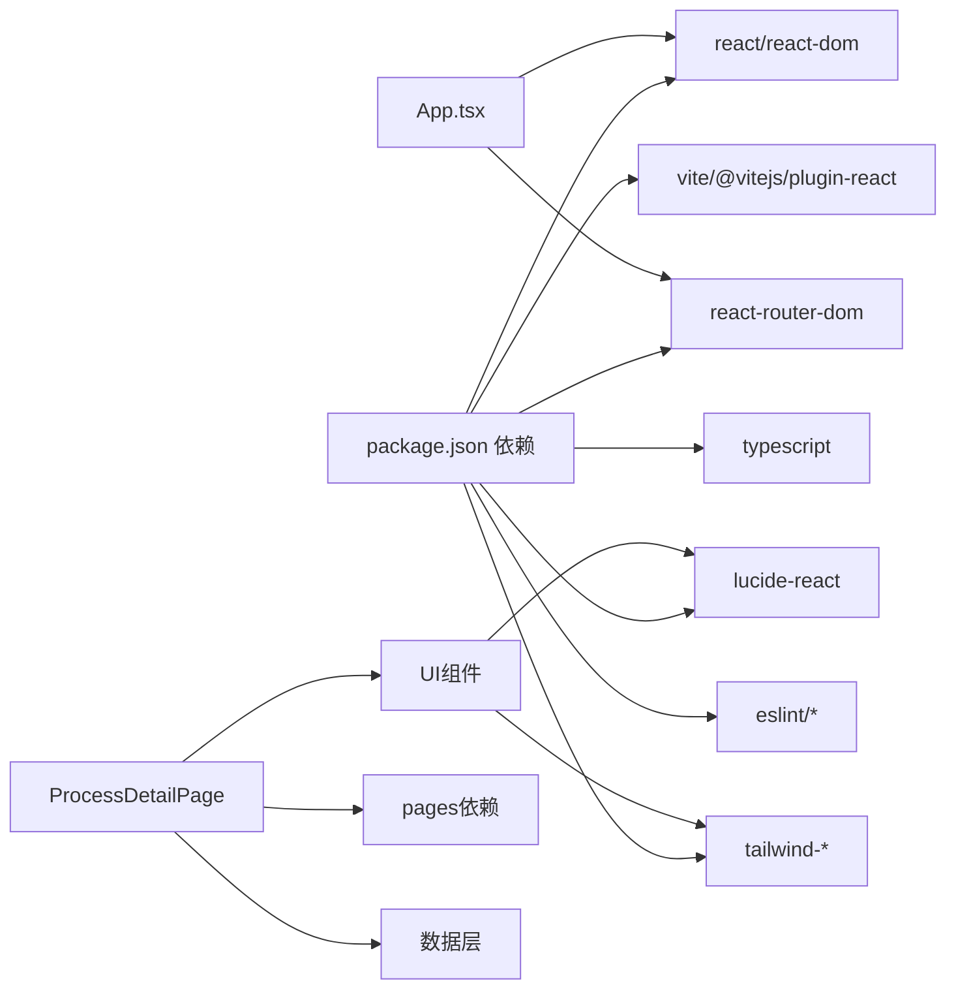

# 架构设计

<cite>
**本文引用的文件**
- [src/App.tsx](file://src/App.tsx)
- [src/main.tsx](file://src/main.tsx)
- [package.json](file://package.json)
- [vite.config.ts](file://vite.config.ts)
- [src/data/types.ts](file://src/data/types.ts)
- [src/data/stepMetas.ts](file://src/data/stepMetas.ts)
- [src/data/steps/index.ts](file://src/data/steps/index.ts)
- [src/components/layout/Navbar.tsx](file://src/components/layout/Navbar.tsx)
- [src/components/layout/HomePage.tsx](file://src/components/layout/HomePage.tsx)
- [src/components/layout/ProcessDetailPage.tsx](file://src/components/layout/ProcessDetailPage.tsx)
- [src/components/ui/AnimationArea.tsx](file://src/components/ui/AnimationArea.tsx)
- [src/components/ui/ProcessNavigation.tsx](file://src/components/ui/ProcessNavigation.tsx)
- [src/components/ui/ProgressBar.tsx](file://src/components/ui/ProgressBar.tsx)
- [src/components/ui/CompanyCard.tsx](file://src/components/ui/CompanyCard.tsx)
- [src/components/process/SiliconPurification.tsx](file://src/components/process/SiliconPurification.tsx)
- [src/hooks/useSpeech.ts](file://src/hooks/useSpeech.ts)
- [src/hooks/useInView.ts](file://src/hooks/useInView.ts)
- [src/lib/utils.ts](file://src/lib/utils.ts)
</cite>

## 目录
1. [简介](#简介)
2. [项目结构](#项目结构)
3. [核心组件](#核心组件)
4. [架构总览](#架构总览)
5. [详细组件分析](#详细组件分析)
6. [依赖分析](#依赖分析)
7. [性能考量](#性能考量)
8. [故障排查指南](#故障排查指南)
9. [结论](#结论)
10. [附录](#附录)

## 简介
本项目是一个以“芯片制造全流程”为主题的演示应用，采用组件化架构，分为布局组件、工艺组件与UI组件三层结构。系统通过数据驱动的方式，使用配置化的数据模型驱动UI展示；通过路由系统实现页面导航；通过Hook与自定义组件实现组件间通信与数据流管理；在前端工程层面采用React + TypeScript + Vite的技术栈组合，兼顾开发体验与运行性能。

## 项目结构
项目采用按“功能域+分层”的组织方式：
- 布局层：负责页面骨架、导航与通用样式，如头部导航、首页、详情页、404等。
- 工艺层：每个核心工艺对应一个独立的动画组件，负责具体工艺的可视化呈现。
- UI层：通用UI组件，如动画区域、进度条、企业卡片、语音指示器、导航按钮等。
- 数据层：类型定义、步骤元信息、异步加载步骤详情与全量步骤数据。
- 工具与Hook：工具函数（如类名合并）、视口监听Hook、语音合成Hook等。
- 构建与配置：Vite配置、包管理脚本、TypeScript与Tailwind配置等。

**图表来源**
- [src/main.tsx:1-11](file://src/main.tsx#L1-L11)
- [src/App.tsx:1-23](file://src/App.tsx#L1-L23)
- [src/components/layout/Navbar.tsx:1-82](file://src/components/layout/Navbar.tsx#L1-L82)
- [src/components/layout/HomePage.tsx:1-85](file://src/components/layout/HomePage.tsx#L1-L85)
- [src/components/layout/ProcessDetailPage.tsx:1-397](file://src/components/layout/ProcessDetailPage.tsx#L1-L397)
- [src/data/types.ts:1-33](file://src/data/types.ts#L1-L33)
- [src/data/stepMetas.ts:1-103](file://src/data/stepMetas.ts#L1-L103)
- [src/data/steps/index.ts:1-34](file://src/data/steps/index.ts#L1-L34)
- [src/components/ui/AnimationArea.tsx:1-29](file://src/components/ui/AnimationArea.tsx#L1-L29)
- [src/components/ui/ProgressBar.tsx](file://src/components/ui/ProgressBar.tsx)
- [src/components/ui/ProcessNavigation.tsx](file://src/components/ui/ProcessNavigation.tsx)
- [src/components/ui/CompanyCard.tsx](file://src/components/ui/CompanyCard.tsx)
- [src/components/process/SiliconPurification.tsx:1-114](file://src/components/process/SiliconPurification.tsx#L1-L114)
- [src/hooks/useSpeech.ts:1-135](file://src/hooks/useSpeech.ts#L1-L135)
- [src/hooks/useInView.ts](file://src/hooks/useInView.ts)
- [src/lib/utils.ts:1-7](file://src/lib/utils.ts#L1-L7)

**章节来源**
- [src/main.tsx:1-11](file://src/main.tsx#L1-L11)
- [src/App.tsx:1-23](file://src/App.tsx#L1-L23)
- [package.json:1-45](file://package.json#L1-L45)
- [vite.config.ts:1-13](file://vite.config.ts#L1-L13)

## 核心组件
- 应用入口与路由
  - 入口文件负责挂载React根节点与全局样式。
  - 应用根组件配置BrowserRouter与Routes，定义首页、详情页与兜底页路由。
- 布局组件
  - 导航栏根据步骤元信息动态生成导航项，支持桌面端与移动端两种形态。
  - 首页提供流程概览与统计信息，引导用户进入首个工艺步骤。
  - 详情页承载工艺信息展示、动画区域、语音讲解、企业卡片与前后步骤导航。
- 工艺组件
  - 每个工艺对应一个独立的动画组件，使用SVG实现特定工艺的可视化流程。
- UI组件
  - 动画区域：基于视口可见性触发渲染，结合动画Key实现重播。
  - 进度条：根据当前步骤索引显示整体进度。
  - 企业卡片：展示参与该步骤的关键企业及其标签。
  - 语音指示器：在语音播放时提供视觉反馈。
  - 工艺导航：提供上一步/下一步跳转。
- 数据与类型
  - 类型定义：公司、子步骤、步骤详情的数据结构。
  - 步骤元信息：包含每个步骤的标识、名称、图标、颜色等元数据。
  - 步骤加载：按需异步加载单个或全部步骤详情，保证首屏性能。
- Hook与工具
  - 语音Hook：封装Web Speech API，自动选择最佳中文语音并缓存偏好。
  - 视口监听Hook：用于动画区域的懒加载与触发。
  - 工具函数：类名合并，简化Tailwind类拼接。

**章节来源**
- [src/App.tsx:1-23](file://src/App.tsx#L1-L23)
- [src/components/layout/Navbar.tsx:1-82](file://src/components/layout/Navbar.tsx#L1-L82)
- [src/components/layout/HomePage.tsx:1-85](file://src/components/layout/HomePage.tsx#L1-L85)
- [src/components/layout/ProcessDetailPage.tsx:1-397](file://src/components/layout/ProcessDetailPage.tsx#L1-L397)
- [src/data/types.ts:1-33](file://src/data/types.ts#L1-L33)
- [src/data/stepMetas.ts:1-103](file://src/data/stepMetas.ts#L1-L103)
- [src/data/steps/index.ts:1-34](file://src/data/steps/index.ts#L1-L34)
- [src/components/ui/AnimationArea.tsx:1-29](file://src/components/ui/AnimationArea.tsx#L1-L29)
- [src/components/ui/ProgressBar.tsx](file://src/components/ui/ProgressBar.tsx)
- [src/components/ui/CompanyCard.tsx](file://src/components/ui/CompanyCard.tsx)
- [src/components/ui/ProcessNavigation.tsx](file://src/components/ui/ProcessNavigation.tsx)
- [src/hooks/useSpeech.ts:1-135](file://src/hooks/useSpeech.ts#L1-L135)
- [src/hooks/useInView.ts](file://src/hooks/useInView.ts)
- [src/lib/utils.ts:1-7](file://src/lib/utils.ts#L1-L7)

## 架构总览
系统采用“路由驱动页面切换 + 数据驱动UI渲染 + 组件解耦 + Hook复用”的架构模式。路由负责页面导航，数据层提供配置化模型，UI层与工艺层通过props与Hook进行松耦合通信，动画区域基于视口可见性懒加载，语音讲解通过Web Speech API实现自然语言输出。

**图表来源**
- [src/App.tsx:1-23](file://src/App.tsx#L1-L23)
- [src/components/layout/Navbar.tsx:1-82](file://src/components/layout/Navbar.tsx#L1-L82)
- [src/components/layout/HomePage.tsx:1-85](file://src/components/layout/HomePage.tsx#L1-L85)
- [src/components/layout/ProcessDetailPage.tsx:1-397](file://src/components/layout/ProcessDetailPage.tsx#L1-L397)
- [src/data/types.ts:1-33](file://src/data/types.ts#L1-L33)
- [src/data/stepMetas.ts:1-103](file://src/data/stepMetas.ts#L1-L103)
- [src/data/steps/index.ts:1-34](file://src/data/steps/index.ts#L1-L34)
- [src/components/ui/AnimationArea.tsx:1-29](file://src/components/ui/AnimationArea.tsx#L1-L29)
- [src/hooks/useSpeech.ts:1-135](file://src/hooks/useSpeech.ts#L1-L135)
- [src/hooks/useInView.ts](file://src/hooks/useInView.ts)
- [src/lib/utils.ts:1-7](file://src/lib/utils.ts#L1-L7)

## 详细组件分析

### 路由与页面导航
- 路由配置
  - 首页路径“/”，详情页路径“/process/:id”，兜底路径“*”。
  - 导航栏根据步骤元信息动态生成导航链接，支持高亮当前步骤。
- 页面切换逻辑
  - 首页提供“开始探索”按钮，直接跳转至第一个步骤。
  - 详情页根据URL参数加载对应步骤的详细数据与动画组件。
  - 详情页提供上一步/下一步导航，基于步骤元信息数组计算前后关系。

**图表来源**
- [src/components/layout/Navbar.tsx:1-82](file://src/components/layout/Navbar.tsx#L1-L82)
- [src/App.tsx:1-23](file://src/App.tsx#L1-L23)
- [src/components/layout/ProcessDetailPage.tsx:1-397](file://src/components/layout/ProcessDetailPage.tsx#L1-L397)
- [src/data/steps/index.ts:1-34](file://src/data/steps/index.ts#L1-L34)
- [src/components/ui/AnimationArea.tsx:1-29](file://src/components/ui/AnimationArea.tsx#L1-L29)

**章节来源**
- [src/App.tsx:1-23](file://src/App.tsx#L1-L23)
- [src/components/layout/Navbar.tsx:1-82](file://src/components/layout/Navbar.tsx#L1-L82)
- [src/components/layout/HomePage.tsx:1-85](file://src/components/layout/HomePage.tsx#L1-L85)
- [src/components/layout/ProcessDetailPage.tsx:1-397](file://src/components/layout/ProcessDetailPage.tsx#L1-L397)
- [src/data/steps/index.ts:1-34](file://src/data/steps/index.ts#L1-L34)

### 数据驱动的渲染机制
- 数据模型
  - 步骤元信息：包含步骤标识、名称、英文名、图标、颜色等，用于导航与UI配色。
  - 步骤详情：包含标题、描述、详细说明、子步骤、关键指标、企业列表、语音讲解文本等。
- 渲染策略
  - 首屏仅加载步骤元信息与基础UI，详情页按需异步加载步骤详情与动画组件。
  - 动画区域基于视口可见性触发渲染，避免不必要的初始化开销。
  - 语音讲解文本与动画组件通过props传递，实现UI与行为的解耦。

**图表来源**
- [src/components/layout/ProcessDetailPage.tsx:1-397](file://src/components/layout/ProcessDetailPage.tsx#L1-L397)
- [src/data/stepMetas.ts:1-103](file://src/data/stepMetas.ts#L1-L103)
- [src/data/steps/index.ts:1-34](file://src/data/steps/index.ts#L1-L34)
- [src/components/ui/AnimationArea.tsx:1-29](file://src/components/ui/AnimationArea.tsx#L1-L29)

**章节来源**
- [src/data/types.ts:1-33](file://src/data/types.ts#L1-L33)
- [src/data/stepMetas.ts:1-103](file://src/data/stepMetas.ts#L1-L103)
- [src/data/steps/index.ts:1-34](file://src/data/steps/index.ts#L1-L34)
- [src/components/layout/ProcessDetailPage.tsx:1-397](file://src/components/layout/ProcessDetailPage.tsx#L1-L397)

### 组件间通信与数据流向
- Props向下传递：步骤元信息、步骤详情、颜色与图标等从父组件传入子组件。
- 事件向上回调：语音控制、动画重播、导航切换等通过回调函数处理。
- 状态共享：公司出现次数等跨组件状态通过详情页统一计算后传递给企业卡片组件。
- Hook复用：useSpeech与useInView在多个组件中被复用，降低重复逻辑。

**图表来源**
- [src/components/layout/ProcessDetailPage.tsx:1-397](file://src/components/layout/ProcessDetailPage.tsx#L1-L397)
- [src/components/ui/AnimationArea.tsx:1-29](file://src/components/ui/AnimationArea.tsx#L1-L29)
- [src/hooks/useSpeech.ts:1-135](file://src/hooks/useSpeech.ts#L1-L135)

**章节来源**
- [src/components/layout/ProcessDetailPage.tsx:1-397](file://src/components/layout/ProcessDetailPage.tsx#L1-L397)
- [src/components/ui/AnimationArea.tsx:1-29](file://src/components/ui/AnimationArea.tsx#L1-L29)
- [src/hooks/useSpeech.ts:1-135](file://src/hooks/useSpeech.ts#L1-L135)

### 技术决策与权衡
- React + TypeScript + Vite
  - React：组件化与生态完善，适合构建交互式演示应用。
  - TypeScript：强类型保障开发期安全，提升协作效率与可维护性。
  - Vite：快速冷启动与热更新，开发体验优秀；按需异步加载与构建优化契合本项目懒加载需求。
- 样式与工具
  - Tailwind CSS：原子化样式，便于主题色与渐变效果的一致性实现。
  - clsx/tailwind-merge：类名合并与冲突修复，减少样式冗余。
- 语音与动画
  - Web Speech API：浏览器原生能力，无需额外SDK；useSpeech封装了语音选择与偏好持久化。
  - SVG动画：轻量、可控、可访问性友好，适合教学演示场景。

**章节来源**
- [package.json:1-45](file://package.json#L1-L45)
- [vite.config.ts:1-13](file://vite.config.ts#L1-L13)
- [src/lib/utils.ts:1-7](file://src/lib/utils.ts#L1-L7)
- [src/hooks/useSpeech.ts:1-135](file://src/hooks/useSpeech.ts#L1-L135)

### 性能优化策略
- 懒加载与按需渲染
  - 步骤详情与动画组件按需异步加载，减少首屏资源压力。
  - 动画区域基于视口可见性触发渲染，避免非可视区域的初始化。
- 重播与缓存
  - 动画Key变化强制重新挂载组件，确保重播一致性。
  - 语音偏好缓存到本地存储，避免每次加载都重新选择语音。
- 构建与打包
  - Vite按模块拆分，结合TypeScript编译，提升构建效率与产物体积控制。

**章节来源**
- [src/components/layout/ProcessDetailPage.tsx:1-397](file://src/components/layout/ProcessDetailPage.tsx#L1-L397)
- [src/components/ui/AnimationArea.tsx:1-29](file://src/components/ui/AnimationArea.tsx#L1-L29)
- [src/hooks/useSpeech.ts:1-135](file://src/hooks/useSpeech.ts#L1-L135)
- [vite.config.ts:1-13](file://vite.config.ts#L1-L13)

## 依赖分析
- 外部依赖
  - React与DOM：应用核心运行时。
  - React Router DOM：路由与导航。
  - Lucide React：图标库。
  - Tailwind相关：样式与动画。
- 开发依赖
  - Vite与React插件：构建与开发服务器。
  - TypeScript与ESLint/Prettier：类型检查与代码规范。
- 内部模块依赖
  - 布局组件依赖数据层与UI组件。
  - 工艺组件作为叶子节点，依赖Hook与工具函数。
  - UI组件依赖Hook与工具函数，形成低耦合复用。

**图表来源**
- [package.json:1-45](file://package.json#L1-L45)
- [src/App.tsx:1-23](file://src/App.tsx#L1-L23)
- [src/components/layout/ProcessDetailPage.tsx:1-397](file://src/components/layout/ProcessDetailPage.tsx#L1-L397)

**章节来源**
- [package.json:1-45](file://package.json#L1-L45)
- [src/App.tsx:1-23](file://src/App.tsx#L1-L23)

## 性能考量
- 首屏优化
  - 仅加载必要UI与步骤元信息，详情页按需加载步骤详情与动画组件。
- 可见性触发
  - 使用视口监听Hook在动画进入可视区域后再渲染，降低初始渲染成本。
- 语音性能
  - 语音合成取消与事件清理，避免长时间播放导致的内存占用。
- 构建优化
  - Vite的模块拆分与TypeScript增量编译，缩短开发与构建时间。

[本节为通用性能建议，不直接分析具体文件]

## 故障排查指南
- 语音无法播放
  - 检查浏览器是否支持Web Speech API，确认已授予音频权限。
  - 查看控制台是否有“Web Speech API not supported”警告。
  - 尝试手动设置偏好语音或更换浏览器。
- 动画不显示
  - 确认动画组件已正确映射到步骤ID。
  - 检查动画区域是否处于视口内，或尝试滚动查看。
  - 若重播无效，检查动画Key是否正确递增。
- 路由跳转异常
  - 确认步骤元信息中的ID与路由参数一致。
  - 检查步骤详情加载是否成功返回数据。

**章节来源**
- [src/hooks/useSpeech.ts:1-135](file://src/hooks/useSpeech.ts#L1-L135)
- [src/components/layout/ProcessDetailPage.tsx:1-397](file://src/components/layout/ProcessDetailPage.tsx#L1-L397)
- [src/components/ui/AnimationArea.tsx:1-29](file://src/components/ui/AnimationArea.tsx#L1-L29)

## 结论
本项目通过清晰的三层架构与数据驱动的渲染机制，实现了从导航到动画展示的完整流程。路由系统简洁明确，数据模型配置化，组件间通过Props与Hook实现松耦合通信。技术栈选择兼顾开发效率与运行性能，配合懒加载与动画触发机制，满足演示类应用对交互体验与首屏性能的要求。

## 附录
- 系统边界
  - 前端应用边界：仅负责数据展示、交互与动画演示，不包含后端服务。
  - 数据边界：步骤元信息与详情数据来自本地模块，按需异步加载。
- 模块划分
  - 布局层：Navbar、HomePage、ProcessDetailPage、NotFoundPage。
  - 工艺层：各核心工艺对应的动画组件。
  - UI层：AnimationArea、ProgressBar、ProcessNavigation、CompanyCard、SpeakingIndicator。
  - 数据层：types、stepMetas、steps/index。
  - 工具与Hook：useSpeech、useInView、utils。

[本节为概念性总结，不直接分析具体文件]