# 工艺组件

<cite>
**本文引用的文件**
- [src/App.tsx](file://src/App.tsx)
- [src/main.tsx](file://src/main.tsx)
- [src/components/layout/HomePage.tsx](file://src/components/layout/HomePage.tsx)
- [src/components/layout/ProcessDetailPage.tsx](file://src/components/layout/ProcessDetailPage.tsx)
- [src/components/layout/ProcessFlowMap.tsx](file://src/components/layout/ProcessFlowMap.tsx)
- [src/components/ui/AnimationArea.tsx](file://src/components/ui/AnimationArea.tsx)
- [src/components/ui/ProcessNavigation.tsx](file://src/components/ui/ProcessNavigation.tsx)
- [src/components/ui/ProgressBar.tsx](file://src/components/ui/ProgressBar.tsx)
- [src/components/ui/SpeakingIndicator.tsx](file://src/components/ui/SpeakingIndicator.tsx)
- [src/components/process/SiliconPurification.tsx](file://src/components/process/SiliconPurification.tsx)
- [src/components/process/WaferManufacturing.tsx](file://src/components/process/WaferManufacturing.tsx)
- [src/components/process/Photolithography.tsx](file://src/components/process/Photolithography.tsx)
- [src/components/process/Etching.tsx](file://src/components/process/Etching.tsx)
- [src/components/process/IonImplantation.tsx](file://src/components/process/IonImplantation.tsx)
- [src/components/process/ThinFilmDeposition.tsx](file://src/components/process/ThinFilmDeposition.tsx)
- [src/components/process/CMP.tsx](file://src/components/process/CMP.tsx)
- [src/components/process/Metallization.tsx](file://src/components/process/Metallization.tsx)
- [src/components/process/Packaging.tsx](file://src/components/process/Packaging.tsx)
- [src/components/process/Testing.tsx](file://src/components/process/Testing.tsx)
- [src/data/types.ts](file://src/data/types.ts)
- [src/data/processes.ts](file://src/data/processes.ts)
- [src/hooks/useInView.ts](file://src/hooks/useInView.ts)
- [src/hooks/useSpeech.ts](file://src/hooks/useSpeech.ts)
</cite>

## 目录
1. [引言](#引言)
2. [项目结构](#项目结构)
3. [核心组件](#核心组件)
4. [架构总览](#架构总览)
5. [详细组件分析](#详细组件分析)
6. [依赖关系分析](#依赖关系分析)
7. [性能考量](#性能考量)
8. [故障排查指南](#故障排查指南)
9. [结论](#结论)
10. [附录](#附录)

## 引言
本文件面向“芯片制造演示项目”的十大核心工艺组件，系统梳理其组件实现、数据绑定、动画集成与用户交互设计，并总结状态管理、事件处理与性能优化策略。文档同时给出关键流程的连贯性与用户体验设计建议，帮助开发者与产品人员快速理解与扩展。

## 项目结构
项目采用基于功能域的分层组织：页面布局组件位于 layout，具体工艺动画组件位于 process，通用 UI 组件位于 ui，数据类型与加载逻辑位于 data，自定义 Hook 位于 hooks。路由在应用入口集中配置，页面通过路由参数驱动详情页渲染。

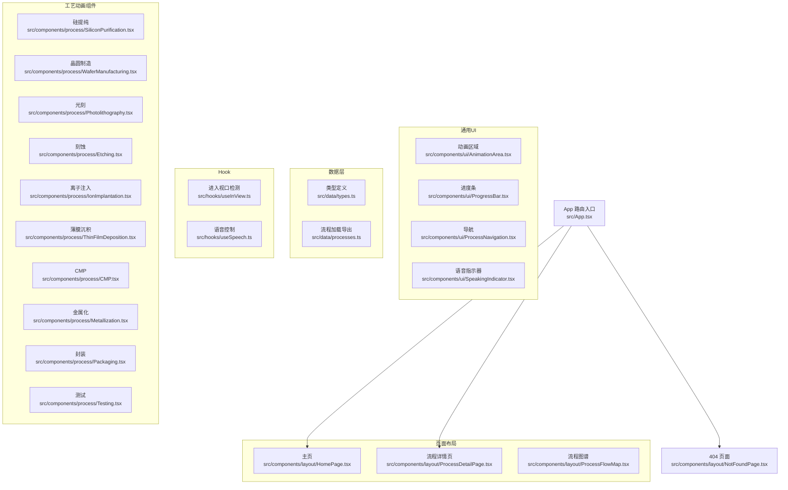

图表来源
- [src/App.tsx:1-23](file://src/App.tsx#L1-L23)
- [src/components/layout/HomePage.tsx:1-85](file://src/components/layout/HomePage.tsx#L1-L85)
- [src/components/layout/ProcessDetailPage.tsx](file://src/components/layout/ProcessDetailPage.tsx)
- [src/components/layout/ProcessFlowMap.tsx](file://src/components/layout/ProcessFlowMap.tsx)
- [src/components/ui/AnimationArea.tsx](file://src/components/ui/AnimationArea.tsx)
- [src/components/ui/ProcessNavigation.tsx](file://src/components/ui/ProcessNavigation.tsx)
- [src/components/ui/ProgressBar.tsx](file://src/components/ui/ProgressBar.tsx)
- [src/components/ui/SpeakingIndicator.tsx](file://src/components/ui/SpeakingIndicator.tsx)
- [src/components/process/SiliconPurification.tsx:1-114](file://src/components/process/SiliconPurification.tsx#L1-L114)
- [src/components/process/WaferManufacturing.tsx:1-122](file://src/components/process/WaferManufacturing.tsx#L1-L122)
- [src/components/process/Photolithography.tsx:1-136](file://src/components/process/Photolithography.tsx#L1-L136)
- [src/components/process/Etching.tsx:1-139](file://src/components/process/Etching.tsx#L1-L139)
- [src/components/process/IonImplantation.tsx:1-116](file://src/components/process/IonImplantation.tsx#L1-L116)
- [src/components/process/ThinFilmDeposition.tsx:1-124](file://src/components/process/ThinFilmDeposition.tsx#L1-L124)
- [src/components/process/CMP.tsx:1-125](file://src/components/process/CMP.tsx#L1-L125)
- [src/components/process/Metallization.tsx:1-120](file://src/components/process/Metallization.tsx#L1-L120)
- [src/components/process/Packaging.tsx:1-128](file://src/components/process/Packaging.tsx#L1-L128)
- [src/components/process/Testing.tsx:1-167](file://src/components/process/Testing.tsx#L1-L167)
- [src/data/types.ts:1-33](file://src/data/types.ts#L1-L33)
- [src/data/processes.ts:1-3](file://src/data/processes.ts#L1-L3)
- [src/hooks/useInView.ts](file://src/hooks/useInView.ts)
- [src/hooks/useSpeech.ts](file://src/hooks/useSpeech.ts)

章节来源
- [src/App.tsx:1-23](file://src/App.tsx#L1-L23)
- [src/main.tsx:1-11](file://src/main.tsx#L1-L11)

## 核心组件
本项目围绕“十大核心工艺”构建了独立的 SVG 动画组件，每个组件以函数形式导出，内部使用 SVG、CSS 动画与滤镜实现高保真的制造场景可视化。组件之间通过路由与页面布局解耦，数据模型统一由类型定义与数据加载模块提供。

- 数据模型与加载
  - 类型定义：统一的公司、子步骤、主步骤结构，支撑页面渲染与导航。
  - 加载导出：集中导出加载函数与类型，便于页面按需引入。
- 通用 UI 组件
  - 动画区域：承载单个工艺动画，负责尺寸适配与容器样式。
  - 进度条：用于流程推进与阶段提示。
  - 导航：在详情页中提供前后跳转与流程索引导航。
  - 语音指示器：配合语音讲解的状态反馈。
- 自定义 Hook
  - 进入视口检测：用于懒加载与滚动触发动画。
  - 语音控制：驱动文本朗读与状态同步。

章节来源
- [src/data/types.ts:1-33](file://src/data/types.ts#L1-L33)
- [src/data/processes.ts:1-3](file://src/data/processes.ts#L1-L3)
- [src/components/ui/AnimationArea.tsx](file://src/components/ui/AnimationArea.tsx)
- [src/components/ui/ProgressBar.tsx](file://src/components/ui/ProgressBar.tsx)
- [src/components/ui/ProcessNavigation.tsx](file://src/components/ui/ProcessNavigation.tsx)
- [src/components/ui/SpeakingIndicator.tsx](file://src/components/ui/SpeakingIndicator.tsx)
- [src/hooks/useInView.ts](file://src/hooks/useInView.ts)
- [src/hooks/useSpeech.ts](file://src/hooks/useSpeech.ts)

## 架构总览
下图展示了从路由到页面再到具体工艺动画的调用链路，以及数据与 UI 的交互方式。

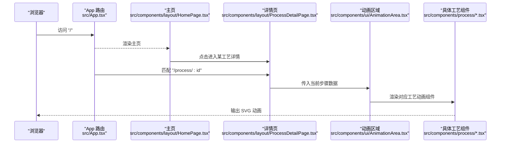

图表来源
- [src/App.tsx:1-23](file://src/App.tsx#L1-L23)
- [src/components/layout/HomePage.tsx:1-85](file://src/components/layout/HomePage.tsx#L1-L85)
- [src/components/layout/ProcessDetailPage.tsx](file://src/components/layout/ProcessDetailPage.tsx)
- [src/components/ui/AnimationArea.tsx](file://src/components/ui/AnimationArea.tsx)
- [src/components/process/SiliconPurification.tsx:1-114](file://src/components/process/SiliconPurification.tsx#L1-L114)

## 详细组件分析

### 硅提纯（Silicon Purification）
- 实现要点
  - 使用径向渐变与热能椭圆模拟熔炼氛围；多粒子上升动画表现温度场与气流。
  - 硅棒与温度指示器配合，突出“从沙子到多晶硅”的转化过程。
- 数据绑定
  - 步骤元信息来自数据层，组件仅消费 props 并渲染 SVG。
- 动画集成
  - 关键帧动画覆盖“熔融呼吸”“热能脉冲”“粒子上升”“硅棒出现”等节奏。
- 用户交互
  - 可结合进度条与导航在详情页中逐步展开讲解。

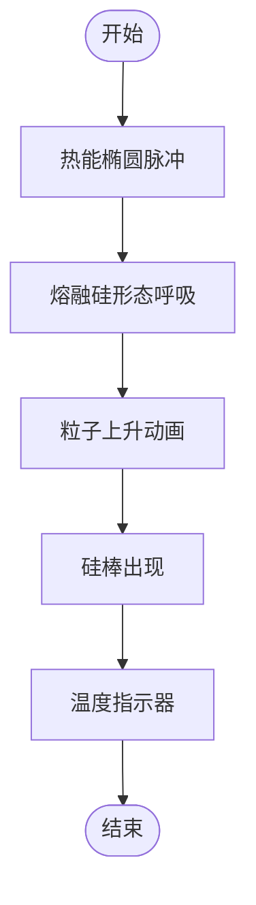

图表来源
- [src/components/process/SiliconPurification.tsx:1-114](file://src/components/process/SiliconPurification.tsx#L1-L114)

章节来源
- [src/components/process/SiliconPurification.tsx:1-114](file://src/components/process/SiliconPurification.tsx#L1-L114)

### 晶圆制造（Wafer Manufacturing）
- 实现要点
  - CZ 法提拉、线锯切割、火花效果与叠层晶圆呈现。
- 动画集成
  - 多处关键帧：锭体收缩、线锯移动与振动、晶圆逐个出现、火花闪烁。
- 用户交互
  - 可在详情页中配合语音讲解与进度条，分步展示 CZ 提拉与切割。

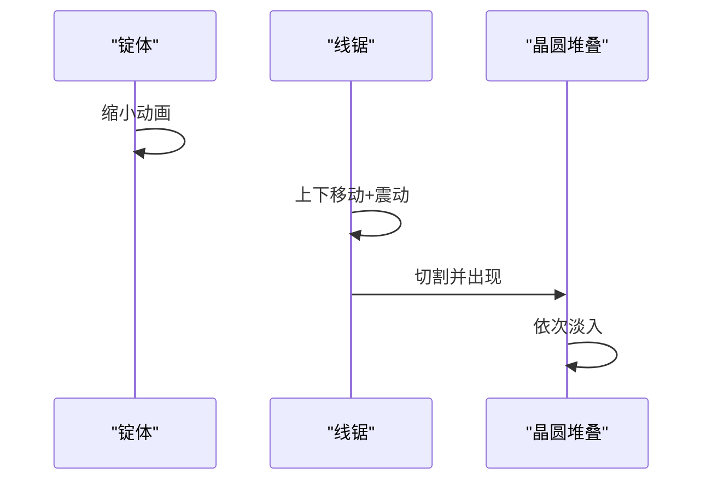

图表来源
- [src/components/process/WaferManufacturing.tsx:1-122](file://src/components/process/WaferManufacturing.tsx#L1-L122)

章节来源
- [src/components/process/WaferManufacturing.tsx:1-122](file://src/components/process/WaferManufacturing.tsx#L1-L122)

### 光刻（Photolithography）
- 实现要点
  - EUV 光源、掩模版投影、光刻胶曝光与发光区域。
- 动画集成
  - 射线闪烁、掩模渐亮、图案投影、曝光闪动、发光区域脉动。
- 用户交互
  - 可在详情页中以“步骤切换”驱动不同阶段的动画播放。

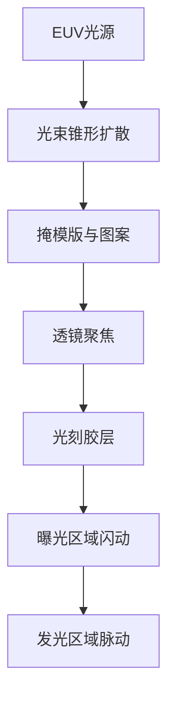

图表来源
- [src/components/process/Photolithography.tsx:1-136](file://src/components/process/Photolithography.tsx#L1-L136)

章节来源
- [src/components/process/Photolithography.tsx:1-136](file://src/components/process/Photolithography.tsx#L1-L136)

### 刻蚀（Etching）
- 实现要点
  - 等离子体刻蚀腔、RF 电极、离子箭头、沟槽形成与碎屑飞溅。
- 动画集成
  - 等离子脉冲、粒子漂浮、离子箭头与头部、沟槽增长、碎屑上升。
- 用户交互
  - 可在详情页中以“阶段动画”串联“预清洗→刻蚀→去胶”。

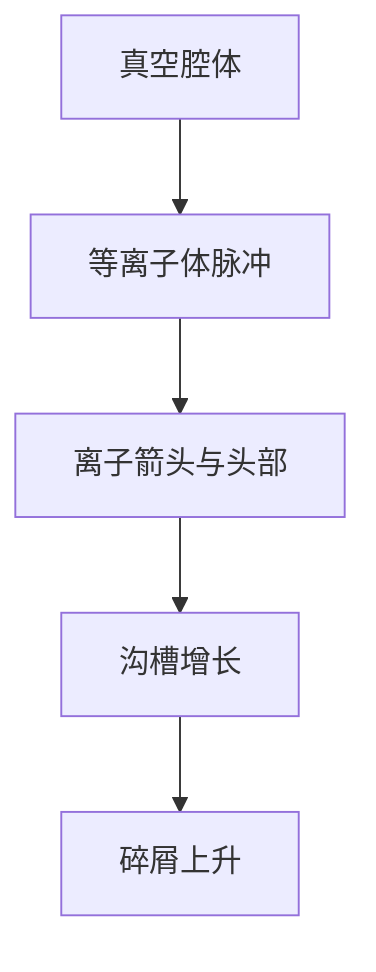

图表来源
- [src/components/process/Etching.tsx:1-139](file://src/components/process/Etching.tsx#L1-L139)

章节来源
- [src/components/process/Etching.tsx:1-139](file://src/components/process/Etching.tsx#L1-L139)

### 离子注入（Ion Implantation）
- 实现要点
  - 离子源、加速电场、质量分析磁铁、聚焦束与晶格植入。
- 动画集成
  - 加速环闪烁、束流脉冲、粒子移动、聚焦区域、原子植入。
- 用户交互
  - 可在详情页中以“能量等级”与“注入元素”参数驱动动画细节。

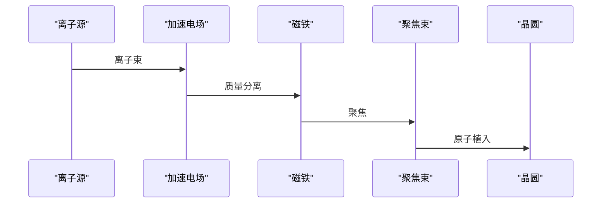

图表来源
- [src/components/process/IonImplantation.tsx:1-116](file://src/components/process/IonImplantation.tsx#L1-L116)

章节来源
- [src/components/process/IonImplantation.tsx:1-116](file://src/components/process/IonImplantation.tsx#L1-L116)

### 薄膜沉积（Thin Film Deposition）
- 实现要点
  - CVD 反应腔、气体流动、分子下降与层状堆积。
- 动画集成
  - 气流虚线、分子飘落、底层先增厚、上层随后、加热器与真空泵。
- 用户交互
  - 可在详情页中以“材料种类”与“温度曲线”驱动动画参数。

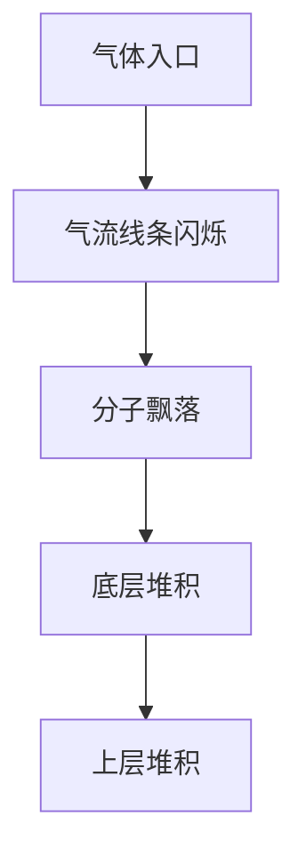

图表来源
- [src/components/process/ThinFilmDeposition.tsx:1-124](file://src/components/process/ThinFilmDeposition.tsx#L1-L124)

章节来源
- [src/components/process/ThinFilmDeposition.tsx:1-124](file://src/components/process/ThinFilmDeposition.tsx#L1-L124)

### CMP（化学机械抛光）
- 实现要点
  - 旋转抛光垫、抛光液滴、压力头与前后表面对比。
- 动画集成
  - 抛光垫旋转、液滴摆动、流线虚线、滑动反光带。
- 用户交互
  - 可在详情页中以“压力曲线”“抛光时间”驱动动画节奏。

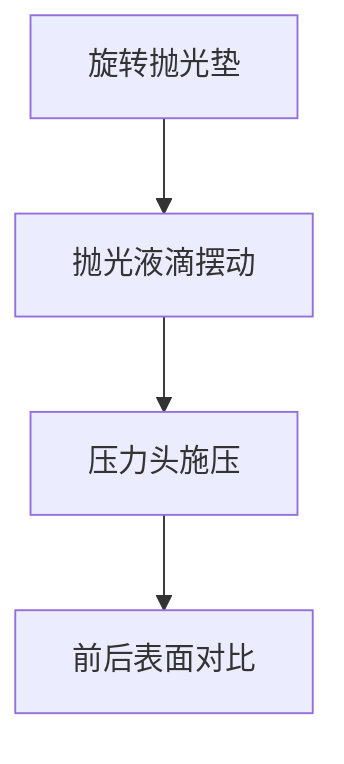

图表来源
- [src/components/process/CMP.tsx:1-125](file://src/components/process/CMP.tsx#L1-L125)

章节来源
- [src/components/process/CMP.tsx:1-125](file://src/components/process/CMP.tsx#L1-L125)

### 金属化（Metallization）
- 实现要点
  - 大马士革截面图、介电层与沟槽、铜填充与 VIA 连接。
- 动画集成
  - 分层出现、逐层填充、垂直通孔连接、扫光效果。
- 用户交互
  - 可在详情页中以“层序编号”与“工艺步骤”驱动动画顺序。

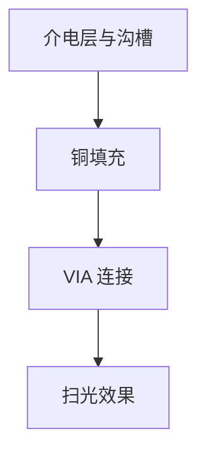

图表来源
- [src/components/process/Metallization.tsx:1-120](file://src/components/process/Metallization.tsx#L1-L120)

章节来源
- [src/components/process/Metallization.tsx:1-120](file://src/components/process/Metallization.tsx#L1-L120)

### 封装（Packaging）
- 实现要点
  - 划片、贴装、键合与塑封的三步流程，封装体与引脚阵列。
- 动画集成
  - 刀片闪烁、芯片掉落、键合线路径、封装体与标记。
- 用户交互
  - 可在详情页中以“步骤切换”与“封装类型”驱动动画。

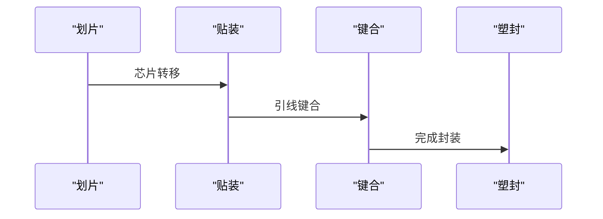

图表来源
- [src/components/process/Packaging.tsx:1-128](file://src/components/process/Packaging.tsx#L1-L128)

章节来源
- [src/components/process/Packaging.tsx:1-128](file://src/components/process/Packaging.tsx#L1-L128)

### 测试（Testing）
- 实现要点
  - ATE 测试机、屏幕扫描线、探针卡、信号波形与 PASS/FAIL 统计。
- 动画集成
  - 结果块逐个出现、扫描线移动、探针摆动、LED 状态灯、进度条。
- 用户交互
  - 可在详情页中以“测试阶段”与“良率统计”驱动动画节奏。

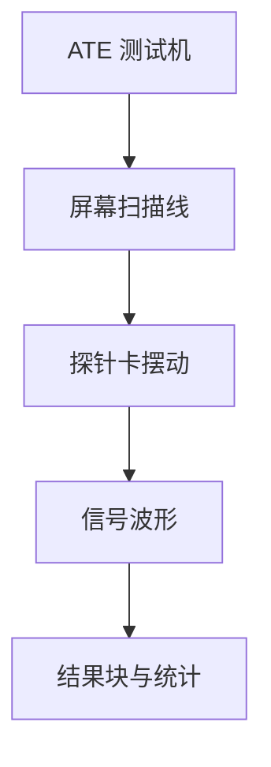

图表来源
- [src/components/process/Testing.tsx:1-167](file://src/components/process/Testing.tsx#L1-L167)

章节来源
- [src/components/process/Testing.tsx:1-167](file://src/components/process/Testing.tsx#L1-L167)

## 依赖关系分析
- 组件内聚与耦合
  - 工艺组件均为纯函数 + SVG，内聚性强，彼此低耦合，便于独立维护与替换。
- 数据依赖
  - 所有组件通过 props 接收步骤元数据，不直接依赖外部状态，降低复杂度。
- UI 依赖
  - 通用 UI 组件被详情页复用，保持一致的交互体验。
- 外部依赖
  - 路由与页面布局由 React Router 提供；动画依赖浏览器 SVG 与 CSS 动画能力。

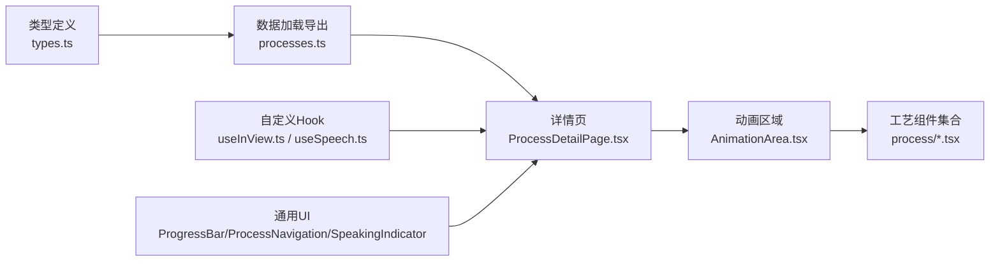

图表来源
- [src/data/types.ts:1-33](file://src/data/types.ts#L1-L33)
- [src/data/processes.ts:1-3](file://src/data/processes.ts#L1-L3)
- [src/components/layout/ProcessDetailPage.tsx](file://src/components/layout/ProcessDetailPage.tsx)
- [src/components/ui/AnimationArea.tsx](file://src/components/ui/AnimationArea.tsx)
- [src/components/process/SiliconPurification.tsx:1-114](file://src/components/process/SiliconPurification.tsx#L1-L114)
- [src/hooks/useInView.ts](file://src/hooks/useInView.ts)
- [src/hooks/useSpeech.ts](file://src/hooks/useSpeech.ts)
- [src/components/ui/ProgressBar.tsx](file://src/components/ui/ProgressBar.tsx)
- [src/components/ui/ProcessNavigation.tsx](file://src/components/ui/ProcessNavigation.tsx)
- [src/components/ui/SpeakingIndicator.tsx](file://src/components/ui/SpeakingIndicator.tsx)

章节来源
- [src/data/types.ts:1-33](file://src/data/types.ts#L1-L33)
- [src/data/processes.ts:1-3](file://src/data/processes.ts#L1-L3)
- [src/components/layout/ProcessDetailPage.tsx](file://src/components/layout/ProcessDetailPage.tsx)

## 性能考量
- 动画性能
  - 使用 CSS 动画与 SVG 关键帧，避免 JavaScript 频繁重排；合理设置动画时长与延迟，减少同时播放的元素数量。
- 渲染优化
  - 将每个工艺组件拆分为独立文件，按需渲染；在详情页中仅渲染当前组件，避免不必要的重绘。
- 数据与状态
  - 组件只消费 props，不持有全局状态，降低重渲染风险；必要时可引入轻量状态管理或上下文隔离。
- 交互体验
  - 使用进入视口 Hook 控制动画触发时机，提升首屏性能；语音讲解与动画节奏对齐，避免冲突。

## 故障排查指南
- 动画不播放
  - 检查容器尺寸与 viewBox 是否匹配；确认关键帧类名是否正确挂载。
- 性能卡顿
  - 减少同时动画元素数量；合并多个动画为单一关键帧；避免在动画中频繁计算样式。
- 语音不同步
  - 检查语音 Hook 的节流与回调时机；确保动画阶段与讲解内容一一对应。
- 路由与导航异常
  - 确认路由参数与步骤 ID 对应关系；检查详情页数据加载逻辑。

章节来源
- [src/hooks/useSpeech.ts](file://src/hooks/useSpeech.ts)
- [src/hooks/useInView.ts](file://src/hooks/useInView.ts)
- [src/components/ui/AnimationArea.tsx](file://src/components/ui/AnimationArea.tsx)

## 结论
本项目通过“纯函数 + SVG + CSS 动画”的组合，实现了十大核心工艺的高保真可视化演示。组件结构清晰、数据与 UI 解耦、交互与动画协同良好。建议在后续迭代中进一步完善状态管理、语音与动画的时序对齐、以及跨设备的响应式适配，以持续提升用户体验与可维护性。

## 附录
- 开发模式建议
  - 为每个工艺组件提供“演示模式”与“教学模式”，通过 props 切换动画速度与说明文案。
  - 在详情页中增加“暂停/继续”按钮，允许用户控制动画节奏。
  - 引入轻量状态管理，统一处理语音、动画与导航状态，避免多组件重复监听。