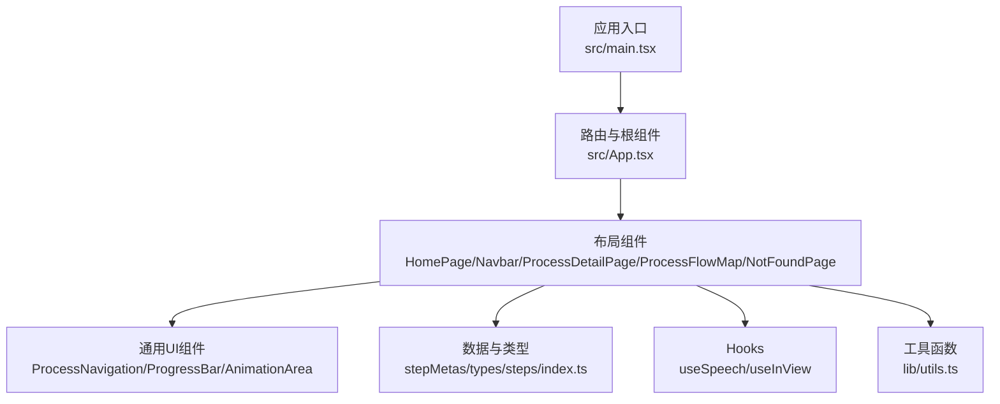
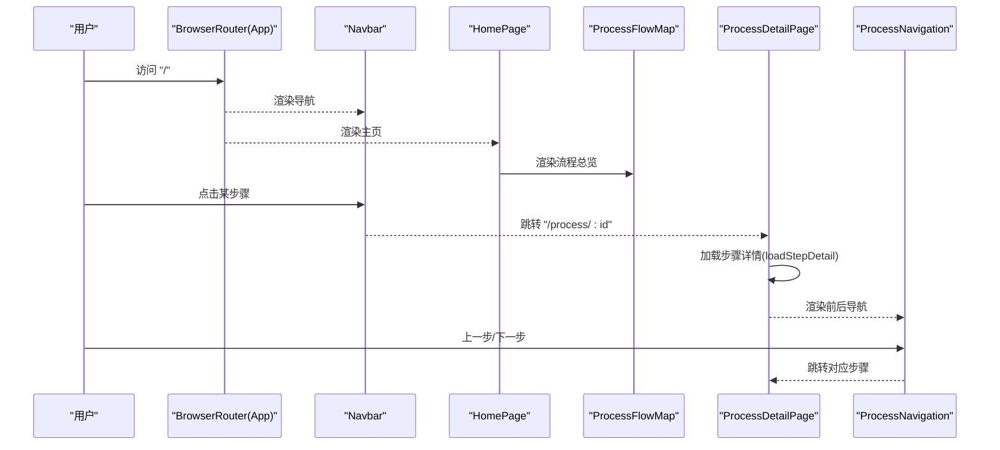
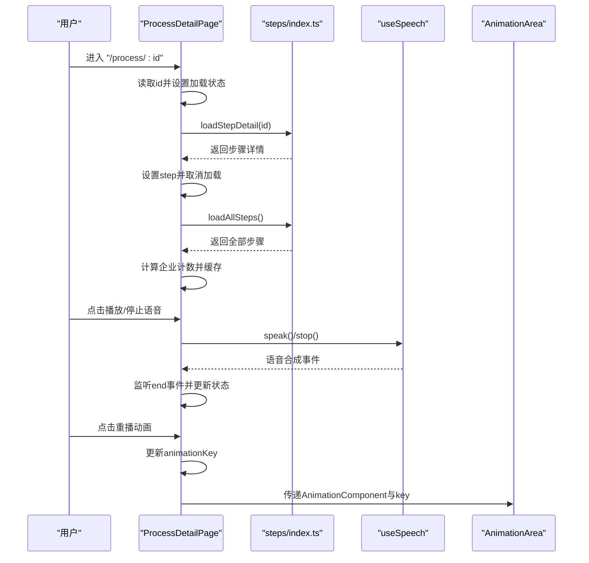
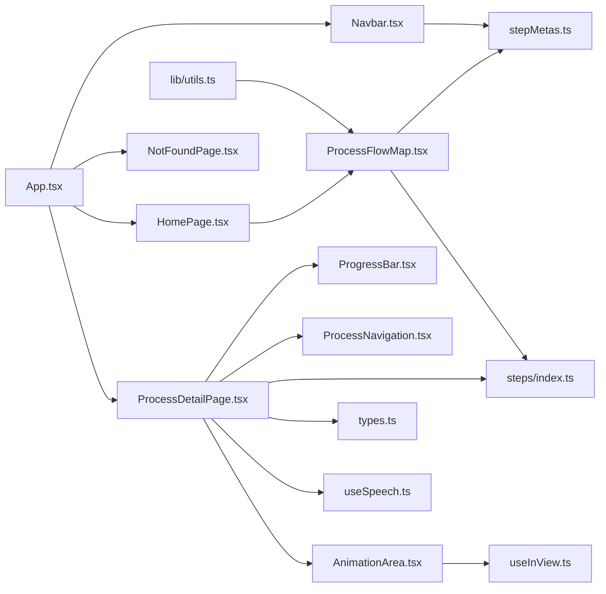

# 布局组件

<cite>
**本文引用的文件**
- [src/App.tsx](file://src/App.tsx)
- [src/main.tsx](file://src/main.tsx)
- [src/components/layout/HomePage.tsx](file://src/components/layout/HomePage.tsx)
- [src/components/layout/Navbar.tsx](file://src/components/layout/Navbar.tsx)
- [src/components/layout/ProcessDetailPage.tsx](file://src/components/layout/ProcessDetailPage.tsx)
- [src/components/layout/ProcessFlowMap.tsx](file://src/components/layout/ProcessFlowMap.tsx)
- [src/components/layout/NotFoundPage.tsx](file://src/components/layout/NotFoundPage.tsx)
- [src/components/ui/ProcessNavigation.tsx](file://src/components/ui/ProcessNavigation.tsx)
- [src/components/ui/ProgressBar.tsx](file://src/components/ui/ProgressBar.tsx)
- [src/components/ui/AnimationArea.tsx](file://src/components/ui/AnimationArea.tsx)
- [src/data/stepMetas.ts](file://src/data/stepMetas.ts)
- [src/data/types.ts](file://src/data/types.ts)
- [src/data/steps/index.ts](file://src/data/steps/index.ts)
- [src/hooks/useSpeech.ts](file://src/hooks/useSpeech.ts)
- [src/hooks/useInView.ts](file://src/hooks/useInView.ts)
- [src/lib/utils.ts](file://src/lib/utils.ts)
</cite>

## 目录
1. [简介](#简介)
2. [项目结构](#项目结构)
3. [核心组件](#核心组件)
4. [架构总览](#架构总览)
5. [组件详细分析](#组件详细分析)
6. [依赖关系分析](#依赖关系分析)
7. [性能考量](#性能考量)
8. [故障排查指南](#故障排查指南)
9. [结论](#结论)
10. [附录](#附录)

## 简介
本文件系统性梳理芯片制造演示项目的布局组件，覆盖主页、导航栏、流程图、详情页与404页面的实现细节。文档从设计模式、职责分工、props接口、状态管理与生命周期、组件间导航与路由集成、响应式设计与样式定制等方面进行深入解析，并提供可直接定位到源码位置的路径指引，帮助开发者快速理解与扩展。

## 项目结构
项目采用按功能域分层的组织方式：顶层由应用入口负责路由配置，布局组件位于components/layout目录下，通用UI组件位于components/ui，数据模型与加载逻辑位于data与hooks目录，工具函数位于lib目录。

图表来源
- [src/main.tsx:1-11](file://src/main.tsx#L1-L11)
- [src/App.tsx:1-23](file://src/App.tsx#L1-L23)

章节来源
- [src/main.tsx:1-11](file://src/main.tsx#L1-L11)
- [src/App.tsx:1-23](file://src/App.tsx#L1-L23)

## 核心组件
- 主页（HomePage）：提供引导性内容、统计信息与流程总览入口。
- 导航栏（Navbar）：固定顶部导航，支持桌面与移动端，动态高亮当前步骤。
- 流程图（ProcessFlowMap）：垂直时间轴展示全部工艺步骤，支持展开/折叠子步骤。
- 详情页（ProcessDetailPage）：单个工艺步骤的深度介绍，含动画区域、语音讲解、进度条、公司信息与前后导航。
- 404页面（NotFoundPage）：统一错误页，提供返回首页能力。
- 通用UI组件：进程导航（ProcessNavigation）、进度条（ProgressBar）、动画区域（AnimationArea）。

章节来源
- [src/components/layout/HomePage.tsx:1-85](file://src/components/layout/HomePage.tsx#L1-L85)
- [src/components/layout/Navbar.tsx:1-82](file://src/components/layout/Navbar.tsx#L1-L82)
- [src/components/layout/ProcessFlowMap.tsx:1-255](file://src/components/layout/ProcessFlowMap.tsx#L1-L255)
- [src/components/layout/ProcessDetailPage.tsx:1-397](file://src/components/layout/ProcessDetailPage.tsx#L1-L397)
- [src/components/layout/NotFoundPage.tsx:1-27](file://src/components/layout/NotFoundPage.tsx#L1-L27)
- [src/components/ui/ProcessNavigation.tsx:1-67](file://src/components/ui/ProcessNavigation.tsx#L1-L67)
- [src/components/ui/ProgressBar.tsx:1-60](file://src/components/ui/ProgressBar.tsx#L1-L60)
- [src/components/ui/AnimationArea.tsx:1-29](file://src/components/ui/AnimationArea.tsx#L1-L29)

## 架构总览
应用通过BrowserRouter在根组件中注册路由，布局组件承担页面骨架与导航职责；详情页通过参数驱动加载具体步骤数据；流程图组件负责聚合与展示全部步骤及其子步骤；通用UI组件提供复用能力。

图表来源
- [src/App.tsx:7-20](file://src/App.tsx#L7-L20)
- [src/components/layout/Navbar.tsx:6-81](file://src/components/layout/Navbar.tsx#L6-L81)
- [src/components/layout/HomePage.tsx:6-84](file://src/components/layout/HomePage.tsx#L6-L84)
- [src/components/layout/ProcessFlowMap.tsx:200-254](file://src/components/layout/ProcessFlowMap.tsx#L200-L254)
- [src/components/layout/ProcessDetailPage.tsx:36-396](file://src/components/layout/ProcessDetailPage.tsx#L36-L396)
- [src/components/ui/ProcessNavigation.tsx:14-66](file://src/components/ui/ProcessNavigation.tsx#L14-L66)

## 组件详细分析

### 主页（HomePage）
- 设计模式：容器组件 + 子组件组合，使用背景光晕与渐变增强视觉层次。
- 职责分工：
  - 提供引导文案、CTA按钮与浏览流程入口。
  - 调用流程图组件展示全部步骤概览。
  - 展示统计数据卡片。
- Props接口：无（无外部传入props）。
- 状态管理与生命周期：
  - 无内部状态，仅渲染静态内容与流程图。
- 导航机制与路由集成：
  - “开始探索”链接指向首个步骤的详情页。
  - “浏览流程”锚点跳转至流程图区域。
- 响应式设计与样式定制：
  - 使用Tailwind类名实现自适应网格与间距。
  - 通过CSS变量与渐变类实现主题色与发光效果。

章节来源
- [src/components/layout/HomePage.tsx:6-84](file://src/components/layout/HomePage.tsx#L6-L84)

### 导航栏（Navbar）
- 设计模式：固定头部导航，桌面端水平标签、移动端抽屉菜单。
- 职责分工：
  - 动态生成步骤导航项，根据当前路径高亮。
  - 移动端提供汉堡菜单，点击后关闭菜单。
- Props接口：无（无外部传入props）。
- 状态管理与生命周期：
  - 使用useState维护移动端菜单开关。
  - 使用useLocation获取当前路径以判断高亮。
- 导航机制与路由集成：
  - 所有导航均通过Link跳转至“/process/:id”。
  - 高亮逻辑基于location.pathname与步骤id匹配。
- 响应式设计与样式定制：
  - 桌面端隐藏移动端菜单，移动端显示汉堡菜单。
  - 使用backdrop-blur实现毛玻璃效果。

章节来源
- [src/components/layout/Navbar.tsx:6-81](file://src/components/layout/Navbar.tsx#L6-L81)

### 流程图（ProcessFlowMap）
- 设计模式：复合组件（FlowStepNode + FlowSubStep），支持展开/折叠与懒加载子步骤。
- 职责分工：
  - 加载全部步骤数据，构建子步骤映射。
  - 维护展开状态集合，控制节点展开/收起。
  - 渲染垂直时间轴与步骤卡片，支持子步骤列表。
- Props接口：无（无外部传入props）。
- 状态管理与生命周期：
  - 使用useState维护展开集合与子步骤映射。
  - 在useEffect中异步加载全部步骤以填充子步骤。
- 导航机制与路由集成：
  - 步骤卡片与子步骤项均为路由链接，点击跳转详情页。
- 响应式设计与样式定制：
  - 时间轴线条与圆点使用渐变色与边框实现层次感。
  - 使用useInView实现进入视口时的淡入动画。

章节来源
- [src/components/layout/ProcessFlowMap.tsx:12-196](file://src/components/layout/ProcessFlowMap.tsx#L12-L196)
- [src/components/layout/ProcessFlowMap.tsx:200-254](file://src/components/layout/ProcessFlowMap.tsx#L200-L254)

### 详情页（ProcessDetailPage）
- 设计模式：页面容器组件，聚合动画区域、信息面板、导航与公司信息。
- 职责分工：
  - 通过params读取步骤id，加载详情数据与全部步骤用于统计。
  - 管理语音讲解状态与动画重播键，监听语音结束事件。
  - 渲染进度条、动画区域、工艺详解、关键指标、子步骤与相关企业。
  - 提供前后步骤导航。
- Props接口：无（无外部传入props）。
- 状态管理与生命周期：
  - useParams获取id；useEffect加载详情与全量步骤。
  - useState管理动画key、当前步骤、加载状态、语音状态与企业计数。
  - useMemo构建公司名称到企业对象的映射。
  - useEffect监听语音结束并清理事件。
- 导航机制与路由集成：
  - 通过ProcessNavigation组件提供上一步/下一步或返回首页。
  - 面包屑与步骤指示器均使用Link跳转。
- 响应式设计与样式定制：
  - 信息面板与动画区域采用两列布局，移动端自动堆叠。
  - 使用颜色变量与阴影类实现高亮与发光效果。

图表来源
- [src/components/layout/ProcessDetailPage.tsx:36-108](file://src/components/layout/ProcessDetailPage.tsx#L36-L108)
- [src/data/steps/index.ts:16-33](file://src/data/steps/index.ts#L16-L33)
- [src/hooks/useSpeech.ts:74-112](file://src/hooks/useSpeech.ts#L74-L112)
- [src/components/ui/AnimationArea.tsx:11-28](file://src/components/ui/AnimationArea.tsx#L11-L28)

章节来源
- [src/components/layout/ProcessDetailPage.tsx:36-396](file://src/components/layout/ProcessDetailPage.tsx#L36-L396)

### 404页面（NotFoundPage）
- 设计模式：错误页模板组件。
- 职责分工：
  - 展示错误提示与返回首页按钮。
- Props接口：无（无外部传入props）。
- 状态管理与生命周期：无。
- 导航机制与路由集成：通过Link跳转首页。
- 响应式设计与样式定制：居中布局与紧凑间距适配移动端。

章节来源
- [src/components/layout/NotFoundPage.tsx:4-26](file://src/components/layout/NotFoundPage.tsx#L4-L26)

### 通用UI组件

#### 进程导航（ProcessNavigation）
- 接口定义：
  - prevStep: 可选步骤对象（id, name）
  - nextStep: 可选步骤对象（id, name）
- 行为：根据是否存在上一步/下一步决定渲染“返回首页/下一步”或“上一步/完成”。

章节来源
- [src/components/ui/ProcessNavigation.tsx:9-66](file://src/components/ui/ProcessNavigation.tsx#L9-L66)

#### 进度条（ProgressBar）
- 接口定义：
  - currentIndex: number（当前步骤索引）
- 行为：计算百分比并渲染进度条与步骤指示器，支持跳转到任一步骤。

章节来源
- [src/components/ui/ProgressBar.tsx:4-59](file://src/components/ui/ProgressBar.tsx#L4-L59)

#### 动画区域（AnimationArea）
- 接口定义：
  - glowColor: string（发光色）
  - animationKey: number（用于强制重渲染）
  - AnimationComponent: React.FC | null（动画组件）
  - isSpeaking: boolean（是否正在播放语音）
- 行为：根据视口可见性渲染动画组件，并在语音播放时显示发声指示器。

章节来源
- [src/components/ui/AnimationArea.tsx:4-28](file://src/components/ui/AnimationArea.tsx#L4-L28)

## 依赖关系分析

图表来源
- [src/App.tsx:7-20](file://src/App.tsx#L7-L20)
- [src/components/layout/HomePage.tsx:4](file://src/components/layout/HomePage.tsx#L4)
- [src/components/layout/ProcessFlowMap.tsx:3](file://src/components/layout/ProcessFlowMap.tsx#L3)
- [src/components/layout/ProcessDetailPage.tsx:3](file://src/components/layout/ProcessDetailPage.tsx#L3)
- [src/data/steps/index.ts:1](file://src/data/steps/index.ts#L1)
- [src/data/types.ts:19](file://src/data/types.ts#L19)
- [src/data/stepMetas.ts:1](file://src/data/stepMetas.ts#L1)
- [src/hooks/useSpeech.ts:1](file://src/hooks/useSpeech.ts#L1)
- [src/hooks/useInView.ts:1](file://src/hooks/useInView.ts#L1)
- [src/lib/utils.ts:1](file://src/lib/utils.ts#L1)

章节来源
- [src/App.tsx:7-20](file://src/App.tsx#L7-L20)
- [src/components/layout/ProcessDetailPage.tsx:36-67](file://src/components/layout/ProcessDetailPage.tsx#L36-L67)
- [src/components/layout/ProcessFlowMap.tsx:200-213](file://src/components/layout/ProcessFlowMap.tsx#L200-L213)

## 性能考量
- 代码分割与懒加载：
  - 详情页通过动态导入步骤模块实现按需加载，减少首屏体积。
- 视口可见性优化：
  - 使用useInView在动画区域进入视口后再渲染动画组件，降低初始渲染压力。
- 状态最小化：
  - 详情页通过useMemo构建公司映射，避免重复计算。
- 语音资源管理：
  - useSpeech在每次播放前取消未完成的语音，防止并发冲突；在组件卸载时清理事件监听。

章节来源
- [src/data/steps/index.ts:3-21](file://src/data/steps/index.ts#L3-L21)
- [src/hooks/useInView.ts:1](file://src/hooks/useInView.ts#L1)
- [src/components/layout/ProcessDetailPage.tsx:46-49](file://src/components/layout/ProcessDetailPage.tsx#L46-L49)
- [src/hooks/useSpeech.ts:109-112](file://src/hooks/useSpeech.ts#L109-L112)

## 故障排查指南
- 语音无法播放：
  - 确认浏览器支持Web Speech API且已允许麦克风权限。
  - 检查浏览器控制台是否有“不支持Web Speech API”的警告。
  - 若首次加载语音列表为空，等待voiceschanged事件触发后再尝试播放。
- 动画不显示：
  - 确认动画区域已进入视口；若未显示，检查useInView阈值与容器高度。
  - 切换步骤或重播动画时，确保animationKey已更新。
- 导航高亮异常：
  - 检查当前路径与步骤id是否一致；确认processStepMetas顺序与id命名正确。
- 404页面未显示：
  - 确认路由配置中存在通配符路由指向NotFoundPage。

章节来源
- [src/hooks/useSpeech.ts:74-104](file://src/hooks/useSpeech.ts#L74-L104)
- [src/components/ui/AnimationArea.tsx:11-28](file://src/components/ui/AnimationArea.tsx#L11-L28)
- [src/components/layout/Navbar.tsx:23-39](file://src/components/layout/Navbar.tsx#L23-L39)
- [src/App.tsx:12-16](file://src/App.tsx#L12-L16)

## 结论
本布局组件体系以清晰的职责划分与可复用的UI组件为核心，结合路由与数据加载机制，实现了从概览到详情的完整学习体验。通过代码分割、视口可见性与状态优化，兼顾了性能与交互体验。建议在后续迭代中进一步完善错误边界与国际化支持，并持续优化动画渲染性能。

## 附录

### 数据模型与类型
- 步骤元数据（ProcessStepMeta）：包含id、名称、英文名、描述、图标、主色与发光色。
- 步骤详情（ProcessStep）：在元数据基础上增加详细描述、子步骤、语音讲解、关键指标与企业列表。
- 子步骤（ProcessSubStep）：标题、描述与企业引用。
- 企业（Company）：名称、国家、标签与分类等。

章节来源
- [src/data/stepMetas.ts:11-102](file://src/data/stepMetas.ts#L11-L102)
- [src/data/types.ts:19-32](file://src/data/types.ts#L19-L32)

### 路由与导航示例（路径指引）
- 应用根路由与页面映射：
  - "/" -> HomePage
  - "/process/:id" -> ProcessDetailPage
  - "*" -> NotFoundPage
- 详情页内导航：
  - 面包屑、步骤指示器、前后导航均使用Link跳转至"/process/:id"或"/"。

章节来源
- [src/App.tsx:12-16](file://src/App.tsx#L12-L16)
- [src/components/layout/ProcessDetailPage.tsx:147-154](file://src/components/layout/ProcessDetailPage.tsx#L147-L154)
- [src/components/ui/ProcessNavigation.tsx:18-62](file://src/components/ui/ProcessNavigation.tsx#L18-L62)