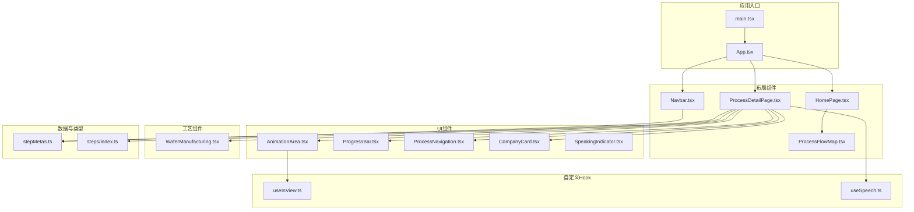
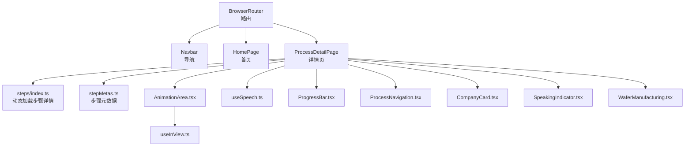
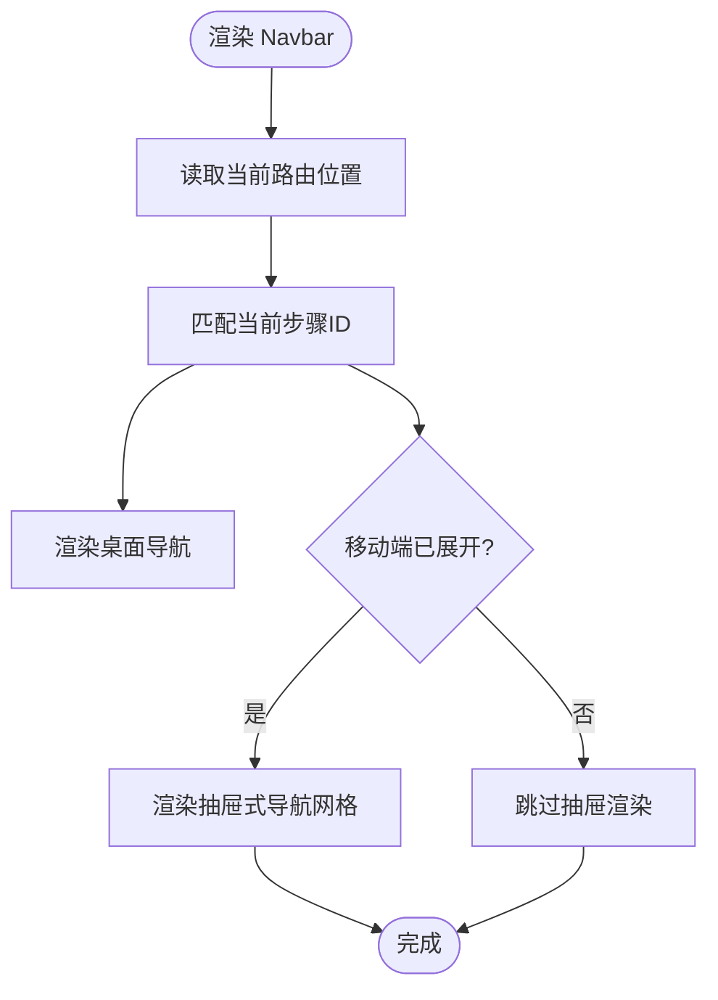
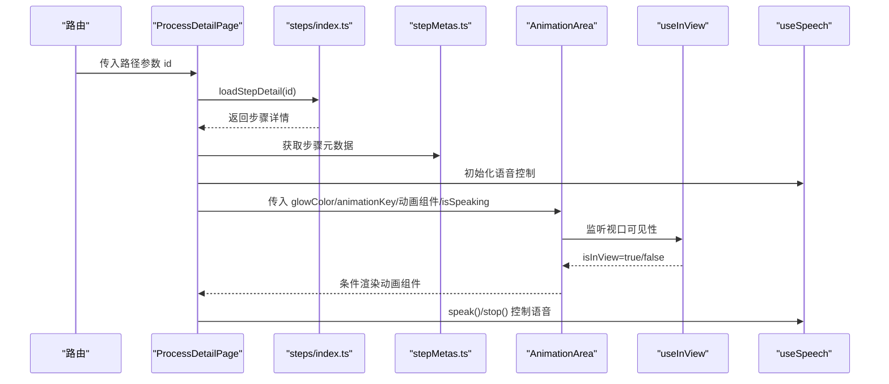
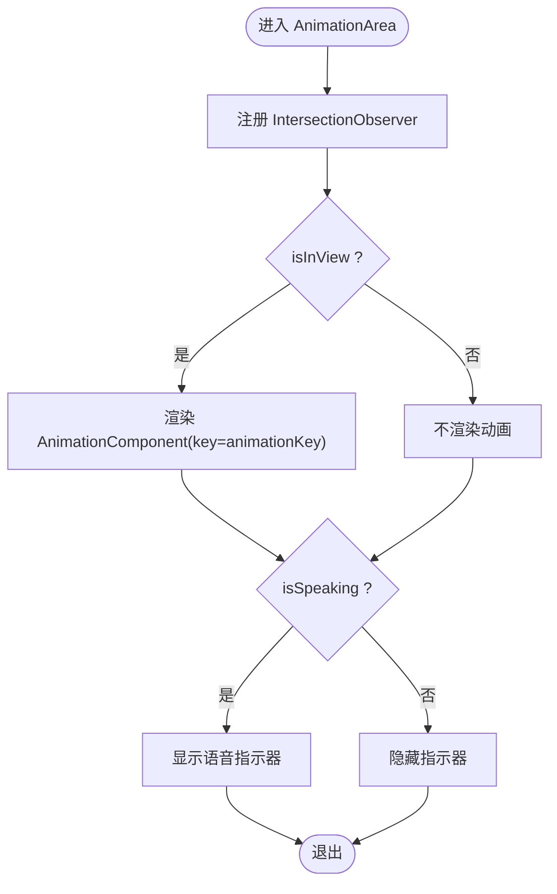
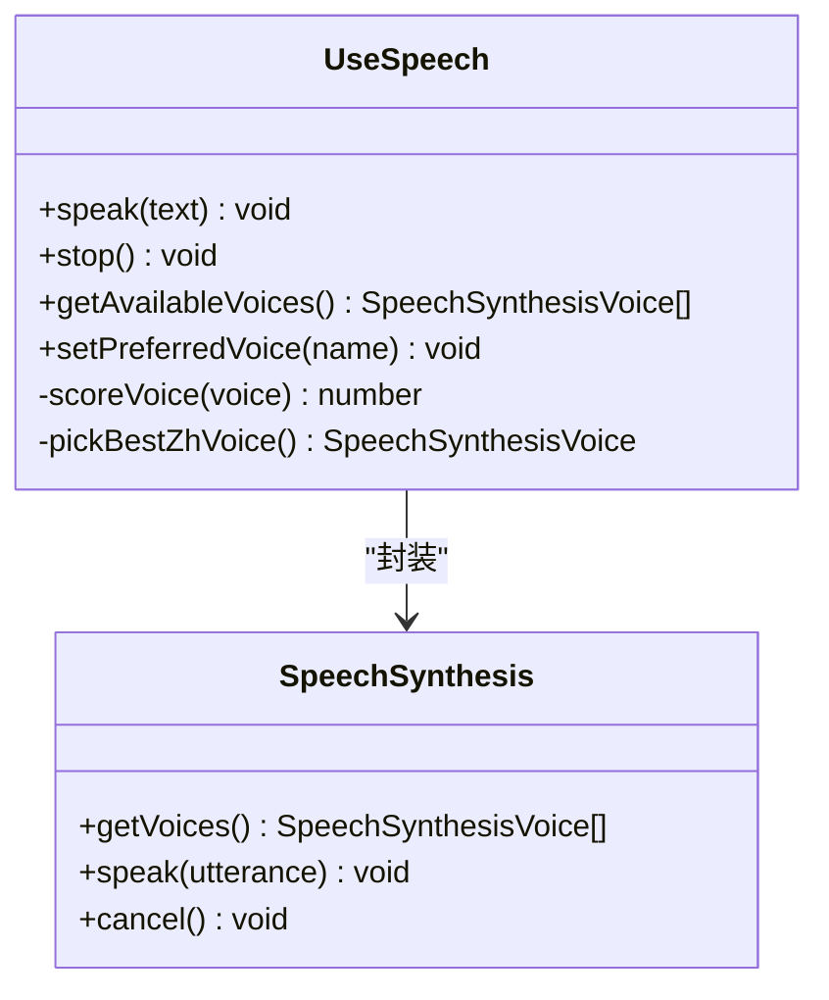
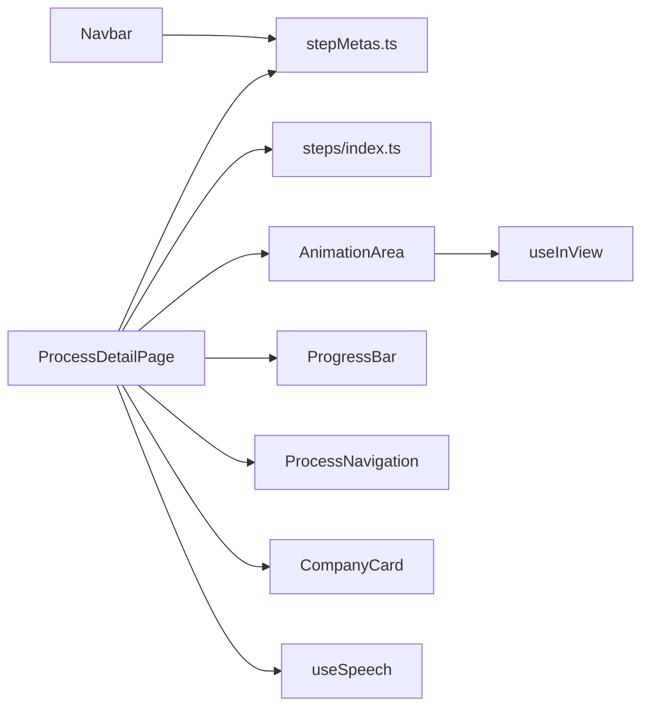

# 组件架构

<cite>
**本文引用的文件**
- [src/App.tsx](file://src/App.tsx)
- [src/main.tsx](file://src/main.tsx)
- [src/components/layout/HomePage.tsx](file://src/components/layout/HomePage.tsx)
- [src/components/layout/Navbar.tsx](file://src/components/layout/Navbar.tsx)
- [src/components/layout/ProcessDetailPage.tsx](file://src/components/layout/ProcessDetailPage.tsx)
- [src/components/layout/ProcessFlowMap.tsx](file://src/components/layout/ProcessFlowMap.tsx)
- [src/components/ui/AnimationArea.tsx](file://src/components/ui/AnimationArea.tsx)
- [src/components/ui/ProgressBar.tsx](file://src/components/ui/ProgressBar.tsx)
- [src/components/ui/ProcessNavigation.tsx](file://src/components/ui/ProcessNavigation.tsx)
- [src/components/ui/CompanyCard.tsx](file://src/components/ui/CompanyCard.tsx)
- [src/components/ui/SpeakingIndicator.tsx](file://src/components/ui/SpeakingIndicator.tsx)
- [src/components/process/WaferManufacturing.tsx](file://src/components/process/WaferManufacturing.tsx)
- [src/hooks/useInView.ts](file://src/hooks/useInView.ts)
- [src/hooks/useSpeech.ts](file://src/hooks/useSpeech.ts)
- [src/data/stepMetas.ts](file://src/data/stepMetas.ts)
- [src/data/steps/index.ts](file://src/data/steps/index.ts)
</cite>

## 目录
1. [简介](#简介)
2. [项目结构](#项目结构)
3. [核心组件](#核心组件)
4. [架构总览](#架构总览)
5. [组件详细分析](#组件详细分析)
6. [依赖关系分析](#依赖关系分析)
7. [性能考量](#性能考量)
8. [故障排查指南](#故障排查指南)
9. [结论](#结论)
10. [附录](#附录)

## 简介
本项目是一个面向芯片制造全流程的交互式演示应用，围绕“布局组件、工艺组件、UI组件”三大类组织代码。系统采用 React + TypeScript 构建，结合路由驱动的页面导航、按需加载的工艺数据与动画、以及 Web Speech API 的中文语音讲解，形成“可视化动画 + 语音讲解 + 结构化信息”的学习体验。

## 项目结构
项目采用按功能域分层的目录组织方式：
- 布局组件：负责页面骨架、导航与整体排版（如首页、工艺详情页、导航栏、流程图）。
- 工艺组件：以 SVG 动画形式呈现具体制造步骤的动态过程。
- UI 组件：通用控件（进度条、导航按钮、公司卡片、语音指示器、动画区域）。
- 数据与类型：定义步骤元数据、步骤详情模块映射与类型声明。
- 自定义 Hook：视口可见性监听与语音合成封装。
- 应用入口：根组件与渲染入口。

图表来源
- [src/main.tsx:1-11](file://src/main.tsx#L1-L11)
- [src/App.tsx:1-23](file://src/App.tsx#L1-L23)
- [src/components/layout/HomePage.tsx:1-85](file://src/components/layout/HomePage.tsx#L1-L85)
- [src/components/layout/Navbar.tsx:1-82](file://src/components/layout/Navbar.tsx#L1-L82)
- [src/components/layout/ProcessDetailPage.tsx:1-397](file://src/components/layout/ProcessDetailPage.tsx#L1-L397)
- [src/components/layout/ProcessFlowMap.tsx](file://src/components/layout/ProcessFlowMap.tsx)
- [src/components/ui/AnimationArea.tsx:1-29](file://src/components/ui/AnimationArea.tsx#L1-L29)
- [src/components/ui/ProgressBar.tsx:1-60](file://src/components/ui/ProgressBar.tsx#L1-L60)
- [src/components/ui/ProcessNavigation.tsx:1-67](file://src/components/ui/ProcessNavigation.tsx#L1-L67)
- [src/components/ui/CompanyCard.tsx:1-159](file://src/components/ui/CompanyCard.tsx#L1-L159)
- [src/components/ui/SpeakingIndicator.tsx:1-28](file://src/components/ui/SpeakingIndicator.tsx#L1-L28)
- [src/components/process/WaferManufacturing.tsx:1-122](file://src/components/process/WaferManufacturing.tsx#L1-L122)
- [src/hooks/useInView.ts:1-32](file://src/hooks/useInView.ts#L1-L32)
- [src/hooks/useSpeech.ts:1-135](file://src/hooks/useSpeech.ts#L1-L135)
- [src/data/stepMetas.ts:1-103](file://src/data/stepMetas.ts#L1-L103)
- [src/data/steps/index.ts:1-34](file://src/data/steps/index.ts#L1-L34)

章节来源
- [src/main.tsx:1-11](file://src/main.tsx#L1-L11)
- [src/App.tsx:1-23](file://src/App.tsx#L1-L23)

## 核心组件
- 布局组件
  - 导航栏：根据当前路由高亮对应工艺步骤，移动端支持抽屉式菜单。
  - 首页：展示引导语、统计信息与流程图。
  - 工艺详情页：加载步骤详情、渲染动画、语音讲解、进度与导航、企业信息。
- UI 组件
  - 动画区域：基于视口可见性条件渲染动画组件，并显示语音指示器。
  - 进度条：展示当前步骤与完成百分比，支持跳转。
  - 工艺导航：上一步/下一步或返回首页。
  - 公司卡片：按标签分类展示相关企业，支持步骤计数与高亮。
  - 语音指示器：播放语音时显示动态波形。
- 工艺组件
  - 晶圆制造动画：以 SVG 展示 CZ 法拉硅锭、线锯切割、晶圆堆叠与火花粒子效果。
- 自定义 Hook
  - 视口可见性监听：在元素进入视口时触发渲染，降低首屏压力。
  - 语音合成：自动选择中文自然语音、缓存偏好、统一速率/音调/音量参数。

章节来源
- [src/components/layout/Navbar.tsx:1-82](file://src/components/layout/Navbar.tsx#L1-L82)
- [src/components/layout/HomePage.tsx:1-85](file://src/components/layout/HomePage.tsx#L1-L85)
- [src/components/layout/ProcessDetailPage.tsx:1-397](file://src/components/layout/ProcessDetailPage.tsx#L1-L397)
- [src/components/ui/AnimationArea.tsx:1-29](file://src/components/ui/AnimationArea.tsx#L1-L29)
- [src/components/ui/ProgressBar.tsx:1-60](file://src/components/ui/ProgressBar.tsx#L1-L60)
- [src/components/ui/ProcessNavigation.tsx:1-67](file://src/components/ui/ProcessNavigation.tsx#L1-L67)
- [src/components/ui/CompanyCard.tsx:1-159](file://src/components/ui/CompanyCard.tsx#L1-L159)
- [src/components/ui/SpeakingIndicator.tsx:1-28](file://src/components/ui/SpeakingIndicator.tsx#L1-L28)
- [src/components/process/WaferManufacturing.tsx:1-122](file://src/components/process/WaferManufacturing.tsx#L1-L122)
- [src/hooks/useInView.ts:1-32](file://src/hooks/useInView.ts#L1-L32)
- [src/hooks/useSpeech.ts:1-135](file://src/hooks/useSpeech.ts#L1-L135)

## 架构总览
系统采用“路由驱动 + 数据懒加载 + 动画组件 + 语音讲解”的组合架构：
- 路由层：BrowserRouter 提供页面级导航，首页与工艺详情页分别承载不同职责。
- 数据层：步骤元数据集中管理；步骤详情通过动态导入按需加载，避免首屏体积膨胀。
- 渲染层：动画组件以函数式组件返回 SVG，配合 key 变更触发重新渲染；UI 组件通过 props 传入颜色、文案与回调。
- 交互层：语音合成 Hook 封装浏览器 API，提供播放/停止与偏好记忆；视口监听 Hook 控制动画渲染时机。

图表来源
- [src/App.tsx:1-23](file://src/App.tsx#L1-L23)
- [src/components/layout/ProcessDetailPage.tsx:1-397](file://src/components/layout/ProcessDetailPage.tsx#L1-L397)
- [src/data/steps/index.ts:1-34](file://src/data/steps/index.ts#L1-L34)
- [src/data/stepMetas.ts:1-103](file://src/data/stepMetas.ts#L1-L103)
- [src/components/ui/AnimationArea.tsx:1-29](file://src/components/ui/AnimationArea.tsx#L1-L29)
- [src/hooks/useInView.ts:1-32](file://src/hooks/useInView.ts#L1-L32)
- [src/hooks/useSpeech.ts:1-135](file://src/hooks/useSpeech.ts#L1-L135)
- [src/components/ui/ProgressBar.tsx:1-60](file://src/components/ui/ProgressBar.tsx#L1-L60)
- [src/components/ui/ProcessNavigation.tsx:1-67](file://src/components/ui/ProcessNavigation.tsx#L1-L67)
- [src/components/ui/CompanyCard.tsx:1-159](file://src/components/ui/CompanyCard.tsx#L1-L159)
- [src/components/ui/SpeakingIndicator.tsx:1-28](file://src/components/ui/SpeakingIndicator.tsx#L1-L28)
- [src/components/process/WaferManufacturing.tsx:1-122](file://src/components/process/WaferManufacturing.tsx#L1-L122)

## 组件详细分析

### 布局组件

#### 导航栏（Navbar）
- 设计模式：受控组件 + 路由集成。使用 location 判断当前激活项，移动端通过状态切换抽屉。
- 通信机制：props 传入步骤元数据，计算激活态；点击项更新本地状态。
- 生命周期：无挂载副作用，依赖路由变化重渲染。
- 性能优化：仅在移动端展开时渲染抽屉内容；使用 memo 化的步骤列表。

图表来源
- [src/components/layout/Navbar.tsx:1-82](file://src/components/layout/Navbar.tsx#L1-L82)
- [src/data/stepMetas.ts:1-103](file://src/data/stepMetas.ts#L1-L103)

章节来源
- [src/components/layout/Navbar.tsx:1-82](file://src/components/layout/Navbar.tsx#L1-L82)
- [src/data/stepMetas.ts:1-103](file://src/data/stepMetas.ts#L1-L103)

#### 首页（HomePage）
- 设计模式：静态布局 + 动态链接生成。通过步骤元数据生成“开始探索”链接与浏览流程锚点。
- 通信机制：props 传入步骤元数据；内部无状态，仅消费数据。
- 性能优化：统计区块使用网格布局，避免复杂计算；背景光晕使用 CSS 渐变减少重绘。

章节来源
- [src/components/layout/HomePage.tsx:1-85](file://src/components/layout/HomePage.tsx#L1-L85)
- [src/data/stepMetas.ts:1-103](file://src/data/stepMetas.ts#L1-L103)

#### 工艺详情页（ProcessDetailPage）
- 设计模式：容器组件 + 多种子组件协作。负责数据加载、状态管理、事件处理与子组件编排。
- 通信机制：props 传入步骤元数据与动画组件；回调处理语音播放/停止、重播动画、导航。
- 生命周期：useEffect 加载步骤详情与全量步骤统计；useMemo 构建公司名到对象的映射；useCallback 缓存事件处理器。
- 性能优化：动画 key 变更强制重渲染；useInView 控制动画区域渲染；useSpeech 统一语音参数与偏好记忆。

图表来源
- [src/components/layout/ProcessDetailPage.tsx:1-397](file://src/components/layout/ProcessDetailPage.tsx#L1-L397)
- [src/data/steps/index.ts:1-34](file://src/data/steps/index.ts#L1-L34)
- [src/data/stepMetas.ts:1-103](file://src/data/stepMetas.ts#L1-L103)
- [src/components/ui/AnimationArea.tsx:1-29](file://src/components/ui/AnimationArea.tsx#L1-L29)
- [src/hooks/useInView.ts:1-32](file://src/hooks/useInView.ts#L1-L32)
- [src/hooks/useSpeech.ts:1-135](file://src/hooks/useSpeech.ts#L1-L135)

章节来源
- [src/components/layout/ProcessDetailPage.tsx:1-397](file://src/components/layout/ProcessDetailPage.tsx#L1-L397)
- [src/data/steps/index.ts:1-34](file://src/data/steps/index.ts#L1-L34)
- [src/data/stepMetas.ts:1-103](file://src/data/stepMetas.ts#L1-L103)
- [src/hooks/useSpeech.ts:1-135](file://src/hooks/useSpeech.ts#L1-L135)

### UI 组件

#### 动画区域（AnimationArea）
- 设计模式：条件渲染 + 视口监听。根据 isInView 决定是否渲染动画组件；根据 isSpeaking 显示语音指示器。
- 通信机制：props 传入 glowColor、animationKey、AnimationComponent、isSpeaking。
- 生命周期：useEffect 注册 IntersectionObserver，清理时断开观察。
- 性能优化：通过 key 变更触发子组件重新挂载，确保动画从头开始；阈值与边距可配置。

图表来源
- [src/components/ui/AnimationArea.tsx:1-29](file://src/components/ui/AnimationArea.tsx#L1-L29)
- [src/hooks/useInView.ts:1-32](file://src/hooks/useInView.ts#L1-L32)
- [src/components/ui/SpeakingIndicator.tsx:1-28](file://src/components/ui/SpeakingIndicator.tsx#L1-L28)

章节来源
- [src/components/ui/AnimationArea.tsx:1-29](file://src/components/ui/AnimationArea.tsx#L1-L29)
- [src/hooks/useInView.ts:1-32](file://src/hooks/useInView.ts#L1-L32)
- [src/components/ui/SpeakingIndicator.tsx:1-28](file://src/components/ui/SpeakingIndicator.tsx#L1-L28)

#### 进度条（ProgressBar）
- 设计模式：只读展示 + 跳转导航。根据当前索引计算进度百分比，渲染步骤图标与名称。
- 通信机制：props 传入 currentIndex；内部通过 Link 跳转至对应步骤。
- 性能优化：使用单次计算得出进度，避免重复渲染。

章节来源
- [src/components/ui/ProgressBar.tsx:1-60](file://src/components/ui/ProgressBar.tsx#L1-L60)
- [src/data/stepMetas.ts:1-103](file://src/data/stepMetas.ts#L1-L103)

#### 工艺导航（ProcessNavigation）
- 设计模式：只读导航。根据 prev/next 计算上一步/下一步或返回首页。
- 通信机制：props 传入 prevStep/nextStep；内部通过 Link 跳转。
- 性能优化：条件渲染“返回/完成”按钮，减少 DOM。

章节来源
- [src/components/ui/ProcessNavigation.tsx:1-67](file://src/components/ui/ProcessNavigation.tsx#L1-L67)

#### 公司卡片（CompanyCard）
- 设计模式：数据驱动展示。按标签分类渲染企业卡片，支持国家旗标、标签高亮、步骤计数。
- 通信机制：props 传入 company、accentColor、stepCount；内部根据标签映射样式与阴影。
- 性能优化：分组渲染三类标签，避免重复遍历。

章节来源
- [src/components/ui/CompanyCard.tsx:1-159](file://src/components/ui/CompanyCard.tsx#L1-L159)

#### 语音指示器（SpeakingIndicator）
- 设计模式：纯函数组件 + useMemo 优化。随机生成柱状高度，使用 CSS 动画脉冲。
- 通信机制：无 props；内部通过样式属性控制动画延迟与高度。
- 性能优化：memo 化高度数组，避免每次渲染重新计算。

章节来源
- [src/components/ui/SpeakingIndicator.tsx:1-28](file://src/components/ui/SpeakingIndicator.tsx#L1-L28)

### 工艺组件

#### 晶圆制造动画（WaferManufacturing）
- 设计模式：SVG 动画。通过 CSS 动画与多个图层展示 CZ 法拉硅锭、线锯切割、晶圆堆叠与火花粒子。
- 通信机制：无 props；作为函数组件直接返回 SVG。
- 性能优化：使用 CSS 动画而非 JS 动画，减少重排；延迟变量控制堆叠出现顺序。

章节来源
- [src/components/process/WaferManufacturing.tsx:1-122](file://src/components/process/WaferManufacturing.tsx#L1-L122)

### 自定义 Hook

#### 视口可见性监听（useInView）
- 设计模式：自定义 Hook。封装 IntersectionObserver，返回 ref 与 isInView。
- 通信机制：无外部 props；通过 ref 暴露被观察元素。
- 生命周期：注册观察器于挂载，清理于卸载。
- 性能优化：阈值与边距可配置，减少不必要的渲染。

章节来源
- [src/hooks/useInView.ts:1-32](file://src/hooks/useInView.ts#L1-L32)

#### 语音合成（useSpeech）
- 设计模式：自定义 Hook。封装浏览器 Web Speech API，提供播放/停止、偏好记忆、可用语音查询。
- 通信机制：无外部 props；通过回调暴露 speak/stop/getAvailableVoices/setPreferredVoice。
- 生命周期：缓存首选语音，避免重复解析；在 onvoiceschanged 事件后延迟赋值。
- 性能优化：评分算法优先神经语音与本地服务；统一语速/音调/音量，提升可懂度。

图表来源
- [src/hooks/useSpeech.ts:1-135](file://src/hooks/useSpeech.ts#L1-L135)

章节来源
- [src/hooks/useSpeech.ts:1-135](file://src/hooks/useSpeech.ts#L1-L135)

## 依赖关系分析
- 组件耦合
  - ProcessDetailPage 依赖步骤元数据、步骤详情模块映射、动画组件集合、UI 组件与 Hook。
  - AnimationArea 依赖 useInView 与 SpeakingIndicator。
  - Navbar 依赖 stepMetas。
- 数据流
  - 路由参数驱动 ProcessDetailPage 加载步骤详情与动画组件。
  - useSpeech 在用户交互时触发语音播放，同时通过事件监听结束状态。
- 循环依赖
  - 未发现循环依赖；数据与 UI 分离清晰。

图表来源
- [src/components/layout/ProcessDetailPage.tsx:1-397](file://src/components/layout/ProcessDetailPage.tsx#L1-L397)
- [src/data/stepMetas.ts:1-103](file://src/data/stepMetas.ts#L1-L103)
- [src/data/steps/index.ts:1-34](file://src/data/steps/index.ts#L1-L34)
- [src/components/ui/AnimationArea.tsx:1-29](file://src/components/ui/AnimationArea.tsx#L1-L29)
- [src/components/ui/ProgressBar.tsx:1-60](file://src/components/ui/ProgressBar.tsx#L1-L60)
- [src/components/ui/ProcessNavigation.tsx:1-67](file://src/components/ui/ProcessNavigation.tsx#L1-L67)
- [src/components/ui/CompanyCard.tsx:1-159](file://src/components/ui/CompanyCard.tsx#L1-L159)
- [src/hooks/useSpeech.ts:1-135](file://src/hooks/useSpeech.ts#L1-L135)
- [src/hooks/useInView.ts:1-32](file://src/hooks/useInView.ts#L1-L32)
- [src/components/layout/Navbar.tsx:1-82](file://src/components/layout/Navbar.tsx#L1-L82)

章节来源
- [src/components/layout/ProcessDetailPage.tsx:1-397](file://src/components/layout/ProcessDetailPage.tsx#L1-L397)
- [src/data/stepMetas.ts:1-103](file://src/data/stepMetas.ts#L1-L103)
- [src/data/steps/index.ts:1-34](file://src/data/steps/index.ts#L1-L34)
- [src/components/ui/AnimationArea.tsx:1-29](file://src/components/ui/AnimationArea.tsx#L1-L29)
- [src/components/ui/ProgressBar.tsx:1-60](file://src/components/ui/ProgressBar.tsx#L1-L60)
- [src/components/ui/ProcessNavigation.tsx:1-67](file://src/components/ui/ProcessNavigation.tsx#L1-L67)
- [src/components/ui/CompanyCard.tsx:1-159](file://src/components/ui/CompanyCard.tsx#L1-L159)
- [src/hooks/useSpeech.ts:1-135](file://src/hooks/useSpeech.ts#L1-L135)
- [src/hooks/useInView.ts:1-32](file://src/hooks/useInView.ts#L1-L32)
- [src/components/layout/Navbar.tsx:1-82](file://src/components/layout/Navbar.tsx#L1-L82)

## 性能考量
- 懒加载与按需渲染
  - 步骤详情通过动态导入按需加载，避免首屏体积过大。
  - AnimationArea 使用 useInView 仅在可视时渲染动画，减少不必要的重绘。
- 状态与渲染优化
  - ProcessDetailPage 使用 useMemo 构建公司映射，避免重复计算。
  - useCallback 缓存事件处理器，减少子组件重渲染。
- 语音性能
  - useSpeech 统一语速/音调/音量，减少语音合成抖动；偏好记忆避免重复选择。
- CSS 动画优先
  - 工艺动画与 UI 动画尽量使用 CSS 动画，减少 JavaScript 计算开销。

## 故障排查指南
- 语音无法播放
  - 检查浏览器是否支持 Web Speech API；确认已授予音频权限。
  - 查看控制台是否有“Web Speech API not supported”警告。
- 动画不显示
  - 确认元素是否进入视口；检查 useInView 的阈值与 rootMargin 设置。
  - 确认 animationKey 是否变更导致组件重新挂载。
- 路由跳转异常
  - 检查路由参数 id 是否存在于 stepMetas；确认 steps/index.ts 中是否存在对应模块。
- 语音结束后状态未恢复
  - 确认是否移除了 speechSynthesis 的 end 事件监听；确保在组件卸载时清理。

章节来源
- [src/hooks/useSpeech.ts:1-135](file://src/hooks/useSpeech.ts#L1-L135)
- [src/hooks/useInView.ts:1-32](file://src/hooks/useInView.ts#L1-L32)
- [src/components/layout/ProcessDetailPage.tsx:1-397](file://src/components/layout/ProcessDetailPage.tsx#L1-L397)
- [src/data/steps/index.ts:1-34](file://src/data/steps/index.ts#L1-L34)
- [src/data/stepMetas.ts:1-103](file://src/data/stepMetas.ts#L1-L103)

## 结论
本项目通过清晰的组件分层与数据驱动设计，实现了芯片制造全流程的可视化演示。布局组件负责导航与骨架，UI 组件提供一致的交互体验，工艺组件以 SVG 动画直观呈现制造过程，配合语音讲解与企业信息增强学习效果。借助自定义 Hook 与按需加载策略，系统在保证交互流畅的同时兼顾了性能与可维护性。

## 附录
- 最佳实践
  - 使用 useMemo/useCallback 缓存昂贵计算与回调。
  - 使用 IntersectionObserver 控制重型内容渲染时机。
  - 通过动态导入拆分模块，降低首屏体积。
  - 统一封装浏览器 API（如语音），提供错误兜底与偏好记忆。
- 组件使用示例（路径）
  - 导航栏：[src/components/layout/Navbar.tsx:1-82](file://src/components/layout/Navbar.tsx#L1-L82)
  - 首页：[src/components/layout/HomePage.tsx:1-85](file://src/components/layout/HomePage.tsx#L1-L85)
  - 工艺详情页：[src/components/layout/ProcessDetailPage.tsx:1-397](file://src/components/layout/ProcessDetailPage.tsx#L1-L397)
  - 动画区域：[src/components/ui/AnimationArea.tsx:1-29](file://src/components/ui/AnimationArea.tsx#L1-L29)
  - 进度条：[src/components/ui/ProgressBar.tsx:1-60](file://src/components/ui/ProgressBar.tsx#L1-L60)
  - 工艺导航：[src/components/ui/ProcessNavigation.tsx:1-67](file://src/components/ui/ProcessNavigation.tsx#L1-L67)
  - 公司卡片：[src/components/ui/CompanyCard.tsx:1-159](file://src/components/ui/CompanyCard.tsx#L1-L159)
  - 语音指示器：[src/components/ui/SpeakingIndicator.tsx:1-28](file://src/components/ui/SpeakingIndicator.tsx#L1-L28)
  - 晶圆制造动画：[src/components/process/WaferManufacturing.tsx:1-122](file://src/components/process/WaferManufacturing.tsx#L1-L122)
  - 视口监听 Hook：[src/hooks/useInView.ts:1-32](file://src/hooks/useInView.ts#L1-L32)
  - 语音合成 Hook：[src/hooks/useSpeech.ts:1-135](file://src/hooks/useSpeech.ts#L1-L135)
  - 步骤元数据：[src/data/stepMetas.ts:1-103](file://src/data/stepMetas.ts#L1-L103)
  - 步骤详情加载：[src/data/steps/index.ts:1-34](file://src/data/steps/index.ts#L1-L34)