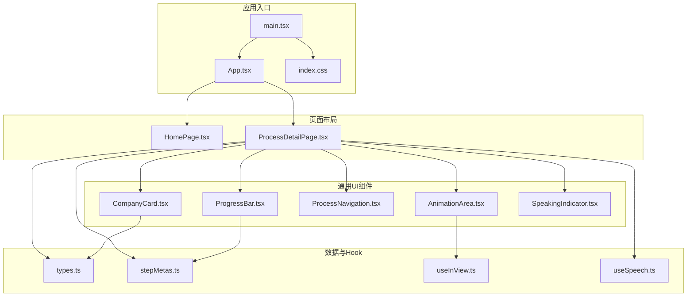
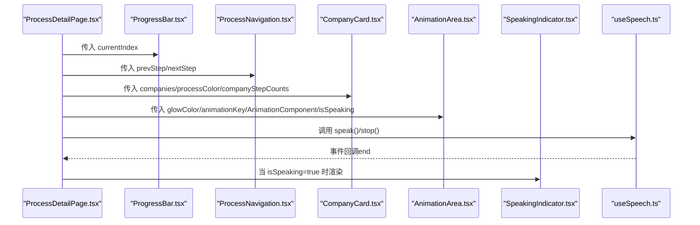
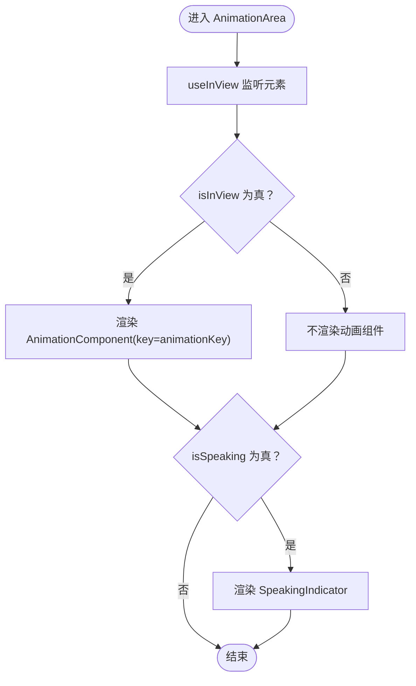
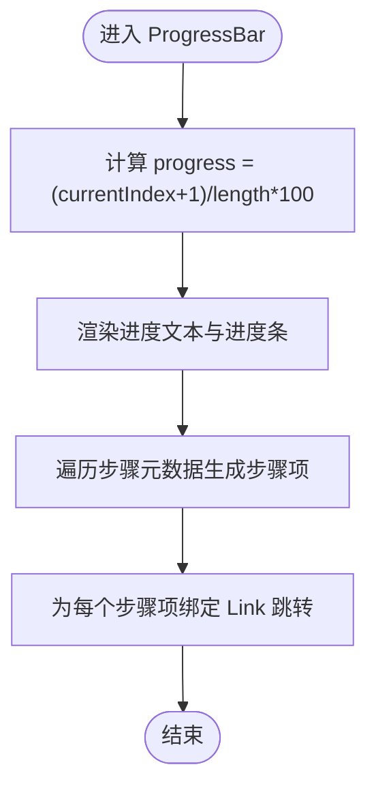
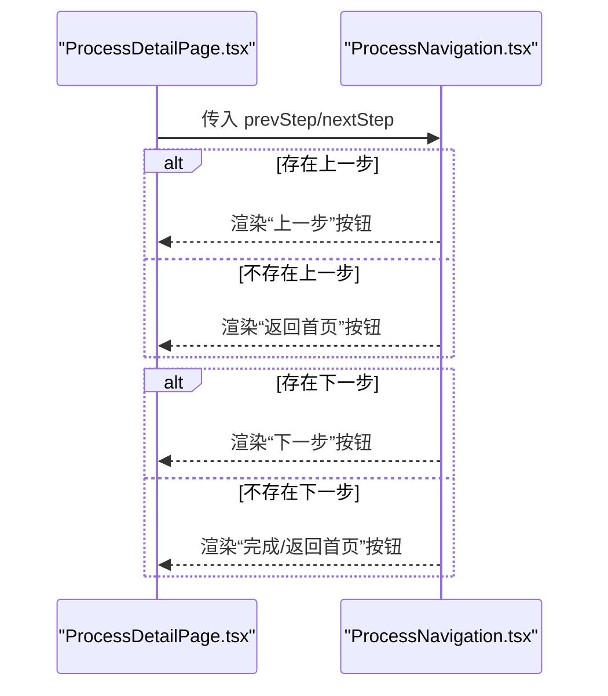
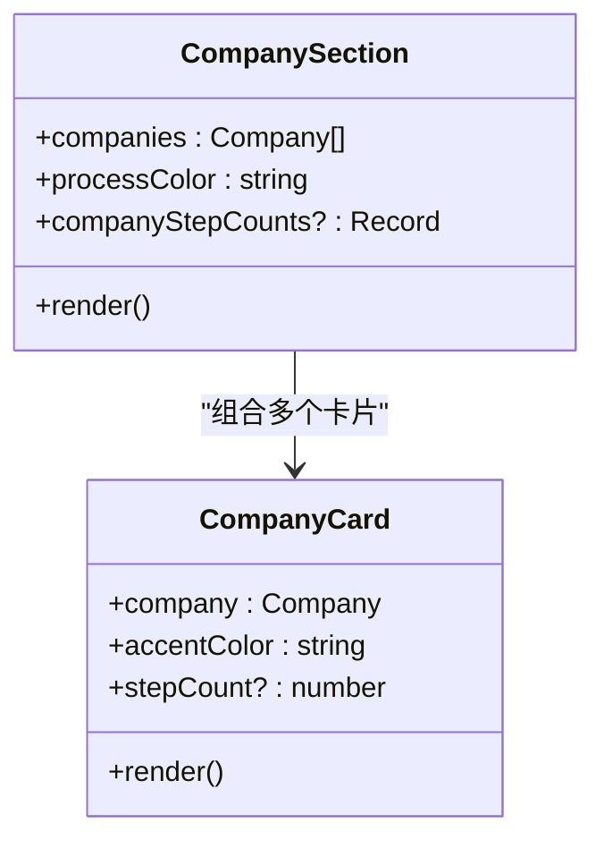
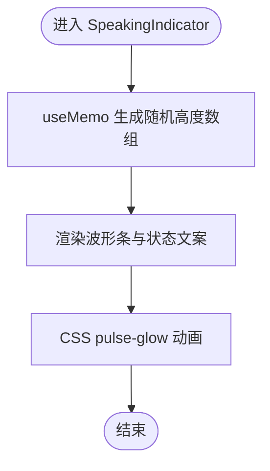
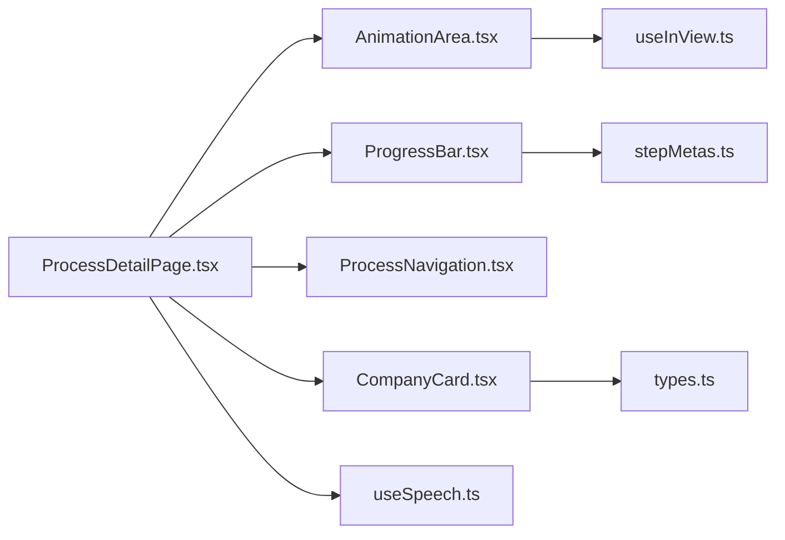

# 通用UI组件

<cite>
**本文引用的文件列表**
- [AnimationArea.tsx](file://src/components/ui/AnimationArea.tsx)
- [ProgressBar.tsx](file://src/components/ui/ProgressBar.tsx)
- [ProcessNavigation.tsx](file://src/components/ui/ProcessNavigation.tsx)
- [CompanyCard.tsx](file://src/components/ui/CompanyCard.tsx)
- [SpeakingIndicator.tsx](file://src/components/ui/SpeakingIndicator.tsx)
- [useInView.ts](file://src/hooks/useInView.ts)
- [useSpeech.ts](file://src/hooks/useSpeech.ts)
- [types.ts](file://src/data/types.ts)
- [stepMetas.ts](file://src/data/stepMetas.ts)
- [ProcessDetailPage.tsx](file://src/components/layout/ProcessDetailPage.tsx)
- [HomePage.tsx](file://src/components/layout/HomePage.tsx)
- [App.tsx](file://src/App.tsx)
- [index.css](file://src/index.css)
- [main.tsx](file://src/main.tsx)
</cite>

## 目录
1. [简介](#简介)
2. [项目结构](#项目结构)
3. [核心组件](#核心组件)
4. [架构总览](#架构总览)
5. [组件详细分析](#组件详细分析)
6. [依赖关系分析](#依赖关系分析)
7. [性能考量](#性能考量)
8. [故障排查指南](#故障排查指南)
9. [结论](#结论)
10. [附录](#附录)

## 简介
本文件面向“芯片制造演示项目”的通用UI组件，系统性梳理动画区域、进度条、工艺导航、公司卡片与语音指示器的设计原则、复用模式、props接口、样式定制与交互行为，并说明组件与父组件的通信机制与数据传递方式。同时提供最佳实践示例路径与可访问性、性能优化建议，帮助开发者在保持一致视觉风格的同时，高效扩展与维护组件体系。

## 项目结构
项目采用按功能域分层的组织方式：页面布局（layout）、业务组件（process）、通用UI（ui）、数据模型与元信息（data）、自定义Hook（hooks）以及样式入口（index.css）。通用UI组件位于 src/components/ui 下，被页面组件（如 ProcessDetailPage）消费，形成清晰的“视图层-数据层”边界。

图表来源
- [App.tsx:1-23](file://src/App.tsx#L1-L23)
- [main.tsx:1-11](file://src/main.tsx#L1-L11)
- [index.css:1-142](file://src/index.css#L1-L142)
- [ProcessDetailPage.tsx:1-397](file://src/components/layout/ProcessDetailPage.tsx#L1-L397)
- [AnimationArea.tsx:1-29](file://src/components/ui/AnimationArea.tsx#L1-L29)
- [ProgressBar.tsx:1-60](file://src/components/ui/ProgressBar.tsx#L1-L60)
- [ProcessNavigation.tsx:1-67](file://src/components/ui/ProcessNavigation.tsx#L1-L67)
- [CompanyCard.tsx:1-159](file://src/components/ui/CompanyCard.tsx#L1-L159)
- [SpeakingIndicator.tsx:1-28](file://src/components/ui/SpeakingIndicator.tsx#L1-L28)
- [useInView.ts:1-32](file://src/hooks/useInView.ts#L1-L32)
- [useSpeech.ts:1-135](file://src/hooks/useSpeech.ts#L1-L135)
- [types.ts:1-33](file://src/data/types.ts#L1-L33)
- [stepMetas.ts:1-103](file://src/data/stepMetas.ts#L1-L103)

章节来源
- [App.tsx:1-23](file://src/App.tsx#L1-L23)
- [main.tsx:1-11](file://src/main.tsx#L1-L11)
- [index.css:1-142](file://src/index.css#L1-L142)

## 核心组件
本节概述五个通用UI组件的功能定位、典型用途与复用场景：
- 动画区域：承载动态可视化动画，支持进入视口时渲染、高亮背景与语音指示器叠加。
- 进度条：展示当前工艺步骤在全流程中的位置与完成百分比，提供步骤跳转能力。
- 工艺导航：提供上一步/下一步或返回首页的导航按钮，增强流程引导。
- 公司卡片：展示参与某工艺步骤的相关企业信息，支持按标签分组与统计计数。
- 语音指示器：在语音讲解进行时显示动态波形与状态提示，提升交互感知。

章节来源
- [AnimationArea.tsx:1-29](file://src/components/ui/AnimationArea.tsx#L1-L29)
- [ProgressBar.tsx:1-60](file://src/components/ui/ProgressBar.tsx#L1-L60)
- [ProcessNavigation.tsx:1-67](file://src/components/ui/ProcessNavigation.tsx#L1-L67)
- [CompanyCard.tsx:1-159](file://src/components/ui/CompanyCard.tsx#L1-L159)
- [SpeakingIndicator.tsx:1-28](file://src/components/ui/SpeakingIndicator.tsx#L1-L28)

## 架构总览
下图展示了页面与通用UI组件之间的调用关系与数据流，体现“父组件驱动状态，子组件负责呈现”的模式。

图表来源
- [ProcessDetailPage.tsx:1-397](file://src/components/layout/ProcessDetailPage.tsx#L1-L397)
- [ProgressBar.tsx:1-60](file://src/components/ui/ProgressBar.tsx#L1-L60)
- [ProcessNavigation.tsx:1-67](file://src/components/ui/ProcessNavigation.tsx#L1-L67)
- [CompanyCard.tsx:1-159](file://src/components/ui/CompanyCard.tsx#L1-L159)
- [AnimationArea.tsx:1-29](file://src/components/ui/AnimationArea.tsx#L1-L29)
- [SpeakingIndicator.tsx:1-28](file://src/components/ui/SpeakingIndicator.tsx#L1-L28)
- [useSpeech.ts:1-135](file://src/hooks/useSpeech.ts#L1-L135)

## 组件详细分析

### 动画区域（AnimationArea）
- 设计原则
  - 视口可见时才渲染动画组件，降低首屏与切换开销。
  - 使用径向渐变背景营造“高光”氛围，强调当前工艺主题色。
  - 语音讲解时叠加语音指示器，形成统一的交互反馈。
- Props 接口
  - glowColor: string —— 主题高光色，用于背景渐变。
  - animationKey: number —— 用于强制重新挂载动画组件，便于重播。
  - AnimationComponent: React.FC | null —— 动态导入的动画组件。
  - isSpeaking: boolean —— 控制是否显示语音指示器。
- 样式定制
  - 支持通过 glowColor 动态设置背景高光；内部使用 CSS 变量与内联样式组合。
  - 通过 isInView 切换渲染，避免不必要的计算。
- 交互行为
  - 依赖 useInView 检测视口可见性，仅在可见时渲染动画组件。
  - 与父组件通过 isSpeaking 同步语音状态。
- 最佳实践示例路径
  - [动画区域调用处:200-205](file://src/components/layout/ProcessDetailPage.tsx#L200-L205)
  - [视口监听 Hook:1-32](file://src/hooks/useInView.ts#L1-L32)

图表来源
- [AnimationArea.tsx:11-28](file://src/components/ui/AnimationArea.tsx#L11-L28)
- [useInView.ts:8-31](file://src/hooks/useInView.ts#L8-L31)
- [SpeakingIndicator.tsx:3-27](file://src/components/ui/SpeakingIndicator.tsx#L3-L27)

章节来源
- [AnimationArea.tsx:1-29](file://src/components/ui/AnimationArea.tsx#L1-L29)
- [useInView.ts:1-32](file://src/hooks/useInView.ts#L1-L32)
- [ProcessDetailPage.tsx:199-206](file://src/components/layout/ProcessDetailPage.tsx#L199-L206)

### 进度条（ProgressBar）
- 设计原则
  - 展示当前步骤索引与总步骤数，计算完成百分比。
  - 提供步骤图标与名称的点击跳转，增强导航体验。
- Props 接口
  - currentIndex: number —— 当前步骤索引（从0开始）。
- 样式定制
  - 进度条使用渐变色与过渡动画，步骤项根据状态（当前/已完成/未开始）应用不同样式。
- 交互行为
  - 步骤项使用路由链接跳转至对应工艺详情页。
- 最佳实践示例路径
  - [进度条调用处](file://src/components/layout/ProcessDetailPage.tsx#L157)
  - [步骤元数据:1-103](file://src/data/stepMetas.ts#L1-L103)

图表来源
- [ProgressBar.tsx:8-59](file://src/components/ui/ProgressBar.tsx#L8-L59)
- [stepMetas.ts:11-102](file://src/data/stepMetas.ts#L11-L102)

章节来源
- [ProgressBar.tsx:1-60](file://src/components/ui/ProgressBar.tsx#L1-L60)
- [ProcessDetailPage.tsx:157](file://src/components/layout/ProcessDetailPage.tsx#L157)
- [stepMetas.ts:1-103](file://src/data/stepMetas.ts#L1-L103)

### 工艺导航（ProcessNavigation）
- 设计原则
  - 提供上一步/下一步或返回首页的导航，明确流程方向。
  - 无上一步时显示返回首页，无下一步时显示完成并返回首页。
- Props 接口
  - prevStep: { id: string; name: string } | null —— 上一步信息。
  - nextStep: { id: string; name: string } | null —— 下一步信息。
- 样式定制
  - 使用主色与前景色组合，悬停时改变边框与背景，突出交互状态。
- 交互行为
  - 通过 Link 组件跳转至对应工艺详情页。
- 最佳实践示例路径
  - [导航调用处](file://src/components/layout/ProcessDetailPage.tsx#L392)
  - [步骤元数据用于计算 prev/next:51-55](file://src/components/layout/ProcessDetailPage.tsx#L51-L55)

图表来源
- [ProcessNavigation.tsx:14-66](file://src/components/ui/ProcessNavigation.tsx#L14-L66)
- [ProcessDetailPage.tsx:51-55](file://src/components/layout/ProcessDetailPage.tsx#L51-L55)

章节来源
- [ProcessNavigation.tsx:1-67](file://src/components/ui/ProcessNavigation.tsx#L1-L67)
- [ProcessDetailPage.tsx:392](file://src/components/layout/ProcessDetailPage.tsx#L392)

### 公司卡片（CompanyCard）
- 设计原则
  - 展示企业基本信息、国家/地区、标签与高光描述，支持按标签分组。
  - 提供“环节数量”徽标，反映企业在多步骤中的参与度。
- Props 接口
  - company: Company —— 企业数据对象。
  - accentColor: string —— 用于高光与边框的颜色。
  - stepCount?: number —— 该企业参与的步骤数量。
- 样式定制
  - 使用标签映射表生成不同标签的背景、文字与阴影效果。
  - 鼠标悬停时显示高光背景，增强交互反馈。
- 交互行为
  - 作为独立卡片组件，不直接处理路由跳转，由上层容器决定如何使用。
- 最佳实践示例路径
  - [公司卡片调用处](file://src/components/layout/ProcessDetailPage.tsx#L388)
  - [公司数据类型:1-33](file://src/data/types.ts#L1-L33)

图表来源
- [CompanyCard.tsx:9-91](file://src/components/ui/CompanyCard.tsx#L9-L91)
- [CompanyCard.tsx:99-158](file://src/components/ui/CompanyCard.tsx#L99-L158)
- [types.ts:1-10](file://src/data/types.ts#L1-L10)

章节来源
- [CompanyCard.tsx:1-159](file://src/components/ui/CompanyCard.tsx#L1-L159)
- [ProcessDetailPage.tsx:388](file://src/components/layout/ProcessDetailPage.tsx#L388)
- [types.ts:1-33](file://src/data/types.ts#L1-L33)

### 语音指示器（SpeakingIndicator）
- 设计原则
  - 在语音讲解进行时显示动态波形与状态文案，提供即时反馈。
  - 使用随机高度与交错延迟的脉冲动画，模拟真实音频波形。
- Props 接口
  - 无外部 props，内部通过 useMemo 生成固定长度的波形高度数组。
- 样式定制
  - 使用模糊背景与半透明边框，配合主色高光，确保在复杂背景下仍具可读性。
- 交互行为
  - 由父组件通过 isSpeaking 控制显隐；动画由 CSS 动画驱动。
- 最佳实践示例路径
  - [语音指示器调用处](file://src/components/ui/AnimationArea.tsx#L25)
  - [父组件状态管理:38-91](file://src/components/layout/ProcessDetailPage.tsx#L38-L91)

图表来源
- [SpeakingIndicator.tsx:3-27](file://src/components/ui/SpeakingIndicator.tsx#L3-L27)
- [AnimationArea.tsx:24-25](file://src/components/ui/AnimationArea.tsx#L24-L25)
- [ProcessDetailPage.tsx:38-91](file://src/components/layout/ProcessDetailPage.tsx#L38-L91)

章节来源
- [SpeakingIndicator.tsx:1-28](file://src/components/ui/SpeakingIndicator.tsx#L1-L28)
- [AnimationArea.tsx:24-25](file://src/components/ui/AnimationArea.tsx#L24-L25)
- [ProcessDetailPage.tsx:38-91](file://src/components/layout/ProcessDetailPage.tsx#L38-L91)

## 依赖关系分析
- 组件耦合
  - AnimationArea 依赖 useInView 与 SpeakingIndicator，耦合度低，职责单一。
  - ProgressBar 依赖 stepMetas，用于步骤元数据与跳转。
  - ProcessNavigation 依赖路由参数 prevStep/nextStep 的计算结果。
  - CompanyCard 依赖 Company 类型与颜色映射，支持标签分组。
  - SpeakingIndicator 与父组件通过布尔状态通信，无外部依赖。
- 外部依赖
  - Web Speech API 由 useSpeech 提供封装，父组件通过其 speak/stop 控制语音。
  - Tailwind CSS 提供原子化样式，CSS 变量统一主题色与阴影。

图表来源
- [ProcessDetailPage.tsx:1-397](file://src/components/layout/ProcessDetailPage.tsx#L1-L397)
- [AnimationArea.tsx:1-29](file://src/components/ui/AnimationArea.tsx#L1-L29)
- [ProgressBar.tsx:1-60](file://src/components/ui/ProgressBar.tsx#L1-L60)
- [ProcessNavigation.tsx:1-67](file://src/components/ui/ProcessNavigation.tsx#L1-L67)
- [CompanyCard.tsx:1-159](file://src/components/ui/CompanyCard.tsx#L1-L159)
- [useSpeech.ts:1-135](file://src/hooks/useSpeech.ts#L1-L135)
- [useInView.ts:1-32](file://src/hooks/useInView.ts#L1-L32)
- [stepMetas.ts:1-103](file://src/data/stepMetas.ts#L1-L103)
- [types.ts:1-33](file://src/data/types.ts#L1-L33)

章节来源
- [ProcessDetailPage.tsx:1-397](file://src/components/layout/ProcessDetailPage.tsx#L1-L397)

## 性能考量
- 动画区域按需渲染
  - 使用 useInView 仅在元素进入视口时渲染动画组件，减少不必要的计算与内存占用。
  - 通过 animationKey 强制重新挂载动画组件，确保每次切换步骤时重置动画状态。
- 进度条与导航
  - ProgressBar 与 ProcessNavigation 均为纯展示组件，无副作用，渲染成本低。
  - 步骤项使用 Link 组件，避免手动路由逻辑，减少重复代码。
- 语音指示器
  - 波形高度通过 useMemo 缓存，避免每次渲染都重新计算。
  - 动画使用 CSS 动画而非 JavaScript 动画，减少主线程压力。
- 样式系统
  - Tailwind 原子类与 CSS 变量统一主题，减少重复样式定义，提升构建效率。
  - 通过 prefers-reduced-motion 适配用户偏好，避免不必要的动画。

[本节为通用性能建议，无需特定文件引用]

## 故障排查指南
- 语音讲解无法播放
  - 检查浏览器是否支持 Web Speech API，确认已调用 speak 并传入有效文本。
  - 若语音未加载完成，等待 onvoiceschanged 事件后再尝试播放。
  - 参考：[useSpeech 实现:74-107](file://src/hooks/useSpeech.ts#L74-L107)
- 语音结束后未停止指示器
  - 确认父组件监听了 speechSynthesis 的 end 事件并更新 isSpeaking 状态。
  - 参考：[父组件事件监听:101-108](file://src/components/layout/ProcessDetailPage.tsx#L101-L108)
- 动画不显示
  - 检查 AnimationComponent 是否正确映射到当前步骤 ID。
  - 确认 animationKey 已随步骤变化而递增，触发重新挂载。
  - 参考：[动画区域调用:200-205](file://src/components/layout/ProcessDetailPage.tsx#L200-L205)
- 进度条不更新
  - 确认 currentIndex 传入值正确，且 stepMetas 长度与实际一致。
  - 参考：[进度条计算:8-9](file://src/components/ui/ProgressBar.tsx#L8-L9)
- 导航按钮异常
  - 检查 prevStep/nextStep 的计算逻辑，确保边界条件（首页/末页）正确处理。
  - 参考：[导航计算:51-55](file://src/components/layout/ProcessDetailPage.tsx#L51-L55)

章节来源
- [useSpeech.ts:74-107](file://src/hooks/useSpeech.ts#L74-L107)
- [ProcessDetailPage.tsx:101-108](file://src/components/layout/ProcessDetailPage.tsx#L101-L108)
- [ProcessDetailPage.tsx:200-205](file://src/components/layout/ProcessDetailPage.tsx#L200-L205)
- [ProgressBar.tsx:8-9](file://src/components/ui/ProgressBar.tsx#L8-L9)
- [ProcessDetailPage.tsx:51-55](file://src/components/layout/ProcessDetailPage.tsx#L51-L55)

## 结论
本项目通用UI组件围绕“按需渲染、主题一致、交互明确”的设计原则构建，通过清晰的 props 接口与稳定的样式系统，实现了良好的可复用性与可维护性。父组件通过状态与事件驱动子组件，形成松耦合的数据流。结合 Web Speech API 与视口监听 Hook，组件在交互体验与性能表现上达到平衡。建议在扩展新组件时遵循现有模式：明确 props、最小化副作用、统一主题变量、提供无障碍属性与性能优化策略。

[本节为总结性内容，无需特定文件引用]

## 附录
- 可访问性建议
  - 为图片与表情符号添加 aria-label，如公司卡片中的国旗表情。
  - 为交互元素提供键盘可达性与焦点可见性。
  - 为动画提供 prefers-reduced-motion 降级方案。
- 样式定制清单
  - 主题色变量：--chip-cyan/--chip-blue/--chip-purple/--chip-green/--chip-gold
  - 渐变与阴影变量：--gradient-card/--gradient-hero/--shadow-glow
  - 组件内联样式优先使用 CSS 变量，便于主题切换。
- 数据模型参考
  - [Company 类型定义:1-10](file://src/data/types.ts#L1-L10)
  - [ProcessStep 类型定义:19-32](file://src/data/types.ts#L19-L32)
  - [步骤元数据:1-103](file://src/data/stepMetas.ts#L1-L103)

章节来源
- [index.css:28-51](file://src/index.css#L28-L51)
- [types.ts:1-33](file://src/data/types.ts#L1-L33)
- [stepMetas.ts:1-103](file://src/data/stepMetas.ts#L1-L103)