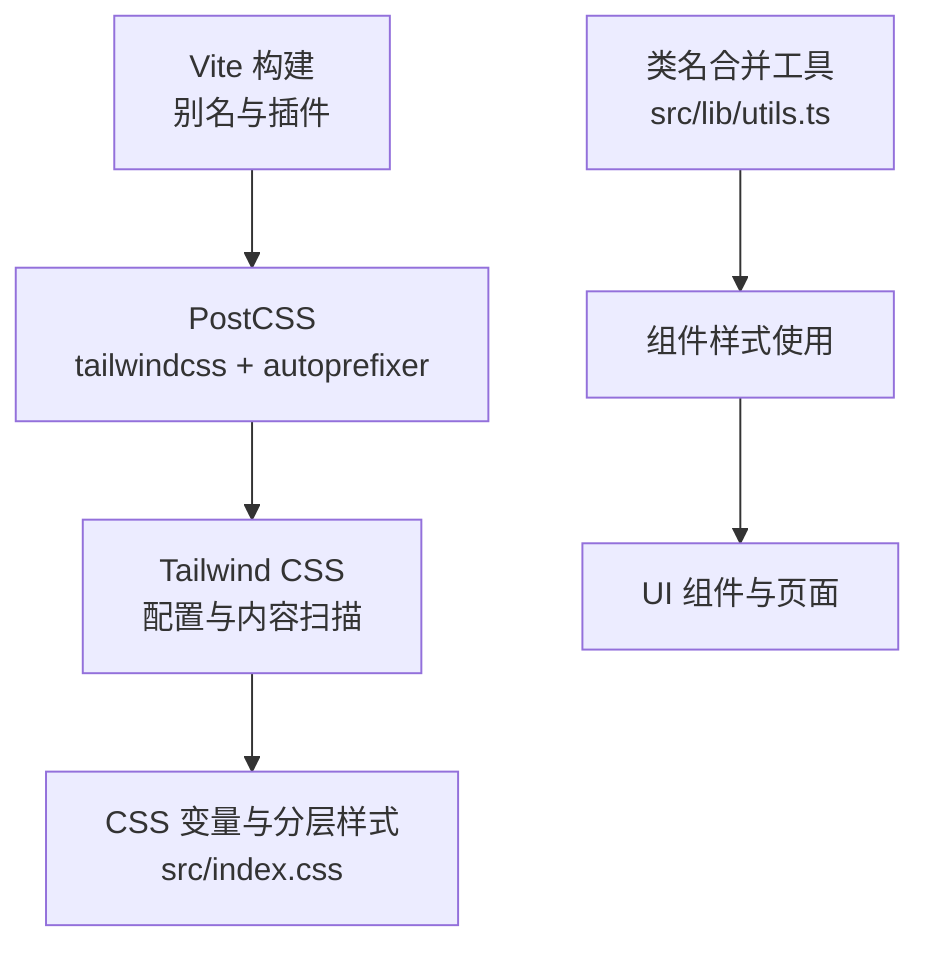
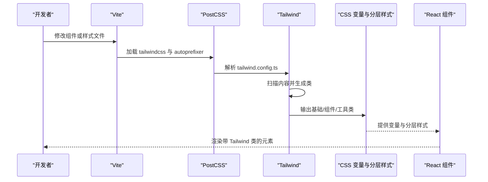
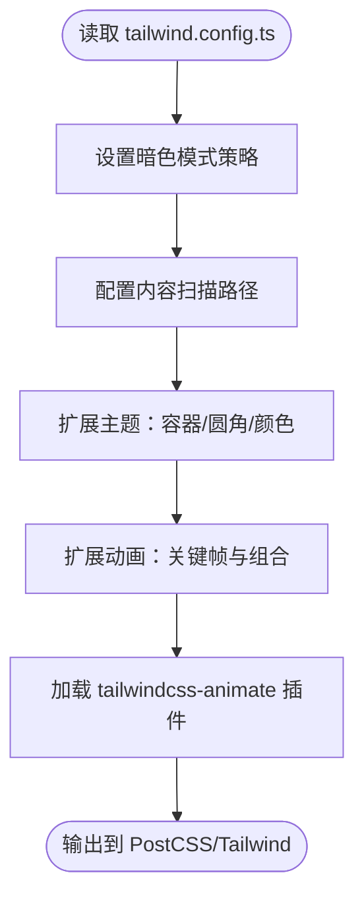
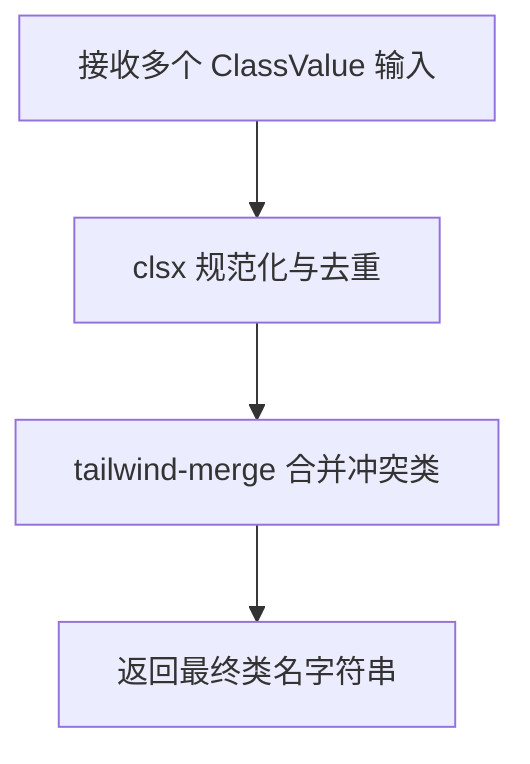
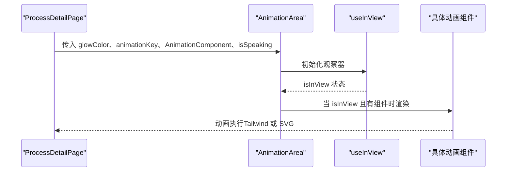
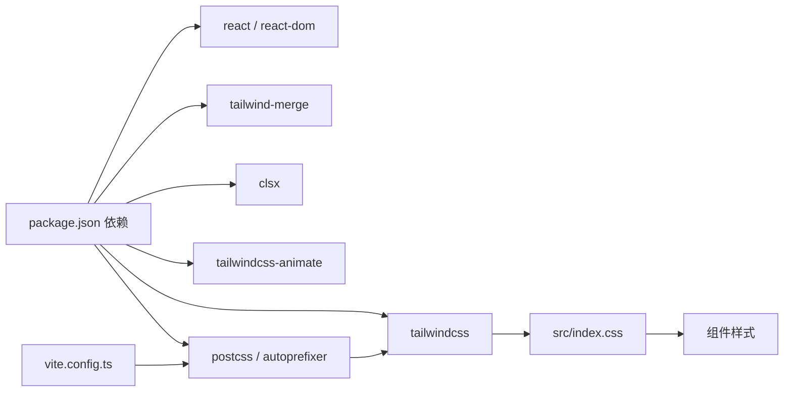

# 样式与主题

<cite>
**本文引用的文件**
- [tailwind.config.ts](file://tailwind.config.ts)
- [postcss.config.js](file://postcss.config.js)
- [src/index.css](file://src/index.css)
- [src/lib/utils.ts](file://src/lib/utils.ts)
- [package.json](file://package.json)
- [src/components/ui/AnimationArea.tsx](file://src/components/ui/AnimationArea.tsx)
- [src/components/ui/CompanyCard.tsx](file://src/components/ui/CompanyCard.tsx)
- [src/components/ui/ProgressBar.tsx](file://src/components/ui/ProgressBar.tsx)
- [src/components/layout/HomePage.tsx](file://src/components/layout/HomePage.tsx)
- [src/components/layout/ProcessDetailPage.tsx](file://src/components/layout/ProcessDetailPage.tsx)
- [src/components/ui/SpeakingIndicator.tsx](file://src/components/ui/SpeakingIndicator.tsx)
- [src/components/process/Photolithography.tsx](file://src/components/process/Photolithography.tsx)
- [src/components/process/Metallization.tsx](file://src/components/process/Metallization.tsx)
- [src/hooks/useInView.ts](file://src/hooks/useInView.ts)
- [src/data/stepMetas.ts](file://src/data/stepMetas.ts)
- [src/App.tsx](file://src/App.tsx)
- [vite.config.ts](file://vite.config.ts)
</cite>

## 目录
1. [简介](#简介)
2. [项目结构](#项目结构)
3. [核心组件](#核心组件)
4. [架构总览](#架构总览)
5. [详细组件分析](#详细组件分析)
6. [依赖关系分析](#依赖关系分析)
7. [性能考量](#性能考量)
8. [故障排查指南](#故障排查指南)
9. [结论](#结论)
10. [附录](#附录)

## 简介
本项目采用 Tailwind CSS 作为主要样式框架，并结合 PostCSS 自动前缀与构建管线，形成一套以变量驱动的主题系统与动画体系。样式系统围绕“芯片主题色系”展开，通过 CSS 变量、Tailwind 扩展与自定义动画，实现统一的视觉语言与沉浸式交互体验。文档将深入解析 Tailwind 配置与定制策略、主题颜色与设计规范、响应式断点与容器约束、CSS 类名合并工具的最佳实践、样式覆盖与主题定制方法、动画实现与性能考虑，以及样式调试与维护的指导原则。

## 项目结构
样式系统由以下关键部分组成：
- 构建与预处理：Vite + PostCSS（Tailwind + Autoprefixer）
- 主题与基础样式：src/index.css（CSS 变量、分层样式、实用工具类）
- Tailwind 配置：tailwind.config.ts（暗色模式、内容扫描、颜色扩展、动画扩展、插件）
- 工具函数：src/lib/utils.ts（类名合并工具）
- 组件样式：各 UI 组件与页面组件内直接使用 Tailwind 类与变量



图表来源
- [vite.config.ts:1-13](file://vite.config.ts#L1-L13)
- [postcss.config.js:1-7](file://postcss.config.js#L1-L7)
- [tailwind.config.ts:1-143](file://tailwind.config.ts#L1-L143)
- [src/index.css:1-142](file://src/index.css#L1-L142)
- [src/lib/utils.ts:1-7](file://src/lib/utils.ts#L1-L7)

章节来源
- [vite.config.ts:1-13](file://vite.config.ts#L1-L13)
- [postcss.config.js:1-7](file://postcss.config.js#L1-L7)
- [tailwind.config.ts:1-143](file://tailwind.config.ts#L1-L143)
- [src/index.css:1-142](file://src/index.css#L1-L142)
- [src/lib/utils.ts:1-7](file://src/lib/utils.ts#L1-L7)

## 核心组件
- Tailwind 配置与扩展
  - 暗色模式：基于 class 策略
  - 内容扫描：扫描 HTML 与 TS/TSX 文件
  - 主题扩展：容器、圆角半径、颜色系统（含芯片主题色）
  - 动画扩展：内置多种工艺动画关键帧与组合
  - 插件：tailwindcss-animate
- CSS 变量与分层样式
  - 基础层：定义明/暗主题变量、渐变、阴影、过渡
  - 实用层：文本渐变、背景渐变、发光边框、网格/电路图案、滚动条、尊重减少动效偏好
- 类名合并工具
  - 使用 clsx 与 tailwind-merge 合并类名，避免冲突与重复
- 组件样式实践
  - 使用 Tailwind 类 + CSS 变量 + 内联样式实现动态高亮与渐变
  - 通过 props 注入颜色与动画键值，实现主题一致性与可复用性

章节来源
- [tailwind.config.ts:1-143](file://tailwind.config.ts#L1-L143)
- [src/index.css:1-142](file://src/index.css#L1-L142)
- [src/lib/utils.ts:1-7](file://src/lib/utils.ts#L1-L7)
- [src/components/ui/AnimationArea.tsx:1-29](file://src/components/ui/AnimationArea.tsx#L1-L29)
- [src/components/ui/CompanyCard.tsx:1-159](file://src/components/ui/CompanyCard.tsx#L1-L159)
- [src/components/ui/ProgressBar.tsx:1-60](file://src/components/ui/ProgressBar.tsx#L1-L60)
- [src/components/layout/HomePage.tsx:1-85](file://src/components/layout/HomePage.tsx#L1-L85)
- [src/components/layout/ProcessDetailPage.tsx:1-397](file://src/components/layout/ProcessDetailPage.tsx#L1-L397)
- [src/components/ui/SpeakingIndicator.tsx:1-28](file://src/components/ui/SpeakingIndicator.tsx#L1-L28)

## 架构总览
样式系统整体工作流如下：
- 开发时，Vite 加载 PostCSS 插件，Tailwind 根据配置扫描内容并生成所需类
- 运行时，组件通过 Tailwind 类与 CSS 变量渲染，配合类名合并工具确保样式正确叠加
- 动画通过 Tailwind 扩展的 keyframes 与 animation 实现，部分 SVG 动画在组件内部定义



图表来源
- [vite.config.ts:1-13](file://vite.config.ts#L1-L13)
- [postcss.config.js:1-7](file://postcss.config.js#L1-L7)
- [tailwind.config.ts:1-143](file://tailwind.config.ts#L1-L143)
- [src/index.css:1-142](file://src/index.css#L1-L142)
- [src/App.tsx:1-23](file://src/App.tsx#L1-L23)

## 详细组件分析

### Tailwind 配置与定制策略
- 暗色模式：通过 class 策略启用，便于在根节点切换主题
- 内容扫描：覆盖根 HTML 与 src 下所有 TS/TSX 文件，确保按需生成类
- 主题扩展
  - 容器：居中、内边距、最大宽度 2xl
  - 圆角：基于 CSS 变量，lg/md/sm 三档
  - 颜色系统：基于 hsl(var(--*)) 的语义色板，包含 border/input/ring/background/foreground/primary/secondary/destructive/muted/accent/popover/card 与芯片主题色（cyan/blue/purple/green/gold/glow）
- 动画扩展：内置脉冲、滑入、浮动、旋转、流动、粒子上升、刻蚀进度、注入、沉积、抛光、扫描等关键帧与组合
- 插件：tailwindcss-animate 提供更丰富的动画类



图表来源
- [tailwind.config.ts:1-143](file://tailwind.config.ts#L1-L143)

章节来源
- [tailwind.config.ts:1-143](file://tailwind.config.ts#L1-L143)

### 主题颜色系统与设计规范
- CSS 变量：在 :root 与 .dark 中定义背景、前景、卡片、弹出层、主/次级、柔和、强调、破坏性、边框、输入、环形、半径等变量；同时定义芯片主题色与渐变、阴影、过渡
- Tailwind 颜色映射：将语义色映射到 hsl(var(--*))，实现与 CSS 变量的一致性
- 设计规范
  - 文本渐变：text-gradient-cyan
  - 背景渐变：bg-gradient-hero、bg-gradient-card、bg-gradient-glow
  - 发光效果：shadow-glow、shadow-glow-lg、border-glow
  - 背景纹理：grid-pattern、circuit-pattern
  - 滚动条：自定义滚动条样式
  - 减少动效：尊重用户 prefers-reduced-motion

```mermaid
classDiagram
class ThemeVars {
"+--background"
"+--foreground"
"+--card"
"+--popover"
"+--primary"
"+--secondary"
"+--muted"
"+--accent"
"+--destructive"
"+--border"
"+--input"
"+--ring"
"+--radius"
"+--chip-cyan / blue / purple / green / gold / glow"
"+--gradient-hero / card / process / glow"
"+--shadow-glow / glow-lg / card / elevated"
}
class TailwindTheme {
"+colors : 语义色板"
"+chip : 芯片主题色"
"+borderRadius : lg/md/sm"
}
ThemeVars --> TailwindTheme : "hsl(var(--...))"
```

图表来源
- [src/index.css:1-142](file://src/index.css#L1-L142)
- [tailwind.config.ts:18-66](file://tailwind.config.ts#L18-L66)

章节来源
- [src/index.css:1-142](file://src/index.css#L1-L142)
- [tailwind.config.ts:18-66](file://tailwind.config.ts#L18-L66)

### 响应式设计与断点策略
- 容器约束：容器居中、内边距、2xl 最大宽度，适配桌面端大屏展示
- 组件内断点：如公司卡片网格在 sm 达到两列布局，体现移动端优先与弹性布局
- 字体与排版：在基础层设置系统字体栈，保障跨平台一致性
- 动画与交互：通过动画与过渡变量统一动效节奏，减少复杂断点下的性能波动

章节来源
- [tailwind.config.ts:10-17](file://tailwind.config.ts#L10-L17)
- [src/components/ui/CompanyCard.tsx:115-136](file://src/components/ui/CompanyCard.tsx#L115-L136)
- [src/index.css:63-66](file://src/index.css#L63-L66)

### CSS 类名合并工具的使用与最佳实践
- 工具函数：cn(...) 将多个 ClassValue 输入经 clsx 处理后，再用 tailwind-merge 合并，消除冲突与重复
- 使用场景：组件根据 props 动态拼接类名，确保最终类名集合最小化且语义清晰
- 最佳实践
  - 优先使用语义类名与变量，避免内联样式污染
  - 对于条件类名，先用模板字符串或数组拼接，再传入 cn(...)
  - 在组件外部集中管理主题色与状态类名映射，提升可维护性



图表来源
- [src/lib/utils.ts:1-7](file://src/lib/utils.ts#L1-L7)

章节来源
- [src/lib/utils.ts:1-7](file://src/lib/utils.ts#L1-L7)

### 样式覆盖与主题定制方法
- 变量驱动：通过修改 :root 与 .dark 中的 CSS 变量即可完成主题切换与覆盖
- Tailwind 扩展：在 tailwind.config.ts 的 theme.extend 中新增颜色、圆角、动画，无需手写大量类
- 组件级覆盖：在组件内使用 style={{ ... }} 注入动态色值，保持与主题一致
- 渐变与阴影：通过 --gradient-* 与 --shadow-* 变量统一风格，避免硬编码

章节来源
- [src/index.css:5-57](file://src/index.css#L5-L57)
- [tailwind.config.ts:18-137](file://tailwind.config.ts#L18-L137)
- [src/components/ui/AnimationArea.tsx:18-21](file://src/components/ui/AnimationArea.tsx#L18-L21)
- [src/components/ui/CompanyCard.tsx:25-35](file://src/components/ui/CompanyCard.tsx#L25-L35)

### 动画效果的 CSS 实现与性能考虑
- Tailwind 动画：通过 theme.extend.keyframes 与 animation 定义，如 pulse-glow、slide-in-*、float-up、spin-slow、dash-flow、wave-flow、particle-rise、etch-progress、ion-implant、deposition-fall、polish-sweep、test-scan
- 组件内 SVG 动画：在具体工艺组件中使用 <style> 与 @keyframes 实现局部动画，如 Photolithography 与 Metallization
- 性能建议
  - 使用 transform 与 opacity 控制动画，避免频繁触发布局与绘制
  - 控制动画时长与缓动曲线，减少 CPU/GPU 压力
  - 对长列表或高频动画，结合 IntersectionObserver 与懒加载策略（如 useInView）



图表来源
- [src/components/layout/ProcessDetailPage.tsx:200-206](file://src/components/layout/ProcessDetailPage.tsx#L200-L206)
- [src/components/ui/AnimationArea.tsx:11-28](file://src/components/ui/AnimationArea.tsx#L11-L28)
- [src/hooks/useInView.ts:1-32](file://src/hooks/useInView.ts#L1-L32)
- [src/components/ui/SpeakingIndicator.tsx:10-26](file://src/components/ui/SpeakingIndicator.tsx#L10-L26)

章节来源
- [tailwind.config.ts:67-137](file://tailwind.config.ts#L67-L137)
- [src/components/process/Photolithography.tsx:1-136](file://src/components/process/Photolithography.tsx#L1-L136)
- [src/components/process/Metallization.tsx:1-120](file://src/components/process/Metallization.tsx#L1-L120)
- [src/components/ui/SpeakingIndicator.tsx:1-28](file://src/components/ui/SpeakingIndicator.tsx#L1-L28)
- [src/hooks/useInView.ts:1-32](file://src/hooks/useInView.ts#L1-L32)

### 响应式与容器约束
- 容器：container 居中、padding 2rem、2xl 屏幕上限 1400px
- 组件断点：sm 及以上网格两列，移动端一列
- 字体栈：系统字体优先，保障跨平台一致性

章节来源
- [tailwind.config.ts:10-17](file://tailwind.config.ts#L10-L17)
- [src/components/ui/CompanyCard.tsx:115-136](file://src/components/ui/CompanyCard.tsx#L115-L136)
- [src/index.css:63-66](file://src/index.css#L63-L66)

### 页面与组件样式示例
- 首页：hero 区域使用发光背景与渐变标题，统计区四宫格布局，底部页脚
- 进程详情页：进度条、动画区域、语音控制、信息面板、相关企业板块、导航
- 动画区域：根据 isInView 条件渲染动画组件，支持重播与语音指示器

章节来源
- [src/components/layout/HomePage.tsx:1-85](file://src/components/layout/HomePage.tsx#L1-L85)
- [src/components/layout/ProcessDetailPage.tsx:1-397](file://src/components/layout/ProcessDetailPage.tsx#L1-L397)
- [src/components/ui/AnimationArea.tsx:1-29](file://src/components/ui/AnimationArea.tsx#L1-L29)

## 依赖关系分析
- 构建链路：Vite -> PostCSS -> Tailwind -> CSS 输出
- 运行时依赖：React 生态、Lucide 图标、tailwindcss-animate、tailwind-merge、clsx
- 样式依赖：CSS 变量与 Tailwind 类的耦合，组件通过 props 传递主题色



图表来源
- [package.json:15-44](file://package.json#L15-L44)
- [vite.config.ts:1-13](file://vite.config.ts#L1-L13)
- [postcss.config.js:1-7](file://postcss.config.js#L1-L7)
- [tailwind.config.ts:1-143](file://tailwind.config.ts#L1-L143)
- [src/index.css:1-142](file://src/index.css#L1-L142)

章节来源
- [package.json:15-44](file://package.json#L15-L44)
- [vite.config.ts:1-13](file://vite.config.ts#L1-L13)
- [postcss.config.js:1-7](file://postcss.config.js#L1-L7)
- [tailwind.config.ts:1-143](file://tailwind.config.ts#L1-L143)
- [src/index.css:1-142](file://src/index.css#L1-L142)

## 性能考量
- 动画优化
  - 优先使用 transform 与 opacity
  - 控制动画数量与时长，避免同时大量元素动画
  - 利用 prefers-reduced-motion 降低动效
- 渲染优化
  - 使用容器与断点减少不必要的重排
  - 合理拆分组件，按需渲染动画区域
- 构建优化
  - Tailwind 按需生成类，避免无用样式
  - PostCSS 自动前缀与压缩，减少体积

## 故障排查指南
- 类名冲突
  - 使用 cn(...) 合并类名，避免重复与覆盖
- 动画不生效
  - 检查 keyframes 是否在 tailwind.config.ts 中定义
  - 确认 animation 名称与关键帧一致
- 主题色不一致
  - 检查 :root 与 .dark 中变量是否正确
  - 确保组件使用语义色或 CSS 变量而非硬编码色值
- 动画卡顿
  - 减少同时动画元素数量
  - 使用 transform/opacity 替代布局敏感属性
- 滚动条样式无效
  - 确认浏览器支持 ::-webkit-scrollbar
  - 检查容器是否溢出与层级

章节来源
- [src/lib/utils.ts:1-7](file://src/lib/utils.ts#L1-L7)
- [tailwind.config.ts:67-137](file://tailwind.config.ts#L67-L137)
- [src/index.css:118-140](file://src/index.css#L118-L140)

## 结论
本项目通过 Tailwind CSS 与 CSS 变量的组合，构建了以“芯片主题色系”为核心的统一视觉系统。借助容器约束、响应式断点与动画扩展，实现了从首页到详情页的完整交互体验。类名合并工具与组件化的样式实践，提升了可维护性与一致性。遵循本文的调试与性能建议，可在保证视觉质量的同时，获得流畅的用户体验。

## 附录
- 样式开发标准流程
  - 在 src/index.css 中定义或调整 CSS 变量
  - 在 tailwind.config.ts 中扩展颜色与动画
  - 在组件中使用 Tailwind 类与 cn(...) 合并类名
  - 通过 props 注入颜色与动画键值，保持主题一致性
- 质量保证措施
  - ESLint + Prettier 统一代码风格
  - 构建时 Tailwind 按需生成类，减少冗余
  - 使用 prefers-reduced-motion 适配无障碍需求