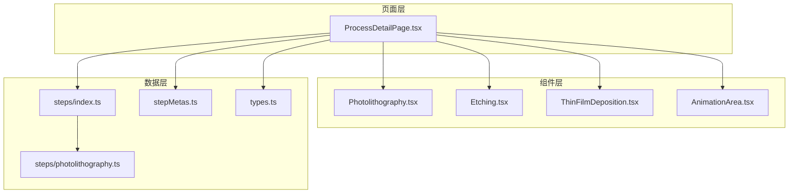
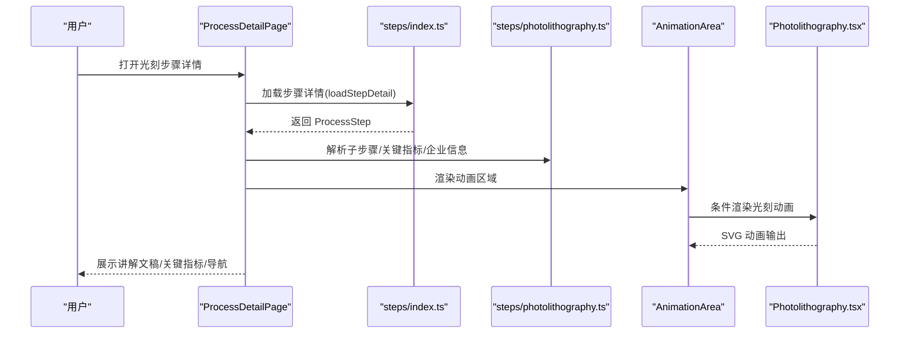
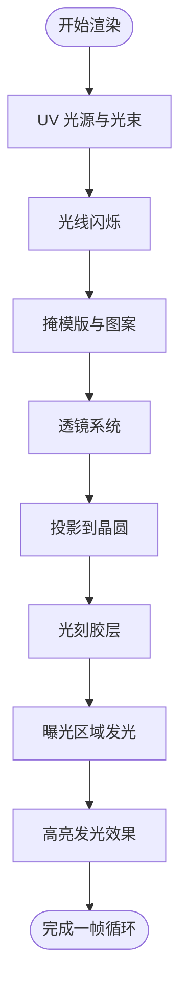
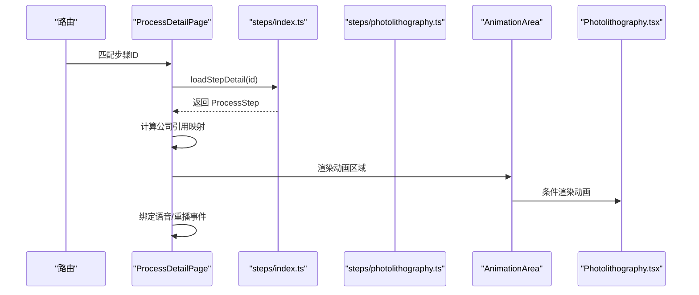
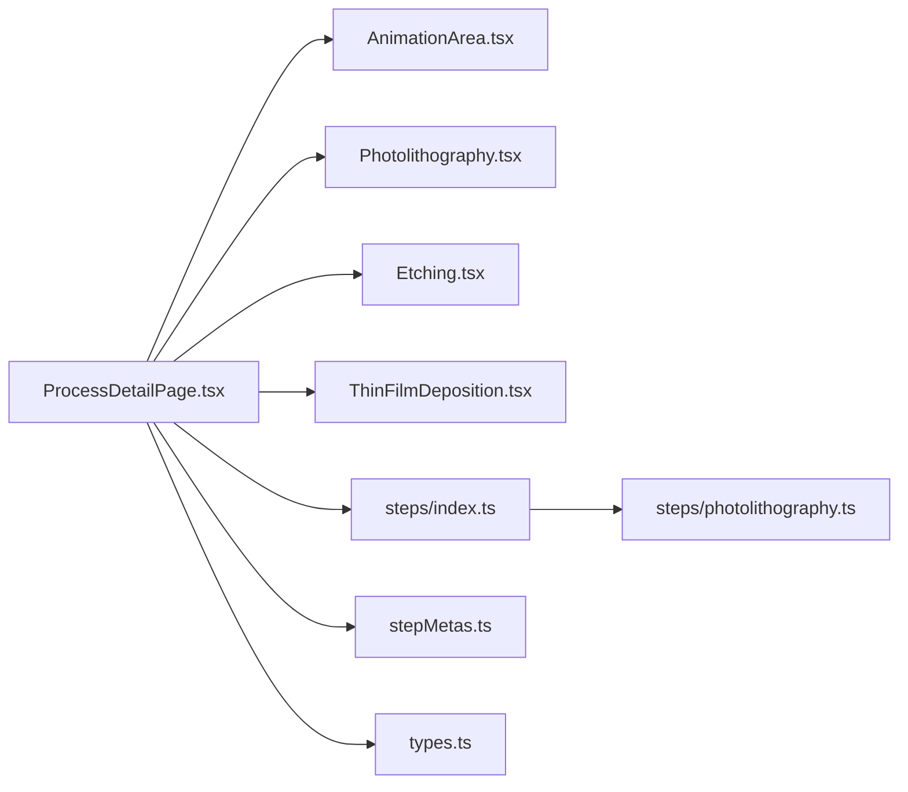

# 光刻工艺

<cite>
**本文引用的文件**
- [Photolithography.tsx](file://src/components/process/Photolithography.tsx)
- [photolithography.ts](file://src/data/steps/photolithography.ts)
- [ProcessDetailPage.tsx](file://src/components/layout/ProcessDetailPage.tsx)
- [AnimationArea.tsx](file://src/components/ui/AnimationArea.tsx)
- [index.ts](file://src/data/steps/index.ts)
- [types.ts](file://src/data/types.ts)
- [stepMetas.ts](file://src/data/stepMetas.ts)
- [Etching.tsx](file://src/components/process/Etching.tsx)
- [ThinFilmDeposition.tsx](file://src/components/process/ThinFilmDeposition.tsx)
</cite>

## 目录
1. [简介](#简介)
2. [项目结构](#项目结构)
3. [核心组件](#核心组件)
4. [架构总览](#架构总览)
5. [详细组件分析](#详细组件分析)
6. [依赖关系分析](#依赖关系分析)
7. [性能考量](#性能考量)
8. [故障排查指南](#故障排查指南)
9. [结论](#结论)
10. [附录](#附录)

## 简介
本技术文档围绕光刻工艺组件进行系统化梳理，重点解释光刻胶涂布、曝光显影与图案转移的完整流程，详述掩模版对准、紫外线曝光与化学显影的动画模拟机制，阐述光刻分辨率、对准精度与缺陷控制的技术实现要点，并给出关键参数、波长选择与光源控制策略，以及与其他工艺步骤的精确对准要求与质量检测标准。

## 项目结构
该项目采用模块化的前端架构，将每个工艺步骤封装为独立组件，并通过统一的数据层提供步骤元数据、子步骤、关键指标与企业信息。光刻工艺组件位于组件层的 process 子目录，数据层位于 data 子目录，页面层负责渲染与交互。

图表来源
- [ProcessDetailPage.tsx:36-34](file://src/components/layout/ProcessDetailPage.tsx#L36-L34)
- [Photolithography.tsx:1-136](file://src/components/process/Photolithography.tsx#L1-L136)
- [Etching.tsx:1-139](file://src/components/process/Etching.tsx#L1-L139)
- [ThinFilmDeposition.tsx:1-124](file://src/components/process/ThinFilmDeposition.tsx#L1-L124)
- [AnimationArea.tsx:11-28](file://src/components/ui/AnimationArea.tsx#L11-L28)
- [index.ts:3-33](file://src/data/steps/index.ts#L3-L33)
- [photolithography.ts:3-152](file://src/data/steps/photolithography.ts#L3-L152)
- [stepMetas.ts:11-102](file://src/data/stepMetas.ts#L11-L102)
- [types.ts:19-32](file://src/data/types.ts#L19-L32)

章节来源
- [ProcessDetailPage.tsx:36-34](file://src/components/layout/ProcessDetailPage.tsx#L36-L34)
- [index.ts:3-33](file://src/data/steps/index.ts#L3-L33)
- [stepMetas.ts:11-102](file://src/data/stepMetas.ts#L11-L102)
- [types.ts:19-32](file://src/data/types.ts#L19-L32)

## 核心组件
- 光刻动画组件：以 SVG 动画形式展示光刻胶、掩模版、曝光光路、投影图案与发光效果，体现对准、曝光与显影的时序关系。
- 数据模型：ProcessStep 定义了步骤元数据、子步骤、关键指标与企业信息，支撑页面渲染与交互。
- 页面容器：ProcessDetailPage 负责加载步骤详情、管理语音讲解、动画重播与导航。
- 动画区域：AnimationArea 控制动画可见性与高亮背景，提升视觉体验。

章节来源
- [Photolithography.tsx:1-136](file://src/components/process/Photolithography.tsx#L1-L136)
- [types.ts:19-32](file://src/data/types.ts#L19-L32)
- [ProcessDetailPage.tsx:36-34](file://src/components/layout/ProcessDetailPage.tsx#L36-L34)
- [AnimationArea.tsx:11-28](file://src/components/ui/AnimationArea.tsx#L11-L28)

## 架构总览
光刻工艺组件的运行链路如下：
- 页面入口根据路由加载步骤详情；
- 通过步骤 ID 映射到对应动画组件；
- 动画组件基于 SVG 与 CSS 动画实现曝光、对准与显影的时序模拟；
- 页面层提供语音讲解、进度条与导航，数据层提供关键指标与企业信息。

图表来源
- [ProcessDetailPage.tsx:59-67](file://src/components/layout/ProcessDetailPage.tsx#L59-L67)
- [index.ts:16-21](file://src/data/steps/index.ts#L16-L21)
- [photolithography.ts:3-152](file://src/data/steps/photolithography.ts#L3-L152)
- [AnimationArea.tsx:11-22](file://src/components/ui/AnimationArea.tsx#L11-L22)
- [Photolithography.tsx:1-136](file://src/components/process/Photolithography.tsx#L1-L136)

## 详细组件分析

### 光刻动画组件（SVG + CSS 动画）
该组件通过 SVG 几何元素与 CSS 动画实现光刻过程的可视化模拟，包括：
- UV 光源与光束锥形扩散；
- 多条光线闪烁模拟光源发散；
- 掩模版与投影图案的周期性高亮；
- 光刻胶层与曝光后的发光效果；
- 底部标签展示波长与分辨率信息。

图表来源
- [Photolithography.tsx:72-133](file://src/components/process/Photolithography.tsx#L72-L133)

章节来源
- [Photolithography.tsx:1-136](file://src/components/process/Photolithography.tsx#L1-L136)

### 页面容器与数据加载
- 步骤详情加载：通过动态导入映射表加载指定步骤的数据模块；
- 动画重播：每次切换步骤时重置动画 key，触发重新渲染；
- 语音讲解：集成语音合成接口，支持播放/停止；
- 导航与进度：基于步骤元数据生成面包屑、进度条与前后步骤导航。

图表来源
- [ProcessDetailPage.tsx:36-98](file://src/components/layout/ProcessDetailPage.tsx#L36-L98)
- [index.ts:16-21](file://src/data/steps/index.ts#L16-L21)
- [AnimationArea.tsx:11-22](file://src/components/ui/AnimationArea.tsx#L11-L22)

章节来源
- [ProcessDetailPage.tsx:36-397](file://src/components/layout/ProcessDetailPage.tsx#L36-L397)
- [index.ts:3-33](file://src/data/steps/index.ts#L3-L33)

### 数据模型与关键指标
- ProcessStep：包含步骤标识、名称、描述、详细说明、子步骤、讲解文案、图标、颜色与关键指标、企业列表；
- 关键指标：涵盖 EUV 波长、High-NA 分辨率、套刻精度 OVL、EUV 设备价格等；
- 企业信息：按类别与标签分类，标注国家与突出能力。

章节来源
- [types.ts:19-32](file://src/data/types.ts#L19-L32)
- [photolithography.ts:21-26](file://src/data/steps/photolithography.ts#L21-L26)
- [photolithography.ts:27-148](file://src/data/steps/photolithography.ts#L27-L148)

### 与其他工艺的衔接与对准要求
- 与刻蚀（Etching）衔接：光刻图形通过刻蚀精确转移到下层材料，刻蚀需具备高选择比、高各向异性与均匀性；
- 与薄膜沉积（ThinFilmDeposition）衔接：刻蚀后进行 CVD/PVD/ALD 等薄膜沉积，需保证界面清洁与对准标记不被破坏；
- 对准精度：先进节点 OVL 需控制在小于 1nm，多层光刻常采用多重图形（如 SAQP）实现更小特征尺寸；
- 质量检测：CD-SEM 实测关键尺寸与设计目标对比，边缘定位误差 EPE 小于 0.5nm，不合格品需返工。

章节来源
- [photolithography.ts:8](file://src/data/steps/photolithography.ts#L8)
- [photolithography.ts:10-15](file://src/data/steps/photolithography.ts#L10-L15)
- [Etching.tsx:1-139](file://src/components/process/Etching.tsx#L1-L139)
- [ThinFilmDeposition.tsx:1-124](file://src/components/process/ThinFilmDeposition.tsx#L1-L124)

## 依赖关系分析
- 组件依赖：ProcessDetailPage 依赖 AnimationArea 与各工艺动画组件；AnimationArea 依赖 useInView Hook 控制可见性；
- 数据依赖：ProcessDetailPage 通过 steps/index.ts 的动态映射加载步骤数据；步骤数据来源于 steps/photolithography.ts；
- 类型依赖：types.ts 提供 Company、ProcessSubStep、ProcessStep 的类型定义，确保数据一致性。

图表来源
- [ProcessDetailPage.tsx:36-34](file://src/components/layout/ProcessDetailPage.tsx#L36-L34)
- [AnimationArea.tsx:11-28](file://src/components/ui/AnimationArea.tsx#L11-L28)
- [index.ts:3-33](file://src/data/steps/index.ts#L3-L33)
- [photolithography.ts:3-152](file://src/data/steps/photolithography.ts#L3-L152)
- [stepMetas.ts:11-102](file://src/data/stepMetas.ts#L11-L102)
- [types.ts:19-32](file://src/data/types.ts#L19-L32)

章节来源
- [ProcessDetailPage.tsx:36-34](file://src/components/layout/ProcessDetailPage.tsx#L36-L34)
- [index.ts:3-33](file://src/data/steps/index.ts#L3-L33)
- [types.ts:19-32](file://src/data/types.ts#L19-L32)

## 性能考量
- 动画性能：SVG + CSS 动画在现代浏览器中具备良好性能，建议避免在低端设备上同时播放多个复杂动画；
- 懒加载：通过动态导入按需加载步骤数据与动画组件，减少初始包体积；
- 可见性优化：AnimationArea 使用 IntersectionObserver 风格的 useInView 控制动画渲染时机，降低不必要的计算；
- 数据缓存：ProcessDetailPage 在首次加载所有步骤后统计企业出现次数，避免重复计算。

章节来源
- [ProcessDetailPage.tsx:69-80](file://src/components/layout/ProcessDetailPage.tsx#L69-L80)
- [AnimationArea.tsx:11-22](file://src/components/ui/AnimationArea.tsx#L11-L22)
- [index.ts:23-33](file://src/data/steps/index.ts#L23-L33)

## 故障排查指南
- 动画不显示：检查 AnimationArea 的 isInView 状态与 animationKey 是否变化；确认路由匹配的步骤 ID 是否存在于映射表；
- 步骤详情为空：确认 steps/index.ts 中是否存在对应 ID 的动态导入；检查步骤数据模块是否正确导出默认对象；
- 语音无法播放：检查浏览器语音合成权限与 speak/stop 回调状态；确认 isSpeaking 状态与事件监听；
- 关键指标缺失：核对 steps/photolithography.ts 中 keyMetrics 字段是否正确填充；确认页面渲染逻辑是否读取该字段。

章节来源
- [ProcessDetailPage.tsx:59-67](file://src/components/layout/ProcessDetailPage.tsx#L59-L67)
- [index.ts:16-21](file://src/data/steps/index.ts#L16-L21)
- [AnimationArea.tsx:11-22](file://src/components/ui/AnimationArea.tsx#L11-L22)

## 结论
本光刻工艺组件通过清晰的模块划分与数据驱动的方式，实现了对光刻全流程的可视化呈现与交互体验。其核心在于：
- 以 SVG + CSS 动画精准模拟对准、曝光与显影的时序关系；
- 借助数据层提供关键指标与企业信息，支撑教学与展示场景；
- 与刻蚀、薄膜沉积等后续工艺紧密衔接，体现完整的制程链路。

建议在实际生产环境中结合更严格的仿真与检测标准，持续优化分辨率、对准精度与缺陷控制策略。

## 附录

### 关键参数与技术实现要点
- 波长与光源：EUV 波长 13.5nm，DUV ArF 浸没式 193nm；光源功率与稳定性直接影响曝光均匀性；
- 分辨率：High-NA EUV 数值孔径可达 0.55，实现小于 2nm 特征尺寸；
- 对准精度：套刻误差 OVL 控制在小于 1nm，多层光刻采用多重图形（SAQP）；
- 光刻胶：化学放大型正胶（CAR）与金属氧化物胶（MOO，EUV 专用）；
- 显影：TMAH 碱性显影液，关键尺寸均匀性 CDU 小于 1nm；
- 质量检测：CD-SEM 实测 EPE 小于 0.5nm，不合格品需返工。

章节来源
- [photolithography.ts:8](file://src/data/steps/photolithography.ts#L8)
- [photolithography.ts:21-26](file://src/data/steps/photolithography.ts#L21-L26)
- [photolithography.ts:10-15](file://src/data/steps/photolithography.ts#L10-L15)