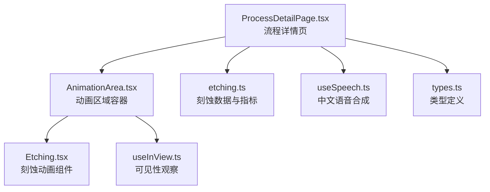
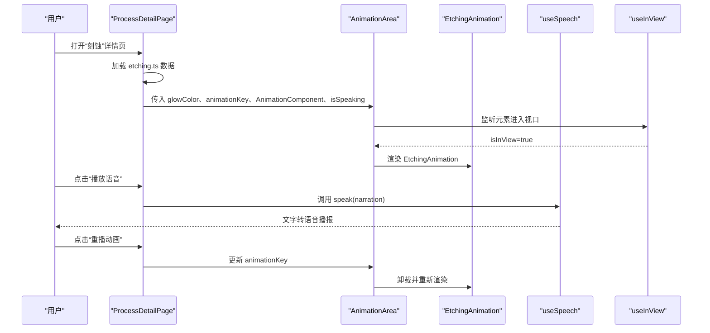
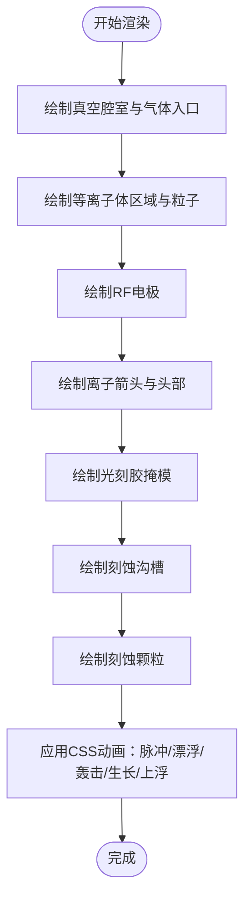
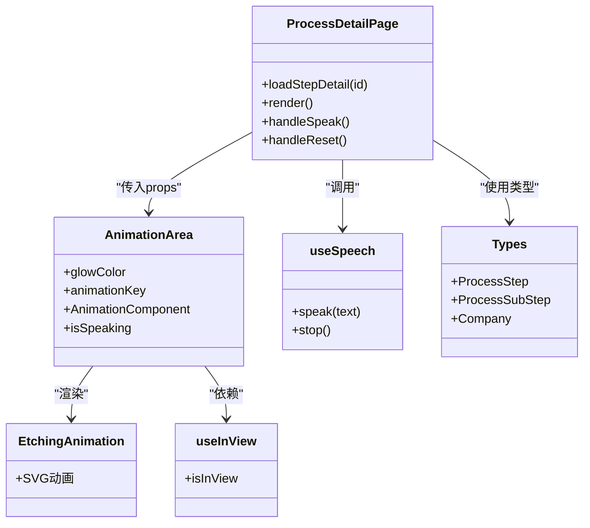

# 刻蚀工艺

<cite>
**本文引用的文件**
- [Etching.tsx](file://src/components/process/Etching.tsx)
- [etching.ts](file://src/data/steps/etching.ts)
- [ProcessDetailPage.tsx](file://src/components/layout/ProcessDetailPage.tsx)
- [AnimationArea.tsx](file://src/components/ui/AnimationArea.tsx)
- [useSpeech.ts](file://src/hooks/useSpeech.ts)
- [useInView.ts](file://src/hooks/useInView.ts)
- [types.ts](file://src/data/types.ts)
</cite>

## 目录
1. [简介](#简介)
2. [项目结构](#项目结构)
3. [核心组件](#核心组件)
4. [架构总览](#架构总览)
5. [详细组件分析](#详细组件分析)
6. [依赖关系分析](#依赖关系分析)
7. [性能考量](#性能考量)
8. [故障排查指南](#故障排查指南)
9. [结论](#结论)
10. [附录](#附录)

## 简介
本技术文档围绕“刻蚀工艺”组件，系统梳理了干法刻蚀（等离子体刻蚀）与湿法刻蚀的动画实现，重点涵盖反应离子刻蚀（RIE）与选择性腐蚀过程的可视化表达；解释刻蚀速率控制、各向异性刻蚀与侧壁保护的技术原理；阐述刻蚀均匀性与边缘效应的模拟方式；给出刻蚀关键参数、气体流量控制与功率调节的实践要点；并提供刻蚀后表面形貌检测与工艺窗口优化的建议。文档以仓库现有代码为依据，结合动画与数据驱动的交互设计，帮助读者快速理解刻蚀工艺的工程要点与教学演示价值。

## 项目结构
刻蚀组件位于前端工程中，采用模块化组织：
- 动画实现：Etching.tsx 使用 SVG + CSS 动画实现等离子体、离子轰击、沟槽刻蚀与颗粒飞溅等动态效果。
- 数据驱动：etching.ts 提供刻蚀步骤、关键指标、企业信息与讲解文案，作为页面渲染与语音讲解的数据来源。
- 页面容器：ProcessDetailPage.tsx 负责加载数据、渲染动画区域、控制语音播放与重播。
- 通用 UI：AnimationArea.tsx 提供动画区域的渐变背景与可见性控制；useInView.ts 控制动画组件的挂载时机；useSpeech.ts 提供中文自然语音合成能力。

图表来源
- [ProcessDetailPage.tsx:23-55](file://src/components/layout/ProcessDetailPage.tsx#L23-L55)
- [AnimationArea.tsx:11-28](file://src/components/ui/AnimationArea.tsx#L11-L28)
- [Etching.tsx:1-139](file://src/components/process/Etching.tsx#L1-L139)
- [etching.ts:1-142](file://src/data/steps/etching.ts#L1-L142)
- [useSpeech.ts:64-135](file://src/hooks/useSpeech.ts#L64-L135)
- [useInView.ts:8-32](file://src/hooks/useInView.ts#L8-L32)
- [types.ts:19-33](file://src/data/types.ts#L19-L33)

章节来源
- [ProcessDetailPage.tsx:23-55](file://src/components/layout/ProcessDetailPage.tsx#L23-L55)
- [AnimationArea.tsx:11-28](file://src/components/ui/AnimationArea.tsx#L11-L28)
- [Etching.tsx:1-139](file://src/components/process/Etching.tsx#L1-L139)
- [etching.ts:1-142](file://src/data/steps/etching.ts#L1-L142)
- [useSpeech.ts:64-135](file://src/hooks/useSpeech.ts#L64-L135)
- [useInView.ts:8-32](file://src/hooks/useInView.ts#L8-L32)
- [types.ts:19-33](file://src/data/types.ts#L19-L33)

## 核心组件
- 刻蚀动画组件（EtchingAnimation）
  - 使用 SVG 绘制真空腔室、等离子体区域、RF 电极、离子箭头、光刻胶掩模与刻蚀后的沟槽。
  - 通过 CSS 动画实现等离子体脉冲、粒子漂浮、离子线与头部脉动、沟槽纵向生长、颗粒上浮等效果。
  - 动画参数（时长、延迟）通过内联样式变量传递，便于统一控制与扩展。
- 数据与指标（etching.ts）
  - 定义刻蚀步骤、关键指标（侧壁垂直度、晶圆均匀性、最大深宽比、ALE 精度）与讲解文案。
  - 提供企业清单与参考标签，体现刻蚀设备与材料领域的产业生态。
- 页面容器（ProcessDetailPage）
  - 基于路由参数加载对应工艺步骤数据，渲染动画区域与信息面板。
  - 支持语音讲解与动画重播，使用 AnimationArea 包裹动画组件并传入颜色与可见性状态。
- 通用 UI 与 Hook
  - AnimationArea：提供径向渐变背景与动画组件挂载控制。
  - useInView：监听元素进入视口，决定是否渲染动画，提升性能与体验。
  - useSpeech：中文语音合成封装，自动选择更自然的本地语音，支持偏好记忆与手动切换。

章节来源
- [Etching.tsx:1-139](file://src/components/process/Etching.tsx#L1-L139)
- [etching.ts:1-142](file://src/data/steps/etching.ts#L1-L142)
- [ProcessDetailPage.tsx:36-98](file://src/components/layout/ProcessDetailPage.tsx#L36-L98)
- [AnimationArea.tsx:11-28](file://src/components/ui/AnimationArea.tsx#L11-L28)
- [useSpeech.ts:64-135](file://src/hooks/useSpeech.ts#L64-L135)
- [useInView.ts:8-32](file://src/hooks/useInView.ts#L8-L32)

## 架构总览
刻蚀组件的运行时交互链路如下：
- 用户进入“刻蚀”工艺详情页，ProcessDetailPage 加载 etching.ts 的数据。
- AnimationArea 根据 useInView 决定是否渲染 EtchingAnimation。
- EtchingAnimation 通过 CSS 动画展示等离子体、离子轰击、刻蚀沟槽与颗粒飞溅。
- 用户可点击“播放语音讲解”，由 useSpeech 调用 Web Speech API 播放讲解文案。
- 用户可点击“重播动画”，通过更新 animationKey 触发组件重新挂载，重置动画状态。

图表来源
- [ProcessDetailPage.tsx:36-98](file://src/components/layout/ProcessDetailPage.tsx#L36-L98)
- [AnimationArea.tsx:11-28](file://src/components/ui/AnimationArea.tsx#L11-L28)
- [Etching.tsx:1-139](file://src/components/process/Etching.tsx#L1-L139)
- [useSpeech.ts:74-107](file://src/hooks/useSpeech.ts#L74-L107)
- [useInView.ts:15-27](file://src/hooks/useInView.ts#L15-L27)

## 详细组件分析

### 刻蚀动画组件（EtchingAnimation）
- 结构组成
  - 真空腔室与气体入口：体现等离子体刻蚀的环境与气体供给。
  - 等离子体区域与粒子：通过渐变与模糊滤镜营造等离子体氛围。
  - RF 电极与离子箭头：展示电场引导下的离子定向轰击。
  - 光刻胶掩模与刻蚀后的沟槽：呈现图形转移与各向异性刻蚀效果。
  - 刻蚀颗粒飞溅：模拟刻蚀副产物的扩散与沉降。
- 动画机制
  - 等离子体脉冲：通过关键帧动画实现透明度周期变化，模拟等离子体密度波动。
  - 粒子漂浮：不同延迟与持续时间的动画组合，形成随机但有序的粒子运动。
  - 离子线与头部脉动：同步的延迟序列产生“波浪式”轰击效果。
  - 沟槽纵向生长：使用 scaleY 变换实现刻蚀深度增长的视觉反馈。
  - 颗粒上浮：不同延迟的上升与透明度衰减，模拟副产物的去除过程。
- 技术要点
  - 通过 CSS 变量控制动画时长与延迟，便于统一调整节奏。
  - 使用 SVG 矢量图形保证在高分辨率屏幕下的清晰度。
  - 动画时序与步进式渲染，有助于教学演示的分阶段讲解。

图表来源
- [Etching.tsx:65-139](file://src/components/process/Etching.tsx#L65-L139)

章节来源
- [Etching.tsx:1-139](file://src/components/process/Etching.tsx#L1-L139)

### 数据与指标（etching.ts）
- 工艺概述
  - 干法刻蚀：CCP（电容耦合等离子体）、ICP（电感耦合等离子体）、ALE（原子层刻蚀）。
  - 湿法刻蚀：通过化学溶液实现选择性腐蚀，常用于特定材料的去除与清洗。
- 关键指标
  - 选择比：目标材料 vs 掩蔽层（典型范围 10:1~100:1）。
  - 各向异性度：侧壁垂直性 >89°。
  - 均匀性：晶圆内 ±1%。
  - 最大深宽比：可达 100:1（3D NAND 场景）。
  - ALE 精度：单原子层级。
- 工艺步骤
  - 掩蔽层准备、等离子体激发、各向异性刻蚀、终点检测（EPD）、残余物去除、刻蚀形貌检测。
- 讲解文案
  - 对刻蚀的本质、关键指标与挑战（如 3D NAND 深孔刻蚀）进行总结性说明。

章节来源
- [etching.ts:1-142](file://src/data/steps/etching.ts#L1-L142)

### 页面容器与交互（ProcessDetailPage）
- 功能职责
  - 路由参数解析与数据加载：根据 id 加载对应工艺步骤详情。
  - 动画区域渲染：通过 AnimationArea 传入 glowColor、animationKey、AnimationComponent 与 isSpeaking。
  - 语音控制：调用 useSpeech 实现讲解播放/停止。
  - 动画重播：更新 animationKey 触发动画组件卸载与重新挂载。
- 企业与指标展示
  - 信息面板展示关键指标、详细步骤与企业参考，辅助学习与行业认知。

章节来源
- [ProcessDetailPage.tsx:36-98](file://src/components/layout/ProcessDetailPage.tsx#L36-L98)
- [ProcessDetailPage.tsx:160-396](file://src/components/layout/ProcessDetailPage.tsx#L160-L396)

### 通用 UI 与 Hook
- AnimationArea
  - 提供径向渐变背景，增强动画区域的视觉聚焦。
  - 在 isInView 为真时才渲染动画组件，避免不必要的渲染开销。
- useInView
  - 使用 IntersectionObserver 监听元素进入视口，阈值与边距可配置。
- useSpeech
  - 自动评分并选择更自然的中文语音（含神经语音偏好）。
  - 支持偏好记忆、手动切换与可用语音列表查询。

章节来源
- [AnimationArea.tsx:11-28](file://src/components/ui/AnimationArea.tsx#L11-L28)
- [useInView.ts:8-32](file://src/hooks/useInView.ts#L8-L32)
- [useSpeech.ts:64-135](file://src/hooks/useSpeech.ts#L64-L135)

## 依赖关系分析
- 组件耦合
  - ProcessDetailPage 依赖 etching.ts 的数据模型与类型定义。
  - AnimationArea 依赖 useInView 与 useSpeech 的状态与回调。
  - EtchingAnimation 为纯展示组件，不直接依赖外部状态，便于复用与测试。
- 外部依赖
  - Web Speech API：用于中文语音讲解。
  - IntersectionObserver：用于动画挂载时机控制。
- 类型契约
  - types.ts 定义了 ProcessStep、ProcessSubStep、Company 等接口，确保数据一致性与可维护性。

图表来源
- [ProcessDetailPage.tsx:36-98](file://src/components/layout/ProcessDetailPage.tsx#L36-L98)
- [AnimationArea.tsx:11-28](file://src/components/ui/AnimationArea.tsx#L11-L28)
- [Etching.tsx:1-139](file://src/components/process/Etching.tsx#L1-L139)
- [useSpeech.ts:64-135](file://src/hooks/useSpeech.ts#L64-L135)
- [useInView.ts:8-32](file://src/hooks/useInView.ts#L8-L32)
- [types.ts:19-33](file://src/data/types.ts#L19-L33)

章节来源
- [ProcessDetailPage.tsx:36-98](file://src/components/layout/ProcessDetailPage.tsx#L36-L98)
- [AnimationArea.tsx:11-28](file://src/components/ui/AnimationArea.tsx#L11-L28)
- [Etching.tsx:1-139](file://src/components/process/Etching.tsx#L1-L139)
- [useSpeech.ts:64-135](file://src/hooks/useSpeech.ts#L64-L135)
- [useInView.ts:8-32](file://src/hooks/useInView.ts#L8-L32)
- [types.ts:19-33](file://src/data/types.ts#L19-L33)

## 性能考量
- 动画挂载策略
  - 使用 useInView 将动画渲染限制在可视区域内，减少不必要的 DOM 与计算开销。
- 动画参数化
  - 通过 CSS 变量统一管理动画时长与延迟，便于在不同设备与网络条件下进行调优。
- 组件卸载与重播
  - 通过更新 animationKey 触发组件卸载与重新挂载，确保动画状态完全重置，避免残留动画状态影响体验。
- 语音合成
  - 优先选择本地服务语音，降低网络依赖；支持偏好记忆，减少重复初始化成本。

章节来源
- [useInView.ts:15-27](file://src/hooks/useInView.ts#L15-L27)
- [AnimationArea.tsx:11-28](file://src/components/ui/AnimationArea.tsx#L11-L28)
- [ProcessDetailPage.tsx:93-116](file://src/components/layout/ProcessDetailPage.tsx#L93-L116)
- [useSpeech.ts:64-135](file://src/hooks/useSpeech.ts#L64-L135)

## 故障排查指南
- 动画不显示
  - 检查 useInView 是否正确监听到元素进入视口；确认 AnimationArea 的 isInView 为 true。
  - 确认 animationKey 已更新，导致组件卸载后重新挂载。
- 语音无法播放
  - 确认浏览器支持 Web Speech API；检查浏览器权限与网络状况。
  - 若首次加载无可用语音，等待 onvoiceschanged 事件后再尝试播放。
- 动画卡顿或不同步
  - 检查 CSS 动画时长与延迟设置是否合理；适当降低粒子数量或动画复杂度。
  - 确保设备性能足够，必要时在低端设备上简化动画细节。

章节来源
- [useInView.ts:15-27](file://src/hooks/useInView.ts#L15-L27)
- [AnimationArea.tsx:11-28](file://src/components/ui/AnimationArea.tsx#L11-L28)
- [ProcessDetailPage.tsx:93-116](file://src/components/layout/ProcessDetailPage.tsx#L93-L116)
- [useSpeech.ts:74-107](file://src/hooks/useSpeech.ts#L74-L107)

## 结论
本刻蚀组件以 SVG + CSS 动画为核心，结合数据驱动的讲解与企业信息，实现了对干法刻蚀（RIE）与湿法刻蚀的可视化教学。通过各向异性刻蚀、侧壁保护与终点检测等关键概念的动画化表达，帮助学习者建立对刻蚀速率控制、均匀性与边缘效应的直观理解。同时，页面容器与 Hook 的设计确保了良好的交互体验与性能表现。未来可在动画细节与参数化控制上进一步扩展，以适配更复杂的刻蚀场景与工艺窗口优化演示。

## 附录

### 刻蚀速率控制与参数建议
- 气体流量控制
  - SiO₂：CF₄、C₄F₈、Ar；流量比例影响刻蚀速率与选择比。
  - Si：HBr、Cl₂；流量与压力共同决定各向异性度。
  - 金属：Cl₂、BCl₃；需平衡刻蚀速率与侧壁保护。
- 功率调节
  - RF 电场功率影响等离子体密度与离子能量；功率过高易造成侧壁损伤，过低则刻蚀速率不足。
  - ICP 与 CCP 的功率分配策略不同，需根据材料与深宽比要求进行匹配。
- 终点检测（EPD）
  - OES 光谱监测刻蚀产物特征波长，实现精确终点判断，避免过刻蚀。

章节来源
- [etching.ts:8-16](file://src/data/steps/etching.ts#L8-L16)

### 各向异性刻蚀与侧壁保护
- 物理轰击与化学反应协同：离子定向轰击（物理）与活性自由基反应（化学）共同作用，实现高垂直度侧壁。
- 侧壁保护：通过掩蔽层材料与工艺参数优化，减少侧壁污染与聚合物附着。
- 边缘效应与均匀性：通过压力分布、电极设计与气体流场优化，降低边缘与中心的速率差异。

章节来源
- [etching.ts:12](file://src/data/steps/etching.ts#L12)

### 刻蚀后表面形貌检测与工艺窗口优化
- CD-SEM：测量关键尺寸与线宽粗糙度（LWR），评估刻蚀轮廓与侧壁角度。
- TEM 截面：分析底部形貌与侧壁角度，指导工艺窗口优化。
- 工艺窗口：在刻蚀速率、选择比、均匀性与深宽比之间寻找最佳平衡点，确保量产稳定性。

章节来源
- [etching.ts:15](file://src/data/steps/etching.ts#L15)