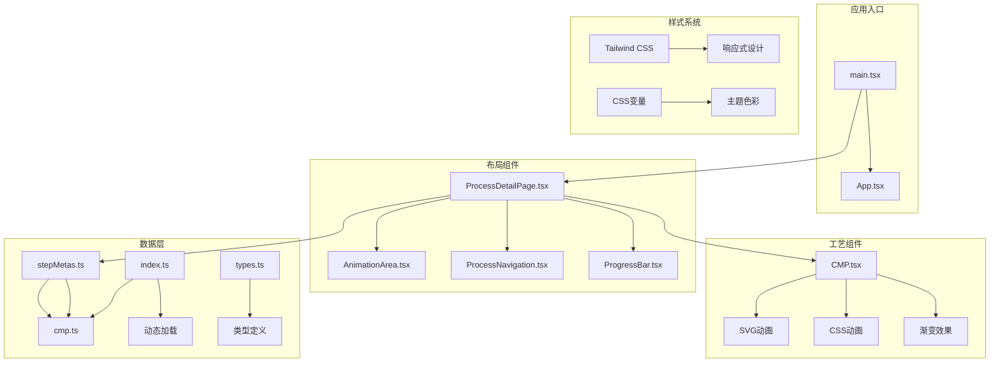
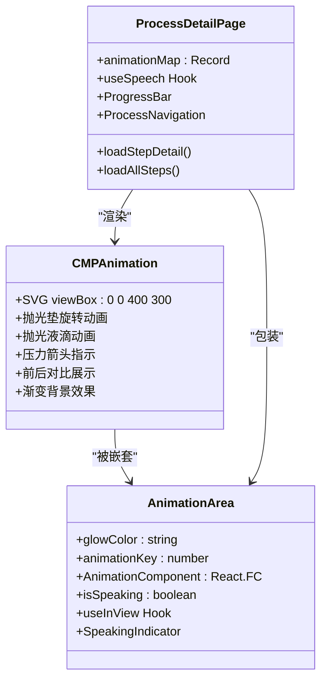
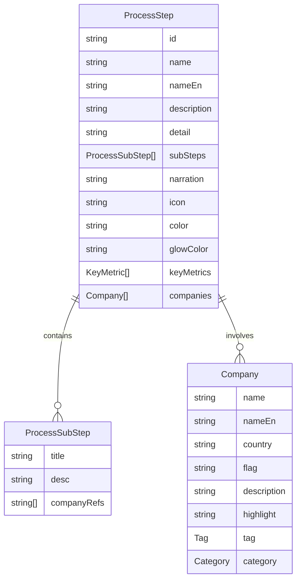
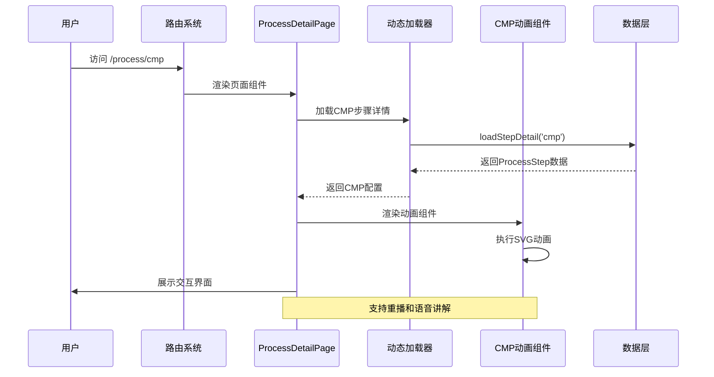
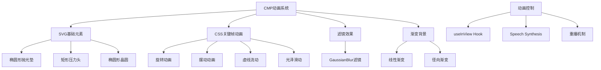
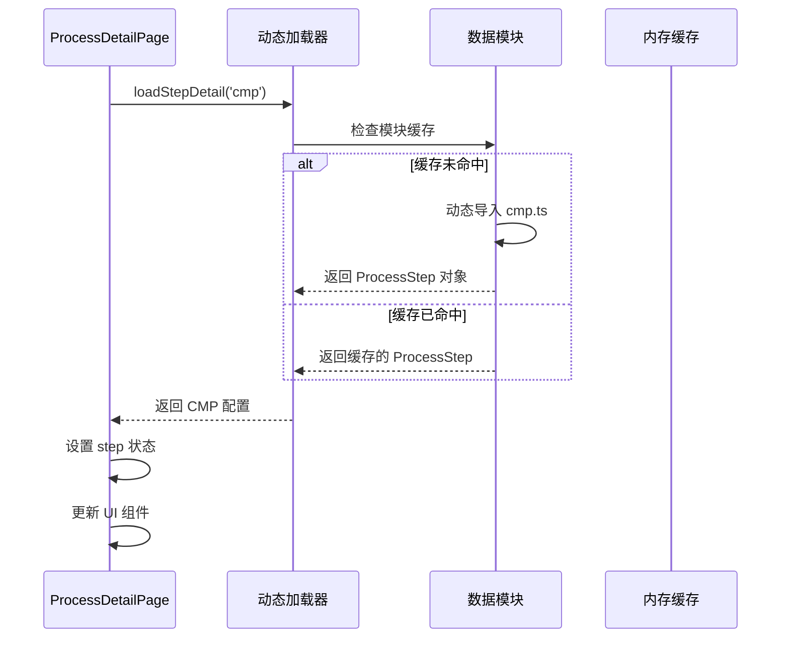

# 化学机械平坦化

<cite>
**本文档引用的文件**
- [CMP.tsx](file://src/components/process/CMP.tsx)
- [ProcessDetailPage.tsx](file://src/components/layout/ProcessDetailPage.tsx)
- [AnimationArea.tsx](file://src/components/ui/AnimationArea.tsx)
- [cmp.ts](file://src/data/steps/cmp.ts)
- [stepMetas.ts](file://src/data/stepMetas.ts)
- [index.ts](file://src/data/steps/index.ts)
- [types.ts](file://src/data/types.ts)
- [processes.ts](file://src/data/processes.ts)
- [package.json](file://package.json)
</cite>

## 目录
1. [简介](#简介)
2. [项目结构](#项目结构)
3. [核心组件](#核心组件)
4. [架构概览](#架构概览)
5. [详细组件分析](#详细组件分析)
6. [依赖关系分析](#依赖关系分析)
7. [性能考虑](#性能考虑)
8. [故障排除指南](#故障排除指南)
9. [结论](#结论)

## 简介

化学机械抛光（CMP）是半导体制造中的关键工艺技术，通过化学腐蚀与机械研磨的协同作用实现全局纳米级平坦化。本项目展示了CMP工艺的完整技术实现，包括动画模拟、工艺参数、关键指标和企业生态。

CMP工艺的核心原理是：含纳米磨料（胶体SiO₂/Al₂O₃，粒径10-300nm）和氧化剂的抛光液，在0.1-0.5MPa压力下，使晶圆在聚氨酯抛光垫上旋转。化学反应使目标材料表面软化，机械研磨将软化层去除，协同实现TTV<1nm的全局平坦化。

## 项目结构

该项目采用模块化的React架构设计，专门针对半导体制造工艺展示而构建：



**图表来源**
- [main.tsx:1-11](file://src/main.tsx#L1-L11)
- [ProcessDetailPage.tsx:36-34](file://src/components/layout/ProcessDetailPage.tsx#L36-L34)
- [CMP.tsx:1-125](file://src/components/process/CMP.tsx#L1-L125)

**章节来源**
- [package.json:1-46](file://package.json#L1-L46)
- [main.tsx:1-11](file://src/main.tsx#L1-L11)

## 核心组件

### CMP动画组件

CMP动画组件是整个系统的视觉核心，通过SVG和CSS动画实现了高度逼真的CMP工艺演示：



**图表来源**
- [CMP.tsx:1-125](file://src/components/process/CMP.tsx#L1-L125)
- [AnimationArea.tsx:11-28](file://src/components/ui/AnimationArea.tsx#L11-L28)
- [ProcessDetailPage.tsx:36-34](file://src/components/layout/ProcessDetailPage.tsx#L36-L34)

### 数据模型架构

系统采用类型安全的数据模型设计，确保CMP工艺信息的准确传递：



**图表来源**
- [types.ts:12-32](file://src/data/types.ts#L12-L32)

**章节来源**
- [types.ts:1-33](file://src/data/types.ts#L1-L33)
- [cmp.ts:3-142](file://src/data/steps/cmp.ts#L3-L142)

## 架构概览

系统采用分层架构设计，实现了清晰的关注点分离：



**图表来源**
- [ProcessDetailPage.tsx:59-67](file://src/components/layout/ProcessDetailPage.tsx#L59-L67)
- [index.ts:16-21](file://src/data/steps/index.ts#L16-L21)
- [CMP.tsx:1-125](file://src/components/process/CMP.tsx#L1-L125)

### 动画系统架构

CMP动画系统采用了多层次的动画实现策略：



**图表来源**
- [CMP.tsx:4-41](file://src/components/process/CMP.tsx#L4-L41)
- [AnimationArea.tsx:11-28](file://src/components/ui/AnimationArea.tsx#L11-L28)

**章节来源**
- [ProcessDetailPage.tsx:36-34](file://src/components/layout/ProcessDetailPage.tsx#L36-L34)
- [AnimationArea.tsx:1-29](file://src/components/ui/AnimationArea.tsx#L1-L29)

## 详细组件分析

### CMP动画实现细节

CMP动画组件通过精心设计的SVG元素和CSS动画实现了完整的工艺流程演示：

#### 抛光垫系统

抛光垫是CMP工艺的核心机械部件，系统通过以下方式实现逼真的动画效果：

- **主抛光垫**: 使用椭圆形SVG元素，应用线性渐变填充和旋转动画
- **纹理线条**: 6条细线模拟抛光垫表面的纹理结构
- **旋转机制**: 8秒周期的线性旋转动画，模拟实际抛光垫的高速旋转

#### 抛光液供应系统

抛光液供应系统通过动态效果展示CMP工艺中的液体供给：

- **液滴动画**: 5个圆形元素按时间序列产生摆动效果
- **流量指示**: 虚线流动效果显示液体的连续供给
- **模糊效果**: GaussianBlur滤镜模拟真实液体的扩散效果

#### 压力控制系统

压力系统通过箭头和几何形状直观展示CMP工艺中的压力概念：

- **压力箭头**: 向上的箭头表示垂直压力方向
- **压力头**: 矩形元素模拟研磨头的结构
- **压力分布**: 通过几何比例展示压力的均匀分布

#### 表面平坦化对比

系统提供了抛光前后的直观对比，展示CMP工艺的效果：

- **抛光前**: 不规则的凸起和凹陷
- **抛光后**: 平整的表面和光泽效果
- **过渡动画**: 箭头指示从不平坦到平坦的转变过程

**章节来源**
- [CMP.tsx:1-125](file://src/components/process/CMP.tsx#L1-L125)

### 数据加载和管理

系统采用异步数据加载机制，确保CMP工艺信息的动态获取和展示：



**图表来源**
- [index.ts:16-21](file://src/data/steps/index.ts#L16-L21)
- [cmp.ts:3-142](file://src/data/steps/cmp.ts#L3-L142)

### 企业生态展示

系统不仅展示CMP技术本身，还体现了完整的产业生态：

#### 设备制造商

- **应用材料 (Applied Materials)**: 全球CMP设备市占率约40%
- **荏原制作所 (Ebara Corporation)**: 全球第二大CMP设备商
- **华海清科 (HWATSING)**: 中国唯一CMP设备整机供应商

#### 材料供应商

- **陶氏化学 (Dow Chemical)**: 全球CMP抛光液市占率约35%
- **安集科技 (Anji Microelectronics)**: 国内CMP抛光液龙头
- **鼎龙股份 (DL Technology)**: 国内CMP抛光垫龙头

#### 代工厂

- **中芯国际 (SMIC)**: 中国大陆最先进晶圆代工厂
- **华虹半导体 (Hua Hong Semiconductor)**: 特色工艺代工重要力量
- **长鑫存储 (Changxin Memory)**: 中国大陆唯一量产DRAM企业

**章节来源**
- [cmp.ts:27-138](file://src/data/steps/cmp.ts#L27-L138)

## 依赖关系分析

系统采用模块化设计，依赖关系清晰明确：

```mermaid
graph LR
subgraph "外部依赖"
A[react@^18.3.1]
B[react-dom@^18.3.1]
C[react-router-dom@^7.1.1]
D[lucide-react@^0.468.0]
E[tailwindcss@^3.4.17]
end
subgraph "内部模块"
F[ProcessDetailPage]
G[CMP Animation]
H[AnimationArea]
I[Step Data]
J[Types]
end
subgraph "工具链"
K[Vite]
L[TypeScript]
M[ESLint]
N[Prettier]
end
F --> G
F --> H
F --> I
F --> J
G --> I
H --> J
A --> F
B --> F
C --> F
D --> F
E --> F
K --> L
M --> L
N --> L
```

**图表来源**
- [package.json:15-44](file://package.json#L15-L44)
- [ProcessDetailPage.tsx:1-21](file://src/components/layout/ProcessDetailPage.tsx#L1-L21)

### 核心依赖关系

系统的核心依赖关系体现在以下几个方面：

1. **React生态系统**: 使用现代React特性，包括Hooks和路由系统
2. **UI框架**: Tailwind CSS提供响应式设计和主题系统
3. **图标系统**: lucide-react提供统一的图标风格
4. **类型安全**: TypeScript确保代码质量和开发体验

**章节来源**
- [package.json:15-44](file://package.json#L15-L44)

## 性能考虑

系统在设计时充分考虑了性能优化：

### 动画性能优化

- **硬件加速**: SVG和CSS动画充分利用GPU加速
- **关键帧优化**: 使用高效的CSS关键帧动画
- **条件渲染**: useInView Hook确保只有可见元素才执行动画
- **内存管理**: 动态加载机制避免不必要的资源占用

### 数据加载优化

- **懒加载**: 工艺步骤数据按需加载
- **缓存策略**: 内存缓存避免重复加载
- **并发处理**: Promise.all实现并行数据加载
- **错误处理**: 完善的异常捕获和降级机制

### 用户体验优化

- **渐进式渲染**: 分阶段显示内容，提升感知性能
- **无障碍支持**: 语音合成和屏幕阅读器兼容
- **响应式设计**: 适配不同设备和屏幕尺寸
- **交互反馈**: 实时的状态指示和用户反馈

## 故障排除指南

### 常见问题诊断

#### 动画不显示问题

**症状**: CMP动画不显示或显示异常

**可能原因**:
1. useInView Hook未正确初始化
2. SVG元素渲染失败
3. CSS动画类名冲突
4. 浏览器兼容性问题

**解决方法**:
1. 检查useInView Hook的阈值设置
2. 验证SVG元素的viewBox属性
3. 确认CSS类名的正确性
4. 测试不同浏览器的兼容性

#### 数据加载失败

**症状**: CMP工艺详情无法加载

**可能原因**:
1. 动态导入路径错误
2. 数据模块格式不正确
3. 网络请求超时
4. 类型定义不匹配

**解决方法**:
1. 验证step ID的正确性
2. 检查ProcessStep接口定义
3. 实现重试机制
4. 添加错误边界组件

#### 性能问题

**症状**: 页面加载缓慢或动画卡顿

**可能原因**:
1. 过多的DOM元素
2. 复杂的CSS计算
3. 频繁的重排重绘
4. 内存泄漏

**解决方法**:
1. 优化SVG结构
2. 减少CSS复杂度
3. 使用transform替代布局属性
4. 实施内存清理机制

**章节来源**
- [ProcessDetailPage.tsx:59-67](file://src/components/layout/ProcessDetailPage.tsx#L59-L67)
- [AnimationArea.tsx:11-28](file://src/components/ui/AnimationArea.tsx#L11-L28)

## 结论

本项目成功实现了CMP化学机械平坦化工艺的完整技术展示，通过创新的动画系统和严谨的数据架构，为用户提供了一个既具教育意义又具备实用价值的交互式学习平台。

### 技术亮点

1. **创新的动画实现**: 通过SVG和CSS实现了高度逼真的CMP工艺演示
2. **模块化架构设计**: 清晰的组件分离和数据流管理
3. **完整的产业生态**: 展示了CMP技术的全链条应用
4. **性能优化策略**: 多层次的性能优化确保流畅体验

### 应用价值

- **教育价值**: 为学生和从业者提供了直观的CMP工艺学习工具
- **技术参考**: 展示了现代前端技术在工业仿真中的应用
- **产业洞察**: 体现了CMP技术在全球半导体产业中的重要地位
- **创新示范**: 展示了如何将复杂的工业过程转化为易懂的可视化内容

### 发展前景

随着半导体技术向更先进节点发展，CMP工艺将继续演进。本项目为未来的技术扩展和功能增强奠定了坚实基础，可以轻松集成新的工艺参数、材料特性和检测技术，为下一代CMP教学和研究平台提供支持。