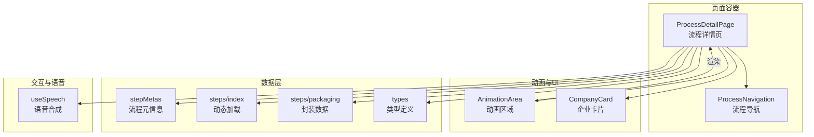
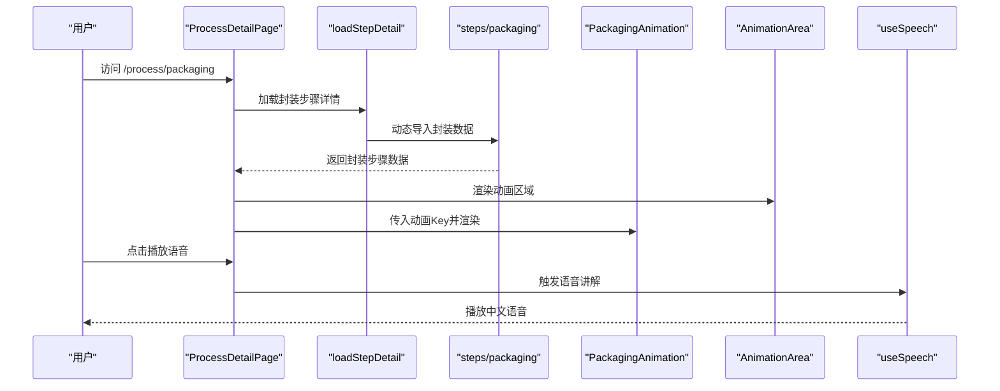
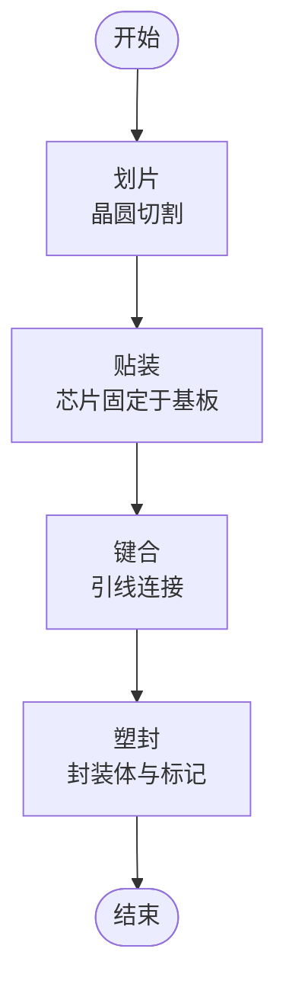
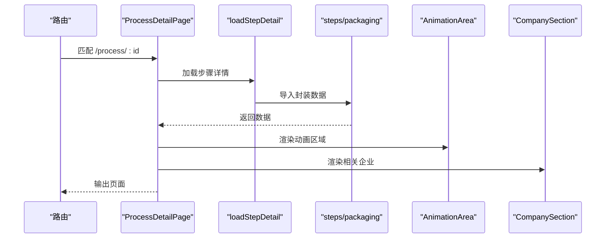
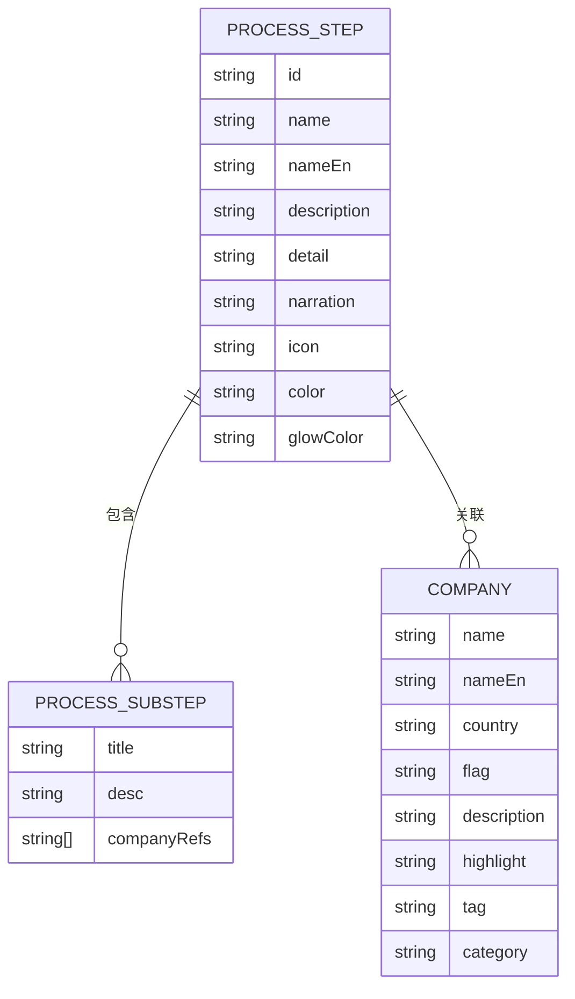
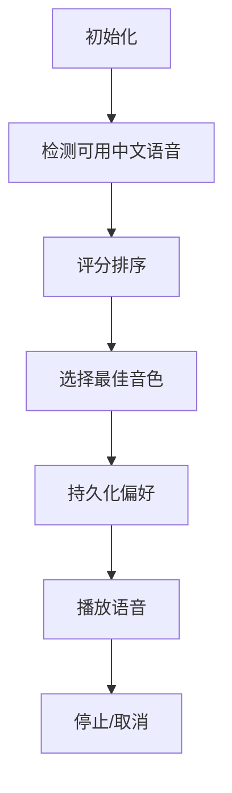
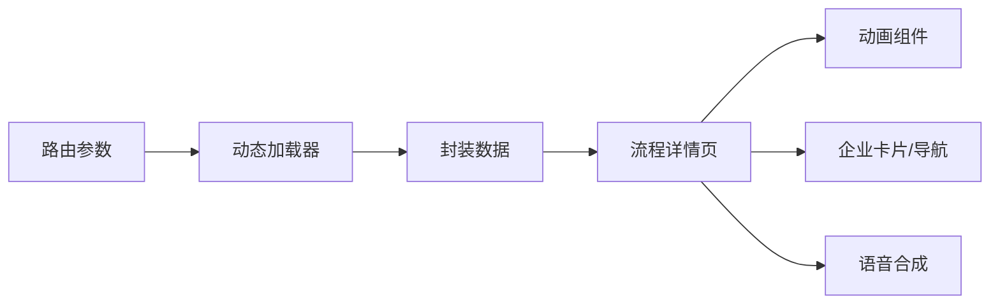

# 封装工艺

<cite>
**本文引用的文件**
- [Packaging.tsx](file://src/components/process/Packaging.tsx)
- [ProcessDetailPage.tsx](file://src/components/layout/ProcessDetailPage.tsx)
- [AnimationArea.tsx](file://src/components/ui/AnimationArea.tsx)
- [packaging.ts](file://src/data/steps/packaging.ts)
- [stepMetas.ts](file://src/data/stepMetas.ts)
- [index.ts](file://src/data/steps/index.ts)
- [types.ts](file://src/data/types.ts)
- [useSpeech.ts](file://src/hooks/useSpeech.ts)
- [CompanyCard.tsx](file://src/components/ui/CompanyCard.tsx)
- [ProcessNavigation.tsx](file://src/components/ui/ProcessNavigation.tsx)
</cite>

## 目录
1. [简介](#简介)
2. [项目结构](#项目结构)
3. [核心组件](#核心组件)
4. [架构总览](#架构总览)
5. [详细组件分析](#详细组件分析)
6. [依赖关系分析](#依赖关系分析)
7. [性能考量](#性能考量)
8. [故障排查指南](#故障排查指南)
9. [结论](#结论)
10. [附录](#附录)

## 简介
本技术文档围绕“封装工艺”组件，系统性阐述芯片封装从“划片 → 贴装 → 键合 → 塑封”的完整流程动画与工程实现，覆盖芯片固定、焊线质量、密封保护等关键技术点，并结合封装材料选择、热管理与电绝缘的工程考虑，给出关键参数、键合强度与可靠性测试建议，以及封装后电气性能验证与环境应力筛选方法。文档同时展示前端动画与数据驱动的交互体验，帮助非专业读者也能直观理解先进封装的复杂流程与技术要点。

## 项目结构
封装工艺组件由页面容器、动画组件、数据模型与交互钩子组成，采用按流程步骤组织的数据结构，支持动态加载与语音讲解。

图表来源
- [ProcessDetailPage.tsx:36-396](file://src/components/layout/ProcessDetailPage.tsx#L36-L396)
- [AnimationArea.tsx:11-28](file://src/components/ui/AnimationArea.tsx#L11-L28)
- [stepMetas.ts:11-102](file://src/data/stepMetas.ts#L11-L102)
- [index.ts:16-33](file://src/data/steps/index.ts#L16-L33)
- [packaging.ts:3-162](file://src/data/steps/packaging.ts#L3-L162)
- [types.ts:1-33](file://src/data/types.ts#L1-L33)
- [useSpeech.ts:64-134](file://src/hooks/useSpeech.ts#L64-L134)

章节来源
- [ProcessDetailPage.tsx:36-396](file://src/components/layout/ProcessDetailPage.tsx#L36-L396)
- [stepMetas.ts:11-102](file://src/data/stepMetas.ts#L11-L102)
- [index.ts:16-33](file://src/data/steps/index.ts#L16-L33)

## 核心组件
- 动画组件：封装流程SVG动画，包含划片、贴装、键合、塑封四个阶段的视觉呈现与时间轴动画。
- 页面容器：流程详情页，负责加载数据、控制动画重播、语音讲解与导航。
- 数据模型：封装步骤的元信息、子步骤、关键指标、企业映射与国际化描述。
- 交互钩子：语音合成，自动选择中文自然音色，支持暂停与偏好记忆。
- UI辅助：企业卡片、流程导航、动画区域与进度指示。

章节来源
- [Packaging.tsx:1-128](file://src/components/process/Packaging.tsx#L1-L128)
- [ProcessDetailPage.tsx:36-396](file://src/components/layout/ProcessDetailPage.tsx#L36-L396)
- [packaging.ts:3-162](file://src/data/steps/packaging.ts#L3-L162)
- [useSpeech.ts:64-134](file://src/hooks/useSpeech.ts#L64-L134)

## 架构总览
封装流程的前端架构以“页面容器 + 动画组件 + 数据模块 + 交互钩子”为核心，通过路由参数定位当前流程步骤，动态加载对应数据与动画组件，实现“所见即所得”的可视化教学体验。

图表来源
- [ProcessDetailPage.tsx:59-67](file://src/components/layout/ProcessDetailPage.tsx#L59-L67)
- [index.ts:16-21](file://src/data/steps/index.ts#L16-L21)
- [packaging.ts:3-162](file://src/data/steps/packaging.ts#L3-L162)
- [AnimationArea.tsx:22](file://src/components/ui/AnimationArea.tsx#L22)
- [useSpeech.ts:74-107](file://src/hooks/useSpeech.ts#L74-L107)

## 详细组件分析

### 动画组件：封装流程SVG动画
- 功能概述：以SVG绘制“划片 → 贴装 → 键合 → 塑封”的四步流程，使用CSS动画实现顺序出现与闪烁效果，突出关键动作。
- 关键元素：
  - 划片：晶圆与钻石刀具，模拟划片过程。
  - 贴装：芯片从上方掉落至基板，显示芯片焊盘。
  - 键合：多条引线依次出现，形成键合轨迹。
  - 塑封：封装体、标记、引脚阵列与模封线。
- 动画策略：
  - 使用类名与CSS Keyframes实现顺序动画与延迟。
  - 通过style属性设置动画延迟，确保视觉节奏。
  - 使用滤镜与渐变增强视觉层次。

图表来源
- [Packaging.tsx:42-127](file://src/components/process/Packaging.tsx#L42-L127)

章节来源
- [Packaging.tsx:1-128](file://src/components/process/Packaging.tsx#L1-L128)

### 页面容器：流程详情页
- 功能概述：根据路由参数加载对应流程步骤，渲染动画区域、语音讲解、关键指标、子步骤与相关企业信息，并提供前后导航。
- 关键逻辑：
  - 动态加载步骤详情与全部步骤，计算企业参与次数。
  - 通过animationKey控制动画重播，避免重复渲染问题。
  - 语音讲解状态监听与清理，防止事件泄漏。
  - 企业卡片按标签分类展示，支持步骤计数显示。

图表来源
- [ProcessDetailPage.tsx:36-396](file://src/components/layout/ProcessDetailPage.tsx#L36-L396)
- [index.ts:16-33](file://src/data/steps/index.ts#L16-L33)
- [packaging.ts:3-162](file://src/data/steps/packaging.ts#L3-L162)

章节来源
- [ProcessDetailPage.tsx:36-396](file://src/components/layout/ProcessDetailPage.tsx#L36-L396)

### 数据模型：封装步骤与企业映射
- 数据结构：包含步骤元信息、详细描述、子步骤列表、关键指标、企业集合与语音讲解文本。
- 子步骤涵盖：晶圆减薄与背面处理、TSV制作、微凸点制作、晶圆/裸片键合、底填胶灌注、模塑与最终封装。
- 企业映射：按“国际龙头/中国力量/新兴势力”三类标签组织，支持按名称英文检索与计数统计。

图表来源
- [types.ts:19-32](file://src/data/types.ts#L19-L32)
- [packaging.ts:3-162](file://src/data/steps/packaging.ts#L3-L162)

章节来源
- [types.ts:1-33](file://src/data/types.ts#L1-L33)
- [packaging.ts:3-162](file://src/data/steps/packaging.ts#L3-L162)

### 交互与语音：useSpeech钩子
- 功能概述：自动评分并选择中文自然音色，支持慢速清晰语速与温和音调，记录用户偏好并持久化。
- 关键特性：
  - 语音评分：优先神经音色、本地服务、zh-CN语言。
  - 自动缓存：首次选择后保存到localStorage，下次复用。
  - 安全降级：若浏览器不支持则输出警告并跳过。

图表来源
- [useSpeech.ts:64-134](file://src/hooks/useSpeech.ts#L64-L134)

章节来源
- [useSpeech.ts:64-134](file://src/hooks/useSpeech.ts#L64-L134)

### UI辅助：动画区域与企业卡片
- AnimationArea：基于视口可见性渲染动画组件，支持在语音讲解时显示指示器。
- CompanyCard：按标签分类展示企业卡片，支持步骤计数与高亮标签，提供国家与类别信息。

章节来源
- [AnimationArea.tsx:11-28](file://src/components/ui/AnimationArea.tsx#L11-L28)
- [CompanyCard.tsx:99-159](file://src/components/ui/CompanyCard.tsx#L99-L159)

## 依赖关系分析
- 组件耦合：页面容器依赖数据模块与动画组件，动画组件独立于业务逻辑，便于复用与扩展。
- 数据流向：路由参数 → 动态加载 → 数据对象 → 页面渲染 → 动画渲染。
- 外部依赖：Web Speech API（语音合成）、React Router（路由）。

图表来源
- [index.ts:16-33](file://src/data/steps/index.ts#L16-L33)
- [packaging.ts:3-162](file://src/data/steps/packaging.ts#L3-L162)
- [ProcessDetailPage.tsx:36-396](file://src/components/layout/ProcessDetailPage.tsx#L36-L396)

章节来源
- [index.ts:16-33](file://src/data/steps/index.ts#L16-L33)
- [ProcessDetailPage.tsx:36-396](file://src/components/layout/ProcessDetailPage.tsx#L36-L396)

## 性能考量
- 动画性能：SVG与CSS动画在现代浏览器中表现稳定；通过类名与延迟控制减少重绘与回流。
- 渲染优化：使用animationKey强制重新挂载动画组件，避免状态残留；仅在视口可见时渲染动画区域。
- 数据加载：按需动态导入步骤数据，降低首屏体积；预计算企业参与次数，避免运行时重复统计。
- 语音性能：语音资源本地加载，避免网络抖动；停止时统一取消队列，防止事件堆积。

章节来源
- [AnimationArea.tsx:11-28](file://src/components/ui/AnimationArea.tsx#L11-L28)
- [ProcessDetailPage.tsx:94-98](file://src/components/layout/ProcessDetailPage.tsx#L94-L98)
- [index.ts:23-33](file://src/data/steps/index.ts#L23-L33)

## 故障排查指南
- 动画不显示
  - 检查AnimationArea的视口可见性判断是否生效。
  - 确认animationKey是否正确递增以触发重新渲染。
- 语音无法播放
  - 浏览器是否支持Web Speech API；检查控制台是否有警告。
  - 确认语音列表是否已加载完成，必要时等待voiceschanged事件。
- 数据未加载
  - 确认路由id与stepMetas中的id一致。
  - 检查动态导入模块是否存在且默认导出符合ProcessStep类型。
- 企业卡片显示异常
  - 检查companyRefs与companies的nameEn映射是否匹配。
  - 确认标签样式与高亮文案是否正确。

章节来源
- [AnimationArea.tsx:11-28](file://src/components/ui/AnimationArea.tsx#L11-L28)
- [useSpeech.ts:74-107](file://src/hooks/useSpeech.ts#L74-L107)
- [ProcessDetailPage.tsx:59-67](file://src/components/layout/ProcessDetailPage.tsx#L59-L67)
- [packaging.ts:3-162](file://src/data/steps/packaging.ts#L3-L162)

## 结论
封装工艺组件通过“数据驱动 + 动画可视化 + 语音讲解”的方式，将复杂的芯片封装流程以直观易懂的方式呈现给用户。其架构清晰、模块职责明确，既满足教学演示需求，也为后续扩展先进封装技术（如2.5D/3D、混合键合、TSV等）提供了良好的基础。

## 附录

### 封装流程技术实现要点
- 芯片固定（贴装）
  - 技术要点：点胶/胶膜粘接、压力与温度控制、对准精度（亚微米级）。
  - 材料选择：导热胶（底部填充）、无应力封装材料。
  - 热管理：低热阻胶体、基板热沉设计。
  - 电绝缘：阻燃环氧模塑料、介电常数稳定的封装基板。
- 焊线质量（键合）
  - 技术要点：超声/热压键合、键合头轨迹控制、张力与位移监测。
  - 材料选择：金丝/铜丝、焊盘钝化层兼容性。
  - 可靠性：拉拔力测试、剪切力测试、循环寿命评估。
- 密封保护（塑封）
  - 技术要点：模塑压力与保压、排气设计、模封线完整性。
  - 材料选择：高玻璃化转变温度（Tg>200°C）的环氧模塑料。
  - 环境应力：热循环、湿热、机械冲击测试。

### 关键参数与测试建议
- TSV深宽比：>10:1（3D封装）
- 混合键合节距：1–3μm（Cu-Cu直接键合）
- HBM带宽：>1.2TB/s（HBM3E）
- 3D堆叠层数：最高16层DRAM
- 键合强度：典型>100mN（拉拔力）
- 可靠性测试：热循环（-40°C~125°C，1000次）、湿热（85°C/85%RH，1000小时）、振动与冲击

### 封装后电气性能验证与环境应力筛选
- 电气性能验证：封装后键合电阻、引脚电连续性、信号完整性（阻抗、串扰、时序）。
- 环境应力筛选：热冲击、温度循环、湿度存储、盐雾、机械震动、跌落试验。