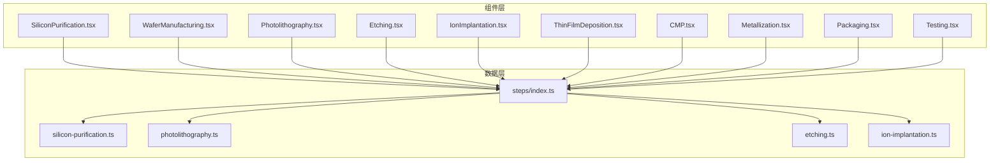
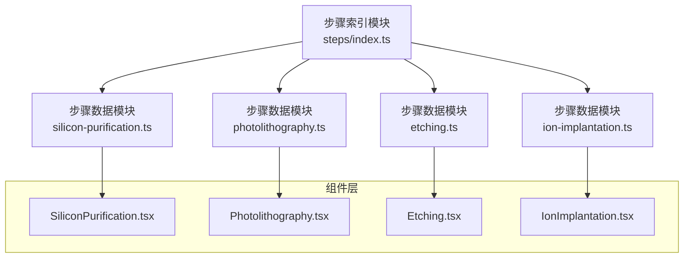
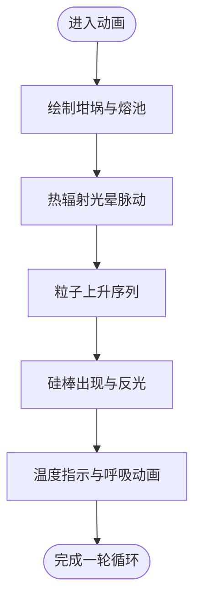
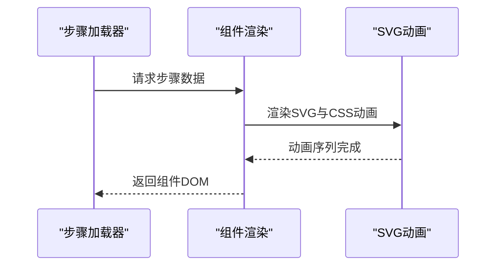
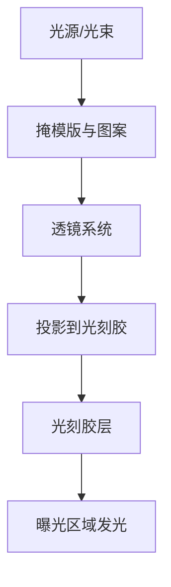
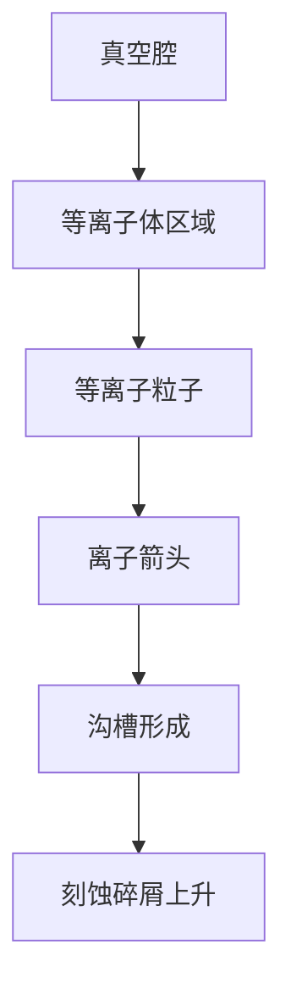
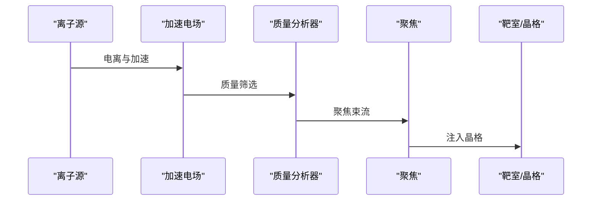
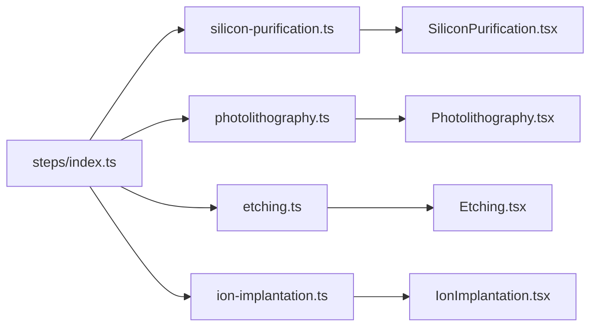

# 工艺组件

<cite>
**本文引用的文件**
- [SiliconPurification.tsx](file://src/components/process/SiliconPurification.tsx)
- [WaferManufacturing.tsx](file://src/components/process/WaferManufacturing.tsx)
- [Photolithography.tsx](file://src/components/process/Photolithography.tsx)
- [Etching.tsx](file://src/components/process/Etching.tsx)
- [IonImplantation.tsx](file://src/components/process/IonImplantation.tsx)
- [ThinFilmDeposition.tsx](file://src/components/process/ThinFilmDeposition.tsx)
- [CMP.tsx](file://src/components/process/CMP.tsx)
- [Metallization.tsx](file://src/components/process/Metallization.tsx)
- [Packaging.tsx](file://src/components/process/Packaging.tsx)
- [Testing.tsx](file://src/components/process/Testing.tsx)
- [index.ts](file://src/data/steps/index.ts)
- [silicon-purification.ts](file://src/data/steps/silicon-purification.ts)
- [photolithography.ts](file://src/data/steps/photolithography.ts)
- [etching.ts](file://src/data/steps/etching.ts)
- [ion-implantation.ts](file://src/data/steps/ion-implantation.ts)
</cite>

## 目录
1. [简介](#简介)
2. [项目结构](#项目结构)
3. [核心组件](#核心组件)
4. [架构总览](#架构总览)
5. [详细组件分析](#详细组件分析)
6. [依赖分析](#依赖分析)
7. [性能考虑](#性能考虑)
8. [故障排查指南](#故障排查指南)
9. [结论](#结论)
10. [附录](#附录)

## 简介
本技术文档围绕芯片制造10个核心工艺组件，系统梳理其SVG动画实现、数据驱动设计（步骤配置、动画集成、企业信息展示）、复用策略与扩展机制，并给出可视化与交互设计原则、关键参数与质量控制标准，以及新工艺组件开发的指导框架。目标是帮助开发者快速理解并高效扩展该演示系统。

## 项目结构
- 组件层：每个工艺以独立React函数组件形式提供SVG动画，便于按需加载与复用。
- 数据层：每个工艺对应一个步骤数据模块，包含步骤、叙述、关键指标与企业清单。
- 动画层：统一使用SVG + CSS动画，通过类名与CSS变量驱动逐帧细节，保证性能与一致性。
- 路由与导航：通过步骤索引模块动态加载步骤详情，支持全量与单个加载。

**图表来源**
- [index.ts:1-34](file://src/data/steps/index.ts#L1-L34)
- [silicon-purification.ts:1-121](file://src/data/steps/silicon-purification.ts#L1-L121)
- [photolithography.ts:1-152](file://src/data/steps/photolithography.ts#L1-L152)
- [etching.ts:1-142](file://src/data/steps/etching.ts#L1-L142)
- [ion-implantation.ts:1-132](file://src/data/steps/ion-implantation.ts#L1-L132)

**章节来源**
- [index.ts:1-34](file://src/data/steps/index.ts#L1-L34)

## 核心组件
- 硅提纯：展示石英砂→冶金级硅→多晶硅棒的全流程，强调温度、粒子上升与熔融状态的视觉表达。
- 晶圆制造：体现CZ法拉晶与金刚石线锯切片的动态过程，突出旋转指示与火花粒子效果。
- 光刻：呈现EUV/DUV光束、掩模版、投影与光刻胶曝光的全过程，强调UV光脉冲与发光效果。
- 刻蚀：表现RIE等离子体刻蚀的粒子、离子箭头与沟槽形成，突出等向异性与深宽比控制。
- 离子注入：模拟离子源、加速电场、聚焦与穿透晶格，强调束流脉动与注入粒子的下沉动画。
- 薄膜沉积：CVD反应腔中气体流动与分子下落、层状沉积的渐进构建。
- CMP：抛光垫旋转、抛光液滴与压力头作用，前后表面对比与光泽扫过效果。
- 金属化：大马士革工艺截面图，层层介电与铜填充、通孔连接与光泽扫过。
- 封装：划片→贴装→键合→塑封的流水线动画，强调网格、针脚与标识。
- 测试：ATE测试场景，扫描线、探针、结果矩阵与良率进度条。

**章节来源**
- [SiliconPurification.tsx:1-114](file://src/components/process/SiliconPurification.tsx#L1-L114)
- [WaferManufacturing.tsx:1-122](file://src/components/process/WaferManufacturing.tsx#L1-L122)
- [Photolithography.tsx:1-136](file://src/components/process/Photolithography.tsx#L1-L136)
- [Etching.tsx:1-139](file://src/components/process/Etching.tsx#L1-L139)
- [IonImplantation.tsx:1-116](file://src/components/process/IonImplantation.tsx#L1-L116)
- [ThinFilmDeposition.tsx:1-124](file://src/components/process/ThinFilmDeposition.tsx#L1-L124)
- [CMP.tsx:1-125](file://src/components/process/CMP.tsx#L1-L125)
- [Metallization.tsx:1-120](file://src/components/process/Metallization.tsx#L1-L120)
- [Packaging.tsx:1-128](file://src/components/process/Packaging.tsx#L1-L128)
- [Testing.tsx:1-167](file://src/components/process/Testing.tsx#L1-L167)

## 架构总览
系统采用“组件 + 数据 + 动画”的三层架构：
- 组件层：每个工艺组件导出一个SVG动画函数，内部使用CSS动画与滤镜，通过类名与CSS变量实现细节控制。
- 数据层：每个工艺对应一个步骤数据模块，包含步骤列表、叙述、关键指标与企业清单，统一对外暴露。
- 加载层：步骤索引模块以懒加载方式按ID加载具体步骤数据，支持全量加载与单个加载。

**图表来源**
- [index.ts:1-34](file://src/data/steps/index.ts#L1-L34)
- [silicon-purification.ts:1-121](file://src/data/steps/silicon-purification.ts#L1-L121)
- [photolithography.ts:1-152](file://src/data/steps/photolithography.ts#L1-L152)
- [etching.ts:1-142](file://src/data/steps/etching.ts#L1-L142)
- [ion-implantation.ts:1-132](file://src/data/steps/ion-implantation.ts#L1-L132)

## 详细组件分析

### 硅提纯（Silicon Purification）
- 动画要点：熔炼坩埚、熔融硅、热辐射光晕、粒子上升、硅棒出现与温度指示。
- 数据驱动：步骤描述、子步骤、关键指标、企业清单。
- 复用策略：动画类名统一命名空间（如“si-*”），便于样式隔离与扩展。
- 性能优化：使用CSS动画与滤镜，避免JS逐帧计算；粒子与温度条使用CSS变量控制时序。

**图表来源**
- [SiliconPurification.tsx:1-114](file://src/components/process/SiliconPurification.tsx#L1-L114)

**章节来源**
- [SiliconPurification.tsx:1-114](file://src/components/process/SiliconPurification.tsx#L1-L114)
- [silicon-purification.ts:1-121](file://src/data/steps/silicon-purification.ts#L1-L121)

### 晶圆制造（Wafer Manufacturing）
- 动画要点：单晶硅锭、种子晶体、旋转指示、金刚石线锯、切片堆叠与火花粒子。
- 数据驱动：步骤描述、子步骤、关键指标（如CZ法标签）。
- 复用策略：统一的“wf-*”类名前缀，便于新增动画元素时保持一致性。

**图表来源**
- [index.ts:16-21](file://src/data/steps/index.ts#L16-L21)
- [WaferManufacturing.tsx:1-122](file://src/components/process/WaferManufacturing.tsx#L1-L122)

**章节来源**
- [WaferManufacturing.tsx:1-122](file://src/components/process/WaferManufacturing.tsx#L1-L122)

### 光刻（Photolithography）
- 动画要点：EUV/DUV光源、光束锥、掩模版图案、透镜系统、投影图案、光刻胶层与曝光区域发光。
- 数据驱动：步骤描述、子步骤、关键指标（如套刻精度、分辨率）。
- 复用策略：统一的“ph-*”类名前缀，多处使用脉动与闪烁动画，便于统一风格。

**图表来源**
- [Photolithography.tsx:1-136](file://src/components/process/Photolithography.tsx#L1-L136)

**章节来源**
- [Photolithography.tsx:1-136](file://src/components/process/Photolithography.tsx#L1-L136)
- [photolithography.ts:1-152](file://src/data/steps/photolithography.ts#L1-L152)

### 刻蚀（Etching）
- 动画要点：真空腔、等离子体、粒子与离子箭头、沟槽形成、刻蚀碎屑。
- 数据驱动：步骤描述、子步骤、关键指标（如侧壁垂直度、深宽比）。
- 复用策略：统一的“et-*”类名前缀，多处使用脉动与上升动画。

**图表来源**
- [Etching.tsx:1-139](file://src/components/process/Etching.tsx#L1-L139)

**章节来源**
- [Etching.tsx:1-139](file://src/components/process/Etching.tsx#L1-L139)
- [etching.ts:1-142](file://src/data/steps/etching.ts#L1-L142)

### 离子注入（Ion Implantation）
- 动画要点：离子源、加速电场、聚焦环、束流粒子、质量分析器、靶室与晶格、注入粒子下沉。
- 数据驱动：步骤描述、子步骤、关键指标（如注入能量、剂量、退火条件）。
- 复用策略：统一的“ii-*”类名前缀，强调脉动与下沉动画。

**图表来源**
- [IonImplantation.tsx:1-116](file://src/components/process/IonImplantation.tsx#L1-L116)

**章节来源**
- [IonImplantation.tsx:1-116](file://src/components/process/IonImplantation.tsx#L1-L116)
- [ion-implantation.ts:1-132](file://src/data/steps/ion-implantation.ts#L1-L132)

### 薄膜沉积（Thin Film Deposition）
- 动画要点：CVD反应腔、气体管线、分子下落、层状沉积渐进。
- 数据驱动：步骤描述、子步骤、关键指标（如层厚增长）。
- 复用策略：统一的“tfd-*”类名前缀，强调渐进与透明度变化。

**章节来源**
- [ThinFilmDeposition.tsx:1-124](file://src/components/process/ThinFilmDeposition.tsx#L1-L124)

### CMP（化学机械抛光）
- 动画要点：旋转抛光垫、抛光液滴、压力头、前后表面对比与光泽扫过。
- 数据驱动：步骤描述、子步骤、关键指标（如平坦化效果）。
- 复用策略：统一的“cmp-*”类名前缀，强调旋转与波动动画。

**章节来源**
- [CMP.tsx:1-125](file://src/components/process/CMP.tsx#L1-L125)

### 金属化（Metallization）
- 动画要点：介电层与沟槽、铜填充、通孔连接、光泽扫过。
- 数据驱动：步骤描述、子步骤、关键指标（如互连层级）。
- 复用策略：统一的“met-*”类名前缀，强调渐进与扫光动画。

**章节来源**
- [Metallization.tsx:1-120](file://src/components/process/Metallization.tsx#L1-L120)

### 封装（Packaging）
- 动画要点：划片、贴装、键合、塑封、引脚阵列与标识。
- 数据驱动：步骤描述、子步骤、关键指标（如封装流程）。
- 复用策略：统一的“pkg-*”类名前缀，强调顺序与渐现动画。

**章节来源**
- [Packaging.tsx:1-128](file://src/components/process/Packaging.tsx#L1-L128)

### 测试（Testing）
- 动画要点：ATE屏幕、扫描线、探针、结果矩阵、状态指示与良率进度。
- 数据驱动：步骤描述、子步骤、关键指标（如良率、测试阶段）。
- 复用策略：统一的“tst-*”类名前缀，强调渐现与脉动动画。

**章节来源**
- [Testing.tsx:1-167](file://src/components/process/Testing.tsx#L1-L167)

## 依赖分析
- 步骤索引模块负责按ID懒加载步骤数据，避免一次性加载全部数据，提高首屏性能。
- 组件与数据解耦：组件仅依赖数据接口，不直接依赖具体数据内容，便于替换与扩展。
- 动画依赖：所有组件共享同一套SVG + CSS动画模式，类名前缀统一，便于维护与复用。

**图表来源**
- [index.ts:1-34](file://src/data/steps/index.ts#L1-L34)
- [silicon-purification.ts:1-121](file://src/data/steps/silicon-purification.ts#L1-L121)
- [photolithography.ts:1-152](file://src/data/steps/photolithography.ts#L1-L152)
- [etching.ts:1-142](file://src/data/steps/etching.ts#L1-L142)
- [ion-implantation.ts:1-132](file://src/data/steps/ion-implantation.ts#L1-L132)

**章节来源**
- [index.ts:1-34](file://src/data/steps/index.ts#L1-L34)

## 性能考虑
- 使用CSS动画而非JS逐帧更新，减少主线程压力。
- 合理使用滤镜（如模糊）与透明度，避免过度重绘。
- 通过CSS变量控制动画时序与延迟，便于批量调整而不改动结构。
- 懒加载步骤数据，按需渲染组件，降低初始内存占用。
- SVG原生缩放与响应式视口，适配不同屏幕尺寸，减少额外布局抖动。

## 故障排查指南
- 动画不生效：检查类名前缀是否正确，确认CSS动画规则是否存在；核对滤镜与透明度设置。
- 性能卡顿：减少同时动画元素数量，合并同类动画，避免频繁重排；使用will-change或GPU加速属性（谨慎使用）。
- 数据未显示：确认步骤ID与索引模块映射一致；检查懒加载返回值是否为空。
- 视口与缩放异常：核对SVG viewBox与容器尺寸，确保响应式适配。

## 结论
该系统以“组件 + 数据 + 动画”三层架构实现了芯片制造10个核心工艺的可视化演示。通过统一的SVG + CSS动画模式与数据驱动设计，既保证了良好的用户体验，又具备良好的可维护性与扩展性。建议后续在保持现有架构的前提下，逐步引入更丰富的交互（如点击查看详情、进度联动）与性能监控，进一步提升演示效果与教学价值。

## 附录
- 新工艺组件开发指导框架
  - 组件命名：采用“工艺英文名首字母缩写 + 动画”命名，如“CMP.tsx”，确保与数据模块ID一致。
  - 动画规范：统一使用SVG + CSS动画，类名前缀以“工艺缩写 + 动画类别”命名，避免冲突。
  - 数据模块：在步骤目录新增对应ID的数据模块，包含步骤、叙述、关键指标与企业清单。
  - 懒加载：在步骤索引模块中注册新ID与加载器，确保按需加载。
  - 可视化原则：遵循清晰、简洁、一致的视觉语言，突出关键流程与参数，避免信息过载。
  - 交互设计：在保证性能的前提下，增加必要的交互反馈（如悬停提示、进度联动），提升学习体验。