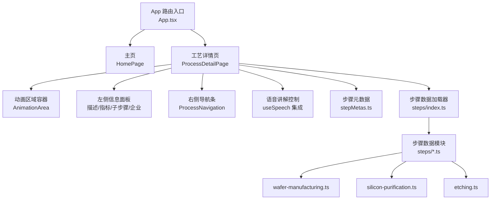
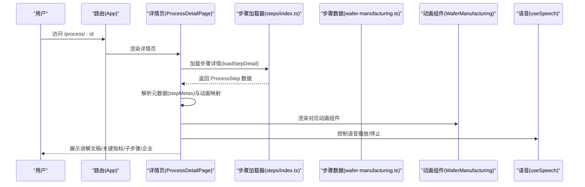
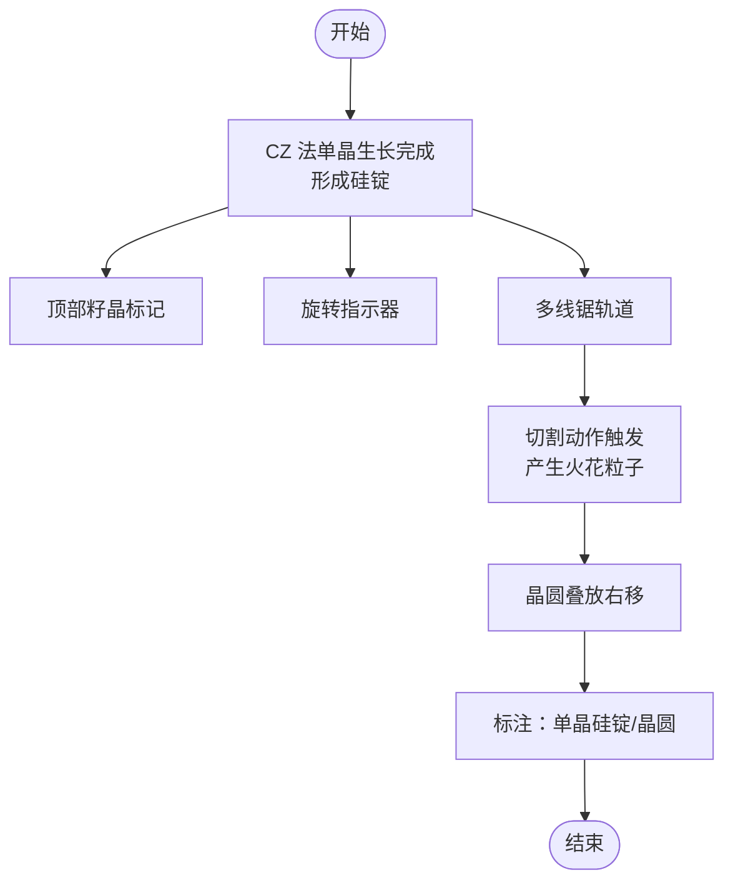
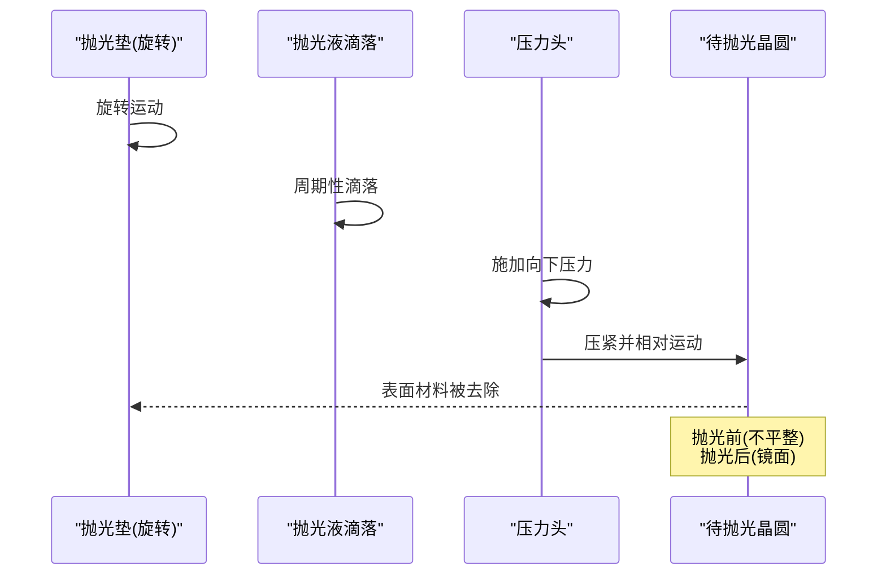
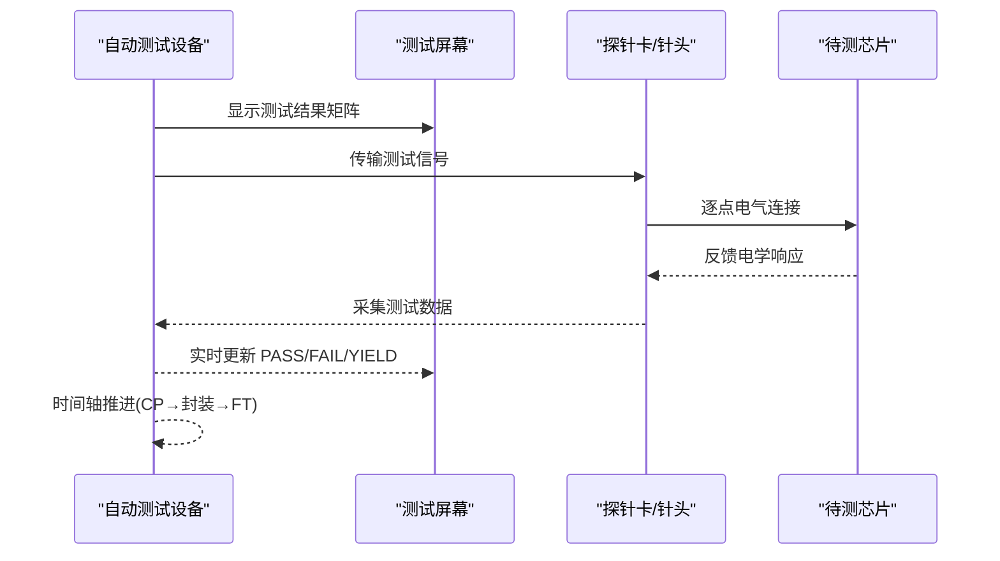
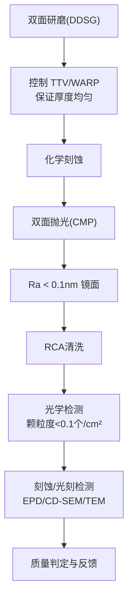
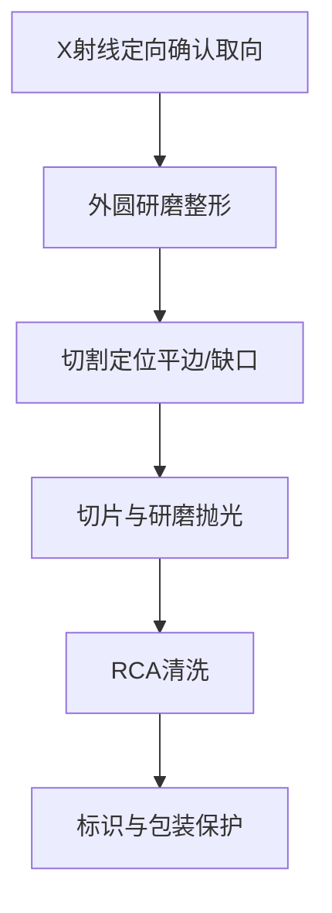
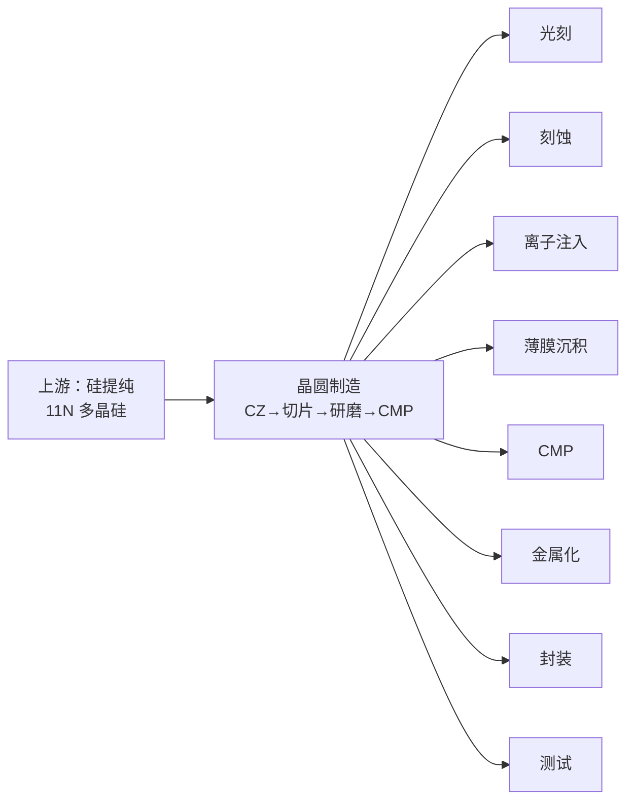
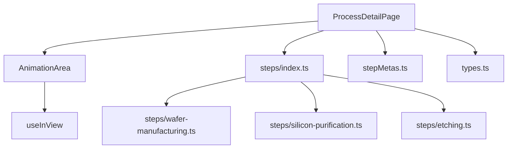

# 晶圆制造工艺

<cite>
**本文引用的文件**
- [src/components/process/WaferManufacturing.tsx](file://src/components/process/WaferManufacturing.tsx)
- [src/components/process/SiliconPurification.tsx](file://src/components/process/SiliconPurification.tsx)
- [src/components/process/CMP.tsx](file://src/components/process/CMP.tsx)
- [src/components/process/Testing.tsx](file://src/components/process/Testing.tsx)
- [src/components/layout/ProcessDetailPage.tsx](file://src/components/layout/ProcessDetailPage.tsx)
- [src/components/ui/AnimationArea.tsx](file://src/components/ui/AnimationArea.tsx)
- [src/data/steps/wafer-manufacturing.ts](file://src/data/steps/wafer-manufacturing.ts)
- [src/data/steps/silicon-purification.ts](file://src/data/steps/silicon-purification.ts)
- [src/data/steps/etching.ts](file://src/data/steps/etching.ts)
- [src/data/stepMetas.ts](file://src/data/stepMetas.ts)
- [src/data/types.ts](file://src/data/types.ts)
- [src/data/steps/index.ts](file://src/data/steps/index.ts)
- [src/App.tsx](file://src/App.tsx)
- [package.json](file://package.json)
</cite>

## 目录
1. [简介](#简介)
2. [项目结构](#项目结构)
3. [核心组件](#核心组件)
4. [架构总览](#架构总览)
5. [详细组件分析](#详细组件分析)
6. [依赖关系分析](#依赖关系分析)
7. [性能考量](#性能考量)
8. [故障排查指南](#故障排查指南)
9. [结论](#结论)
10. [附录](#附录)

## 简介
本技术文档围绕“晶圆制造”主题，系统梳理从上游硅提纯到下游测试的完整工艺链路，聚焦单晶硅锭切割、表面抛光与晶圆质量检测三大核心环节，结合仓库中的动画演示与数据模型，给出流程说明、参数指标、质量控制标准以及与上下游的衔接机制。文档同时提供可视化图表帮助读者建立直观认知。

## 项目结构
该项目采用前端单页应用架构，使用 React + TypeScript + Vite 构建，路由基于 react-router-dom。页面由“主页”“工艺详情页”构成，详情页通过动态模块加载与动画组件展示各工艺步骤。

**图表来源**
- [src/App.tsx:1-23](file://src/App.tsx#L1-L23)
- [src/components/layout/ProcessDetailPage.tsx:1-397](file://src/components/layout/ProcessDetailPage.tsx#L1-L397)
- [src/data/stepMetas.ts:1-103](file://src/data/stepMetas.ts#L1-L103)
- [src/data/steps/index.ts:1-34](file://src/data/steps/index.ts#L1-L34)
- [src/data/steps/wafer-manufacturing.ts:1-153](file://src/data/steps/wafer-manufacturing.ts#L1-L153)
- [src/data/steps/silicon-purification.ts:1-121](file://src/data/steps/silicon-purification.ts#L1-L121)
- [src/data/steps/etching.ts:1-142](file://src/data/steps/etching.ts#L1-L142)

**章节来源**
- [src/App.tsx:1-23](file://src/App.tsx#L1-L23)
- [src/components/layout/ProcessDetailPage.tsx:1-397](file://src/components/layout/ProcessDetailPage.tsx#L1-L397)
- [src/data/stepMetas.ts:1-103](file://src/data/stepMetas.ts#L1-L103)
- [src/data/steps/index.ts:1-34](file://src/data/steps/index.ts#L1-L34)

## 核心组件
- 动画区域容器 AnimationArea：负责根据视口可见性渲染动画组件，并叠加“语音讲解指示器”，统一动画重播与高亮效果。
- 工艺详情页 ProcessDetailPage：负责加载步骤详情、进度条、导航、语音讲解、动画重播、企业信息统计等。
- 步骤数据模块：以模块化方式提供每个工艺步骤的名称、描述、子步骤、关键指标、企业清单与讲解文案。
- 步骤元数据：定义所有工艺步骤的图标、颜色、高亮色等元信息，供页面样式与导航使用。

**章节来源**
- [src/components/ui/AnimationArea.tsx:1-29](file://src/components/ui/AnimationArea.tsx#L1-L29)
- [src/components/layout/ProcessDetailPage.tsx:1-397](file://src/components/layout/ProcessDetailPage.tsx#L1-L397)
- [src/data/steps/index.ts:1-34](file://src/data/steps/index.ts#L1-L34)
- [src/data/types.ts:1-33](file://src/data/types.ts#L1-L33)
- [src/data/stepMetas.ts:1-103](file://src/data/stepMetas.ts#L1-L103)

## 架构总览
本项目采用“数据驱动 + 动画演示”的教学型架构：页面通过路由进入详情页，按需异步加载步骤数据与动画组件，渲染出完整的讲解内容与可视化流程。

**图表来源**
- [src/App.tsx:1-23](file://src/App.tsx#L1-L23)
- [src/components/layout/ProcessDetailPage.tsx:1-397](file://src/components/layout/ProcessDetailPage.tsx#L1-L397)
- [src/data/steps/index.ts:1-34](file://src/data/steps/index.ts#L1-L34)
- [src/data/steps/wafer-manufacturing.ts:1-153](file://src/data/steps/wafer-manufacturing.ts#L1-L153)

## 详细组件分析

### 单晶硅锭切割动画与流程
该动画以 SVG 形象展示了 CZ 法拉制单晶硅锭、顶部籽晶标记、旋转指示、多线锯切割轨迹与火花粒子效果，以及“单晶硅锭”“晶圆”标签。动画通过关键帧实现“锭体收缩”“锯线移动与震动”“晶圆叠放出现”“火花闪烁”等效果，直观呈现从硅锭到晶圆的切割过程。

**图表来源**
- [src/components/process/WaferManufacturing.tsx:1-122](file://src/components/process/WaferManufacturing.tsx#L1-L122)

**章节来源**
- [src/components/process/WaferManufacturing.tsx:1-122](file://src/components/process/WaferManufacturing.tsx#L1-L122)
- [src/data/steps/wafer-manufacturing.ts:1-153](file://src/data/steps/wafer-manufacturing.ts#L1-L153)

### 表面抛光（CMP）动画与流程
CMP 动画展示了抛光垫旋转、抛光液滴落、压力头施压、前后表面对比等关键要素，强调“化学腐蚀 + 机械研磨”的协同作用，实现全局平坦化。动画通过旋转、摆动、渐显等关键帧，直观表达抛光前后的表面状态变化。

**图表来源**
- [src/components/process/CMP.tsx:1-125](file://src/components/process/CMP.tsx#L1-L125)

**章节来源**
- [src/components/process/CMP.tsx:1-125](file://src/components/process/CMP.tsx#L1-L125)
- [src/data/steps/wafer-manufacturing.ts:1-153](file://src/data/steps/wafer-manufacturing.ts#L1-L153)

### 晶圆质量检测动画与流程
测试动画以 ATE（自动测试设备）为核心，展示扫描线、测试结果矩阵、探针卡连接、信号波形与 LED 状态灯，以及 CP（晶圆测试）与 FT（成品测试）的时间轴。动画强调测试流程的自动化与可视化反馈。

**图表来源**
- [src/components/process/Testing.tsx:1-167](file://src/components/process/Testing.tsx#L1-L167)

**章节来源**
- [src/components/process/Testing.tsx:1-167](file://src/components/process/Testing.tsx#L1-L167)
- [src/data/steps/etching.ts:1-142](file://src/data/steps/etching.ts#L1-L142)

### 晶圆厚度控制、表面粗糙度测量与缺陷检测的动画模拟
- 厚度控制：在“双面研磨(DDSG)”阶段，通过控制 TTV（Total Thickness Variation）< 2μm、WARP（弯曲度）< 10μm，确保切片后厚度均匀性达标。
- 表面粗糙度：在“双面抛光(DSP/CMP)”阶段，采用胶体SiO₂碱性抛光液，实现 Ra < 0.1nm 的镜面粗糙度。
- 缺陷检测：在“清洗·检测·外延”阶段，通过光学检测控制颗粒度< 0.1个/cm²；在后续刻蚀、光刻等步骤中，结合终点检测（EPD）与形貌检测（CD-SEM/TEM）实现缺陷闭环控制。

**图表来源**
- [src/data/steps/wafer-manufacturing.ts:1-153](file://src/data/steps/wafer-manufacturing.ts#L1-L153)
- [src/data/steps/etching.ts:1-142](file://src/data/steps/etching.ts#L1-L142)

**章节来源**
- [src/data/steps/wafer-manufacturing.ts:1-153](file://src/data/steps/wafer-manufacturing.ts#L1-L153)
- [src/data/steps/etching.ts:1-142](file://src/data/steps/etching.ts#L1-L142)

### 晶体取向标记、晶圆标识与包装保护
- 晶体取向标记：通过 X 射线衍射确认晶体取向（<100>或<111>），并在硅锭上做定向与整形，确保后续切割定位平边/缺口的准确性。
- 晶圆标识：在切片后进行定位平边/缺口标记，便于后续工艺对准与识别。
- 包装保护：在清洗与检测后，采用无尘环境下的封装与运输，避免金属离子与有机物污染，保障晶圆在后续工艺中的洁净度。

**图表来源**
- [src/data/steps/wafer-manufacturing.ts:1-153](file://src/data/steps/wafer-manufacturing.ts#L1-L153)

**章节来源**
- [src/data/steps/wafer-manufacturing.ts:1-153](file://src/data/steps/wafer-manufacturing.ts#L1-L153)

### 关键参数、精度要求与质量控制标准
- 规格与精度
  - 主流规格：300mm（12英寸）
  - 表面粗糙度：Ra < 0.1nm
  - 厚度均匀性：TTV < 1μm
  - 生长速率：0.5~2mm/min
- 质量控制
  - 切割后 TTV/WARP 控制
  - 表面颗粒度< 0.1个/cm²
  - EPD 终点检测与 CD-SEM/TEM 形貌检测
  - RCA 清洗去除金属离子与有机物

**章节来源**
- [src/data/steps/wafer-manufacturing.ts:22-27](file://src/data/steps/wafer-manufacturing.ts#L22-L27)
- [src/data/steps/wafer-manufacturing.ts:18-18](file://src/data/steps/wafer-manufacturing.ts#L18-L18)
- [src/data/steps/etching.ts:21-26](file://src/data/steps/etching.ts#L21-L26)

### 与上游硅提纯和下游工艺的衔接机制
- 上游衔接：硅提纯提供 11N 纯度的电子级多晶硅，作为 CZ 单晶生长的原料，决定后续晶圆的电学性能与缺陷水平。
- 下游衔接：晶圆制造完成后进入光刻、刻蚀、离子注入、薄膜沉积、CMP、金属化、封装与测试等后续步骤，形成完整的集成电路制造流程。

**图表来源**
- [src/data/steps/silicon-purification.ts:1-121](file://src/data/steps/silicon-purification.ts#L1-L121)
- [src/data/steps/wafer-manufacturing.ts:1-153](file://src/data/steps/wafer-manufacturing.ts#L1-L153)
- [src/data/stepMetas.ts:1-103](file://src/data/stepMetas.ts#L1-L103)

**章节来源**
- [src/data/steps/silicon-purification.ts:1-121](file://src/data/steps/silicon-purification.ts#L1-L121)
- [src/data/steps/wafer-manufacturing.ts:1-153](file://src/data/steps/wafer-manufacturing.ts#L1-L153)
- [src/data/stepMetas.ts:1-103](file://src/data/stepMetas.ts#L1-L103)

## 依赖关系分析
- 组件依赖
  - ProcessDetailPage 依赖 AnimationArea、useSpeech、步骤元数据与步骤数据加载器。
  - AnimationArea 依赖 useInView 与 SpeakingIndicator，实现动画按需渲染与语音指示。
  - 步骤数据加载器通过动态 import 按需加载各步骤数据模块。
- 数据模型
  - types.ts 定义了 ProcessStep/ProcessSubStep/Company 的接口，支撑页面渲染与企业信息展示。
- 运行时依赖
  - package.json 指定 React、react-router-dom、lucide-react、tailwind 等依赖，保证界面与交互功能。

**图表来源**
- [src/components/layout/ProcessDetailPage.tsx:1-397](file://src/components/layout/ProcessDetailPage.tsx#L1-L397)
- [src/components/ui/AnimationArea.tsx:1-29](file://src/components/ui/AnimationArea.tsx#L1-L29)
- [src/data/steps/index.ts:1-34](file://src/data/steps/index.ts#L1-L34)
- [src/data/stepMetas.ts:1-103](file://src/data/stepMetas.ts#L1-L103)
- [src/data/types.ts:1-33](file://src/data/types.ts#L1-L33)
- [src/data/steps/wafer-manufacturing.ts:1-153](file://src/data/steps/wafer-manufacturing.ts#L1-L153)
- [src/data/steps/silicon-purification.ts:1-121](file://src/data/steps/silicon-purification.ts#L1-L121)
- [src/data/steps/etching.ts:1-142](file://src/data/steps/etching.ts#L1-L142)

**章节来源**
- [src/components/layout/ProcessDetailPage.tsx:1-397](file://src/components/layout/ProcessDetailPage.tsx#L1-L397)
- [src/components/ui/AnimationArea.tsx:1-29](file://src/components/ui/AnimationArea.tsx#L1-L29)
- [src/data/steps/index.ts:1-34](file://src/data/steps/index.ts#L1-L34)
- [src/data/types.ts:1-33](file://src/data/types.ts#L1-L33)

## 性能考量
- 动画性能
  - 使用 CSS 关键帧与 transform/opacity 动画，避免频繁重排；通过延迟与交错动画减少同时渲染压力。
  - 动画区域按视口可见性渲染，减少不必要的计算与绘制。
- 数据加载
  - 步骤数据按需异步加载，避免首屏阻塞；预取全部步骤数据以统计企业出现频次。
- 交互体验
  - 语音讲解与动画重播按键联动，避免重复渲染；使用状态切换控制动画生命周期。

[本节为通用指导，无需特定文件引用]

## 故障排查指南
- 动画不显示
  - 检查 AnimationArea 的 isInView 状态与动画组件是否正确传入。
  - 确认路由与步骤 ID 是否匹配，步骤数据是否成功加载。
- 语音讲解异常
  - 检查浏览器语音合成权限与事件监听是否正确注册/清理。
  - 确认 narration 文案是否存在，isSpeaking 状态是否与 UI 同步。
- 步骤数据缺失
  - 检查 steps/index.ts 的模块映射与动态 import 是否正确。
  - 确认步骤数据模块导出的默认对象结构与 types.ts 接口一致。

**章节来源**
- [src/components/ui/AnimationArea.tsx:1-29](file://src/components/ui/AnimationArea.tsx#L1-L29)
- [src/components/layout/ProcessDetailPage.tsx:1-397](file://src/components/layout/ProcessDetailPage.tsx#L1-L397)
- [src/data/steps/index.ts:1-34](file://src/data/steps/index.ts#L1-L34)
- [src/data/types.ts:1-33](file://src/data/types.ts#L1-L33)

## 结论
本项目以动画与数据相结合的方式，系统呈现了从硅提纯到晶圆制造、再到质量检测与后续工艺的完整链路。通过关键参数与质量控制标准的明确，辅以可视化流程与动画模拟，有助于读者快速理解晶圆制造的核心要点与工程实践。

[本节为总结性内容，无需特定文件引用]

## 附录
- 开发与构建
  - 依赖管理与脚本配置位于 package.json，包含开发、构建、预览、格式化与 lint 等命令。
- 数据模型参考
  - ProcessStep/ProcessSubStep/Company 接口定义，支撑页面渲染与企业信息展示。

**章节来源**
- [package.json:1-46](file://package.json#L1-L46)
- [src/data/types.ts:1-33](file://src/data/types.ts#L1-L33)