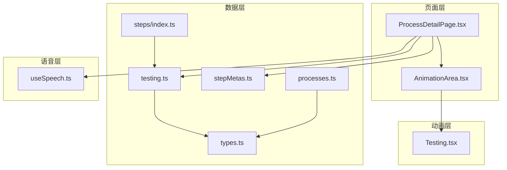
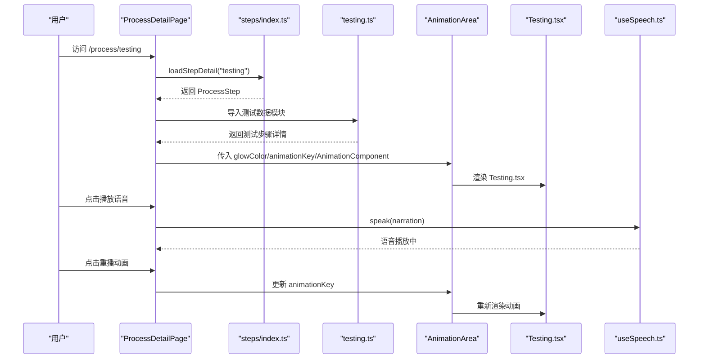
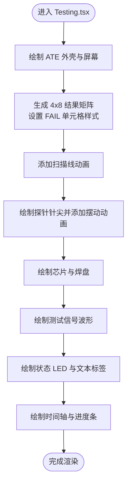
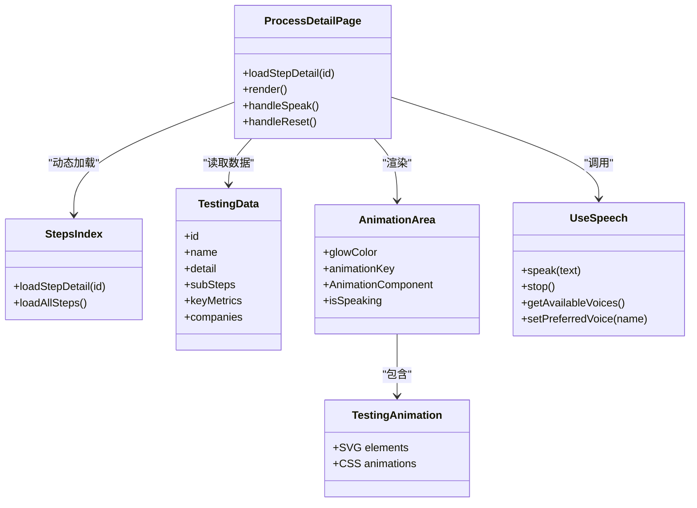

# 测试工艺

<cite>
**本文引用的文件列表**
- [Testing.tsx](file://src/components/process/Testing.tsx)
- [testing.ts](file://src/data/steps/testing.ts)
- [types.ts](file://src/data/types.ts)
- [AnimationArea.tsx](file://src/components/ui/AnimationArea.tsx)
- [ProcessDetailPage.tsx](file://src/components/layout/ProcessDetailPage.tsx)
- [index.ts](file://src/data/steps/index.ts)
- [useSpeech.ts](file://src/hooks/useSpeech.ts)
- [stepMetas.ts](file://src/data/stepMetas.ts)
- [processes.ts](file://src/data/processes.ts)
- [package.json](file://package.json)
</cite>

## 目录
1. [简介](#简介)
2. [项目结构](#项目结构)
3. [核心组件](#核心组件)
4. [架构总览](#架构总览)
5. [详细组件分析](#详细组件分析)
6. [依赖关系分析](#依赖关系分析)
7. [性能考量](#性能考量)
8. [故障排查指南](#故障排查指南)
9. [结论](#结论)
10. [附录](#附录)

## 简介
本文件面向“测试工艺”主题，围绕芯片制造全流程中的测试环节，系统梳理功能测试、参数测试与可靠性试验的动画模拟实现，解释测试程序执行、信号采集与数据分析的技术路径，阐述测试覆盖率、故障诊断与良品率统计方法，并给出标准流程、测试条件与判定准则，以及测试结果分析与质量改进措施。文档以仓库现有代码为基础，结合测试数据模型与页面渲染组件，形成可操作、可扩展的技术说明。

## 项目结构
测试工艺模块由“数据定义 + 页面渲染 + 动画组件 + 语音讲解 + 路由元数据”构成：
- 数据层：测试步骤与企业信息通过类型定义与数据模块提供
- 页面层：工艺详情页负责加载数据、渲染动画与交互
- 动画层：SVG 动画组件承载测试场景的可视化模拟
- 语音层：Web Speech API 提供中文语音讲解
- 元数据层：路由与导航所需的基础信息

图表来源
- [ProcessDetailPage.tsx:36-34](file://src/components/layout/ProcessDetailPage.tsx#L36-L34)
- [AnimationArea.tsx:11-28](file://src/components/ui/AnimationArea.tsx#L11-L28)
- [testing.ts:1-172](file://src/data/steps/testing.ts#L1-L172)
- [types.ts:19-32](file://src/data/types.ts#L19-L32)
- [index.ts:16-33](file://src/data/steps/index.ts#L16-L33)
- [stepMetas.ts:11-102](file://src/data/stepMetas.ts#L11-L102)
- [processes.ts:1-3](file://src/data/processes.ts#L1-L3)
- [Testing.tsx:1-167](file://src/components/process/Testing.tsx#L1-L167)
- [useSpeech.ts:64-134](file://src/hooks/useSpeech.ts#L64-L134)

章节来源
- [ProcessDetailPage.tsx:36-34](file://src/components/layout/ProcessDetailPage.tsx#L36-L34)
- [testing.ts:1-172](file://src/data/steps/testing.ts#L1-L172)
- [types.ts:19-32](file://src/data/types.ts#L19-L32)
- [stepMetas.ts:11-102](file://src/data/stepMetas.ts#L11-L102)
- [index.ts:16-33](file://src/data/steps/index.ts#L16-L33)
- [processes.ts:1-3](file://src/data/processes.ts#L1-L3)
- [Testing.tsx:1-167](file://src/components/process/Testing.tsx#L1-L167)
- [useSpeech.ts:64-134](file://src/hooks/useSpeech.ts#L64-L134)

## 核心组件
- 测试动画组件：基于 SVG 的测试场景模拟，包括 ATE 屏幕、探针卡、芯片、信号波形、状态指示灯与进度条等元素，配合 CSS 动画实现扫描线、探针摆动、信号脉冲、LED 闪烁与进度增长等效果。
- 测试数据模块：定义测试步骤、子步骤、关键指标、企业清单与讲解文案，支撑页面渲染与导航。
- 页面容器组件：负责加载测试数据、选择动画组件、控制语音讲解、管理动画重播与高亮显示。
- 动画区域组件：根据视口可见性动态渲染动画，支持高光背景与语音指示器叠加。
- 语音钩子：封装 Web Speech API，提供中文语音合成、偏好语音选择与停止控制。

章节来源
- [Testing.tsx:1-167](file://src/components/process/Testing.tsx#L1-L167)
- [testing.ts:1-172](file://src/data/steps/testing.ts#L1-L172)
- [ProcessDetailPage.tsx:36-34](file://src/components/layout/ProcessDetailPage.tsx#L36-L34)
- [AnimationArea.tsx:11-28](file://src/components/ui/AnimationArea.tsx#L11-L28)
- [useSpeech.ts:64-134](file://src/hooks/useSpeech.ts#L64-L134)

## 架构总览
测试工艺的前端架构采用“按需加载 + 组件化 + 数据驱动”的模式：
- 路由层：通过元数据定义各工艺步骤的标识、名称、图标与颜色
- 数据层：按步骤 ID 动态导入对应的数据模块，提供步骤详情、子步骤、关键指标与企业清单
- 渲染层：页面容器根据当前步骤选择对应的动画组件并渲染，同时提供语音讲解与重播控制
- 动画层：动画组件使用 SVG 与 CSS 动画实现测试场景的可视化模拟

图表来源
- [ProcessDetailPage.tsx:36-34](file://src/components/layout/ProcessDetailPage.tsx#L36-L34)
- [index.ts:16-33](file://src/data/steps/index.ts#L16-L33)
- [testing.ts:1-172](file://src/data/steps/testing.ts#L1-L172)
- [AnimationArea.tsx:11-28](file://src/components/ui/AnimationArea.tsx#L11-L28)
- [Testing.tsx:1-167](file://src/components/process/Testing.tsx#L1-L167)
- [useSpeech.ts:74-107](file://src/hooks/useSpeech.ts#L74-L107)

## 详细组件分析

### 测试动画组件（Testing.tsx）
- 场景构成
  - ATE 设备与屏幕：展示测试结果矩阵、扫描线与 PASS/FAIL/YIELD 指标
  - 探针卡与芯片：模拟探针针尖、芯片焊盘与内部电路
  - 信号与状态：波形路径、LED 指示灯、进度条与时间轴
- 动画机制
  - 使用 CSS 动画实现扫描线移动、探针摆动、信号脉冲与 LED 闪烁
  - 进度条通过 transform: scaleX 实现线性增长
  - 结果矩阵通过变量延迟实现逐格出现
- 可视化元素
  - 结果矩阵：4×8 的矩形网格，部分单元格用于展示 FAIL 标识
  - PASS/FAIL/YIELD 文本：实时统计值
  - 时间轴：CP/封装/成品测试三个阶段的进度条

图表来源
- [Testing.tsx:76-164](file://src/components/process/Testing.tsx#L76-L164)

章节来源
- [Testing.tsx:1-167](file://src/components/process/Testing.tsx#L1-L167)

### 测试数据模块（testing.ts）
- 数据结构
  - 步骤基本信息：id、名称、英文名、描述、详细说明、图标、颜色、发光色
  - 子步骤：标题、描述与涉及企业的公司引用
  - 关键指标：测试成本占比、老化条件、成品测试参数数量、缺陷检测极限
  - 企业清单：涵盖设备商、代工厂、IDM、EDA/IP、封测等类别
- 内容要点
  - 在线检测：OCD/光学CD量测、Overlay 套刻检测、缺陷扫描
  - WAT/CP：TEG 参数测量、探针卡全接触测试、良率 Map 标记
  - FT：ATE 完整功能验证、速度分档、温度特性测试
  - 老化筛选：125°C/168h 高温高压应力
  - SLT：系统级测试，验证真实工况下的交互缺陷
- 讲解文案：强调测试在全流程中的质量守门作用，以及 KLA 等设备厂商的重要性

章节来源
- [testing.ts:1-172](file://src/data/steps/testing.ts#L1-L172)
- [types.ts:19-32](file://src/data/types.ts#L19-L32)

### 页面容器组件（ProcessDetailPage.tsx）
- 功能职责
  - 动态加载测试步骤详情与所有步骤，计算企业参与步数
  - 选择并渲染对应的动画组件，支持重播与语音讲解
  - 提供面包屑导航、进度条与前后步骤跳转
- 关键交互
  - 语音控制：点击播放/停止，自动监听结束事件
  - 动画重播：更新 animationKey 触发组件重新渲染
  - 企业标签解析：根据 subStep.companyRefs 解析企业信息并展示标签

图表来源
- [ProcessDetailPage.tsx:36-34](file://src/components/layout/ProcessDetailPage.tsx#L36-L34)
- [index.ts:16-33](file://src/data/steps/index.ts#L16-L33)
- [testing.ts:1-172](file://src/data/steps/testing.ts#L1-L172)
- [AnimationArea.tsx:11-28](file://src/components/ui/AnimationArea.tsx#L11-L28)
- [useSpeech.ts:74-107](file://src/hooks/useSpeech.ts#L74-L107)

章节来源
- [ProcessDetailPage.tsx:36-34](file://src/components/layout/ProcessDetailPage.tsx#L36-L34)
- [index.ts:16-33](file://src/data/steps/index.ts#L16-L33)
- [useSpeech.ts:64-134](file://src/hooks/useSpeech.ts#L64-L134)

### 动画区域组件（AnimationArea.tsx）
- 功能职责
  - 基于 IntersectionObserver 判断可视性，仅在进入视口时渲染动画
  - 支持高光背景（radial-gradient）与语音指示器叠加
  - 通过 key 控制组件强制重新挂载，实现动画重播
- 性能考虑
  - 惰性渲染减少不必要的 DOM 更新
  - 使用 CSS 变量与动画属性避免复杂 JS 计算

章节来源
- [AnimationArea.tsx:11-28](file://src/components/ui/AnimationArea.tsx#L11-L28)

### 语音讲解（useSpeech.ts）
- 功能职责
  - 自动选择最佳中文语音（优先神经音质、本地服务、zh-CN）
  - 缓存用户偏好的语音名称，提升体验一致性
  - 提供 speak/stop/getAvailableVoices/setPreferredVoice
- 适配策略
  - 语音加载完成后立即播放，否则等待 onvoiceschanged 事件
  - 语音参数（语速、音高、音量）优化中文清晰度与亲和力

章节来源
- [useSpeech.ts:64-134](file://src/hooks/useSpeech.ts#L64-L134)

## 依赖关系分析
- 组件耦合
  - ProcessDetailPage 依赖 steps/index.ts 的动态加载能力与 testing.ts 的数据结构
  - AnimationArea 依赖 Testing.tsx 的动画组件，且通过 props 传递 glowColor 与 animationKey
  - useSpeech.ts 作为独立模块被 ProcessDetailPage 调用
- 类型与数据契约
  - types.ts 定义了 ProcessStep、ProcessSubStep、Company 的接口，testing.ts 严格遵循该契约
  - stepMetas.ts 提供路由元数据，与 ProcessDetailPage 的导航逻辑耦合

图表来源
- [ProcessDetailPage.tsx:36-34](file://src/components/layout/ProcessDetailPage.tsx#L36-L34)
- [index.ts:16-33](file://src/data/steps/index.ts#L16-L33)
- [testing.ts:1-172](file://src/data/steps/testing.ts#L1-L172)
- [AnimationArea.tsx:11-28](file://src/components/ui/AnimationArea.tsx#L11-L28)
- [Testing.tsx:1-167](file://src/components/process/Testing.tsx#L1-L167)
- [useSpeech.ts:64-134](file://src/hooks/useSpeech.ts#L64-L134)

章节来源
- [ProcessDetailPage.tsx:36-34](file://src/components/layout/ProcessDetailPage.tsx#L36-L34)
- [index.ts:16-33](file://src/data/steps/index.ts#L16-L33)
- [testing.ts:1-172](file://src/data/steps/testing.ts#L1-L172)
- [types.ts:19-32](file://src/data/types.ts#L19-L32)
- [AnimationArea.tsx:11-28](file://src/components/ui/AnimationArea.tsx#L11-L28)
- [Testing.tsx:1-167](file://src/components/process/Testing.tsx#L1-L167)
- [useSpeech.ts:64-134](file://src/hooks/useSpeech.ts#L64-L134)

## 性能考量
- 惰性渲染：AnimationArea 仅在视口可见时渲染动画，降低初始渲染压力
- 动画优化：使用 CSS 动画而非 JS 帧动画，避免主线程阻塞
- 组件重播：通过更新 key 触发完全卸载与重建，确保动画状态重置
- 语音缓存：本地存储首选语音名称，减少重复选择成本
- 并行加载：steps/index.ts 的动态导入与 allSteps 并行加载，提升页面响应速度

章节来源
- [AnimationArea.tsx:11-28](file://src/components/ui/AnimationArea.tsx#L11-L28)
- [ProcessDetailPage.tsx:69-80](file://src/components/layout/ProcessDetailPage.tsx#L69-L80)
- [index.ts:23-33](file://src/data/steps/index.ts#L23-L33)
- [useSpeech.ts:47-62](file://src/hooks/useSpeech.ts#L47-L62)

## 故障排查指南
- 语音无法播放
  - 检查浏览器是否支持 Web Speech API（存在 window.speechSynthesis）
  - 确认 zh-CN 语音可用，必要时手动设置首选语音
  - 若 onvoiceschanged 未触发，检查浏览器权限与网络环境
- 动画不显示或不重播
  - 确认 AnimationArea 的 isInView 条件满足（阈值为 0.1）
  - 检查 animationKey 是否正确更新以触发重渲染
  - 确保 Testing.tsx 的 SVG 元素与 CSS 动画类名未被覆盖
- 数据加载失败
  - 检查 steps/index.ts 中是否存在对应 id 的模块映射
  - 确认 testing.ts 的导出结构与 types.ts 的接口一致
- 企业标签缺失
  - 检查 testing.ts 中 subStep.companyRefs 的企业名称是否存在于 companies 数组中
  - 确认 ProcessDetailPage 的 companyMap 构建逻辑正常

章节来源
- [useSpeech.ts:74-107](file://src/hooks/useSpeech.ts#L74-L107)
- [AnimationArea.tsx:11-28](file://src/components/ui/AnimationArea.tsx#L11-L28)
- [ProcessDetailPage.tsx:93-98](file://src/components/layout/ProcessDetailPage.tsx#L93-L98)
- [index.ts:16-21](file://src/data/steps/index.ts#L16-L21)
- [testing.ts:1-172](file://src/data/steps/testing.ts#L1-L172)
- [ProcessDetailPage.tsx:46-49](file://src/components/layout/ProcessDetailPage.tsx#L46-L49)

## 结论
本项目以“测试工艺”为主题，通过数据驱动与组件化的方式，实现了从数据加载、页面渲染到动画模拟与语音讲解的完整链路。测试动画组件以 SVG 与 CSS 动画为核心，直观呈现 ATE 测试、探针卡、芯片与信号等要素；页面容器组件负责流程编排与交互控制；语音模块提供自然流畅的中文讲解体验。整体架构清晰、扩展性强，便于后续增加更复杂的测试场景与数据分析模块。

## 附录

### 测试覆盖率、故障诊断与良品率统计
- 测试覆盖率
  - 在线检测：通过 OCD/Overlay/缺陷扫描实现工艺稳定性监控
  - WAT/CP：TEG 参数与探针卡全接触测试，覆盖关键电学参数与功能
  - FT：ATE 全功能验证与速度分档，覆盖 >500 项参数
- 故障诊断
  - 良率 Map 标记与坏片喷墨标记，定位异常位置
  - 老化筛选（125°C/168h）与 SLT 系统级测试，暴露早期失效与系统级缺陷
- 良品率统计
  - PASS/FAIL/YIELD 实时统计，作为质量控制与改进依据

章节来源
- [testing.ts:8-17](file://src/data/steps/testing.ts#L8-L17)
- [testing.ts:21-26](file://src/data/steps/testing.ts#L21-L26)
- [Testing.tsx:104-106](file://src/components/process/Testing.tsx#L104-L106)

### 标准流程、测试条件与判定准则
- 在线检测与量测
  - 流程：每道工艺后抽样 → OCD/光学CD量测 → Overlay 套刻检测 → 缺陷扫描
  - 条件：缺陷检测极限 >0.02μm 粒子
  - 判定：建立 SPC 控制图，超出控制限即报警
- WAT 晶圆电学参数测试
  - 流程：TEG 上测量 Vth/Idsat/Ioff/DIBL、金属方块电阻、接触电阻
  - 条件：20+ 参数监控工艺稳定性
  - 判定：参数落在规格范围内
- CP 晶圆探针测试
  - 流程：探针卡全接触 → 功能测试+时序测试+参数测试 → 良率 Map 标记
  - 条件：Inking 标记坏片
  - 判定：功能与参数均合格
- 成品 FT 功能测试
  - 流程：ATE Socket 接触 → 完整功能验证 → 速度分档 → 温度特性测试
  - 条件：-40°C ~ 125°C
  - 判定：功能与性能达标
- 老化筛选（Burn-in）
  - 流程：125°C 高温 + 110% 过电压应力 → 168h
  - 判定：剔除早期失效品
- SLT 系统级测试
  - 流程：真实 PCB 板系统环境 → 实际软件负载运行
  - 判定：发现 FT 遗漏的系统级缺陷

章节来源
- [testing.ts:10-15](file://src/data/steps/testing.ts#L10-L15)
- [testing.ts:21-26](file://src/data/steps/testing.ts#L21-L26)

### 测试结果分析与质量改进措施
- 结果分析
  - PASS/FAIL/YIELD 指标用于评估当前批次质量
  - 子步骤与企业清单帮助识别关键设备与工艺瓶颈
- 质量改进
  - 基于 SPC 控制图与缺陷扫描数据优化工艺窗口
  - 引进先进设备（如 KLA、FormFactor、Advantest 等）提升检测与测试精度
  - 加强 SLT 与老化筛选，提高早期失效剔除率

章节来源
- [testing.ts:17-172](file://src/data/steps/testing.ts#L17-L172)
- [Testing.tsx:104-106](file://src/components/process/Testing.tsx#L104-L106)