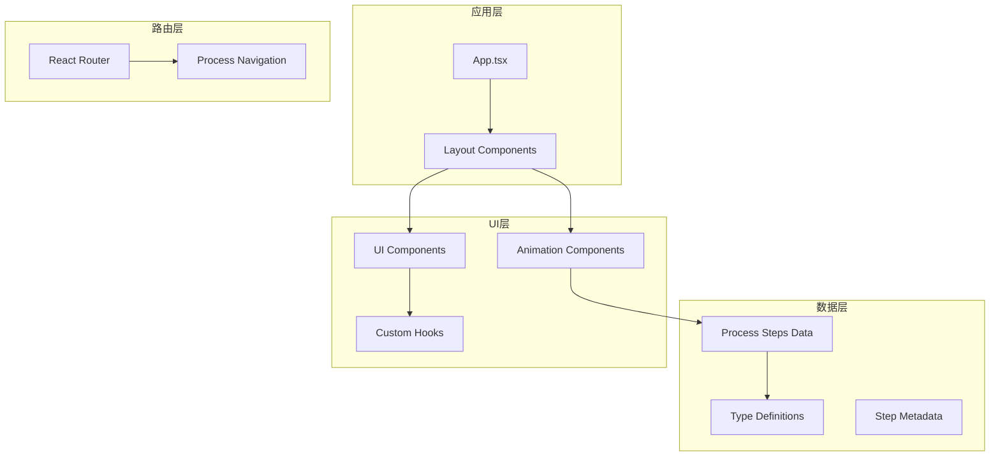
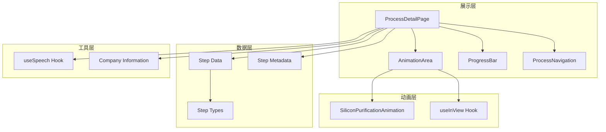
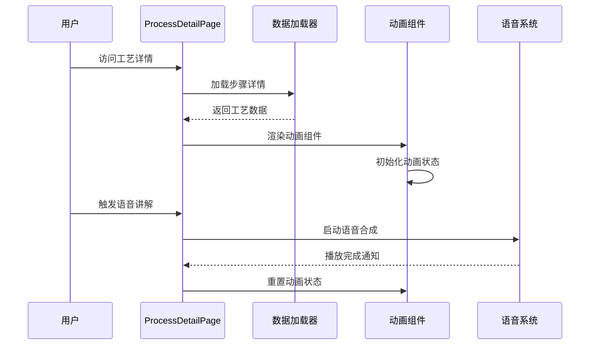
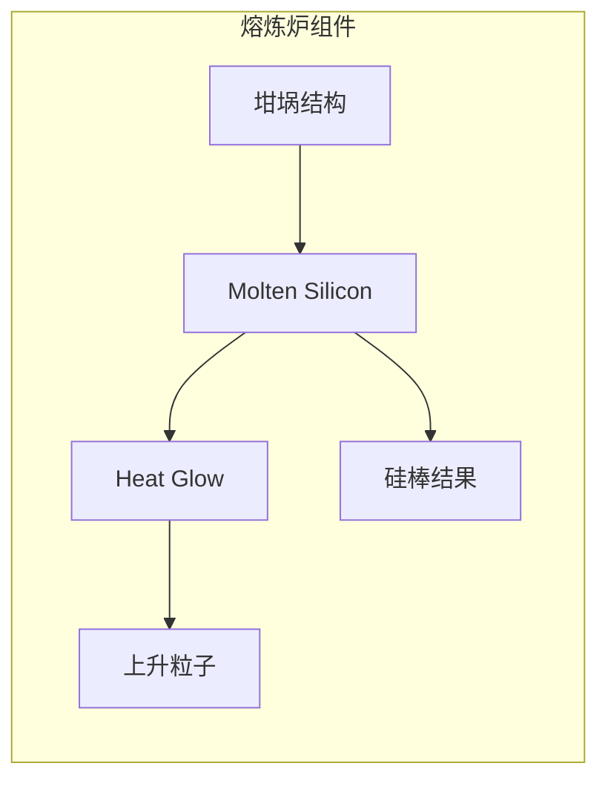
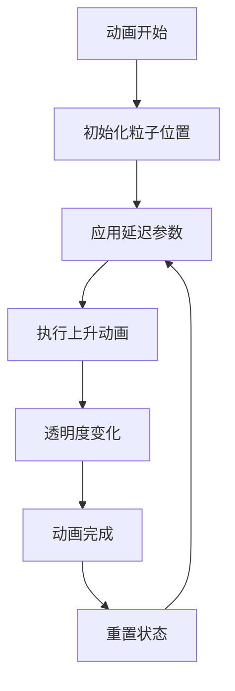
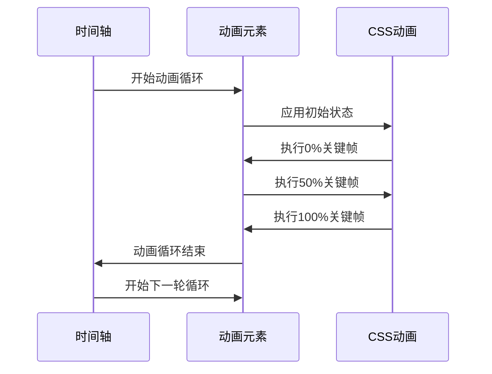
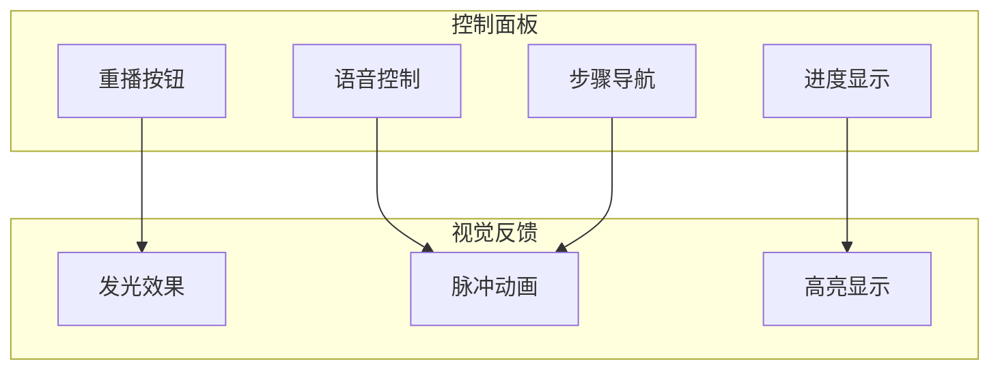
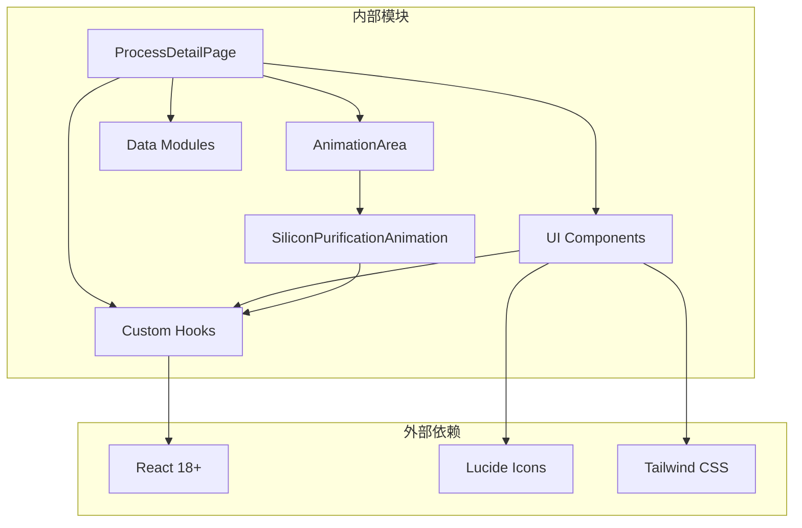

# 硅提纯工艺

<cite>
**本文档引用的文件**
- [SiliconPurification.tsx](file://src/components/process/SiliconPurification.tsx)
- [silicon-purification.ts](file://src/data/steps/silicon-purification.ts)
- [AnimationArea.tsx](file://src/components/ui/AnimationArea.tsx)
- [ProcessDetailPage.tsx](file://src/components/layout/ProcessDetailPage.tsx)
- [useInView.ts](file://src/hooks/useInView.ts)
- [types.ts](file://src/data/types.ts)
- [index.ts](file://src/data/steps/index.ts)
- [stepMetas.ts](file://src/data/stepMetas.ts)
- [ProgressBar.tsx](file://src/components/ui/ProgressBar.tsx)
- [ProcessNavigation.tsx](file://src/components/ui/ProcessNavigation.tsx)
</cite>

## 目录
1. [简介](#简介)
2. [项目结构](#项目结构)
3. [核心组件](#核心组件)
4. [架构概览](#架构概览)
5. [详细组件分析](#详细组件分析)
6. [依赖关系分析](#依赖关系分析)
7. [性能考虑](#性能考虑)
8. [故障排除指南](#故障排除指南)
9. [结论](#结论)

## 简介

硅提纯工艺是半导体产业链的起点，负责将自然界中的石英砂（SiO₂）转化为纯度达11N（99.999999999%）的电子级多晶硅。本项目通过SVG动画技术生动展示了完整的硅提纯过程，包括熔炼炉、温度控制、杂质去除和单晶硅棒形成的四个关键阶段。

该系统采用React + TypeScript构建，结合CSS3动画和SVG矢量图形，实现了高度逼真的工业工艺演示。动画包含了热辐射效果、粒子上升动画、温度指示器等视觉反馈机制，为用户提供了沉浸式的学习体验。

## 项目结构

整个项目采用模块化架构设计，主要分为以下几个层次：

**图表来源**
- [ProcessDetailPage.tsx:36-396](file://src/components/layout/ProcessDetailPage.tsx#L36-L396)
- [AnimationArea.tsx:11-28](file://src/components/ui/AnimationArea.tsx#L11-L28)

**章节来源**
- [ProcessDetailPage.tsx:1-397](file://src/components/layout/ProcessDetailPage.tsx#L1-L397)
- [stepMetas.ts:11-102](file://src/data/stepMetas.ts#L11-L102)

## 核心组件

### 硅提纯动画组件

`SiliconPurificationAnimation` 是整个系统的核心组件，负责渲染完整的硅提纯SVG动画。该组件使用了多种SVG元素和CSS动画技术来模拟真实的工业过程。

#### 主要功能模块

1. **熔炼炉结构**：使用路径元素绘制石英砂坩埚和熔融硅区域
2. **热辐射效果**：通过径向渐变和模糊滤镜创建火焰光晕
3. **粒子上升动画**：多个圆形元素模拟高温下的粒子运动
4. **温度控制系统**：动态温度指示器和脉冲动画
5. **结果展示**：单晶硅棒的形成和光泽效果

#### 动画时序控制

组件内部实现了复杂的动画时序控制机制：

- **呼吸动画**：熔融硅区域的周期性收缩扩张
- **脉冲动画**：热辐射椭圆的强度变化
- **上升动画**：粒子按不同延迟时间上升
- **渐显动画**：最终产物的出现过程

**章节来源**
- [SiliconPurification.tsx:1-114](file://src/components/process/SiliconPurification.tsx#L1-L114)

### 动画区域容器

`AnimationArea` 组件提供了响应式的动画容器，集成了视口检测和语音反馈功能。

#### 关键特性

- **视口检测**：使用IntersectionObserver API确保动画只在可见时播放
- **动态背景**：基于工艺颜色生成发光背景效果
- **语音集成**：与语音合成系统无缝集成
- **状态管理**：处理动画重播和语音状态切换

**章节来源**
- [AnimationArea.tsx:1-29](file://src/components/ui/AnimationArea.tsx#L1-L29)

### 工艺详情页面

`ProcessDetailPage` 是整个工艺展示的主页面，负责协调所有组件的交互。

#### 主要职责

- **数据加载**：异步加载工艺步骤详情
- **动画调度**：管理动画组件的生命周期
- **导航控制**：提供前后工艺步骤的导航
- **语音控制**：集成语音讲解功能
- **进度跟踪**：显示整体学习进度

**章节来源**
- [ProcessDetailPage.tsx:36-396](file://src/components/layout/ProcessDetailPage.tsx#L36-L396)

## 架构概览

系统采用分层架构设计，确保了良好的可维护性和扩展性：

**图表来源**
- [ProcessDetailPage.tsx:36-396](file://src/components/layout/ProcessDetailPage.tsx#L36-L396)
- [AnimationArea.tsx:11-28](file://src/components/ui/AnimationArea.tsx#L11-L28)

### 数据流分析

系统的数据流遵循单向数据流原则：

**图表来源**
- [ProcessDetailPage.tsx:60-108](file://src/components/layout/ProcessDetailPage.tsx#L60-L108)
- [index.ts:16-33](file://src/data/steps/index.ts#L16-L33)

## 详细组件分析

### SVG动画实现

#### 熔炼炉结构设计

熔炼炉的SVG结构采用了精心设计的几何形状来模拟真实的工业设备：

**图表来源**
- [SiliconPurification.tsx:72-111](file://src/components/process/SiliconPurification.tsx#L72-L111)

#### 热辐射效果实现

热辐射效果通过组合使用径向渐变、模糊滤镜和动画技术实现：

1. **径向渐变定义**：创建从内向外的温度梯度效果
2. **模糊滤镜**：模拟高温环境下的光线散射
3. **脉冲动画**：控制热辐射强度的周期性变化

#### 粒子上升动画机制

粒子上升动画通过CSS关键帧动画实现，每个粒子具有独特的时序参数：

**图表来源**
- [SiliconPurification.tsx:82-94](file://src/components/process/SiliconPurification.tsx#L82-L94)

#### 温度指示器设计

温度指示器采用了简洁而有效的视觉设计：

- **数值显示**：实时显示当前温度值（1100°C）
- **柱状图**：动态显示温度变化的脉冲效果
- **颜色编码**：使用红色系表示高温状态

### 动画时序控制

#### 呼吸动画机制

熔融硅区域的呼吸动画通过关键帧变换实现：

**图表来源**
- [SiliconPurification.tsx:18-25](file://src/components/process/SiliconPurification.tsx#L18-L25)

#### 多层级动画协调

系统实现了多层级动画的协调控制：

1. **主动画**：熔融硅的呼吸效果
2. **辅助动画**：热辐射的脉冲效果  
3. **细节动画**：粒子上升的时序差异
4. **结果动画**：最终产物的渐显效果

### 视觉反馈机制

#### 交互式控制面板

控制面板提供了丰富的用户交互选项：

**图表来源**
- [ProcessDetailPage.tsx:177-225](file://src/components/layout/ProcessDetailPage.tsx#L177-L225)

#### 响应式设计

系统采用了响应式设计理念，确保在不同设备上的良好表现：

- **自适应尺寸**：SVG自动适配容器大小
- **灵活布局**：网格布局支持不同屏幕尺寸
- **触控友好**：按钮尺寸适合触摸操作

**章节来源**
- [ProcessDetailPage.tsx:160-256](file://src/components/layout/ProcessDetailPage.tsx#L160-L256)

## 依赖关系分析

### 组件间依赖关系

**图表来源**
- [ProcessDetailPage.tsx:1-17](file://src/components/layout/ProcessDetailPage.tsx#L1-L17)

### 数据依赖链

系统的数据依赖遵循清晰的层次结构：

1. **元数据层**：定义工艺步骤的基本信息
2. **类型定义层**：提供类型安全的数据结构
3. **数据加载层**：负责异步数据获取
4. **组件层**：渲染用户界面

**章节来源**
- [types.ts:19-32](file://src/data/types.ts#L19-L32)
- [index.ts:3-14](file://src/data/steps/index.ts#L3-L14)

### 性能依赖分析

系统在性能方面的关键依赖包括：

- **IntersectionObserver**：用于高效的视口检测
- **CSS3动画**：硬件加速的动画渲染
- **懒加载**：按需加载工艺数据
- **内存管理**：合理的组件生命周期管理

**章节来源**
- [useInView.ts:8-31](file://src/hooks/useInView.ts#L8-L31)

## 性能考虑

### 动画性能优化

系统采用了多项性能优化策略：

1. **硬件加速**：所有动画都使用transform和opacity属性，这些属性可以触发GPU加速
2. **CSS动画优先**：优先使用CSS动画而非JavaScript动画
3. **批量更新**：避免频繁的DOM操作
4. **内存管理**：合理清理动画资源和事件监听器

### 内存使用优化

- **组件卸载**：确保动画在组件卸载时正确清理
- **事件监听器**：在组件卸载时移除所有事件监听器
- **数据缓存**：合理缓存已加载的数据，避免重复请求

### 网络性能优化

- **代码分割**：使用动态导入实现按需加载
- **数据预加载**：预加载相关工艺步骤数据
- **缓存策略**：实现合理的数据缓存机制

## 故障排除指南

### 常见问题及解决方案

#### 动画不播放问题

**症状**：动画组件渲染但不播放动画

**可能原因**：
1. 视口检测失败
2. CSS动画被禁用
3. 浏览器兼容性问题

**解决方法**：
1. 检查IntersectionObserver支持情况
2. 验证CSS动画语法正确性
3. 测试不同浏览器的兼容性

#### 性能问题

**症状**：页面卡顿或动画不流畅

**可能原因**：
1. 过多的DOM元素
2. 复杂的CSS选择器
3. 频繁的重排重绘

**解决方法**：
1. 减少不必要的SVG元素数量
2. 优化CSS选择器性能
3. 使用transform替代position属性

#### 数据加载问题

**症状**：工艺详情无法加载

**可能原因**：
1. 网络连接问题
2. 数据格式错误
3. 路由配置错误

**解决方法**：
1. 检查网络连接状态
2. 验证数据格式符合类型定义
3. 确认路由配置正确

**章节来源**
- [ProcessDetailPage.tsx:129-141](file://src/components/layout/ProcessDetailPage.tsx#L129-L141)

### 调试技巧

1. **开发者工具**：使用浏览器开发者工具监控动画性能
2. **控制台日志**：添加必要的调试信息
3. **网络面板**：检查数据加载状态
4. **性能面板**：分析动画渲染性能

## 结论

本硅提纯工艺组件通过精心设计的SVG动画和React组件架构，成功地将复杂的工业过程以直观易懂的方式呈现给用户。系统不仅在技术实现上具有创新性，还在用户体验和教育价值方面表现出色。

### 技术亮点

1. **真实感的视觉效果**：通过SVG矢量图形和CSS3动画实现了高度逼真的工业场景
2. **交互式学习体验**：结合语音讲解和可视化反馈，提供沉浸式学习体验
3. **模块化架构设计**：清晰的组件分离和数据流管理，便于维护和扩展
4. **性能优化策略**：采用多种性能优化技术，确保流畅的用户体验

### 应用价值

该系统为半导体行业的教育培训提供了宝贵的数字化工具，有助于：

- 提高学生对硅提纯工艺的理解
- 促进工业知识的传播和普及
- 支持相关专业的教学实践
- 推动行业数字化转型

### 发展前景

随着技术的不断进步，该系统可以在以下方面进一步发展：

1. **增强现实集成**：结合AR技术提供更沉浸的学习体验
2. **多语言支持**：扩展国际化支持能力
3. **移动端优化**：针对移动设备进行专门优化
4. **数据分析**：集成学习行为分析功能

通过持续的改进和扩展，这个硅提纯工艺组件将成为半导体教育领域的重要工具，为培养下一代半导体人才做出贡献。