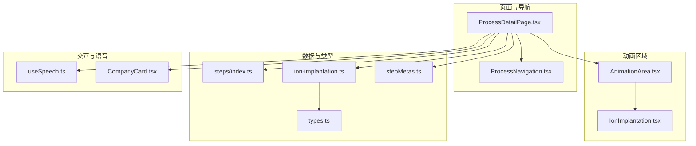
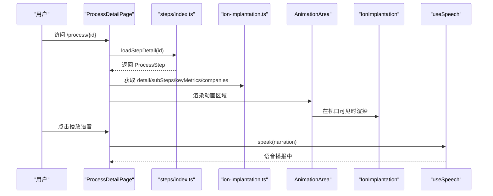
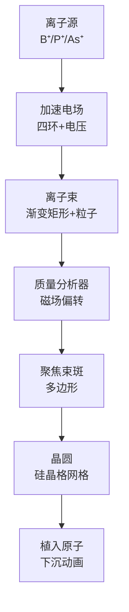
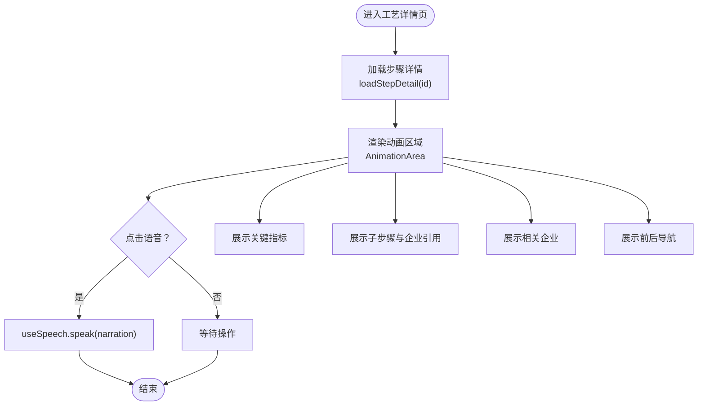
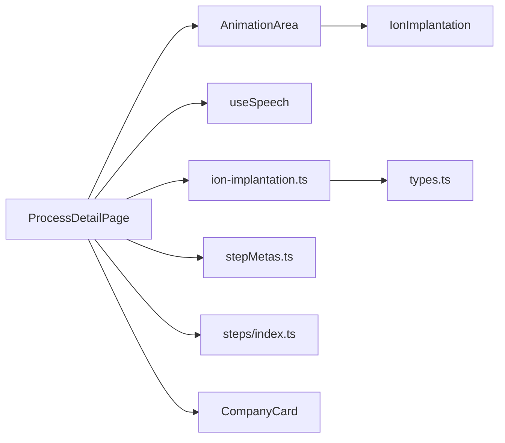

# 离子注入工艺

<cite>
**本文档引用的文件**
- [IonImplantation.tsx](file://src/components/process/IonImplantation.tsx)
- [ion-implantation.ts](file://src/data/steps/ion-implantation.ts)
- [ProcessDetailPage.tsx](file://src/components/layout/ProcessDetailPage.tsx)
- [AnimationArea.tsx](file://src/components/ui/AnimationArea.tsx)
- [useSpeech.ts](file://src/hooks/useSpeech.ts)
- [index.ts](file://src/data/steps/index.ts)
- [types.ts](file://src/data/types.ts)
- [stepMetas.ts](file://src/data/stepMetas.ts)
- [CompanyCard.tsx](file://src/components/ui/CompanyCard.tsx)
- [ProcessNavigation.tsx](file://src/components/ui/ProcessNavigation.tsx)
</cite>

## 目录
1. [简介](#简介)
2. [项目结构](#项目结构)
3. [核心组件](#核心组件)
4. [架构总览](#架构总览)
5. [详细组件分析](#详细组件分析)
6. [依赖关系分析](#依赖关系分析)
7. [性能考虑](#性能考虑)
8. [故障排除指南](#故障排除指南)
9. [结论](#结论)
10. [附录](#附录)

## 简介
本技术文档围绕“离子注入”这一关键半导体制造工艺，结合前端可视化动画与详尽的工艺参数说明，系统阐述高能离子束注入、能量分布与掺杂浓度控制的动画模拟实现；同时对离子源产生、质量分离与束流聚焦的技术要点进行解读，并进一步说明注入深度分布、横向扩散与激活退火的物理过程。文档还提供了关键参数、能量选择与剂量控制方法，以及注入后电学特性与器件性能的关系分析，帮助读者全面理解离子注入在芯片制造中的作用与实现方式。

## 项目结构
本项目采用模块化的React组件架构，将每个制造工艺步骤封装为独立的组件与数据模块。其中，离子注入工艺由一个SVG动画组件负责可视化展示，配合数据模块提供详细的工艺描述、关键指标与企业信息。

图表来源
- [ProcessDetailPage.tsx:36-34](file://src/components/layout/ProcessDetailPage.tsx#L36-L34)
- [AnimationArea.tsx:11-28](file://src/components/ui/AnimationArea.tsx#L11-L28)
- [IonImplantation.tsx:1-116](file://src/components/process/IonImplantation.tsx#L1-L116)
- [index.ts:16-33](file://src/data/steps/index.ts#L16-L33)
- [ion-implantation.ts:3-132](file://src/data/steps/ion-implantation.ts#L3-L132)
- [types.ts:19-32](file://src/data/types.ts#L19-L32)
- [stepMetas.ts:48-56](file://src/data/stepMetas.ts#L48-L56)
- [useSpeech.ts:64-135](file://src/hooks/useSpeech.ts#L64-L135)
- [CompanyCard.tsx:99-159](file://src/components/ui/CompanyCard.tsx#L99-L159)

章节来源
- [ProcessDetailPage.tsx:36-34](file://src/components/layout/ProcessDetailPage.tsx#L36-L34)
- [AnimationArea.tsx:11-28](file://src/components/ui/AnimationArea.tsx#L11-L28)
- [IonImplantation.tsx:1-116](file://src/components/process/IonImplantation.tsx#L1-L116)
- [index.ts:16-33](file://src/data/steps/index.ts#L16-L33)
- [ion-implantation.ts:3-132](file://src/data/steps/ion-implantation.ts#L3-L132)
- [types.ts:19-32](file://src/data/types.ts#L19-L32)
- [stepMetas.ts:48-56](file://src/data/stepMetas.ts#L48-L56)
- [useSpeech.ts:64-135](file://src/hooks/useSpeech.ts#L64-L135)
- [CompanyCard.tsx:99-159](file://src/components/ui/CompanyCard.tsx#L99-L159)

## 核心组件
- 离子注入动画组件：基于SVG绘制的动画，展示离子源、加速电场、质量分析器、聚焦束斑、晶圆与植入原子等关键部件与过程，配合CSS动画实现脉冲、闪烁与下沉等效果。
- 工艺详情页：统一承载动画区域、语音讲解、关键指标、详细步骤与相关企业信息，支持跨步骤导航与语音播报。
- 数据模块：提供离子注入的详细描述、关键指标、子步骤与企业清单，支撑页面渲染与交互。
- 动画区域：负责在视口可见时渲染对应动画组件，并提供“正在朗读”指示器。
- 语音模块：封装Web Speech API，自动选择中文自然语音，支持播放/停止与偏好记忆。

章节来源
- [IonImplantation.tsx:1-116](file://src/components/process/IonImplantation.tsx#L1-L116)
- [ProcessDetailPage.tsx:36-397](file://src/components/layout/ProcessDetailPage.tsx#L36-L397)
- [ion-implantation.ts:3-132](file://src/data/steps/ion-implantation.ts#L3-L132)
- [AnimationArea.tsx:11-28](file://src/components/ui/AnimationArea.tsx#L11-L28)
- [useSpeech.ts:64-135](file://src/hooks/useSpeech.ts#L64-L135)

## 架构总览
下图展示了从路由到动画渲染、数据加载与语音交互的整体流程。

图表来源
- [ProcessDetailPage.tsx:59-67](file://src/components/layout/ProcessDetailPage.tsx#L59-L67)
- [index.ts:16-21](file://src/data/steps/index.ts#L16-L21)
- [ion-implantation.ts:3-132](file://src/data/steps/ion-implantation.ts#L3-L132)
- [AnimationArea.tsx:11-22](file://src/components/ui/AnimationArea.tsx#L11-L22)
- [IonImplantation.tsx:1-116](file://src/components/process/IonImplantation.tsx#L1-L116)
- [useSpeech.ts:74-107](file://src/hooks/useSpeech.ts#L74-L107)

## 详细组件分析

### 离子注入动画组件（SVG + CSS动画）
该组件通过SVG元素与CSS关键帧动画，直观呈现离子注入的典型流程：
- 离子源：矩形框标注“B⁺/P⁺/As⁺”，体现常用掺杂离子种类。
- 加速电场：四环结构与“+”号标注，配合脉冲动画表现加速电场状态。
- 离子束：渐变填充的矩形条，粒子点阵移动，体现束流形态与动态。
- 质量分析器：曲线路径与“磁场偏转”标注，展示磁分离原理。
- 束流聚焦：多边形区域，脉冲动画强调聚焦效果。
- 硅晶格与植入原子：网格状点阵与下沉动画圆点，模拟注入后的原子分布。

图表来源
- [IonImplantation.tsx:56-115](file://src/components/process/IonImplantation.tsx#L56-L115)

章节来源
- [IonImplantation.tsx:1-116](file://src/components/process/IonImplantation.tsx#L1-L116)

### 工艺详情页（ProcessDetailPage）
该组件负责：
- 动画区域渲染与重播控制，支持在步骤切换时重置动画。
- 语音讲解：根据step.narration调用useSpeech，提供播放/停止能力。
- 关键指标展示：keyMetrics用于突出注入能量、剂量、均匀性与退火条件。
- 子步骤列表：分步解析subSteps，标注涉及的企业引用。
- 相关企业：按标签分类展示国际龙头、中国力量与新兴势力企业。
- 导航：前后步骤跳转与返回首页。

图表来源
- [ProcessDetailPage.tsx:36-397](file://src/components/layout/ProcessDetailPage.tsx#L36-L397)
- [AnimationArea.tsx:11-28](file://src/components/ui/AnimationArea.tsx#L11-L28)
- [useSpeech.ts:74-107](file://src/hooks/useSpeech.ts#L74-L107)

章节来源
- [ProcessDetailPage.tsx:36-397](file://src/components/layout/ProcessDetailPage.tsx#L36-L397)

### 数据模块与类型定义
- 工艺步骤类型：ProcessStep包含id、名称、英文名、描述、详细说明、子步骤、语音讲解、图标、颜色、关键指标与企业列表。
- 子步骤类型：ProcessSubStep包含标题、描述与企业引用。
- 公司类型：Company包含名称、英文名、国家、国旗、描述、亮点、标签与类别。
- 步骤索引模块：按id异步加载对应步骤模块，支持全量加载统计企业出现次数。

章节来源
- [types.ts:19-32](file://src/data/types.ts#L19-L32)
- [ion-implantation.ts:3-132](file://src/data/steps/ion-implantation.ts#L3-L132)
- [index.ts:16-33](file://src/data/steps/index.ts#L16-L33)

### 语音模块（useSpeech）
- 自动评分与选择最佳中文语音（优先神经音质、本地服务、zh-CN语言）。
- 支持播放/停止、获取可用语音列表与设置首选语音。
- 适配Web Speech API兼容性，延迟等待语音资源加载。

章节来源
- [useSpeech.ts:64-135](file://src/hooks/useSpeech.ts#L64-L135)

### 动画区域（AnimationArea）
- 使用useInView判断可视性，仅在可见时渲染动画组件，提升性能。
- 提供“正在朗读”指示器，增强用户体验。

章节来源
- [AnimationArea.tsx:11-28](file://src/components/ui/AnimationArea.tsx#L11-L28)

### 相关企业展示（CompanyCard）
- 按标签分组展示国际龙头、中国力量与新兴势力企业。
- 支持显示企业所属国家、类别与在多个环节中的参与次数。

章节来源
- [CompanyCard.tsx:99-159](file://src/components/ui/CompanyCard.tsx#L99-L159)

## 依赖关系分析
- 组件耦合：ProcessDetailPage聚合动画、语音、导航与企业展示，但通过模块化拆分降低耦合度。
- 数据依赖：steps/index.ts提供按id动态加载步骤的能力，避免一次性引入所有步骤模块。
- 类型约束：types.ts确保数据结构一致性，便于扩展与维护。
- 可视化与交互：AnimationArea与useSpeech分别负责渲染时机与语音体验，二者通过props传递。

图表来源
- [ProcessDetailPage.tsx:36-34](file://src/components/layout/ProcessDetailPage.tsx#L36-L34)
- [AnimationArea.tsx:11-28](file://src/components/ui/AnimationArea.tsx#L11-L28)
- [IonImplantation.tsx:1-116](file://src/components/process/IonImplantation.tsx#L1-L116)
- [index.ts:16-33](file://src/data/steps/index.ts#L16-L33)
- [ion-implantation.ts:3-132](file://src/data/steps/ion-implantation.ts#L3-L132)
- [types.ts:19-32](file://src/data/types.ts#L19-L32)
- [stepMetas.ts:48-56](file://src/data/stepMetas.ts#L48-L56)
- [useSpeech.ts:64-135](file://src/hooks/useSpeech.ts#L64-L135)
- [CompanyCard.tsx:99-159](file://src/components/ui/CompanyCard.tsx#L99-L159)

章节来源
- [ProcessDetailPage.tsx:36-397](file://src/components/layout/ProcessDetailPage.tsx#L36-L397)
- [index.ts:16-33](file://src/data/steps/index.ts#L16-L33)

## 性能考虑
- 懒加载与按需渲染：通过steps/index.ts的动态导入与AnimationArea的useInView，仅在需要时加载与渲染动画，减少初始开销。
- 动画优化：CSS动画优于JavaScript动画，避免频繁重排；合理设置动画延迟与节拍，保证流畅度。
- 语音资源：优先本地服务与神经音质语音，降低网络依赖与首播延迟。
- 数据缓存：全量加载步骤以统计企业出现次数，避免重复请求。

[本节为通用性能建议，不直接分析具体文件，故无章节来源]

## 故障排除指南
- Web Speech API不可用：检查浏览器支持与权限，useSpeech会记录警告并回退。
- 语音资源未加载：等待onvoiceschanged事件触发后再尝试播放。
- 动画不显示：确认AnimationArea处于视口内，或手动重播动画。
- 步骤加载失败：确认id正确且对应模块存在，检查steps/index.ts映射。

章节来源
- [useSpeech.ts:74-107](file://src/hooks/useSpeech.ts#L74-L107)
- [AnimationArea.tsx:11-28](file://src/components/ui/AnimationArea.tsx#L11-L28)
- [index.ts:16-21](file://src/data/steps/index.ts#L16-L21)

## 结论
本项目通过清晰的组件划分与数据驱动的方式，完整呈现了离子注入工艺的可视化动画与详尽说明。动画组件精准还原了离子源、加速电场、质量分析与束流聚焦等关键环节，辅以关键指标与子步骤解析，帮助用户理解能量分布、剂量控制与退火激活等核心概念。结合企业信息与导航功能，实现了从知识学习到实践参考的闭环体验。

[本节为总结性内容，不直接分析具体文件，故无章节来源]

## 附录

### 离子注入工艺参数与控制要点
- 注入能量范围：10keV ~ 5MeV，决定注入深度（峰值投影深度Rp，范围约10nm ~ 几μm）。
- 注入剂量范围：1×10¹¹ ~ 1×10¹⁶ cm⁻²，决定掺杂浓度分布。
- 剂量均匀性：±0.5%（12英寸晶圆），通过静电扫描板与机械扫描实现。
- 注入角度：7°以减少沟道效应，提高注入效率。
- 三大注入类型：
  - 大束流：高剂量、源漏区掺杂，束流>10mA。
  - 中束流：阱区掺杂。
  - 高能注入：深阱与埋层，能量>1MeV。
- 退火激活：
  - 快速热退火（RTA）：1050°C，<1s（Spike退火）。
  - 激光/闪光灯退火：毫秒级，抑制杂质扩散。
  - 宽禁带材料（GaN/SiC）：>1600°C退火。

章节来源
- [ion-implantation.ts:21-26](file://src/data/steps/ion-implantation.ts#L21-L26)
- [ion-implantation.ts:7-8](file://src/data/steps/ion-implantation.ts#L7-L8)

### 物理过程与器件性能关系
- 注入深度分布：由能量分布与晶格阻挡决定，形成近表面到深层的浓度梯度。
- 横向扩散：受束流散射与表面效应影响，通常通过退火激活阶段的原子迁移控制。
- 激活退火：修复晶格损伤，使掺杂原子进入替位，形成有效的载流子浓度，直接影响器件阈值电压、迁移率与漏电流等电学特性。

章节来源
- [ion-implantation.ts:7-8](file://src/data/steps/ion-implantation.ts#L7-L8)