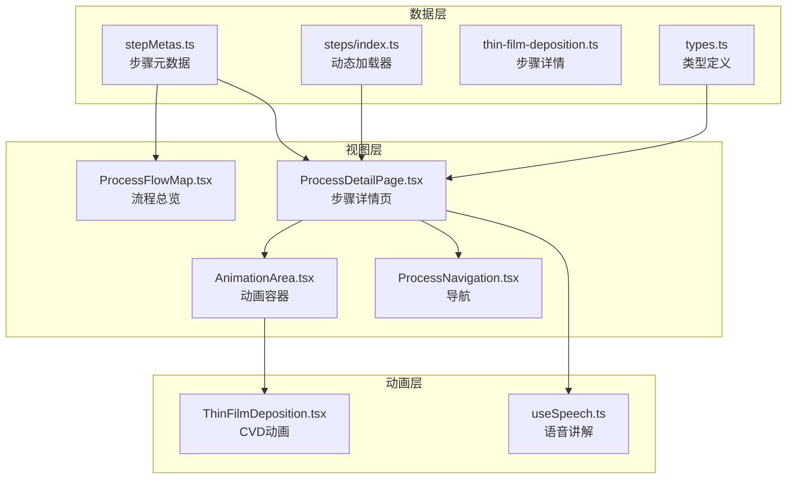
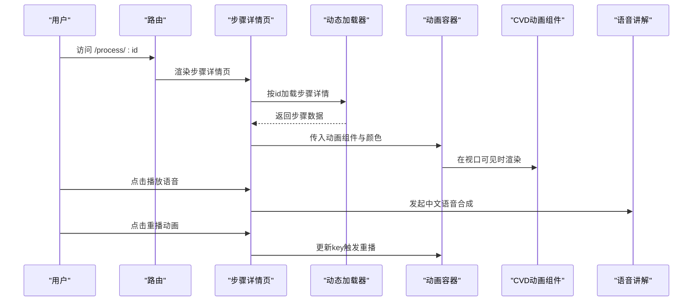
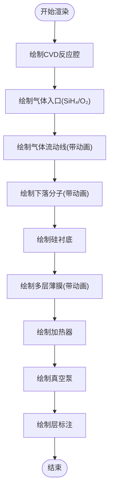
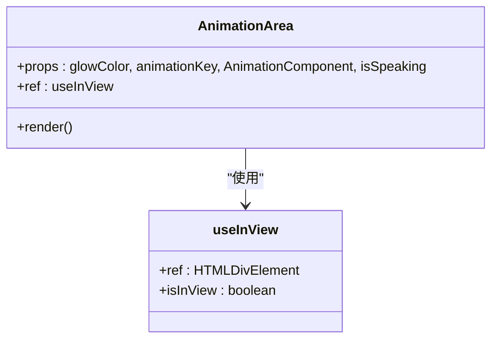
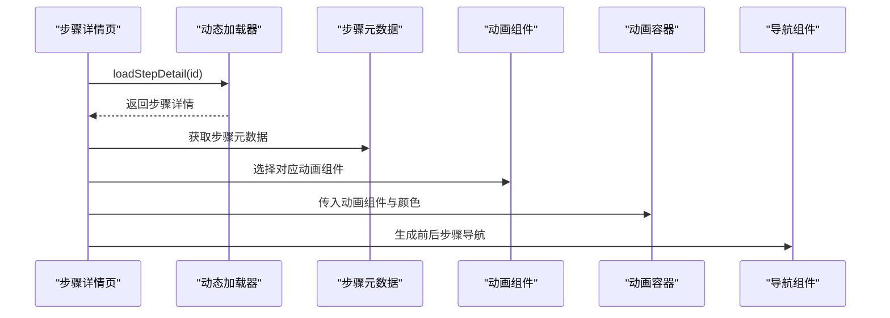
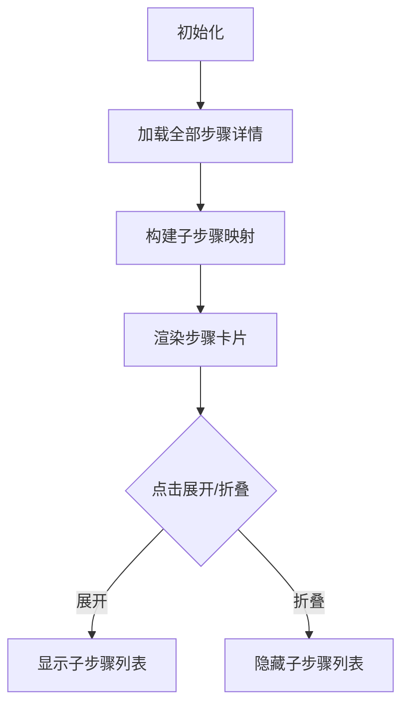
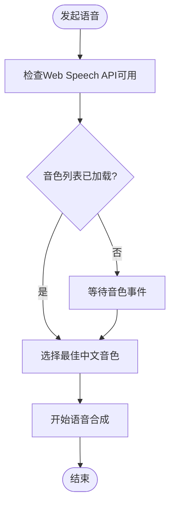
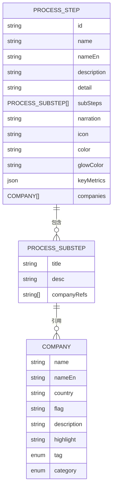
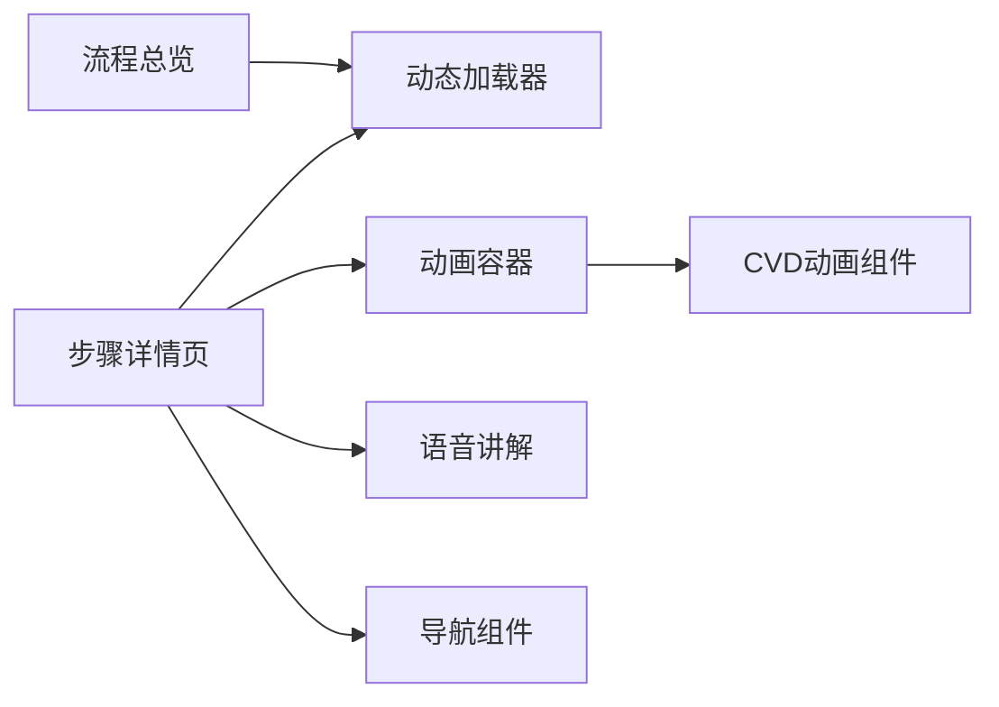

# 薄膜沉积工艺

<cite>
**本文引用的文件**
- [ThinFilmDeposition.tsx](file://src/components/process/ThinFilmDeposition.tsx)
- [AnimationArea.tsx](file://src/components/ui/AnimationArea.tsx)
- [ProcessDetailPage.tsx](file://src/components/layout/ProcessDetailPage.tsx)
- [ProcessFlowMap.tsx](file://src/components/layout/ProcessFlowMap.tsx)
- [useSpeech.ts](file://src/hooks/useSpeech.ts)
- [thin-film-deposition.ts](file://src/data/steps/thin-film-deposition.ts)
- [stepMetas.ts](file://src/data/stepMetas.ts)
- [index.ts](file://src/data/steps/index.ts)
- [types.ts](file://src/data/types.ts)
- [ProcessNavigation.tsx](file://src/components/ui/ProcessNavigation.tsx)
- [package.json](file://package.json)
</cite>

## 目录
1. [简介](#简介)
2. [项目结构](#项目结构)
3. [核心组件](#核心组件)
4. [架构总览](#架构总览)
5. [详细组件分析](#详细组件分析)
6. [依赖关系分析](#依赖关系分析)
7. [性能考量](#性能考量)
8. [故障排查指南](#故障排查指南)
9. [结论](#结论)
10. [附录](#附录)

## 简介
本技术文档围绕“薄膜沉积”这一芯片制造关键工艺，结合前端动画实现与数据驱动的展示页面，系统阐述化学气相沉积（CVD）、物理气相沉积（PVD）与原子层沉积（ALD）的动画模拟方式，解释前驱体反应、表面吸附与薄膜生长的微观过程，总结厚度控制、成分均匀性与应力管理的技术要点，并给出适用场景、工艺参数与质量控制方法，以及特性表征与可靠性评估手段。文档同时梳理了动画渲染、语音讲解与导航交互的前端实现，帮助读者从工程与教学两个维度理解该工艺的可视化呈现。

## 项目结构
本项目采用模块化的前端架构，以“流程步骤”为单位组织数据与视图：
- 数据层：类型定义、步骤元数据、步骤详情与动态加载器
- 视图层：流程总览、步骤详情页、动画区域与导航
- 动画层：SVG动画组件与可复用的动画容器
- 交互层：语音讲解、进度条与导航跳转

图表来源
- [ProcessFlowMap.tsx:1-255](file://src/components/layout/ProcessFlowMap.tsx#L1-L255)
- [ProcessDetailPage.tsx:1-397](file://src/components/layout/ProcessDetailPage.tsx#L1-L397)
- [AnimationArea.tsx:1-29](file://src/components/ui/AnimationArea.tsx#L1-L29)
- [ThinFilmDeposition.tsx:1-124](file://src/components/process/ThinFilmDeposition.tsx#L1-L124)
- [useSpeech.ts:1-135](file://src/hooks/useSpeech.ts#L1-L135)
- [thin-film-deposition.ts:1-152](file://src/data/steps/thin-film-deposition.ts#L1-L152)
- [stepMetas.ts:1-103](file://src/data/stepMetas.ts#L1-L103)
- [index.ts:1-34](file://src/data/steps/index.ts#L1-L34)
- [types.ts:1-33](file://src/data/types.ts#L1-L33)

章节来源
- [ProcessFlowMap.tsx:1-255](file://src/components/layout/ProcessFlowMap.tsx#L1-L255)
- [ProcessDetailPage.tsx:1-397](file://src/components/layout/ProcessDetailPage.tsx#L1-L397)
- [AnimationArea.tsx:1-29](file://src/components/ui/AnimationArea.tsx#L1-L29)
- [ThinFilmDeposition.tsx:1-124](file://src/components/process/ThinFilmDeposition.tsx#L1-L124)
- [useSpeech.ts:1-135](file://src/hooks/useSpeech.ts#L1-L135)
- [thin-film-deposition.ts:1-152](file://src/data/steps/thin-film-deposition.ts#L1-L152)
- [stepMetas.ts:1-103](file://src/data/stepMetas.ts#L1-L103)
- [index.ts:1-34](file://src/data/steps/index.ts#L1-L34)
- [types.ts:1-33](file://src/data/types.ts#L1-L33)

## 核心组件
- 薄膜沉积动画组件：以SVG实现CVD反应腔、气体流动、分子下落与多层薄膜堆积的动画序列，体现CVD的微观过程模拟。
- 动画容器：负责在视口可见时渲染动画组件，并支持重播与语音指示。
- 步骤详情页：聚合数据与视图，提供语音讲解、关键指标、子步骤与企业信息。
- 流程总览：以时间轴形式展示全部工艺步骤，支持展开/折叠查看子步骤。
- 语音讲解：自动选择中文自然音色，支持偏好记忆与手动切换。

章节来源
- [ThinFilmDeposition.tsx:1-124](file://src/components/process/ThinFilmDeposition.tsx#L1-L124)
- [AnimationArea.tsx:1-29](file://src/components/ui/AnimationArea.tsx#L1-L29)
- [ProcessDetailPage.tsx:1-397](file://src/components/layout/ProcessDetailPage.tsx#L1-L397)
- [ProcessFlowMap.tsx:1-255](file://src/components/layout/ProcessFlowMap.tsx#L1-L255)
- [useSpeech.ts:1-135](file://src/hooks/useSpeech.ts#L1-L135)

## 架构总览
前端采用“数据驱动 + 组件化”的架构模式：
- 数据来源：步骤元数据与步骤详情，动态加载器按需加载
- 视图渲染：步骤详情页根据路由参数选择对应动画组件
- 交互体验：语音讲解、进度条、导航与动画重播
- 动画实现：SVG + CSS动画，通过类名与CSS变量控制延迟与时序

图表来源
- [ProcessDetailPage.tsx:36-116](file://src/components/layout/ProcessDetailPage.tsx#L36-L116)
- [index.ts:16-33](file://src/data/steps/index.ts#L16-L33)
- [AnimationArea.tsx:11-28](file://src/components/ui/AnimationArea.tsx#L11-L28)
- [ThinFilmDeposition.tsx:1-124](file://src/components/process/ThinFilmDeposition.tsx#L1-L124)
- [useSpeech.ts:74-112](file://src/hooks/useSpeech.ts#L74-L112)

## 详细组件分析

### CVD动画组件（ThinFilmDeposition.tsx）
该组件通过SVG与CSS动画模拟CVD过程的关键环节：
- 反应腔与气体入口：展示反应室与SiH₄、O₂等气体入口
- 气体流动：多条垂直线带虚线与渐隐效果，配合CSS动画实现“流动”视觉
- 分子下落：多个圆形粒子沿固定路径下落，透明度与位移随时间变化
- 薄膜层叠：两层矩形自下而上按不同节奏增长，体现多层沉积
- 加热器与真空泵：标识关键设备位置
- 图层标注：右侧标注SiO₂与Si₃N₄层

图表来源
- [ThinFilmDeposition.tsx:53-121](file://src/components/process/ThinFilmDeposition.tsx#L53-L121)

章节来源
- [ThinFilmDeposition.tsx:1-124](file://src/components/process/ThinFilmDeposition.tsx#L1-L124)

### 动画容器（AnimationArea.tsx）
动画容器负责：
- 基于交互动画钩子判断视口可见性
- 在可见时渲染传入的动画组件
- 支持重播按钮更新key触发重新渲染
- 显示语音讲解指示器

图表来源
- [AnimationArea.tsx:11-28](file://src/components/ui/AnimationArea.tsx#L11-L28)

章节来源
- [AnimationArea.tsx:1-29](file://src/components/ui/AnimationArea.tsx#L1-L29)

### 步骤详情页（ProcessDetailPage.tsx）
该页面整合数据与视图：
- 动态加载步骤详情与全部步骤，计算企业参与次数
- 根据路由id映射动画组件
- 提供语音讲解控制、重播动画与进度导航
- 展示关键指标、子步骤与相关企业信息

图表来源
- [ProcessDetailPage.tsx:36-116](file://src/components/layout/ProcessDetailPage.tsx#L36-L116)
- [index.ts:16-33](file://src/data/steps/index.ts#L16-L33)
- [stepMetas.ts:57-65](file://src/data/stepMetas.ts#L57-L65)

章节来源
- [ProcessDetailPage.tsx:1-397](file://src/components/layout/ProcessDetailPage.tsx#L1-L397)

### 流程总览（ProcessFlowMap.tsx）
流程总览以时间轴展示全部步骤，支持展开/折叠查看子步骤：
- 使用动态加载器获取全部步骤详情，构建子步骤映射
- 通过状态管理控制展开/折叠
- 结合交互动画钩子实现渐显效果

图表来源
- [ProcessFlowMap.tsx:200-255](file://src/components/layout/ProcessFlowMap.tsx#L200-L255)
- [index.ts:23-33](file://src/data/steps/index.ts#L23-L33)

章节来源
- [ProcessFlowMap.tsx:1-255](file://src/components/layout/ProcessFlowMap.tsx#L1-L255)

### 语音讲解（useSpeech.ts）
语音讲解模块：
- 自动评分并选择最佳中文自然音色，优先神经音质与本地服务
- 支持偏好记忆与手动切换
- 提供清晰的语速与音调设置，适配中文讲解

图表来源
- [useSpeech.ts:74-112](file://src/hooks/useSpeech.ts#L74-L112)
- [useSpeech.ts:42-62](file://src/hooks/useSpeech.ts#L42-L62)

章节来源
- [useSpeech.ts:1-135](file://src/hooks/useSpeech.ts#L1-L135)

### 数据模型与步骤详情
- 类型定义：统一描述公司、步骤与子步骤的数据结构
- 步骤元数据：包含图标、颜色、发光色等UI属性
- 步骤详情：包含名称、英文名、描述、详解、子步骤、关键指标与企业列表
- 动态加载器：按id异步加载步骤详情，保持顺序与可维护性

图表来源
- [types.ts:12-32](file://src/data/types.ts#L12-L32)
- [thin-film-deposition.ts:3-152](file://src/data/steps/thin-film-deposition.ts#L3-L152)

章节来源
- [types.ts:1-33](file://src/data/types.ts#L1-L33)
- [thin-film-deposition.ts:1-152](file://src/data/steps/thin-film-deposition.ts#L1-L152)
- [stepMetas.ts:11-102](file://src/data/stepMetas.ts#L11-L102)
- [index.ts:1-34](file://src/data/steps/index.ts#L1-L34)

## 依赖关系分析
- 组件耦合：步骤详情页依赖动态加载器与动画容器；动画容器依赖交互动画钩子；语音讲解独立但被步骤详情页调用
- 外部依赖：React、React Router、Tailwind CSS、Lucide Icons、Web Speech API
- 数据依赖：步骤元数据与步骤详情通过动态加载器解耦

图表来源
- [ProcessDetailPage.tsx:36-116](file://src/components/layout/ProcessDetailPage.tsx#L36-L116)
- [index.ts:16-33](file://src/data/steps/index.ts#L16-L33)
- [AnimationArea.tsx:11-28](file://src/components/ui/AnimationArea.tsx#L11-L28)
- [ThinFilmDeposition.tsx:1-124](file://src/components/process/ThinFilmDeposition.tsx#L1-L124)
- [ProcessFlowMap.tsx:200-255](file://src/components/layout/ProcessFlowMap.tsx#L200-L255)
- [ProcessNavigation.tsx:14-67](file://src/components/ui/ProcessNavigation.tsx#L14-L67)

章节来源
- [ProcessDetailPage.tsx:1-397](file://src/components/layout/ProcessDetailPage.tsx#L1-L397)
- [ProcessFlowMap.tsx:1-255](file://src/components/layout/ProcessFlowMap.tsx#L1-L255)
- [ProcessNavigation.tsx:1-67](file://src/components/ui/ProcessNavigation.tsx#L1-L67)
- [package.json:15-44](file://package.json#L15-L44)

## 性能考量
- 动画性能：SVG + CSS动画在现代浏览器中具备良好性能；建议避免在动画中使用昂贵的滤镜或复杂路径
- 渲染优化：通过交互动画钩子仅在视口可见时渲染动画，减少不必要的DOM更新
- 语音性能：音色选择与缓存避免重复计算；在无音色可用时延迟到事件触发
- 数据加载：动态加载器按需加载步骤详情，避免一次性加载全部数据

## 故障排查指南
- 动画不显示：确认动画容器的视口可见性钩子是否生效，检查动画组件key是否正确更新
- 语音无法播放：检查Web Speech API可用性与音色列表加载事件；确认音色偏好是否保存成功
- 步骤详情加载失败：检查动态加载器的id映射与模块导入路径
- 导航异常：确认步骤元数据与路由id一致，检查前后步骤的索引计算

章节来源
- [AnimationArea.tsx:11-28](file://src/components/ui/AnimationArea.tsx#L11-L28)
- [useSpeech.ts:74-112](file://src/hooks/useSpeech.ts#L74-L112)
- [index.ts:16-21](file://src/data/steps/index.ts#L16-L21)
- [ProcessDetailPage.tsx:51-55](file://src/components/layout/ProcessDetailPage.tsx#L51-L55)

## 结论
本项目通过数据驱动与组件化设计，将复杂的薄膜沉积工艺以直观的SVG动画呈现出来。CVD动画组件模拟了反应腔、气体流动、分子下落与多层薄膜堆积的微观过程，辅以语音讲解与关键指标展示，帮助用户深入理解CVD、PVD与ALD的差异与应用场景。同时，流程总览与导航组件提供了完整的工艺学习路径，适合教学与培训场景。

## 附录

### 工艺参数与质量控制要点
- CVD（化学气相沉积）
  - LPCVD：温度600~900°C，SiH₄热分解，台阶覆盖性优异，批量处理>100片/炉，均匀性<±2%
  - PECVD：温度300~450°C，TEOS+O₂等离子体，低k介电（SiO₂、SiN、SiCOH），填充性优良，沉积速率300nm/min
  - HDPCVD：高密度等离子体，优异的间隙填充能力，用于STI隔离氧化膜
- ALD（原子层沉积）
  - 单循环厚度<0.1nm，典型HfO₂、ZrO₂高k栅介电，等效氧化层EOT<0.5nm，界面态Dit<10¹⁰/eV/cm²
  - 前驱体：TDMAH+H₂O交替脉冲，自限制反应
- PVD（物理气相沉积）
  - 金属薄膜（Ti/TiN/Ta/TaN/Al/Cu）种子层，均匀性好，用于阻挡层与通孔填充
- 工艺参数与质量控制
  - 厚度控制：SPC统计过程控制，目标±1%以内
  - 成分均匀性：XRF成分分析，椭偏仪测厚度与折射率
  - 应力管理：四探针方块电阻、TEM/EELS界面质量评估
  - 可靠性评估：热载流子注入、负偏压温度偏置（NBTB）、加速老化试验

章节来源
- [thin-film-deposition.ts:8-26](file://src/data/steps/thin-film-deposition.ts#L8-L26)
- [thin-film-deposition.ts:21-26](file://src/data/steps/thin-film-deposition.ts#L21-L26)