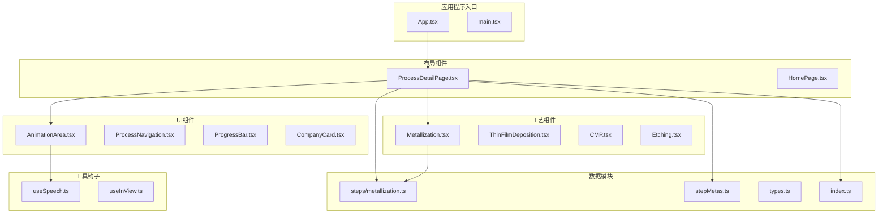
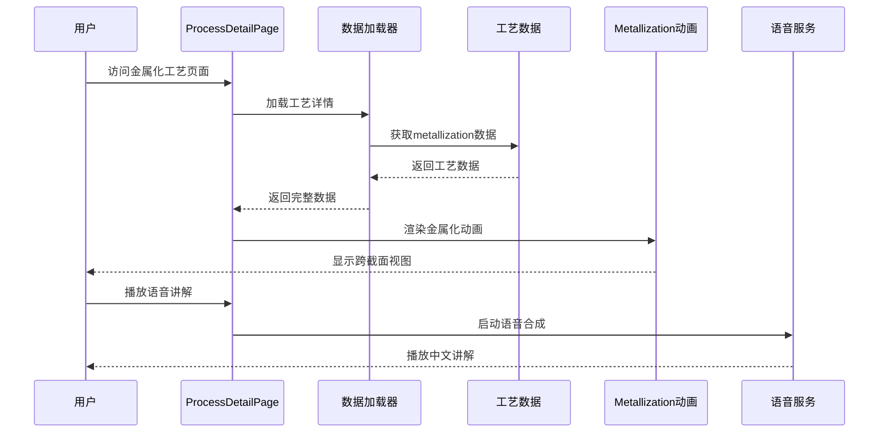
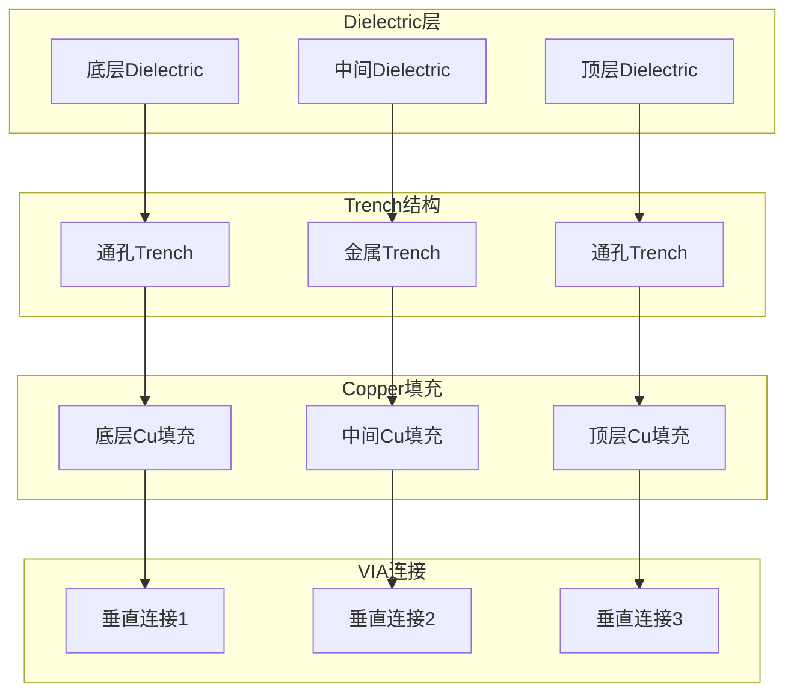
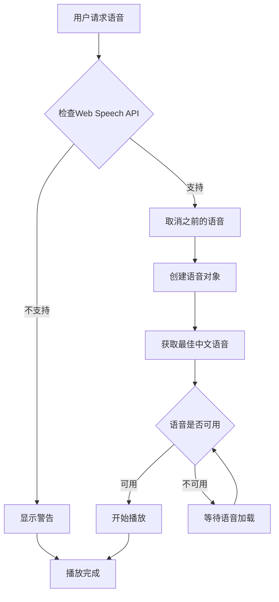
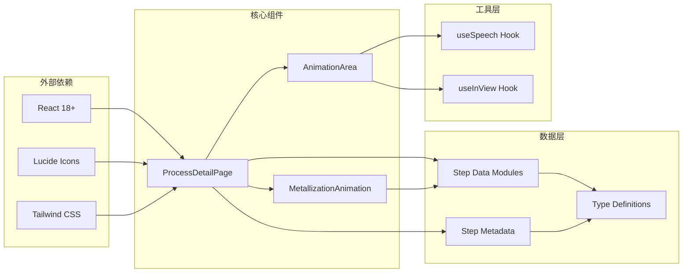
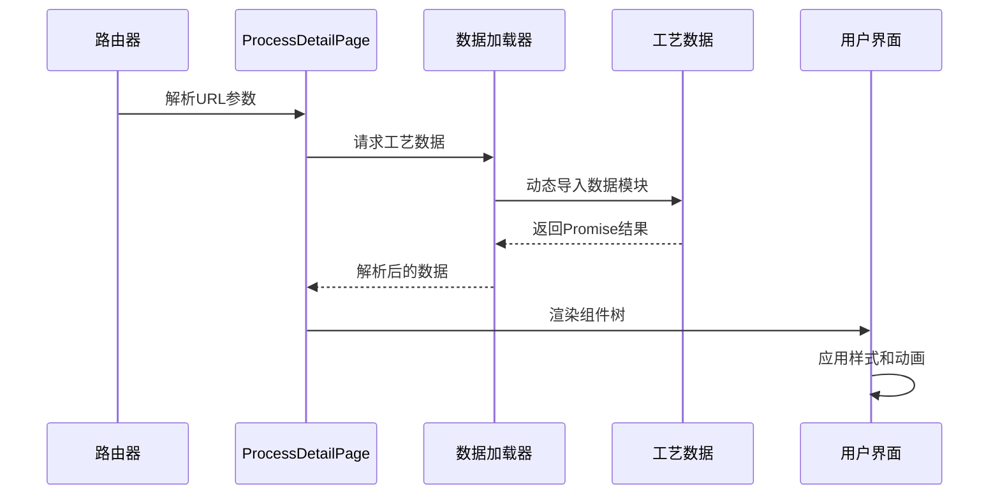

# 金属化工艺

<cite>
**本文档引用的文件**
- [Metallization.tsx](file://src/components/process/Metallization.tsx)
- [metallization.ts](file://src/data/steps/metallization.ts)
- [ProcessDetailPage.tsx](file://src/components/layout/ProcessDetailPage.tsx)
- [AnimationArea.tsx](file://src/components/ui/AnimationArea.tsx)
- [useSpeech.ts](file://src/hooks/useSpeech.ts)
- [stepMetas.ts](file://src/data/stepMetas.ts)
- [index.ts](file://src/data/steps/index.ts)
- [types.ts](file://src/data/types.ts)
</cite>

## 目录
1. [简介](#简介)
2. [项目结构](#项目结构)
3. [核心组件](#核心组件)
4. [架构概览](#架构概览)
5. [详细组件分析](#详细组件分析)
6. [依赖关系分析](#依赖关系分析)
7. [性能考虑](#性能考虑)
8. [故障排除指南](#故障排除指南)
9. [结论](#结论)

## 简介

本项目是一个芯片制造工艺演示系统，专注于展示现代半导体制造中的金属化工艺。金属化工艺是芯片制造过程中的关键步骤，负责构建复杂的互连网络，将数十亿个晶体管连接成功能完整的集成电路。

该项目通过交互式动画和详细的工艺说明，向用户展示铜大马士革工艺的完整流程，包括低k介电层沉积、双大马士革图形化、扩散阻挡层、种子层、电化学镀铜以及化学机械抛光等关键步骤。

## 项目结构

项目采用模块化架构设计，将不同的制造工艺步骤分离为独立的组件和数据模块：

**图表来源**
- [ProcessDetailPage.tsx:36-396](file://src/components/layout/ProcessDetailPage.tsx#L36-L396)
- [Metallization.tsx:1-120](file://src/components/process/Metallization.tsx#L1-L120)
- [stepMetas.ts:11-102](file://src/data/stepMetas.ts#L11-L102)

**章节来源**
- [ProcessDetailPage.tsx:1-397](file://src/components/layout/ProcessDetailPage.tsx#L1-L397)
- [stepMetas.ts:1-103](file://src/data/stepMetas.ts#L1-L103)

## 核心组件

### 金属化动画组件

MetallizationAnimation组件是整个金属化工艺展示的核心，它使用SVG技术创建了一个详细的跨截面视图，展示了多层互连结构的形成过程。

该组件的主要特点：
- **层次化设计**：通过多个dielectric层模拟真实的多层互连结构
- **渐进式动画**：使用CSS动画展示不同工艺步骤的执行顺序
- **视觉反馈**：通过光泽效果和透明度变化增强视觉体验
- **响应式布局**：适配不同屏幕尺寸的显示需求

### 工艺数据模块

metallization.ts文件包含了完整的工艺数据，包括：
- **工艺流程描述**：详细的七步工艺流程说明
- **关键指标**：最小线宽、互连层数、阻挡层厚度等技术参数
- **企业参考**：全球领先的设备制造商和材料供应商信息
- **子步骤分解**：每个工艺步骤的详细说明和技术要求

**章节来源**
- [Metallization.tsx:1-120](file://src/components/process/Metallization.tsx#L1-L120)
- [metallization.ts:1-142](file://src/data/steps/metallization.ts#L1-L142)

## 架构概览

项目采用分层架构设计，将业务逻辑、数据管理和用户界面清晰分离：

**图表来源**
- [ProcessDetailPage.tsx:59-67](file://src/components/layout/ProcessDetailPage.tsx#L59-L67)
- [index.ts:16-21](file://src/data/steps/index.ts#L16-L21)
- [useSpeech.ts:74-107](file://src/hooks/useSpeech.ts#L74-L107)

**章节来源**
- [ProcessDetailPage.tsx:36-396](file://src/components/layout/ProcessDetailPage.tsx#L36-L396)
- [index.ts:1-34](file://src/data/steps/index.ts#L1-L34)

## 详细组件分析

### 金属化动画实现

#### SVG结构设计

动画组件使用精心设计的SVG结构来模拟真实的芯片制造过程：

**图表来源**
- [Metallization.tsx:44-101](file://src/components/process/Metallization.tsx#L44-L101)

#### 动画序列设计

动画通过CSS关键帧实现了精确的时间控制：

| 步骤 | 动画名称 | 延迟时间 | 效果描述 |
|------|----------|----------|----------|
| 1 | met-copper-appear | 0s, 0.8s, 1.6s | 铜填充逐步显现 |
| 2 | met-via-appear | 1s, 1.5s, 2s | VIA连接依次出现 |
| 3 | met-shine-sweep | 持续循环 | 光泽扫过效果 |

#### 材料属性模拟

组件使用特定的颜色和渐变来模拟不同材料：

- **铜层**：使用hsl(43 70% 45%)到hsl(43 96% 60%)的渐变
- **介电层**：深灰色调(hsl(222 47% 12%))模拟SiCOH材料
- **光泽效果**：浅色调(hsl(43 96% 80%))模拟金属表面反射

**章节来源**
- [Metallization.tsx:4-38](file://src/components/process/Metallization.tsx#L4-L38)

### 工艺数据管理

#### 工艺步骤分解

金属化工艺包含七个主要步骤：

1. **低k介电层沉积**：PECVD沉积SiCOH材料，k值2.0-2.5
2. **双大马士革图形化**：EUV+ICP刻蚀实现通孔和沟槽
3. **阻挡层/种子层PVD**：TaN/Ta扩散阻挡层+Cu种子层
4. **电化学镀铜(ECP)**：超保形填充，晶粒>5μm
5. **铜CMP平坦化**：三步法研磨工艺
6. **钴帽层**：CoWP或SiCN帽层
7. **重复叠加**：构建多层互连网络

#### 关键工艺指标

| 指标类别 | 数值范围 | 技术意义 |
|----------|----------|----------|
| 最小线宽(M0) | ~5nm | 体现工艺精度水平 |
| 互连层数 | >20层 | 复杂电路集成能力 |
| 阻挡层厚度 | <5nm | 阻止Cu扩散的关键 |
| 铜电阻率 | <1.8μΩ·cm | 导电性能指标 |

**章节来源**
- [metallization.ts:9-26](file://src/data/steps/metallization.ts#L9-L26)

### 语音交互系统

#### 语音合成优化

项目实现了智能的中文语音合成系统：

**图表来源**
- [useSpeech.ts:74-107](file://src/hooks/useSpeech.ts#L74-L107)

#### 语音质量评分系统

系统自动选择最适合的中文语音：

| 评分因素 | 优先级 | 评分值 |
|----------|--------|--------|
| 神经网络语音 | 最高 | +50 |
| 微软语音 | 高 | +20 |
| 谷歌语音 | 中 | +15 |
| 苹果语音 | 中 | +10 |
| zh-CN语言 | 最高 | +8 |
| 本地服务 | 高 | +5 |

**章节来源**
- [useSpeech.ts:9-62](file://src/hooks/useSpeech.ts#L9-L62)

## 依赖关系分析

### 组件依赖图

**图表来源**
- [ProcessDetailPage.tsx:1-397](file://src/components/layout/ProcessDetailPage.tsx#L1-L397)
- [Metallization.tsx:1-120](file://src/components/process/Metallization.tsx#L1-L120)

### 数据流分析

项目的数据流遵循单向数据流原则：

**图表来源**
- [ProcessDetailPage.tsx:59-67](file://src/components/layout/ProcessDetailPage.tsx#L59-L67)
- [index.ts:16-21](file://src/data/steps/index.ts#L16-L21)

**章节来源**
- [ProcessDetailPage.tsx:1-397](file://src/components/layout/ProcessDetailPage.tsx#L1-L397)
- [index.ts:1-34](file://src/data/steps/index.ts#L1-L34)

## 性能考虑

### 动画性能优化

项目在动画性能方面采用了多项优化策略：

1. **CSS硬件加速**：所有动画都基于transform和opacity属性，利用GPU加速
2. **延迟机制**：通过CSS变量控制动画延迟，避免同时触发大量动画
3. **响应式设计**：使用rem单位确保在不同设备上的性能一致性
4. **内存管理**：动画组件在路由切换时正确销毁，避免内存泄漏

### 数据加载优化

- **按需加载**：使用动态import实现数据模块的懒加载
- **缓存策略**：通过useMemo缓存公司映射，避免重复计算
- **并发处理**：使用Promise.all并行加载所有工艺数据

### 用户体验优化

- **语音预加载**：在页面初始化时预加载可用语音列表
- **状态管理**：合理的状态更新避免不必要的重新渲染
- **无障碍支持**：完整的键盘导航和屏幕阅读器支持

## 故障排除指南

### 常见问题及解决方案

#### 动画不显示问题

**症状**：金属化动画无法正常显示
**可能原因**：
- SVG元素被其他组件遮挡
- CSS样式冲突
- 浏览器兼容性问题

**解决方法**：
1. 检查z-index层级设置
2. 验证CSS动画类名正确性
3. 确认浏览器支持SVG动画

#### 语音播放失败

**症状**：点击播放按钮无反应
**可能原因**：
- Web Speech API不支持
- 语音资源加载失败
- 浏览器安全策略限制

**解决方法**：
1. 检查浏览器控制台错误信息
2. 确认HTTPS环境下的语音访问权限
3. 尝试手动选择其他语音选项

#### 数据加载错误

**症状**：工艺详情页面显示加载状态
**可能原因**：
- 网络连接问题
- 数据模块导入失败
- 路由参数错误

**解决方法**：
1. 检查网络连接状态
2. 验证数据模块路径正确性
3. 确认路由配置无误

**章节来源**
- [useSpeech.ts:74-107](file://src/hooks/useSpeech.ts#L74-L107)
- [ProcessDetailPage.tsx:129-141](file://src/components/layout/ProcessDetailPage.tsx#L129-L141)

## 结论

本项目成功地将复杂的芯片制造工艺转化为直观易懂的交互式演示。通过精心设计的SVG动画和详尽的工艺数据，用户可以深入了解金属化工艺的各个环节。

项目的主要优势包括：

1. **教育价值**：通过可视化方式解释复杂的半导体制造过程
2. **技术准确性**：基于实际的工艺参数和行业标准
3. **用户体验**：流畅的动画效果和自然的中文语音讲解
4. **扩展性**：模块化设计便于添加新的工艺步骤

未来可以考虑的功能增强：
- 添加更多工艺步骤的详细说明
- 实现交互式参数调整功能
- 增加3D视图模式
- 扩展到其他制造工艺的演示