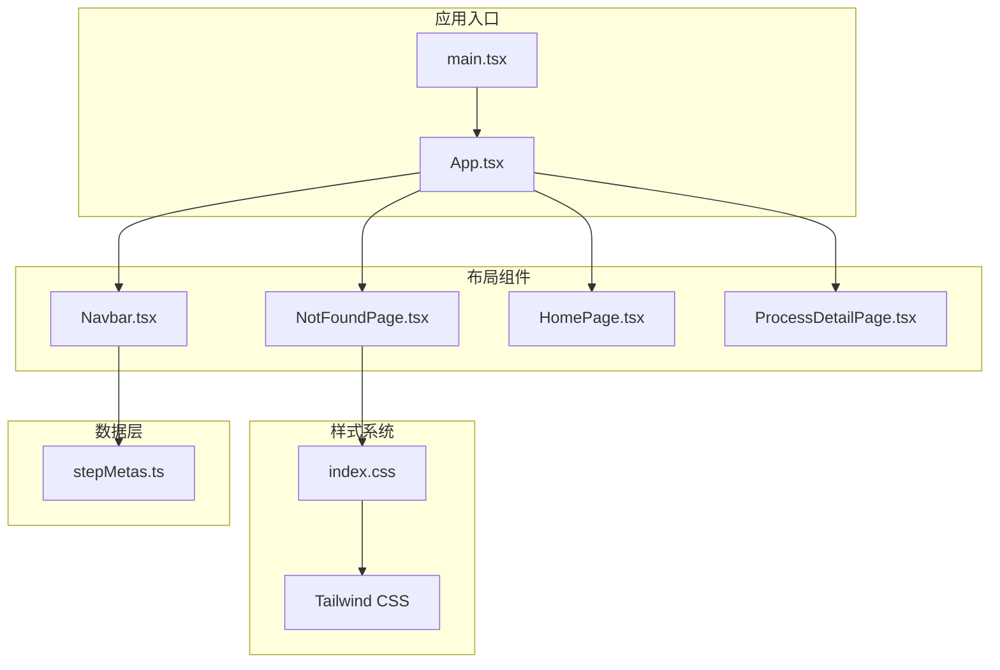
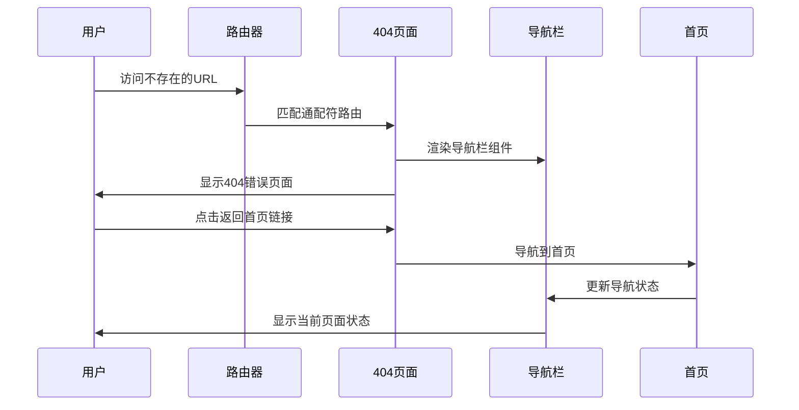
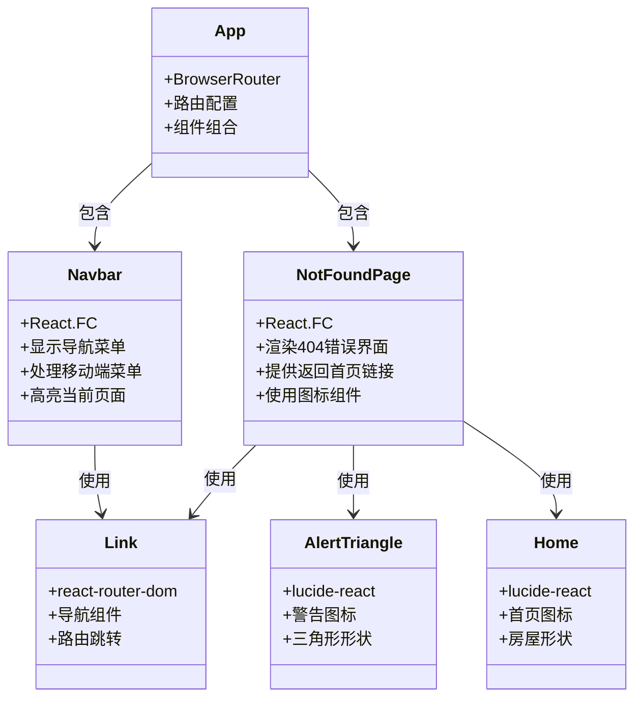
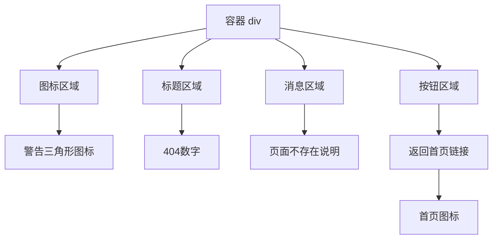
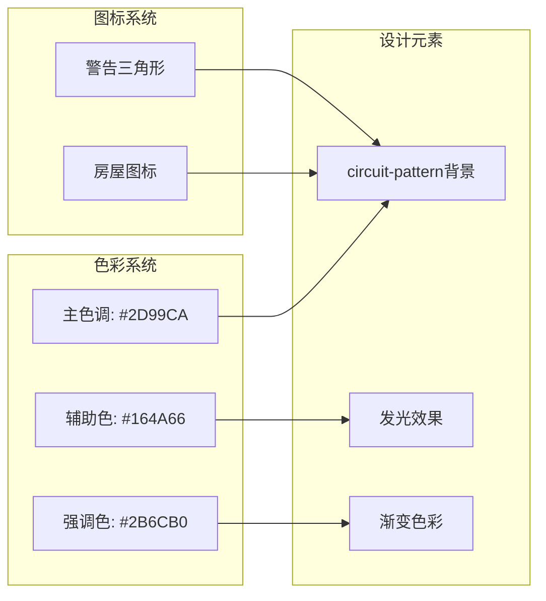
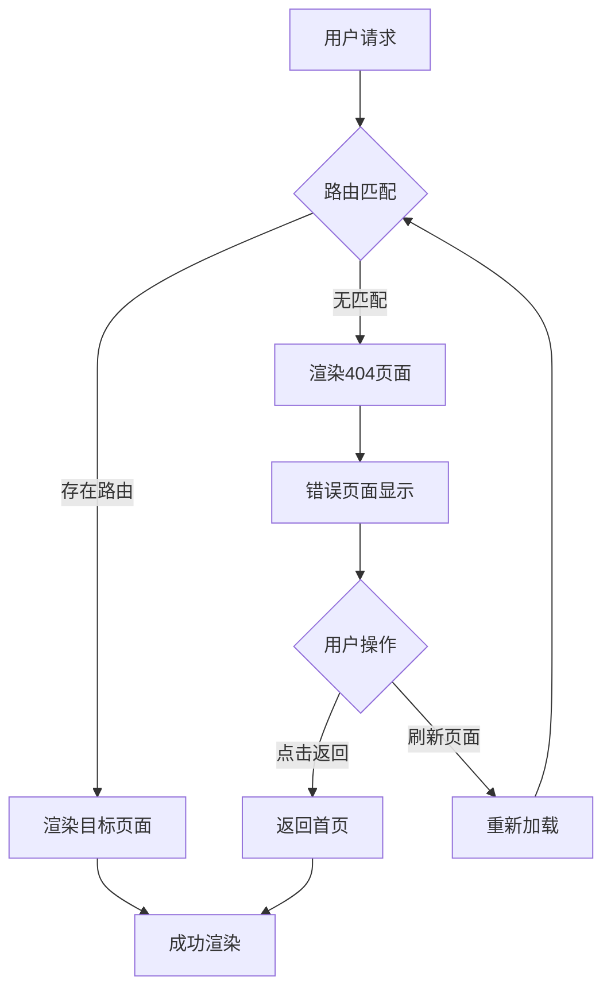
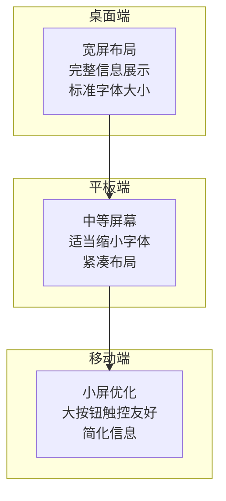
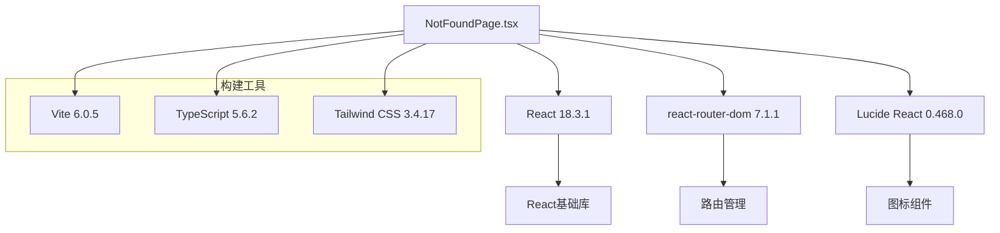
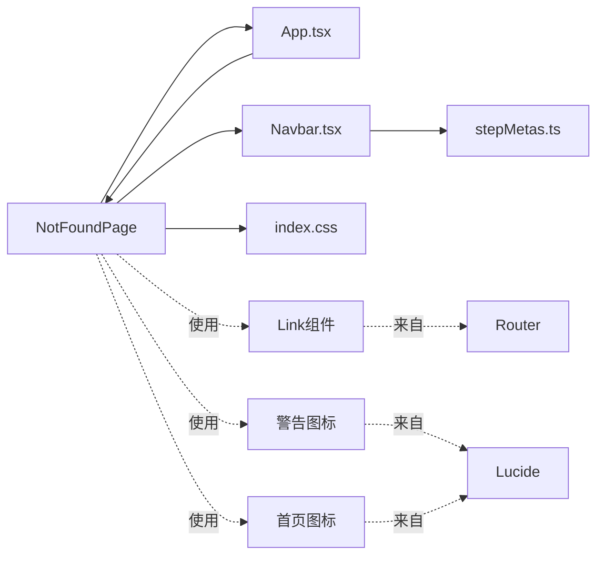
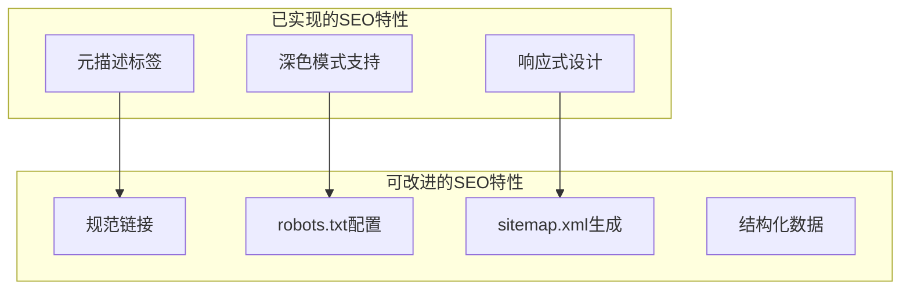

# 404页面组件

<cite>
**本文档引用的文件**
- [NotFoundPage.tsx](file://src/components/layout/NotFoundPage.tsx)
- [App.tsx](file://src/App.tsx)
- [main.tsx](file://src/main.tsx)
- [index.html](file://index.html)
- [index.css](file://src/index.css)
- [Navbar.tsx](file://src/components/layout/Navbar.tsx)
- [stepMetas.ts](file://src/data/stepMetas.ts)
- [package.json](file://package.json)
</cite>

## 目录
1. [简介](#简介)
2. [项目结构](#项目结构)
3. [核心组件](#核心组件)
4. [架构概览](#架构概览)
5. [详细组件分析](#详细组件分析)
6. [依赖关系分析](#依赖关系分析)
7. [性能考虑](#性能考虑)
8. [故障排除指南](#故障排除指南)
9. [结论](#结论)

## 简介

404页面组件是芯片制造演示网站的重要组成部分，负责处理用户访问不存在页面时的错误体验。该组件采用现代化的设计理念，结合芯片制造主题特色，为用户提供清晰的品牌一致性体验。本文档将深入分析404页面的设计理念、用户体验优化策略以及技术实现细节。

## 项目结构

该项目采用基于功能模块的组织方式，404页面作为布局组件的一部分，位于`src/components/layout/`目录下。整个应用使用React + TypeScript + Vite构建，采用Tailwind CSS进行样式管理。

**图表来源**
- [main.tsx:1-11](file://src/main.tsx#L1-L11)
- [App.tsx:1-23](file://src/App.tsx#L1-L23)
- [NotFoundPage.tsx:1-27](file://src/components/layout/NotFoundPage.tsx#L1-L27)

**章节来源**
- [main.tsx:1-11](file://src/main.tsx#L1-L11)
- [App.tsx:1-23](file://src/App.tsx#L1-L23)
- [index.html:1-15](file://index.html#L1-L15)

## 核心组件

404页面组件是一个简洁而功能完整的错误处理页面，具有以下核心特性：

### 设计理念
- **品牌一致性**：采用芯片制造主题色彩方案，使用主色调蓝色系
- **用户体验优化**：提供明确的错误信息和便捷的返回路径
- **视觉层次**：通过图标、颜色和排版建立清晰的信息层次

### 技术实现
- **响应式设计**：适配各种屏幕尺寸
- **无障碍支持**：包含适当的ARIA标签和语义化标记
- **性能优化**：最小化的DOM结构和高效的样式系统

**章节来源**
- [NotFoundPage.tsx:4-26](file://src/components/layout/NotFoundPage.tsx#L4-L26)

## 架构概览

404页面在整个应用架构中的位置和交互流程如下：

**图表来源**
- [App.tsx:12-16](file://src/App.tsx#L12-L16)
- [NotFoundPage.tsx:16-22](file://src/components/layout/NotFoundPage.tsx#L16-L22)

### 组件关系图

**图表来源**
- [NotFoundPage.tsx:1-27](file://src/components/layout/NotFoundPage.tsx#L1-L27)
- [Navbar.tsx:1-82](file://src/components/layout/Navbar.tsx#L1-L82)
- [App.tsx:1-23](file://src/App.tsx#L1-L23)

## 详细组件分析

### NotFoundPage组件详解

#### 结构设计
404页面采用卡片式布局，居中显示错误信息，整体设计简洁而不失专业感：

**图表来源**
- [NotFoundPage.tsx:6-24](file://src/components/layout/NotFoundPage.tsx#L6-L24)

#### 样式系统集成

404页面深度集成了Tailwind CSS样式系统，使用了多种预定义的样式类：

| 样式类别 | 具体应用 | 设计效果 |
|---------|---------|----------|
| 布局 | `min-h-screen flex items-center justify-center` | 全屏居中布局 |
| 背景 | `circuit-pattern` | 芯片电路板背景纹理 |
| 图标 | `inline-flex items-center justify-center w-16 h-16` | 圆形图标容器 |
| 文本 | `text-4xl font-bold` | 大号错误代码显示 |
| 链接 | `inline-flex items-center gap-2` | 带图标的导航链接 |

#### 品牌一致性保持

404页面严格遵循芯片制造主题的设计规范：

**图表来源**
- [index.css:13-46](file://src/index.css#L13-L46)
- [index.css:109-116](file://src/index.css#L109-L116)

**章节来源**
- [NotFoundPage.tsx:1-27](file://src/components/layout/NotFoundPage.tsx#L1-L27)
- [index.css:109-116](file://src/index.css#L109-L116)

### 错误处理机制

#### 路由配置
应用使用React Router的通配符路由来捕获所有未匹配的URL：

**图表来源**
- [App.tsx:15](file://src/App.tsx#L15)

#### 导航链接配置
404页面提供了一个主要的导航链接，指向应用的首页：

| 链接属性 | 值 | 作用 |
|---------|----|------|
| 路径 | `/` | 首页地址 |
| 文本 | `返回首页` | 用户友好的导航文本 |
| 图标 | `Home` | 表示返回起始点的视觉符号 |
| 样式 | 主色调按钮 | 强调主要的用户操作 |

**章节来源**
- [App.tsx:15](file://src/App.tsx#L15)
- [NotFoundPage.tsx:16-22](file://src/components/layout/NotFoundPage.tsx#L16-L22)

### 用户体验优化

#### 响应式设计
404页面针对不同设备进行了优化：

#### 无障碍支持
组件实现了基本的无障碍功能：
- 语义化HTML结构
- 合适的对比度配色
- 屏幕阅读器友好的文本描述

**章节来源**
- [NotFoundPage.tsx:6-24](file://src/components/layout/NotFoundPage.tsx#L6-L24)

## 依赖关系分析

### 外部依赖

404页面组件依赖于以下外部库：

**图表来源**
- [package.json:15-24](file://package.json#L15-L24)

### 内部依赖

404页面与应用其他组件的依赖关系：

**图表来源**
- [NotFoundPage.tsx:1-2](file://src/components/layout/NotFoundPage.tsx#L1-L2)
- [App.tsx:2-5](file://src/App.tsx#L2-L5)

**章节来源**
- [package.json:15-24](file://package.json#L15-L24)
- [NotFoundPage.tsx:1-2](file://src/components/layout/NotFoundPage.tsx#L1-L2)

## 性能考虑

### 加载性能
404页面作为错误处理页面，需要在最短时间内渲染完成：

- **最小化依赖**：仅依赖必要的外部库
- **轻量级组件**：简单的DOM结构，减少渲染开销
- **内联样式**：利用Tailwind CSS的原子化特性，避免额外的样式文件

### 缓存策略
虽然404页面通常不参与缓存，但可以考虑：

- **浏览器缓存**：静态资源可利用浏览器缓存机制
- **CDN优化**：通过CDN加速静态资源的分发
- **预加载策略**：对关键资源实施预加载

### SEO优化
当前项目在SEO方面有以下特点：

**图表来源**
- [index.html:7-8](file://index.html#L7-L8)

**章节来源**
- [index.html:7-8](file://index.html#L7-L8)

## 故障排除指南

### 常见问题诊断

#### 页面不显示
如果404页面无法正常显示，检查以下要点：

1. **路由配置**：确认通配符路由正确设置
2. **组件导入**：验证组件导入路径正确
3. **样式加载**：检查CSS文件是否正确加载

#### 样式异常
如果页面样式出现问题：

1. **Tailwind配置**：确认Tailwind CSS正确配置
2. **自定义样式**：检查`circuit-pattern`类的定义
3. **颜色变量**：验证CSS变量的值

#### 导航问题
如果返回链接无法正常工作：

1. **Link组件**：确认react-router-dom版本兼容性
2. **路由路径**：验证"/"路径的正确性
3. **事件处理**：检查onClick事件绑定

**章节来源**
- [App.tsx:15](file://src/App.tsx#L15)
- [NotFoundPage.tsx:16-22](file://src/components/layout/NotFoundPage.tsx#L16-L22)

### 开发调试技巧

#### 浏览器开发者工具
- **Elements面板**：检查DOM结构和样式应用
- **Network面板**：监控资源加载情况
- **Console面板**：查看JavaScript错误信息

#### React DevTools
- **Components面板**：查看组件树结构
- **Profiler面板**：分析组件渲染性能
- **Hooks面板**：检查Hook状态和效果

## 结论

404页面组件在芯片制造演示项目中扮演着重要的角色，它不仅提供了基本的错误处理功能，更重要的是保持了整个应用的品牌一致性。通过精心设计的视觉元素、响应式的布局和完善的用户体验，该组件成功地将错误状态转化为积极的用户引导。

### 设计优势
- **品牌一致性**：严格遵循芯片制造主题的设计规范
- **用户体验**：提供清晰的错误信息和便捷的返回路径
- **技术实现**：采用现代化的前端技术栈，确保良好的性能表现

### 改进建议
1. **增强个性化**：根据用户历史行为提供个性化的返回建议
2. **多语言支持**：扩展国际化功能以服务更广泛的用户群体
3. **数据分析**：集成用户行为追踪以优化用户体验
4. **SEO增强**：添加更多搜索引擎优化特性

该404页面组件为整个应用提供了一个专业、友好且功能完整的错误处理解决方案，是现代Web应用开发的最佳实践案例。