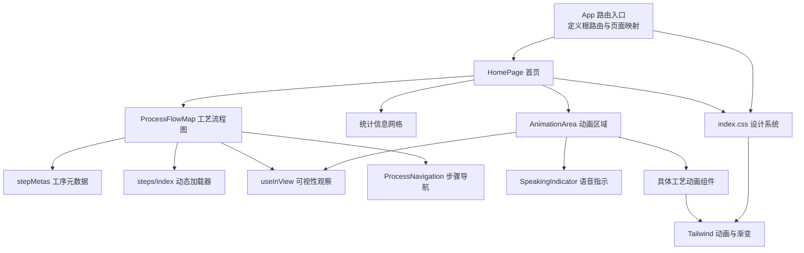
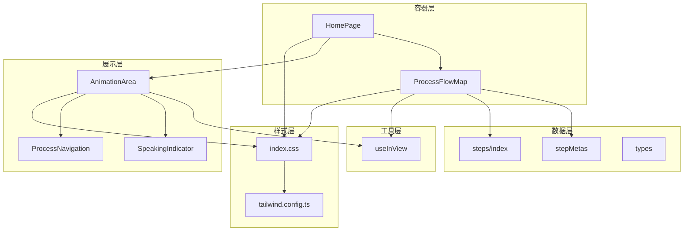
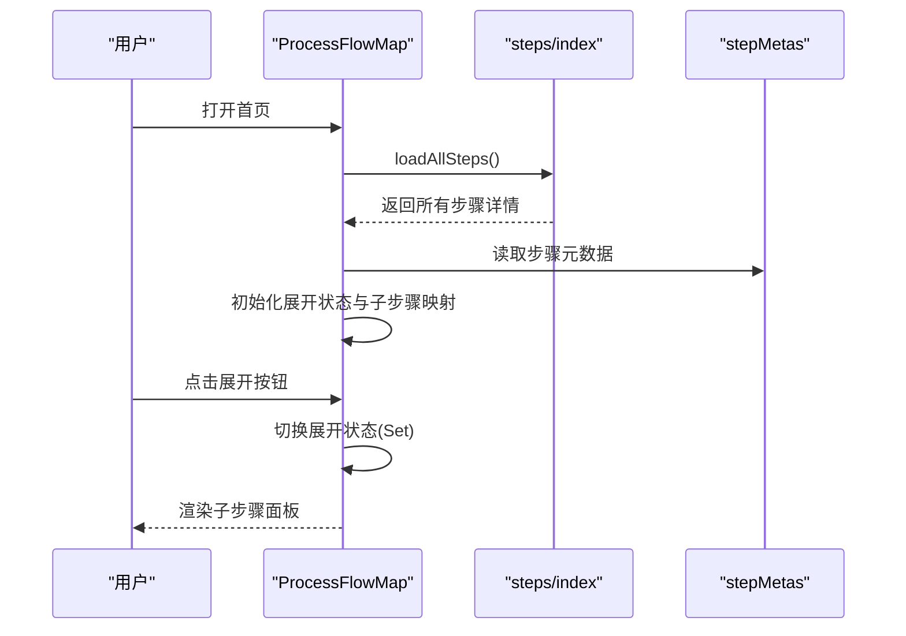
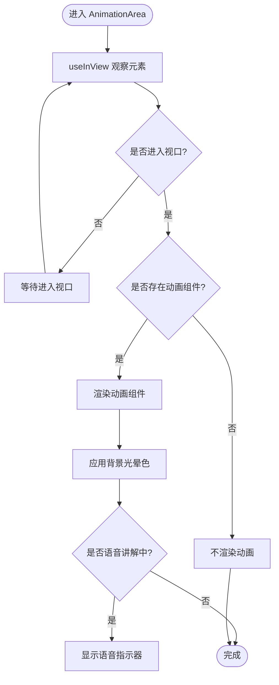
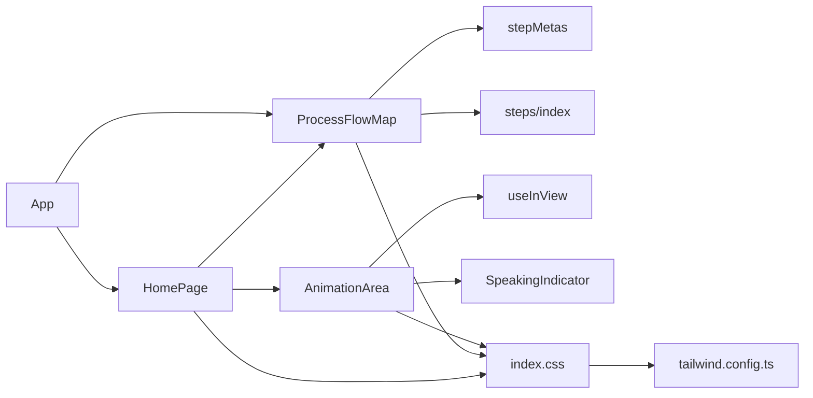

# 主页组件

<cite>
**本文引用的文件**
- [HomePage.tsx](file://src/components/layout/HomePage.tsx)
- [ProcessFlowMap.tsx](file://src/components/layout/ProcessFlowMap.tsx)
- [AnimationArea.tsx](file://src/components/ui/AnimationArea.tsx)
- [ProcessNavigation.tsx](file://src/components/ui/ProcessNavigation.tsx)
- [useInView.ts](file://src/hooks/useInView.ts)
- [SpeakingIndicator.tsx](file://src/components/ui/SpeakingIndicator.tsx)
- [stepMetas.ts](file://src/data/stepMetas.ts)
- [steps/index.ts](file://src/data/steps/index.ts)
- [types.ts](file://src/data/types.ts)
- [App.tsx](file://src/App.tsx)
- [index.css](file://src/index.css)
- [tailwind.config.ts](file://src/tailwind.config.ts)
- [CMP.tsx](file://src/components/process/CMP.tsx)
- [Photolithography.tsx](file://src/components/process/Photolithography.tsx)
</cite>

## 目录
1. [简介](#简介)
2. [项目结构](#项目结构)
3. [核心组件](#核心组件)
4. [架构总览](#架构总览)
5. [详细组件分析](#详细组件分析)
6. [依赖关系分析](#依赖关系分析)
7. [性能考量](#性能考量)
8. [故障排查指南](#故障排查指南)
9. [结论](#结论)
10. [附录](#附录)

## 简介
本文件为“主页组件”的技术文档，聚焦于芯片制造演示应用的首页（HomePage）整体架构与实现要点，涵盖：
- 英雄区域的视觉设计、渐变与背景光效
- 统计信息展示与交互元素布局
- 工艺流程图组件的集成与滚动导航
- 统计卡片的数据绑定、响应式网格布局与数字呈现
- 组件状态管理、路由集成与性能优化策略
- 设计规范与可复用模式说明

## 项目结构
首页位于布局组件目录下，配合流程图组件、动画区域组件、导航组件以及数据模型共同构成完整的主页体验。TailwindCSS 提供统一的设计系统与动画能力；路由在应用入口集中配置。

**图表来源**
- [App.tsx:1-23](file://src/App.tsx#L1-L23)
- [HomePage.tsx:1-85](file://src/components/layout/HomePage.tsx#L1-L85)
- [ProcessFlowMap.tsx:1-255](file://src/components/layout/ProcessFlowMap.tsx#L1-L255)
- [AnimationArea.tsx:1-29](file://src/components/ui/AnimationArea.tsx#L1-L29)
- [ProcessNavigation.tsx:1-67](file://src/components/ui/ProcessNavigation.tsx#L1-L67)
- [useInView.ts:1-32](file://src/hooks/useInView.ts#L1-L32)
- [SpeakingIndicator.tsx:1-28](file://src/components/ui/SpeakingIndicator.tsx#L1-L28)
- [stepMetas.ts:1-103](file://src/data/stepMetas.ts#L1-L103)
- [steps/index.ts:1-34](file://src/data/steps/index.ts#L1-L34)
- [index.css:1-142](file://src/index.css#L1-L142)
- [tailwind.config.ts:1-143](file://src/tailwind.config.ts#L1-L143)

**章节来源**
- [App.tsx:1-23](file://src/App.tsx#L1-L23)
- [HomePage.tsx:1-85](file://src/components/layout/HomePage.tsx#L1-L85)
- [index.css:1-142](file://src/index.css#L1-L142)
- [tailwind.config.ts:1-143](file://src/tailwind.config.ts#L1-L143)

## 核心组件
- 首页容器：负责英雄区、流程图、统计区与页脚的整体排布与视觉风格。
- 工艺流程图：以时间轴形式展示十大核心工艺，支持展开/收起子步骤，动态加载子步骤数据。
- 动画区域：基于可视性观察渲染特定工艺的 SVG 动画，并叠加语音讲解指示器。
- 进度导航：在流程图节点内提供“展开/收起”与“查看详情”的交互。
- 视口观察 Hook：统一处理进入视口时的过渡与懒加载行为。
- 数据模型：定义工序元数据与步骤详情的数据结构，支撑流程图与动画区域联动。

**章节来源**
- [HomePage.tsx:1-85](file://src/components/layout/HomePage.tsx#L1-L85)
- [ProcessFlowMap.tsx:1-255](file://src/components/layout/ProcessFlowMap.tsx#L1-L255)
- [AnimationArea.tsx:1-29](file://src/components/ui/AnimationArea.tsx#L1-L29)
- [ProcessNavigation.tsx:1-67](file://src/components/ui/ProcessNavigation.tsx#L1-L67)
- [useInView.ts:1-32](file://src/hooks/useInView.ts#L1-L32)
- [stepMetas.ts:1-103](file://src/data/stepMetas.ts#L1-L103)
- [steps/index.ts:1-34](file://src/data/steps/index.ts#L1-L34)
- [types.ts:1-33](file://src/data/types.ts#L1-L33)

## 架构总览
首页采用“容器-展示”分层：
- 容器层：HomePage 负责布局与数据聚合；ProcessFlowMap 负责流程图状态与数据加载。
- 展示层：AnimationArea 负责动画渲染与指示器显示；useInView 提供可访问性增强。
- 数据层：stepMetas 提供静态元数据；steps/index 提供按需异步加载的步骤详情。
- 样式层：index.css 定义主题变量、渐变与阴影；tailwind.config.ts 注入动画与关键帧。

**图表来源**
- [HomePage.tsx:1-85](file://src/components/layout/HomePage.tsx#L1-L85)
- [ProcessFlowMap.tsx:1-255](file://src/components/layout/ProcessFlowMap.tsx#L1-L255)
- [AnimationArea.tsx:1-29](file://src/components/ui/AnimationArea.tsx#L1-L29)
- [ProcessNavigation.tsx:1-67](file://src/components/ui/ProcessNavigation.tsx#L1-L67)
- [useInView.ts:1-32](file://src/hooks/useInView.ts#L1-L32)
- [stepMetas.ts:1-103](file://src/data/stepMetas.ts#L1-L103)
- [steps/index.ts:1-34](file://src/data/steps/index.ts#L1-L34)
- [types.ts:1-33](file://src/data/types.ts#L1-L33)
- [index.css:1-142](file://src/index.css#L1-L142)
- [tailwind.config.ts:1-143](file://src/tailwind.config.ts#L1-L143)

## 详细组件分析

### 英雄区域与背景光效
- 视觉设计
  - 渐变背景：使用 CSS 变量定义的渐变与阴影，营造深色科技感。
  - 渐变文字：标题采用文本渐变，提升层次与辨识度。
  - 背景光点：通过绝对定位的圆形模糊区域实现柔和光晕，增强沉浸感。
- 交互元素
  - 行动按钮：包含“开始探索”和“浏览流程”，分别跳转至首个工艺或锚点滚动。
  - 实心点提示：显示“在线讲解中”的状态，结合语音指示器组件。
- 响应式与无障碍
  - 使用语义化标题层级与最大宽度约束，保证移动端阅读体验。
  - 通过 CSS 变量与暗色模式适配，尊重用户偏好。

**章节来源**
- [HomePage.tsx:10-49](file://src/components/layout/HomePage.tsx#L10-L49)
- [index.css:69-116](file://src/index.css#L69-L116)
- [tailwind.config.ts:67-136](file://src/tailwind.config.ts#L67-L136)

### 工艺流程图组件（ProcessFlowMap）
- 结构与职责
  - 时间轴节点：每个节点包含图标、名称、英文名、描述与展开按钮。
  - 子步骤面板：点击展开后，异步加载并渲染子步骤列表。
  - 悬停光晕：卡片悬停时显示径向光晕，增强交互反馈。
  - 动画入场：节点进入视口后按序出现，带延迟与平滑过渡。
- 状态管理
  - 展开状态：使用 Set 记录当前展开的步骤 ID。
  - 子步骤缓存：首次加载后缓存子步骤映射，避免重复请求。
- 数据绑定
  - 元数据来源：stepMetas 提供颜色、光晕色、图标等视觉属性。
  - 动态加载：steps/index 提供按需加载，保持首屏性能。
- 可视性与性能
  - useInView 在阈值与偏移量上统一配置，减少不必要的渲染。
  - 节点入场动画采用 CSS 过渡与延迟，避免同步触发造成抖动。

**图表来源**
- [ProcessFlowMap.tsx:200-255](file://src/components/layout/ProcessFlowMap.tsx#L200-L255)
- [steps/index.ts:23-33](file://src/data/steps/index.ts#L23-L33)
- [stepMetas.ts:1-103](file://src/data/stepMetas.ts#L1-L103)

**章节来源**
- [ProcessFlowMap.tsx:1-255](file://src/components/layout/ProcessFlowMap.tsx#L1-L255)
- [stepMetas.ts:1-103](file://src/data/stepMetas.ts#L1-L103)
- [steps/index.ts:1-34](file://src/data/steps/index.ts#L1-L34)
- [useInView.ts:1-32](file://src/hooks/useInView.ts#L1-L32)

### 动画区域组件（AnimationArea）
- 功能概述
  - 基于 useInView 的可见性判断，仅在进入视口时渲染动画组件，降低首屏负担。
  - 支持传入“光晕色”用于背景径向渐变，与工艺主题色一致。
  - 当处于“语音讲解中”状态时，叠加语音指示器。
- 关键实现
  - 可视性观察：阈值与根边距默认配置，兼顾性能与体验。
  - 条件渲染：进入视口且存在动画组件时才挂载，避免空渲染。
  - 背景光晕：使用径向渐变与 CSS 变量，确保与主题一致。

**图表来源**
- [AnimationArea.tsx:11-28](file://src/components/ui/AnimationArea.tsx#L11-L28)
- [useInView.ts:8-31](file://src/hooks/useInView.ts#L8-L31)
- [SpeakingIndicator.tsx:1-28](file://src/components/ui/SpeakingIndicator.tsx#L1-L28)

**章节来源**
- [AnimationArea.tsx:1-29](file://src/components/ui/AnimationArea.tsx#L1-L29)
- [useInView.ts:1-32](file://src/hooks/useInView.ts#L1-L32)
- [SpeakingIndicator.tsx:1-28](file://src/components/ui/SpeakingIndicator.tsx#L1-L28)

### 统计信息展示与网格布局
- 数据绑定
  - 静态数组直接映射为网格项，包含数值、单位与说明文案。
  - 数字与单位组合展示，突出关键指标。
- 响应式网格
  - 使用 CSS Grid 与断点，小屏两列、中屏四列，保证信息密度与可读性。
- 视觉强调
  - 数值采用渐变文字，弱化单位，形成对比层次。
  - 说明文案使用次级文字色，避免喧宾夺主。

**章节来源**
- [HomePage.tsx:54-74](file://src/components/layout/HomePage.tsx#L54-L74)
- [index.css:69-79](file://src/index.css#L69-L79)

### 滚动导航与锚点跳转
- 锚点设计
  - “浏览流程”按钮通过锚点跳转到流程图区域，提升页面内导航效率。
- 导航组件
  - 在流程图节点内部提供“上一步/下一步”导航，支持返回首页或完成流程。

**章节来源**
- [HomePage.tsx:40-47](file://src/components/layout/HomePage.tsx#L40-L47)
- [ProcessFlowMap.tsx:144-159](file://src/components/layout/ProcessFlowMap.tsx#L144-L159)
- [ProcessNavigation.tsx:14-66](file://src/components/ui/ProcessNavigation.tsx#L14-L66)

### 路由集成与页面入口
- 应用路由
  - 根路由指向 HomePage；工艺详情路由通过动态参数传递步骤 ID。
- 页面入口
  - App 组件包裹 BrowserRouter，集中注册路由与导航栏。

**章节来源**
- [App.tsx:1-23](file://src/App.tsx#L1-L23)

## 依赖关系分析
- 组件耦合
  - HomePage 与 ProcessFlowMap 通过数据与交互松耦合：前者负责布局，后者负责状态与数据。
  - AnimationArea 与 useInView 解耦，便于在其他区域复用。
- 外部依赖
  - TailwindCSS 提供原子类与动画系统，减少自定义样式成本。
  - 路由库提供页面切换与参数解析。
- 循环依赖
  - 未发现循环导入；数据加载通过动态 import 分离模块边界。

**图表来源**
- [HomePage.tsx:1-85](file://src/components/layout/HomePage.tsx#L1-L85)
- [ProcessFlowMap.tsx:1-255](file://src/components/layout/ProcessFlowMap.tsx#L1-L255)
- [AnimationArea.tsx:1-29](file://src/components/ui/AnimationArea.tsx#L1-L29)
- [useInView.ts:1-32](file://src/hooks/useInView.ts#L1-L32)
- [SpeakingIndicator.tsx:1-28](file://src/components/ui/SpeakingIndicator.tsx#L1-L28)
- [stepMetas.ts:1-103](file://src/data/stepMetas.ts#L1-L103)
- [steps/index.ts:1-34](file://src/data/steps/index.ts#L1-L34)
- [index.css:1-142](file://src/index.css#L1-L142)
- [tailwind.config.ts:1-143](file://src/tailwind.config.ts#L1-L143)
- [App.tsx:1-23](file://src/App.tsx#L1-L23)

**章节来源**
- [App.tsx:1-23](file://src/App.tsx#L1-L23)
- [HomePage.tsx:1-85](file://src/components/layout/HomePage.tsx#L1-L85)
- [ProcessFlowMap.tsx:1-255](file://src/components/layout/ProcessFlowMap.tsx#L1-L255)
- [AnimationArea.tsx:1-29](file://src/components/ui/AnimationArea.tsx#L1-L29)
- [useInView.ts:1-32](file://src/hooks/useInView.ts#L1-L32)
- [SpeakingIndicator.tsx:1-28](file://src/components/ui/SpeakingIndicator.tsx#L1-L28)
- [stepMetas.ts:1-103](file://src/data/stepMetas.ts#L1-L103)
- [steps/index.ts:1-34](file://src/data/steps/index.ts#L1-L34)
- [index.css:1-142](file://src/index.css#L1-L142)
- [tailwind.config.ts:1-143](file://src/tailwind.config.ts#L1-L143)

## 性能考量
- 懒加载与按需渲染
  - 动画区域仅在进入视口时渲染，显著降低首屏计算压力。
  - 工序子步骤通过动态 import 与缓存，避免重复请求。
- 动画与过渡
  - 使用 CSS 动画与过渡，避免 JavaScript 驱动的高频重绘。
  - 通过延迟与阈值控制，减少同时触发的动画数量。
- 可访问性
  - 尊重“减少动态效果”偏好设置，将动画时长降至极短以保持可用性。
- 样式与主题
  - 使用 CSS 变量与 Tailwind 自定义，统一主题与动画，减少重复定义。

**章节来源**
- [AnimationArea.tsx:11-28](file://src/components/ui/AnimationArea.tsx#L11-L28)
- [ProcessFlowMap.tsx:65-81](file://src/components/layout/ProcessFlowMap.tsx#L65-L81)
- [useInView.ts:15-28](file://src/hooks/useInView.ts#L15-L28)
- [index.css:133-141](file://src/index.css#L133-L141)
- [tailwind.config.ts:121-136](file://src/tailwind.config.ts#L121-L136)

## 故障排查指南
- 动画未显示
  - 检查 AnimationArea 是否处于可视区域；确认 useInView 阈值与根边距配置。
  - 确认传入的动画组件是否有效，且 key 发生变化以强制重新渲染。
- 流程图子步骤不显示
  - 确认 steps/index 的动态导入路径与模块导出一致。
  - 检查首次加载是否成功写入子步骤映射，避免空渲染。
- 锚点跳转无效
  - 确认目标区域的 id 与链接的 href 对应。
  - 检查容器滚动区域是否正确，必要时添加滚动容器样式。
- 语音指示器不出现
  - 确认 isSpeaking 状态已传递给 AnimationArea。
  - 检查 SpeakingIndicator 的样式与定位，避免被裁剪或遮挡。

**章节来源**
- [AnimationArea.tsx:11-28](file://src/components/ui/AnimationArea.tsx#L11-L28)
- [ProcessFlowMap.tsx:204-213](file://src/components/layout/ProcessFlowMap.tsx#L204-L213)
- [steps/index.ts:3-21](file://src/data/steps/index.ts#L3-L21)
- [HomePage.tsx:40-47](file://src/components/layout/HomePage.tsx#L40-L47)
- [SpeakingIndicator.tsx:1-28](file://src/components/ui/SpeakingIndicator.tsx#L1-L28)

## 结论
主页组件通过清晰的分层与可复用的工具（如 useInView），在保证视觉一致性的同时实现了良好的性能与可维护性。流程图与动画区域的解耦设计，使得内容扩展与主题定制更加灵活。建议后续在数据层引入缓存策略与错误边界，进一步提升稳定性与用户体验。

## 附录
- 设计规范与最佳实践
  - 使用 CSS 变量统一主题色与渐变，避免硬编码。
  - 优先使用 Tailwind 原子类与自定义动画，减少额外样式文件。
  - 为关键交互提供明确的视觉反馈（光晕、阴影、过渡）。
  - 保持响应式断点与网格布局的一致性，确保跨设备体验。
- 示例参考
  - 英雄区与渐变：[HomePage.tsx:10-49](file://src/components/layout/HomePage.tsx#L10-L49)、[index.css:69-116](file://src/index.css#L69-L116)
  - 流程图展开与加载：[ProcessFlowMap.tsx:200-255](file://src/components/layout/ProcessFlowMap.tsx#L200-L255)、[steps/index.ts:23-33](file://src/data/steps/index.ts#L23-L33)
  - 动画区域与语音指示器：[AnimationArea.tsx:11-28](file://src/components/ui/AnimationArea.tsx#L11-L28)、[SpeakingIndicator.tsx:1-28](file://src/components/ui/SpeakingIndicator.tsx#L1-L28)
  - 动画示例（CMP 与光刻）：[CMP.tsx:1-125](file://src/components/process/CMP.tsx#L1-L125)、[Photolithography.tsx:1-136](file://src/components/process/Photolithography.tsx#L1-L136)