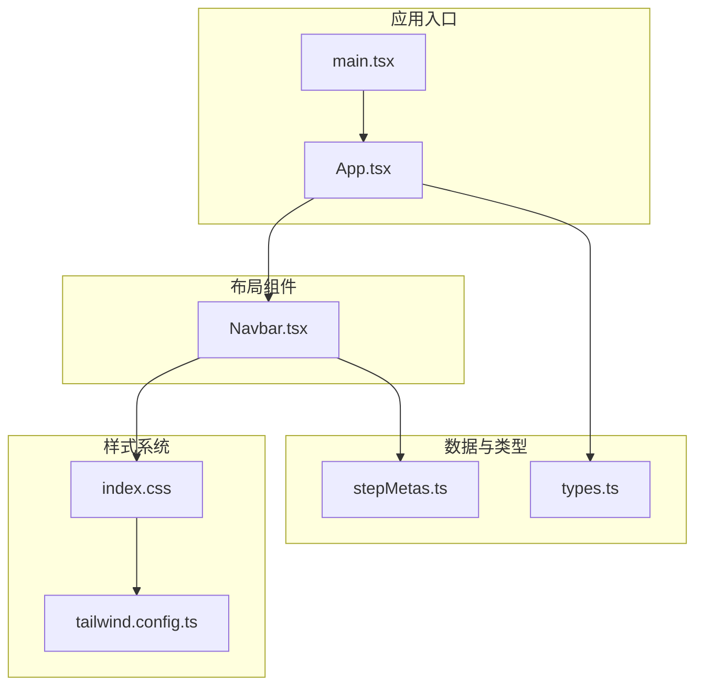
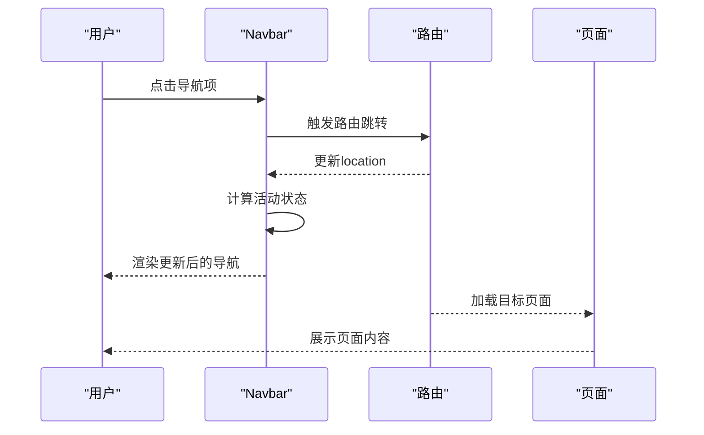
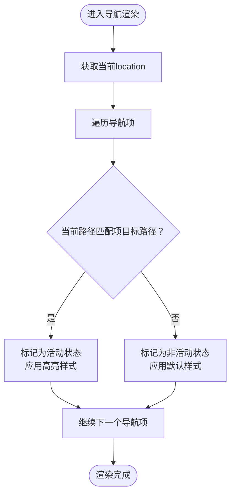
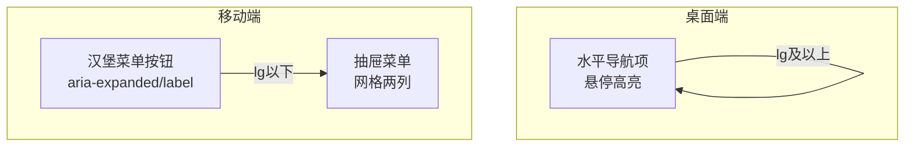
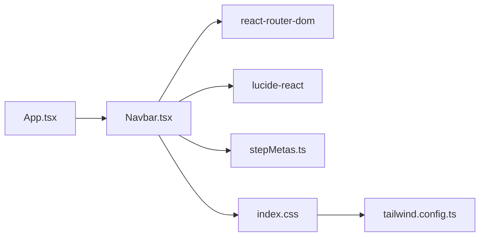

# 导航栏组件

<cite>
**本文档引用的文件**
- [Navbar.tsx](file://src/components/layout/Navbar.tsx)
- [App.tsx](file://src/App.tsx)
- [main.tsx](file://src/main.tsx)
- [index.css](file://src/index.css)
- [stepMetas.ts](file://src/data/stepMetas.ts)
- [tailwind.config.ts](file://tailwind.config.ts)
- [ProcessDetailPage.tsx](file://src/components/layout/ProcessDetailPage.tsx)
- [ProcessNavigation.tsx](file://src/components/ui/ProcessNavigation.tsx)
- [types.ts](file://src/data/types.ts)
- [package.json](file://package.json)
</cite>

## 目录
1. [简介](#简介)
2. [项目结构](#项目结构)
3. [核心组件](#核心组件)
4. [架构总览](#架构总览)
5. [详细组件分析](#详细组件分析)
6. [依赖关系分析](#依赖关系分析)
7. [性能考量](#性能考量)
8. [故障排除指南](#故障排除指南)
9. [结论](#结论)
10. [附录](#附录)

## 简介
本文件为导航栏组件的详细技术文档，聚焦于导航栏的实现架构、响应式设计、路由集成与用户交互处理。文档将深入解析导航项的配置方式、活动状态管理与视觉反馈机制，并阐述在不同屏幕尺寸下的适配策略与移动端优化方案。同时提供组件属性接口、事件处理与样式定制说明，包含无障碍访问与SEO优化建议，以及最佳实践指导与实际代码示例路径。

## 项目结构
导航栏组件位于布局层，作为应用顶层导航入口，配合路由系统实现页面间跳转与活动状态同步。其样式基于Tailwind CSS与自定义CSS变量，结合渐变、发光与过渡动画提升视觉体验。

图表来源
- [main.tsx:1-11](file://src/main.tsx#L1-L11)
- [App.tsx:1-23](file://src/App.tsx#L1-L23)
- [Navbar.tsx:1-82](file://src/components/layout/Navbar.tsx#L1-L82)
- [stepMetas.ts:1-103](file://src/data/stepMetas.ts#L1-L103)
- [index.css:1-142](file://src/index.css#L1-L142)
- [tailwind.config.ts:1-143](file://tailwind.config.ts#L1-L143)

章节来源
- [main.tsx:1-11](file://src/main.tsx#L1-L11)
- [App.tsx:1-23](file://src/App.tsx#L1-L23)
- [Navbar.tsx:1-82](file://src/components/layout/Navbar.tsx#L1-L82)
- [index.css:1-142](file://src/index.css#L1-L142)
- [tailwind.config.ts:1-143](file://tailwind.config.ts#L1-L143)

## 核心组件
- 导航栏组件：负责渲染桌面端与移动端导航项、活动状态高亮、移动端菜单开关与无障碍属性设置。
- 应用根组件：配置路由容器与页面路由映射，确保导航栏与页面路由联动。
- 数据源：导航项来源于统一的步骤元数据集合，保证导航与内容一致。
- 样式系统：基于Tailwind CSS与自定义CSS变量，提供主题色、渐变、发光与动画能力。

章节来源
- [Navbar.tsx:6-82](file://src/components/layout/Navbar.tsx#L6-L82)
- [App.tsx:7-20](file://src/App.tsx#L7-L20)
- [stepMetas.ts:11-102](file://src/data/stepMetas.ts#L11-L102)
- [index.css:5-51](file://src/index.css#L5-L51)

## 架构总览
导航栏采用“数据驱动 + 路由集成”的架构模式：
- 数据驱动：导航项由统一的数据模型生成，确保一致性与可维护性。
- 路由集成：通过路由钩子读取当前路径，动态计算活动状态。
- 响应式设计：桌面端与移动端分别渲染不同结构，移动端使用抽屉式菜单。
- 视觉反馈：通过类名切换与CSS变量实现高亮、发光与过渡效果。

图表来源
- [Navbar.tsx:7-8](file://src/components/layout/Navbar.tsx#L7-L8)
- [App.tsx:12-16](file://src/App.tsx#L12-L16)

## 详细组件分析

### 组件职责与接口
- 组件名称：Navbar
- 主要职责：
  - 渲染品牌标识与标题
  - 生成导航项列表（桌面端）
  - 渲染移动端抽屉菜单
  - 基于当前路由计算活动状态
  - 处理移动端菜单开关与无障碍属性
- 外部依赖：
  - 路由：react-router-dom 的 Link 与 useLocation
  - 图标：lucide-react 的 Menu、X、Cpu
  - 数据：processStepMetas（步骤元数据）
  - 样式：Tailwind CSS 类与自定义CSS变量

章节来源
- [Navbar.tsx:1-82](file://src/components/layout/Navbar.tsx#L1-L82)
- [stepMetas.ts:11-102](file://src/data/stepMetas.ts#L11-L102)

### 活动状态管理
- 计算逻辑：根据当前路径与每个导航项的目标路径进行比较，确定是否为活动状态。
- 样式切换：活动项使用特定背景、文字颜色与发光阴影，非活动项在悬停时切换为浅色背景与前景色。
- 动态更新：当路由变化时，组件通过路由钩子重新计算并更新UI。

图表来源
- [Navbar.tsx:23-40](file://src/components/layout/Navbar.tsx#L23-L40)
- [Navbar.tsx:58-77](file://src/components/layout/Navbar.tsx#L58-L77)

章节来源
- [Navbar.tsx:23-40](file://src/components/layout/Navbar.tsx#L23-L40)
- [Navbar.tsx:58-77](file://src/components/layout/Navbar.tsx#L58-L77)

### 响应式设计与移动端优化
- 断点策略：lg（1024px）及以上为桌面端，lg以下为移动端。
- 桌面端：水平排列导航项，支持悬停高亮与过渡动画。
- 移动端：显示汉堡菜单按钮，点击展开抽屉式网格菜单，支持两列布局与紧凑间距。
- 无障碍：按钮设置 aria-expanded、aria-controls 与 aria-label；图标设置 aria-hidden。

图表来源
- [Navbar.tsx:22-40](file://src/components/layout/Navbar.tsx#L22-L40)
- [Navbar.tsx:43-51](file://src/components/layout/Navbar.tsx#L43-L51)
- [Navbar.tsx:55-78](file://src/components/layout/Navbar.tsx#L55-L78)

章节来源
- [Navbar.tsx:22-40](file://src/components/layout/Navbar.tsx#L22-L40)
- [Navbar.tsx:43-51](file://src/components/layout/Navbar.tsx#L43-L51)
- [Navbar.tsx:55-78](file://src/components/layout/Navbar.tsx#L55-L78)

### 视觉反馈与样式定制
- 主题色与渐变：通过CSS变量定义主色、次色、渐变与发光阴影，导航项高亮使用主色与发光效果。
- 过渡动画：统一的过渡时长与缓动函数，确保交互流畅。
- 发光与阴影：活动项与悬停态使用发光阴影增强视觉层次。
- 自定义样式：可通过修改CSS变量与Tailwind扩展主题来自定义导航外观。

章节来源
- [index.css:5-51](file://src/index.css#L5-L51)
- [index.css:69-141](file://src/index.css#L69-L141)
- [tailwind.config.ts:18-136](file://tailwind.config.ts#L18-L136)

### 路由集成与页面联动
- 路由容器：应用根组件包裹 BrowserRouter，定义首页与工艺详情页路由。
- 导航项目标：导航项指向 /process/:id，与路由参数绑定。
- 页面联动：工艺详情页同样使用导航项数据生成步骤指示器，保持导航一致性。

章节来源
- [App.tsx:9-19](file://src/App.tsx#L9-L19)
- [App.tsx:12-16](file://src/App.tsx#L12-L16)
- [ProcessDetailPage.tsx:236-255](file://src/components/layout/ProcessDetailPage.tsx#L236-L255)

### 无障碍访问与SEO优化
- 无障碍：
  - 品牌链接设置 aria-label 提升屏幕阅读器可用性。
  - 移动端菜单按钮设置 aria-expanded、aria-controls 与 aria-label。
  - 图标设置 aria-hidden，避免重复语义。
- SEO：
  - 使用语义化的HTML结构与Link组件，利于搜索引擎抓取。
  - 导航项文本清晰表达步骤名称，便于索引与理解。

章节来源
- [Navbar.tsx:13-19](file://src/components/layout/Navbar.tsx#L13-L19)
- [Navbar.tsx:46-48](file://src/components/layout/Navbar.tsx#L46-L48)
- [Navbar.tsx:50](file://src/components/layout/Navbar.tsx#L50)

### 最佳实践与使用建议
- 导航项配置：通过统一的数据模型扩展或删除导航项，确保与路由与页面内容一致。
- 样式定制：优先通过CSS变量与Tailwind扩展主题进行定制，避免硬编码样式。
- 性能优化：导航项数量较多时，可考虑虚拟滚动或分页展示。
- 可访问性：始终为交互元素提供明确的标签与状态提示，确保键盘与屏幕阅读器友好。

章节来源
- [stepMetas.ts:11-102](file://src/data/stepMetas.ts#L11-L102)
- [index.css:5-51](file://src/index.css#L5-L51)
- [tailwind.config.ts:18-136](file://tailwind.config.ts#L18-L136)

## 依赖关系分析
导航栏组件的依赖关系如下：
- 组件依赖：react-router-dom（Link、useLocation）、lucide-react（Menu、X、Cpu）、processStepMetas（数据源）。
- 样式依赖：Tailwind CSS、自定义CSS变量与动画扩展。
- 应用依赖：App.tsx中的路由配置确保导航与页面联动。

图表来源
- [Navbar.tsx:1-4](file://src/components/layout/Navbar.tsx#L1-L4)
- [App.tsx:1-6](file://src/App.tsx#L1-L6)
- [index.css:1-3](file://src/index.css#L1-L3)
- [tailwind.config.ts:1-8](file://tailwind.config.ts#L1-L8)

章节来源
- [Navbar.tsx:1-4](file://src/components/layout/Navbar.tsx#L1-L4)
- [App.tsx:1-6](file://src/App.tsx#L1-L6)
- [index.css:1-3](file://src/index.css#L1-L3)
- [tailwind.config.ts:1-8](file://tailwind.config.ts#L1-L8)

## 性能考量
- 渲染开销：导航项数量有限，渲染成本低；若未来扩展至数百项，建议采用虚拟化或分页。
- 路由更新：useLocation每次路由变化触发重渲染，但仅影响导航区域，整体性能影响可控。
- 样式开销：使用CSS变量与Tailwind工具类，减少内联样式的计算与重排。
- 动画偏好：尊重用户减少动画的偏好设置，避免不必要的动画影响性能。

章节来源
- [index.css:134-140](file://src/index.css#L134-L140)

## 故障排除指南
- 导航项不显示或显示异常：
  - 检查数据源是否正确导入与导出。
  - 确认路由参数与导航项目标路径一致。
- 活动状态不更新：
  - 确认 useLocation 返回的路径与导航项目标路径匹配规则。
  - 检查路由容器是否正确包裹应用。
- 移动端菜单无法展开：
  - 检查移动端断点与按钮事件绑定。
  - 确认 aria-expanded 与 aria-controls 是否正确设置。
- 样式不生效：
  - 检查 Tailwind 配置与 CSS 变量是否正确加载。
  - 确认类名拼写与 Tailwind 扩展主题配置。

章节来源
- [Navbar.tsx:7-8](file://src/components/layout/Navbar.tsx#L7-L8)
- [App.tsx:9-19](file://src/App.tsx#L9-L19)
- [stepMetas.ts:11-102](file://src/data/stepMetas.ts#L11-L102)
- [tailwind.config.ts:18-136](file://tailwind.config.ts#L18-L136)

## 结论
导航栏组件通过数据驱动与路由集成实现了高度一致的用户体验，配合响应式设计与丰富的视觉反馈，在桌面端与移动端均提供了良好的可访问性与性能表现。通过统一的数据模型与样式体系，开发者可以轻松扩展导航项、定制外观并保持一致的交互体验。

## 附录
- 实际代码示例路径（不含具体代码内容）：
  - 导航栏实现：[Navbar.tsx:6-82](file://src/components/layout/Navbar.tsx#L6-L82)
  - 应用路由配置：[App.tsx:7-20](file://src/App.tsx#L7-L20)
  - 样式与主题：[index.css:5-51](file://src/index.css#L5-L51)、[tailwind.config.ts:18-136](file://tailwind.config.ts#L18-L136)
  - 导航项数据模型：[stepMetas.ts:11-102](file://src/data/stepMetas.ts#L11-L102)
  - 页面联动与步骤指示器：[ProcessDetailPage.tsx:236-255](file://src/components/layout/ProcessDetailPage.tsx#L236-L255)
  - 依赖声明：[package.json:15-24](file://package.json#L15-L24)