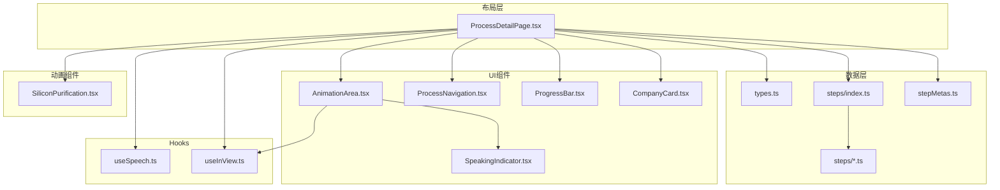
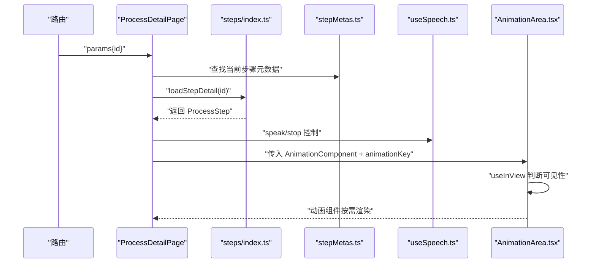
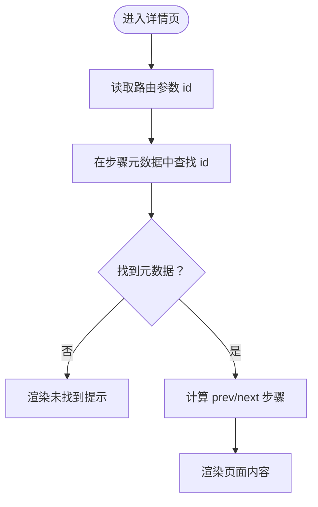
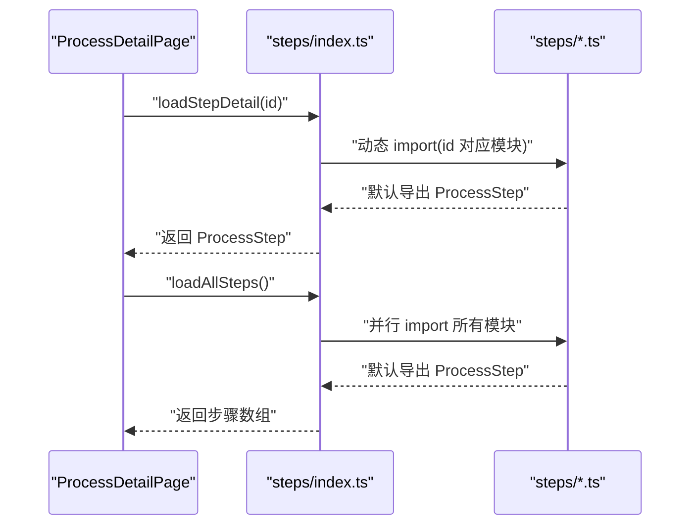
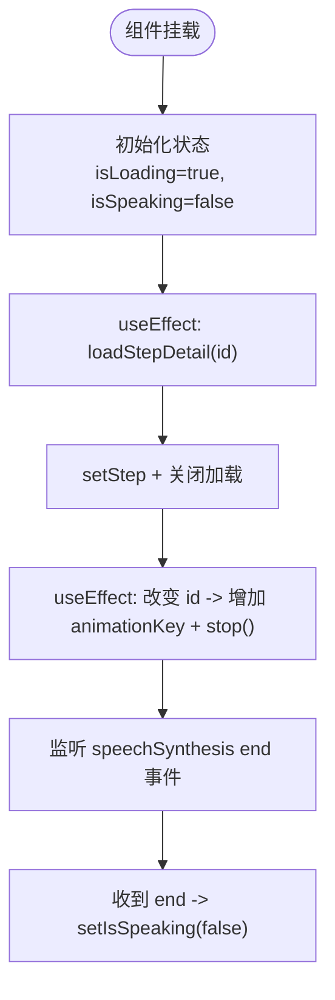
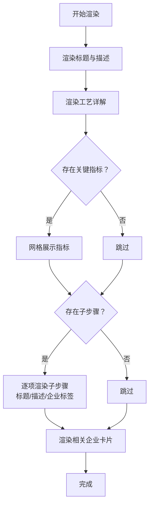
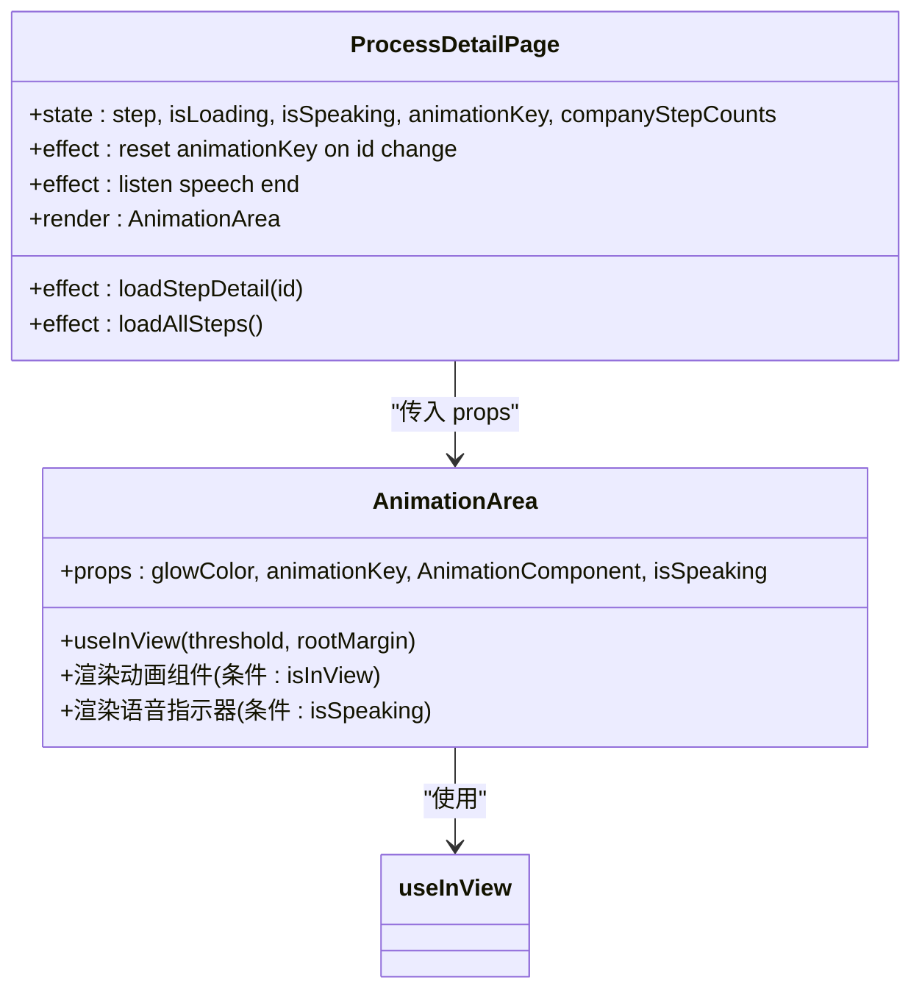
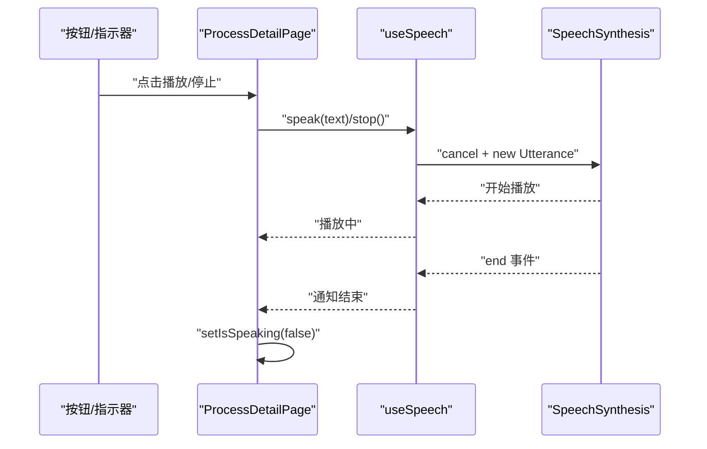
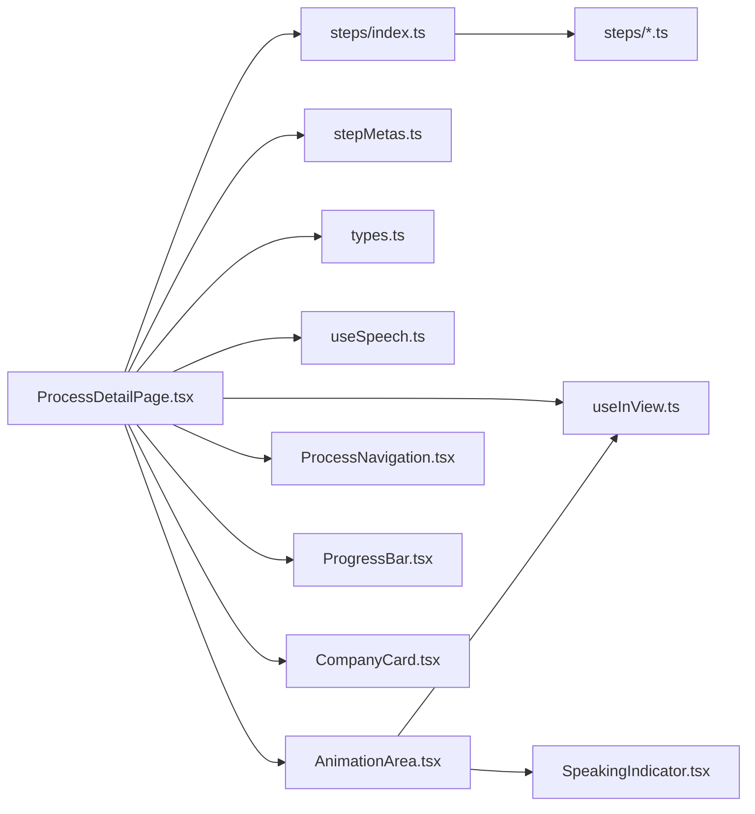

# 工艺详情页组件

<cite>
**本文档引用的文件**
- [ProcessDetailPage.tsx](file://src/components/layout/ProcessDetailPage.tsx)
- [types.ts](file://src/data/types.ts)
- [useSpeech.ts](file://src/hooks/useSpeech.ts)
- [useInView.ts](file://src/hooks/useInView.ts)
- [index.ts](file://src/data/steps/index.ts)
- [stepMetas.ts](file://src/data/stepMetas.ts)
- [AnimationArea.tsx](file://src/components/ui/AnimationArea.tsx)
- [ProcessNavigation.tsx](file://src/components/ui/ProcessNavigation.tsx)
- [ProgressBar.tsx](file://src/components/ui/ProgressBar.tsx)
- [SiliconPurification.tsx](file://src/components/process/SiliconPurification.tsx)
- [SpeakingIndicator.tsx](file://src/components/ui/SpeakingIndicator.tsx)
- [CompanyCard.tsx](file://src/components/ui/CompanyCard.tsx)
- [silicon-purification.ts](file://src/data/steps/silicon-purification.ts)
</cite>

## 目录
1. [简介](#简介)
2. [项目结构](#项目结构)
3. [核心组件](#核心组件)
4. [架构总览](#架构总览)
5. [详细组件分析](#详细组件分析)
6. [依赖关系分析](#依赖关系分析)
7. [性能考虑](#性能考虑)
8. [故障排查指南](#故障排查指南)
9. [结论](#结论)
10. [附录](#附录)

## 简介
本文件针对“工艺详情页”组件进行系统性技术文档梳理，重点覆盖：
- 动态路由参数处理与页面导航
- 数据加载机制与模块化拆分
- 组件生命周期管理与状态同步
- 步骤详情渲染逻辑与子步骤展示
- 动画集成与视口可见性控制
- 错误边界与加载状态管理
- 语音讲解功能集成、状态同步与交互响应
- 组件接口设计与数据格式规范
- 性能监控与调试技巧

## 项目结构
该组件位于布局层，负责聚合数据、动画、导航与交互控制，整体采用“按步骤模块化”的数据组织方式，配合轻量 Hook 实现语音与视口监听能力。

图表来源
- [ProcessDetailPage.tsx:36-396](file://src/components/layout/ProcessDetailPage.tsx#L36-L396)
- [index.ts:16-33](file://src/data/steps/index.ts#L16-L33)
- [stepMetas.ts:11-102](file://src/data/stepMetas.ts#L11-L102)
- [types.ts:19-32](file://src/data/types.ts#L19-L32)
- [AnimationArea.tsx:11-28](file://src/components/ui/AnimationArea.tsx#L11-L28)
- [ProcessNavigation.tsx:14-66](file://src/components/ui/ProcessNavigation.tsx#L14-L66)
- [ProgressBar.tsx:8-59](file://src/components/ui/ProgressBar.tsx#L8-L59)
- [useSpeech.ts:64-134](file://src/hooks/useSpeech.ts#L64-L134)
- [useInView.ts:8-31](file://src/hooks/useInView.ts#L8-L31)
- [SiliconPurification.tsx:1-114](file://src/components/process/SiliconPurification.tsx#L1-L114)
- [SpeakingIndicator.tsx:3-27](file://src/components/ui/SpeakingIndicator.tsx#L3-L27)
- [CompanyCard.tsx:9-158](file://src/components/ui/CompanyCard.tsx#L9-L158)

章节来源
- [ProcessDetailPage.tsx:1-397](file://src/components/layout/ProcessDetailPage.tsx#L1-L397)
- [index.ts:1-34](file://src/data/steps/index.ts#L1-L34)
- [stepMetas.ts:1-103](file://src/data/stepMetas.ts#L1-L103)
- [types.ts:1-33](file://src/data/types.ts#L1-L33)

## 核心组件
- 工艺详情页主组件：负责路由参数解析、数据加载、动画与语音控制、导航与进度条渲染。
- 动画区域组件：根据视口可见性与动画键值控制动画组件挂载与重播。
- 语音 Hook：封装 Web Speech API 的语音选择、播放与停止逻辑。
- 视口监听 Hook：基于 IntersectionObserver 判断元素是否进入视口。
- 进度条与导航组件：提供步骤进度可视化与前后跳转。
- 公司卡片组件：按标签分类展示相关企业信息。

章节来源
- [ProcessDetailPage.tsx:36-396](file://src/components/layout/ProcessDetailPage.tsx#L36-L396)
- [AnimationArea.tsx:11-28](file://src/components/ui/AnimationArea.tsx#L11-L28)
- [useSpeech.ts:64-134](file://src/hooks/useSpeech.ts#L64-L134)
- [useInView.ts:8-31](file://src/hooks/useInView.ts#L8-L31)
- [ProgressBar.tsx:8-59](file://src/components/ui/ProgressBar.tsx#L8-L59)
- [ProcessNavigation.tsx:14-66](file://src/components/ui/ProcessNavigation.tsx#L14-L66)
- [CompanyCard.tsx:9-158](file://src/components/ui/CompanyCard.tsx#L9-L158)

## 架构总览
工艺详情页采用“数据懒加载 + 模块化动画 + Hook 能力复用”的架构模式：
- 路由参数驱动：通过 useParams 获取步骤 id，映射到步骤元数据与动画组件。
- 数据加载：按需异步加载当前步骤详情与全量步骤用于统计。
- 动画控制：通过 animationKey 与 useInView 控制动画组件的挂载与重播。
- 语音控制：useSpeech 提供语音选择、播放与停止，状态与 UI 同步。
- 导航与进度：基于步骤元数据计算当前位置与进度条。

图表来源
- [ProcessDetailPage.tsx:37-108](file://src/components/layout/ProcessDetailPage.tsx#L37-L108)
- [index.ts:16-21](file://src/data/steps/index.ts#L16-L21)
- [stepMetas.ts:11-102](file://src/data/stepMetas.ts#L11-L102)
- [useSpeech.ts:74-112](file://src/hooks/useSpeech.ts#L74-L112)
- [AnimationArea.tsx:11-28](file://src/components/ui/AnimationArea.tsx#L11-L28)

## 详细组件分析

### 动态路由参数处理与页面导航
- 参数解析：使用 useParams 获取 id，作为步骤标识。
- 元数据匹配：通过 processStepMetas 查找当前步骤，计算前一步与后一步。
- 导航组件：根据是否存在前/后步骤决定显示“上一步/下一步”或“返回首页”。

图表来源
- [ProcessDetailPage.tsx:37-55](file://src/components/layout/ProcessDetailPage.tsx#L37-L55)
- [stepMetas.ts:11-102](file://src/data/stepMetas.ts#L11-L102)
- [ProcessNavigation.tsx:14-66](file://src/components/ui/ProcessNavigation.tsx#L14-L66)

章节来源
- [ProcessDetailPage.tsx:37-55](file://src/components/layout/ProcessDetailPage.tsx#L37-L55)
- [ProcessNavigation.tsx:14-66](file://src/components/ui/ProcessNavigation.tsx#L14-L66)

### 数据加载机制与模块化拆分
- 当前步骤详情：通过 loadStepDetail(id) 按 id 动态导入对应模块，返回 ProcessStep。
- 全量步骤统计：loadAllSteps 并行加载所有步骤，统计各企业参与步骤次数，用于公司卡片展示。
- 数据结构：ProcessStep 包含名称、描述、图标、颜色、关键指标、子步骤与企业列表等字段。

图表来源
- [ProcessDetailPage.tsx:60-80](file://src/components/layout/ProcessDetailPage.tsx#L60-L80)
- [index.ts:16-33](file://src/data/steps/index.ts#L16-L33)
- [types.ts:19-32](file://src/data/types.ts#L19-L32)

章节来源
- [ProcessDetailPage.tsx:60-80](file://src/components/layout/ProcessDetailPage.tsx#L60-L80)
- [index.ts:16-33](file://src/data/steps/index.ts#L16-L33)
- [types.ts:19-32](file://src/data/types.ts#L19-L32)

### 组件生命周期管理与状态同步
- 加载状态：首次进入时设置 isLoading，数据加载完成后关闭。
- 动画重置：当路由 id 变化时，增加 animationKey 并停止语音，确保动画重新渲染。
- 语音结束监听：监听 window.speechSynthesis 的 end 事件，自动更新 isSpeaking 状态。
- 子步骤企业映射：基于 step.companies 建立 nameEn → 公司对象的 Map，用于子步骤 companyRefs 解析。

图表来源
- [ProcessDetailPage.tsx:60-108](file://src/components/layout/ProcessDetailPage.tsx#L60-L108)

章节来源
- [ProcessDetailPage.tsx:60-108](file://src/components/layout/ProcessDetailPage.tsx#L60-L108)

### 步骤详情渲染逻辑与子步骤展开
- 标题与描述：展示步骤名称、英文名与描述。
- 工艺详解：渲染详细说明文本。
- 关键指标：若存在则以网格展示指标标签与数值。
- 子步骤列表：逐项渲染标题、描述与企业标签；企业标签通过 companyMap 解析，支持不同标签样式与悬浮提示。
- 相关企业：按“国际龙头/中国力量/新兴势力”分组展示，支持显示参与步骤数量。

图表来源
- [ProcessDetailPage.tsx:258-392](file://src/components/layout/ProcessDetailPage.tsx#L258-L392)
- [CompanyCard.tsx:99-158](file://src/components/ui/CompanyCard.tsx#L99-L158)

章节来源
- [ProcessDetailPage.tsx:258-392](file://src/components/layout/ProcessDetailPage.tsx#L258-L392)
- [CompanyCard.tsx:99-158](file://src/components/ui/CompanyCard.tsx#L99-L158)

### 动画集成与视口可见性控制
- 动画组件映射：根据步骤 id 映射到对应的动画组件。
- 动画区域：AnimationArea 使用 useInView 判断容器是否进入视口，仅在可见时渲染动画组件。
- 动画重播：通过 animationKey 变化强制重新挂载动画组件，实现重播效果。
- 语音指示器：当 isSpeaking 为真时显示语音指示器，增强交互反馈。

图表来源
- [AnimationArea.tsx:11-28](file://src/components/ui/AnimationArea.tsx#L11-L28)
- [ProcessDetailPage.tsx:94-108](file://src/components/layout/ProcessDetailPage.tsx#L94-L108)
- [useInView.ts:8-31](file://src/hooks/useInView.ts#L8-L31)

章节来源
- [AnimationArea.tsx:11-28](file://src/components/ui/AnimationArea.tsx#L11-L28)
- [ProcessDetailPage.tsx:94-108](file://src/components/layout/ProcessDetailPage.tsx#L94-L108)
- [useInView.ts:8-31](file://src/hooks/useInView.ts#L8-L31)

### 语音讲解功能集成、状态同步与交互响应
- 语音控制：点击按钮切换播放/停止，调用 useSpeech 的 speak/stop。
- 语音选择：useSpeech 内部根据语言偏好、神经音色、本地服务等因素评分并持久化首选语音。
- 状态同步：监听 speechSynthesis.end 事件，自动将 isSpeaking 设为 false；手动停止时也清理事件监听。
- 交互反馈：按钮样式与指示器随 isSpeaking 动态变化，提供听觉与视觉反馈。

图表来源
- [ProcessDetailPage.tsx:82-108](file://src/components/layout/ProcessDetailPage.tsx#L82-L108)
- [useSpeech.ts:74-112](file://src/hooks/useSpeech.ts#L74-L112)

章节来源
- [ProcessDetailPage.tsx:82-108](file://src/components/layout/ProcessDetailPage.tsx#L82-L108)
- [useSpeech.ts:74-112](file://src/hooks/useSpeech.ts#L74-L112)

### 错误边界处理与加载状态管理
- 未找到步骤：当 meta 不存在时，显示“未找到该工艺步骤”，并提供返回首页链接。
- 加载中：当 isLoading 或 step 为空时，显示进度条与加载动画。
- 语音不支持：useSpeech 在不支持 Web Speech API 时输出警告日志，避免崩溃。

章节来源
- [ProcessDetailPage.tsx:118-141](file://src/components/layout/ProcessDetailPage.tsx#L118-L141)
- [useSpeech.ts:76-79](file://src/hooks/useSpeech.ts#L76-L79)

### 用户体验优化策略
- 视口可见才渲染动画，减少首屏压力。
- 动画重播按钮与语音按钮提供明确操作反馈。
- 进度条与步骤指示器帮助用户定位当前流程阶段。
- 企业卡片按标签分组，便于快速识别不同角色与国家。

章节来源
- [AnimationArea.tsx:11-28](file://src/components/ui/AnimationArea.tsx#L11-L28)
- [ProgressBar.tsx:8-59](file://src/components/ui/ProgressBar.tsx#L8-L59)
- [CompanyCard.tsx:99-158](file://src/components/ui/CompanyCard.tsx#L99-L158)

## 依赖关系分析

图表来源
- [ProcessDetailPage.tsx:1-397](file://src/components/layout/ProcessDetailPage.tsx#L1-L397)
- [index.ts:1-34](file://src/data/steps/index.ts#L1-L34)
- [stepMetas.ts:1-103](file://src/data/stepMetas.ts#L1-L103)
- [types.ts:1-33](file://src/data/types.ts#L1-L33)
- [useSpeech.ts:1-135](file://src/hooks/useSpeech.ts#L1-L135)
- [useInView.ts:1-32](file://src/hooks/useInView.ts#L1-L32)
- [AnimationArea.tsx:1-29](file://src/components/ui/AnimationArea.tsx#L1-L29)
- [ProcessNavigation.tsx:1-67](file://src/components/ui/ProcessNavigation.tsx#L1-L67)
- [ProgressBar.tsx:1-60](file://src/components/ui/ProgressBar.tsx#L1-L60)
- [CompanyCard.tsx:1-159](file://src/components/ui/CompanyCard.tsx#L1-L159)

章节来源
- [ProcessDetailPage.tsx:1-397](file://src/components/layout/ProcessDetailPage.tsx#L1-L397)
- [index.ts:1-34](file://src/data/steps/index.ts#L1-L34)
- [stepMetas.ts:1-103](file://src/data/stepMetas.ts#L1-L103)
- [types.ts:1-33](file://src/data/types.ts#L1-L33)

## 性能考虑
- 按需加载：步骤详情与动画组件均采用动态导入，避免首屏体积过大。
- 并行加载：loadAllSteps 使用 Promise.all 并行加载，缩短统计计算等待时间。
- 视口控制：仅在动画区域进入视口时渲染动画组件，降低不必要的渲染开销。
- 状态最小化：通过 animationKey 强制重渲染，避免复杂动画状态管理。
- 语音缓存：useSpeech 缓存首选语音并在本地持久化，减少重复选择成本。

章节来源
- [index.ts:23-33](file://src/data/steps/index.ts#L23-L33)
- [AnimationArea.tsx:11-28](file://src/components/ui/AnimationArea.tsx#L11-L28)
- [useSpeech.ts:64-134](file://src/hooks/useSpeech.ts#L64-L134)

## 故障排查指南
- 无法播放语音
  - 检查浏览器是否支持 Web Speech API。
  - 确认已触发 onvoiceschanged 事件后再播放。
  - 若无可用中文语音，检查本地存储的首选语音是否有效。
- 动画不显示
  - 确认 AnimationArea 是否处于视口范围内。
  - 检查 animationKey 是否因路由变化而递增。
  - 确认步骤 id 与 animationMap 的映射一致。
- 子步骤企业标签缺失
  - 检查 step.companies 中是否存在对应 nameEn。
  - 确认 companyMap 是否正确建立。
- 导航异常
  - 检查 processStepMetas 中是否存在 id。
  - 确认 prev/next 计算逻辑与边界处理。

章节来源
- [useSpeech.ts:74-112](file://src/hooks/useSpeech.ts#L74-L112)
- [AnimationArea.tsx:11-28](file://src/components/ui/AnimationArea.tsx#L11-L28)
- [ProcessDetailPage.tsx:46-49](file://src/components/layout/ProcessDetailPage.tsx#L46-L49)
- [ProcessNavigation.tsx:14-66](file://src/components/ui/ProcessNavigation.tsx#L14-L66)

## 结论
该组件通过清晰的数据模块化、轻量 Hook 能力与合理的渲染策略，实现了高效、可维护且具有良好用户体验的工艺详情页。动态路由、按需加载、动画与语音的协同，以及完善的错误与加载处理，构成了完整的前端工程实践范式。

## 附录

### 组件接口设计与数据格式规范
- ProcessStep 字段
  - id: 步骤唯一标识，用于路由与动画映射
  - name/nameEn: 中英文名称
  - description/detail: 描述与详细说明
  - subSteps: 子步骤数组，包含标题、描述与企业引用
  - narration: 语音讲解文本
  - icon/color/glowColor: 图标与主题色彩
  - keyMetrics: 关键指标数组
  - companies: 相关企业数组
- ProcessSubStep 字段
  - title/desc: 子步骤标题与描述
  - companyRefs: 企业 nameEn 引用列表
- Company 字段
  - name/nameEn/country/flag: 企业基础信息
  - description/highlight/tag/category: 企业标签与分类

章节来源
- [types.ts:1-33](file://src/data/types.ts#L1-L33)

### 示例数据参考
- 硅提纯步骤数据：包含子步骤、关键指标与企业列表，可作为其他步骤的模板参考。

章节来源
- [silicon-purification.ts:3-121](file://src/data/steps/silicon-purification.ts#L3-L121)

### 动画组件示例
- 硅提纯动画组件：通过 SVG 与 CSS 动画展示工艺流程，体现组件化动画的最佳实践。

章节来源
- [SiliconPurification.tsx:1-114](file://src/components/process/SiliconPurification.tsx#L1-L114)