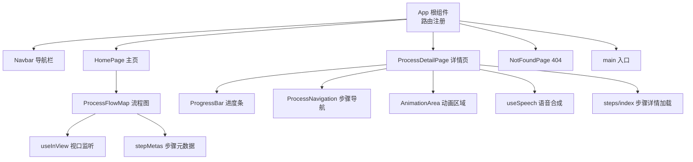
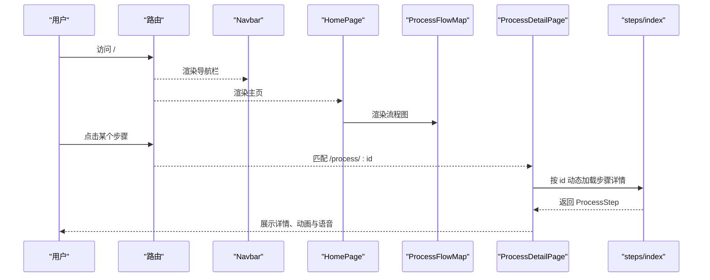
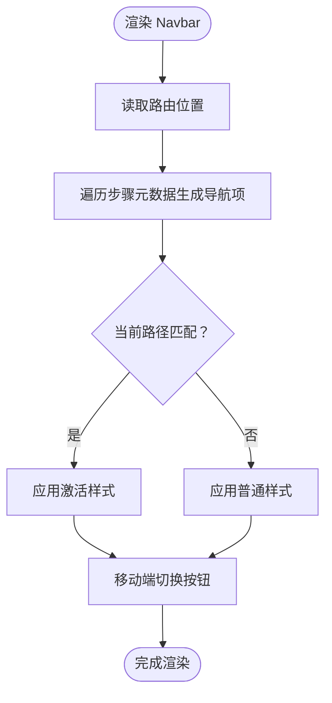
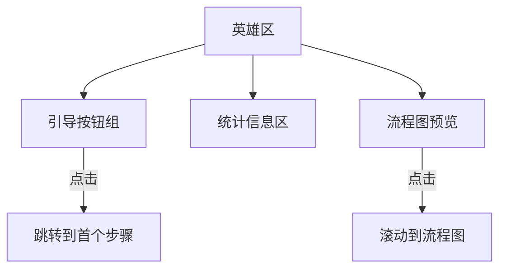
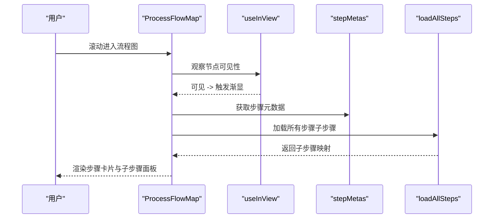
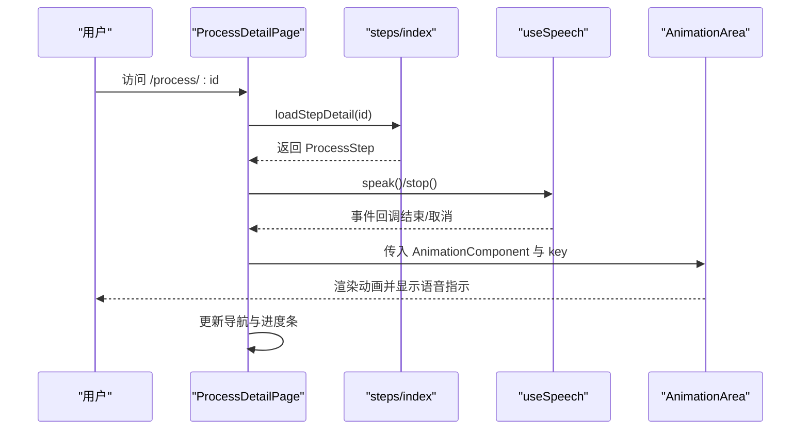
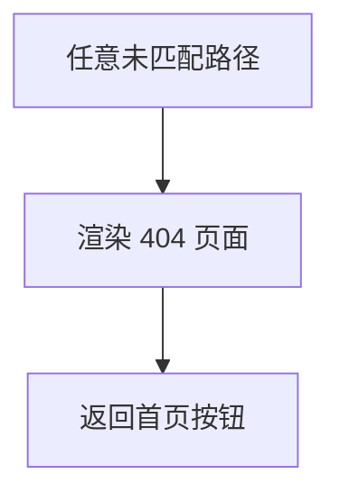
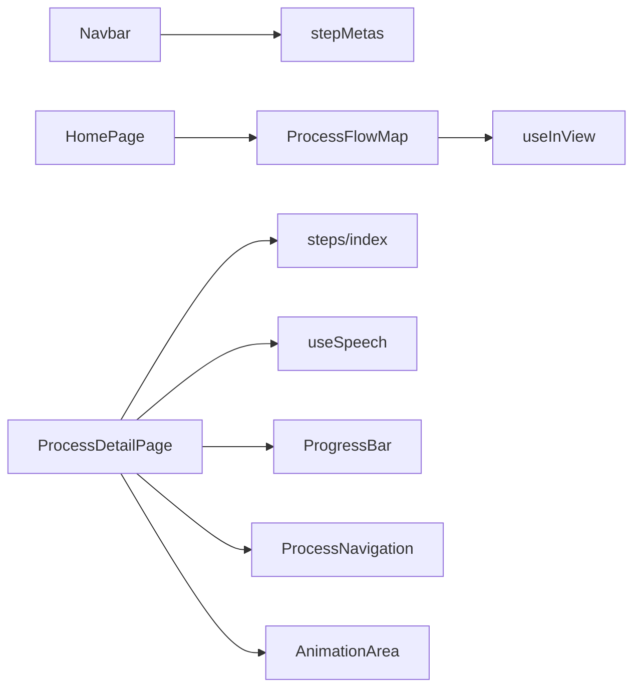

# 布局组件

<cite>
**本文引用的文件**
- [src/App.tsx](file://src/App.tsx)
- [src/main.tsx](file://src/main.tsx)
- [src/components/layout/Navbar.tsx](file://src/components/layout/Navbar.tsx)
- [src/components/layout/HomePage.tsx](file://src/components/layout/HomePage.tsx)
- [src/components/layout/ProcessFlowMap.tsx](file://src/components/layout/ProcessFlowMap.tsx)
- [src/components/layout/ProcessDetailPage.tsx](file://src/components/layout/ProcessDetailPage.tsx)
- [src/components/layout/NotFoundPage.tsx](file://src/components/layout/NotFoundPage.tsx)
- [src/components/ui/ProgressBar.tsx](file://src/components/ui/ProgressBar.tsx)
- [src/components/ui/ProcessNavigation.tsx](file://src/components/ui/ProcessNavigation.tsx)
- [src/components/ui/AnimationArea.tsx](file://src/components/ui/AnimationArea.tsx)
- [src/hooks/useSpeech.tsx](file://src/hooks/useSpeech.tsx)
- [src/hooks/useInView.tsx](file://src/hooks/useInView.tsx)
- [src/lib/utils.ts](file://src/lib/utils.ts)
- [src/data/stepMetas.ts](file://src/data/stepMetas.ts)
- [src/data/types.ts](file://src/data/types.ts)
- [src/data/steps/index.ts](file://src/data/steps/index.ts)
</cite>

## 目录
1. [简介](#简介)
2. [项目结构](#项目结构)
3. [核心组件](#核心组件)
4. [架构总览](#架构总览)
5. [详细组件分析](#详细组件分析)
6. [依赖关系分析](#依赖关系分析)
7. [性能考量](#性能考量)
8. [故障排查指南](#故障排查指南)
9. [结论](#结论)
10. [附录](#附录)

## 简介
本文件聚焦于布局组件体系，系统性解析导航栏、主页、流程图、详情页与404页面的实现与交互设计。文档涵盖路由集成、响应式布局、动画与语音讲解、状态管理与性能优化策略，并提供可操作的最佳实践与排障建议。

## 项目结构
- 应用通过路由在根组件中注册：首页、详情页与404页面。
- 布局组件位于 src/components/layout 下，包含导航栏、主页、流程图、详情页与404页面。
- UI辅助组件位于 src/components/ui，如进度条、步骤导航、动画区域等。
- 数据与类型定义位于 src/data，包含步骤元数据、类型声明与按需加载的步骤详情。
- 自定义 Hook 位于 src/hooks，提供视口监听与语音合成能力。
- 工具函数位于 src/lib，提供类名合并工具。

图表来源
- [src/App.tsx:1-23](file://src/App.tsx#L1-L23)
- [src/main.tsx:1-11](file://src/main.tsx#L1-L11)
- [src/components/layout/ProcessFlowMap.tsx:1-255](file://src/components/layout/ProcessFlowMap.tsx#L1-L255)
- [src/components/layout/ProcessDetailPage.tsx:1-397](file://src/components/layout/ProcessDetailPage.tsx#L1-L397)
- [src/components/ui/ProgressBar.tsx:1-60](file://src/components/ui/ProgressBar.tsx#L1-L60)
- [src/components/ui/ProcessNavigation.tsx:1-67](file://src/components/ui/ProcessNavigation.tsx#L1-L67)
- [src/components/ui/AnimationArea.tsx:1-29](file://src/components/ui/AnimationArea.tsx#L1-L29)
- [src/hooks/useSpeech.tsx:1-135](file://src/hooks/useSpeech.tsx#L1-L135)
- [src/hooks/useInView.tsx:1-32](file://src/hooks/useInView.tsx#L1-L32)
- [src/data/stepMetas.ts:1-103](file://src/data/stepMetas.ts#L1-L103)
- [src/data/steps/index.ts:1-34](file://src/data/steps/index.ts#L1-L34)

章节来源
- [src/App.tsx:1-23](file://src/App.tsx#L1-L23)
- [src/main.tsx:1-11](file://src/main.tsx#L1-L11)

## 核心组件
- 导航栏（Navbar）：基于路由位置高亮当前步骤，支持桌面端标签与移动端抽屉菜单；使用步骤元数据驱动导航项。
- 主页（HomePage）：包含英雄区、流程图预览与统计数据展示；提供“开始探索”与“浏览流程”引导。
- 流程图（ProcessFlowMap）：垂直时间轴渲染，支持展开/收起子步骤面板；使用视口监听实现入场动画；按需加载子步骤。
- 详情页（ProcessDetailPage）：按步骤ID加载详情，支持语音讲解、动画重播、步骤导航与公司信息展示；包含错误边界与加载态。
- 404 页面（NotFoundPage）：统一的未找到页面，提供返回首页的快捷入口。

章节来源
- [src/components/layout/Navbar.tsx:1-82](file://src/components/layout/Navbar.tsx#L1-L82)
- [src/components/layout/HomePage.tsx:1-85](file://src/components/layout/HomePage.tsx#L1-L85)
- [src/components/layout/ProcessFlowMap.tsx:1-255](file://src/components/layout/ProcessFlowMap.tsx#L1-L255)
- [src/components/layout/ProcessDetailPage.tsx:1-397](file://src/components/layout/ProcessDetailPage.tsx#L1-L397)
- [src/components/layout/NotFoundPage.tsx:1-27](file://src/components/layout/NotFoundPage.tsx#L1-L27)

## 架构总览
应用采用前端路由分发，布局组件作为页面骨架，配合UI组件与数据模块完成信息呈现与交互。详情页通过动态导入加载步骤详情，结合语音与动画提升体验。

图表来源
- [src/App.tsx:1-23](file://src/App.tsx#L1-L23)
- [src/components/layout/ProcessDetailPage.tsx:1-397](file://src/components/layout/ProcessDetailPage.tsx#L1-L397)
- [src/data/steps/index.ts:1-34](file://src/data/steps/index.ts#L1-L34)

## 详细组件分析

### 导航栏组件（Navbar）
- 路由集成：使用路由位置判断当前激活项，动态高亮对应步骤链接。
- 响应式设计：桌面端为横向标签，移动端以抽屉菜单呈现，按钮切换状态。
- 用户体验：图标与文字组合，序号与名称清晰；悬停高亮与发光效果增强反馈。
- 数据来源：步骤元数据驱动导航项生成，确保与后端数据一致。

图表来源
- [src/components/layout/Navbar.tsx:1-82](file://src/components/layout/Navbar.tsx#L1-L82)
- [src/data/stepMetas.ts:1-103](file://src/data/stepMetas.ts#L1-L103)

章节来源
- [src/components/layout/Navbar.tsx:1-82](file://src/components/layout/Navbar.tsx#L1-L82)
- [src/data/stepMetas.ts:1-103](file://src/data/stepMetas.ts#L1-L103)

### 主页组件（HomePage）
- 英雄区：渐变背景与发光粒子营造科技感；包含引导按钮与跳转锚点。
- 统计信息：网格展示核心指标，强调“十大工艺、纳米精度、上千工序、高良率”。
- 交互元素：按钮悬停发光、阴影增强；“开始探索”直达首个步骤，“浏览流程”锚定至流程图。
- 结构组织：语义化分区，便于SEO与无障碍访问。

图表来源
- [src/components/layout/HomePage.tsx:1-85](file://src/components/layout/HomePage.tsx#L1-L85)

章节来源
- [src/components/layout/HomePage.tsx:1-85](file://src/components/layout/HomePage.tsx#L1-L85)

### 流程图组件（ProcessFlowMap）
- 时间轴渲染：每一步包含圆形标记、连接线与卡片内容；最后一步无下划线。
- 步骤导航：点击步骤卡片或子步骤链接均可跳转详情页。
- 动画集成：使用视口监听，在进入可视区域时按序渐显，提升流畅度。
- 子步骤展开：支持展开/收起子步骤面板，异步加载子步骤数据。
- 样式与颜色：步骤颜色与发光色用于主题一致性，边框与渐变增强层次感。

图表来源
- [src/components/layout/ProcessFlowMap.tsx:1-255](file://src/components/layout/ProcessFlowMap.tsx#L1-L255)
- [src/hooks/useInView.tsx:1-32](file://src/hooks/useInView.tsx#L1-L32)
- [src/data/stepMetas.ts:1-103](file://src/data/stepMetas.ts#L1-L103)
- [src/data/steps/index.ts:1-34](file://src/data/steps/index.ts#L1-L34)

章节来源
- [src/components/layout/ProcessFlowMap.tsx:1-255](file://src/components/layout/ProcessFlowMap.tsx#L1-L255)
- [src/hooks/useInView.tsx:1-32](file://src/hooks/useInView.tsx#L1-L32)
- [src/data/stepMetas.ts:1-103](file://src/data/stepMetas.ts#L1-L103)
- [src/data/steps/index.ts:1-34](file://src/data/steps/index.ts#L1-L34)

### 详情页组件（ProcessDetailPage）
- 参数处理：通过路由参数解析步骤ID，定位当前步骤元数据与前后步骤。
- 动态内容加载：按ID动态导入步骤详情，避免打包体积过大；同时加载全部步骤以统计企业出现频次。
- 错误边界管理：当ID无效或详情加载失败时，提供“未找到该工艺步骤”的提示与返回首页链接。
- 交互元素：
  - 语音讲解：调用语音合成Hook，支持播放/停止；随语音状态更新按钮样式与指示器。
  - 动画重播：通过key强制重新挂载动画组件，确保每次切换步骤都重置动画。
  - 步骤导航：左右箭头导航，末尾自动回首页。
  - 进度条：实时显示当前步骤与整体进度百分比。
- 数据结构：详情页聚合关键指标、子步骤列表、企业信息与讲解文案，形成完整知识卡片。

图表来源
- [src/components/layout/ProcessDetailPage.tsx:1-397](file://src/components/layout/ProcessDetailPage.tsx#L1-L397)
- [src/data/steps/index.ts:1-34](file://src/data/steps/index.ts#L1-L34)
- [src/hooks/useSpeech.tsx:1-135](file://src/hooks/useSpeech.tsx#L1-L135)
- [src/components/ui/AnimationArea.tsx:1-29](file://src/components/ui/AnimationArea.tsx#L1-L29)

章节来源
- [src/components/layout/ProcessDetailPage.tsx:1-397](file://src/components/layout/ProcessDetailPage.tsx#L1-L397)
- [src/data/steps/index.ts:1-34](file://src/data/steps/index.ts#L1-L34)
- [src/hooks/useSpeech.tsx:1-135](file://src/hooks/useSpeech.tsx#L1-L135)
- [src/components/ui/AnimationArea.tsx:1-29](file://src/components/ui/AnimationArea.tsx#L1-L29)

### 404 页面（NotFoundPage）
- 处理机制：路由兜底匹配任意未命中路径，统一渲染404页面。
- 用户体验：居中布局、醒目标志、简明提示与返回首页按钮，降低用户困惑。
- 设计风格：延续整体配色与渐变背景，保持品牌一致性。

图表来源
- [src/App.tsx:1-23](file://src/App.tsx#L1-L23)
- [src/components/layout/NotFoundPage.tsx:1-27](file://src/components/layout/NotFoundPage.tsx#L1-L27)

章节来源
- [src/components/layout/NotFoundPage.tsx:1-27](file://src/components/layout/NotFoundPage.tsx#L1-L27)
- [src/App.tsx:1-23](file://src/App.tsx#L1-L23)

## 依赖关系分析
- 组件耦合：
  - Navbar 依赖步骤元数据与路由位置，耦合度低，复用性强。
  - HomePage 依赖流程图组件与步骤元数据，承担页面骨架职责。
  - ProcessFlowMap 依赖视口监听Hook与步骤元数据，内部状态管理子步骤展开。
  - ProcessDetailPage 依赖步骤详情加载模块、语音Hook与多个UI组件，状态集中且职责明确。
  - NotFoundPage 为纯展示组件，无业务逻辑依赖。
- 外部依赖：
  - 路由库负责页面分发与参数解析。
  - Web Speech API 提供中文语音合成能力。
  - IntersectionObserver 用于视口监听与动画触发。

图表来源
- [src/components/layout/Navbar.tsx:1-82](file://src/components/layout/Navbar.tsx#L1-L82)
- [src/components/layout/HomePage.tsx:1-85](file://src/components/layout/HomePage.tsx#L1-L85)
- [src/components/layout/ProcessFlowMap.tsx:1-255](file://src/components/layout/ProcessFlowMap.tsx#L1-L255)
- [src/components/layout/ProcessDetailPage.tsx:1-397](file://src/components/layout/ProcessDetailPage.tsx#L1-L397)
- [src/data/stepMetas.ts:1-103](file://src/data/stepMetas.ts#L1-L103)
- [src/data/steps/index.ts:1-34](file://src/data/steps/index.ts#L1-L34)
- [src/hooks/useSpeech.tsx:1-135](file://src/hooks/useSpeech.tsx#L1-L135)
- [src/hooks/useInView.tsx:1-32](file://src/hooks/useInView.tsx#L1-L32)
- [src/components/ui/ProgressBar.tsx:1-60](file://src/components/ui/ProgressBar.tsx#L1-L60)
- [src/components/ui/ProcessNavigation.tsx:1-67](file://src/components/ui/ProcessNavigation.tsx#L1-L67)
- [src/components/ui/AnimationArea.tsx:1-29](file://src/components/ui/AnimationArea.tsx#L1-L29)

章节来源
- [src/components/layout/ProcessDetailPage.tsx:1-397](file://src/components/layout/ProcessDetailPage.tsx#L1-L397)
- [src/data/steps/index.ts:1-34](file://src/data/steps/index.ts#L1-L34)

## 性能考量
- 代码分割与懒加载：详情页按ID动态导入步骤详情，减少首屏体积，提升初始加载速度。
- 视口监听与入场动画：仅在元素进入可视区域时触发动画，避免一次性渲染大量DOM带来的卡顿。
- 状态最小化：流程图展开状态与动画key独立管理，避免无关重渲染。
- 类名合并：使用工具函数合并Tailwind类，减少重复与冲突。
- 语音资源本地化：优先选择本地服务与神经音色，降低网络依赖与延迟。
- 缓存策略：语音偏好存储在本地，避免每次加载重新识别最优音色。

章节来源
- [src/data/steps/index.ts:1-34](file://src/data/steps/index.ts#L1-L34)
- [src/hooks/useInView.tsx:1-32](file://src/hooks/useInView.tsx#L1-L32)
- [src/lib/utils.ts:1-7](file://src/lib/utils.ts#L1-L7)
- [src/hooks/useSpeech.tsx:1-135](file://src/hooks/useSpeech.tsx#L1-L135)

## 故障排查指南
- 详情页空白或加载过久
  - 检查步骤ID是否存在于步骤元数据中。
  - 确认动态导入模块是否存在对应文件。
  - 查看网络面板确认按需模块是否成功加载。
- 语音无法播放
  - 确认浏览器支持 Web Speech API，且允许麦克风权限。
  - 检查系统音色列表是否可用，必要时手动设置首选音色。
- 动画不显示或闪烁
  - 检查视口监听是否生效，确保容器具备足够高度。
  - 确认动画组件已正确接收 key 并在切换时重置。
- 导航高亮异常
  - 检查路由路径与步骤ID是否一致，确认高亮逻辑匹配当前路径。
- 404 页面未出现
  - 确认路由配置中存在通配符兜底规则。

章节来源
- [src/components/layout/ProcessDetailPage.tsx:1-397](file://src/components/layout/ProcessDetailPage.tsx#L1-L397)
- [src/hooks/useSpeech.tsx:1-135](file://src/hooks/useSpeech.tsx#L1-L135)
- [src/hooks/useInView.tsx:1-32](file://src/hooks/useInView.tsx#L1-L32)
- [src/App.tsx:1-23](file://src/App.tsx#L1-L23)

## 结论
本布局组件体系通过清晰的路由分发、模块化的UI组件与按需加载策略，实现了从导航到详情的完整用户体验。流程图的时间轴渲染与动画集成提升了信息密度与可读性；详情页的语音与动画进一步增强了沉浸式学习体验。建议在后续迭代中持续关注首屏性能、语音稳定性与无障碍可达性。

## 附录
- 最佳实践
  - 使用步骤元数据统一驱动导航与标题，保证前后端一致性。
  - 对长列表与复杂动画启用视口监听与节流策略。
  - 将静态资源与动态模块分离，利用浏览器缓存提升二次访问速度。
  - 在语音播放前进行能力检测与权限提示，提供降级方案。
- 参考路径
  - 导航栏实现：[src/components/layout/Navbar.tsx:1-82](file://src/components/layout/Navbar.tsx#L1-L82)
  - 主页实现：[src/components/layout/HomePage.tsx:1-85](file://src/components/layout/HomePage.tsx#L1-L85)
  - 流程图实现：[src/components/layout/ProcessFlowMap.tsx:1-255](file://src/components/layout/ProcessFlowMap.tsx#L1-L255)
  - 详情页实现：[src/components/layout/ProcessDetailPage.tsx:1-397](file://src/components/layout/ProcessDetailPage.tsx#L1-L397)
  - 404 页面：[src/components/layout/NotFoundPage.tsx:1-27](file://src/components/layout/NotFoundPage.tsx#L1-L27)
  - 进度条组件：[src/components/ui/ProgressBar.tsx:1-60](file://src/components/ui/ProgressBar.tsx#L1-L60)
  - 步骤导航组件：[src/components/ui/ProcessNavigation.tsx:1-67](file://src/components/ui/ProcessNavigation.tsx#L1-L67)
  - 动画区域组件：[src/components/ui/AnimationArea.tsx:1-29](file://src/components/ui/AnimationArea.tsx#L1-L29)
  - 语音Hook：[src/hooks/useSpeech.tsx:1-135](file://src/hooks/useSpeech.tsx#L1-L135)
  - 视口监听Hook：[src/hooks/useInView.tsx:1-32](file://src/hooks/useInView.tsx#L1-L32)
  - 类名工具：[src/lib/utils.ts:1-7](file://src/lib/utils.ts#L1-L7)
  - 步骤元数据：[src/data/stepMetas.ts:1-103](file://src/data/stepMetas.ts#L1-L103)
  - 类型定义：[src/data/types.ts:1-33](file://src/data/types.ts#L1-L33)
  - 步骤详情加载：[src/data/steps/index.ts:1-34](file://src/data/steps/index.ts#L1-L34)
  - 根组件与路由：[src/App.tsx:1-23](file://src/App.tsx#L1-L23)
  - 应用入口：[src/main.tsx:1-11](file://src/main.tsx#L1-L11)