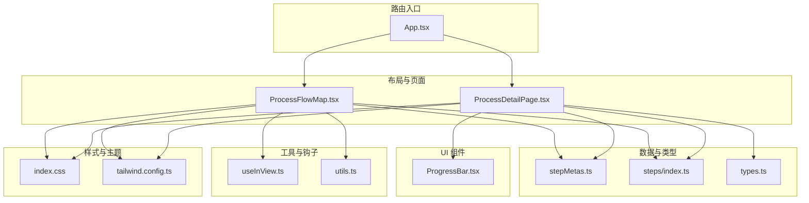
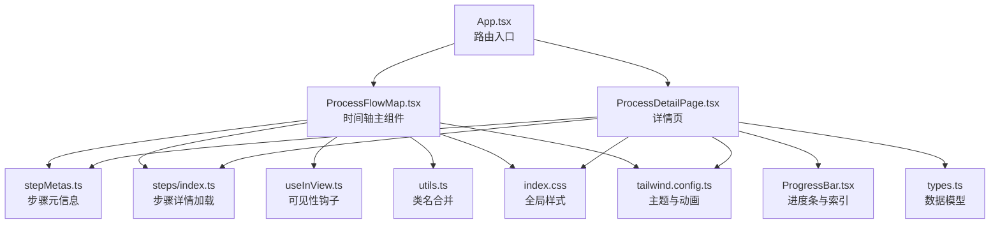
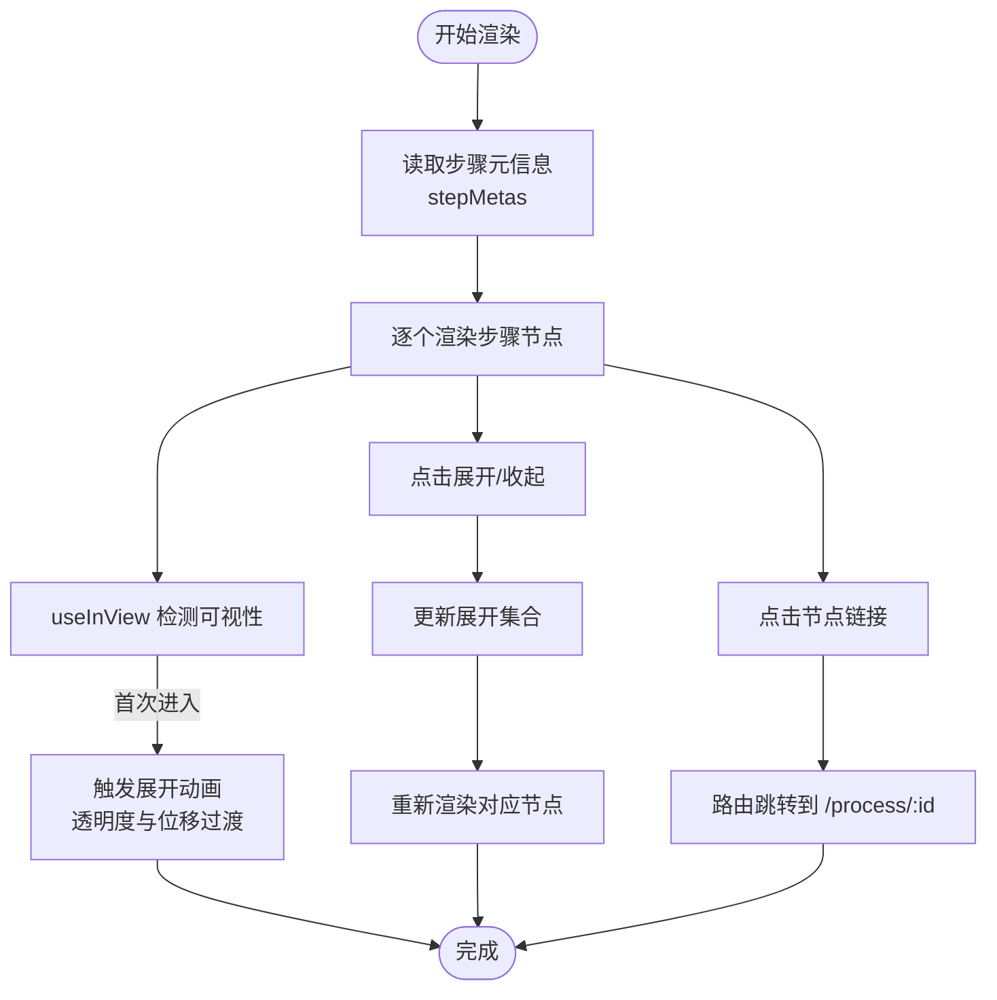
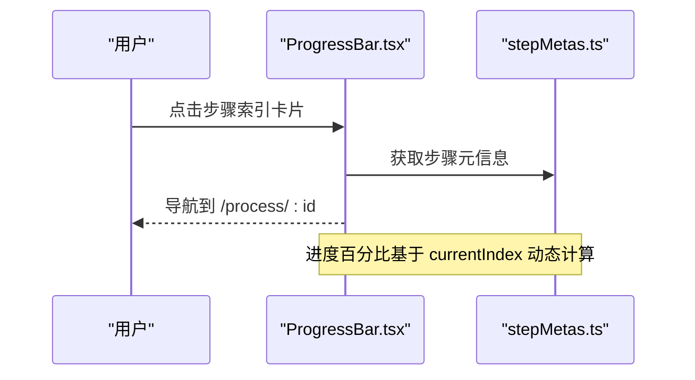
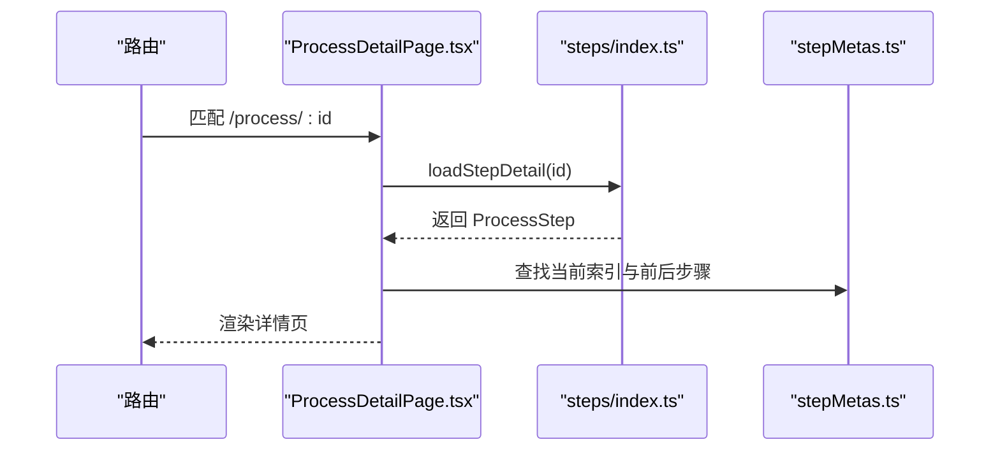
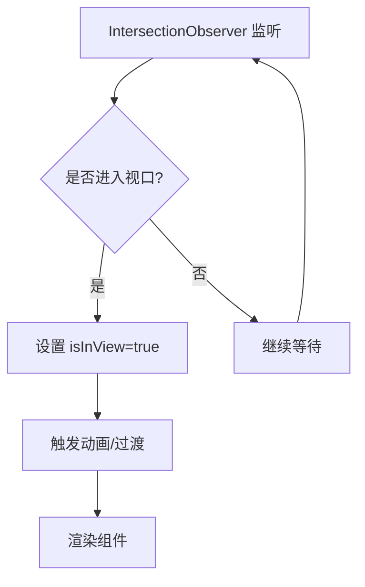
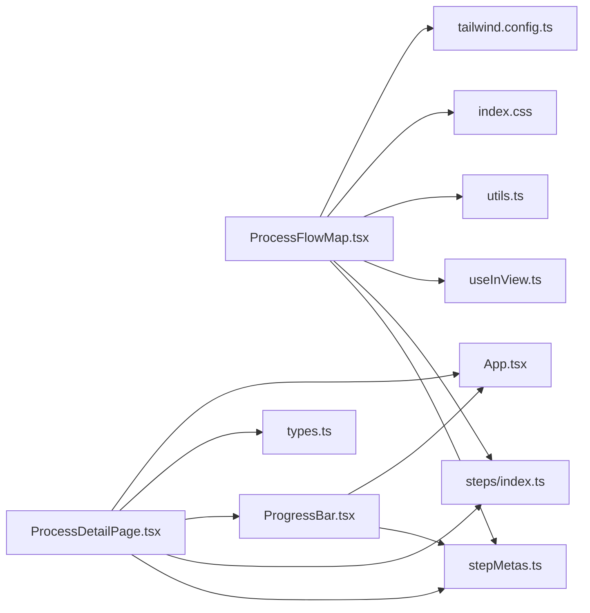

# 流程图组件

<cite>
**本文引用的文件**
- [ProcessFlowMap.tsx](file://src/components/layout/ProcessFlowMap.tsx)
- [ProgressBar.tsx](file://src/components/ui/ProgressBar.tsx)
- [ProcessDetailPage.tsx](file://src/components/layout/ProcessDetailPage.tsx)
- [stepMetas.ts](file://src/data/stepMetas.ts)
- [steps/index.ts](file://src/data/steps/index.ts)
- [types.ts](file://src/data/types.ts)
- [useInView.ts](file://src/hooks/useInView.ts)
- [index.css](file://src/index.css)
- [tailwind.config.ts](file://tailwind.config.ts)
- [App.tsx](file://src/App.tsx)
- [utils.ts](file://src/lib/utils.ts)
- [silicon-purification.ts](file://src/data/steps/silicon-purification.ts)
- [etching.ts](file://src/data/steps/etching.ts)
</cite>

## 目录
1. [简介](#简介)
2. [项目结构](#项目结构)
3. [核心组件](#核心组件)
4. [架构总览](#架构总览)
5. [详细组件分析](#详细组件分析)
6. [依赖关系分析](#依赖关系分析)
7. [性能考量](#性能考量)
8. [故障排查指南](#故障排查指南)
9. [结论](#结论)
10. [附录](#附录)

## 简介
本文件围绕“流程图组件”展开，重点解释垂直时间轴的实现架构，涵盖步骤节点渲染、连接线绘制与动画效果集成；详述流程图的数据驱动设计、动态内容生成与响应式布局适配；分析步骤状态管理、点击交互处理与路由导航机制；解释进度指示器的实现原理、完成状态标记与用户引导功能；并提供组件接口设计、数据格式规范与性能优化策略，辅以实际代码示例路径与扩展开发指导。

## 项目结构
本项目采用按功能域划分的目录组织方式，流程图相关的关键模块如下：
- 布局与页面
  - 进程总览与流程图：ProcessFlowMap.tsx
  - 工序详情页：ProcessDetailPage.tsx
- 数据与类型
  - 步骤元信息：stepMetas.ts
  - 动态加载步骤详情：steps/index.ts
  - 数据模型：types.ts
- UI 组件
  - 进度条与步骤索引：ProgressBar.tsx
- 工具与钩子
  - 可见性监听：useInView.ts
  - 工具函数：utils.ts
- 样式与主题
  - 全局样式：index.css
  - Tailwind 主题与动画：tailwind.config.ts
- 路由入口
  - 应用路由：App.tsx



**图表来源**
- [ProcessFlowMap.tsx:1-255](file://src/components/layout/ProcessFlowMap.tsx#L1-L255)
- [ProcessDetailPage.tsx:1-397](file://src/components/layout/ProcessDetailPage.tsx#L1-L397)
- [stepMetas.ts:1-103](file://src/data/stepMetas.ts#L1-L103)
- [steps/index.ts:1-34](file://src/data/steps/index.ts#L1-L34)
- [types.ts:1-33](file://src/data/types.ts#L1-L33)
- [ProgressBar.tsx:1-60](file://src/components/ui/ProgressBar.tsx#L1-L60)
- [useInView.ts:1-32](file://src/hooks/useInView.ts#L1-L32)
- [utils.ts:1-7](file://src/lib/utils.ts#L1-L7)
- [index.css:1-142](file://src/index.css#L1-L142)
- [tailwind.config.ts:1-143](file://tailwind.config.ts#L1-L143)
- [App.tsx:1-23](file://src/App.tsx#L1-L23)

**章节来源**
- [ProcessFlowMap.tsx:1-255](file://src/components/layout/ProcessFlowMap.tsx#L1-L255)
- [ProcessDetailPage.tsx:1-397](file://src/components/layout/ProcessDetailPage.tsx#L1-L397)
- [stepMetas.ts:1-103](file://src/data/stepMetas.ts#L1-L103)
- [steps/index.ts:1-34](file://src/data/steps/index.ts#L1-L34)
- [types.ts:1-33](file://src/data/types.ts#L1-L33)
- [ProgressBar.tsx:1-60](file://src/components/ui/ProgressBar.tsx#L1-L60)
- [useInView.ts:1-32](file://src/hooks/useInView.ts#L1-L32)
- [utils.ts:1-7](file://src/lib/utils.ts#L1-L7)
- [index.css:1-142](file://src/index.css#L1-L142)
- [tailwind.config.ts:1-143](file://tailwind.config.ts#L1-L143)
- [App.tsx:1-23](file://src/App.tsx#L1-L23)

## 核心组件
- 垂直时间轴主组件：ProcessFlowMap.tsx
  - 负责渲染步骤节点、连接线与展开面板，支持动画入场与子步骤懒加载。
- 进度条与步骤索引：ProgressBar.tsx
  - 基于当前索引计算完成百分比，展示步骤索引卡片与路由跳转。
- 工序详情页：ProcessDetailPage.tsx
  - 负责加载步骤详情、语音讲解、动画重播、关键指标与企业信息展示，并提供前后步骤导航。
- 步骤元数据：stepMetas.ts
  - 定义步骤的元信息（名称、图标、颜色、英文名等），作为时间轴与进度条的数据源。
- 动态加载步骤：steps/index.ts
  - 按需加载步骤详情模块，保证首屏性能与模块化维护。
- 可见性钩子：useInView.ts
  - 使用 IntersectionObserver 实现节点进入视口时的动画触发与可见性状态管理。
- 工具函数：utils.ts
  - 提供类名合并工具，简化条件样式拼接。
- 样式与主题：index.css、tailwind.config.ts
  - 提供暗色主题变量、渐变背景、发光阴影与丰富的动画 keyframes，支撑组件视觉表现。

**章节来源**
- [ProcessFlowMap.tsx:1-255](file://src/components/layout/ProcessFlowMap.tsx#L1-L255)
- [ProgressBar.tsx:1-60](file://src/components/ui/ProgressBar.tsx#L1-L60)
- [ProcessDetailPage.tsx:1-397](file://src/components/layout/ProcessDetailPage.tsx#L1-L397)
- [stepMetas.ts:1-103](file://src/data/stepMetas.ts#L1-L103)
- [steps/index.ts:1-34](file://src/data/steps/index.ts#L1-L34)
- [useInView.ts:1-32](file://src/hooks/useInView.ts#L1-L32)
- [utils.ts:1-7](file://src/lib/utils.ts#L1-L7)
- [index.css:1-142](file://src/index.css#L1-L142)
- [tailwind.config.ts:1-143](file://tailwind.config.ts#L1-L143)

## 架构总览
垂直时间轴采用“数据驱动 + 组件拆分”的架构模式：
- 数据层：stepMetas.ts 提供步骤元信息；steps/index.ts 提供按需加载的步骤详情。
- 视图层：ProcessFlowMap.tsx 渲染时间轴节点与连接线；ProgressBar.tsx 渲染进度条与步骤索引；ProcessDetailPage.tsx 负责详情页的综合展示。
- 交互层：useInView.ts 提供滚动触发动画；ProgressBar.tsx 内部 Link 支持步骤间导航；App.tsx 提供路由配置。
- 样式层：index.css 与 tailwind.config.ts 提供统一的主题变量、渐变与动画，确保视觉一致性与高性能动画。



**图表来源**
- [App.tsx:1-23](file://src/App.tsx#L1-L23)
- [ProcessFlowMap.tsx:1-255](file://src/components/layout/ProcessFlowMap.tsx#L1-L255)
- [ProcessDetailPage.tsx:1-397](file://src/components/layout/ProcessDetailPage.tsx#L1-L397)
- [stepMetas.ts:1-103](file://src/data/stepMetas.ts#L1-L103)
- [steps/index.ts:1-34](file://src/data/steps/index.ts#L1-L34)
- [ProgressBar.tsx:1-60](file://src/components/ui/ProgressBar.tsx#L1-L60)
- [types.ts:1-33](file://src/data/types.ts#L1-L33)
- [useInView.ts:1-32](file://src/hooks/useInView.ts#L1-L32)
- [utils.ts:1-7](file://src/lib/utils.ts#L1-L7)
- [index.css:1-142](file://src/index.css#L1-L142)
- [tailwind.config.ts:1-143](file://tailwind.config.ts#L1-L143)

## 详细组件分析

### 垂直时间轴组件（ProcessFlowMap.tsx）
- 节点渲染
  - 步骤节点 FlowStepNode：渲染步骤编号圆点、描述、展开按钮与子步骤面板；使用 useInView 控制入场动画与透明度过渡。
  - 连接线：通过相邻节点之间的竖直线段实现，使用渐变色与透明度营造层次感。
  - 子步骤面板：支持展开/收起，内部使用 Grid 的高度动画实现平滑切换；未加载时显示加载指示。
- 动画与交互
  - useInView：阈值与延迟结合，实现“阶梯式”入场动画，增强节奏感。
  - 点击展开：toggleStep 切换展开集合，影响对应节点的面板显示。
  - 路由跳转：节点标题与箭头按钮均指向 /process/:id，实现步骤导航。
- 响应式布局
  - 使用 Flex/Grid 与断点类，适配移动端与桌面端的间距与字体大小。
- 性能优化
  - 子步骤按需加载：首次渲染仅显示元信息，子步骤在展开时才请求详情。
  - 动画延迟：按索引递增的 transition-delay，避免同时触发大量动画造成卡顿。



**图表来源**
- [ProcessFlowMap.tsx:1-255](file://src/components/layout/ProcessFlowMap.tsx#L1-L255)
- [useInView.ts:1-32](file://src/hooks/useInView.ts#L1-L32)

**章节来源**
- [ProcessFlowMap.tsx:1-255](file://src/components/layout/ProcessFlowMap.tsx#L1-L255)
- [useInView.ts:1-32](file://src/hooks/useInView.ts#L1-L32)

### 进度条与步骤索引（ProgressBar.tsx）
- 数据驱动
  - 基于 processStepMetas 计算当前索引对应的进度百分比，动态更新宽度。
- 视觉反馈
  - 步骤索引卡片：当前步骤高亮、已完成步骤半透明、未完成步骤灰阶与缩放过渡。
  - 路由导航：每个索引卡片为 Link，点击即跳转到对应步骤详情页。
- 用户引导
  - 显示“当前步骤/总步骤数”与“完成百分比”，帮助用户定位学习进度。



**图表来源**
- [ProgressBar.tsx:1-60](file://src/components/ui/ProgressBar.tsx#L1-L60)
- [stepMetas.ts:1-103](file://src/data/stepMetas.ts#L1-L103)

**章节来源**
- [ProgressBar.tsx:1-60](file://src/components/ui/ProgressBar.tsx#L1-L60)
- [stepMetas.ts:1-103](file://src/data/stepMetas.ts#L1-L103)

### 工序详情页（ProcessDetailPage.tsx）
- 数据加载
  - 通过 useParams 获取当前步骤 id；调用 loadStepDetail 按需加载详情；同时通过 loadAllSteps 计算企业出现次数。
- 内容展示
  - 顶部面包屑与进度条；左侧动画区（含重播与语音控制）；右侧信息区（标题、描述、关键指标、子步骤与企业列表）。
- 交互与导航
  - 上一步/下一步导航：根据当前索引在 stepMetas 中查找 prev/next。
  - 语音讲解：基于 useSpeech 钩子，支持播放/停止与状态同步。
  - 动画重播：通过重置 key 强制重新挂载动画组件。
- 响应式布局
  - 使用 CSS Grid 与断点类，确保在小屏设备上内容仍清晰可读。



**图表来源**
- [ProcessDetailPage.tsx:1-397](file://src/components/layout/ProcessDetailPage.tsx#L1-L397)
- [steps/index.ts:1-34](file://src/data/steps/index.ts#L1-L34)
- [stepMetas.ts:1-103](file://src/data/stepMetas.ts#L1-L103)

**章节来源**
- [ProcessDetailPage.tsx:1-397](file://src/components/layout/ProcessDetailPage.tsx#L1-L397)
- [steps/index.ts:1-34](file://src/data/steps/index.ts#L1-L34)
- [stepMetas.ts:1-103](file://src/data/stepMetas.ts#L1-L103)

### 数据模型与动态加载（types.ts、steps/index.ts）
- 数据模型
  - ProcessStep：包含 id、name、nameEn、description、detail、subSteps、narration、icon、color、glowColor、keyMetrics、companies 等字段。
  - ProcessSubStep：包含 title、desc、companyRefs。
- 动态加载
  - 通过模块映射与动态 import 实现步骤详情的按需加载，避免一次性加载全部数据，降低首屏压力。
  - loadAllSteps 保持步骤顺序，便于构建索引与统计。

```mermaid
classDiagram
class ProcessStep {
+string id
+string name
+string nameEn
+string description
+string detail
+ProcessSubStep[] subSteps
+string narration
+string icon
+string color
+string glowColor
+{label : string,value : string}[] keyMetrics
+Company[] companies
}
class ProcessSubStep {
+string title
+string desc
+string[] companyRefs
}
class Company {
+string name
+string nameEn
+string country
+string flag
+string description
+string highlight
+string tag
+string category
}
ProcessStep --> ProcessSubStep : "包含多个"
ProcessStep --> Company : "关联多家企业"
```

**图表来源**
- [types.ts:1-33](file://src/data/types.ts#L1-L33)

**章节来源**
- [types.ts:1-33](file://src/data/types.ts#L1-L33)
- [steps/index.ts:1-34](file://src/data/steps/index.ts#L1-L34)

### 可见性与动画（useInView.ts、tailwind.config.ts、index.css）
- 可见性钩子
  - 使用 IntersectionObserver 监听元素进入视口，设置 isInView 状态，驱动动画与过渡。
- 动画系统
  - tailwind.config.ts 定义了多种 keyframes 与动画，如脉冲、滑入、粒子上升、刻蚀进度等，组件通过类名直接复用。
  - index.css 提供主题变量与渐变背景，确保动画色彩与整体风格一致。



**图表来源**
- [useInView.ts:1-32](file://src/hooks/useInView.ts#L1-L32)
- [tailwind.config.ts:1-143](file://tailwind.config.ts#L1-L143)
- [index.css:1-142](file://src/index.css#L1-L142)

**章节来源**
- [useInView.ts:1-32](file://src/hooks/useInView.ts#L1-L32)
- [tailwind.config.ts:1-143](file://tailwind.config.ts#L1-L143)
- [index.css:1-142](file://src/index.css#L1-L142)

## 依赖关系分析
- 组件耦合
  - ProcessFlowMap.tsx 依赖 stepMetas.ts、steps/index.ts、useInView.ts、utils.ts 与样式文件，职责清晰、耦合度低。
  - ProgressBar.tsx 依赖 stepMetas.ts 与路由 Link，轻量且可复用。
  - ProcessDetailPage.tsx 依赖上述所有数据与组件，承担“页面容器”角色。
- 外部依赖
  - react-router-dom：提供路由与导航。
  - lucide-react：提供图标。
  - tailwindcss 与 tailwindcss-animate：提供样式与动画系统。
- 循环依赖
  - 未发现循环依赖；数据与组件分离良好。



**图表来源**
- [ProcessFlowMap.tsx:1-255](file://src/components/layout/ProcessFlowMap.tsx#L1-L255)
- [ProgressBar.tsx:1-60](file://src/components/ui/ProgressBar.tsx#L1-L60)
- [ProcessDetailPage.tsx:1-397](file://src/components/layout/ProcessDetailPage.tsx#L1-L397)
- [stepMetas.ts:1-103](file://src/data/stepMetas.ts#L1-L103)
- [steps/index.ts:1-34](file://src/data/steps/index.ts#L1-L34)
- [types.ts:1-33](file://src/data/types.ts#L1-L33)
- [useInView.ts:1-32](file://src/hooks/useInView.ts#L1-L32)
- [utils.ts:1-7](file://src/lib/utils.ts#L1-L7)
- [index.css:1-142](file://src/index.css#L1-L142)
- [tailwind.config.ts:1-143](file://tailwind.config.ts#L1-L143)
- [App.tsx:1-23](file://src/App.tsx#L1-L23)

**章节来源**
- [ProcessFlowMap.tsx:1-255](file://src/components/layout/ProcessFlowMap.tsx#L1-L255)
- [ProgressBar.tsx:1-60](file://src/components/ui/ProgressBar.tsx#L1-L60)
- [ProcessDetailPage.tsx:1-397](file://src/components/layout/ProcessDetailPage.tsx#L1-L397)
- [stepMetas.ts:1-103](file://src/data/stepMetas.ts#L1-L103)
- [steps/index.ts:1-34](file://src/data/steps/index.ts#L1-L34)
- [types.ts:1-33](file://src/data/types.ts#L1-L33)
- [useInView.ts:1-32](file://src/hooks/useInView.ts#L1-L32)
- [utils.ts:1-7](file://src/lib/utils.ts#L1-L7)
- [index.css:1-142](file://src/index.css#L1-L142)
- [tailwind.config.ts:1-143](file://tailwind.config.ts#L1-L143)
- [App.tsx:1-23](file://src/App.tsx#L1-L23)

## 性能考量
- 模块按需加载
  - 通过动态 import 与模块映射，仅在需要时加载步骤详情，减少初始包体积。
- 可见性触发动画
  - 使用 useInView 在元素进入视口时触发动画，避免一次性渲染所有动画导致的卡顿。
- 动画延迟与节流
  - 时间轴节点使用递增的 transition-delay，形成“阶梯式”动画，提升观感同时控制资源占用。
- 组件重用与样式复用
  - 通过 Tailwind 类与主题变量统一风格，减少自定义样式的开销。
- 首屏优化
  - 详情页在加载过程中显示骨架与进度提示，改善感知性能。

[本节为通用性能建议，不直接分析具体文件，故无“章节来源”]

## 故障排查指南
- 路由无法跳转
  - 检查 App.tsx 的路由配置与 Link 的 to 字段是否匹配。
  - 参考：[App.tsx:1-23](file://src/App.tsx#L1-L23)
- 步骤详情未显示
  - 确认步骤 id 是否存在于 stepMetas.ts；检查 steps/index.ts 的模块映射是否正确。
  - 参考：[stepMetas.ts:1-103](file://src/data/stepMetas.ts#L1-L103)、[steps/index.ts:1-34](file://src/data/steps/index.ts#L1-L34)
- 动画不生效
  - 检查 useInView 的阈值与 rootMargin 设置；确认 tailwind.config.ts 中的动画 keyframes 已启用。
  - 参考：[useInView.ts:1-32](file://src/hooks/useInView.ts#L1-L32)、[tailwind.config.ts:1-143](file://tailwind.config.ts#L1-L143)
- 样式异常
  - 检查 index.css 的主题变量与渐变背景是否正确；确认 Tailwind 已正确编译。
  - 参考：[index.css:1-142](file://src/index.css#L1-L142)、[tailwind.config.ts:1-143](file://tailwind.config.ts#L1-L143)

**章节来源**
- [App.tsx:1-23](file://src/App.tsx#L1-L23)
- [stepMetas.ts:1-103](file://src/data/stepMetas.ts#L1-L103)
- [steps/index.ts:1-34](file://src/data/steps/index.ts#L1-L34)
- [useInView.ts:1-32](file://src/hooks/useInView.ts#L1-L32)
- [tailwind.config.ts:1-143](file://tailwind.config.ts#L1-L143)
- [index.css:1-142](file://src/index.css#L1-L142)

## 结论
本流程图组件通过“数据驱动 + 组件拆分 + 可见性动画 + 按需加载”的架构，实现了垂直时间轴的高效渲染与流畅体验。ProgressBar 提供直观的进度与导航，ProcessDetailPage 将数据、动画与交互整合为完整的教学体验。样式系统与动画库确保了视觉一致性与性能表现。整体设计具备良好的可扩展性与可维护性。

[本节为总结性内容，不直接分析具体文件，故无“章节来源”]

## 附录

### 组件接口设计与数据格式规范
- 步骤元信息（ProcessStepMeta）
  - 字段：id、name、nameEn、description、icon、color、glowColor
  - 用途：时间轴节点与进度条索引的数据源
  - 参考：[stepMetas.ts:1-103](file://src/data/stepMetas.ts#L1-L103)
- 工序详情（ProcessStep）
  - 字段：id、name、nameEn、description、detail、subSteps、narration、icon、color、glowColor、keyMetrics、companies
  - 用途：详情页内容与动画、语音、企业信息的数据源
  - 参考：[types.ts:19-32](file://src/data/types.ts#L19-L32)
- 子步骤（ProcessSubStep）
  - 字段：title、desc、companyRefs
  - 用途：详情页子步骤列表与企业标签
  - 参考：[types.ts:12-17](file://src/data/types.ts#L12-L17)
- 企业（Company）
  - 字段：name、nameEn、country、flag、description、highlight、tag、category
  - 用途：详情页企业卡片与标签
  - 参考：[types.ts:1-10](file://src/data/types.ts#L1-L10)

**章节来源**
- [stepMetas.ts:1-103](file://src/data/stepMetas.ts#L1-L103)
- [types.ts:1-33](file://src/data/types.ts#L1-L33)

### 实际代码示例路径
- 垂直时间轴主组件
  - [ProcessFlowMap.tsx:200-255](file://src/components/layout/ProcessFlowMap.tsx#L200-L255)
- 进度条与步骤索引
  - [ProgressBar.tsx:8-59](file://src/components/ui/ProgressBar.tsx#L8-L59)
- 工序详情页
  - [ProcessDetailPage.tsx:36-397](file://src/components/layout/ProcessDetailPage.tsx#L36-L397)
- 步骤元信息
  - [stepMetas.ts:11-102](file://src/data/stepMetas.ts#L11-L102)
- 动态加载步骤
  - [steps/index.ts:16-33](file://src/data/steps/index.ts#L16-L33)
- 可见性钩子
  - [useInView.ts:8-31](file://src/hooks/useInView.ts#L8-L31)
- 样式与主题
  - [index.css:5-51](file://src/index.css#L5-L51)
  - [tailwind.config.ts:67-136](file://tailwind.config.ts#L67-L136)
- 路由入口
  - [App.tsx:7-20](file://src/App.tsx#L7-L20)

### 扩展开发指导
- 新增步骤
  - 在 stepMetas.ts 中添加新的步骤元信息；在 steps/index.ts 中注册动态加载模块；在 ProcessDetailPage 的动画映射中添加对应动画组件。
  - 参考：[stepMetas.ts:11-102](file://src/data/stepMetas.ts#L11-L102)、[steps/index.ts:3-14](file://src/data/steps/index.ts#L3-L14)、[ProcessDetailPage.tsx:23-34](file://src/components/layout/ProcessDetailPage.tsx#L23-L34)
- 自定义动画
  - 在 tailwind.config.ts 中新增 keyframes 与 animation；在组件中通过类名应用动画。
  - 参考：[tailwind.config.ts:67-136](file://tailwind.config.ts#L67-L136)
- 交互增强
  - 可在 FlowStepNode 中增加更多交互状态（如完成标记、收藏等），并在 ProgressBar 中同步状态。
  - 参考：[ProcessFlowMap.tsx:50-196](file://src/components/layout/ProcessFlowMap.tsx#L50-L196)、[ProgressBar.tsx:28-56](file://src/components/ui/ProgressBar.tsx#L28-L56)
- 性能优化
  - 对子步骤面板使用虚拟滚动（如需）；对动画使用 prefers-reduced-motion；对图片与媒体资源进行懒加载。
  - 参考：[index.css:133-140](file://src/index.css#L133-L140)

**章节来源**
- [stepMetas.ts:11-102](file://src/data/stepMetas.ts#L11-L102)
- [steps/index.ts:3-14](file://src/data/steps/index.ts#L3-L14)
- [ProcessDetailPage.tsx:23-34](file://src/components/layout/ProcessDetailPage.tsx#L23-L34)
- [tailwind.config.ts:67-136](file://tailwind.config.ts#L67-L136)
- [ProcessFlowMap.tsx:50-196](file://src/components/layout/ProcessFlowMap.tsx#L50-L196)
- [ProgressBar.tsx:28-56](file://src/components/ui/ProgressBar.tsx#L28-L56)
- [index.css:133-140](file://src/index.css#L133-L140)