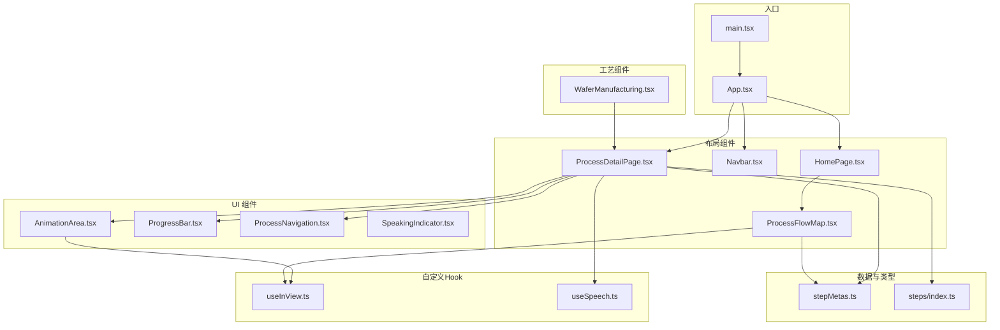
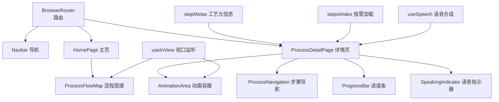
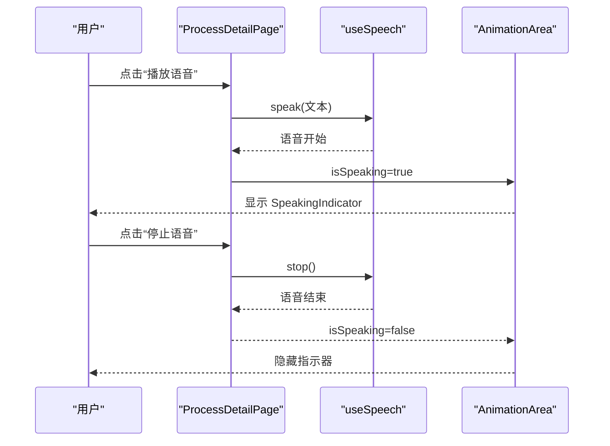
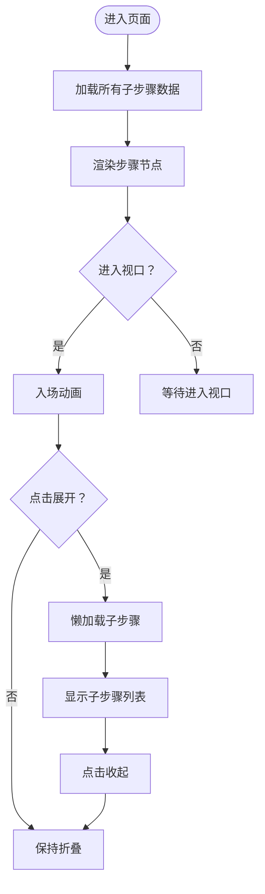
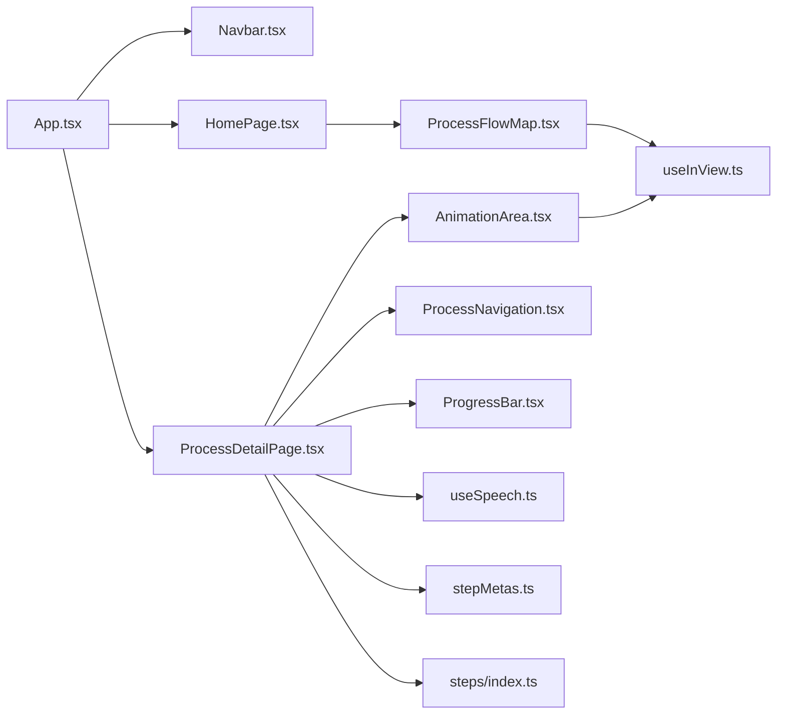

# 核心组件

<cite>
**本文引用的文件**
- [src/App.tsx](file://src/App.tsx)
- [src/main.tsx](file://src/main.tsx)
- [src/components/layout/HomePage.tsx](file://src/components/layout/HomePage.tsx)
- [src/components/layout/Navbar.tsx](file://src/components/layout/Navbar.tsx)
- [src/components/layout/ProcessDetailPage.tsx](file://src/components/layout/ProcessDetailPage.tsx)
- [src/components/layout/ProcessFlowMap.tsx](file://src/components/layout/ProcessFlowMap.tsx)
- [src/components/ui/AnimationArea.tsx](file://src/components/ui/AnimationArea.tsx)
- [src/components/ui/ProcessNavigation.tsx](file://src/components/ui/ProcessNavigation.tsx)
- [src/components/ui/SpeakingIndicator.tsx](file://src/components/ui/SpeakingIndicator.tsx)
- [src/components/process/WaferManufacturing.tsx](file://src/components/process/WaferManufacturing.tsx)
- [src/data/stepMetas.ts](file://src/data/stepMetas.ts)
- [src/data/steps/index.ts](file://src/data/steps/index.ts)
- [src/hooks/useInView.ts](file://src/hooks/useInView.ts)
- [src/hooks/useSpeech.ts](file://src/hooks/useSpeech.ts)
- [src/lib/utils.ts](file://src/lib/utils.ts)
</cite>

## 目录
1. [简介](#简介)
2. [项目结构](#项目结构)
3. [核心组件](#核心组件)
4. [架构总览](#架构总览)
5. [详细组件分析](#详细组件分析)
6. [依赖分析](#依赖分析)
7. [性能考虑](#性能考虑)
8. [故障排查指南](#故障排查指南)
9. [结论](#结论)
10. [附录](#附录)

## 简介
本项目是一个以“芯片制造全流程”为主题的演示应用，采用 React + TypeScript 构建，结合路由、动画与语音讲解，帮助用户以交互方式了解半导体制造的十大核心工艺。本文档聚焦于三大类核心组件：布局组件（Layout）、工艺组件（Process）与通用 UI 组件（UI），系统阐述其职责分离、复用策略、依赖关系与通信机制，并提供使用示例、最佳实践、可扩展性与定制化建议，以及动画与交互实现要点。

## 项目结构
项目采用按功能域分层的组织方式：
- 布局组件：负责页面骨架、导航与流程概览
- 工艺组件：负责具体工艺的可视化动画
- UI 组件：负责通用交互控件（动画区域、进度条、导航、语音指示器）
- 数据与类型：集中定义工艺元信息、步骤数据加载与类型声明
- 自定义 Hook：提供视口监听与语音合成能力
- 工具函数：提供样式合并工具

图表来源
- [src/main.tsx:1-11](file://src/main.tsx#L1-L11)
- [src/App.tsx:1-23](file://src/App.tsx#L1-L23)
- [src/components/layout/HomePage.tsx:1-85](file://src/components/layout/HomePage.tsx#L1-L85)
- [src/components/layout/Navbar.tsx:1-82](file://src/components/layout/Navbar.tsx#L1-L82)
- [src/components/layout/ProcessDetailPage.tsx:1-397](file://src/components/layout/ProcessDetailPage.tsx#L1-L397)
- [src/components/layout/ProcessFlowMap.tsx:1-255](file://src/components/layout/ProcessFlowMap.tsx#L1-L255)
- [src/components/ui/AnimationArea.tsx:1-29](file://src/components/ui/AnimationArea.tsx#L1-L29)
- [src/components/ui/ProcessNavigation.tsx:1-67](file://src/components/ui/ProcessNavigation.tsx#L1-L67)
- [src/components/ui/SpeakingIndicator.tsx:1-28](file://src/components/ui/SpeakingIndicator.tsx#L1-L28)
- [src/components/process/WaferManufacturing.tsx:1-122](file://src/components/process/WaferManufacturing.tsx#L1-L122)
- [src/data/stepMetas.ts:1-103](file://src/data/stepMetas.ts#L1-L103)
- [src/data/steps/index.ts:1-34](file://src/data/steps/index.ts#L1-L34)
- [src/hooks/useInView.ts:1-32](file://src/hooks/useInView.ts#L1-L32)
- [src/hooks/useSpeech.ts:1-135](file://src/hooks/useSpeech.ts#L1-L135)
- [src/lib/utils.ts:1-7](file://src/lib/utils.ts#L1-L7)

章节来源
- [src/App.tsx:1-23](file://src/App.tsx#L1-L23)
- [src/main.tsx:1-11](file://src/main.tsx#L1-L11)

## 核心组件
本节对三大类核心组件进行职责与接口梳理，强调复用策略与可扩展性。

- 布局组件（Layout）
  - HomePage：主页内容与统计展示，内嵌流程图谱组件
  - Navbar：顶部导航栏，响应式设计，动态高亮当前步骤
  - ProcessDetailPage：工艺详情页，聚合动画区、进度条、导航、公司卡片、语音控制
  - ProcessFlowMap：垂直时间轴流程图谱，支持展开/收起子步骤，懒加载子步骤数据

- 工艺组件（Process）
  - 以单个 SVG 动画为核心，通过 props 注入到动画区域组件，实现“数据驱动”的动画切换与重播

- UI 组件（UI）
  - AnimationArea：动画容器，基于视口可见性控制渲染时机，支持“正在讲解”指示器
  - ProcessNavigation：前后步骤导航，适配移动端与桌面端
  - SpeakingIndicator：语音讲解时的波形指示器，随机高度增强真实感
  - ProgressBar：顶部进度条，基于当前步骤索引渲染

- 数据与类型
  - stepMetas：定义十大工艺的元信息（名称、英文名、图标、颜色、渐变色等）
  - steps/index：按需异步加载各工艺的详细数据模块

- 自定义 Hook
  - useInView：基于 IntersectionObserver 的视口监听 Hook
  - useSpeech：封装 Web Speech API，自动选择中文语音、缓存偏好、统一控制播放/停止

- 工具函数
  - utils/cn：基于 clsx/tailwind-merge 的类名合并工具

章节来源
- [src/components/layout/HomePage.tsx:1-85](file://src/components/layout/HomePage.tsx#L1-L85)
- [src/components/layout/Navbar.tsx:1-82](file://src/components/layout/Navbar.tsx#L1-L82)
- [src/components/layout/ProcessDetailPage.tsx:1-397](file://src/components/layout/ProcessDetailPage.tsx#L1-L397)
- [src/components/layout/ProcessFlowMap.tsx:1-255](file://src/components/layout/ProcessFlowMap.tsx#L1-L255)
- [src/components/ui/AnimationArea.tsx:1-29](file://src/components/ui/AnimationArea.tsx#L1-L29)
- [src/components/ui/ProcessNavigation.tsx:1-67](file://src/components/ui/ProcessNavigation.tsx#L1-L67)
- [src/components/ui/SpeakingIndicator.tsx:1-28](file://src/components/ui/SpeakingIndicator.tsx#L1-L28)
- [src/data/stepMetas.ts:1-103](file://src/data/stepMetas.ts#L1-L103)
- [src/data/steps/index.ts:1-34](file://src/data/steps/index.ts#L1-L34)
- [src/hooks/useInView.ts:1-32](file://src/hooks/useInView.ts#L1-L32)
- [src/hooks/useSpeech.ts:1-135](file://src/hooks/useSpeech.ts#L1-L135)
- [src/lib/utils.ts:1-7](file://src/lib/utils.ts#L1-L7)

## 架构总览
应用采用“路由驱动 + 数据懒加载 + Hook 复用”的架构模式：
- 路由层：BrowserRouter 提供 SPA 路由，App 定义顶层路由与导航
- 页面层：HomePage、ProcessDetailPage、ProcessFlowMap 等页面组件
- 交互层：AnimationArea、ProcessNavigation、SpeakingIndicator 等 UI 组件
- 数据层：stepMetas 提供静态元信息；steps/index 提供按需异步加载的详细数据
- 能力层：useInView 实现视口感知；useSpeech 封装语音合成

图表来源
- [src/App.tsx:1-23](file://src/App.tsx#L1-L23)
- [src/components/layout/ProcessDetailPage.tsx:1-397](file://src/components/layout/ProcessDetailPage.tsx#L1-L397)
- [src/components/layout/ProcessFlowMap.tsx:1-255](file://src/components/layout/ProcessFlowMap.tsx#L1-L255)
- [src/components/ui/AnimationArea.tsx:1-29](file://src/components/ui/AnimationArea.tsx#L1-L29)
- [src/components/ui/ProcessNavigation.tsx:1-67](file://src/components/ui/ProcessNavigation.tsx#L1-L67)
- [src/components/ui/SpeakingIndicator.tsx:1-28](file://src/components/ui/SpeakingIndicator.tsx#L1-L28)
- [src/data/stepMetas.ts:1-103](file://src/data/stepMetas.ts#L1-L103)
- [src/data/steps/index.ts:1-34](file://src/data/steps/index.ts#L1-L34)
- [src/hooks/useInView.ts:1-32](file://src/hooks/useInView.ts#L1-L32)
- [src/hooks/useSpeech.ts:1-135](file://src/hooks/useSpeech.ts#L1-L135)

## 详细组件分析

### 布局组件

#### HomePage
- 职责：主页内容、统计信息与流程图谱入口
- 关键点：
  - 使用进程元信息生成“开始探索”链接
  - 内嵌 ProcessFlowMap，用于浏览全流程
  - 统计区块展示核心指标
- 复用策略：与 Navbar 共享进程元信息，保持导航与主页一致的步骤顺序

章节来源
- [src/components/layout/HomePage.tsx:1-85](file://src/components/layout/HomePage.tsx#L1-L85)

#### Navbar
- 职责：顶部导航，响应式菜单，高亮当前步骤
- 关键点：
  - 基于路由位置判断激活态
  - 移动端折叠菜单，点击后自动关闭
  - 与进程元信息联动，保证导航一致性
- 复用策略：共享进程元信息，避免硬编码

章节来源
- [src/components/layout/Navbar.tsx:1-82](file://src/components/layout/Navbar.tsx#L1-L82)
- [src/data/stepMetas.ts:1-103](file://src/data/stepMetas.ts#L1-L103)

#### ProcessDetailPage
- 职责：渲染单个工艺的详细信息与动画
- 关键点：
  - 通过路由参数加载对应工艺详情
  - 动画组件映射表根据 id 动态选择
  - 语音讲解控制：播放/停止、结束回调、重播动画
  - 公司卡片：统计每家企业参与的步骤数量，用于标签权重
  - 步骤导航：上一步/下一步或回到首页
- 生命周期管理：
  - 切换路由时重置动画 key，停止语音
  - 监听语音结束事件，更新状态
- 可扩展性：新增工艺只需在映射表与数据模块中注册

图表来源
- [src/components/layout/ProcessDetailPage.tsx:82-108](file://src/components/layout/ProcessDetailPage.tsx#L82-L108)
- [src/hooks/useSpeech.ts:74-112](file://src/hooks/useSpeech.ts#L74-L112)
- [src/components/ui/AnimationArea.tsx:24-26](file://src/components/ui/AnimationArea.tsx#L24-L26)

章节来源
- [src/components/layout/ProcessDetailPage.tsx:1-397](file://src/components/layout/ProcessDetailPage.tsx#L1-L397)
- [src/hooks/useSpeech.ts:1-135](file://src/hooks/useSpeech.ts#L1-L135)
- [src/components/ui/AnimationArea.tsx:1-29](file://src/components/ui/AnimationArea.tsx#L1-L29)

#### ProcessFlowMap
- 职责：垂直时间轴展示所有工艺步骤，支持展开/收起子步骤
- 关键点：
  - 使用 useInView 控制首次进入时的入场动画
  - 子步骤懒加载：首次展开时才请求数据
  - 展开面板使用 CSS gridTemplateRows 控制高度过渡
- 复用策略：子组件 FlowStepNode/FlowSubStep 抽象出节点与子步骤项，便于复用

图表来源
- [src/components/layout/ProcessFlowMap.tsx:200-254](file://src/components/layout/ProcessFlowMap.tsx#L200-L254)
- [src/hooks/useInView.ts:15-28](file://src/hooks/useInView.ts#L15-L28)
- [src/data/steps/index.ts:23-33](file://src/data/steps/index.ts#L23-L33)

章节来源
- [src/components/layout/ProcessFlowMap.tsx:1-255](file://src/components/layout/ProcessFlowMap.tsx#L1-L255)
- [src/data/steps/index.ts:1-34](file://src/data/steps/index.ts#L1-L34)
- [src/hooks/useInView.ts:1-32](file://src/hooks/useInView.ts#L1-L32)

### 工艺组件

#### WaferManufacturingAnimation
- 职责：展示“晶圆制造”阶段的 SVG 动画（单晶硅锭→切片→抛光→形成晶圆）
- 关键点：
  - 使用 CSS 动画与 SVG 元素组合实现缩放、抖动、粒子闪烁等效果
  - 通过变量与延迟实现多层晶圆依次出现
- 复用策略：作为函数组件直接传入 AnimationArea，实现“数据驱动”的切换与重播

章节来源
- [src/components/process/WaferManufacturing.tsx:1-122](file://src/components/process/WaferManufacturing.tsx#L1-L122)
- [src/components/ui/AnimationArea.tsx:11-22](file://src/components/ui/AnimationArea.tsx#L11-L22)

### UI 组件

#### AnimationArea
- 职责：动画容器，控制渲染时机与“正在讲解”指示器
- 关键点：
  - 基于 useInView 的阈值控制，仅在进入视口时渲染动画
  - 通过 animationKey 强制重新挂载，实现动画重播
  - 支持根据工艺色系生成径向渐变背景
- 复用策略：接收任意动画组件，解耦布局与动画实现

章节来源
- [src/components/ui/AnimationArea.tsx:1-29](file://src/components/ui/AnimationArea.tsx#L1-L29)
- [src/hooks/useInView.ts:1-32](file://src/hooks/useInView.ts#L1-L32)

#### ProcessNavigation
- 职责：前后步骤导航，适配移动端与桌面端
- 关键点：
  - 上一步/下一步或返回首页/完成
  - 根据是否存在上下文设置不同样式与文案

章节来源
- [src/components/ui/ProcessNavigation.tsx:1-67](file://src/components/ui/ProcessNavigation.tsx#L1-L67)

#### SpeakingIndicator
- 职责：语音讲解时的波形指示器
- 关键点：
  - 随机高度柱状条，配合脉冲动画增强真实感
  - 固定定位在动画区域底部居中

章节来源
- [src/components/ui/SpeakingIndicator.tsx:1-28](file://src/components/ui/SpeakingIndicator.tsx#L1-L28)

### 数据与类型

#### stepMetas
- 职责：定义十大工艺的元信息（id、名称、英文名、描述、图标、颜色、发光色）
- 复用策略：被 Navbar、ProcessFlowMap、ProcessDetailPage 共同使用，确保视觉与语义一致

章节来源
- [src/data/stepMetas.ts:1-103](file://src/data/stepMetas.ts#L1-L103)

#### steps/index
- 职责：按需异步加载各工艺的详细数据模块
- 关键点：
  - loadStepDetail：按 id 加载单个工艺详情
  - loadAllSteps：批量加载所有工艺详情，用于统计企业参与次数

章节来源
- [src/data/steps/index.ts:1-34](file://src/data/steps/index.ts#L1-L34)

### 自定义 Hook

#### useInView
- 职责：基于 IntersectionObserver 的视口监听
- 关键点：
  - 默认阈值与 rootMargin 可配置
  - 返回 ref 与 isInView，便于在组件中控制渲染时机

章节来源
- [src/hooks/useInView.ts:1-32](file://src/hooks/useInView.ts#L1-L32)

#### useSpeech
- 职责：封装 Web Speech API，提供中文语音合成
- 关键点：
  - 自动评分与选择最佳中文语音
  - 缓存用户偏好的语音名称
  - 统一的 speak/stop 接口，支持速率、音调、音量调节
  - 提供可用语音列表与手动设置偏好

章节来源
- [src/hooks/useSpeech.ts:1-135](file://src/hooks/useSpeech.ts#L1-L135)

## 依赖分析
- 组件间依赖
  - App → Navbar/HomePage/ProcessDetailPage/NotFoundPage
  - HomePage → ProcessFlowMap
  - ProcessDetailPage → AnimationArea/ProcessNavigation/ProgressBar/CompanyCard/useSpeech
  - AnimationArea → useInView/SpeakingIndicator
  - ProcessFlowMap → stepMetas/useInView
- 数据依赖
  - 所有页面依赖 stepMetas 与 steps/index
- 能力依赖
  - useInView 与 useSpeech 为横切关注点，被多个组件复用

图表来源
- [src/App.tsx:1-23](file://src/App.tsx#L1-L23)
- [src/components/layout/HomePage.tsx:1-85](file://src/components/layout/HomePage.tsx#L1-L85)
- [src/components/layout/ProcessDetailPage.tsx:1-397](file://src/components/layout/ProcessDetailPage.tsx#L1-L397)
- [src/components/layout/ProcessFlowMap.tsx:1-255](file://src/components/layout/ProcessFlowMap.tsx#L1-L255)
- [src/components/ui/AnimationArea.tsx:1-29](file://src/components/ui/AnimationArea.tsx#L1-L29)
- [src/components/ui/ProcessNavigation.tsx:1-67](file://src/components/ui/ProcessNavigation.tsx#L1-L67)
- [src/hooks/useInView.ts:1-32](file://src/hooks/useInView.ts#L1-L32)
- [src/hooks/useSpeech.ts:1-135](file://src/hooks/useSpeech.ts#L1-L135)
- [src/data/stepMetas.ts:1-103](file://src/data/stepMetas.ts#L1-L103)
- [src/data/steps/index.ts:1-34](file://src/data/steps/index.ts#L1-L34)

章节来源
- [src/App.tsx:1-23](file://src/App.tsx#L1-L23)
- [src/components/layout/ProcessDetailPage.tsx:1-397](file://src/components/layout/ProcessDetailPage.tsx#L1-L397)
- [src/components/layout/ProcessFlowMap.tsx:1-255](file://src/components/layout/ProcessFlowMap.tsx#L1-L255)
- [src/components/ui/AnimationArea.tsx:1-29](file://src/components/ui/AnimationArea.tsx#L1-L29)
- [src/hooks/useInView.ts:1-32](file://src/hooks/useInView.ts#L1-L32)
- [src/hooks/useSpeech.ts:1-135](file://src/hooks/useSpeech.ts#L1-L135)
- [src/data/stepMetas.ts:1-103](file://src/data/stepMetas.ts#L1-L103)
- [src/data/steps/index.ts:1-34](file://src/data/steps/index.ts#L1-L34)

## 性能考虑
- 懒加载与按需渲染
  - ProcessFlowMap 在首次进入视口时才执行入场动画，减少初始渲染压力
  - AnimationArea 仅在进入视口时渲染动画组件，避免不必要的 DOM 与计算
- 动画重播与资源释放
  - 通过 animationKey 强制重新挂载，确保动画状态重置
  - 语音讲解结束后及时停止，避免后台占用
- 数据加载优化
  - steps/index 使用 Promise.all 并行加载所有工艺详情，提升首屏体验
- 视口监听
  - useInView 使用 IntersectionObserver，避免频繁重排与滚动事件监听

[本节为通用性能讨论，不直接分析具体文件]

## 故障排查指南
- 语音无法播放
  - 检查浏览器是否支持 Web Speech API
  - 若语音列表为空，等待 onvoiceschanged 事件后再尝试
  - 确认已正确设置中文语言环境
- 动画不显示
  - 确认 AnimationArea 所在元素已进入视口
  - 检查 animationKey 是否被正确递增以触发重新挂载
- 导航高亮异常
  - 确认路由路径与 stepMetas 中的 id 一致
  - 检查 useLocation 的路径匹配逻辑
- 子步骤不显示
  - 确认 steps/index 中已注册对应 id 的模块
  - 检查懒加载是否成功返回默认导出

章节来源
- [src/hooks/useSpeech.ts:74-112](file://src/hooks/useSpeech.ts#L74-L112)
- [src/components/ui/AnimationArea.tsx:11-22](file://src/components/ui/AnimationArea.tsx#L11-L22)
- [src/components/layout/ProcessFlowMap.tsx:205-213](file://src/components/layout/ProcessFlowMap.tsx#L205-L213)
- [src/data/steps/index.ts:16-21](file://src/data/steps/index.ts#L16-L21)

## 结论
本项目通过清晰的职责划分与强大的复用策略，实现了布局、工艺与 UI 的解耦协作。借助路由、Hook 与数据模块化，组件具备良好的可扩展性与可维护性。动画与语音的结合提升了用户体验，同时保持了前端性能与可访问性的平衡。后续可在以下方面持续优化：
- 增加更多工艺动画与数据模块
- 丰富语音讲解内容与多语言支持
- 优化移动端交互细节与无障碍体验
- 引入状态管理以简化跨组件通信

[本节为总结性内容，不直接分析具体文件]

## 附录

### 组件使用示例与最佳实践
- 新增工艺步骤
  - 在 stepMetas 中添加新步骤元信息
  - 在 steps/index 中注册对应的异步加载模块
  - 在 ProcessDetailPage 的动画映射表中加入新组件
- 自定义动画组件
  - 保持组件无副作用，通过 props 接收数据
  - 使用 CSS 动画而非 JS 动画以获得更佳性能
- 语音讲解
  - 文案尽量简洁易懂，避免过长段落
  - 合理设置语速与音调，兼顾清晰度与自然度
- 可访问性
  - 为按钮与链接提供明确的 aria-label
  - 为图片与图标提供替代文本
  - 确保键盘可操作与焦点可见

[本节为通用指导，不直接分析具体文件]